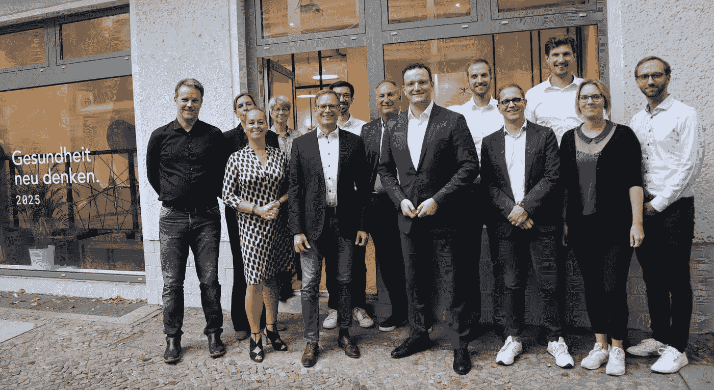

# 政府中的数据科学实验

> 原文：<https://towardsdatascience.com/data-science-experiments-in-government-f61c692e2ac3?source=collection_archive---------21----------------------->

## [社区聚焦](https://towardsdatascience.com/tagged/community-spotlight)

## 德国卫生部塑造数据基础设施和立法

*在 Community Spotlight 系列中，TDS 编辑与数据科学社区成员畅谈有助于推动该领域发展的激动人心的计划。今天，我们很高兴地分享*[*Elliot Gunn*](https://medium.com/u/aad1101621dd?source=post_page-----f61c692e2ac3--------------------------------)*与*[*Lars Roem held*](https://medium.com/u/ea4059de5473?source=post_page-----f61c692e2ac3--------------------------------)*，* ***艾主任&数据*** *在* [***健康创新中心***](https://hih-2025.de/en/home/) ，*德国卫生部的一个数字化工作队的对话*

hih 团队，与德国卫生部长 Jens Spahn(中)。拉斯·罗姆赫德从右数第三。(图片由 hih 提供)

Lars Roemheld 是德国卫生部数字化工作小组的 AI 数据主任。他之前在人工智能专家 QuantCo 担任高级职位，在那里他使用机器学习为美国和欧洲的金融、零售和医疗保健组织开发反欺诈和定价解决方案。作为一名数据科学家和哲学家，他拥有斯坦福大学和海德堡大学的学位。Lars Roemheld 是因果推理、机器学习以及越来越多的政府奇妙运作方面的专家。你可以在[*Twitter*](https://twitter.com/LarsRoemheld)*和*[*Medium*](https://medium.com/@lars.roemheld)*上关注他。*

健康创新中心(hih)有一个有趣的使命陈述:“hih 是联邦卫生部的智囊团、陪练和实施支持者。”您能分享更多关于数据科学团队在 hih 的工作吗？它在哪些方面充当“陪练”？

健康创新中心(hih)是作为政府的一项实验而创建的:为了创建一个“数字任务组”，卫生部在 2019 年创建了一个小型专家小组，他们全职为该部工作，但也作为一个独立的智库。这种设置被证明是有效的:设计为一个有时间限制的项目，并提供市场价格补偿，hih 将一个多元化的专业团体聚集在一起进行“政策工作”。

在过去的几年里，与该部合作的特点是灵活的距离——我们的办公室距离该部只有两个街区，并且有更多的创业氛围。有时，这意味着我们要和部里的同事日夜坐在一起。其他时候，我们能够在政府规范之外保持一种更加“自由思考”的氛围。

在数据科学领域，我们的工作大致分为三类:政策支持、决策者教育和动手项目。医疗保健中的人工智能是一个令人兴奋的领域。但由于它相对较新，政府对其技术的深入理解仍然相对匮乏。我们围绕数据访问和数据共享、数据标准的互操作性、医疗设备测试、责任和公平等主题，帮助形成思维和立法。

真正让 hih 的工作与众不同的是跨职能、跨学科的团队:我们汇集了医生、药剂师、IT 经理、记者、数据科学家、律师和经济学家。创建具有如此不同的现实世界背景的项目舱，使我们能够迅速提出务实的解决方案，这对于任何一个单独的学科来说都是很难看到的。

政府智囊团如何识别有前途的项目？与一个独立的智库相比，当一个智库嵌入政府内部时，它所能完成的事情有什么独特之处吗？

被安排在部里对我们来说完全不同:我们不是一个游说组织，我们的产出不以政策文件来衡量。相反，我们能够直接支持该部同事的工作。

政府往往以令人震惊的孤立方式工作:即使在同一个部里，一个部门往往不知道另一个部门在做什么。作为这些结构中的局外人，我们有幸“天真地”跳过了许多规范，并跨职能将人们联系起来。

**你认为哪些与健康相关的项目最好由像 hih 这样的政府机构来解决，而不是由 AI 和 DS 中的营利性机构来解决？**

深度技术工作的实际工作可能最好留给行业专业人士去做。然而，在医疗保健和其他领域，这些专业人员需要基础设施来做好他们的工作。政府必须发挥作用，以公平和安全的方式提供这种基础设施。一些例子:

*   允许获得代表性的培训，尤其是测试数据，同时保护公民的隐私权。这通常比仅仅在互联网上发布一个 csv 文件要复杂得多:匿名化、联合学习和基于查询的系统是所使用的一些方法。有一天，我们可能会看到对测试数据代表性的定量检查。
*   尤其是基于深度学习的医疗应用，往往带有一定的黑箱味道。作为负责保护患者免受医疗事故(数字或其他形式)的监管机构，如何决定哪些算法可以进入医疗设备市场，哪些不可以并不简单。我们需要对医疗人工智能的安全和负责任的发展提出可靠的要求，以遏制夸张的营销主张。相反，可信的需求可以帮助遵从的软件制造商解决来自已建立的医疗保健世界的怀疑。
*   几乎在任何地方，准政府机构都设计了强制“报销”的经济体系——谁在医疗保健中得到多少钱，以及什么服务和产品。这在本质上是困难的，因为支付者(保险)通常不同于消费者(病人),而且激励可能是不一致的。这并不新鲜；但新一代人工智能医疗设备为节约成本和减少浪费带来了新的机遇和挑战。

我认为在医疗保健领域实施 ML 项目是一项具有挑战性的工作。hih 是否与其他利益相关者合作？它是如何自我扩展的？

作为我们使命宣言的一部分，我们与广泛的合作伙伴合作:从政府机构到创业公司和学术界。

在高层次上，我不认为联邦政策有伸缩性的问题——为立法的细节贡献好的想法可以让想法在全国范围内快速“伸缩”。也就是说，立法过程有时会让人感觉缓慢。但总的来说，我很惊讶在过去的四年里，由于正确的领导，部里有多少“灵活的立法”是可能的。

**你能告诉我们团队特别引以为豪的一个项目吗？**

我想强调三个非常不同的项目:

1.德国去年为医疗保险公司报销的数字医疗应用创建了首个快速通道。超过 24 种所谓的“地高辛”现在可以由德国各地的医生开出，下载到智能手机上，并由保险公司支付。从数据隐私到患者安全和成本，hih 团队帮助克服了法律和实践挑战。

2.新冠肺炎对车队来说是一个特殊的，当然也是意想不到的挑战。很早以前，我们邀请了一群学者和软件制造商来集思广益，寻找潜在的数字解决方案。从这个群体中，诞生了使用蓝牙进行联系追踪的想法。从概念验证开始，我们在 Corona-Warn-App (CWA)项目的整个开发过程中为其提供支持。最终，德国的 CWA 成为全球首批具有隐私意识的联系人追踪应用之一，作为政府开源项目发布；所有可用的证据表明，该应用程序有助于减缓新冠肺炎感染。

3.德国的公共医疗保险系统为大约 7500 万患者提供服务。这使得德国医疗保健索赔数据集成为世界上最大和最具代表性的数据集之一。从明年开始，该数据集将通过所谓的“Forschungsdatenzentrum”提供给学术研究，这实际上是 BfArM 大学的一个基于查询的系统。

你喜欢什么样的 DS/ML 写作，你更希望看到什么？

我喜欢有“真实”感觉的报告——太多的博客文章从 Kaggle 风格的干净数据开始，没有历史或“数据生成过程”真正的数据科学不是这样工作的:有人在创建数据，你有测量误差，如果你非常仔细地看，你仍然可以看到实习生在 2016 年意外删除的那些行。我认为真正优秀的项目能够很好地理解现实世界，并能够将其映射到正确的数据科学工具。我经常发现，一个理由充分的损失函数选择，或者一个聪明的数据选择模式，或者一个现成的迁移学习想法，比如何实现最后 3%的准确率更有见地。

**你对未来几个月或几年的 DS/ML 社区有什么希望？**

我希望围绕技术的炒作会减少，对数据生成过程的同情会增加。这是否意味着理解医院的医生、护士和流程，或者财务数据中的偏见，或者照片数据库中的虚假陈述。就我个人而言，我对因果推理领域非常感兴趣:部分原因是因为想法、技术和应用。但也许更重要的是，因为因果世界观迫使我们作为数据科学家首先考虑我们试图解决的确切问题。

想在健康创新中心了解更多关于数据科学的知识吗？在 [LinkedIn](https://www.linkedin.com/company/health-innovation-hub/) 、 [Twitter](https://twitter.com/hih2025) 和 [YouTube](https://www.youtube.com/channel/UC7biqAPHlOdh24GcLKifUkw) 上关注他们。这里有其他文章分享了利用机器学习造福社会的项目案例研究。

*   "[自然中的因果推理:弹性定价](/causal-inference-example-elasticity-de4a3e2e621b)"(2021 年 7 月，TDS): Lars Roemheld 介绍了一个如何在行业中使用因果推理的例子，应用于真实世界的数据集。
*   [为什么新冠肺炎危机可能会给医疗保健系统带来一线希望](https://hih-2025.de/en/why-the-covid-19-crisis-may-have-a-silver-lining-for-the-health-care-system/)(hih):hih 团队分享了一个案例研究，即德国联邦当局如何与一家初创公司合作，启动一项基于人群的研究项目，以应对新冠肺炎病毒。