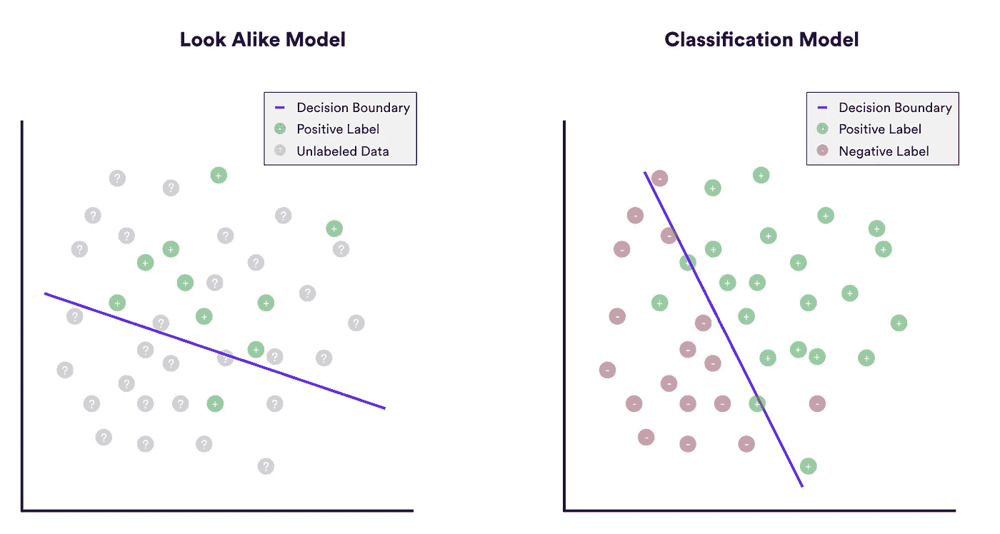
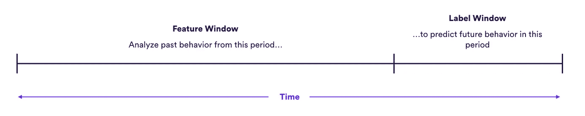
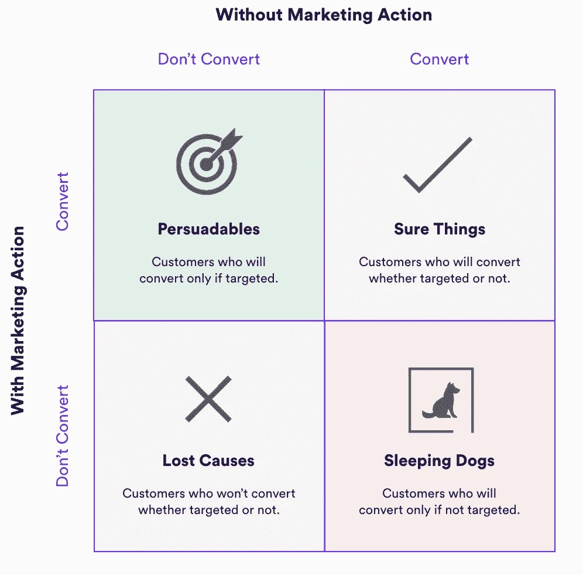

# 广告细分市场的数据科学:超越相似建模

> 原文：<https://towardsdatascience.com/data-science-for-ad-segments-moving-beyond-look-alike-modeling-fc0b97ed8bb6?source=collection_archive---------4----------------------->

## *分段分类、转换预测和隆起建模*

图片由 [Chuttersnap](https://unsplash.com/@chuttersnap) 在 [Unsplash](https://unsplash.com/)

外观相似的建模是最流行的方法之一，用于扩大广告片段的大小，以增加广告客户的覆盖范围。[脸书于 2013 年在其平台上引入了外观相似建模](https://www.adweek.com/performance-marketing/lookalike-audiences/)，一些广告技术提供商在其产品中提供了外观相似建模版本。然而，正如我们将在本帖中展示的，看起来相似的模型在实践中经常导致脆弱和不准确的片段。各种其他机器学习(ML)方法——包括分类和提升——几乎总是比看起来相似的模型产生更好的性能。由于这些限制，我们认为只有在其他技术不可用的情况下，才应该谨慎使用 Look Alikes。

**什么是长相相似的细分市场？**

顾名思义，相似模型的目标是找到与一组已知用户“看起来”相似的受众。创建一个基本的外观相似的片段通常需要指定两条信息-

*   **种子集:**长相相似的受众应该基于哪一组用户？
*   **细分规模:**受众应该有多大？更大的受众意味着更广泛的影响，但与你的种子集的总体相似性更小。

例如，广告客户可以使用 1，000 个已知房主的集合(种子集合)来建立与这些房主相似的 50，000 个外观相似(细分规模)的受众。

**相似模型的局限性**

外观相似建模因其简单性和可用性而广受欢迎，但它也带来了严重的限制，往往会阻碍广告的表现。

从技术角度来看，外观相似建模通常是通过一种被称为 [PU 学习](https://en.wikipedia.org/wiki/One-class_classification)的[半监督](https://en.wikipedia.org/wiki/Semi-supervised_learning) ML 方法来完成的。这意味着，使用关于种子集(即*正* *集*)中用户的信息来学习相似模型，而不考虑属于种子集*不*的用户(*负* *标签*)。

这有助于使看起来相似的模型易于使用——所有人需要的是一个积极标签的种子集，以建立一个细分市场。但这也意味着，如果你不注意如何定义你的细分市场，看起来相似的模型容易产生偏见。具体来说，外观相似模型将搜索种子集中用户共享的任何特征，即使该特征不是该集合的唯一特征。

为了说明，让我们考虑一个例子。假设一家商业银行刚刚推出了一款新的商业贷款产品，并希望在我们的网站上向一万名小企业主(SBO)做广告。这是我们掌握的数据-

*   该网站有 100 万活跃用户
*   在这 100 万用户中，有 10 万人注册了个人资料，并在注册时指定了自己的职位
*   在这 10 万用户中，有 2000 人表示他们是小企业主(SBO)

我们的目标是使用这 2k 个 SBO 的种子集来构建一个看起来相似的模型，该模型(a)分析种子集的现场行为模式，以及(b)找到 8k 个其他相似的用户。但问题是——小企业所有权并不是种子用户共享的唯一特征；他们也都是注册用户。由于注册用户的行为可能与未注册用户非常不同，我们的模型可能会抓住这一差异，并预测完全由注册用户组成的相似受众，无论他们是否是小企业主。

这种类型的错误在涉及外观相似建模的实际场景中很常见——模型会找到种子集共有的特征，但与我们想要实现的目标无关。ML 指标可能显示出很强的培训绩效，但活动在现实世界中表现不佳。

其他基于 ML 的方法有助于规避外观相似建模的这些限制，从而带来更好的活动结果。这些方法包括分类、转换预测和提升，我们将在本文的剩余部分进行介绍。

**备选方案 1:分类**

[分类](https://en.wikipedia.org/wiki/Binary_classification#:~:text=Binary%20classification%20is%20the%20task,basis%20of%20a%20classification%20rule.)是一种常见的机器学习类型，它试图划分两组数据:正集和负集。应用于广告环境，分类类似于 Look Alike，因为其目标是预测哪些用户类似于种子细分。但是通过学习关于在那个片段中谁*是*和谁*不是*的信息，分类通常会导致更好的结果。

让我们回到上面的例子，涉及一家银行向 SBOs 做广告。外观相似建模是不够的，因为我们的种子集包含了注册用户形式的隐藏特征。这一特性被证明是统一种子集行为的主导因素，因此与小企业所有权相关的微弱信号被忽略了。

假设我们使用一个分类模型-

*   **正集:**职务等同于“小企业主”的注册用户
*   **否定集:**职称不等于“小企业主”的注册用户

通过包含我们知道不是 SBO 的其他注册用户的信息，我们迫使模型根据相关因素区分用户:他们可能是小企业主吗？这两个集合都包含注册用户，因此模型不能简单地依赖于注册用户与未注册用户的行为来划分这两个群体。

作者图片

**备选方案#2:转换预测**

分类可以帮助提高你的广告片段的质量，但它们仍然有改进的空间。特别地，广告的目标通常是驱动特定的用户行为，这是基于用户特征的分类模型不能直接优化的。行为预测有助于解决这一差距，使您能够针对最有可能采取特定行动的用户开展活动，例如参与广告，或进一步降低销售漏斗。鉴于近年来点击付费和转化付费广告的兴起，这种策略尤其有效。

为了真实地描述这些预测，让我们假设商业银行现在想要运行一个针对点击优化的新广告，以便收集销售线索。对于那些有兴趣点击广告的人来说，一部分可能的 SBO 可能是一个不错的代理，但它并不完美——不可避免地会有一些 SBO 不在贷款市场上，而其他人目前不是 SBO，但正在考虑创业，可能有兴趣了解更多关于银行贷款产品的信息。直接预测哪些用户可能会点击广告可以帮助回避这些问题。

作者图片

**备选方案#3:隆起预测**

如果银行的最终目标是影响下游客户的行为，而不是简单地推动点击量，[提升](https://marketingtechnews.net/news/2021/jan/27/its-time-to-stop-wasting-marketing-spend-and-start-using-uplift-models/)预测可能会更有效。提升建模旨在预测每个客户可能会对特定的干预(例如，有针对性的广告)做出何种反应。即使在可能点击的用户中，广告的效果(就获得贷款的可能性而言)也可能因不同用户而异。对一些人来说，广告可能会说服他们购买。对其他人来说，这可能没有影响。其他人可能会对银行及其产品留下更坏的印象，并且将来不太可能贷款。提升可以帮助识别这些群组，以确保广告只针对那些它将帮助推动增量交易的用户。

作者图片

**结论**

第三方 cookies 的消亡预示着企业必须充分利用第三方数据的力量。幸运的是，广告技术行业继续经历大量与数据相关的创新。特别是，机器学习技术帮助广告商创建了比以往任何时候都更有针对性、覆盖面更广的广告活动。大多数企业现在都熟悉外观相似建模，但在实践中，其他 ML 技术往往会产生更好的结果。通过将更先进的 ML 技术与独特的第一方数据相结合，组织能够提供真正与众不同的优质广告产品。