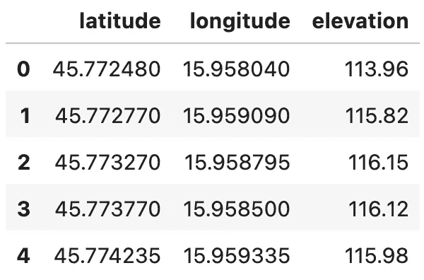
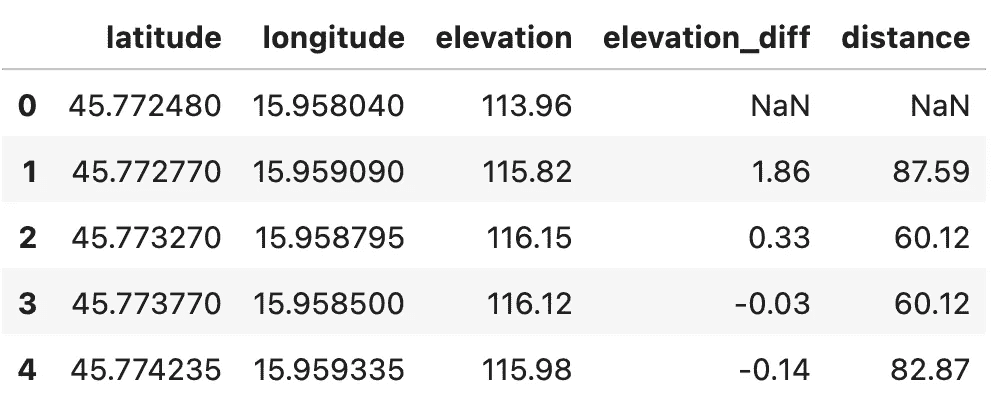
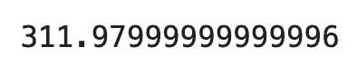
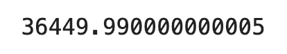
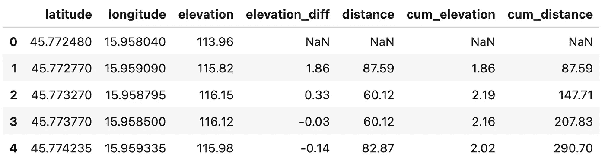
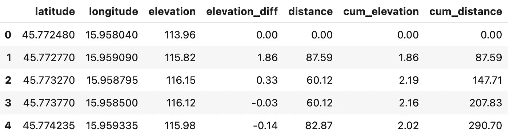
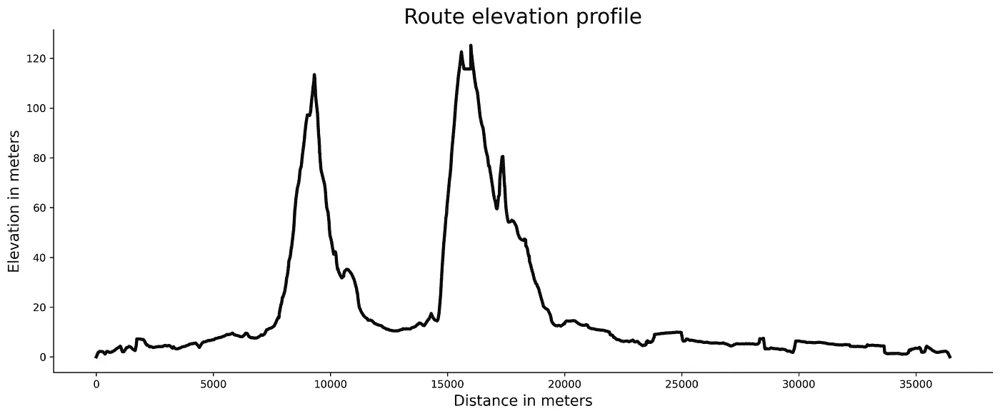
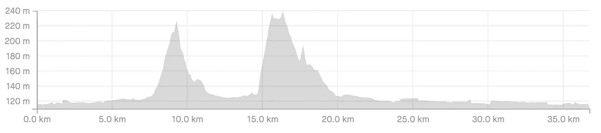

# 骑自行车的数据科学-如何计算与斯特拉发 GPX 路线的高差和距离

> 原文：<https://towardsdatascience.com/data-science-for-cycling-how-to-calculate-elevation-difference-and-distance-from-strava-gpx-route-cff147033c16?source=collection_archive---------22----------------------->

## **第 3/6 部分——计算点与点之间的高差和距离，并用 Python 可视化高程剖面图**


照片由[孙铁麟·瓦达斯](https://unsplash.com/@hunterrtomi?utm_source=medium&utm_medium=referral)在 [Unsplash](https://unsplash.com?utm_source=medium&utm_medium=referral) 上拍摄

[上周](https://betterdatascience.com/data-science-for-cycling-how-to-visualize-gpx-strava-routes-with-python-and-folium/)您学习了如何使用 Python 和 Folium 可视化 GPX Strava 路线，而在之前的[周，您已经了解了如何分析和解析 Strava GPX 路线。今天，我们将通过计算高程差和数据点之间的距离来更进一步。我们还将可视化一条路线的高程剖面，并将其与 Strava 生成的剖面进行比较。](https://betterdatascience.com/data-science-for-cycling-how-to-read-gpx-strava-routes-with-python/)

我们有许多事情要谈，所以让我们直入主题吧。首先，我们将加载数据集并计算高程差。

不想看书？请观看我的视频:

你可以在 [GitHub](https://github.com/better-data-science/data-science-for-cycling) 上下载源代码。

# 如何读取 Strava 路径数据集

我们今天不会为 GPX 文件费心，因为我们已经有提取到 CSV 文件的路线数据点。首先，我们将导入几个库——Numpy、Pandas 和 Haversine(`pip install haversine`)——还有 Matplotlib，以便稍后可视化:

从这里，加载路径数据集:



*图片 1-Strava 路线数据集(图片由作者提供)*

总共有 835 个数据点，我们有每个数据点的高程数据。怎么才能得到点与点之间的高差？让我们接下来讨论这个问题。

# 如何从 Strava 路线计算高程差

您可以使用 Pandas 的`diff()`函数来计算第 N+1 行和第 N 行之间的差异。如果您将它应用到`elevation`列，您将获得各个点之间的高程差异。第一个差值将是`NaN`，但这是意料之中的，因为在它之前没有数据点。

使用下面的代码片段计算高差，并将其存储到单独的列中:

```
route_df['elevation_diff'] = route_df['elevation'].diff()route_df.head()
```


*图片 2-具有高差的路径数据集(图片由作者提供)*

说白了，第二个点位于第一个点上方 1.86 米处。但是点与点之间的实际距离是多少呢？1.86 米的高度极难骑过 10 米，但骑过 100 米却相当容易。

接下来，您将计算两点之间的距离。

# 如何计算 Strava 路线中各点之间的距离

计算自行车路线上数据点之间的距离是很棘手的。也许最好的方法是使用一些谷歌的地图 API——但这些 API 不是免费的，通常只在公路上运行良好。这是山地自行车道的一个限制因素。此外，发出近千个 API 请求至少需要几分钟。

最好的自由和快速的选择是使用**哈弗线距离**。它计算球体上两点之间的大圆距离，给出它们的纬度和经度。想要更深入地了解理论和数学，请随意阅读官方的[维基百科文章](https://en.wikipedia.org/wiki/Haversine_formula)。

我们的 GPX 斯特拉发路线长 36.4 公里，有 835 个数据点。平均来说，两点之间的距离大约是 43.6 米。Strava 路线看起来非常平滑，所以我希望在直路上看到更少的数据点，在小径上看到更多的点，因为它们有很多急转弯。有理由预计哈弗线距离会有所偏离，但希望不会太大。

首先，让我们定义一个函数来计算哈弗线距离。它接受两个纬度和经度组合，并返回它们之间的距离(以米为单位):

```
def haversine_distance(lat1, lon1, lat2, lon2) -> float:
    distance = hs.haversine(
        point1=(lat1, lon1),
        point2=(lat2, lon2),
        unit=hs.Unit.METERS
    )
    return np.round(distance, 2)
```

下面的代码片段打印了数据集中第一个点和第二个点之间的距离:

```
haversine_distance(
    lat1=route_df.iloc[0]['latitude'],
    lon1=route_df.iloc[0]['longitude'],
    lat2=route_df.iloc[1]['latitude'],
    lon2=route_df.iloc[1]['longitude']
)
```

您应该看到`87.59`被打印到控制台上。没有办法通过 Strava 验证，但是希望它是准确的。

我们现在将计算所有数据点之间的距离。下面的代码片段做到了这一点，也跳过了第一行，因为它前面没有数据点。完成后，距离存储在新列中:

```
distances = [np.nan]for i in range(len(route_df)):
    if i == 0:
        continue
    else:
        distances.append(haversine_distance(
            lat1=route_df.iloc[i - 1]['latitude'],
            lon1=route_df.iloc[i - 1]['longitude'],
            lat2=route_df.iloc[i]['latitude'],
            lon2=route_df.iloc[i]['longitude']
        ))

route_df['distance'] = distances
route_df.head()
```



*图片 3-带有数据点之间距离的路径数据集(图片由作者提供)*

探索这些新列很有趣。例如，我们可以计算路线的总仰角增益。怎么会？通过对数据集进行子集化，从而只保留具有正`elevation_diff`的行，然后对提到的列求和:

```
route_df[route_df['elevation_diff'] >= 0]['elevation_diff'].sum()
```



*图片 4 —斯特拉发路线的总海拔增益(图片由作者提供)*

这个数字有点不准确，因为官方的斯特拉发路线称这里海拔 288 米。

接下来让我们检查总距离。根据 Strava 的说法，这条路线长 36.4 公里。我们将对`distance`列求和并比较结果:

```
route_df['distance'].sum()
```



*图片 5 —以米为单位的路线总距离(图片由作者提供)*

我们完全符合简单的哈弗森距离！

我们得到的数字与 Strava 上的数字相匹配，因此通过 Python 进一步探索数据集是有意义的。在下一节中，您将看到如何可视化高程剖面，我们将把它与 Strava 上的高程剖面进行比较。

# 如何可视化 Strava 路线的高程剖面

高程剖面图顾名思义显示了不同距离处的高程。你可以用它来查看哪里有山，这样你就知道如何调整你的骑行速度。我们需要两个额外的列来可视化高程剖面——高程差的累积和以及距离的累积和:

```
route_df['cum_elevation'] = route_df['elevation_diff'].cumsum() 
route_df['cum_distance'] = route_df['distance'].cumsum() route_df.head()
```



*图 6——高度和距离的累积和(图片由作者提供)*

我们需要这些，因为我们想做一个线图。`cum_distance`将位于 X 轴上，而`cum_elevation`将位于 Y 轴上。两者都必须是累积的，因为我们希望看到整个路线，而不是一个点。

在可视化之前，让我们去掉缺失的值。最好用零填充它们，因为这对该数据集最有意义:

```
route_df = route_df.fillna(0)route_df.head()
```



*图 7 —输入缺失值(图片由作者提供)*

您将在以后的文章中需要这个数据集，所以将其转储到一个 CSV 文件中:

```
route_df.to_csv('../data/route_df_elevation_distance.csv', index=False)
```

最后，我们将使用 Matplotlib 来可视化高程剖面。距离和高度都以米为单位，所以请记住:

```
plt.plot(route_df['cum_distance'], route_df['cum_elevation'], color='#101010', lw=3)
plt.title('Route elevation profile', size=20)
plt.xlabel('Distance in meters', size=14)
plt.ylabel('Elevation in meters', size=14);
```



*图片 8 —路线立面图(图片由作者提供)*

有两个相对较小的爬坡彼此靠近，其余的路线几乎是平坦的。让我们将它与来自斯特拉发的官方高程剖面图进行比较:



*图片 Strava 上的路线立面图(作者提供的图片)*

斯特拉瓦的团队花了更多的时间来调整视觉效果，但情节看起来几乎相同！来自 Strava 的更宽，但这并没有任何实际的区别。另外，斯特拉发把 Y 轴显示为海平面以上的高度，而我们从零开始。

总的来说，我们对几行代码做了相当不错的工作。接下来让我们总结一下。

# 结论

现在，您已经知道了如何计算数据点之间的高程差和距离，以及如何可视化高程剖面。起初听起来工作量很大，但是 Python 有一个库，几乎可以容纳你能想到的任何东西。这些看似复杂的计算归结为一个函数调用。在下一篇文章中，您将了解如何根据高程和数据点之间的距离计算路线坡度，敬请关注。

以下是整个系列的链接——我会在发布文章时添加网址:

*   [第 1 篇:从 Strava 加载并分析 GPX 文件](https://betterdatascience.com/data-science-for-cycling-how-to-read-gpx-strava-routes-with-python/)
*   [第 2 条:用圆形标记和多边形线可视化来自 Strava 的 GPX 文件](https://betterdatascience.com/data-science-for-cycling-how-to-visualize-gpx-strava-routes-with-python-and-folium/)
*   [第三条:计算点与点之间的高差和距离，可视化路线的高程剖面图](https://betterdatascience.com/data-science-for-cycling-how-to-calculate-elevation-difference-and-distance-from-strava-gpx-route)
*   第 4 条:根据点之间的高程差和距离计算路线坡度
*   文章 5:计算和可视化梯度剖面——在梯度范围内循环的距离
*   文章 6:创建一个 web 应用程序，分析并可视化用户从 Strava 上传的 GPX 文件

*喜欢这篇文章吗？成为* [*中等会员*](https://medium.com/@radecicdario/membership) *继续无限制学习。如果你使用下面的链接，我会收到你的一部分会员费，不需要你额外付费。*

[](https://medium.com/@radecicdario/membership) [## 通过我的推荐链接加入 Medium-Dario rade ci

### 作为一个媒体会员，你的会员费的一部分会给你阅读的作家，你可以完全接触到每一个故事…

medium.com](https://medium.com/@radecicdario/membership) 

# 保持联系

*   注册我的[简讯](https://mailchi.mp/46a3d2989d9b/bdssubscribe)
*   在 YouTube[上订阅](https://www.youtube.com/c/BetterDataScience)
*   在 [LinkedIn](https://www.linkedin.com/in/darioradecic/) 上连接

*原载于 2021 年 12 月 20 日 https://betterdatascience.com**T21*[。](https://betterdatascience.com/data-science-for-cycling-how-to-calculate-elevation-difference-and-distance-from-strava-gpx-route/)