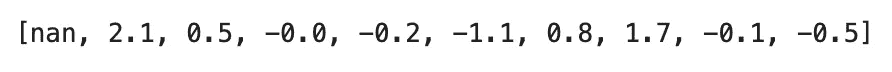

# 自行车运动的数据科学-如何从斯特拉发 GPX 文件计算路线坡度

> 原文：<https://towardsdatascience.com/data-science-for-cycling-how-to-calculate-route-gradients-from-a-strava-gpx-file-2fc559980186?source=collection_archive---------24----------------------->

## [自行车运动的数据科学](https://towardsdatascience.com/tagged/data-science-for-cycling)

## **第 4/6 部分——使用 Python 计算并可视化 Strava 路线 GPX 文件的坡度**


照片由[帕特里克·亨德利](https://unsplash.com/@worldsbetweenlines?utm_source=medium&utm_medium=referral)在 [Unsplash](https://unsplash.com?utm_source=medium&utm_medium=referral) 上拍摄

[上周](https://betterdatascience.com/data-science-for-cycling-how-to-calculate-elevation-difference-and-distance-from-strava-gpx-route/)你已经看到计算 Strava 路线的高差和距离是多么容易。这是朝着正确方向迈出的一步，因为今天您将需要高程和距离数据。骑自行车的人喜欢谈论的一件事是坡度。这些代表你所骑的路面的坡度。

事实证明，利用基本的 Python 和数学技能，您可以毫不费力地估算出它们。我们今天有很多内容要讲，所以让我们直接开始吧。

不想看书？请观看我的视频:

你可以在 [GitHub](https://github.com/better-data-science/data-science-for-cycling) 上下载源代码。

# 如何读取 Strava 路径数据集

我们今天不会为 GPX 文件费心，因为我们已经将路线数据点、高程和距离提取到一个 CSV 文件中。首先，导入通常的疑点并调整 Matplotlib 的默认样式:

```
import numpy as np
import pandas as pd
import matplotlib.pyplot as pltplt.rcParams['figure.figsize'] = (16, 6)
plt.rcParams['axes.spines.top'] = False
plt.rcParams['axes.spines.right'] = False
```

从这里，加载路径数据集:

```
route_df = pd.read_csv('../data/route_df_elevation_distance.csv')
route_df.head()
```


图片 1-包含距离和高程数据的 Strava 路径数据集(图片由作者提供)

如果您没有这种格式的路径数据集，请阅读上周的文章。概括地说，在这条 36.4 公里的路线上总共有 835 个数据点，因此数据点之间的平均距离为 43.6 米。

我们可以使用高差和距离数据来估计 835 个单独路段的平均坡度。

# 如何从 Strava 路线计算坡度

坡度只不过是你所骑行的表面的坡度。我们的数据非常有限，因为我们只有分布在 36 公里范围内的 835 个数据点。我们会尽最大努力，但从这一点上你将看到的一切都只是一个估计。

我们可以通过将两个数据点之间的高程差除以所经过的距离并将结果乘以 100 来估计两个数据点之间的平均梯度。

让我们用第二个数据点的硬编码值来测试这个逻辑(在 87.59 米的高度上增加了 1.86 米):

```
(1.86 / 87.59) * 100>>> 2.1235300833428474
```

从路线起点到第二个数据点的平均坡度为 2.1%。这意味着，如果相同的坡度继续，在 100 米的距离后，你将获得 2.1 米的高度。

这只是一个平均值，所以记住这一点。该路段的前 15 米可以具有 10%的坡度，而剩余的 72 米可以完全平坦。另一方面，整个 87 米路段可能有一个完美分布的 2.1%的坡度。**重点是**——我们无法确切知道，以上逻辑是我们能做到的最好的。

让我们将它应用于整个数据集。我们将跳过第一行，因为没有什么可以与之比较。渐变通常四舍五入到小数点后一位，但这是惯例，不是要求。请随意添加更多内容。

```
gradients = [np.nan]for ind, row in route_df.iterrows(): 
    if ind == 0:
        continue
    grade = (row['elevation_diff'] / row['distance']) * 100
    gradients.append(np.round(grade, 1))

gradients[:10]
```



图片 2-前十个估计梯度(图片由作者提供)

计算完成—现在让我们来看一下 835 个数据点的平均梯度:

```
plt.title('Terrain gradient on the route', size=20)
plt.xlabel('Data point', size=14)
plt.ylabel('Gradient (%)', size=14)
plt.plot(np.arange(len(gradients)), gradients, lw=2, color='#101010');
```


图片 3-估计的平均路线坡度 v1(图片由作者提供)

路由文件似乎有问题。单个数据点有超过 1200%的梯度，这是不可能的。理论上，这将意味着你在 100 米的距离后获得 1200 米的高度。

我们将通过添加一个条件来缓解这个问题——如果估计的平均梯度大于 30%,我们将在列表中添加`NaN`。这条路线没有 30%以上的坡度，这样的坡度总体来说极其罕见。

```
gradients = [np.nan]for ind, row in route_df.iterrows(): 
    if ind == 0:
        continue

    grade = (row['elevation_diff'] / row['distance']) * 100

    if grade > 30:
        gradients.append(np.nan)
    else:
        gradients.append(np.round(grade, 1))
```

让我们看看它是什么样子的:

```
plt.title('Terrain gradient on the route', size=20)
plt.xlabel('Data point', size=14)
plt.ylabel('Gradient (%)', size=14)
plt.plot(np.arange(len(gradients)), gradients, lw=2, color='#101010');
```


图片 4-估计的平均路线坡度 v2(图片由作者提供)

这是朝着正确方向迈出的一步，但我们现在有几个缺失的数据点。事情是这样的——有一个简单愚蠢的解决办法。

# 如何从 Strava 路线内插不正确的坡度

首先，我们将把计算的梯度分配给一个新的数据集列:

```
route_df['gradient'] = gradients
route_df.head()
```


图片 5-包含坡度信息的路径数据集(图片由作者提供)

让我们看看缺少的值在哪里:

```
route_df[route_df['gradient'].isna()]
```


图像 6-数据集中所有缺失的梯度值(作者提供的图像)

我们可以忽略第一个，因为它是因为完全不同的原因而丢失的。我们得处理另外两个。为了理解这种方法，让我们将第二行与周围的几行隔离开来:

```
route_df[401:406]
```


图 7-缺失梯度值周围的数据点(作者图片)

我们将使用**插值**来估算缺失值。它会用前后数据点的平均值替换缺失值。例如，缺失值之前的缺失渐变为 0，之后为-5.9。插值梯度将为-2，95，如`(0 + (-5.9)) / 2 = -2.95`:

```
route_df[401:406].interpolate()
```


图 8-单个数据点的插值渐变(图片由作者提供)

使用下面的代码片段对整个数据集应用插值，并用零填充第一行缺少的值:

```
route_df['gradient'] = route_df['gradient'].interpolate().fillna(0)route_df.head()
```


图 9-带有插值梯度列的数据集

最后，我们将可视化梯度，看看这次线是否连接:

```
plt.title('Terrain gradient on the route', size=20)
plt.xlabel('Data point', size=14)
plt.ylabel('Gradient (%)', size=14)
plt.plot(np.arange(len(route_df)), route_df['gradient'], lw=2, color='#101010');
```


图片 10-估计的平均路线坡度 v3(图片由作者提供)

现在一切看起来都很好，这意味着我们准备好进一步分析梯度。我们将在下一篇文章中讨论这个问题，但是现在请将数据集保存到 CSV 文件中:

```
route_df.to_csv('../data/route_df_gradient.csv', index=False)
```

这就是我今天想讲的。接下来让我们总结一下。

# 结论

现在，您已经知道了如何计算和可视化 Strava route GPX 文件的梯度。你必须承认——这比听起来容易。任何东西都可以归结为任何人都能理解的小学数学。下面的文章将使事情稍微复杂一些，因为我们将把我们的焦点转移到渐变剖面上。简而言之，我们想知道在不同梯度范围内循环的距离，但现在还不用担心。

以下是整个系列的链接——我会在发布文章时添加网址:

*   [第 1 篇:从 Strava 加载并分析 GPX 文件](https://betterdatascience.com/data-science-for-cycling-how-to-read-gpx-strava-routes-with-python/)
*   [第二条:用圆形标记和多边形线可视化来自 Strava 的 GPX 文件](https://betterdatascience.com/data-science-for-cycling-how-to-visualize-gpx-strava-routes-with-python-and-folium/)
*   [第三条:计算点与点之间的高差和距离，可视化路线的高程剖面图](https://betterdatascience.com/data-science-for-cycling-how-to-calculate-elevation-difference-and-distance-from-strava-gpx-route)
*   [第四条:根据点与点之间的高差和距离计算路线坡度](https://betterdatascience.com/data-science-for-cycling-calculate-route-gradients-from-strava-gpx)
*   文章 5:计算和可视化梯度剖面——在梯度范围内循环的距离
*   文章 6:创建一个 web 应用程序，分析并可视化用户从 Strava 上传的 GPX 文件

*喜欢这篇文章吗？成为* [*中等会员*](https://medium.com/@radecicdario/membership) *继续无限制学习。如果你使用下面的链接，我会收到你的一部分会员费，不需要你额外付费。*

[](https://medium.com/@radecicdario/membership) [## 通过我的推荐链接加入 Medium-Dario rade ci

### 作为一个媒体会员，你的会员费的一部分会给你阅读的作家，你可以完全接触到每一个故事…

medium.com](https://medium.com/@radecicdario/membership) 

# 保持联系

*   注册我的[简讯](https://mailchi.mp/46a3d2989d9b/bdssubscribe)
*   在 [YouTube](https://www.youtube.com/c/BetterDataScience) 上订阅
*   在 [LinkedIn](https://www.linkedin.com/in/darioradecic/) 上连接

*原载于 2021 年 12 月 28 日 https://betterdatascience.com*[](https://betterdatascience.com/data-science-for-cycling-calculate-route-gradients-from-strava-gpx/)**。**