# 自行车运动的数据科学——如何使用 Python 阅读 GPX 斯特拉发路线

> 原文：<https://towardsdatascience.com/data-science-for-cycling-how-to-read-gpx-strava-routes-with-python-e45714d5da23?source=collection_archive---------5----------------------->

## [自行车运动的数据科学](https://towardsdatascience.com/tagged/data-science-for-cycling)

## 第 1/6 部分——介绍 GPX，探索和想象斯特拉发路线


照片由[阿莱西奥·索格蒂](https://unsplash.com/@asoggetti?utm_source=unsplash&utm_medium=referral&utm_content=creditCopyText)在 [Unsplash](https://unsplash.com/s/photos/bike?utm_source=unsplash&utm_medium=referral&utm_content=creditCopyText) 上拍摄

我喜欢骑自行车，也喜欢用 Strava 来记录我的训练活动。作为一个数据呆子，我对他们的锻炼分析有点失望。当然，你可以分析速度、功率、节奏、心率等等——取决于你可用的传感器——但我真正怀念的是深度梯度分析。

现在，数据科学中的梯度和循环不一定代表同一件事。在自行车运动中，基本上就是你所骑的路面的坡度。作为一个又高又重的骑手，我觉得爬坡很有挑战性，所以更深入的坡度分析会很有帮助。例如，我想看看我在 3%和 5%之间走了多远，10%以上走了多少，以及在这之间的所有事情。你明白了。

Strava 不提供这种功能，所以我决定使用我的 Python 技能从头开始计算。

加入我的 6 篇文章的迷你系列，以 GPX 文件格式的速成课程开始，以比 Strava 更深入地显示你的训练数据的仪表板结束。

不想看书？请观看我的视频:

你可以在 [GitHub](https://github.com/better-data-science/data-science-for-cycling) 上下载源代码。

# GPX 数据科学速成班

Strava 可让您以 GPX 文件格式导出您的训练和路线。简单地说，GPX 代表 *GPS 交换格式*，它只不过是一个带有地理信息的文本文件，比如纬度、经度、海拔、轨迹、路点等等。

导出的 Strava route GPX 文件包含许多在不同时间拍摄的点，每个点都包含纬度、经度和高程。简单地说，你确切地知道你在哪里，你的高度是多少。这对于计算渐变和渐变范围是必不可少的，我们将在两篇文章中讨论。

如果您正在跟随，前往 Strava 并下载您保存的任何路线(*导出 GPX* 按钮):

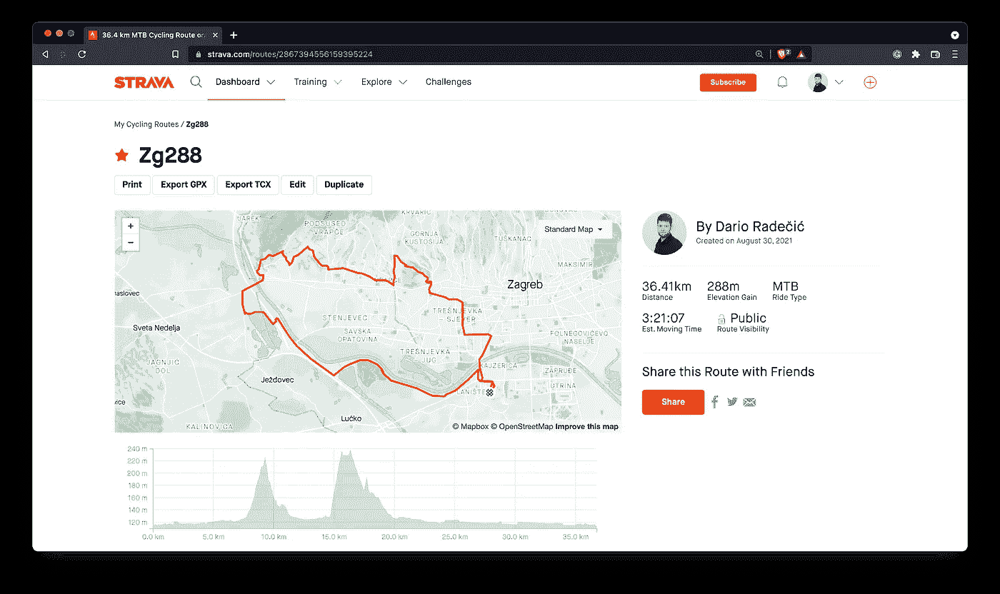

*图片 1——克罗地亚萨格勒布的往返斯特拉瓦路线(图片由作者提供)*

创建路线需要付费的 Strava 订阅，因此出于安全考虑，我不会与您共享我的 GPX 文件。使用路线或训练日志中的任何 GPX 文件。如果你没有使用 Strava，只需在网上找到一个 GPX 的样本文件，它应该仍然可以工作。

GPX 的文件准备好了吗？太棒了——接下来让我们看看如何用 Python 来读。

# 如何用 Python 读取 GPX 文件

你需要一个专用的`gpxpy`包来用 Python 阅读 GPX。用 Pip 安装它:

```
pip install gpxpy
```

您现在可以启动 Jupyter 或任何其他代码编辑器来开始了。首先，让我们先解决库导入的问题:

使用 Python 的上下文管理器语法读取和解析 GPX 文件:

请注意，您必须更改路径以匹配您的系统和 GPX 文件名。如果一切顺利，现在应该可以用 Python 获得这个文件了。

但是里面是什么？让我们看看:

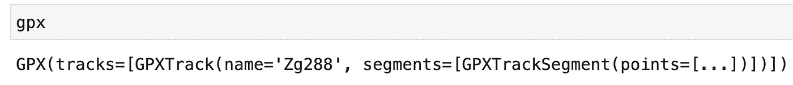

*图片 2——GPX 文件的内容(图片由作者提供)*

它是一个特定的 GPX 对象，具有轨迹名称和分段，其中每个分段包含数据点(纬度、经度和海拔)。我们将在下一节中更深入地研究这些函数，但是首先，让我们探索几个有用的函数。

例如，您可以提取 GPX 文件中的数据点总数:

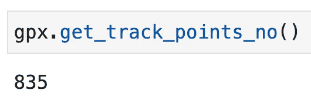

*图 3—GPX 文件中数据点的总数(图片由作者提供)*

总共有 835 个点，每个点包含纬度、经度和高程数据。那以后会有用的。

您还可以获得高度范围:

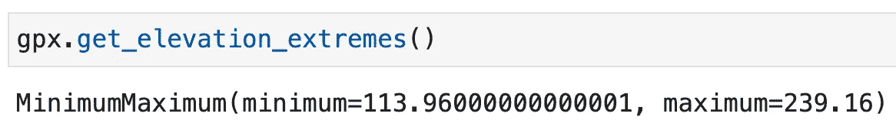

*图片 4——最低和最高海拔(图片由作者提供)*

说白了，这就意味着乘坐的最低点在海拔 113，96 米，而最高点在海拔 239，16 米。

您还可以提取获得和失去的总海拔米数:

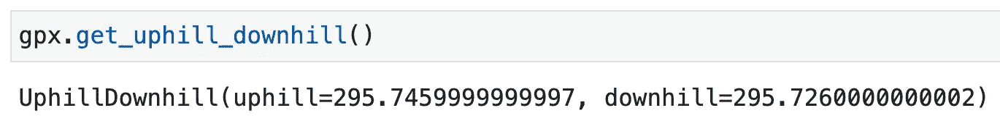

*图片 5 —获得和失去的总高度(图片由作者提供)*

我的路径代表一个往返行程，因此应该看到相同或几乎相同的值。最后，您可以用 XML 格式显示 GPX 文件的内容:

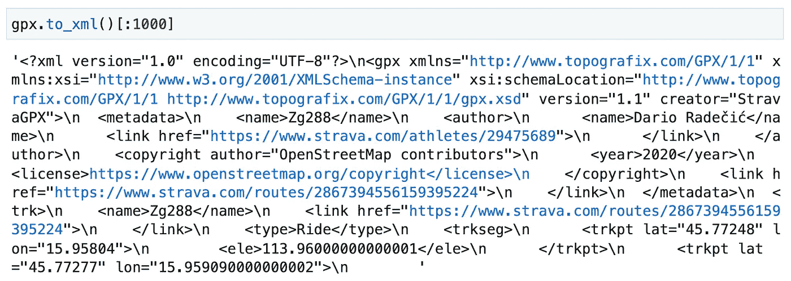

*图片 XML 格式的 GPX 文件(图片由作者提供)*

它不是超级可读的，但是如果您有 XML 处理管道，它可能会派上用场。

这是最基本的。接下来，您将看到如何提取单个数据点，并将它们转换成可读性更好的格式——Pandas data frame。

# 如何用 Python 分析 GPX 文件

你可以通过运行`len(gpx.tracks)`来检查你的 GPX 文件有多少个音轨。我的只有一个，我可以用 Python 的列表索引符号来访问它:

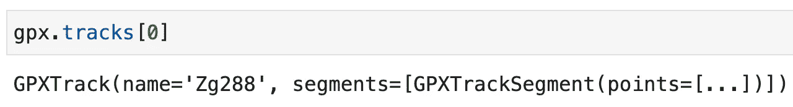

*图片 7 —访问单个音轨(作者图片)*

我们不关心轨道的名称，因为在这种情况下它是任意的。我们真正关心的是细分市场。和音轨一样，我的 GPX 文件在这个音轨上只有一个片段。以下是访问它的方法:

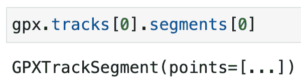

*图片 8 —访问单个片段(作者图片)*

现在，您可以通过访问`points`数组来访问各个数据点。以下是我的前十条路线:

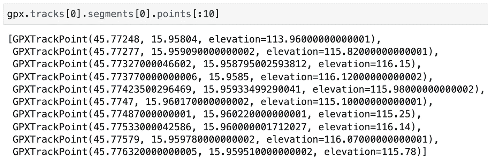

*图 9 —访问单个数据点(作者图片)*

这就是我们找乐子所需要的。现在，您将看到如何从 GPX 文件中提取单个数据点:

这不是你见过的最漂亮的代码，但是它完成了任务。让我们打印前三个条目来验证我们所做的一切都是正确的:

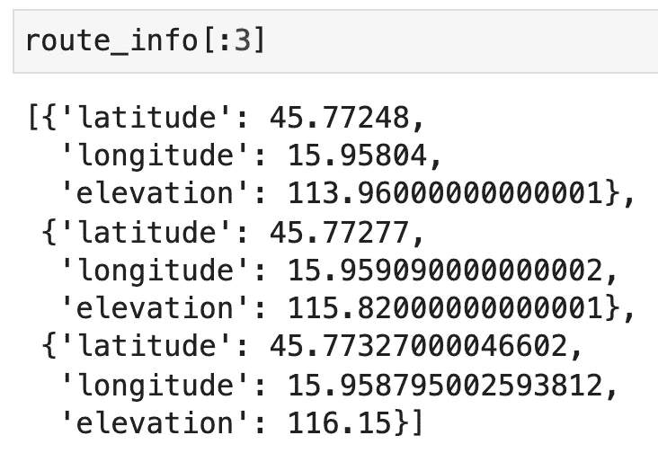

*图 10 —提取的数据点作为字典列表(按作者分类)*

你知道字典列表有什么特别方便的吗？你可以马上把它转换成熊猫的数据帧:

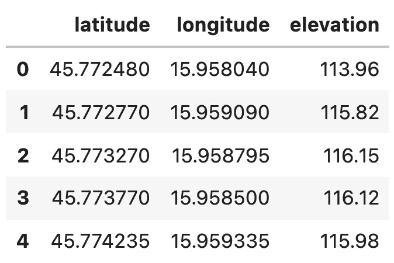

*图 11 —提取的数据点作为熊猫数据帧(图片由作者提供)*

你必须承认——那相当容易！我们将在下面的文章中需要这个数据集，所以让我们把它转储到一个 CSV 文件中:

这就是我们今天要做的基本分析和预处理。我还将向您展示如何使用 Matplotlib 来可视化这个数据集——只是为了看看我们是否在正确的轨道上。

# 如何用 Python 和 Matplotlib 可视化 GPX 文件

在下一篇文章中，我们将使用 Python 和 Folium 进行路线可视化，但今天我想向您展示如何使用 Matplotlib 进行基本的可视化。你肯定看不到地图，但是定位点应该类似于图 1 中的路线。

提示:不要把图的尺寸画得太宽，因为这会让地图看起来很奇怪。

复制以下代码以可视化路线:


*图片 12 —使用 Matplotlib 的路线可视化(图片由作者提供)*

谁知道呢——这和我们在*图 1* 中看到的一样，没有考虑明显的问题。在下一篇文章中，您将了解到地图和路线可视化的全部内容。

# 结论

现在，您已经成功地从 Strava 导出了一个 GPX 路线/训练文件，用 Python 对其进行了解析，并提取了纬度、经度和海拔等关键特征。这只是冰山一角，在接下来的文章中，您可以期望了解更多编程和数据科学在自行车运动中的应用。

这里有一个简短的概述来激励你——我会在发布文章时添加网址:

*   [第 1 篇:从 Strava 加载并分析 GPX 文件](https://betterdatascience.com/data-science-for-cycling-how-to-read-gpx-strava-routes-with-python/)
*   [文章 2:用圆形标记和多边形线可视化来自 Strava 的 GPX 文件](https://betterdatascience.com/data-science-for-cycling-how-to-visualize-gpx-strava-routes-with-python-and-folium/)
*   第 3 条:计算点与点之间的高差和距离，可视化路线的高程剖面
*   第 4 条:根据点之间的高程差和距离计算路线坡度
*   文章 5:计算和可视化梯度剖面——在梯度范围内循环的距离
*   文章 6:创建一个 web 应用程序，分析并可视化用户从 Strava 上传的 GPX 文件

感谢阅读，敬请期待更多内容！

喜欢这篇文章吗？成为 [*中等会员*](https://medium.com/@radecicdario/membership) *继续无限制学习。如果你使用下面的链接，我会收到你的一部分会员费，不需要你额外付费。*

<https://medium.com/@radecicdario/membership>  

# 保持联系

*   注册我的[简讯](https://mailchi.mp/46a3d2989d9b/bdssubscribe)
*   在 YouTube[上订阅](https://www.youtube.com/c/BetterDataScience)
*   在 [LinkedIn](https://www.linkedin.com/in/darioradecic/) 上连接