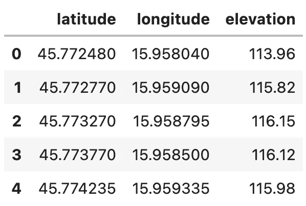
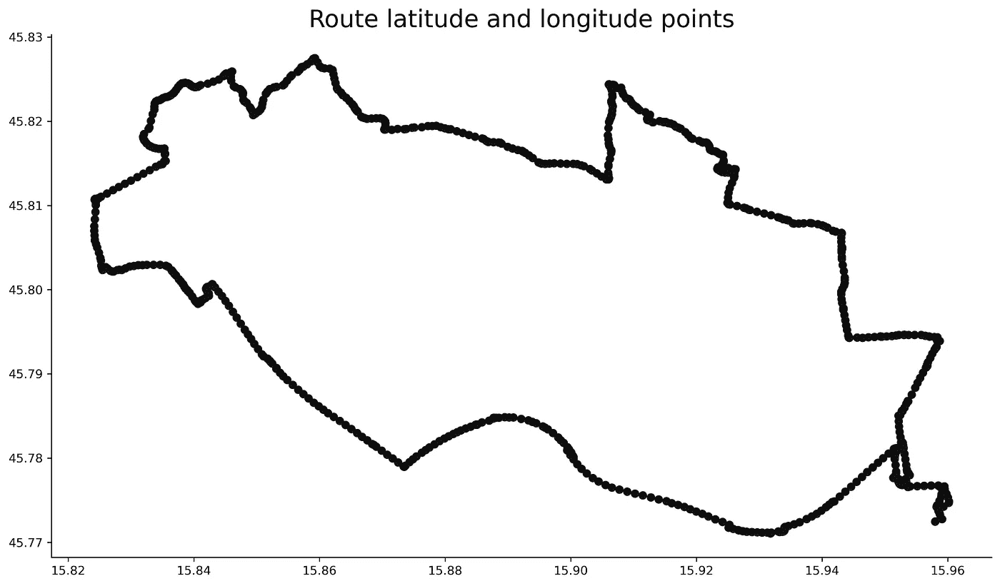
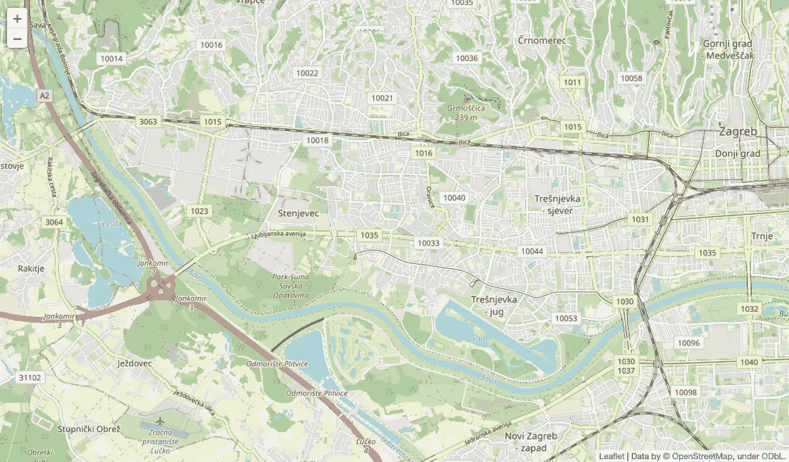
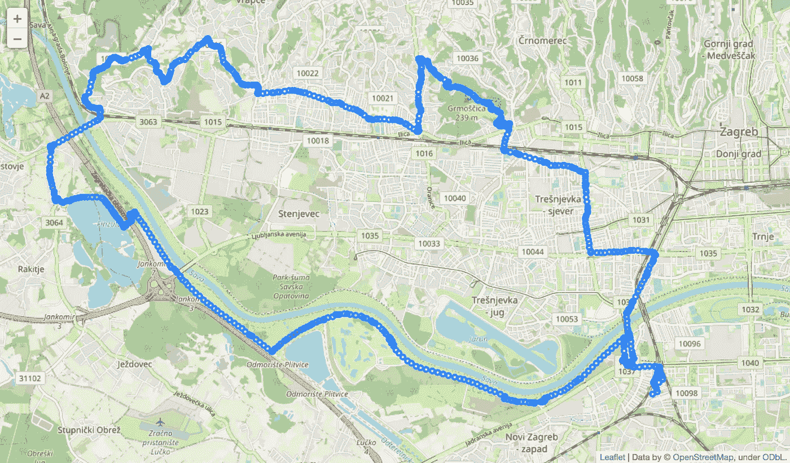
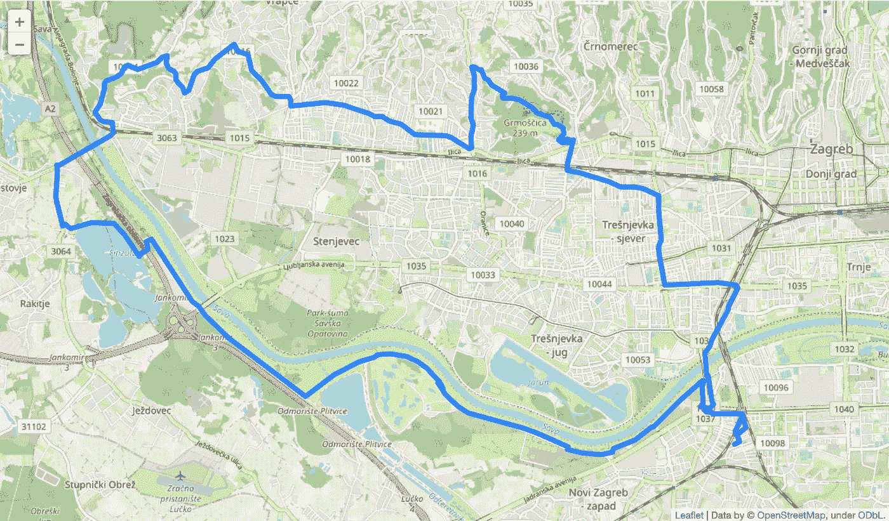
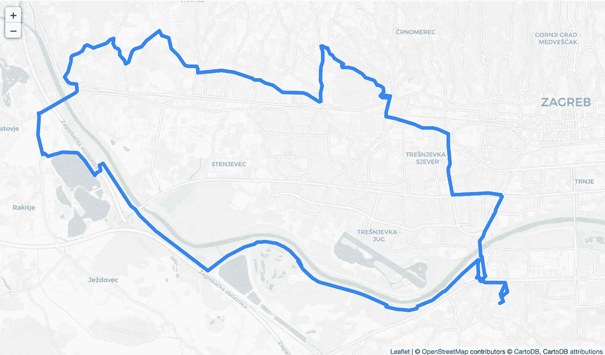
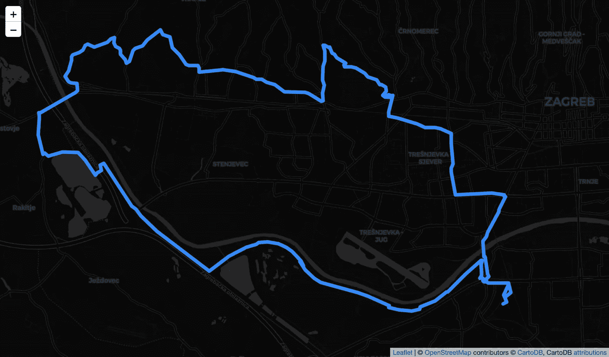
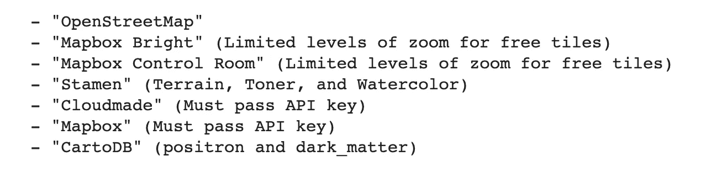

# 自行车运动的数据科学——如何使用 Python 和 Folium 可视化 GPX 斯特拉发路线

> 原文：<https://towardsdatascience.com/data-science-for-cycling-how-to-visualize-gpx-strava-routes-with-python-and-folium-21b96ade73c7?source=collection_archive---------32----------------------->

## [自行车运动的数据科学](https://towardsdatascience.com/tagged/data-science-for-cycling)

## **第 2/6 部分——使用令人惊叹的 Python 库轻松可视化 Strava 路线**


照片由 [Flo 吉田](https://unsplash.com/@flo_karr?utm_source=medium&utm_medium=referral)在 [Unsplash](https://unsplash.com?utm_source=medium&utm_medium=referral) 拍摄

上周[你了解了所有关于 GPX 的数据。您还以 GPX 格式导出了 Strava 路径，用 Python 加载了它，并提取了关键数据点，如纬度、经度和海拔。今天你将使用这些点在地图上画出路线！](https://betterdatascience.com/data-science-for-cycling-how-to-read-gpx-strava-routes-with-python/)

我们将开始用 Matplotlib 可视化 Strava 路线，但是我们将很快过渡到一个更专业的库——follow。如果您还没有安装它，请使用 Pip 安装它(pip install folium)。我们开始吧。

不想看书？请观看我的视频:

你可以在 [GitHub](https://github.com/better-data-science/data-science-for-cycling) 上下载源代码。

# 如何读取 Strava 路径数据集

我们今天不会为 GPX 文件费心，因为我们已经有提取到 CSV 文件的路线数据点。首先，我们必须导入几个库——主要是熊猫和叶子——还有 Matplotlib，用于基本的路线可视化:

```
import folium
import pandas as pdimport matplotlib.pyplot as plt
plt.rcParams['axes.spines.top'] = False
plt.rcParams['axes.spines.right'] = False
from IPython.display import display
```

现在，您可以加载路径数据集:

```
route_df = pd.read_csv('../data/route_df.csv')
route_df.head()
```



图片 1-Strava 路径数据集(图片由作者提供)

数据集中有 835 个数据点，这对于代表性的路线可视化来说绰绰有余。让我们从 Matplotlib 开始，讨论为什么这不是一个好主意。

# 如何用 Matplotlib 可视化 Strava 路线

您可以使用 Matplotlib 将纬度和经度点可视化为散点图，X 轴为经度，Y 轴为纬度。这非常有限，因为您将只能看到路径本身，而没有基础地图:

```
plt.figure(figsize=(14, 8))
plt.scatter(route_df['longitude'], route_df['latitude'], color='#101010')
plt.title('Route latitude and longitude points', size=20);
```



图 2-使用 Matplotlib 的 Strava 路线可视化(图片由作者提供)

出于这个原因，我不推荐 Matplotlib 或任何其他用于显示地图的非专业可视化包。有许多专门的解决方案，但我发现 leav 是最容易使用的一个。

# 如何使用 leav 可视化 Strava 路线

[follow](https://python-visualization.github.io/folium/)是一个用于可视化地理空间数据的 Python 库。它只是一个[传单](https://leafletjs.com/)的包装器，一个用于绘制交互式地图的开源 JavaScript 库。

在显示地图之前，必须知道一些事情。它们是地理位置(纬度和经度)、缩放级别和切片(地图的外观)。我们还将添加高度和宽度，这样地图就不会太大:

```
route_map = folium.Map(
    location=[45.79757947, 15.9007929],
    zoom_start=13,
    tiles='OpenStreetMap',
    width=1024,
    height=600
)
display(route_map)
```



图 3 —克罗地亚萨格勒布的一张空白树叶地图(图片由作者提供)

简单吧？这是一张克罗地亚萨格勒布西部的空白地图，因为那是我的路线所在。向地图添加数据点非常简单，基本上就是迭代数据集，并在每个纬度和经度组合处添加一个圆形标记。我们将保留默认参数，唯一要改变的是圆的半径:

```
route_map = folium.Map(
    location=[45.79757947, 15.9007929],
    zoom_start=13,
    tiles='OpenStreetMap',
    width=1024,
    height=600
)for _, row in route_df.iterrows():
    folium.CircleMarker(
        location=[row['latitude'], row['longitude']],
        radius=3,
    ).add_to(route_map)display(route_map)
```



图 4-用圆形标记可视化 Strava 路线(图片由作者提供)

现在我们有进展了。唯一的问题是——路径通常不会用圆圈标记来表示。这有点问题，因为我们只有数据点。我们可以将它们连接成一条多边形线，但这样做需要提取地理位置信息作为元组列表:

```
route_map = folium.Map(
    location=[45.79757947, 15.9007929],
    zoom_start=13,
    tiles='OpenStreetMap',
    width=1024,
    height=600
)coordinates = [tuple(x) for x in route_df[['latitude', 'longitude']].to_numpy()]
folium.PolyLine(coordinates, weight=6).add_to(route_map)display(route_map)
```



图 5-用多边形线可视化 Strava 路线(图片由作者提供)

本质上，您需要编写的代码更少，地图最终看起来更好——双赢。

但是如果你对过于详细的地图不满意呢？好消息是，您可以根据自己的喜好调整平铺参数。这是一个卡通、轻盈、简约的瓷砖选项示例:

```
route_map = folium.Map(
    location=[45.79757947, 15.9007929],
    zoom_start=13,
    tiles='CartoDBPositron',
    width=1024,
    height=600
)coordinates = [tuple(x) for x in route_df[['latitude', 'longitude']].to_numpy()]
folium.PolyLine(coordinates, weight=6).add_to(route_map)display(route_map)
```



图 6-更改地图分块(1)(图片由作者提供)

你也可以反其道而行之，就是用一个黑暗的主题。为此，请将 tiles 参数更改为 CartoDBDark_Matter:

```
route_map = folium.Map(
    location=[45.79757947, 15.9007929],
    zoom_start=13,
    tiles='CartoDBDark_Matter',
    width=1024,
    height=600
)coordinates = [tuple(x) for x in route_df[['latitude', 'longitude']].to_numpy()]
folium.PolyLine(coordinates, weight=6).add_to(route_map)display(route_map)
```



图 7-更改地图分块(2)(图片由作者提供)

一开始看起来有点奇怪，但是你可以让它工作。例如，将多边形线条颜色更改为白色，会使其更加突出。

您可以通过检查文档字符串来浏览其他图块，以下是可用选项:

```
folium.Map?
```



图 8-foylus 中可用的地图切片(图片由作者提供)

除了 Mapbox 之外的一切都是可用的，因为 Mapbox 需要一个 API 键。我们将坚持免费选项，因为它们已经足够好了。

# 结论

这就是你要做的——如何使用 have 轻松可视化 GPX 斯特拉发路线。我们不会用地图做任何更复杂的事情，因为这本身就非常适合我们的需求。在下一篇文章中，您将了解如何计算高程差和数据点之间的距离，并在后面的文章中了解更多内容。

以下是整个系列的链接——我会在发布文章时添加网址:

*   [第 1 篇:从 Strava 加载并分析 GPX 文件](https://betterdatascience.com/data-science-for-cycling-how-to-read-gpx-strava-routes-with-python/)
*   [第二条:用圆形标记和多边形线可视化来自 Strava 的 GPX 文件](https://betterdatascience.com/data-science-for-cycling-how-to-visualize-gpx-strava-routes-with-python-and-folium/)
*   第 3 条:计算点与点之间的高差和距离，可视化路线的高程剖面
*   第 4 条:根据点之间的高程差和距离计算路线坡度
*   文章 5:计算和可视化梯度剖面——在梯度范围内循环的距离
*   文章 6:创建一个 web 应用程序，分析并可视化用户从 Strava 上传的 GPX 文件

喜欢这篇文章吗？成为 [*中等会员*](https://medium.com/@radecicdario/membership) *继续无限制学习。如果你使用下面的链接，我会收到你的一部分会员费，不需要你额外付费。*

<https://medium.com/@radecicdario/membership>  

# 保持联系

*   注册我的[简讯](https://mailchi.mp/46a3d2989d9b/bdssubscribe)
*   在 YouTube[上订阅](https://www.youtube.com/c/BetterDataScience)
*   在 [LinkedIn](https://www.linkedin.com/in/darioradecic/) 上连接

*原载于 2021 年 12 月 13 日 https://betterdatascience.com*<https://betterdatascience.com/data-science-for-cycling-how-to-visualize-gpx-strava-routes-with-python-and-folium/>**。**