# 全球野生动物贩运的数据科学

> 原文：<https://towardsdatascience.com/data-science-for-global-wildlife-trafficking-2faffa765b19?source=collection_archive---------20----------------------->

## [变更数据](https://towardsdatascience.com/tagged/data-for-change)

## 对非法贩运进口到美国的野生动物进行广泛而深入的分析

由 [NASA](https://unsplash.com/@nasa?utm_source=medium&utm_medium=referral) 在 [Unsplash](https://unsplash.com?utm_source=medium&utm_medium=referral) 上拍摄的照片

这个项目由 Alex Hardy、Raya Abourjeily 和我 Ani Madurkar 共同完成。

这个故事将讨论我们的项目作为一个整体，包括识别问题，限定假设，证明方法，评估结果，等等。它不会包含代码片段，所以如果你对 code/Tableau 仪表板设计感兴趣，那么我建议你查看我们的 Github repo 或在 Tableau Public 上下载相应的 Tableau 仪表板。

[莱米斯 Tableau 仪表盘](https://public.tableau.com/app/profile/raya.abourjeily/viz/LEMIS/Overview)

[Panjiva Tableau 仪表盘](https://public.tableau.com/app/profile/raya.abourjeily/viz/Panjiva/Overview)

[简化应用](https://github.com/AniMadurkar/Machine-Learning-for-Global-Wildlife-Trafficking)

# 目录

1.  问题陈述
2.  与领域专家合作
3.  Tableau 中的探索性数据分析
4.  从 LEMIS 预测行动/部署
5.  聚集来自潘吉瓦的货物
6.  那又怎样？
7.  工作说明书

# 问题陈述

在过去十年中，非法贩运野生动物已经升级为一场国际危机，对许多国家造成了严重的保护问题和对全球安全的威胁。非法野生动物贸易受到高额利润(估计价值为每年 78-100 亿美元)的驱动，破坏了各国的安全协议(白宫，2014 年)。

此外，由于人口的增长，对野生动物的需求也在增长，这使得本已脆弱的物种濒临灭绝。像许多非法贸易一样，非法野生动物贩运通常是通过黑市渠道进行的，最终隐藏在可信的供应链路线中。

这使得黑市交易者可以从非法活动中获利并逃避惩罚，而最终消费者(动物园、博物馆等)则可以从中获利。)似乎正在收购合法来源的野生动物产品。目前，破坏这些非法供应链的努力往往依赖直觉，而不是数据驱动的解决方案，从而能够采取积极措施制止非法贩运。

非法野生动物贸易网络很复杂，但通过数据科学，我们计划为应对这一挑战的解决方案提供新的见解。先进的数据分析可以帮助我们找出事件之间的联系，并标记公司可能在不知情的情况下运输非法野生动物货物的风险区域，这有助于使公司更加负责任，并实现美国打击野生动物贩运的国家战略。

# 与领域专家合作

由于这个社会公益问题对我们所有人来说都是一个新问题，我们需要与专家合作，并经常获得他们的反馈。与领域专家的密切合作使我们能够确保我们的解决方案是有价值和可行的。

我们的主要联系人是尼尔·卡特博士。这一摘录直接来自他的网站，“尼尔·卡特博士的跨学科研究考察了在全球变化背景下野生动物和人类之间相互作用的复杂动力学特征(例如，提供生态系统服务，冲突)。他的工作涉及从地方到全球的野生动物保护问题，利用多种空间技术和工具，让不同的利益攸关方参与进来，并为决策提供信息”。

为了确保我们能够恰当地传递价值，我们每周都要举行站立会议来展示进展情况，并与 Neil 一起制定下一步战略。他让人们意识到之前在这一领域所做的一些值得注意的数据工作:

1.  [与非法杀害大象相关的全球趋势和因素:尸体遭遇数据的层次贝叶斯分析](https://journals.plos.org/plosone/article?id=10.1371/journal.pone.0024165)

2.[剖析非法象牙贸易:象牙扣押数据分析](https://journals.plos.org/plosone/article?id=10.1371/journal.pone.0076539#s5)

3.[侦查非法木材交易](https://dac-wwf.cs.vt.edu/)

通过频繁的讨论，我们很快注意到这个数百万美元的问题缺乏有效的数据解决方案。虽然数据工作可能在某个地方进行，但结果似乎并不普遍，因此对执法官员和保护工作者的价值有限。我们发现这种知识共享的缺乏造成了研究人员和官员之间的隔阂。

Neil 的关系帮助我们联系到 Robert (Bob) Herndon，他在肯塔基州的美国 UPS 运输总部工作，专门研究野生动物(动物和产品)。我们进行了一次半正式的用户调查访问，以便更好地理解这个问题，并了解他对这个问题的看法。Bob 证实了我们的怀疑，即知识共享的差距使他和他的同行在每天评估 120 多万个包裹时非常依赖直觉。由于丰富的经验，Bob 能够快速扫描带有运输信息的文档，以确定可能需要搜索非法材料的可疑货物。我们与 Bob 的讨论给了我们很大的希望，数据可以成为这个领域中人们的有用工具，特别是因为他每天都依靠自己的直觉和专家经验来评估大量数据。即便如此，他和他的同事们还是非常希望拥有能够扩展他们直觉的自动化和可扩展的解决方案。

我们还连线了尼尔的同行之一梅雷迪思·戈尔医生。戈尔博士的网站上写道:“我用风险概念来建立对人类与环境关系的新理解。我的研究旨在为行动建立证据。我的大部分活动可以被描述为关于野生动物贩运、非法伐木、捕鱼和采矿等保护问题的[趋同研究](https://www.google.com/url?sa=t&rct=j&q=&esrc=s&source=web&cd=11&cad=rja&uact=8&ved=2ahUKEwi-ztSSy7reAhVK4oMKHbWcBvEQFjAKegQIBRAB&url=https%3A%2F%2Fwww.nsf.gov%2Fod%2Foia%2Fconvergence%2Findex.jsp&usg=AOvVaw2kuNh4Leev1l8fMjEUAqO2)。她广博的知识跨越多个领域，这帮助我们确定了该领域研究人员&的两个突出需求:

1.  **易于访问的广泛数据分析，可帮助领域专家提出正确的问题**
2.  **一套广泛的大数据解决方案，提供可解释和可操作的结果**

我们决定将我们的解决方案专门针对这两种需求。对于我们的短期项目来说，并没有什么道德上的考虑需要我们警惕。我们考虑的主要因素是将领域专家的需求放在我们工作的最前沿，并确保我们的假设得到他们经验的验证。

# 我们的方法

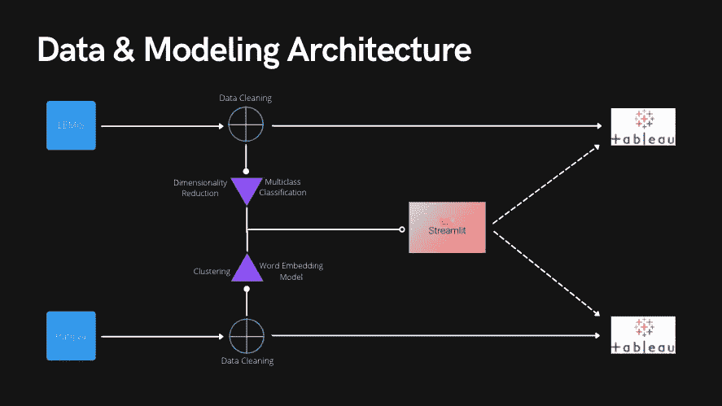

作者/项目团队提供的图片

我们利用两个数据集来提供以下见解:( 1)哪些特征可以预测一批货物是否因含有非法野生动物产品而被成功扣押;( 2)这些扣押模式是否可以使用一个更大的、公开的(通过 fee)对美国的货运数据库来揭示其他隐藏的非法贸易动态。 [LEMIS 数据集](https://data.nal.usda.gov/dataset/data-united-states-wildlife-and-wildlife-product-imports-2000%E2%80%932014)包括美国进口野生动物及其衍生产品 15 年(2000-2014)的标记数据，最初由美国鱼类和野生动物管理局收集。 [Panjiva 数据集](https://panjiva.com/)是通过付费 Panjiva 账户手动下载的，它包括与 HS 编码 01、02、03、04 和 05 的野生动物相关的进口货物(2007-2021 年)的未标记数据，因为这些数据代表动物&动物产品。两个数据集中都没有敏感数据。LEMIS 中的标签/目标变量代表给定货物的结果:废弃、清关、再出口或扣押。虽然 Panjiva 的数据主要用于评估非法贸易动态中的潜在缉获模式，但未标记的数据迫使我们使用自己的主观解释和背景来评估结果。

我们对这两个数据集进行了联合分析，主要是因为 LEMIS 数据的日期仅为 2000 年至 2014 年，而 Panjiva 允许我们访问美国最近的进口数据。此外，Panjiva 数据显示了更多的货物分类账信息，如收货人、港口等补充数据。勒米斯没有太多这方面的资料，但确实有运送货物的补充数据，如分类群、属等。

我们创建了两个 ETL 脚本，它们从每个数据源读入文件，并输出一个干净的文件，以便于其他下游任务。在我们清理完文件后，我们将每个文件发送到 Tableau 仪表板，可以在 Tableau Public 上查看。清理后的文件还用于 Streamlit 上基于网络的机器学习应用程序。

Tableau 仪表板旨在彻底探索每个数据集。我们创建了各种可视化，允许用户从多个维度和角度探索每个数据集。尽管我们的数据质量有限，但我们希望创建一个开放的探索性仪表板，帮助领域专家提出有效的问题。

Streamlit 应用程序旨在预测来自 LEMIS 的行动/处置(目标变量),并对来自 Panjiva 的货物进行聚类。用户能够通过选择不同的超参数快速迭代各种监督/非监督模型，然后使用 Lime、特征重要性、词云等技术评估模型。

随着时间的推移，我们希望将我们最好的模型预测输出到 Tableau 中，以便能够使用我们的预测，而不仅仅是模型评估。

LEMIS Tableau 仪表板:

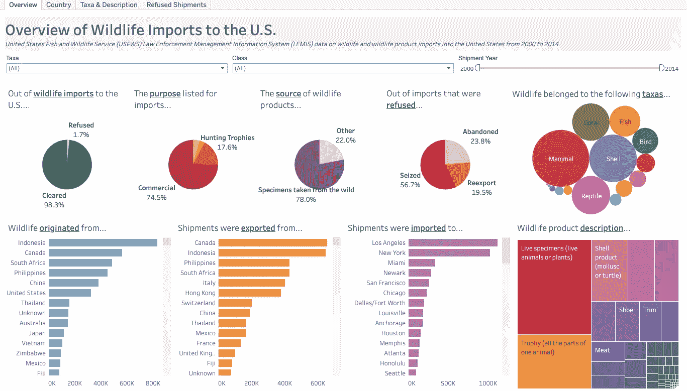

作者/项目团队提供的图片

Panjiva Tableau 仪表板:

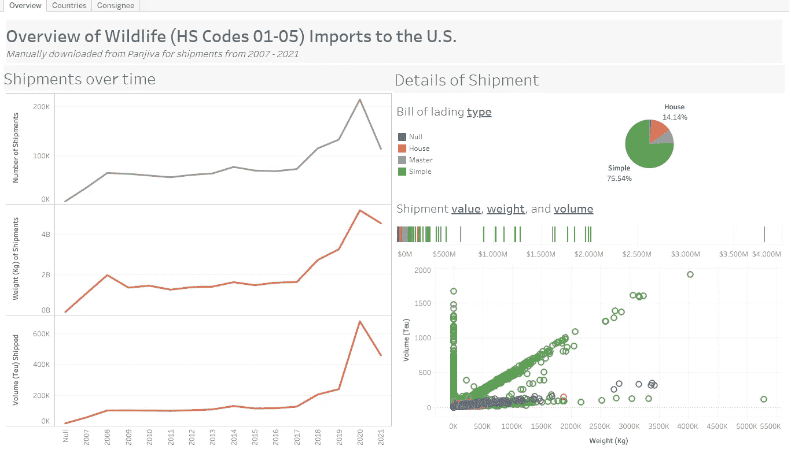

作者/项目团队提供的图片

简化应用程序:

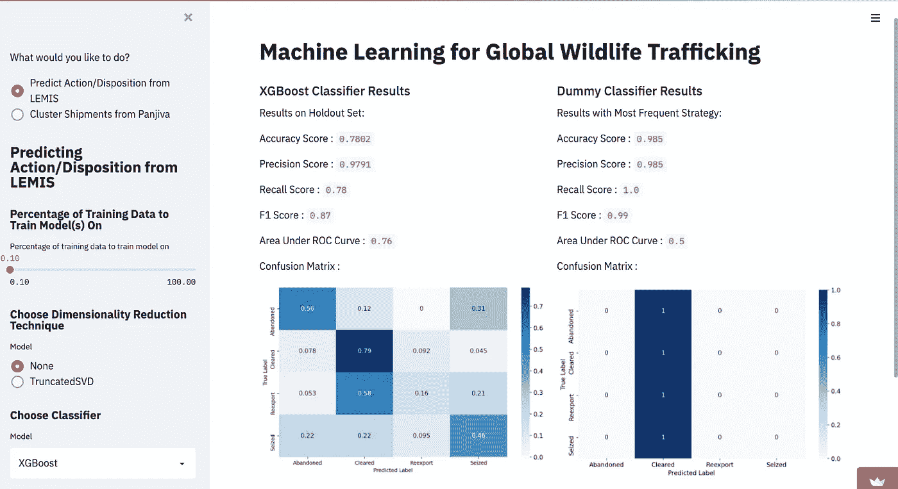

作者/项目团队提供的图片

# Tableau 中的探索性数据分析

因为我们在这个项目中与来自不同背景的利益相关者合作，所以数据的可视化能够被他们容易地探索和访问是极其重要的。为了实现这一点，我们创建了两个交互式的公开可用的 Tableau 仪表板，每个数据集一个，允许最终用户通过可视化和过滤器的各种组合来浏览数据。每个仪表板都包含一个主页，它提供了数据集的大图概述，以及几个其他选项卡，允许用户通过不同的角度分析数据。这些包括但不限于:货物的来源和去向，货物中的野生动物产品类型，被拒绝的货物与清关的货物的百分比。

**莱米斯仪表盘**

*   **概览选项卡:**LEMIS 数据集中的发货概览。
*   **国家标签**:深入查看货物的原产国、出口国和进口港。
*   **分类群&描述标签:**深入查看装运中野生动物产品的描述、分类群和通用名。
*   **拒绝发货标签**:根据某些属性重点查看被拒绝的总发货百分比。

**Panjiva 仪表盘**

*   **概览选项卡**:Panjiva 数据集中发货的大图概览。
*   **国家页签**:重点关注起运地、起运目的地地区、装货港和卸货港地区。
*   **收货人标签**:关注发货人和收货人的详细信息

每个仪表板上的所有可视化都可以作为仪表板其余部分的过滤器，这允许根据每个用户的需求对仪表板进行定制。特别是对于 LEMIS 仪表板，用户可以根据货物是被拒绝还是作为进口货物被接受进入美国进行过滤，并且可以比较每种类型的货物的属性有何不同。

作为创建这些仪表板的一部分，我们咨询了主题专家和最终用户，以确保仪表板满足他们的需求。反过来，我们收到了关于如何在下一次迭代中改进仪表板的可操作的反馈。戈尔博士告诉我们，不仅要关注装运了什么，还要关注 T2 是如何装运的。这方面的一个例子是查看一起装运的不同产品的共现情况，这是我们的仪表板目前没有解决的问题。戈尔博士建议我们进一步探讨的另一个重要课题是与各种野生动物贸易政策相比较的趋势分析。她指出，“自 2018 年以来，罚款和制裁大幅增加”，了解野生动物贸易是否以及如何受到影响将是有益的。总的来说，通过进行用户访谈，我们能够确保我们的仪表板是用户友好的，并满足他们的目标，同时收集有关如何在未来改进我们的仪表板的信息。

这两个仪表板都可以通过以下链接在 Tableau Public 上访问:

*   [雷米斯仪表盘](https://public.tableau.com/app/profile/raya.abourjeily/viz/LEMIS/Overview)
*   [Panjiva 仪表盘](https://public.tableau.com/app/profile/raya.abourjeily/viz/Panjiva/Overview)

# 从 LEMIS 预测行动/部署

## **目标**

该分析的目标是有效地预测 LEMIS 数据中给定货物的行动/处置。这种分析在短期内的预期用户是未来的研究人员，他们希望了解导致货物被丢弃、清关、再出口或被扣押的区别特征。随着时间的推移，我们看到了这种应用程序在实时应用中的潜力，以帮助官员自动化他们的直觉，同时每天评估数百万个包裹。

## **数据清理&操作**

第一个数据清理步骤包括将主 LEMIS 文件连接到一个以代码作为键/值对的文件。这允许我们将两列(单位和价值)分解成一系列列(重量(千克)、体积等)。).经过进一步的分析，我们注意到这个数据集中的很多数值度量都是空的，最终都被删除了。

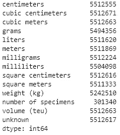

作者/项目团队提供的图片

我们最后还将这个数据集中的 action 和 disposition 字段组合在一起，作为我们的目标变量。行动只能是清关和拒绝，但处置表示在给定货物(如果被拒绝)可以被放弃、重新出口、扣押或清关之后发生的事情。在这里创建一个目标列会产生一个明显的多分类问题。

## 特征工程

LEMIS 也有多种分类学特征，如分类群、纲、属、种。这些列中有许多空值，但是由于我们问题的性质，丢失数据对我们来说是很有意义的。对于我们的用例，我们的数据集已经以相对干净的状态提供。这让我们可以假设丢失的数据不是由于一些系统错误或一些不需要的东西，而主要是由于未知的信息。因此，我们用“unknown”替换了空值，并创建了一个“complete_percent”列，它表示分类中有多少列被填充。我们的假设是，这将有助于我们的模型更有效地辨别非法运输。这是因为我们假设运送非法货物的人会将许多字段留空(即未知)，以掩盖非法产品的来源和身份。最后，我们将分类法列组合成一个字符串，这使我们能够使用文本矢量化。

尽管大多数数字字段都是空的，但我们确实找到了相当数量的值条目。价值特征的问题在于，由于高价值装运，存在许多异常值。我们通过 winsorizing 字段解决了这个方法。这使我们能够设置 0.05 和 0.95 的限值，将异常值限制在这些限值范围内。

我们最后的特性工程步骤包括使用 SMOTE 来平衡我们的目标类。我们的数据集中有大量的清除样本，因此我们对少数类进行了向上采样以确保平衡。

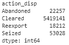

作者/项目团队提供的图片

在建模之前，我们对分类变量进行热编码，对数值变量进行稳健缩放，并对文本变量进行计数矢量化。一个热门的编码对于分类标签是有意义的，因为没有一个对它们有合理的层次结构，某些类别应该有更高的价值。鲁棒定标器在处理数据集中的异常值方面表现良好，因为它移除了中值并通过 IQR 进行归一化。最后，计数矢量化对文本功能有意义，因为它不是真正的“自由文本”字段，简单地计数分类的出现次数就足够了。

为了尽可能避免数据漂移，我们拟合并转换了训练数据，并且只转换了验证/维持集。

## 模型开发和评估

为了建模，我们尝试了一系列 5 种不同的监督模型。我们从简单的逻辑回归开始，慢慢地发现了模型学习中的障碍。我们转向利用 SGDClassifier，它能够使用梯度下降来优化学习的性能和速度。尽管这种方法表现得更好，但即使在对各种超参数应用网格搜索交叉验证后，我们也无法在评估中获得明显更好的指标。然后我们转向使用基于树的方法，比如决策树、随机森林，最后是极端梯度提升树(XGBoost)。

在反复迭代和在维持集上测试我们的模型之后，我们发现 XGBoost 能够产生最强的结果。这也适用于大多数 Kaggle 板上被视为最成功的模型，从而再次证实了我们的怀疑。引用 XGBoost 网站的文档，“XGBoost 是一个优化的分布式梯度增强库，旨在高效、灵活和可移植。它在[梯度提升](https://en.wikipedia.org/wiki/Gradient_boosting)框架下实现机器学习算法。XGBoost 提供了一种并行树提升(也称为 GBDT，GBM)，可以快速准确地解决许多数据科学问题。

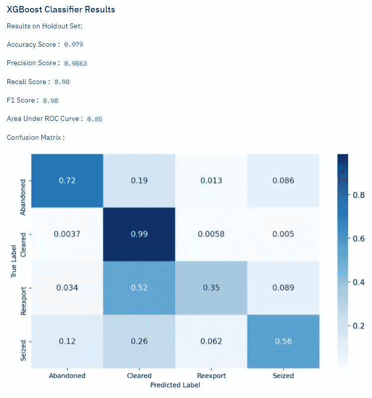

作者/项目团队提供的图片

即使在平衡数据集上训练，我们的模型实际上在检测其他类上表现得相当好。我们仍然发现，由于我们的模型中有如此大量的清关发货，我们的模型达到了一定的平稳状态。由于数据集中存在大量的空值(或未知值),并且地理位置的行动/处置规则或标准各不相同，我们推断我们的模型只会比我们现有的数据稍微好一点。由于这些不同的规则，Cleared 和 Reexport 使我们的模型有点混乱是有道理的；由于大多数航运中心和港口不想储存大量“可疑”货物，在混乱时期再出口比丢弃或扣押更容易。与鲍勃的讨论告诉我们，这个决策边界似乎依赖于官员的主观直觉。

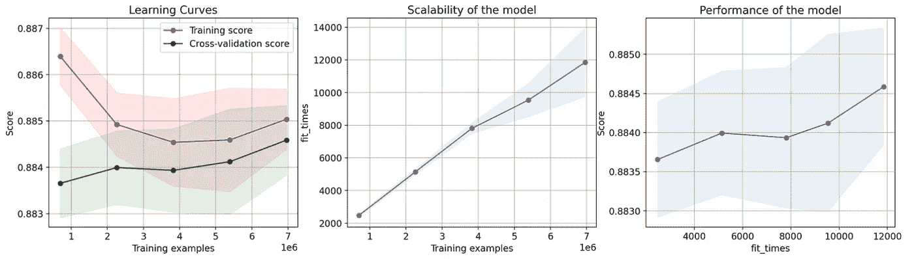

为了正确评估我们的模型性能和可扩展性，我们使用交叉验证和评估指标来利用学习曲线。

这反映了类似的理论，我们有更多的数据/例子似乎有助于我们的模型有效地考虑有多少他们被清除。即使对我们的数据集进行上采样，我们也只有有限数量的独特场景来产生我们的各种目标类。

从我们的模型中提取出系数，我们可以获得全局特征重要性，以查看模型能够辨别的内容对于区分类别是重要的。我们还可以按数据类型划分特性，以查看每种特性的重要性。

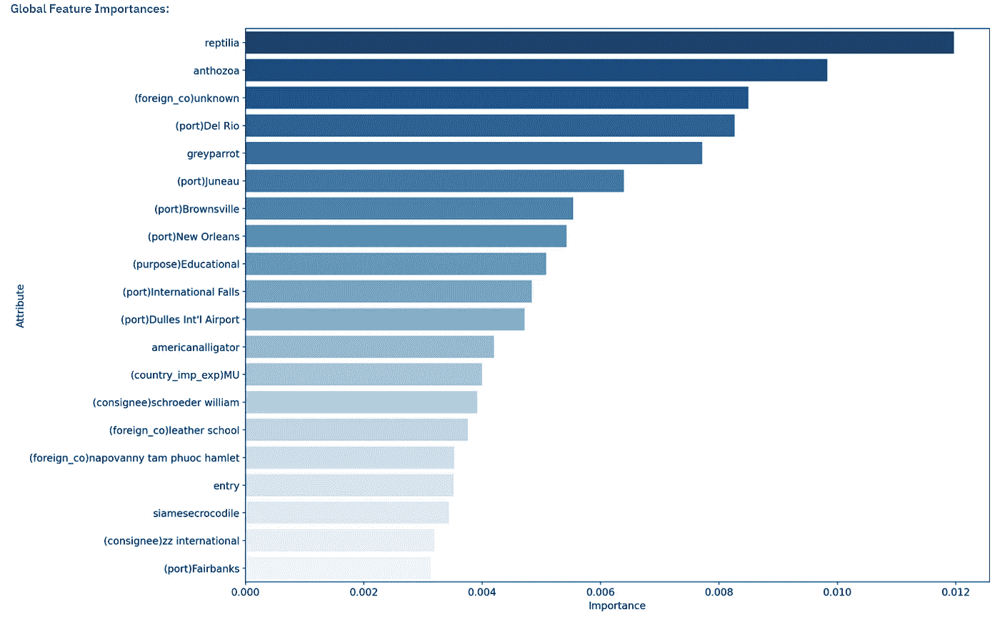

作者/项目团队提供的图片

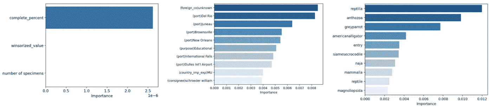

作者/项目团队提供的图片

我们开始看到某些通用名称出现在顶部，如“爬虫”和“珊瑚虫”，同时外国公司被列为“未知”也是一个重要特征。未知的外国公司很有趣，因为它符合我们的直觉:如果我们没有在舱单上看到外国公司(收货人)等重要字段，我们会发现货物相当可疑。我们还看到我们的模型选取了一些港口，如德尔里奥、朱诺号、布朗斯维尔等。我们与领域专家的讨论让我们清楚地看到，每个港口或航运中心都可以有一系列有效遵循的指导方针和法规。有些可能更容易通过非法运输，而有些则可能不容易。虽然我们不能使用这些特性的重要性来得出这些是“坏”端口的结论，但我们可以将此作为进一步调查的有教育意义的启发。

最后，我们使用 LIME 来简化多分类模型的可解释性。将我们的预测加载到一个 LIME 解释器中，我们生成一个随机的错误预测，看看模型正在学习什么。

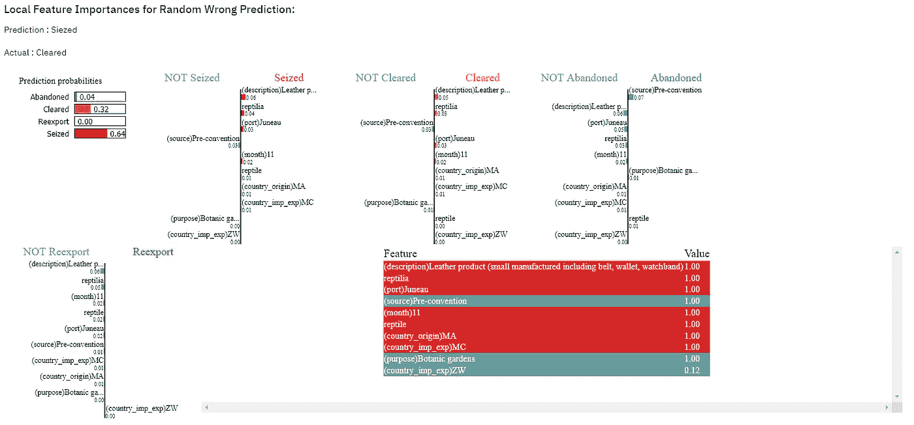

作者/项目团队提供的图片

一个错误的预测不足以得出明智的结论，但我们可以看到我们在全球特征重要性中看到的某些特征，如爬行动物和朱诺号港，有助于模型检测到它“应该”被捕获而不是清除。

关于这些模型的领域专家的进一步咨询将允许我们建立结果的有效性，并为我们指出模型迭代的下一步。我们可以展示高级数据解决方案在这一领域的价值，并阐明拥有一个强大而透明的系统，与专家的直觉合作，快速做出大规模决策的巨大价值。

从 Streamlit 中的 LEMIS 预测行动/处置可通过以下链接访问:

*   [简化应用](https://github.com/AniMadurkar/Machine-Learning-for-Global-Wildlife-Trafficking)

# 聚集来自潘吉瓦的货物

## **目标**

该分析的目标是在 Panjiva 数据结构中发现有趣的模式。与前面的目标相似，该分析的预期用户是希望了解装运之间关系的未来研究人员。在没有标签数据的情况下，我们希望能够提供包装之间的共性，这说明了对什么可能是非法的或不是的洞察。

## **数据清理&操纵**

对分类数据的分析表明，许多数据缺失。数据集中的大部分数据似乎都是自由格式的文本，所以我们很早就决定缺失的数据实际上包含有价值的信息。与我们对 LEMIS 数据集所做的类似，我们有选择地将包含空值的突出列重新标记为“未知”。然而，数据集中有一些列几乎从未被填充，所以我们被迫完全删除一些对建模没有意义的列。

## **特色工程**

我们想要探索两个特性集。第一种( **manifest clustering** )是严格处理用户提供的信息，使用最少的操作。第二个(**单词嵌入**)是关于描述装运内容的自由格式文本字段。

**货单聚类:**这里的想法是货单包含一些关于货物的事实信息(收货人、入境口岸、重量等。).该数据集包含混合的分类和连续数据类型，我们希望基于该事实信息进行聚类，以提供发货之间的关系。分类列被改为分类代码，而数字数据被标准化和规范化。

每个分类列都与其他列进行了相关性检查。通过手动检查删除了彼此高度相关的列。创建了最后一个特征来表示每批货物中缺失的列的百分比。这里的想法是，丢失列的数量可能在将包裹聚集在一起时起重要作用，因为非法运输可能隐藏信息。此外，个别装运的缺失数据用值-2 编码，而不是丢弃(如果缺失数据被丢弃，则几乎不会留下任何数据行；如上所述，缺失数据确实包含该领域中有意义的信息)。

**单词嵌入:** Panjiva 数据还包含一个自由形式的描述字段。我们希望根据用户*声称*在包中的内容将包聚集在一起。通过与我们的领域专家会面，我们了解到非法贸易通常隐藏在真实贸易中。所以用户不得不对货物中的东西撒谎。通过对这些自由形式的数据进行聚类，并将其与上面的货运清单信息相结合，研究人员有望识别出不寻常的包裹。为了做到这一点，我们创建了两个单词嵌入。我们使用了计数矢量器和 tf-idf 矢量器。在矢量化之前，我们执行了以下预处理，以确保我们使用足够的文本进行矢量化:

1.  停止单词删除
2.  数字删除
3.  单字母删除
4.  转义字符移除('/n，/r 等)
5.  移除包含任何数字的单词

步骤 3、4、5 都是在矢量化的多次迭代之后完成的。手动检查每个矢量化迭代，以查看哪些频率(术语/文档/等)是重要的，并编辑标记化，直到表示出有意义的单词。

## **模型开发&评估**

**清单聚类:**对于清单特征集，我们希望探索将分类变量和连续变量混合在一起的模型(我们也只检查了连续模型，但是通过与领域专家的讨论，我们了解到这些模型价值较低)。探索了不同的模型类型，直到为了处理大型数据集的性能和能力而选择了 [KPrototypes 集群](https://citeseerx.ist.psu.edu/viewdoc/download?doi=10.1.1.15.4028&rep=rep1&type=pdf)。KMeans 不用于任何分类数据，因为它将使用分类代码作为连续表示，这在数学上是不准确的。使用肘方法，我们确定了 5 个聚类组，充分解释了聚类之间的关系:

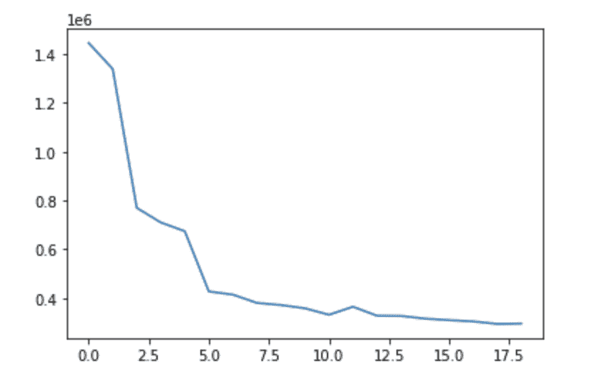

作者/项目团队提供的图片

聚类之间的分离也进行了视觉检查，虽然多维空间的二维表示具有挑战性，但我们相信大多数表示确实显示了聚类之间的良好分离，这表明我们在特征创建步骤中的假设是可靠的。

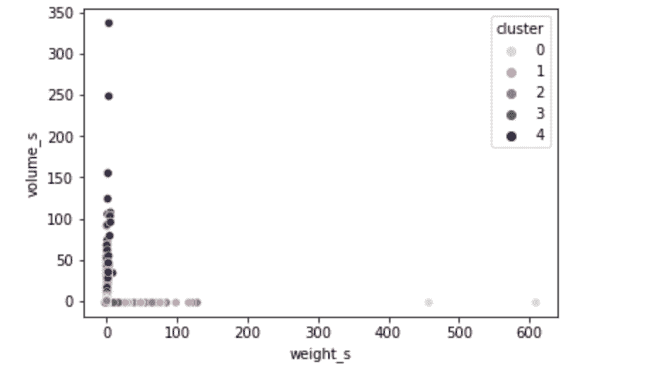

作者/项目团队提供的图片

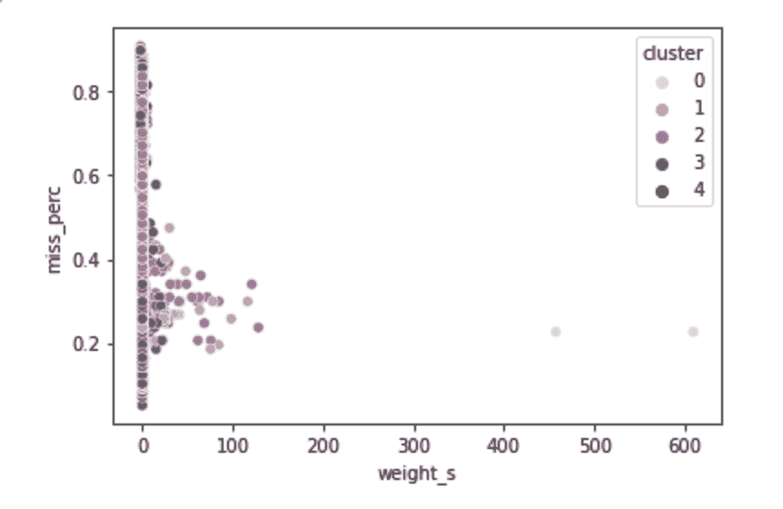

作者/项目团队提供的图片

有趣的是，每个集群的装运数量并不相等，如下所示:

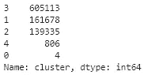

作者/项目团队提供的图片

这并不意外，因为这项研究的目标是为研究人员找到独特的装运进行调查。我们认为这是因为我们有许多与野生动物和产品相关的类似物品被运输。很可能，即使是非法运输也被贴上“频繁”运输的标签，以避免被怀疑和标记。

**单词嵌入:**在创建模型之前，我们想要检查矢量器本身的性能。为此，创建了余弦相似性度量。使用 NearestNeighbors 模块，根据整个数据集中前 10 个最接近的匹配检查了许多随机包。下面是一些结果示例(每个示例中的第一行是正在比较的行):

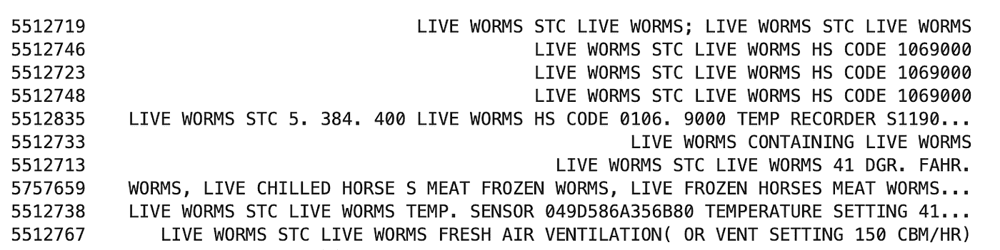

作者/项目团队提供的图片

作者/项目团队提供的图片

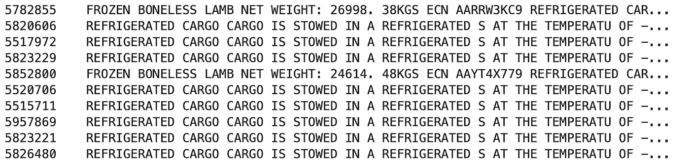

作者/项目团队提供的图片

可以看出，矢量器似乎很好地解析了自由形式的字段。从这里开始，在矢量化的语料库上构建 KMeans 模型来对装运进行聚类。如 **a)** 所述，肘法用于确定适当的集群数量:

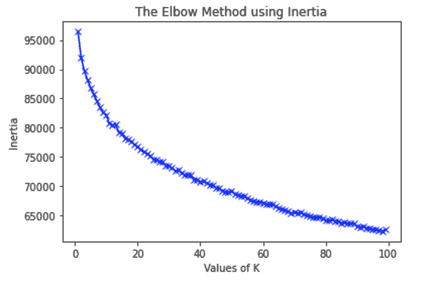

作者/项目团队提供的图片

虽然没有像以前那样立即出现瓶颈，但我们确实看到更多集群的收益递减。我们为剩下的分析选择了 50 个集群，但是我们让研究人员通过 Streamlit 应用程序进行实际选择。

然后对每个集群的模型性能进行上下文检查。单词云的建立既是为了检查模型的性能，也是为了给研究人员一个每个集群包含什么的指示。下面可以看到一些示例:

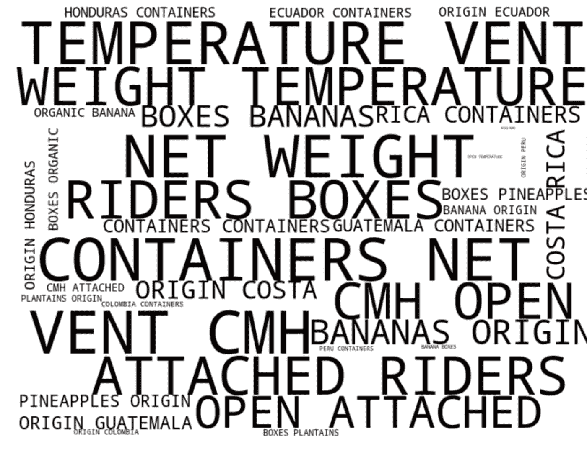

作者/项目团队提供的图片

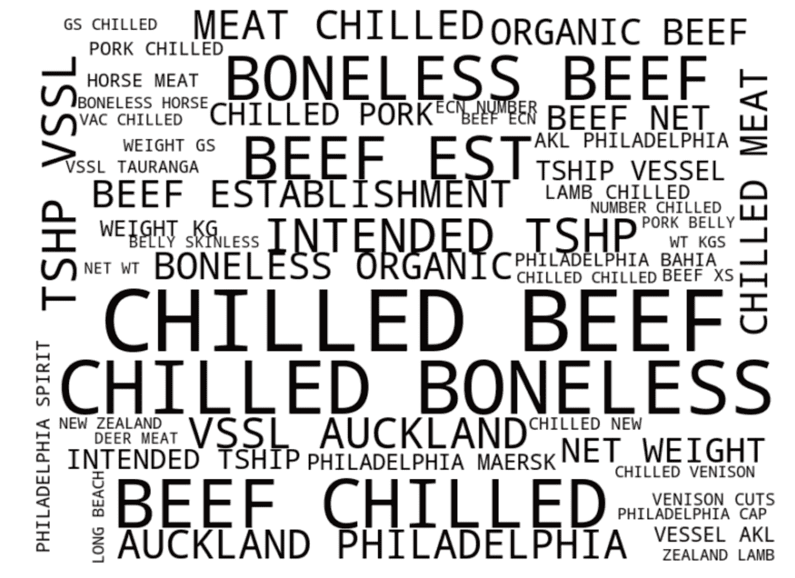

作者/项目团队提供的图片

我们希望使用这些词云来表示特定的日期范围和地理位置，以缩小我们关注的货物清单的范围。我们还要求 Bob 为我们未标记的 Panjiva 数据集提供一个“可疑”标签，这将为我们的模型能够辨别哪些聚类提供重要的见解。

可通过以下链接访问 Streamlit 中来自 Panjiva 的集群装运:

*   [简化应用](https://github.com/AniMadurkar/Machine-Learning-for-Global-Wildlife-Trafficking)

# 那又怎样？

亚历克斯、拉亚和我都相信，尽管前沿的模型、算法和工具既有趣又令人兴奋，但最重要的是你用数据为世界的某个方面提供了什么价值。由于尼尔·卡特博士和他慷慨地分享他的时间和知识，我们碰巧进入了全球野生动物贩运的世界。在这个世界上，我们花了大部分时间去了解他们面临的问题和他们的真实经历。我们发现他们的数据需求主要围绕以下方面:

1.  **易于访问的广泛数据分析，可帮助领域专家提出正确的问题**
2.  **一套广泛的大数据解决方案，提供可解释和可操作的结果**

我们希望我们的 Tableau 仪表盘和 Streamlit 应用程序能够提高人们对这个世界上突出问题的认识。大规模提供易于访问的高级分析可以帮助未来的研究人员和从业人员提出更好的问题，并利用证据调查非法贩运。我们希望它能够激励他们公开分享和使用数据，因为它对于将当前的解决方案从反应式转变为指令式具有巨大的价值。

# 工作说明书

ETL 脚本— Ani Madurkar

数据操作—所有团队成员

数据可视化和特征工程—所有团队成员

Tableau 中的探索性数据分析— Raya Abourjeily

从 LEMIS-Ani Madurkar 预测行动/部署

聚集来自 Panjiva 的货物— Alex Hardy

数据科学团队负责人— Ani Madurkar

特别感谢尼尔·卡特博士为我们贡献了这么多时间。我们的进步很大程度上归功于他的专业知识和热心帮助。