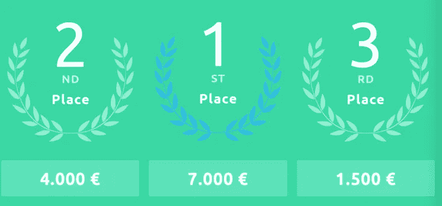

# 永久的数据科学:一种新型的数据马拉松

> 原文：<https://towardsdatascience.com/data-science-for-good-a-new-type-of-datathon-abeaedb37916?source=collection_archive---------17----------------------->

## 通过解决面向社会的问题来寻找最好的数据科学家

索菲亚·瓦尔科娃在 [Unsplash](https://unsplash.com/s/photos/buildings?utm_source=unsplash&utm_medium=referral&utm_content=creditCopyText) 上的照片

数据科学的绝大多数信息很可能与私营部门(如科技公司)和实现企业目标的编程技能相关。然而，在全球范围内，我们一直面临着多重社会挑战，如气候危机，清洁能源，野生动物保护，可持续发展的城市和许多其他问题。

事实上，联合国在其网站上有一个专门讨论“大数据促进可持续发展”的栏目**【1】**。类似的数据科学技术有助于实时了解人们的生活和福祉，并有针对性地为弱势群体提供干预措施。现代数据来源(*例如*卫星数据)、新技术和新分析方法，在负责任地应用时，可以使循证决策更加敏捷和高效。此外，它能够以公平和包容的方式衡量可持续发展目标的进展**【2】**。总的来说，有大量的机会将数据科学用于好的方面。

## **什么是世界数据联盟？**

[世界数据联盟](https://worlddataleague.com/) ( **WDL** )是一个最近成立的团队，致力于数据领域，希望看到数据科学对社会问题的真正影响。他们相信社区的力量，相信当数据专业人员共同努力改善世界时，取得重大成果是可能的。

他们拥有创建技术和非技术社区、为技术社区组织难忘的活动以及特定竞赛的经验。他们的目标是创建一个数据科学家的全球社区，共同竞争解决面向社会的问题。WDL 有四个关键支柱推动其社会驱动的目的:

*   *全球视角。他们认为知识多样性对解决全球问题至关重要。没有年龄、国籍、性别、种族之分；我们应该只关注解决方案。*
*   *支持数据科学家。*数据领域每天都在增长和发展，WDL 希望为数据科学家的发展做出贡献，就像他们为解决社会问题做出贡献一样。
*   *不扯淡政策*。解决社会问题必须脱离政治、销售产品和其他商业驱动的目标。所有的结果都将公之于众。
*   *作为一个联盟工作。WDL 的*任务是寻找并加冕世界上最好的数据科学家。他们将通过发起竞赛来解决面向社会的问题。

## **它是如何工作的？**

比赛分为六个阶段。每个小组应该有三到四名成员。此外，每个团队应该要么有一个国籍，要么是一个完全国际化的团队。申请阶段已经开始，将于 3 月 15 日结束。

然后，从 3 月 16 日到 30 日，选拔阶段开始了。WDL 竞赛要求最低的技术经验，包括基本的编程和数据科学技能)。他们将选出最多 50 支队伍。

在选拔阶段之后，联赛从 4 月 1 日开始，持续到 5 月 31 日。他们将选择一个主题(一个社会挑战)分成四个子领域，每个领域都成为比赛的一个新阶段。每个阶段将有两周时间，每次只允许提交一份提案。WDL 会记录分数，并在每个阶段结束时更新排行榜。

在一系列激烈的挑战后，WDL 将总结并宣布前 10 名决赛选手。从 7 月 15 日到 17 日(为期三天的活动)，决赛选手将竞争解决一个社会问题。8 月，他们将宣布获胜者，并开放所有结果、数据和代码。

## **我有什么好处？**

嗯，很多。首先，你将有机会对重大社会问题产生全球性影响。因此，你将帮助拯救生命，支持我们的环境和子孙后代。第二，有一系列的奖品:

竞赛奖品；图片由 [WDL](https://worlddataleague.com/) 提供。

## **准备申请？**

查看他们的网站了解更多细节和如何申请。第一个挑战是关于数据驱动的城市。根据联合国的数据，预计到 2050 年，68%的世界人口将居住在城市地区。目标是帮助实现第 11 个联合国可持续发展目标——可持续发展的城市和社区**【5】**。

## **结论**

数据科学的持续增长带来了许多机会和熟练的专业人员。然而，大多数努力和数据都是针对私营部门的。世界数据联盟通过发起一场激动人心的比赛来推动全球变化，为数据专业人士带来了一个全新的视角。作为一名数据和技术爱好者，你将有机会处理现实生活中的数据并解决社会问题:在第一个例子中，你和你的团队成员将专注于可持续发展的城市。因此，无论你是一名经验丰富的数据专业人士，还是仅仅[将职业生涯转向数据科学](/switching-career-to-data-science-in-your-30s-6122e51a18a3)，这都是你一直在寻找的机会[脱颖而出](/what-makes-a-data-scientist-stand-out-e8822f466d4c)，并产生重大的社会影响。

**感谢阅读。这里有一些你可能会喜欢的文章:**

 [## 30 多岁转行做数据科学。

### 不要纠结于已经有答案的问题。以下是我希望在开始职业生涯前知道的三件事…

towardsdatascience.com](/switching-career-to-data-science-in-your-30s-6122e51a18a3)  [## 如何提高你的编码技能

### 如果你正在学习如何编码，那么理解什么是神经可塑性以及如何破解你的…

medium.com](https://medium.com/swlh/how-to-boost-your-coding-skills-c1911f78e63c)  [## 机器学习就像足球

### 对复杂话题的有趣类比

towardsdatascience.com](/machine-learning-is-like-football-e3e3ace8ce7a) 

**参考文献:**

**【1】UN**[https://www . UN . org/en/sections/issues-depth/big-data-sustainable-development/index . html](https://www.un.org/en/sections/issues-depth/big-data-sustainable-development/index.html)

**【2】SDGs**[https://www . un . org/sustainable development/sustainable-development-goals/](https://www.un.org/sustainabledevelopment/sustainable-development-goals/)

**【3】https://worlddataleague.com/**[WDL](https://worlddataleague.com/)

**【4】成长中的城市**[https://www . un . org/development/DESA/en/news/population/2018-revision-of-world-urbanization-prospects . html](https://www.un.org/development/desa/en/news/population/2018-revision-of-world-urbanization-prospects.html)

**【5】第 11 个联合国可持续发展目标**[https://www . global goals . org/11-Sustainable-city-and-communities](https://www.globalgoals.org/11-sustainable-cities-and-communities)