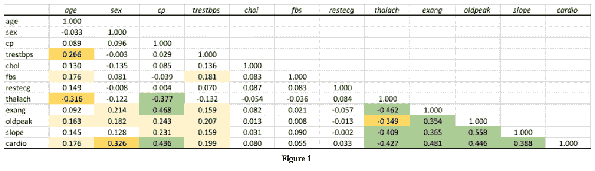
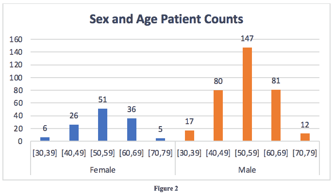
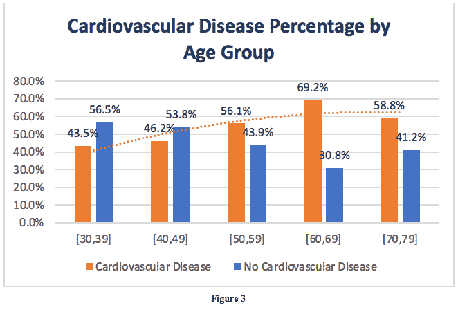
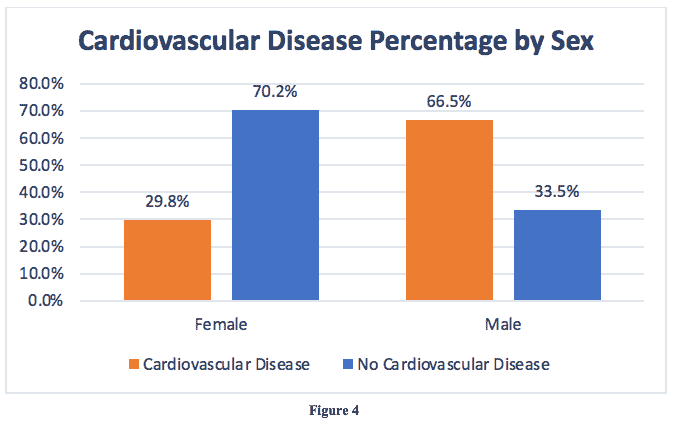
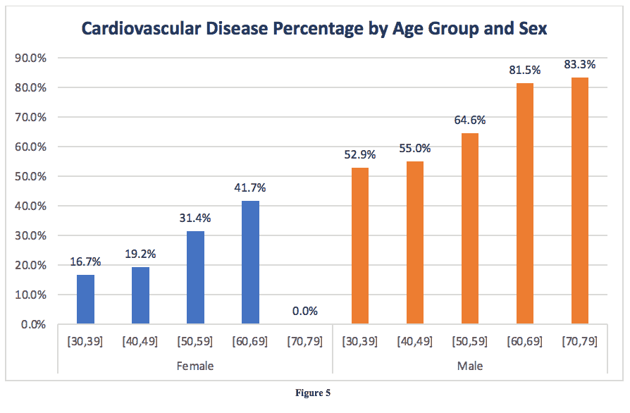
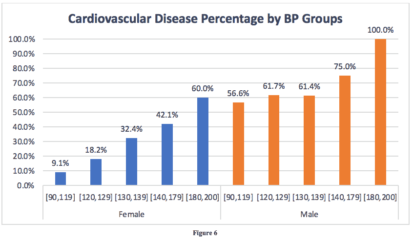
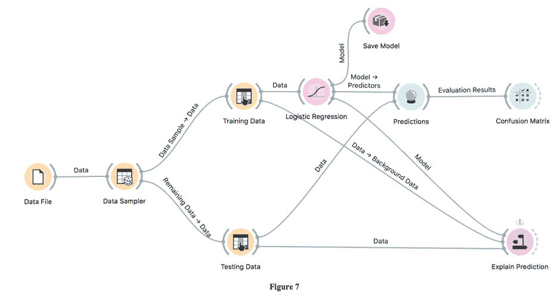
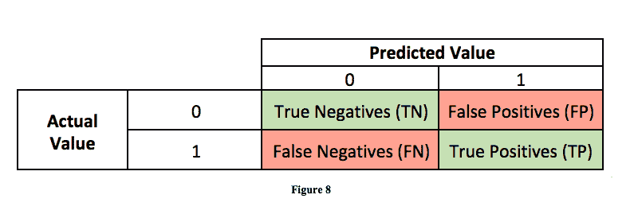
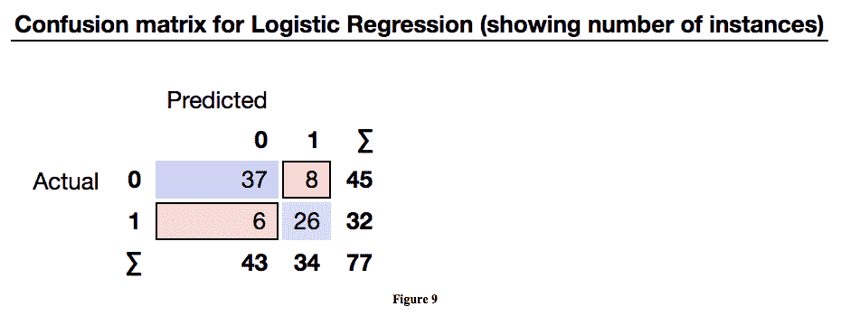
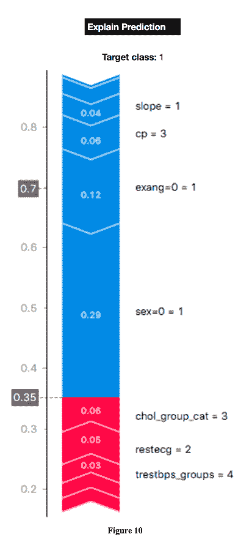

# 心脏数据科学

> 原文：<https://towardsdatascience.com/data-science-for-the-heart-c654135ceee5?source=collection_archive---------19----------------------->

## 心血管疾病数据分析和预测建模

[李东旻](https://unsplash.com/@alexleegdp?utm_source=medium&utm_medium=referral)在 [Unsplash](https://unsplash.com?utm_source=medium&utm_medium=referral) 上拍照

# **简介**

这种数据探索和预测分析的目的是为了更好地了解哪些健康因素影响患者的心脏病风险。为此，将对数据进行介绍，并对数据集中的健康因素进行图形分析。将介绍预测建模过程，给出逻辑回归预测模型评估的背景。该评估将包括审查混淆矩阵中的性能指标。最后，将通过一个具体的例子来解释模型的计算，以说明这些因素是如何推动预测的。

# **数据集解释**

为该项目选择的心脏病数据集来自 [UCI 机器学习库](https://archive.ics.uci.edu/ml/datasets/heart+disease)。该数据集由 461 名患者的数据组成，描述了个体的健康因素和心脏病的诊断。本项目中使用的数据集中的 12 个健康因素概述如下。

1 **。年龄** —以年为单位的患者年龄

2.**性别** —患者的性别

*   *0 表示母*
*   *1 表示公*

3. **CP** —患者胸痛类型

*   *1 表示典型心绞痛*
*   *2 表示非典型心绞痛*
*   *3 表示非心绞痛性疼痛*
*   *4 表示无症状患者*

4.**trest bps**——以毫米汞柱为单位的静息血压

5.**胆固醇**——血清胆固醇，单位为毫克/分升

6.**空腹血糖** —空腹血糖

7.**静息心电图** —静息心电图结果

*   *0 表示正常*
*   *1 表示有 ST-T 波异常*
*   *2 表示可能或明确的左心室肥大*

8. **Thalach** —达到最大心率

9.**Exang**——运动诱发心绞痛

*   *0 表示无*
*   *1 表示是*

10. **Oldpeak** —运动相对于休息诱发的 ST 段压低

11.**斜率**——运动 ST 段峰值的斜率

*   *1 表示上坡*
*   *2 指示平面*
*   *3 表示下坡*

12.**心脏** —心脏病的诊断

*   *0 表示缺席*
*   *1 表示存在*

为了进行分析和预测建模，对数据进行处理，以便对年龄、静息血压和血清胆固醇因素进行分组。

# 数据分析

图 1 中的上表为理解数据集中的健康因素如何相互关联提供了基础。在年龄栏中，trestbps(静息血压)和 thalach(达到的最大心率)是与年龄最相关的因素。随着患者年龄的增加，他们的静息血压趋于增加，而他们达到的最大心率趋于降低。年龄和有氧运动之间的相关性是正相关的，但是这种相关性不是很强，其值为 0.176。

特别感兴趣的是表格中关于心脏疾病诊断的那一行。这一行显示了有氧运动和其他健康因素之间的相互关系。与有氧运动相关性最强的一些因素是 cp、thalach、exang、oldpeak 和 slope，它们在数据集说明部分有定义。虽然年龄和性别与心脏因素没有很强的相关性，但这并不是说不能从这些因素中得出结论。通过观察年龄和性别分组之间的趋势，分析这些因素如何与心脏因素相互作用，揭示了患者的年龄和性别如何在统计上影响心血管疾病的总体风险的额外信息。

数据样本包括总共 461 名患者，其中 124 名为女性，337 名为男性。在分析数据时，考虑患者性别之间的样本大小差异是很重要的，因为整个人群的趋势将向更大群体的方向转变。数据集中患者的年龄范围从 30 岁到 79 岁。上图 2 显示了按性别和年龄分列的患者人数。

按年龄分组在上面的图 3 中，数据显示心血管疾病的百分比通常随着患者年龄的增加而增加。一个异常值是在 70-79 岁的人群中，心血管疾病患者的比例从 60 多岁的 69.2%下降到 70 多岁的 58.8%。

如上图 4 所示，男性和女性之间的心血管疾病比例存在很大的不平衡。在该数据集中，男性患者患心血管疾病的可能性是两倍多，66.5%的男性患有该疾病，而女性只有 29.8%。

使用从分别按性别和年龄查看数据中获得的知识，下面的图 5 结合了这两个因素，给出了一个更详细的视角。数据显示，男性患者和老年患者更有可能患有心血管疾病，图 3 和图 4 也显示了这一点。图 5 进一步详细说明了年龄和心血管疾病之间的关系，这种关系在男性和女性中都是成立的，并且不仅仅在作为一个整体的样本人群中观察到。

一个异常值是 70 多岁的女性，60 多岁女性的患病率从 41.7%下降到 0%。在图 3 中，这是导致 60 多岁到 70 多岁的男女患者之间疾病百分比显著下降的因素。应该注意的是，对于男性来说，年龄和更高的心血管疾病百分比之间的相关性适用于数据集中的所有年龄组。

对于一个边远的女性年龄组，应该注意的是该组的样本量是所有组中最小的。图 2 显示只有 1%的数据样本，461 名患者中的 5 名是 70 多岁的女性。与所有其他年龄和性别群体相比，这一比例非常低，30 多岁的女性除外。

虽然年龄和性别是数据集中最容易获得的健康因素，但它们不是本次数据探索中使用的唯一测量方法。例如，血压是患者患心血管疾病风险的一个重要因素。下图 6 是按性别和血压分组的。血压分类是基于哈佛健康出版社的指南。

对于女性和男性来说，较高的收缩压测量值与较高的心血管疾病风险相关。一个异常值是[130，139]收缩压分组中的男性，患有该疾病的患者百分比下降了 0.3%，从之前的[120，129]分组的 61.7%降至 61.4%。

对于女性来说，各组之间心血管疾病风险的变化相当稳定，而对于男性来说，这种变化随着血压分组的增加而增加。女性和男性群体之间疾病风险的平均变化分别为 12.73%和 10.85%。

图 6 继续显示了数据集中女性和男性心血管疾病发病率的差异。收缩压读数在[90，119]之间(被认为是正常测量值)的男性患心血管疾病的可能性仅比最高血压分组[180，200]中的女性低 3.4%，最高血压分组被认为是高血压危象患者的测量值。

# **数据集资源**

可以在下面的 [GitHub 存储库](https://github.com/SulemanBazai/Cardiovascular-Disease-Data-Analysis-and-Predictive-Modeling)中找到清理后的数据集，以及用于创建上述图表的数据透视表。请随意下载该文件，以进一步将数据分割成不同的可视化效果。还有许多额外的列代表健康因素，这些因素在本次讨论中没有具体深入地可视化，但在逻辑回归预测模型中使用。

# **预测模型流程**

本研究中使用的预测模型是逻辑回归模型。在这种情况下，逻辑回归是一种有效的模型，因为被预测的因变量要么为真，要么为假，要么为 0。预测值为真或 1 表示预测患者患有心血管疾病。false 值或 0 表示预测患者不会患病。对心脏数据点的预测基于给定的输入，即数据集中的 11 个其他健康因素。

用于构建、训练和测试逻辑回归模型的软件是 [Orange](https://orangedatamining.com) ，这是一个开源的机器学习和数据可视化工具包。图 7 显示了详细描述模型设置和模型性能评估执行的可视化。

简单总结一下这种可视化

1.  数据集被加载到工作空间中，由**数据文件**小部件表示
2.  数据被送入**数据采样器**，采样器将数据分成两组
3.  集合 1 是**训练数据**，包括大约 85%的总数据
4.  第二组是**测试数据**，约占总数据的 15%
5.  训练数据被输入到**逻辑回归**模型小部件中以构建模型
6.  逻辑回归模型和测试数据被映射到**预测**小部件，在那里根据测试数据评估模型
7.  生成**混淆矩阵**以进一步分解模型的性能
8.  **解释预测**小部件映射逻辑回归模型，以及训练和测试数据，以解释哪些特性对单个实例的预测贡献最大，以及它们是如何贡献的

# **使用混淆矩阵的模型评估**

用于描述模型性能的评估度量是混淆矩阵。混淆矩阵中的两个可能类别是 0 和 1，或者假和真。预测值为 0 或假，表示模型预测患者没有心血管疾病。预测值为 1 或 true 表示模型预测患者患有心血管疾病。

有了这些知识，可以定义以下术语

1.  **真阴性**(TN)——模型预测为 0 的情况，即患者没有心血管疾病，并且患者没有该疾病
2.  **真阳性**(TP)——模型预测 1、患者患有心血管疾病且患者确实患有该疾病的情况
3.  **假阴性**(FN)——模型预测值为 0 的病例，即患者没有心血管疾病，而患者确实患有该疾病
4.  **假阳性**(FP)——模型预测 1，患者确实患有心血管疾病，而患者并未患病的情况

根据这些定义，一个完美的模型将使每个案例都属于真阴性或真阳性类别，而没有案例属于假阴性或假阳性类别。因此，构建模型时的目标应该是减少 FN 和 FP 案例。

对于预测心血管疾病的特定情况，降低 FN 等级是至关重要的，因为在这些情况下，患者被预测没有患病，但确实患病。如果根据这种预测做出治疗决定，这些患者可能无法接受心血管疾病的适当治疗或药物治疗。

上面的混淆矩阵显示了对测试数据进行评估时逻辑回归模型的 TN、TP、FN 和 FP 值。总共有 77 名患者包含测试数据，约占总数据集的 16.7%。为了评估模型的性能，将定义一些额外的术语及其相应的值。

1.**准确性** —模型总体正确的频率

*   *(TN+TP)/总计= (37 + 26)/77 = .818*

2.**回忆** —当实际值为 1 时，模型预测为 1 的频率

*   *TP/(TP+FN)= 26/(26+6)= . 813*

3.**精度** —当预测值为 1 时，模型正确的频率是多少

*   *TP/(TP+FP)= 26/(26+8)= . 765*

4. **F1 得分** —召回率和准确率的加权调和平均值

*   *这个分数往往比单独的准确度更有用，因为它同时考虑了 FP 和 FN*
*   *2*(召回*精度)/(召回+精度)= 2 *(0.813 * . 765)/(. 813+. 765)= . 788*

5.**零错误率** —如果模型总是预测为 0，那么模型出错的频率

*   *0 是上述*混淆矩阵测试数据中的多数类
*   *(实际 1)/合计=(FN+TP)/合计= (6 + 26)/77 = .416*

这些度量通过对混淆矩阵的评估，总结了逻辑回归模型的性能。从召回可以看出，该模型正确地捕获了 81.3%的患有心血管疾病的患者。从精度可以看出，当模型预测患者患有心血管疾病时，该预测在 76.5%的情况下是正确的。

零错误率为 41.6%，一个总是预测 0 的模型，即患者没有心血管疾病，在 58.4%的时间里是正确的。这可以用作比较实际逻辑回归模型的基线指标。由于准确率为 81.8%，召回率为 81.3%，精确度为 76.5%，F1 值为 78.8%，很明显，逻辑回归模型在统计上优于总是预测患者没有疾病的基本模型。

# **预测解释**

图 10 是一个预测解释视图，它基于模型解释了特性对单个实例的预测的贡献程度。解释中的目标类别是 1，意味着模型正在评估患者是否被预测患有心血管疾病。如果特征贡献总计超过 0 . 5，则心血管疾病的预测将是 1。类似地，如果特征贡献总计低于. 5，则对于没有心血管疾病的患者，预测将是 0。

从图中可以看出，灰框中的. 35 是模型计算出的概率，表示患者没有被预测到患有该疾病。对于预测，贡献最大的特征是患者的性别、运动诱发的心绞痛类别、胸痛类别和胆固醇组类别。本例中的患者是女性，由性别=0 = 1 指定。在这些类型的情况下，分类要素以格式 feature-name=feature-value = 0/1(假/真)标注。

与患者为女性相关的蓝条中的 0.29 表明该因素将患该疾病的计算概率降低了 29%。类似地，exang=0 = 1 表明患者没有运动诱发的心绞痛，将计算出的患病概率降低了 12%。

红色条中的 0.06 与胆固醇组 3 有关。这表明，处于这一胆固醇分组中的患者患心血管疾病的计算概率增加了 6%。胆固醇分类是基于梅奥诊所的指南。

# **结论**

这种对心脏病的数据探索和预测分析已经确定了哪些健康因素在统计上影响患者的疾病风险，以及这些因素对风险的影响程度。图形分析和预测解释都表明，即使是来自患者的有限数量的健康数据也可以提供一个模板来了解他们的疾病风险。

混淆矩阵中的评估支持了这种理解，其导致了 81.8%的总体模型准确性。该模型的召回率为 81.3%，即当患者确实患有疾病时，该模型预测患者患有该疾病的频率。模型的精确度，即当预测值为患者患有疾病时，模型正确的频率为 76.5%。从这种表现可以得出结论，导致心脏病的健康因素可以被识别并用于更好地了解患者的疾病风险。