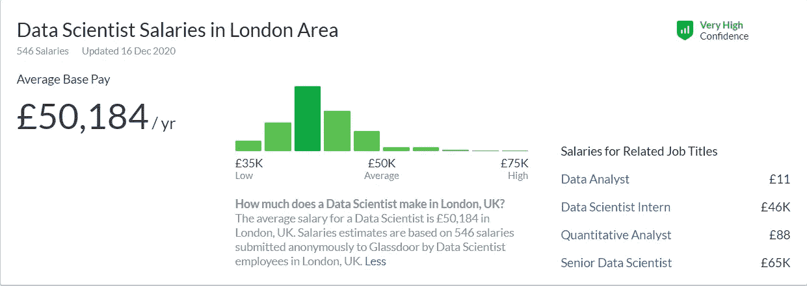

# 数据科学:不知道 2021 年还刺激吗

> 原文：<https://towardsdatascience.com/data-science-i-wonder-if-its-still-sexy-in-2021-b68006c78f71?source=collection_archive---------78----------------------->

## 了解数据科学是否仍然令人兴奋，它是否适合你

胡安·鲁米普努在 [Unsplash](https://unsplash.com?utm_source=medium&utm_medium=referral) 上的照片

## 介绍

每年产生的数据的增加是一个挑衅性的姿态，启发企业采取更多的行动并使用他们所掌握的数据。尽管数据驱动的决策在 2012 年之前就已经存在，但发表在《哈佛商业评论》上的一篇著名文章吸引了许多人的注意。

> “它们在商业领域的突然出现反映了这样一个事实，即公司现在正在努力应对从未遇到过的种类和数量的信息。”——哈佛商业评论，2012 年。

有了 [*数据科学家:21 世纪最性感的工作*](https://hbr.org/2012/10/data-scientist-the-sexiest-job-of-the-21st-century) *，*这样的标题，就不难理解为什么这份工作可能是今天许多人想成为数据科学家的一个影响因素。然而，随着我们迅速接近原始文章发表后的十年，我很想确定数据科学是否已经失去了它的吸引力，以及它是否是一个值得追求的好职业。

## *什么是数据科学？*

取决于你问谁，你可能会得到一个完全不同的答案。例如，美国统计学家 Nate Silver 认为数据科学只是统计学的另一个名称，而同样是美国统计学家(哥伦比亚大学统计学教授)的 Andrew Gelman 将统计学描述为数据科学的非必要部分。

尽管存在困惑，但我相信我们都同意数据科学专注于使用科学方法、流程、算法和系统从数据集中提取知识和见解，从而包含分析，确保数据处于足够好的状态以供分析，然后提供见解以通知高层决策。

## 理想工作的 5 个要素

如果我们想知道数据科学是否会是一个好职业，我们定义好职业的组成要素是很重要的。

许多人通常会认为，找到合适的职业包括通过灵光一现找到自己的激情，或者决定报酬最高的最轻松的工作。然而，根据名为 [*的 2017 年职业指南，我们回顾了 60 多项关于理想工作的研究。下面是我们发现的*](https://80000hours.org/career-guide/job-satisfaction/#:~:text=To%20find%20a%20dream%20job%2C%20look%20for%3A,that%20fits%20your%20personal%20life.) ，没有证据支持这些说法。

相反，从他们的研究中，他们能够提出 5 个关键因素(实际上是 6 个，但我觉得第 6 个有点重复)，这些因素可以用来创造理想的工作，我将使用这些因素来确定数据科学在 2021 年是否仍然是一个好的职业。

## #1 吸引人的工作

与普遍的看法相反，薪水、地位和一个人可能工作的公司类型对工作是否有吸引力并没有人们想象的那么重要。事实上，决定工作是否吸引人的是日常工作。

> “引人入胜的工作是吸引你、吸引你的注意力、给你一种流动感的工作。”——本杰明·托德，《八万小时》的作者

仔细想想，这很有道理——想想当我们在玩一个有趣的游戏时，时间是如何呼啸而过的。我们发现游戏很吸引人，因为我们拥有:

*   决定如何执行任务的自由感
*   要完成的明确任务或目标
*   要做的各种任务
*   反馈来了解你做得有多好

回到上下文中来，数据科学家的日常任务通常围绕着数据，这并不奇怪。人们经常说，数据科学的大部分工作是收集、分析或清理数据，将其转换成合适的格式，以便做进一步的工作。然而，这项工作的全部范围不止于此，还有其他与上面列出的技术任务同样重要的活动，例如与非技术利益相关者交流，以及跟上该领域的变化。

许多人会同意，数据科学是一门科学，也是一门艺术，因此为实践者提供了执行手头任务的自由。问题是，世界上所有的自由并不意味着像我们过去看到的那样，价值正在被创造。2017 年有一篇流行的文章——[大数据战略以 85%的失败率](http://www.digitaljournal.com/tech-and-science/technology/big-data-strategies-disappoint-with-85-percent-failure-rate/article/508325)令人失望——该文章主要声称数据项目未能实现公司所期待的预期转型。

> 如果我指出这是数据项目高交付率的绝对原因，那将是犯罪，然而，为了这篇文章，重点将放在延长的周转时间和巨大的努力上，而没有看到潜在的价值，因为这涵盖了参与的关键点——反馈。

数据科学项目需要大量的努力，尽管缺乏对项目最终结果及其商业价值的可见性。传统项目可能需要很长时间才能完成，直到可以评估结果，延迟的反馈可能会令人沮丧，尤其是在投入所有努力和资金后，项目失败了。

此外，如果你在一家小公司工作，你就不太可能参与各种各样的项目，因为他们可能不愿意在可能成功也可能失败的事情上投入这么多的投资。

**我的评价(从事的工作):3/5**

## #2 帮助他人的工作

游戏可能会提供高水平的参与，但它缺乏的是帮助他人的能力——尽管这种情况正在开始转变，因为许多人发现观看他人的游戏有很大的娱乐性，这可以被视为一种帮助形式。

越来越多的证据表明，帮助他人在我们的生活满意度中发挥着重要作用，如果是这样的话，这就是数据科学蓬勃发展的地方。—关于这方面的更多信息，你可以阅读由伦敦大学学院出版的关于更多慈善支持的[帮助他人的 10 个好处](https://www.ucl.ac.uk/students/news/2020/apr/10-benefits-helping-others#:~:text=Volunteering%20your%20time%2C%20money%2C%20or,and%20sense%20of%20well%2Dbeing.)，尽管我确信利用商业支持他人的人也会获得同样的好处。

数据是由人产生的，如果数据科学是利用这些数据来发现知识和见解，做出明智的决策来帮助他人，那么我认为数据科学的本质就是帮助他人。当然，当项目没有失败的时候。

> 我认为这在 Youtube、亚马逊和网飞等平台上最为突出，这些平台使用推荐系统来帮助用户提高效率，并提供人们可能从未明确搜索过但仍然非常有价值的资源。

**我的评价(帮助他人的工作):4/5**

## #3 发挥你的特长

绝对没有人喜欢不断被打屁股。包括他们的工作。当你擅长你所做的事情时，它会给你一种成就感，这也被认为是生活满足感的重要组成部分。

当你擅长你所做的事情时，它可以作为杠杆:

*   协商一份令人满意的工作的组成部分
*   从事更有意义的项目
*   承担更多吸引人的任务
*   获得更高的报酬

我们在这方面的困境是，绝对没有人一开始就擅长自己的工作。事实上，几乎可以肯定的是，你在一个新角色中的最初几次尝试都是不成功的。因此，为了正确评估这一类别，我们必须假设对成为数据科学家感兴趣的人是渴望改进的人，然后我们可以开始考虑他们可以改进的选项数量。

当数据科学在商业中扮演相当新的角色时，许多早期采用者不得不依靠教科书来开始他们的数据科学之旅。随着时间的推移，数以千计的数据科学 MOOCs 已经开发出来，并有了可访问的书籍，无需谈论伟大的开源社区。这也有助于将数据科学工作流程的一个关键方面，即正在使用的编程语言，缩小到 R 和 Python 之间的争议——不像软件工程那样，许多编程语言都有自己独特的时间表、优点和缺点。

在这方面，我想说的是，如果你想在数据科学方面变得优秀，那么有足够的资源来发展你自己，并将你的技能提升到一个新的水平。你能否成为一名优秀的数据科学家，唯一的因素就是你自己。就这一点而言，我给你的工作打五分。

**我的评分(你擅长的工作)** : **5/5**

## #4 与支持你的同事一起工作

如果你有你完全不喜欢的同事，而你的老板表现得像是被撒旦雇佣来折磨你，那么你很可能不会对你的工作满意。

当我们讨论充实生活的话题时，良好的关系是一个主要因素，因此，我们能够与我们工作的少数人建立友谊是至关重要的。这并不意味着每个人都必须成为朋友，相反，重要的是当你陷入一项任务时，你能够得到帮助。

支持你的同事本质上不会是一个害怕告诉你你的工作是一堆垃圾的大软蛋。美国心理学家亚当·格兰特会告诉你，最好的员工实际上并不是令人愉快的员工。

> “令人讨厌的给予者是那些表面上粗鲁、强硬，但内心深处却为他人着想的人。[…].他们是那些愿意给你批评性反馈的人，那些你不想听但你不得不听的反馈”——亚当·格兰特

你是否有支持你的同事完全取决于你所在的组织，所以这不是衡量这个因素的好方法。相反，我将把数据科学社区作为一个整体来进行评估，一般来说，你会听到它是技术领域最好的社区之一，因为人们愿意分享他们的研究。

然而，我觉得这个领域缺乏的是多元化部门。你经常会发现，最令人讨厌的人通常是那些与我们截然不同的人，只要他们把我们的最佳利益放在心上，他们的反馈往往是非常有价值的。作为技术领域中代表性不足的少数民族的一员，我觉得大数据正在世界上发生许多重大转变，而受影响最大的人获得的投入最少。

**我的评分(你擅长的工作)** : **4/5**

## # 5 缺乏主要的负面因素

为了让工作真正令人满意，这份工作应该没有让工作不愉快的东西，比如:

*   长途通勤
*   长时间
*   不公平的报酬
*   工作不稳定

通勤时间对个人来说是主观的，尽管在疫情中，我确实相信我们正处于一个过渡阶段，远程工作将变得更加突出(特别是对于技术角色)，因此使这一标准可能过时。

我找不到太多关于实际数据科学家平均工作多长时间的数据，但我确实找到了一个非常有趣的[子编辑](https://www.reddit.com/r/datascience/comments/5z692q/data_scientists_of_reddit_whats_your_average_work/)，它讨论了一周中有 25 个小时花在等待工作上，10-15 个小时是花在实际工作上的时间——这使得一周大约有 40 个小时。我确实相信，在大多数组织中，设置任务和实际接收数据之间的延迟是相当普遍的。

在我看来，数据科学的工资差距很大。由于在商业中没有明确的区别，经常有人在另一个组织中做了比其他人多得多的工作却得到了更少的报酬。

**来源** : [玻璃门工资](https://www.glassdoor.co.uk/Salaries/london-data-scientist-salary-SRCH_IL.0,6_IM1035_KO7,21.htm?clickSource=searchBtn)

工作不稳定是另一个棘手的问题。从我个人的经验来看，我已经意识到数据科学与软件工程非常不同，因为数据科学需要更多的自由流动，并且可能很难区分明确的目标，而软件工程有一个需要达到的明确目标。因此，作为一名数据科学家，有时看起来你似乎没有真正做任何事情，特别是当你没有太多东西可以展示你所做的事情时——如果我们放弃了这一点，那么我会说工作保障不是数据科学最具魅力的吸引力之一。

**我的评价(缺少重大负面):3/5**

## 包裹

我给数据科学的性感总分大概是 19/25，相当高。我要说的是，推动商业发展的大部分炒作正在慢慢消退，更多有价值的产品正在开发。我肯定会向任何渴望从事数据科学的人推荐这一职业。但是我建议任何考虑这个职业的人做好准备，致力于发展自己，随着这个领域的快速发展，不断学习新的东西。

需要注意的是，所有的评级都是基于我的观点，并不确定。如果你对我评价不同的东西进行评价，请留下回复，分享你对我想知道的东西的评价。

在 [LinkedIn](https://www.linkedin.com/in/kurtispykes/) 和/或 [Twitter](https://twitter.com/KurtisPykes) 上与我联系

## 您可能喜欢的其他文章:

 [## 所有伟大的数据科学家都具有的 3 个特质

### 你可以开始为自己工作了

towardsdatascience.com](/3-traits-all-great-data-scientist-have-c43ab2de6e64)  [## 揭穿数据科学的神话

### 他们不告诉你数据科学的真相

towardsdatascience.com](/debunking-data-science-myths-83d693fb5ba4)  [## 作为远程数据科学家蒸蒸日上

### 我远程工作的经历

towardsdatascience.com](/thriving-as-a-remote-data-scientist-98f9aa79f5ab)