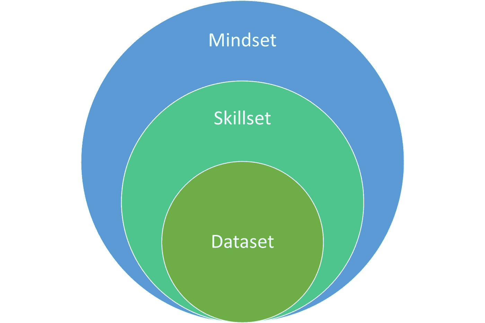

# 2022 年及以后的数据科学

> 原文：<https://towardsdatascience.com/data-science-in-2022-and-beyond-51b944c8a1a9?source=collection_archive---------17----------------------->

## 对未来工作的大胆设想

图片由来自 Pixabay 的[杰洛特](https://pixabay.com/images/id-4929680/)拍摄

在 20 世纪 80 年代和 90 年代，发生了两件永远改变工作的事情。第一次是个人电脑(PC)进入商业领域。在 20 世纪 80 年代之前，计算机对于商业领域来说还是非常新的事物，使用它们需要对计算机硬件有高度的理解。

第二次是微软在这些电脑上发布了新的 Windows 平台。Windows 实现了更加用户友好的体验，使员工能够利用计算机的能力满足自己的[需求](https://bizfluent.com/about-6362639-history-computers-workplace.html)。

对工人生产力的影响在许多未来学家的预言中显而易见，他们开始大胆地宣称到 2000 年[大多数工作将被计算机取代。因此，不言而喻，由于这两种影响，工作的性质永远改变了。](https://www.ddorn.net/papers/Dorn-TheRiseOfTheMachines.pdf)

现在用“人工智能”代替“计算机”这个词，古老的预言听起来很熟悉，对吗？事实上，数据科学的最新进展以及这些进展对人工智能(AI)应用的贡献重新点燃了这些担忧。

这是人类工作结束的标志吗？不太可能。正如世纪之交没有带来完全自动化的劳动力(实际上恰恰相反)，人工智能的进步也将努力使人类失业。

这也不意味着这些警报毫无意义。面对巨大的不可控制的变化，人类倾向于预测即将到来的未来的可怕警告。因此，这些警钟可能只是预示着劳动力市场即将发生的另一场变化。

正如工作在 80 年代和 90 年代发生了根本性的变化一样，我们目前也正处于工作性质的另一场大变革的风口浪尖。正如个人电脑的引入需要对劳动力的培训方式进行重大变革一样，下一阶段的工作也是如此。正如计算机创造了更多的工作岗位，而不是更少，下一个变化也将为未来的工作带来新的令人兴奋的机会。

我们站在边缘的这个变化是什么？这种变化是通过数据科学、机器学习和人工智能的方式来实现的。在我们新的数字时代，工作人员将不再脱离组装预测模型和将数据科学技术部署到他们自己的流程中的复杂任务。相反，像计算机一样，人工智能的无处不在将要求工人们更好地理解该技术如何工作，以确保他们在未来保持相关性。

在这篇文章的剩余部分，我将审视我们工作生活中这种变化的本质，并提出一些步骤供我们所有人考虑，如果我们想走在已经到来的事情的最前沿。想要一窥工作的未来，请继续阅读！

# 改变是现在

但是，未来工作的变化并不遥远，我们很难看到。相反，变化已经在这里，当我写这些文字的时候，我们正在见证它的形成。

当吴恩达与达芙妮·柯勒共同创建 Coursera 并于 2012 年推出时(不到 10 年前)，第一批走红的课程之一是 Ng 的机器学习课程。不久之后，ng 还提出了人工智能是“新电力”的想法，以此来类比人工智能对人类的未来影响。

Ng 在 Coursera 上的最新课程是什么？“AI for Everyone。”以下是来自[网站](https://www.coursera.org/learn/ai-for-everyone)的课程介绍:

> “人工智能不仅仅是工程师的专利。如果你希望你的组织在使用人工智能方面变得更好，这是告诉所有人——特别是你的非技术同事——要参加的课程。”

不仅仅是像 Ng 这样的创造性思想领袖，他们认识到向所有员工教授人工智能技能的重要性。[李维斯](https://www.voguebusiness.com/technology/exclusive-lessons-from-levis-data-science-bootcamp)为其所有员工推出了一个人工智能训练营，其大胆的愿景是最终用数据科学的工具和技术提升其全球员工的技能。

# 变革的力量

这一变化的核心是几股力量。第一，AI 越来越无处不在。电“人工智能线”正在铺设，人工智能现在以一种或另一种方式触及几乎每个人。这也意味着企业正面临新的压力，需要通过寻找将传统系统与新的人工智能技术集成的方法来进行创新。因此，我们劳动力变化的第二种和第三种核心力量是人才(或人才缺乏)和竞争。

当像 IBM 和 Apple 这样的公司首次将计算机引入劳动力市场时，它们仍然需要高度的技术理解才能有效地使用。直到更友好的用户界面如微软视窗进入市场，技术含量较低的日常工作人员才开始利用这些新的复杂机器的能力。

数据科学在技术可用性方面也取得了显著进步。像 Data Robot、DataIku 和主要云提供商(AWS、GCP、Azure)这样的公司都在致力于改善终端用户访问的界面，以构建数据科学解决方案。许多相同的产品使用自己的嵌入式人工智能来进一步帮助用户为他们的业务开发定制的人工智能。

结果是，低代码、无代码的解决方案意味着越来越多的人可以开始获得这些数据科学技术提供的能力。

帮助缩小技能差距不仅可以确保越来越多的企业能够利用数据科学，还可以确保构建的数据科学解决方案将产生越来越有用的业务影响。通过培训更广泛的员工在工作中使用数据科学，企业将能够更好地解决竞争漏洞，这些漏洞通常被更了解数据科学的初创公司所利用。

# 要付出什么代价？

确信很快每个人都需要对现代劳动力中的人工智能和数据科学有所了解？识别迹象是一回事，但找到提升自己或员工技能的方法是完全不同的任务。在我看来，当人们和企业制定战略以将数据科学更多地嵌入到他们的 DNA 结构中时，他们需要关注 3 个关键领域。

这三个重点领域是思维模式、技能组合和数据集。每个领域最终适用的员工数量不同，心态是最广泛的技能提升领域，其次是技能组合，然后是数据集。下图说明了这些关系:

作者图片

## 心态

从最广泛的技能提升领域开始，心态指的是培训员工更像数据科学家一样思考。数据科学是科学思维和好奇心与技术应用的完美融合。像数据科学家一样思考要求我们理解数据；如何捕捉它，存储它，访问它，并使用它来解决问题。

像数据科学家一样思考还需要知道基于规则的思考和基于统计的思考之间的区别。我们知道规则(if，then 语句)很简单，但不能很好地概括。我们知道太多的规则会变得难以管理，而统计在管理不确定性方面做得更好。

教导员工以这些新的方式看待和思考数据变得越来越重要，因为现在的世界比以往任何时候都更加数字化。

## 技能组合

一旦确定了关键的思维技能，下一步就是考虑员工需要学习什么技能来利用这种新的思维方式。对于个人或小团队面临的小规模、不太复杂的问题，适用的数据科学技能可能不同于那些涉及更大规模、更复杂的业务流程的问题。了解这些不同层次的业务问题有助于将合适的人与合适的提升技能的机会联系起来。

正如企业仍然有支持企业应用程序的低级 c++程序员一样，他们也有点击式电子表格专家，可以为他们的团队创建更高效的流程。使用数据科学，一个整天审查扫描的电子邮件以确定在哪里跟进的小团队可能会明白，他们的审查可以通过简单的计算机视觉应用程序自动进行，这些应用程序可以从他们过去的决策中学习。为这些团队提供工具来解决他们自己的用例，进一步将数据科学嵌入到公司的核心。

## 资料组

但是拥有技能和拥有工具也是两个非常不同的问题。最后一项技能提升被称为数据集，因为它指的是用于构建和部署数据科学解决方案的特定工具。为了有效地利用这一新的未来，公司需要确定最佳的平台，以允许跨技能水平和企业的集成。

对于从事高度复杂和大规模数据科学或人工智能解决方案的低级开发人员来说，这意味着启用 Python、Java 或 C+。对于高级的、更符合业务的用户，这意味着低代码或无代码的解决方案，允许更容易地访问复杂的统计预测的能力。这些不同技能水平之间的整合越好，企业提升技能的努力就越成功。

# 结论

总之，人工智能继续快速改变人类以及我们如何使用技术来支持正在发生的人类问题。我们的全球现代劳动力没有什么不同，个人和企业对数据科学的理解越好，这些个人和企业就越有能力应对这个超数字时代带来的巨大变化。

比如参与学习数据科学、职业发展或糟糕的商业决策？[加入我](https://www.facebook.com/groups/thinkdatascience)。