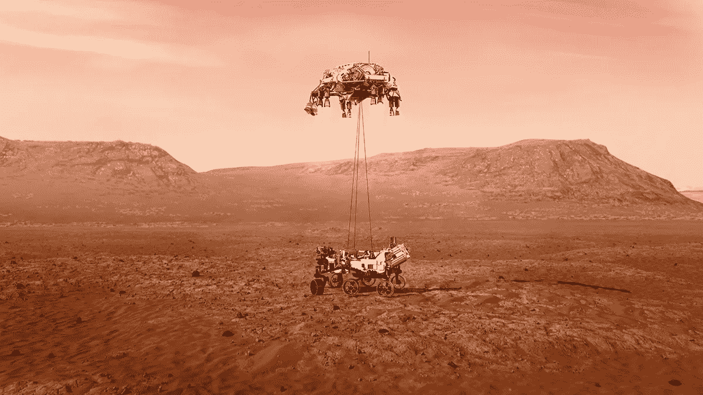
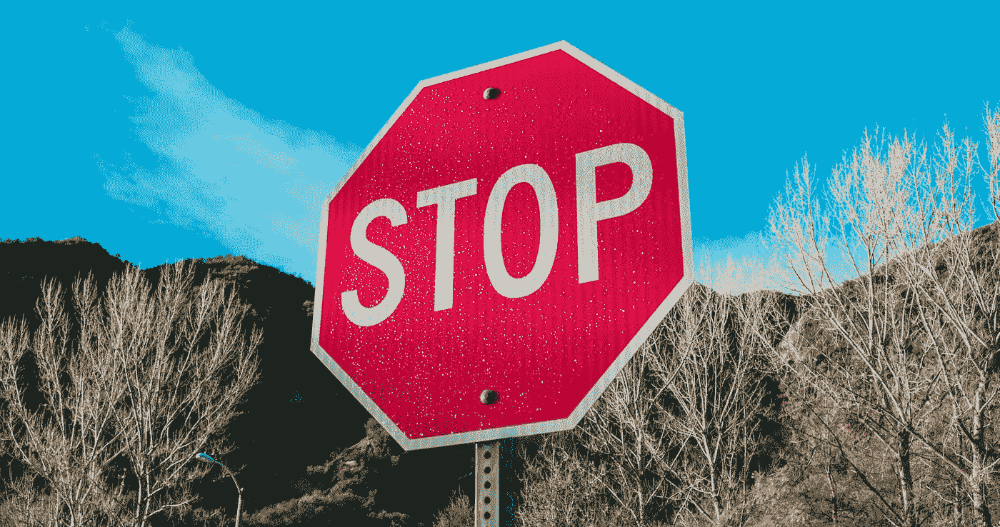

# 充满不确定性的世界中的数据科学

> 原文：<https://towardsdatascience.com/data-science-in-a-world-of-radical-uncertainty-4782edb1e234?source=collection_archive---------22----------------------->

## 《彻底的不确定性》一书中的 5 个教训

纽约公共图书馆在 [Unsplash](https://unsplash.com?utm_source=medium&utm_medium=referral) 拍摄的照片

作者约翰·凯和默文·金将所有的不确定性分为“可解决的不确定性”和“根本的不确定性”。“可解决的不确定性”是一种可以被征服的东西，要么通过研究(“我不确定冰岛的首都，所以我会查一下”)要么通过概率分布(“我不确定轮盘赌的球会落在哪个数字上，但有大约 50%的机会它会是红色”)。“彻底的不确定性”不可能这么容易被驯服。

极端不确定性的极端是未知的未知。例如，2020 年的大多数经济模型没有考虑全球疫情的风险，因此当新冠肺炎出现时，结果证明是相当不准确的。

然而，彻底的不确定性也延伸到已知的未知领域。历史学家强调，全球流行病似乎每 100 年左右就会出现一次。出于这个原因，许多人意识到了风险(正如像[这样的文章所证明的)，所以对他们来说，Covid 不是一个未知的未知。但是如何回答“2020 年全球疫情发生的概率有多大？”正如作者所强调的，这类问题的唯一准确答案是“我不知道”。这样的概率意味着什么？如果你可以将 2020 年运行 1000 次，其中有多少次会出现全球疫情，有多少次不会？这样说起来似乎很可笑。然而，这并没有阻止人们在事后试图创造这样的人物。](https://www.businessinsider.com/people-who-seemingly-predicted-the-coronavirus-pandemic-2020-3?r=US&IR=T)

作为数据科学家，我们经常要尝试和建立模型，进行预测和辅助决策。在所有这些情况下，掌握彻底的不确定性至关重要。这是知道什么时候信任一个模型和什么时候不信任之间的区别，是给出对变化有鲁棒性的建议和天真乐观地认为事情会如预期那样的建议之间的区别。因此，我从[这本书](https://www.waterstones.com/book/radical-uncertainty/mervyn-king/john-kay/9781408712603)中获得了巨大的价值，我试图总结出对数据科学家来说最重要的 5 条经验。

# **第一课:理解谜题和谜团的区别**

美国宇航局/JPL 加州理工学院拍摄的“坚持号”在火星上着陆的插图

谜题有规则和答案，而神秘事物没有。当美国国家航空和宇宙航行局将“坚持”号探测器降落在火星上时，他们已经提前几个月知道了着陆的确切日期和时间。这是因为物理定律(在这种情况下)提供了明确的规则。NASA 的工程师理解这些规则，他们有一个非常明确的任务；“让这辆漫游车去火星”。这是一个难题，工程师们成功地解决了。他们的计算和模型能够做出精确的预测，正因为如此，他们的任务以成功告终。

数据科学充满了难题，数据科学家可以从解决这些难题中获得很大的满足感。无论是试图加载和争论一组新的数据，还是试图将一个模型部署到生产中，都有一套清晰的规则，您将知道自己何时取得了成功。

谜题也是应用机器学习的大问题。规则是你的模型试图获得的关系，在你开始之前，你通常有一个正确的解决方案，它是一个带标签的训练集。如果你正试图预测房价，或识别手写数字，有一个正确的答案。

另一方面，神秘事物更难处理，这是因为人类的行为通常不能用一套规则来定义。如果你公司的首席执行官问“我们是否应该在国际上开设新的分支机构？”你可以尝试很多方法来帮助他们做决定。但是你没有办法量化每一个风险，以至于你可以说“60%的时候，你最好在国际上开设一个新的分支机构”。此外，你永远也不会有反事实，你永远也不会确定所做的决定是否正确。除此之外，还有更大的谜团，你甚至不知道所有可能的答案是什么，比如“10 年后科技行业会是什么样子，我们现在应该投资什么？"

不仅仅是企业试图解开谜团。政府问的一些最大的问题是神秘的。"我们如何降低失业率？"，“我们如何应对气候变化？”以及“我们该如何应对日益加剧的两极分化？”都是谜。

这并不是说当你面对一个谜时你什么也做不了。你可以做的一件事就是试着把它分解成拼图。在上面的例子中，如果你试图回答关于开设国际分支机构的问题，你可以在不同的国家进行调查，或者尝试建立土地和劳动力成本模型。你可以试着计算机会成本，而不是在某个地区开一家新的分支机构。重要的一点是要认识到，对于一个谜，没有完美的答案，也没有单一的模型或分析会告诉你该怎么做。

对我来说，逐渐理解神秘事物既无法解决又普遍存在，帮助我认识到让人们在极端不确定性面前做出决定的重要性，无论他们是政治家还是首席执行官。

# 第二课:使用和误用概率

[廷杰律师事务所](https://unsplash.com/@tingeyinjurylawfirm?utm_source=medium&utm_medium=referral)在 [Unsplash](https://unsplash.com?utm_source=medium&utm_medium=referral) 上拍摄的照片

这本书给出了许多概率被误用的例子。

它发生在法庭上，如起诉谬误。将犯罪现场的 DNA 与随机数据库中的人进行比对，找到了匹配的人。公诉人辩称，因为两个 DNA 图谱偶然匹配的概率是万分之一，那么这个人肯定有罪。这忽略了一点，如果数据库中只有 20，000 人，那么即使他们都是无辜的，匹配的概率也大约是 86%!

这发生在经济学中，预测和模型预测被当作事实，人们有不合理的高信心，因为市场崩溃的概率被预测为 0%。

但这如何适用于美国数据科学家呢？概率和统计是我们的面包和黄油！我们不会误用它们，我们理解它们。我们很聪明，会保留训练数据，这样我们就可以在真正看不见的数据上测试我们的模型。我们不会高估我们模型的能力，因为我们的度量标准，我们确切地知道它有多好，并且我们将它打印在模型的侧面，让所有人都可以看到。

鉴于数据科学社区中有如此多的冒名顶替综合征，我怀疑你们中的许多人有那么大的傲慢，但我肯定你们中的一些人有这样的想法:“所有这些错误都是由不理解统计的人造成的，所以这不适用于我”。让我告诉你我从书中的信息中得到的教训:

1.  人们(包括我们)并不总是对概率和统计有很好的直觉。正因为如此，你工作中任何概率的交流都必须非常仔细地考虑。如果您创建了一个准确率为 99%的欺诈检测模型，并且您自豪地宣称这一事实，那么当您的利益相关者认为如果该模型标记了一个案例，则该案例有 99%的可能性是欺诈时，请不要感到惊讶。对于不平衡足够大的类，真实的百分比可能低至 0%(这也是选择正确的评估指标的一个教训！不要像我们例子中控方误导陪审团一样，无意中误导你的利益相关者。
2.  不要太相信你的模型的精确输出。你现在的客户流失模型可能有很高的准确度，但情况会一直如此吗？如果系统受到冲击(来自竞争对手的一场伟大的公关活动)并且客户流失暴涨怎么办？传达你对自己的预测有 99%的信心可能会导致过于自信的计划，现在公司陷入了困境。没有预测到这次冲击会是你的错吗？当然不是。**但在对未来的预测中表现出过度自信会影响决策，并反过来伤害你，就像我们例子中的经济学家一样。**

模型的讨论很好地将我们带到了第 3 课:

# **第三课:地图不是地形，模型也不是世界**

照片由 [Unsplash](https://unsplash.com?utm_source=medium&utm_medium=referral) 上的 [Tamas Tuzes-Katai](https://unsplash.com/@tamas_tuzeskatai?utm_source=medium&utm_medium=referral) 拍摄

我们刚刚看到，对模型的过度自信会导致问题。但是这种过度自信从何而来，我们又如何避免误用我们的模型呢？

首先，我们应该问自己为什么模型是有用的。在基本层面上，世界和其中的系统是复杂的。这使得理解决策的影响和制定未来计划变得非常困难。模型允许我们将世界简化为问题的关键因素，并开始解开它们之间的关系。

假设您构建了一个基于代理的模型来模拟 Covid 在购物中心的传播。你可以制定规则，规定人们需要多近才能传播病毒，以及如果他们戴着口罩，情况会如何变化。您可以根据购物中心有多少人以及是否有单向系统来创建场景。通过多次运行该模型，您可以开始了解 Covid 是如何传播的，以及不同假设(社区中有多少人拥有 Covid)和干预措施(是否强制使用口罩)的影响，这可以有意义地帮助决策过程。

在模型内部，事情表现得非常好，它们遵循你的规则。这本书把这称为一个小世界，在这个世界里，根本不存在不确定性。表现良好让你可以非常精确地描述这个小世界。例如，该模型可能会向您显示“只要不到 1%的人有 Covid，就可以安全地开设购物中心”或“有一个单向系统可以在 90%的时间内将 Covid 的传播减半”。重要的是，这个小世界不是我们生活的世界，对现实世界做出同样的断言是错误的。在我们的计算机模拟中，人类行为和病毒传播的动力学比移动的代理要复杂得多。

所以如果我们不能做出这些声明，这个模型怎么会有帮助呢？让我们考虑一下在这种情况下政府官员可能需要做出的一些现实决策。

1.  他们应该强制使用口罩和单向系统吗？
2.  购物中心的最大容量应该是多少？

即使该模型不能准确量化口罩和单向系统的影响，它也可以显示它们是否对病毒的传播有影响。

即使该模型不能给出真实世界最大值的答案，它也可以表明购物中心太多的人有病毒不可控传播的风险，但足够低的人数可以控制局面。

我们展示的是，该模型可以突出风险，并帮助决策者了解可能的结果以及他们可以做些什么来影响这些结果。

我将引用作者的一句名言来结束这一部分:

***最后，一个模型只有在使用它的人明白它并不代表“真实的世界”，而是一个探索决策可能出错或不出错的工具时才是有用的***

# 第四课:机器学习模型只从展示给它们的东西中学习

这似乎是显而易见的，但当我们考虑到极端的不确定性时，它有非常大的影响。

我们可以很容易地进入努力创建最准确的机器学习模型的思维模式。然而，当我们将这些模型付诸实践时，它们的表现如何是一个函数，既取决于模型有多好，也取决于**被建模的世界有多稳定。**

照片由 [Ludemeula Fernandes](https://unsplash.com/@ludemeula?utm_source=medium&utm_medium=referral) 在 [Unsplash](https://unsplash.com?utm_source=medium&utm_medium=referral) 上拍摄

让我们假设你已经建立了一个模型来识别照片中的猫，这个模型在一些测试数据上表现很好。你决定做一个应用程序，让公众可以上传他们自己的照片，起初，这个模型看起来做得很好。鉴于进化的缓慢，你可以相当自信地说，猫不会在一夜之间改变它们的外貌，但这是否意味着你应该自信地说，准确率会一直很高？对你来说不幸的是，虽然猫本身可能是稳定的，但是输入到你的模型中的照片可能不那么稳定。如果手机摄像头变得更好，而你的模型没有经过高分辨率图像的训练，该怎么办？或者，如果你的应用程序在不同的大陆流行，并且包含了你的训练数据中没有的猫的品种，那该怎么办？

这两个事件都会大大降低你的模型的表现。如果这个问题得不到及时解决，你想拥有 10 亿用户并通过 Instagram 赚钱的梦想很快就会破灭。哪里出了问题？这个模型的使用方式并不稳定，因为你没有向它展示这个不同世界的更高分辨率或不同品种的猫，当它遇到它时，它没有办法准确地处理它。

我们可以通过考虑**自动驾驶汽车**来从一个愚蠢的例子变成一个非常严肃的例子。这些需要能够基于图像准确理解正在发生的事情。如果一辆汽车在白天测试时能够始终准确识别一名骑自行车的人，那当然很好，但如果一辆自动驾驶汽车在晚上遇到一名骑自行车的人，会发生什么呢？如果图像检测模型没有看到足够多的这些例子，那么它可能会失败，这可能会产生可怕的后果。

这是在你考虑那些故意想让你的模型失败的恶意行为者之前。有可能对像停车标志这样的东西做出非常小的具体改变，并让它不被自动驾驶汽车发现**。这些敌对的攻击已经被[很好地记录下来](https://arxiv.org/ftp/arxiv/papers/1907/1907.00374.pdf)，并且有难以想象的多种方式可以用这种攻击造成大量的损失。这些攻击成功的原因和猫应用失败的原因是一样的；模型看到了一些它的训练数据中没有的东西。**

尼克·赖特在 [Unsplash](https://unsplash.com?utm_source=medium&utm_medium=referral) 上拍摄的照片

你现在可能会问的问题是*“我们能对此做些什么吗？”*幸运的是，我们有办法让我们的模型更加稳健。

一种方法是问自己“如果我现在离开我的模型，一年后再回来，事情会变得多么糟糕？”这被称为预分析，是一种发现弱点的伟大技术，而不必等待它首先出错。如果你在推出你的猫应用程序之前问了这个问题，你可能已经能够在公众发现自己的缺陷之前，在更高分辨率的图像或更多品种的猫上训练模型。

然而，正如我们现在所知道的，极端的不确定性意味着我们不会提前得到所有的答案。幸运的是，您也可以应用一些技术技巧来帮助提高健壮性。你可以有目的地[在你的训练数据](https://machinelearningmastery.com/how-to-improve-deep-learning-model-robustness-by-adding-noise/)中加入噪音，这可以帮助模型学习重要的模式，忽略不重要的。您还可以进行错误分析，找出您的模型表现不佳的具体示例(例如夜间骑自行车的人)，然后出去寻找或创建更多此示例的训练数据。**如果模特没见过它，那它就学不会！**

# 第五课:拥抱彻底的不确定性

照片由[阿梅恩·法赫米](https://unsplash.com/@ameenfahmy_?utm_source=medium&utm_medium=referral)在 [Unsplash](https://unsplash.com?utm_source=medium&utm_medium=referral) 拍摄

鉴于目前你所读到的一切，如果你认为极端的不确定性只会让你的生活和工作更加努力，这是可以理解的。我知道我发现自己在想“如果一切都是一个谜，那会容易得多”。我想以关于极端不确定性的积极信息作为结尾，这本书很好地强调了这一点。这种极端的不确定性不仅仅是理解起来很重要，而且我们应该对此心存感激。

一个没有极端不确定性的世界意味着…

一个没有人类的世界。我们不是完全理性的，我们的行为不受规则的支配。历史上有些时候，人们的行为似乎就是如此，尤其是极权主义政权。然而，是人类突破了，让世界天翻地覆。我们赋予人类的许多积极特征，从创造力到爱，创造并要求彻底的不确定性。

一个没有创新的世界。从蒸汽机到万维网，想想每一项创新的影响。当这些发生时，系统会受到冲击，看似稳定和可预测的情况不再如此。此外，创新需要冒险，当事情稳定且可预测时，就没有太多冒险的动机了。创新创造了彻底的不确定性，彻底的不确定性创造了创新的空间。

**…一个没有激情的世界。正如电影《土拨鼠日》所展示的那样，一个你对每一天都很确定的世界(因为你一次又一次地生活在同一天)不会给你带来平静的心境，而是带来绝望。极端的不确定性是生活情趣的关键成分。**

# 结论

人们很容易相信根本不存在不确定性。在这个假装的幻想中，我们对世界的理解更加完整，我们可以对我们的模型和我们对未来的预测更加自信。然而，这种想法实际上是一个陷阱，会导致无法在现实世界中生存的决策，并可能带来可怕的后果。

“[彻底的不确定性](https://www.waterstones.com/book/radical-uncertainty/mervyn-king/john-kay/9781408712603)”这本书指导我们理解彻底的不确定性如何影响我们生活的方方面面，以及为什么它是一种好的力量。

我从这本书中学到了很多，我给其他数据科学家的前 5 课可以总结如下:

1.  将谜团分解成难题，理解为什么你组织中的决策者很难应对极端的不确定性
2.  仔细考虑如何传达统计数据和模型评估指标，以免误导利益相关者并影响他们的决策
3.  模型并不代表“真实的世界”，而是探索决策可能出错或不会出错的方法的工具
4.  机器学习模型只能从它们看到的东西中学习，因此你可以增加或修改训练数据来提高鲁棒性
5.  拥抱极端的不确定性，将其视为一种积极的力量，为创新创造空间，让生活变得有价值