# 生产中的数据科学:在 Apache Airflow 中构建自动化数据/ML 管道

> 原文：<https://towardsdatascience.com/data-science-in-production-building-automated-data-ml-pipelines-in-apache-airflow-1fa6d434aeb8?source=collection_archive---------22----------------------->

## [实践教程](https://towardsdatascience.com/tagged/hands-on-tutorials)

封面由 Jay Kachhadia 在 Canva 上设计

自从我写了关于[‘全栈数据科学:下一代数据科学家群体’](/full-stack-data-science-the-next-gen-of-data-scientists-cohort-82842399646e)的博客以来，已经有 5 个月了，这篇博客在社交媒体上获得了数百次分享，并得到了来自世界各地的人工智能社区和公司的提及。此外，我在第九届数据科学 UA 大会上发表了关于同一主题的演讲([链接](https://www.youtube.com/watch?v=NnjttXpTi7E&list=PLaUkBKuaiAfipBRVtw4jF3RSsRZDXEwS1&index=43&t=663s))。在那之后，我明白了在学校或大学里没有人教的工具和技术的需要，即使你是数据科学专业或计算机科学专业的，这在行业中产生了巨大的人才缺口。因此，我从一个关于生产中的数据科学的系列文章开始，介绍数据科学行业中使用的一些工具和技术。[第一部分](/data-science-in-production-building-flask-apis-to-serve-ml-models-with-best-practices-997faca692b9)是构建 Flask APIs 来服务 ML 模型，而[第二部分](/data-science-in-production-quickly-build-interactive-uis-for-your-data-science-projects-with-dash-6568e7df5528)是构建 DASH webapp 来展示你的 ML 项目。

# 阿帕奇气流

[Apache Airflow](https://airflow.apache.org/docs/apache-airflow/stable/) 是一个开源的工作流管理平台。感谢 [AirbnbEng](https://medium.com/u/ebe93072cafd?source=post_page-----1fa6d434aeb8--------------------------------) 的人们，他们开源了这个项目。我爱气流！它可以帮助你实现数据管道和 ML 管道的自动化，在行业中得到广泛应用。你可以摄取、执行 ETL、执行 ML 任务，并自动完成日常工作。

在这篇博客中，我们将在本地系统上设置气流，并构建一个数据管道，该管道将获取在早上 7 点到 8 点之间发布的关于机器学习的推文，并将 JSON 文件转储到所需的位置。

# 设置您的环境

第一步通常是建立您自己的项目环境，这样您就可以将您的项目库及其版本与本地 python 环境隔离开来。有两种方法可以专门为你的项目设置 python 环境: **Virtualenv** 和 **Conda** 。只是为了保持一致，我将在整个项目中使用 Python 3.6，但你可以使用任何版本，这应该没问题。

用 pip 和 virtualenv 创建虚拟环境

用 Conda 创建虚拟环境

在您的终端中执行上述任何命令后。您将处于项目自己的虚拟环境中。如果你想在虚拟环境中安装任何东西，它就像普通的 pip 安装一样简单。在您从事任何项目时，创建虚拟环境始终是业内的标准做法。

进入虚拟环境后，您可以安装 airflow:

确保您正确设置了 AIRFLOW_HOME

接下来的步骤是初始化数据库，并启动您的 airflow 服务器和调度程序。Airflow web 服务器为您提供了一个 UI 来管理 air flow 可以做的大部分事情，并查看所有活动。Airflow scheduler 监控所有任务和 Dag，然后在任务实例的依赖性完成后触发它们。

可以去 [http://localhost:8080/](http://localhost:8080/) 访问气流仪表盘。现在你已经准备好了！

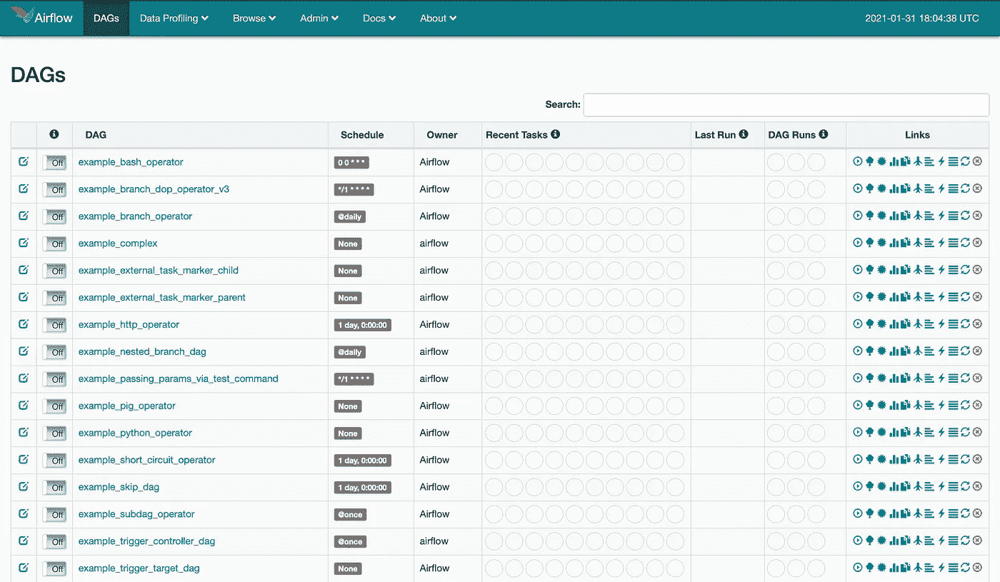

气流仪表板

# 有向无环图

在 Airflow 中，DAG 是您想要运行的所有任务的集合，以反映它们的关系和依赖性的方式组织。DAG 是在 Python 脚本中定义的，它将 DAG 结构(任务及其依赖项)表示为代码。

我们将要创建的 dag 的代码可以在[https://github.com/jkachhadia/airflowdags101](https://github.com/jkachhadia/airflowdags101)获得

<https://github.com/jkachhadia/airflowdags101>  

在本博客中使用之前，我们将使用这种方法来解释事情。

# 我们的第一只狗

让我们开始编码我们的第一个 dag，它将是一个自动数据管道，用于获取和存储用户在美国东部时间早上 7 点到 8 点之间发布的推文。

如果你正确地完成了上面的步骤，那么在你给出的气流路径中。您将已经创建了一些新文件和文件夹。如果你有类似 airflow.cfg 的文件，那么你就可以开始了。如果没有名为“dags”的文件夹，可以在那里创建一个。

让我们在 dags 文件夹中创建一个名为“firstdag.py”的文件，并开始处理代码。首先，我们将进口所有我们需要的东西，作为这个项目的一部分。

你需要的所有进口商品

厉害！让我们开始编写一些代码，基本上获得我们的 dag 所在的目录和根目录，如果我们需要与本地文件系统进行交互，在我们的情况下，我们需要这样做。

我们现在已经整理出了根目录和应用程序目录。让我们以一种标准的约定来命名我们的 dag，这样我们只需要知道它的名字就可以知道它的含义。我们将把它命名为“tweets_morning_ml_daily”。

# **连接**

现在，我们将利用**连接**，在其中您可以存储 JSONs 以及一些您不想公开的可变信息，因为它是特定于这个 dag 的。我们将从这个连接中获取代码中使用的所有配置变量。在[这里](https://airflow.apache.org/docs/apache-airflow/stable/howto/connection.html)可以找到连接的很多其他用法。

dag 名称和连接名称

现在，让我们从气流 UI 创建连接。

点击管理>连接

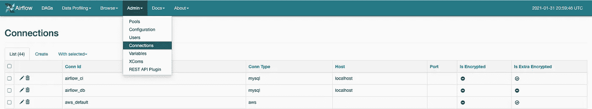

然后，我们可以创建一个新的连接，如下所示:

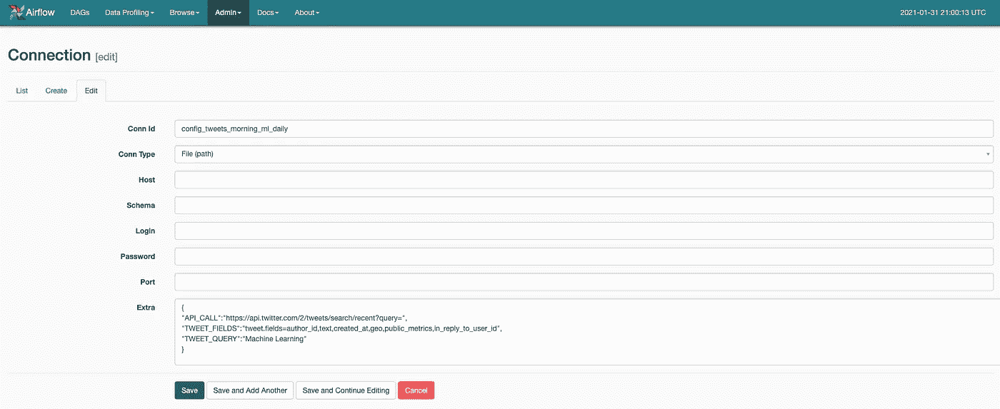

我们将 twitter 的 api 调用信息存储在这里，这样，如果您想更改查询或从 twitter API 获取的字段，就不必更改代码。

现在，我们将编写一个函数，基本上使用来自 airflow 的 BaseHook 来获取这个连接存储的 JSON。

获取连接配置的函数

# 变量

我们现在将使用气流变量来存储可以由多个 Dag 共享的信息，例如 twitter 的 API 的帐户令牌。你也可以从[https://developer.twitter.com/en](https://developer.twitter.com/en)那里得到你的不记名令牌。很容易应用并让开发者访问 twitter 的 API。

现在让我们从 Admin>Variables 为 API 令牌创建一个变量

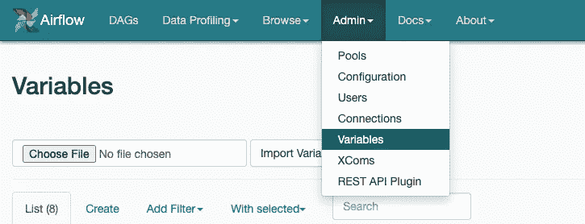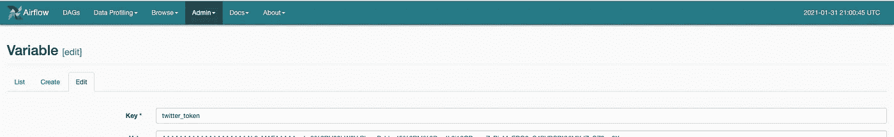

变量中的键和值对

我们将使用已经编写好的函数来获取连接变量和泛型变量，并创建一个字典来存储所有内容，这样就可以很容易地传递函数或任务。

连接和变量

让我们从一些将进入我们的气流任务的代码开始。我们将为这段将被多次使用的代码创建函数，就像包装 twitter API 的 get 请求一样。

现在，如果我们想一想，我们的数据管道将有多少个主要步骤？然后，首先是收集数据，其次是以 JSON 的形式存储/转储数据。

让我们开始编写第一步的代码，这基本上是使用上面已经以字典的形式定义的变量，进行 api 调用，收集数据并将其存储在一个列表中。

# XComs

在这里，我们将使用 XComs 进行通信。一旦第一步将 tweets 信息存储在一个列表中，那么它将不得不将该信息放入一个 XCom 变量中，该变量可以在另一个任务中检索。因此，当下游任务之间需要通信时，就使用 XComs。

第一步

最后，您会看到我们如何将变量推入 Xcom 变量，我们将在后面的任务中使用该变量。你一定注意到了 ds 变量。这是气流在运行时提供的一个变量，还有其他一些与日期和时间相关的变量。

现在，我们将编写第二步，每天将 JSON 转储到一个特定的位置。此外，在 dags 文件夹之外，您可以创建一个转储文件夹，dag 可以在其中每天转储文件。

我们现在将开始定义 dag 及其结构，从默认参数开始，其中我们有开始日期和所有者，但我们还可以有更多，您可以在文档中查看。你将开始日期设置为两天前，这样，当你轻推它时，它就会自动开始。

让我们用计划间隔和标准超时来定义 dag。Schedule interval 是一个 cron 表达式，从自动化的角度来看，它将为气流调度程序提供关于 dag 需要运行的频率和时间的信息。

现在，我们必须定义所有任务并将其附加到 dag。我们将在开始和结束任务中使用虚拟操作符，它不会做任何事情。对于其他两个任务，我们将使用 python 操作符，这将是我们在上面创建的函数，其中我们也传递我们首先创建的 params 字典。

您可以在这里获得更多关于气流概念的信息，这将提供更多关于我们所用变量的见解。重要的是 depends_on_past，这意味着它依赖于前一次运行的任务执行，python_callable 是要调用的函数，如果有函数变量，则可以在 python 运算符内的参数 op_kwargs 中定义这些变量。

现在，我们将创建所有这些任务的气流，在气流中有许多方法可以做到这一点，但我更喜欢这一个，因为它不那么混乱。

写完这段代码，当你保存它的时候，你应该准备好了！等待几分钟，让 scheduler 选择任务，然后它应该会显示在仪表板中。

一旦它显示出来，你点击它。您将会在 dag 结构中看到类似这样的内容。

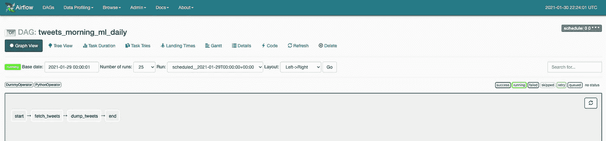

一旦你轻推你的 dag 'ON ',它就会启动引擎，从今天开始运行。您可以在定义 dag 以从 start_date 开始时添加 catch_up=True。

在它开始运行之后。您将看到任务经历不同的阶段。如果你点击一个任务，你会看到下面弹出，可以点击日志。

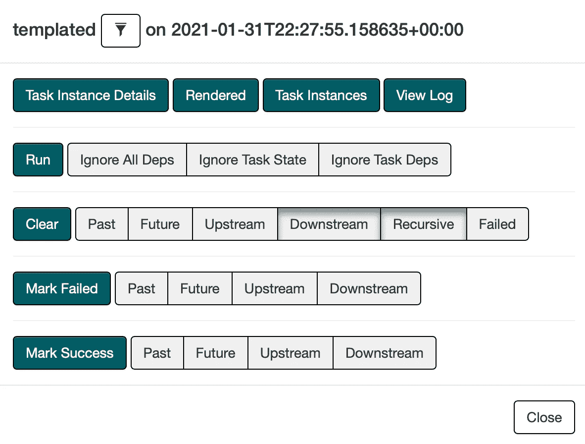

让我向您展示执行后第一个和第二个任务的日志。

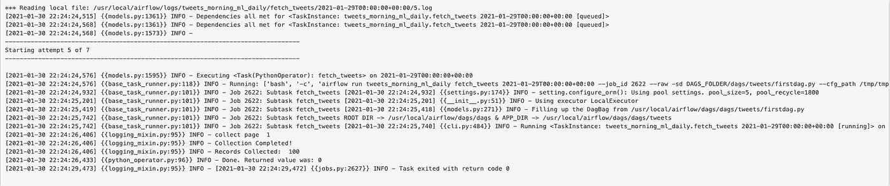

第一个任务的日志

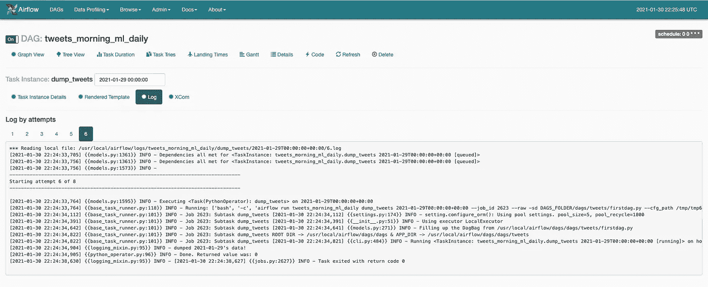

第二个任务的日志

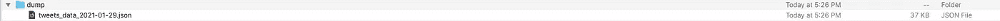

在我们的转储文件夹中输出 JSON

Wohoo！我们在气流中创造了第一个 dag。你可以调整很多东西，气流在做很多复杂的事情上很棒。

如果你想看到真实世界的气流例子，那么你可以看看[照明](https://illuminating.ischool.syr.edu/campaign_2020/)，这是我在计算和数据科学中心工作的一个研究项目，我负责该项目的整个数据工程和 ML 基础设施。你可以在这里查看详细的博客。

</2020-us-elections-how-we-use-data-science-to-unfold-ad-strategies-of-biden-and-trump-with-200095dd369a>  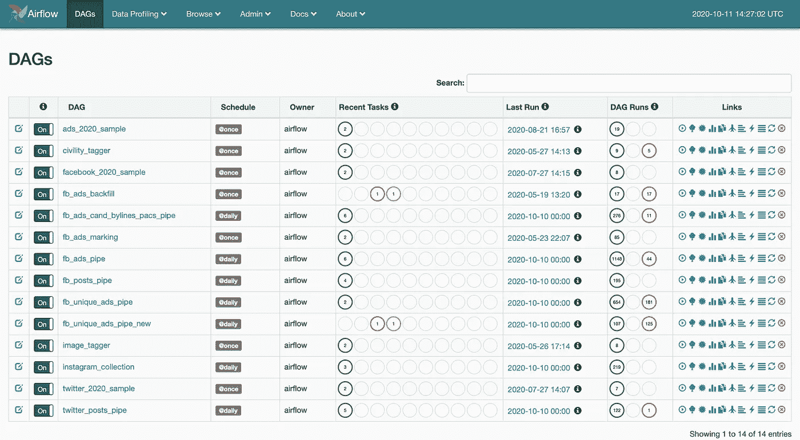

照亮 2020 的气流仪表板

类似地，您可以部署模型并在您的管道中使用它。气流是可怕的，现在是任何数据科学家、数据工程师或 ML 工程师的工具箱中的一个好工具。

在 gmail dot com 的[我的名字][我的名字]上提问，或者在[的 LinkedIn](https://www.linkedin.com/in/jkachhadia) 上联系。