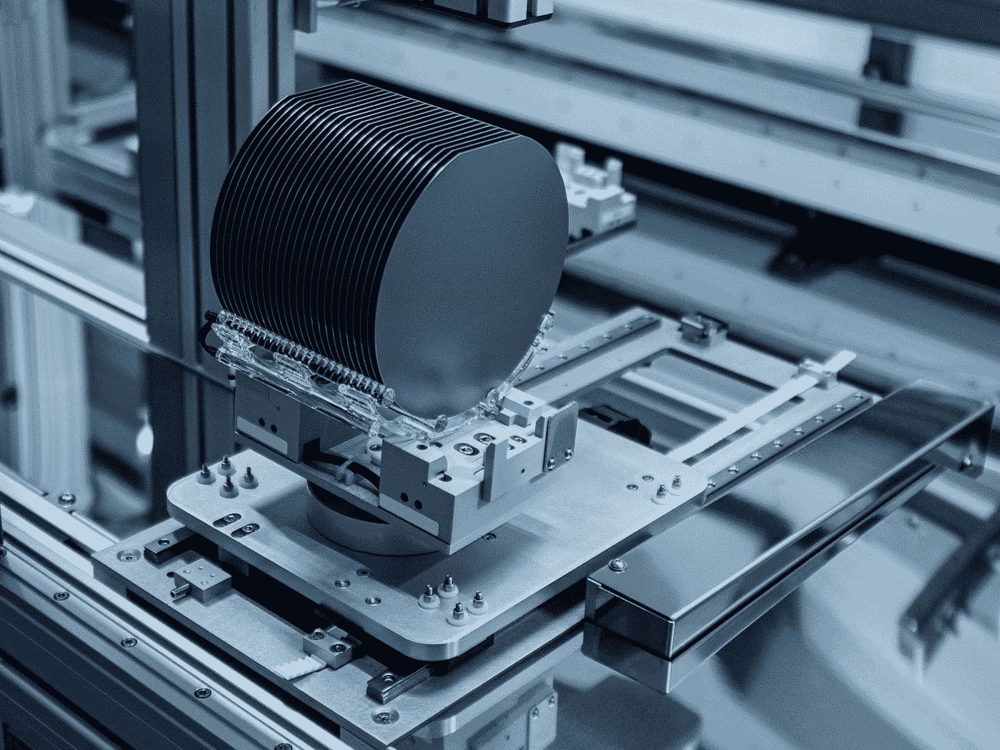
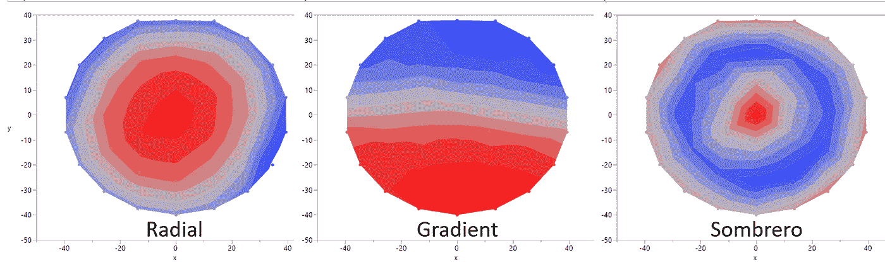

# 半导体制程良率中的数据科学

> 原文：<https://towardsdatascience.com/data-science-in-semiconductor-process-yield-a6da6a37253c?source=collection_archive---------5----------------------->

## 使用机器学习提高晶圆厂产量和盈利能力

劳拉·奥克尔在 [Unsplash](https://unsplash.com?utm_source=medium&utm_medium=referral) 上的照片

在疫情的这个阶段，对各种半导体芯片的需求激增，半导体工厂正在努力跟上步伐。传统 IC 客户现在正与新计算应用(如人工智能和自动驾驶)的需求竞争，以制造他们的定制设计晶片。不幸的是，增加半导体工厂的晶圆产能以应对新一波的需求是非常昂贵和具有挑战性的。一旦决定增加晶圆厂的产能，可能需要几个月的时间来购买新工具，将它们安装到晶圆厂，并使它们符合生产条件。

在这种情况下，更好的选择是提高产量，即每个晶片中“好”芯片与总芯片的比率，以从现有产能中获得更多芯片。提高产量也会直接增加晶圆厂的利润率，即使产量的微小提高也会带来巨大的利润——所以，让我们提高芯片产量吧！说起来容易做起来难。

在数据科学在半导体行业兴起之前，设备工程师会有条不紊地搜索可用数据，寻找任何线索或与产量的相关性。作为人类，我们喜欢结果可以归因于单一因素的问题。我们希望产量和一个特定的工艺参数有很强的相关性——薄膜沉积速率、蚀刻速率、光刻尺寸公差或数以千计的工艺参数。不幸的是，这种情况几乎从未出现过。用于制造现代半导体芯片的工艺不断相互结合。

需要新型器件和产量工程师来处理不断增加的工艺复杂性和计量数据量——对器件物理和制造工艺的深刻理解必须与数据科学工具相结合，才能找到真正的产量触发因素。

# 变量重叠

为了帮助理解这个问题，考虑一个铝布线层。在这个简单的过程中，我们有一个铝沉积步骤，光刻图案，等离子体蚀刻，以确定特征，然后清洗。如果我们有一个简单的产量故障，如邻近的线路短路，两个最有可能的候选是铝沉积得比预期的厚(阻止蚀刻完全分离线路)，或蚀刻速度比预期的慢。然而，在大多数过程控制的工厂中，最常见的答案是两个过程都在统计过程控制(SPC)系统的范围内，因此在可接受的范围内运行。那么是什么原因呢？在这种情况下，沉积比正常情况下厚*一点点*和蚀刻比正常情况下慢*一点点*的汇合可能成为产量杀手。提取变量的哪个**组合**导致了失败，这是一个为机器学习而设置的完美问题。事实上，如果我们的问题像这个铝布线案例一样简单，我们就相当幸运了——它通常会变得更糟。

由 [Unsplash](https://unsplash.com?utm_source=medium&utm_medium=referral) 上的 [Maxence Pira](https://unsplash.com/@maxence_pira?utm_source=medium&utm_medium=referral) 拍摄的照片

考虑在高级节点(16 纳米或更低)工艺上运行的新 IC 设计。像电路短路或电路开路这样的物理故障很简单。然而，由于电路时序路径阻止芯片执行其期望的功能，器件可能无法让步。也许晶体管的导通电压没有达到目标？可能结电容高，增加 RC 积，引入延迟？在一个包含数百个工艺步骤的半导体工艺流程中，我们如何找到根本原因？

# 行动（或活动、袭击）计划

数据科学方法的好处是能够同时评估许多变量的影响。在这种情况下，我们可以引入四种主要类型的变量:

*   *:在晶圆片加工过程中对晶圆片进行的物理测量，包括薄膜厚度和密度、光刻尺寸精度和对准、污染物颗粒缺陷等。*
*   ****生产线末端电气测试*** :切割前，生产线末端测试的离散划线设备(印刷在芯片之间的街道上的设备)的数据。scribe 中的各个器件旨在梳理出某些工艺依赖性，并提供独特的工艺见解(如[开尔文接触电阻](https://www.researchgate.net/publication/228608938_Cross-bridge_Kelvin_resistor_CBKR_structures_for_measurement_of_low_contact_resistances))。*
*   ****工具工艺认证运行*** :工具定期在可直接测量的测试晶圆上运行一套工艺(与生产工艺相同或非常相似)。诸如沉积速率、蚀刻速率或不均匀性的结果在统计过程控制(SPC)系统中被跟踪，并具有相关的日期戳。*
*   ****产品电路性能*** :根据芯片和询问芯片所需的测试设备类型，在生产线末端(切割前)、切割后或后封装时对产品芯片进行测试。无论如何，这种性能或产量是我们试图优化的因变量。这可以基于通过/失败标准(*分类*)、性能宁滨(*也称为分类*)或原始性能(*回归*)。*

*将所有四种变量类型结合使用，使工程师能够获得结果(测量的性能)并深入到物理根本原因，使工程师能够通过工艺工具调整直接影响产量。*

# *偏移与优化*

*下一步去哪里真的取决于我们的主要目标是什么。给定的晶圆或批次的芯片成品率是否大幅下降？在这种情况下，我们知道无论发生什么，都发生在晶圆级。当我们玩侦探游戏时，这大大简化了我们的数据准备过程。在这里，我们正在寻找晶圆级变量的变化，这意味着我们可以按晶圆对所有四种变量类型取平均值，并且仍然找到确凿的证据。使用类似于[插入符号](https://www.rdocumentation.org/packages/caret/versions/6.0-90/topics/varImp) (R)中的`varImp()`或 [Scikit-learn](https://scikit-learn.org/stable/auto_examples/ensemble/plot_forest_importances.html) (Python)中的`feature_importances_`这样的函数进行简单的检查，可以快速洞察哪些变量对产量有直接影响。*

*相反，如果我们有一个相当稳定的工艺，但每个晶片上只有 70%的芯片是功能性的(或有足够高的性能可以出售)，我们就有机会进行优化。从更高的层次来看，故障芯片是随机分布在整个晶片上，还是全部集中在晶片的一个物理区域？仅这一点就可以告诉我们，故障是基于缺陷(如粒子在工艺过程中落在晶片上)，还是基于工艺不均匀性，这使我们能够过滤许多潜在的变量。*

*需要注意的是，晶圆级工艺往往具有独特的非均匀性特征。许多将是放射状的，但梯度轮廓是常见的，甚至可以出现草帽形轮廓。这些工具流程概况如何与我们的产量相匹配是一个极好的工具。但是如果多个过程重叠，人眼只能分辨出这么多，这又是数据科学的拯救。*

**

*作者照片-常见晶圆级工艺简介*

*然而，在此之前，我们还要为晶圆级产量工程做更多的数据准备工作。虽然我们可能有与每个产品芯片相关的线尾划线测试数据和计量数据，但要找到与工具鉴定(也称“qual”)数据的类似关联是很困难的，因为这些数据通常是在具有均匀分布的 9、13 或 39 点径向坐标图的未构图晶片上测量的。对于我们的数据，我们需要将每个芯片映射到物理上最接近的测量值，这通常包括以下步骤:*

1.  *在我们的 qual 数据中，我们将(半径，θ)坐标转换为(x，y)笛卡尔坐标，并确保数据收集日期采用正确的`datetime`格式。*
2.  *在我们的产品数据集中填入批次通过*的处理日期/时间，每个处理*都有相关的质量数据。*
3.  *对于给定的批次/晶圆，我们将迭代我们的 qual 数据以过滤到具有最接近可能日期的运行，并找到最接近产品芯片坐标的测量。*

*一旦我们的数据以这种方式结合起来，我们就有了一个内容非常丰富的变量数据集，我们可以自动寻找任何变量和因变量(产品芯片性能)之间简单的 1:1 相关性。然而，要真正深入到变量之间的相互联系，我们需要深入到创建机器学习模型。*

# *系统模型化*

*在这一步中，目标不是创建最高精度的模型，而是创建一个能够合理预测产量，并且产量工程师能够**轻松解释**的模型。在这里，我们将坚持像决策树，线性/逻辑回归，套索回归，或朴素贝叶斯算法。一旦我们找到了合适的算法，我们就可以深入到[可视化](https://mljar.com/blog/visualize-decision-tree/)中，了解我们的模型如何“思考”并推动工厂的行动以提高产量。*

# *预测产量*

*下一个飞跃来自数据科学的预测能力。如果我们能在晶圆片完成加工之前预测其产量，会怎么样？这种信息可以促使利益相关者做出重要的批次决策，例如:*

*   *触发返工过程(恢复并重复某个步骤)*
*   *向客户提供一份里程碑式的报告，说明很多产品都处于良好状态*
*   *报废一批以减少损失并防止将来在“报废”的一批上使用工具*
*   *启动一个“补充”批次来替换低产量批次，以最大限度地减少向客户交付的延迟。*

*与产量提高步骤不同，我们在这里寻求尽可能精确的模型。可解释性是一个遥远的“美好事物”，因此我们能够探索更广泛的模型。一旦我们选定了一个模型，我们还可以使用变量重要性和递归特征消除等工具来查看哪些数据真正推动了我们的产量检测能力。有了这些数据，我们可以消除一些现有的计量数据收集，以进一步降低成本和缩短流程周期。*

*有了一个足够好的模型，我们还可以进行虚拟过程开窗——我们可以改变一个过程的可接受 SPC 范围，以了解扩大或收紧控制限制如何影响产量。反复进行，晶圆厂中每个工艺的控制极限可以直接与晶圆产量联系起来。这影响了预防性维护的执行方式、新工具引入生产线的方式，甚至质量程序的频率，所有这些都会影响晶圆厂的成本。*

*所以我们有它！利用数据科学的力量，我们可以重塑我们调查产量偏差的方式，提高整体生产线产量，并在晶圆完成加工之前预测晶圆产量。在了解制造物理的半导体器件工程师的手中，这些预测建模能力对晶片工艺产量和制造利润有着巨大的影响。感谢阅读！*