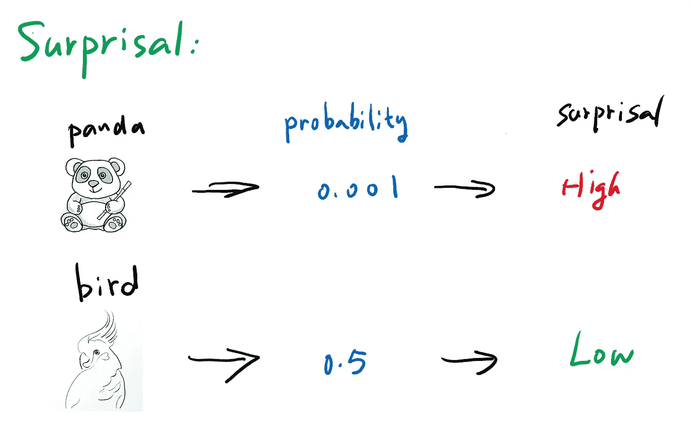
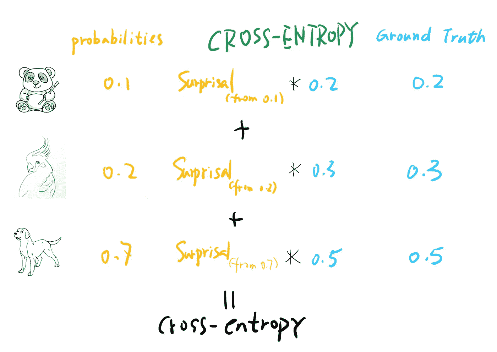
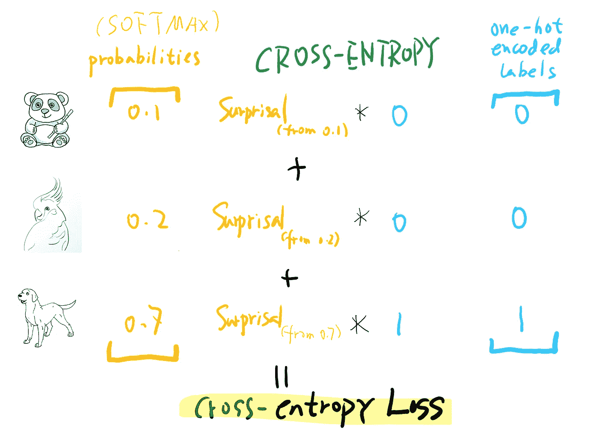
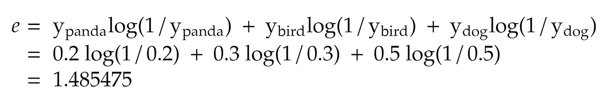
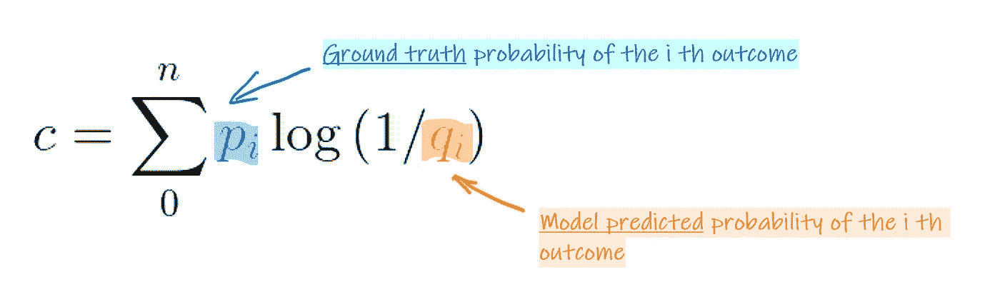
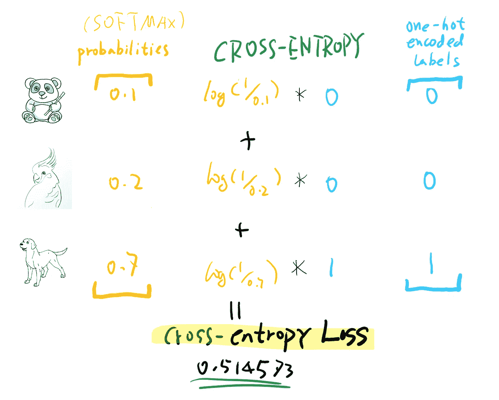

# 数据科学访谈深度挖掘:交叉熵损失

> 原文：<https://towardsdatascience.com/data-science-interview-deep-dive-cross-entropy-loss-b10355eb4ace?source=collection_archive---------19----------------------->

## 什么使它成为事实上的多类分类器损失函数

要在重要的数据科学/机器学习面试中胜出，有很多东西需要学习和掌握。本文是一系列文章的一部分，这些文章试图通过介绍结构、使用可视化解释和保持事物的相关性来使准备过程变得更容易和不那么令人生畏。

照片来自 Pixabay

# 动机

T 正确选择损失函数对于成功训练机器学习模型至关重要。因此，关于他们的问题通常会在面试过程中被招聘人员提出来。问题可能来自多个方面和角度，但只要你抓住核心概念，你会发现它们不会是太大的挑战。**交叉熵损失**是多类别分类问题中最基本和最广泛使用的损失函数之一。为什么这么受欢迎？核心好处是什么？如何正确应用它们？

让我们开始吧。

# 用一分钟解释一下

照片由 [Tim Gouw](https://unsplash.com/@punttim?utm_source=medium&utm_medium=referral) 在 [Unsplash](https://unsplash.com?utm_source=medium&utm_medium=referral) 上拍摄

在面试中，你经常会被要求在一分钟内解释一个概念。这是为了测试你简洁地表达复杂概念的能力。毕竟只有你完全掌握了，才能简洁明了的解释，对吧？所以我们先从 ***TR 开始；*博士:**

> 交叉熵损失是一种广泛用于多类分类问题的损失函数。它建立在交叉熵的概念上，交叉熵是两个概率向量的度量(通常其中一个是数据集中的热点编码标签)。当距离目标**太远**时，用对数曲线惩罚预测的误差(当距离变大时损失急剧增加，类似于平方误差)。交叉熵损失通常与软最大激活函数一起使用。

我们将把这四个句子的每一个展开成单独的部分，以便深入探讨。然后我们可以再看一遍，看看我们的理解有没有提高。

# 用在哪里？

T 交叉熵损失函数通常被认为是**多类别分类的事实损失函数，**其中模型必须预测许多类别中的一个。例如，大多数图像识别模型使用软最大激活函数以及交叉熵损失函数来预测图像属于哪个类别。这里值得一提的多类分类的一个子集是**二元分类**问题，它也使用交叉熵损失函数。二元分类模型需要预测目标是 **0** 还是 **1** ，并且实际上是**多标签**分类问题的基础，为此我们通过将每个类别的二元交叉熵损失加在一起来计算损失。

因此，简而言之，交叉熵损失用于:

> 多类别分类
> 
> 二元分类
> 
> 多标签分类

# 交叉熵，一步一步解释的直觉

由[杰斯温·托马斯](https://unsplash.com/@jeswinthomas?utm_source=medium&utm_medium=referral)在 [Unsplash](https://unsplash.com?utm_source=medium&utm_medium=referral) 上拍摄的照片

要有一个易于消化的交叉熵的直觉，最好的办法是遵循这样的逻辑路线:

> **惊奇** ➡️ **熵** ️ ➡️ ️ **交叉熵** ➡️ **交叉熵损失函数**

## **令人惊讶的**

简单地说，惊奇是你看到结果时有多惊讶。如果我们进入一个森林试图找出我们遇到的第一个动物，一只熊猫🐼会有很高的惊奇价值，因为我们不太可能看到一只，而一只鸟🐦可能很少有惊喜。见下文:

惊奇——作者创造的人物

## **熵**

惊奇是衡量一个结果会给我们带来怎样的惊喜的好方法。如果我们有一个随机事件，它有多种可能的结果，那么我们可以很容易地计算出我们对这个随机事件的惊讶程度，方法是将每个结果的惊讶程度和概率相乘，并将它们加在一起。结果和你猜的一样，是 ***熵*** 。见下文:

熵——作者创造的图形

关于信息熵概念的更深入的解释，请看这个视频:

信息熵

## 交叉熵

现在，如果我们知道每种结果的概率，熵可以很容易地计算出来。如果我们不知道确切的数字，但只是猜测(或预测概率)呢？衡量我们有多惊讶的方法是计算 ***交叉熵*** 值，将一个结果的真实概率乘以我们预测或猜测的惊讶值。举一个极端的例子，我们有一个装了子弹的硬币，它有 99%的几率出现正面**和反面**，但是我们认为这是一个装了子弹的硬币，它有 99%的几率出现反面**和反面**。交叉熵将会非常大，因为大多数时候我们会非常“惊讶”(我们认为它总是给我们尾巴，但总是给我们头)。这里需要注意的一点是，即使我们的概率预测没有那么远，交叉熵仍然总是大于熵(只有当你完美预测时才相等)。

交叉熵——作者创造的图形

请注意，为每个标签计算的惊喜是基于**预测值**的概率，而不是事实。毕竟，你有多惊讶取决于你对结果的看法。[Quora 里的这个回答](https://www.quora.com/Whats-an-intuitive-way-to-think-of-cross-entropy)对交叉熵做了更详细的介绍。

## 交叉熵损失

一旦我们理解了交叉熵是什么，我们就很容易理解交叉熵损失。损失函数计算我们的模型预测的概率向量和基础事实(目标变量，通常以独热编码向量的形式)之间的交叉熵值。

这里，预测的概率向量通常来自 softmax 激活函数，并且目标(基础事实)向量是一个独热编码向量。见下图:

交叉熵损失—由作者创建的图表

与正常交叉熵相比，唯一的区别是，通常对于多标签分类数据集，目标是一次性编码的，这意味着只有一个标签是真的。所以交叉熵损失只关心这个特殊标签的惊喜。然而，情况并非总是如此。像 [Mixup](https://arxiv.org/abs/1710.09412) 和[标签平滑](/label-smoothing-making-model-robust-to-incorrect-labels-2fae037ffbd0)这样的最新技术已经生成了非一键编码的目标概率向量，然而交叉熵在这种情况下仍然完美地工作！

# 数学时间，大家都来算一算！

在 [Unsplash](https://unsplash.com?utm_source=medium&utm_medium=referral) 上拍摄的 [ThisisEngineering RAEng](https://unsplash.com/@thisisengineering?utm_source=medium&utm_medium=referral)

W 抛开直觉，我们可以更深入地钻研数学，并计算出所有这些。我们将尝试使用一些示例来指导我们完成计算过程。

## **惊喜:**

惊奇——作者创造的人物

比方说我们遇到熊猫的几率🐼森林中的是 **0.001** ，那么令人惊奇的是:

## 熵

熵——作者创造的图形

现在，如果我们真的遇到三种动物，**【熊猫，鸟，狗】**，概率为**【0.2，0.3，0.5】**，这个事件的熵是:

## 交叉熵(损失)

交叉熵——作者创造的图形

交叉熵将预测的概率与地面真实情况进行比较，因此假设我们有一个来自 SOFTMAX 激活函数的预测向量，用于一幅图像:**【熊猫，鸟，狗】->【0.1，0.2，0.7】**。这意味着模型非常确信(70%)这是一只狗，并且它也被标记为一只狗，这意味着地面真实向量是:**【0，0，1】**。

作者创造的形象

从上面的计算可以看出，真正重要的是正确的类，不管我们有没有大概率预测。

## 二元交叉熵

交叉熵损失的一个特例是**二进制交叉熵损失**，其中只存在两个类别。可以通过下面的公式进行计算:

二元交叉熵损失——由作者创建的图表

而' **p0** 如果图像是猫，则为 1，否则为 0，' **q0** '是图像是否是猫的预测概率。

# 为什么交叉熵

现在我们对交叉熵是什么以及如何计算它有了很好的理解。百万美元的问题来了:

**为什么选择交叉熵作为多类分类的代价函数？**

为了回答这个问题，我们可以看看在我们减去目标标签和该标签的预测概率时，如果我们不使用交叉熵损失的情况。由于我们对 softmax 激活函数的预测介于 0 和 1 之间，因此损耗也将介于 0 和 1 之间。这是非常有限的。我们希望在预测关闭时惩罚模型，因此最好有一个更大的范围，例如对数函数。让我们看看真实标签= 1 时的对数损失图。

作者创造的形象

当模型预测正确，逼近 1 时，损失相当小，逼近 0。但是预测的概率离 1 越远，损失越大，接近正无穷大。这显然更有效。

另外需要注意的是`cross-entropy(a,b)`的梯度实际上是`softmax(a)-b`，意味着梯度与激活输出的*线性*，这将使训练平滑。你可以在这篇漂亮的[文章](https://sefiks.com/2017/12/17/a-gentle-introduction-to-cross-entropy-loss-function/)中找到梯度计算。

# **TL；博士，再来一次**

为了提醒你，我在下面放了“*一分钟营销*”来提醒你。希望现在对它们的含义有了更深的理解，它会对你更有意义。

> 交叉熵损失是一种广泛用于多类分类问题的损失函数。它建立在交叉熵的概念上，交叉熵是两个概率向量的度量(通常其中一个是训练中的热点编码标签)。当距离对数曲线的目标**太远**时，它惩罚预测的误差(当距离变大时损失急剧增加，类似于平方误差)。交叉熵损失通常与软最大激活函数一起使用。

# 考验你的知识！

Nguyen Dang Hoang Nhu 在 [Unsplash](https://unsplash.com?utm_source=medium&utm_medium=referral) 上拍摄的照片

在你离开之前，请允许我给你提几个模拟问题。它有望测试你是否掌握了本文的所有内容。即使你这样做了，它也能起到记忆更新的作用:

1.  熵是什么？什么是交叉熵？他们之间是什么关系？
2.  交叉熵损失函数在机器学习/深度学习中的哪些领域/模型应用广泛？为什么？
3.  交叉熵损失函数的数学特征是什么？它对模特培训有什么好处？
4.  对于目标向量[1，0，0]上的概率预测向量为[0.7，0.2，0.1]，计算交叉熵损失。
5.  多标签交叉熵计算怎么做？和多类单标签分类问题有什么不同？

觉得这篇文章有用？在 Medium 上关注我([李立伟](https://medium.com/u/72c98619a048?source=post_page-----dbe7106145f5----------------------))或者你可以在 Twitter [@lymenlee](https://twitter.com/lymenlee) 或者我的博客网站【wayofnumbers.com】T4 上找到我。你也可以看看我下面最受欢迎的文章！

</this-is-cs50-a-pleasant-way-to-kick-off-your-data-science-education-d6075a6e761a>  </two-sides-of-the-same-coin-fast-ai-vs-deeplearning-ai-b67e9ec32133>  </what-you-need-to-know-about-netflixs-jupyter-killer-polynote-dbe7106145f5> 