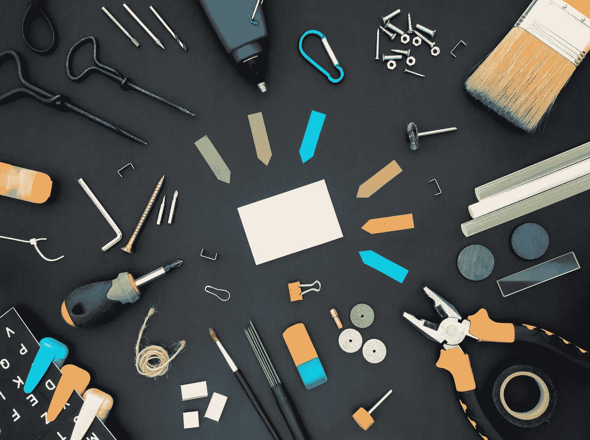

# 数据科学越来越面向工具。会不会扼杀背后的科学？

> 原文：<https://towardsdatascience.com/data-science-is-becoming-more-tool-oriented-will-it-kill-the-science-behind-9026b451bd9b?source=collection_archive---------17----------------------->

## 不要越过必需品变成负担的临界点。

丹-克里斯蒂安·pădureț在 [Unsplash](https://unsplash.com/s/photos/tools?utm_source=unsplash&utm_medium=referral&utm_content=creditCopyText) 上拍摄的照片

数据科学的目标就是从数据中创造价值。实现这一目标的主要组成部分是:

*   用数据解决的问题
*   数据(显然)
*   探索和理解数据的能力
*   工具

我所说的工具是指在数据科学工作流程中被证明有用的整套软件工具。

Excel 是应用广泛的一种。Python 是数据科学中最常用的编程语言。SQL 是我们用来管理关系数据库的。Tableau 允许我们创建令人惊叹的仪表板。数据块使我们能够处理大量的数据。

针对特定任务和操作的更具体的工具还有很多。

越来越多的软件工具和软件包不断推出。我认为创建这样的工具主要有三个动机:

*   我们处理的数据量不断增加，因此新工具应运而生，以更高效地处理大规模数据
*   为了简化日常操作
*   行业内的竞争。例如，AWS、微软和谷歌正在竞争从“云”馅饼中获得更大的份额。

很明显，我们需要软件工具来执行数据科学。它们使我们能够将想法转化为行动。然而，不断增加的软件工具和软件包有时会让我感到疲惫不堪。

照片由[亚当·温格](https://unsplash.com/@awcreativeut?utm_source=unsplash&utm_medium=referral&utm_content=creditCopyText)在 [Unsplash](https://unsplash.com/s/photos/finish-line?utm_source=unsplash&utm_medium=referral&utm_content=creditCopyText) 上拍摄

在某些情况下，一组特定工具的性能没有显著差异。一个公司可以只喜欢一个而不喜欢另一个。因此，我们需要学习哪种工具只取决于我们工作的公司。

无论我们使用什么工具，数据科学的基础都是一样的。这些产品基于相同的原理和理论。统计学、贝叶斯定理、线性回归和相关性不会因我们使用的工具而改变。

但是，我们使用特定工具的方式可能与其他工具有很大不同，因此我们需要花一些时间来学习它。

时间是最宝贵的资源，而且是有限的。即使我们有学习新工具的动机，我们也可能没有足够的时间。

假设我工作的一部分是创建仪表板，我在目前的公司使用 Tableau。我因为某种原因换了工作，我的新公司更喜欢 Power BI。

在这种情况下，学习 Power BI 并没有给我的仪表板创建技能增加显著的价值。我刚刚成为一名员工，可以用两种不同的工具执行相同的任务。

所以，我首先担心的是不能有效地利用时间。

我的另一个担忧是，你可以使用的工具数量可能被认为比你的数据科学知识更重要。这种情况导致对数据科学家的评估是基于工具知识，而不是科学。

如果出现这种情况，这将是一个严重的问题。软件工具就是用来将想法转化为行动或价值的。

这些想法来自数据科学家，他们融合了分析思维、创造力、统计和理论。如果数据科学家被迫学习尽可能多的工具，他们可能会忽略这一点。

由于有了高度先进的工具，他们会很快完成任务。然而，这不足以从数据中创造价值。

导致创造价值的首先是定义一个可以用数据解决的问题。一旦定义了问题并设计了解决方案，就需要工具来完成任务。

我想你会同意，没有问题和解决方案，高级软件工具就没有用。

总而言之，我们绝对需要软件工具和软件包来执行数据科学。它们使我们能够快速有效地处理大量数据。

然而，我觉得工具的数量可能会超过必要的。学习各种工具的要求给数据科学家带来了额外的压力。

花费大量时间学习新工具可能会导致数据科学家对真正重要的东西不够重视。

成为 [Medium 会员](https://sonery.medium.com/membership)可以在 Medium 上访问无限数量的文章。

<https://sonery.medium.com/membership>  

感谢您的阅读。如果您有任何反馈，请告诉我。