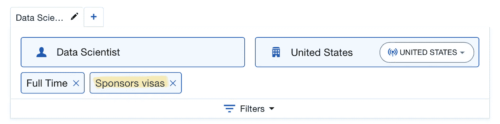
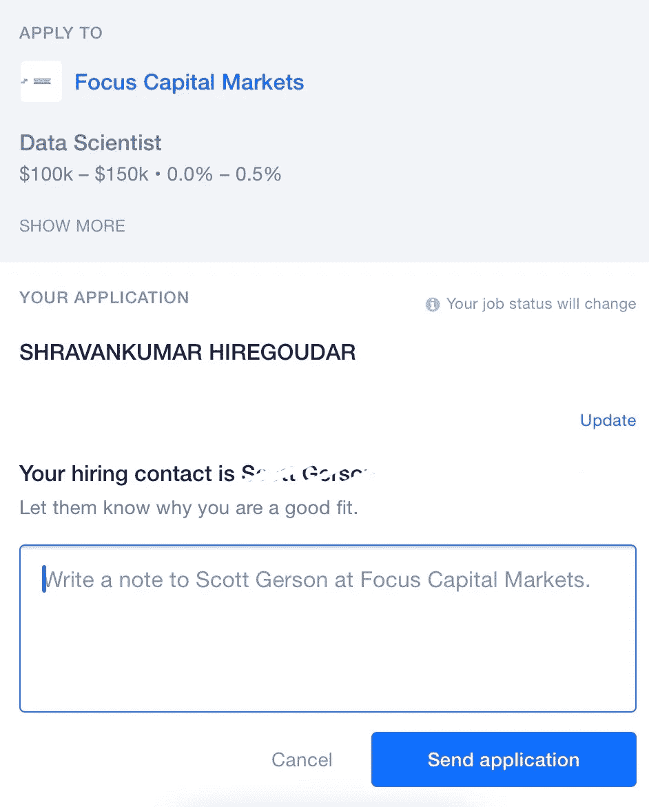
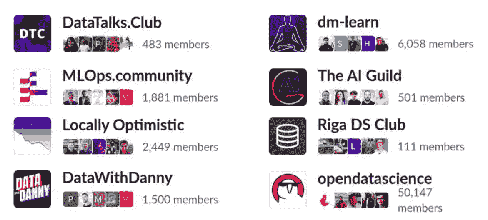
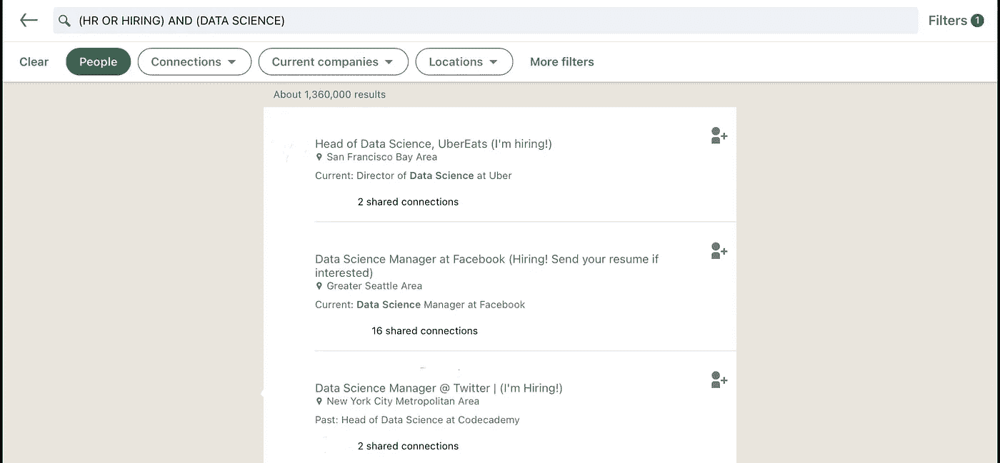
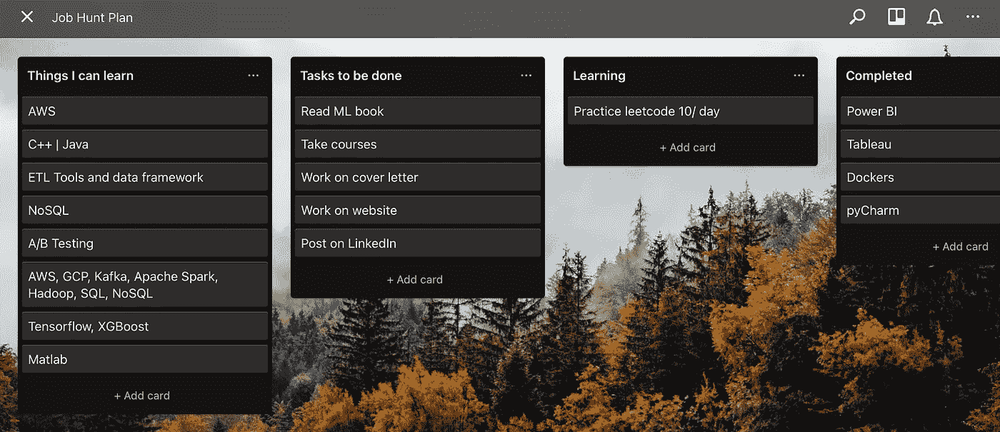
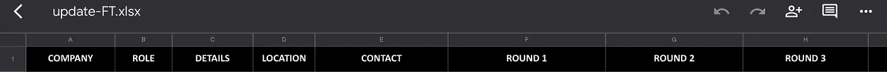

# 数据科学求职——什么对我有用？

> 原文：<https://towardsdatascience.com/data-science-job-search-what-worked-for-me-c60a1df222b5?source=collection_archive---------37----------------------->

## “从别人的错误中吸取教训。你不可能活得足够长，让它们都是你自己做的。”―埃莉诺·罗斯福。

纽约| Shravankumar Hiregoudar

根据[来源](https://careersidekick.com/tools/job-search-websites/)，一些最受欢迎的工作搜索引擎网站是；

*   [的确](https://www.indeed.com/m/)
*   [领英](https://www.indeed.com/m/)
*   [玻璃门](https://www.glassdoor.com/)
*   [事业建设者](https://www.careerbuilder.com/)

根据[研究](https://kinsta.com/blog/linkedin-statistics/)，LinkedIn 拥有超过 7.6 亿用户，月活跃用户超过 2.6 亿。该网站上列出了 2000 多万家公司和 2000 万个空缺职位，发现 87%的招聘人员经常使用 LinkedIn 并不奇怪。LinkedIn 和[实际上是](https://www.indeed.com/about)一起占据主导地位，每月有超过 2.5 亿的独立访问者。

但是，这些是完成工作的唯一平台吗？可能，不会。由于这些应用程序中的活跃用户数量很高，因此应用程序/作业比率也很高。我们的简历被招聘人员看到的机会变少了(但不是零)。

根据我的求职经验，我想分享一些不太受欢迎的技巧，以方便求职和获得面试。

> 此博客的索引:
> 
> 1.天使列表
> 
> 2.萧条的社区
> 
> 3.LinkedIn 黑客
> 
> 4.很少策划黑客
> 
> —在线状态
> 
> —行动项目
> 
> —连接

# [AngelList](https://angel.co/)

AngelList 是一个面向初创公司、天使投资人和希望在初创公司工作的求职者的网站。一些对求职有用的特征是，

## “赞助商签证”过滤器

对于在美国的国际学生来说,“担保签证”是一个节省时间的选项。启用此过滤器允许您向担保签证的公司申请。令人惊讶的是，我没有在其他任何网站上看到过这种滤镜。

AngelList 求职首页(截图)

## 招聘联系信息

工作详细信息包括描述、地点、工作类型(全职、兼职、实习)、签证赞助、预计/实际薪酬、所需经验以及招聘联系信息。

招聘联系信息将帮助你根据他/她在公司的角色定制你的简历和求职信。在申请之前，最好对公司和最近的工作和进展有所了解，这样你才能写一封好的求职信。在 AngelList 上申请职位后，我会在 LinkedIn 上搜索招聘联系人，介绍自己，表明我对这家公司的兴趣。这是一个非常有效的方法。

AngelList 应用页面(截图)

# 萧条的社区

[2021 年将加入八个数据科学 Slack 社区](https://datatalks.club/blog/slack-communities.html)(截图)

检查这些博客的各种松弛渠道；

*   [2021 年将加入八个数据科学 Slack 社区](https://datatalks.club/blog/slack-communities.html)
*   [400 个 Slack 社区的完整列表](https://medium.com/startupsco/the-full-list-of-400-slack-communities-5545e82cf65d)

这些 slack 社区由数据爱好者、学生和专业人士组成。许多讨论围绕当前的技术、技术新闻、项目、出版物、聚会、事件等展开。这些社区也有与职业相关的频道，如:

*   *简历审核:*你可以发布简历，相关领域的人会审核并提供反馈。一双新鲜的眼睛总是有帮助的。此外，该渠道由人力资源和人才团队人员组成，他们的意见很有价值。
*   *工作机会:*这个渠道包含两类人，寻求者和给予者。如果你是求职者，写一份好的电梯推介，并提供你的联系方式。一般来说，如果他们的组织中有类似的机会，人们会做出反应。另一组人(雇主/ HR)发布职位详情，你可以直接联系他们。

# LinkedIn 黑客

LinkedIn 每月有超过 2.6 亿活跃用户，它是联系雇主/人力资源的最佳媒介之一。

## [使用布尔搜索](https://www.socialtalent.com/blog/recruitment/what-boolean-search-operators-does-linkedin-support-a-sourcing-refresher)

布尔搜索可以节省时间。假设你想和雇佣数据科学家的人联系。使用布尔表达式(招聘或人力资源或人才)和(数据科学家或数据工程师)。这种搜索的结果比常规搜索 [*更准确*](https://www.socialtalent.com/blog/recruitment/what-boolean-search-operators-does-linkedin-support-a-sourcing-refresher)

**

*LinkedIn 上的布尔搜索(截图)*

## *与招聘人员联系*

*用简短而有说服力的电梯间推介来传达连接请求。优化这个介绍，因为有字数限制。*

*一旦这种联系被正式接受，介绍你自己，多谈谈公司和这个领域。耐心等待回复，因为对方可能不会马上出现。请看看他们公司的招聘页面，列出一些职位。给出一个很好的解释，为什么你认为你很适合这个职位和公司。如果你没有得到任何回应，不要为难自己。提高你的推销技巧，联系更多的招聘人员。仅仅通过与招聘人员交谈，我就获得了许多面试机会。机会比网上申请高，但你必须超级耐心和坚持。对我来说，招聘人员的良好回应率是 1/30。*

*你可以找到很多这样的方法来增加你的机会，但主要的方法是坚持不懈，不断改进和定制你的简历以适应这个角色，并与尽可能多的人联系。*

> *招聘激增，Glassdoor 的一个有用选项。瞄准那些公司，利用需求。*

# *很少策划黑客*

## *在线状态*

*当招聘人员在 LinkedIn/Indeed 中搜索相关关键词时，建立你的整体档案并提供你的技能和成就的可见性是至关重要的。实现这一点的一些简单方法是，*

*   *在 LinkedIn 上发布内容*
*   *参加活动和网络研讨会(与演讲者交流)*
*   *写博客并发布在社区/出版物上。*
*   *准备好强有力的电梯推销。*
*   *冷冰冰的邮件招聘人员。*

## *行动项目*

*维护一个 Trello 板/ OneNote 来跟踪进度和任务。如果工作描述要求一个特定的工具/技术/语言，把它放在事物中，我可以学习并开始学习。*

**

*特雷罗策划示例(截图)*

*记录面试。写下你认为自己做对的三件事，以及在所有面试中你可以改进的三件事。它有助于理解失败。*

**

*在 Excel 上记录面试(截图)*

## *一些建议:*

*   *不要把你的脚从油门上拿开。*
*   *如果事情对你不利，继续改善你的个人资料。*
*   *妥善处理压力(在 Trello 上写下来，当你处理压力时扔掉它们)*
*   *记录你的进步和失败。*
*   *每天听播客和网络研讨会。它让你在学习新东西的同时放松。*
*   *[招聘人员信息列表](https://docs.google.com/spreadsheets/d/1Zfz-YcuWdFMdyPtCc1MoE4h0gk-APurRiCF8BZy12AQ/edit)*

## *结论:*

*"选择人迹罕至的道路。"如果你只把 30%的精力和时间花在流行的求职网站(LinkedIn，实际上是 Glassdoor)上，并通过公司网站申请，那会有所帮助。*

*剩下的时间在 LinkedIn 和 Slack 社区上与人联系。尽可能多地阅读职位描述，了解需要改进的地方。这是一个充满压力的过程，但一旦你找到合适的人和公司，这一切都是值得的。祝你好运！*

**