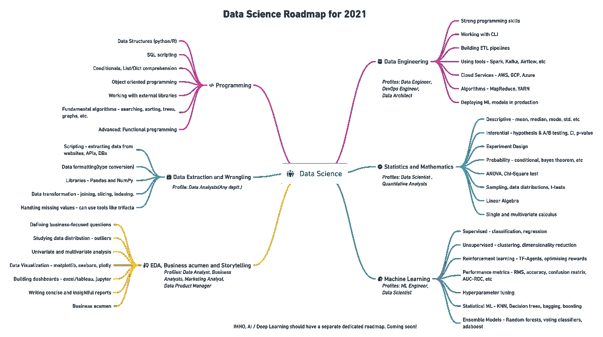
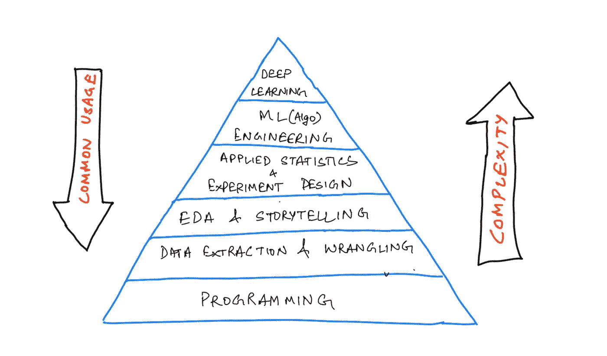
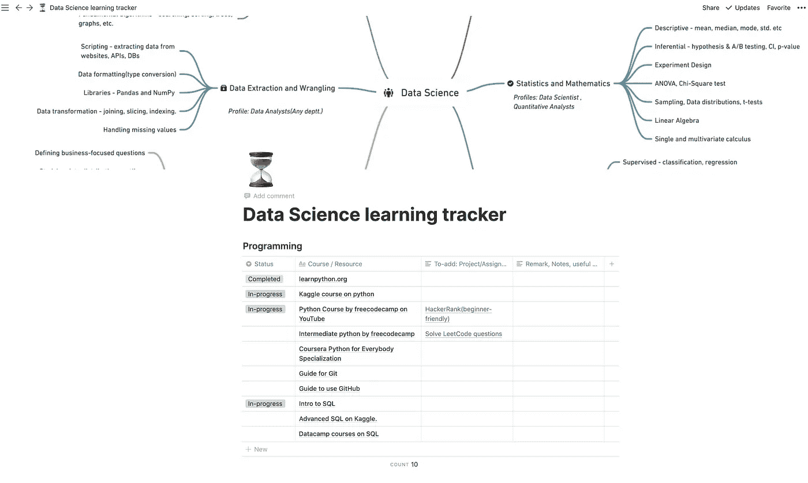

# 2021 年数据科学学习路线图

> 原文：<https://towardsdatascience.com/data-science-learning-roadmap-for-2021-84f2ba09a44f?source=collection_archive---------3----------------------->

## 构建自己的学习轨道，掌握应用数据科学的艺术

高级数据科学路线图

虽然除了日期之外没有什么真正改变，但是新的一年让每个人都充满了重新开始的希望。增加一点计划，精心设想的目标和学习路线图是充满增长的一年的好方法。

这篇文章旨在通过为您提供一个**学习框架、资源和项目想法**来加强您的计划，以建立一个展示数据科学专业知识的可靠工作组合。

> 免责声明 *:* 定义的路线图是根据我在数据科学方面的一点经验准备的。这不是最重要的学习计划。路线图可能会改变，以更好地适应任何特定的领域/研究领域。此外，这是在牢记 python 的基础上创建的，因为我个人更喜欢使用 python。

# 什么是学习路线图？

以我的拙见，学习路线图是课程的延伸，它绘制了多层次的技能图，详细说明了**你想要磨练哪些**技能、**你将如何**衡量每个层次的结果，以及**进一步掌握每项技能的技术**。

我的路线图根据现实世界中应用程序的复杂性和通用性为每个级别分配权重。我还增加了初学者完成每个级别的练习/项目的估计时间。

下面是一个金字塔，按照复杂性和在行业中的应用顺序描述了高级技能。

按复杂程度排列的数据科学任务

这将标志着我们的框架的基础，我们现在必须深入到这些层中的每一层，以更具体、更可测量的细节来完成我们的框架。

具体性来自于在每个层次和资源中列出关键主题，以参考和掌握这些主题。

我们可以通过将学到的主题应用到一些现实世界的项目中来衡量它。我添加了一些项目想法、门户和平台，您可以用它们来衡量您的熟练程度。

> **Imp 注:一天一次，一天一个视频/博客/章节。它涵盖的范围很广。不要压倒自己！**

让我们从底部开始，深入研究每一层。

# 1.编程或软件工程

***(预计时间:2-3 个月)***

首先，确保你有良好的编程技能。每一份数据科学的工作描述都会要求至少一种语言的编程专业知识。

**具体话题包括:**

*   常见的数据结构(数据类型、列表、字典、集合、元组)、编写函数、逻辑、控制流、搜索和排序算法、面向对象编程以及使用外部库。
*   SQL 脚本:使用连接、聚合和子查询查询数据库
*   熟练使用终端、Git 中的版本控制和 GitHub

**python 的资源:**

*   learnpython.org[【免费】——初学者的免费资源。它从头开始涵盖了所有基本的编程主题。您将获得一个交互式 shell 来并排练习这些主题。](https://www.learnpython.org/)
*   [Kaggle](https://www.kaggle.com/learn/python) 【免费】——一个免费的交互式学习 python 的指南。这是一个简短的教程，涵盖了数据科学的所有重要主题。
*   YouTube 上 freecodecamp 的 Python 课程【免费】——这是一个 5 小时的课程，你可以跟随它练习基本概念。
*   [中级 python](https://www.youtube.com/watch?v=HGOBQPFzWKo) 【免费】Patrick 在 freecodecamp.org 推出的另一门免费课程。
*   [**Coursera python for Everybody 专门化**](https://www.coursera.org/specializations/python)**【fee】**—这是一个专门化，包含初级概念、Python 数据结构、从 web 收集数据，以及使用数据库和 Python。

**Git**

*   Git 指南和 GitHub 指南【免费】:完成这些教程和实验，以便更好地掌握版本控制。这将有助于您进一步为开源项目做出贡献。

**SQL**

*   Kaggle 上的[SQL 介绍](https://www.kaggle.com/learn/intro-to-sql)和[高级 SQL](https://www.kaggle.com/learn/advanced-sql) 。
*   Datacamp 也提供许多关于 SQL 的[课程。](https://learn.datacamp.com/search?q=sql)

**通过解决大量问题和构建至少两个项目来衡量你的专业知识:**

*   在这里解决很多问题: [HackerRank](https://www.hackerrank.com/) (初学者友好型) [LeetCode](https://leetcode.com/) (解决轻松或中级问题)
*   从网站/API 端点提取数据——尝试从允许像*soundcloud.com 一样抓取的网页中提取数据，并编写 python 脚本。*将提取的数据存储到 CSV 文件或 SQL 数据库中。
*   像石头剪刀布，旋转纱线，刽子手，骰子滚动模拟器，井字游戏等游戏。
*   简单的网络应用程序，如 youtube 视频下载器、网站拦截器、音乐播放器、剽窃检查器等。

将这些项目部署在 GitHub 页面上，或者简单地将代码托管在 GitHub 上，以便学习使用 Git。

# 2.数据收集和争论(清理)

***(预计时间:2 个月)***

数据科学工作的一个重要部分是围绕着寻找可以帮助您解决问题的适当数据。你可以从不同的合法来源收集数据——抓取(如果网站允许的话)、API、数据库、公开可用的存储库。

一旦掌握了数据，分析师就会发现自己经常清理数据框架，处理多维数组，使用描述性/科学计算，操纵数据框架来汇总数据。

数据很少是干净的和格式化的，以便在“真实世界”中使用。Pandas 和 NumPy 是两个库，您可以随意使用它们从脏数据转换成可供分析的数据。

当你开始对编写 python 程序感到舒适时，可以开始学习使用库的课程，比如**熊猫**和 [**numpy**](/numpy-essentials-for-data-science-25dc39fae39) 。

**资源:**

*   [使用 pandas 进行数据操作](https://learn.datacamp.com/courses/data-manipulation-with-pandas)【费用】datacamp 的一门互动课程，可以让你快速上手使用 pandas 进行数据操作。学习添加转换、聚合、子集化和索引数据帧。
*   [Kaggle pandas 教程](https://www.kaggle.com/learn/pandas)【免费】——一个简短的实践教程，将带你了解常用的数据操作技巧。
*   [ka ggle 的数据清洗过程](https://www.kaggle.com/learn/data-cleaning)。
*   [关于学习 Numpy、pandas、matplotlib、seaborn 的 freecodecamp 课程](https://www.youtube.com/watch?v=r-uOLxNrNk8)【免费】。
*   [Coursera 关于 Python 中数据科学介绍的课程](https://www.coursera.org/learn/python-data-analysis?specialization=data-science-python)【费用】——这是[应用数据科学中第一门 Python 专业化的课程。](https://www.coursera.org/specializations/data-science-python)

**项目思路:**

*   从您选择的网站/API(向公众开放)收集数据，收集数据，并将数据转换为将来自不同来源的数据存储到聚合文件或表(DB)中。示例 API 包括 [TMDB](https://developers.themoviedb.org/3) 、 [quandl](https://www.quandl.com/tools/python) 、 [Twitter API](https://developer.twitter.com/en/docs) 等。
*   挑选[任何公开可用的数据集](/data-repositories-for-almost-every-type-of-data-science-project-7aa2f98128b)；在查看数据集和领域后，定义几组您想要探讨的问题。使用熊猫和 NumPy 讨论数据，找出这些问题的答案。

# 3.EDA、商业头脑和讲故事

***(预计时间:2-3 个月)***

下一个需要掌握的层次是数据分析和讲故事。从数据中提取洞察力，然后用简单的术语和可视化的方式与管理层交流，这是数据分析师的核心职责。

讲故事的部分要求你精通数据可视化和优秀的沟通技巧。

**具体话题:**

*   **探索性数据分析** —定义问题、处理缺失值、异常值、格式化、过滤、单变量和多变量分析。
*   数据可视化—使用 matplotlib、seaborn 和 plotly 等库绘制数据。选择正确的图表来传达数据发现的知识。
*   开发仪表盘——相当多的分析师仅使用 Excel 或 Power BI 和 Tableau 等专业工具来构建仪表盘，汇总/汇总数据以帮助管理层做出决策。
*   商业敏锐度:努力提出正确的问题来回答，这些问题实际上是针对商业指标的。练习撰写清晰简洁的报告、博客和演示文稿。

**资源:**

*   [数据分析职业轨迹](https://learn.datacamp.com/career-tracks/data-analyst-with-python) —由 datacamp 提供。一个很好的互动课程列表，你可以参考他们在教学中使用的真实案例研究。但是在完成专业化之后，一定要做自己的项目。
*   用 Python 进行数据分析——IBM 在 Coursera 上。本课程涵盖争论、探索性分析和使用 python 的简单模型开发。
*   [数据可视化](https://www.kaggle.com/learn/data-visualization) —由 Kaggle 完成。另一个互动课程，让你练习所有常用的情节。
*   [电子表格中的数据可视化](https://learn.datacamp.com/courses/data-visualization-in-spreadsheets)、 [Excel](https://learn.datacamp.com/courses/data-analysis-in-excel) 、 [Tableau](https://learn.datacamp.com/skill-tracks/tableau-fundamentals) 、[Power BI](https://learn.datacamp.com/courses/introduction-to-power-bi)——随便挑。
*   用这些书打造产品感和商业敏锐性: [**衡量什么最重要**](https://www.amazon.com/Measure-What-Matters-Google-Foundation/dp/0525536221)**[解码征服](https://www.amazon.com/Decode-Conquer-Answers-Management-Interviews/dp/0615930417)[破解 PM 面试](https://www.amazon.com/Cracking-PM-Interview-Product-Technology-ebook/dp/B00ISYMUR6) **。****

****项目创意****

*   **对[电影数据集进行探索性分析，找出制作盈利电影的公式](/hitchhikers-guide-to-exploratory-data-analysis-6e8d896d3f7e)(以此为灵感)，使用来自医疗保健、金融、世卫组织、以往人口普查、电子商务等领域的数据集。**
*   **使用上面提供的资源构建仪表板(jupyter 笔记本、excel、 [tableau](https://public.tableau.com/en-gb/gallery/?tab=viz-of-the-day&type=viz-of-the-day) )。**

# **4.数据工程**

*****(预计时间:4-5 个月)*****

**数据工程通过让大数据驱动型公司的研究工程师和科学家可以访问干净的数据来支撑 R&D 团队。它本身就是一个领域，如果你想专注于问题的统计算法方面，你可以决定跳过这一部分。**

**数据工程师的职责包括构建高效的数据架构、简化数据处理和维护大规模数据系统。**

**工程师使用 Shell(CLI)、SQL 和 python/Scala 来创建 ETL 管道、自动化文件系统任务，并优化数据库操作以实现高性能。另一个关键技能是实现这些数据架构，这需要精通云服务提供商，如 AWS、Google Cloud Platform、Microsoft Azure 等。**

****资源:****

*   **[【本书】安德烈·布尔科夫的《机器学习工程》](http://www.mlebook.com/)——这本书捕捉了在生产环境中部署/监控模型的真实场景。**
*   **[uda city 的数据工程 nano degree](https://www.udacity.com/course/data-engineer-nanodegree--nd027)——就已编辑的资源列表而言，我还没有遇到过结构更好的数据工程课程，可以从头开始涵盖所有主要概念。**
*   **[数据工程简介](https://learn.datacamp.com/courses/introduction-to-data-engineering)—Data camp。这是一个很好的资源，可以帮助您开始使用大量工具构建 ETL 管道。**
*   **[GCP 专业化认证上的数据工程、大数据和机器学习](https://www.coursera.org/specializations/gcp-data-machine-learning) —你可以在 Coursera 上完成谷歌提供的专业化认证，该认证将带你浏览 GCP 提供的所有主要 API 和服务，以构建一个完整的数据解决方案。**

****要准备的项目创意/认证:****

*   **[AWS 认证机器学习(300 美元)](https://aws.amazon.com/certification/certified-machine-learning-specialty/) —由 AWS 提供的监考考试，为您的个人资料增加一些权重(但不保证任何东西)，需要对 AWS 服务和 ML 有相当的了解。**
*   **[专业数据工程师](https://cloud.google.com/certification/data-engineer)—GCP 认证。这也是一个监考考试，评估您设计数据处理系统、在生产环境中部署机器学习模型、确保解决方案质量和自动化的能力。**

# **5.应用统计学和数学**

*****(预计时间:4-5 个月)*****

**统计方法是数据科学的核心部分。几乎所有的数据科学面试都主要关注描述性和推断性统计。**

**人们开始编写机器学习算法时，并没有清楚地理解解释这些算法工作的底层统计和数学方法。**

**你应该关注的话题:**

*   **描述性统计——能够总结数据是强大的，但并不总是如此。了解描述数据的位置估计值(平均值、中值、众数、加权统计值、修剪统计值)和可变性。**
*   ****推断统计** —设计假设检验、A/B 检验、定义业务指标、使用置信区间、p 值和 alpha 值分析收集的数据和实验结果。**
*   ****线性代数、单变量和多变量微积分**理解机器学习中的损失函数、梯度和优化器。**

****资源:****

*   **[Book] [数据科学实用统计](https://www.amazon.com/Practical-Statistics-Scientists-Peter-Bruce/dp/1491952962) **(强烈推荐)——**所有重要统计方法的全面指南，以及简洁明了的应用程序/示例。**
*   **[【书】裸统计](https://www.amazon.com/Naked-Statistics-Stripping-Dread-Data/dp/1480590185) —一个非技术性但详细的指南，帮助理解统计对我们日常事件、运动、推荐系统以及更多实例的影响。**
*   **[Python 中的统计思维](https://learn.datacamp.com/courses/statistical-thinking-in-python-part-1) —帮助你开始统计思维的基础课程。这门课还有第二部分。**
*   **[描述性统计简介](https://www.udacity.com/course/intro-to-descriptive-statistics--ud827) —由 Udacity 提供。由视频讲座组成，解释广泛使用的位置和可变性测量(标准差、方差、中位数绝对偏差)。**
*   **[推断统计学，Udacity](https://www.udacity.com/course/intro-to-inferential-statistics--ud201) —该课程由视频讲座组成，教育你从可能不会立即显而易见的数据中得出结论。它侧重于发展假设，并使用常见的测试，如 t 测试，方差分析和回归。**

****项目思路:****

*   **解答以上课程中提供的练习，然后尝试浏览大量公共数据集，以便应用这些统计概念。问一些问题，比如“在 0.05 的显著性水平上，是否有足够的证据证明波士顿产妇的平均年龄超过 25 岁。”**
*   **尝试与你的同龄人/小组/班级一起设计和运行小实验，让他们与应用程序互动或回答一个问题。一段时间后，一旦有了大量数据，就对收集的数据运行统计方法。这可能很难实现，但应该非常有趣。**
*   **分析股票价格、加密货币，并围绕平均回报或任何其他指标设计假设。确定你是否可以拒绝零假设，或者使用临界值拒绝零假设。**

# **6.机器学习/人工智能**

*****(预计时间:4-5 个月)*****

**在仔细研究了前面提到的所有主要概念之后，您现在应该准备好开始使用这些有趣的 ML 算法了。**

**有三种主要的学习方式:**

1.  ****监督学习**——包括回归和分类问题。学习简单线性回归、多元回归、多项式回归、朴素贝叶斯、逻辑回归、KNNs、树模型、集合模型。了解评估指标。**
2.  ****无监督学习** —聚类和降维是无监督学习的两个广泛应用。深入研究 PCA、K 均值聚类、层次聚类和高斯混合。**
3.  ****强化学习**(可以跳过*)——帮助你建立自我奖励系统。学习优化奖励，使用 TF-Agents 库，创建深度 Q 网络等。**

**大多数 ML 项目需要你掌握一些我在博客[中解释过的任务。](/task-cheatsheet-for-almost-every-machine-learning-project-d0946861c6d0)**

****资源:****

*   **[book] [用 Scikit-Learn、Keras 和 TensorFlow 实践机器学习，第二版](https://www.amazon.in/Hands-Machine-Learning-Scikit-Learn-TensorFlow/dp/1492032646)——我一直最喜欢的机器学习书籍之一。不仅涵盖了理论上的数学推导，而且通过例子展示了算法的实现。你应该解答每章末尾的练习题。**
*   **[吴恩达的机器学习课程](https://www.coursera.org/learn/machine-learning)——任何试图学习机器学习的人的入门课程。把手放下。**
*   **[机器学习简介](https://www.kaggle.com/learn/intro-to-machine-learning)—ka ggle 的互动课程。**
*   **游戏人工智能和强化学习简介——Kaggle 上另一个关于强化学习的互动课程。**
*   **[使用 Python 的监督学习](https://www.datacamp.com/courses/supervised-learning-with-scikit-learn)——data camp 提供了大量可以学习的机器学习课程。所有这些都有 4 个小时长，可以帮助你对 ML 的应用有一个很好的理解。**

**[**深度学习专业化由 deeplearning.ai**](https://www.deeplearning.ai/deep-learning-specialization/)**

**对于那些有兴趣进一步深入深度学习的人，可以从完成 deeplearning.ai 和动手书提供的专业开始。从数据科学的角度来看，这并不重要，除非您计划解决计算机视觉或 NLP 问题。**

**深度学习应该有自己的专用路线图。我将用所有的基本概念来创建它**

# **跟踪你的学习进度**

****

**[https://www . sension . so/Data-Science-learning-tracker-0d3c 503280d 744 ACB 1b 862 a1 DDD 8344 e](https://www.notion.so/Data-Science-learning-tracker-0d3c503280d744acb1b862a1ddd8344e)**

**我还为你创建了一个学习跟踪器。您可以根据自己的需要定制它，并使用它来跟踪您的进度，轻松访问所有资源和您的项目。**

# **[wiplane.com 威平学院](https://www.wiplane.com/)**

**如果你觉得这有用，我已经策划了一个课程，为你提供数据科学& ML 的第一步。在过去的 3 个月里，我将这门课程变成了一门成熟的课程，为你的职业生涯打下坚实的基础**

*   **数据分析师**
*   **数据科学家**
*   **ML 从业者/工程师**

**因此，我在这里向您介绍数据科学的 [**基础或 ML**](https://www.wiplane.com/p/foundations-for-data-science-ml)**—**[**学习数据科学和 ML**](https://www.wiplane.com/p/foundations-for-data-science-ml) 的第一步**

**这是一门全面而紧凑且负担得起的课程，不仅涵盖了谷歌推荐的所有基本要素、先决条件和准备工作，还解释了如何通过计算和编程(用 Python 语言)来使用每个概念。**

**不仅如此，我还会根据您的意见每月更新课程内容。**

**点击了解更多[。](https://www.wiplane.com/p/foundations-for-data-science-ml)**

## **早鸟优惠！**

**我很高兴启动本课程的预售，因为我目前正在录制和编辑 2-3 个模块(15-20 个讲座)的最后部分。这些也将在 9 月的第一周上线。**

**抢早鸟优惠，有效期仅至 2021 年 8 月 30 日。**