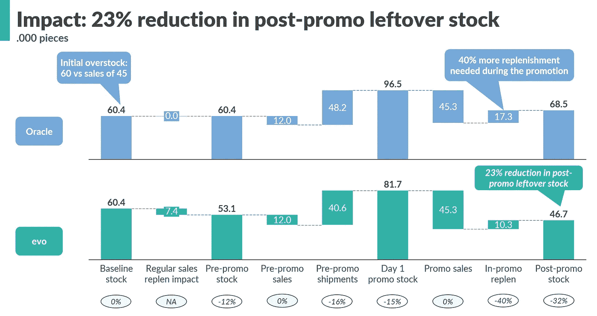
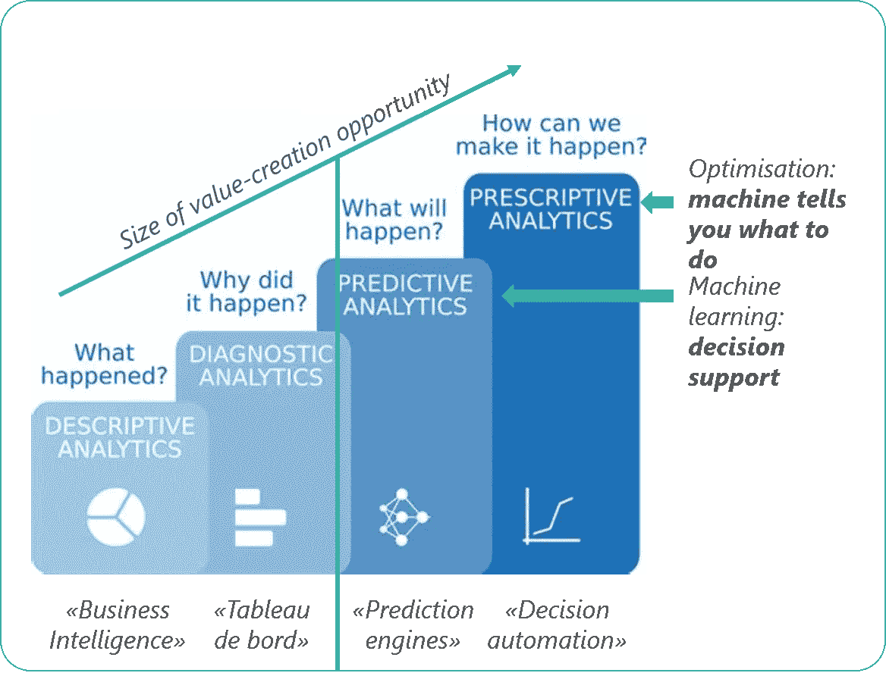

# 数据科学课程我们学得不够快

> 原文：<https://towardsdatascience.com/data-science-lessons-were-not-learning-fast-enough-83ead4827735?source=collection_archive---------12----------------------->

## [商业科学](https://medium.com/tag/business-science)

## 令人失望的是，新数据科学家犯的错误与专业人士犯的错误非常相似


[NeONBRAND](https://unsplash.com/@neonbrand?utm_source=medium&utm_medium=referral) 在 [Unsplash](https://unsplash.com?utm_source=medium&utm_medium=referral) 上的照片

在过去的一年里，我有机会向许多学生介绍数据科学。在 ESCP[教授大数据 MBA 课程和与都灵理工大学的学生合作开发一种算法来预测时尚趋势，作为 CLIK](https://escp.eu/)[(连接实验室和创新厨房)T11 商业挑战](https://clik.polito.it/en/challenge/a-i-4-fashion-trends-_by-evo/)[的一部分，我已经能够与学生分享我们所做的事情，否则他们可能不会考虑它的价值。看到他们**理解为什么数据科学是未来**令人欣慰。](https://resources.evopricing.com/press-releases/students-in-ai-4-fashion-trends-challenge-polito-hosted-by-evo-and-clik-find-innovative-solutions-to-an-intractable-problem/)

在这个过程中，我越来越适应人们在应用、开发和使用数据科学时所犯的错误类型。有时这些纯粹是技术错误，但更多的时候，这些错误是由于对我们如何最好地利用越来越多的海量数据产生了更深刻的误解。

当你开发一个算法时，错误是正常的，甚至是可取的。你从这些错误中学习，创造出更好的最终产品。作为一名学生或新的数据科学家，错误对于培养技能至关重要。

> 但是一遍又一遍地重复那些错误？那是另外一个故事。

我与他们合作得越多，就越意识到新数据科学家犯的错误与专业人士犯的错误非常相似。数据科学家没有从我们早期的失误中吸取教训，而是挖掘并拒绝学习关键的经验教训，这些经验教训决定了数据驱动决策的增量收益和系统转型之间的差异。

*我们必须从数据科学家不断犯的三个关键错误中吸取教训，以便更好地开展工作:*

# 错误 1:假设近乎完美的数据

每个专业的数据科学家都知道，在智力层面上，你永远不会有完美的数据。数据将**不完整、肮脏、容易出错，并且充满噪音**。处理杂乱的数据是我们日常工作的一部分，也是我们最常见的抱怨。

当你第一次开始时，你对这个现实的实际经验较少。当我给我的 MBA 学生布置一项任务，要求他们选择要使用的数据集时，他们默认使用最相关的信息。从表面上看，这是有道理的:数据越相关，其影响就越大。

实际上，这种假设放大了数据中的每个问题。算法没有足够的数据来进行适当的学习，并克服数据集中的错误。尽管传统回归模型在面对海量数据集时会失败，但随着数据的增加，机器学习会蓬勃发展。假设数据完美，我的学生可能已经通过他们的选择取得了理想的结果，但在现实世界中，他们没有足够的数据来实现他们的目标。


**传统模式学得慢。**图片致谢: [Evo 定价](https://evopricing.com/) (CC 带归属)

该领域的数据科学家应该更清楚。毕竟，他们花了这么多时间清理数据集，这是不可能忽视的！

不幸的是，许多数据科学家害怕提供太多的噪音，并默认为更安全的选择。他们看到了额外数据集的收益递减，并认为这种努力不值得。

> 这是一个致命的错误。

例如，在供应链预测中，最关键的信号来自产品特性、交易、可用性和流量等数据。来自社交媒体、人口统计和天气的信息提供的价值较小。


**在信号海洋中选择价值驱动的数据集。**图片致谢: [Evo 定价](https://evopricing.com/) (CC 带归属)

**而不是*零*值**。对于概念验证，最相关的数据可能是最有价值的。尽管如此，次要影响对生产有重大影响，尤其是考虑到对一家大型国际零售商来说，利润增加 1%的货币价值。

数据科学家在选择数据时小心谨慎是正确的，但我仍然看到太多因谨慎行事而减少的结果。表面上看起来可能不一样，但他们正在犯和我的学生一样的错误:假设他们选择的数据足够接近完美。

最终，数据越多越好。让机器从你喂给它们的东西中学习，并找到自我补偿错误的方法。我们将有更健壮、[更敏捷的模型](/agile-is-the-watchword-8b500d8cd0db)来给我们更好的建议。

# 错误 2:误解你所在行业的驱动力

如今，对于任何数据科学家来说，行业知识都和技术知识一样重要。这些知识引导我们提出正确的问题，并利用数据来解决最紧迫的问题。当我们缺乏这种洞察力时，我们就会陷入困境。

以 CLIK 挑战为例。对时尚产业如何运作几乎一无所知的学生被期望找到创新的解决方案来满足他们的生产需求。可以理解的是，许多人一开始都很难确定时尚公司实际上需要什么样的趋势预测。公司需要了解的是颜色、风格还是其他因素？这种对时装生产周期运作方式的专业知识的缺乏起初让学生们感到困惑。

在第一稿中，许多提议的项目都很有趣，但最终都没有找到一个在时尚行业行得通的实用解决方案。他们有数据，科学是有效的，但目标是有缺陷的。即使成功实施，也不会显著帮助时装公司更好地计划生产和采购。学生们不得不重新分组。

在这样的挑战中，知识差距是可以理解的，也是意料之中的。在特定行业全职工作的专业数据科学家就不一样了。他们应该对所服务的行业和公司的需求有更深入的了解。

> 然而，太多的数据科学家不知道他们的客户的关键问题在哪里。

最近，我和一家俄罗斯大型食品连锁店的首席执行官讨论了这个问题。该连锁店长期以来一直使用一种被认为是同类最佳的需求预测和零售规划软件来使用其数据进行更有效的补货。这通常是可以接受的，但随着时间的推移，它越来越显示出它的根本缺陷:它系统地制造了库存过剩。

在杂货店，有针对性的本地促销是实现竞争优势的常用策略。

> “很难预测我们每周的促销活动对需求的影响。有些折扣会成倍地增加销售额，而另一些折扣影响甚微。为了确保足够的产品供应，我们倾向于积压促销商品。这些库存过剩造成了巨大的浪费和周期性降价压力。我们需要一个更可持续的解决方案。”

促销品缺货对品牌不利，但经常性的库存过剩会造成大量浪费。促销品的不良补充是不可持续的，而且成本高昂:这是困扰杂货业的一个核心供应链痛点。

尽管如此，许多需求预测未能关注这一领域，而是在其他领域实现了增长。简单地解决这种脱节会带来巨大的收益:在这种情况下， **+23%的库存效率**。



**促销后剩余库存的影响。**图片致谢: [Evo 定价](https://evopricing.com/) (CC 带归属)

在这种情况下，即使几个百分点也能对底线产生巨大影响，这些数字是压倒性的。但它们都可以归因于针对错误问题的健全制度。忽视行业知识的整体作用是熟练的数据科学家经常犯的错误，会带来灾难性的后果。

如果你使用所有的数据和精心设计的算法来解决次要问题，你就复制了一个破坏性的错误。作为数据科学家，我们必须做得更好。

# 错误 3:试图预测而不是推动结果

最后一个错误，也是我最常看到的一个错误:预测性而非规定性的方法。

新数据科学家听到“预测”，他们自然明白预测是他们的首要目标。从语言学上来说，这是对他们作品最精确的定义。然而，从战略的角度来看，这些初学者缺乏理解他们真正目标是提高 KPI，而不是预测准确性的背景。我见过许多新的数据科学家为实现了高精度而骄傲，幸福地意识到**这种精度的投资回报对用户来说实际上是不存在的**。

当你开始时，这种天真是正常的，但可悲的是，很少有数据科学家超越这种思维模式。我见过一些公司在业务相对正常的时候，骄傲地吹嘘自己的准确性，但在危机面前，他们的模型失败了，让他们措手不及。

例如，在新冠肺炎疫情的早期阶段，许多使用预测人工智能的数据科学家看到他们的模型分崩离析。那些继续提供可操作的建议，并让公司成功转向降低危机影响的公司？几乎总是[规定型](https://www.bcg.com/publications/2020/business-applications-artificial-intelligence-post-covid)。

太多时候，人工智能模型的设计主要是基于稳定的条件来预测未来，而不是以最佳方式实现未来的目标。我已经写了无数篇过去的文章来告诉 T2 为什么这是一个问题。太多的不确定性限制了你的回报。

> 这个错误的核心在于商业哲学:一个预测结果而不是推动结果的公司太被动了。

最成功的公司不是专注于发现将会发生什么，并成功地适应。他们是希望知道如何实现目标的市场领导者。



**分析方法的演变。**图片致谢: [Evo 定价](https://evopricing.com/)和[neuraldesigner.com](http://neuraldesigner.com/)(CC 带归属)

预测分析限制了你的努力所创造的价值。预测性建议告诉你对可能发生的事件的最佳反应；规范性建议告诉你如何实现你的目标，不管你的道路上有什么障碍。

数据科学家必须停止犯同样的错误，相信他们正在建立预测引擎。他们真正的角色是自动化决策，并通过规定的方法获得更好的结果。

# 如何从我们的错误中吸取教训


照片由[蒂姆·莫斯霍尔德](https://unsplash.com/@timmossholder?utm_source=medium&utm_medium=referral)在 [Unsplash](https://unsplash.com?utm_source=medium&utm_medium=referral) 上拍摄

我们不能老是原地打转，一遍又一遍地犯这些错误。作为数据科学家，这些坏习惯阻碍了我们的研究领域。

数据科学家必须认识到他们是如何反映职业生涯早期犯下的错误的，以调整并最终克服这些错误。我们第一次犯错，是件好事。我们可以学习，下次做得更好。当我们重复犯那个错误，没有注意到我们的错误时，我们就有问题了。我们从错误中吸取教训的唯一方法是拥抱一条新的道路。

我们应该已经吸取了这些教训:是时候超越初学者的错误了。随着我们的前进，我们肯定会犯新的错误。拥抱他们！他们会带我们走向更大的成功，而不是让我们停滞不前。

PS 更多[商业科学](https://medium.com/tag/business-science)来自我的写作:

</markdowns-from-descriptive-to-prescriptive-ec729c4cce82>  </fashion-is-broken-science-is-fixing-it-b771b1ab5b59>  

```
Monthly Business Science in your inbox, new software, and University-level learning:[**Free access**](https://evouser.com/register)Questions? Please reach out on [Linkedin](https://www.linkedin.com/in/fabrizio-fantini/)
```