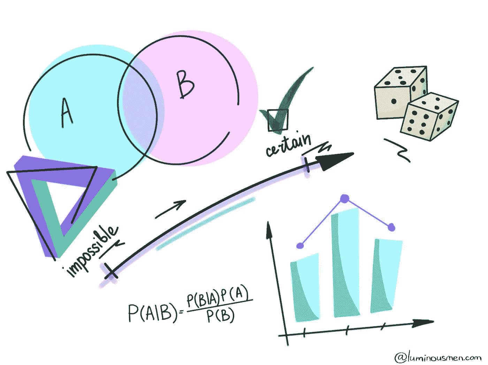
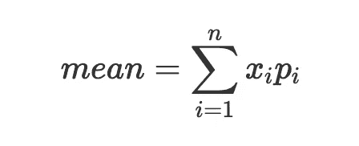
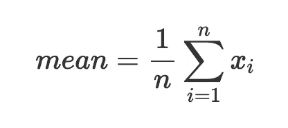
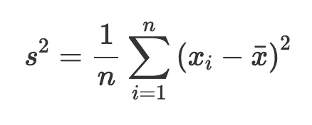
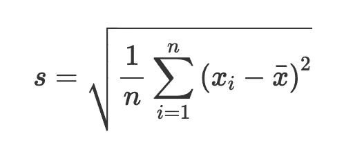

# 数据科学。措施

> 原文：<https://towardsdatascience.com/data-science-measures-213521b6a878?source=collection_archive---------24----------------------->

## 如何使用描述性统计来查看数据显示的内容



有很多工程师从未涉足统计学或数据科学领域。但是，为了构建数据科学管道或者将数据科学家产生的代码重写为适当的、易于维护的代码，工程方面会出现许多细微差别和误解。对于那些数据/ML 工程师和数据科学家新手，我做这个系列的帖子。我将尝试用简单的英语解释一些基本方法，并在此基础上解释一些数据科学的基本概念。

在统计学中，我们在我们的数据中看到的东西不是我们自己感兴趣的，而是评估它来自哪里(人口)。为了评估和描述特征，我们需要知道一些事情。首先是这些特性的值，这些值对于所研究的分布来说是典型的。其次，只要这些值是不同的(分散的)，**它们有多少是典型的**这样的分布。

第一个任务是通过集中趋势的措施来解决的。第二个任务是通过测量变化来解决的。

# 集中趋势测量

为了研究集中趋势的各种措施，我们将创建数据，让它们以故事的形式出现。

想象一个场景，5 个人坐在一个酒吧里，收入 4 万。坐在酒吧里的人平均收入 4 万。

```
data = [40, 40, 40, 40, 40]
```

利用这些数据，我们现在将转向理论。

# 平均

概率论与随机变量的研究有关。为此，计算描述其行为的各种特征。随机变量的主要特征之一是均值(其他人也称之为数学期望或平均值)，这是可用数据的一种**平均值。**

平均值给我们一个概括的估计，可以帮助我们做决定。例如，一家公司的平均收入给我们一个大概的估计，我们可以雇用多少新员工，一家餐馆的平均支票帮助我们决定是否去那里。

平均值是一个简单的度量，其公式如下:



其中 Xi——随机变量，pi——它们的概率

从公式中可以看出，随机变量的平均值是权重等于相应概率的值的加权和。

例如，如果您计算投掷两个骰子时点数之和的平均值，则得到数字 7。但是在这里，我们确切地知道所有可能的可接受值及其概率。如果没有这些信息呢？只有一些观察的结果。该怎么办呢？答案来自统计学，它允许我们得到一个平均值的近似值，从可用的数据中进行估计。

数理统计为估计平均值提供了几种选择。主要的一个是**算术平均值**，有一些有用的属性。例如，算术平均值是一个无偏估计，即平均期望等于估计期望。

因此，算术平均数是由任何学生都知道的公式计算出来的。



其中 Xi——随机变量，*n*——数值个数。

```
def mean(x):
    return sum(x) / len(x)mean(data)  # 40
```

这种方法的缺点是对样本中不同的偏差和异常值敏感，即容易受到严重偏离分布中心的异常值的显著扭曲。

如果任何其他人带着 4 万美元的收入来到我们想象的酒吧，酒吧里人们的平均收入将保持不变。

```
data1 = data + [40] 
mean(data1) # 40
```

如果杰夫·贝索斯走进一家收入为 100 亿美元的酒吧，酒吧的平均收入会上升到`1700`，尽管前 4 个人的收入没有变化。

```
data2 = data + [10000] 
mean(data2) # 1700
```

为了处理这个问题，还有其他集中趋势的度量:[截尾均值](https://en.wikipedia.org/wiki/Truncated_mean)，众数，中位数。

# 方式

另一个简单的方法。模式只是数据集中最常见的值。

可能有几种模式。而多模态的存在也是待观察数据的某种特征。这表明数据有一些内部结构，可能有一些子组在性质上彼此不同。也许不把这种分布作为一个整体来看是有意义的，而是把它分成小组，分别来看。

```
def mode(x):
    """returns a list, might be more than one mode"""
    counts = Counter(x)
    max_count = max(counts.values())
    return [x_i for x_i, count in counts.iteritems() if count == max_count]mode(data)  # [40]
```

Mode 对于[定性变量](https://luminousmen.com/post/data-types-in-ds)是必不可少的，对于定量变量用处不大。它还帮助我们估计数据样本的最典型的值。

# 中位数

中心趋势不仅可以被认为是具有零总偏差(算术平均值)或最大频率(模式)的值，还可以被认为是将有序数据分成两个相等部分的某个标记(分析特征的某个水平)。也就是说，它的值中有一半的初始数据小于这个标志，另一半大于这个标志。这是**中值**。

众数和中位数是重要的衡量指标，它们反映了数据结构，有时用来代替算术平均值。

```
def median(v):
    """finds the 'middle-most' value of v"""
    n = len(v)
    sorted_v = sorted(v)
    midpoint = n // 2
    if n % 2 == 1:
        # if odd, return the middle value
        return sorted_v[midpoint]
    else:
        # if even, return the average of the middle values
        lo = midpoint - 1
        hi = midpoint
        return (sorted_v[lo] + sorted_v[hi]) / 2

median(data)  # 40
median(data2)  # 40
```

显然，在对称分布中，将样本分成两半的中间点就在正中心，与均值和众数在同一位置。可以说，当众数、中位数和均值重合时，这是一种理想的情况。然而，生活并不像正态分布那样对称。

要了解数据采样特征是如何表现的，光知道均值是不够的，光知道这些特征的典型值是不够的，还需要知道它们的**可变性**。也就是说，我们不仅要知道什么是典型的，还要知道与平均值有多大的不同，与平均值不相似的值有多大的不同。为此，我们有变异的度量。

让我们回到我们想象的情况。假设我们现在有两个小节:

```
data1 = [40, 40, 40, 40, 40]
data2 = [80, 40, 15, 25, 40]mean(data1)  # 40
mean(data2)  # 40
median(data1)  # 40
median(data2)  # 40
mode(data1)  # [40]
mode(data2)  # [40]
```

他们看起来在我们所观察的特征上是相似的，但是数据实际上是不同的。

# 范围

最简单和最直接的可变性测量是范围。该范围是最小和最大特征值之间的距离。

```
def data_range(x):
    return max(x) - min(x)data_range(data1)  # 0
data_range(data2)  # 65
```

一方面，产品系列可以提供丰富的信息，非常有用。比如一个城市一套公寓的最高价和最低价之差，一个地区的最高工资和最低工资之差等等。另一方面，范围可以很大，没有实际意义。

这个度量显示了样本中的值有多大的变化，但是它并没有告诉我们关于分布本身的任何事情。

# 差异

如果平均值反映了随机值的中心，方差给出了**的特征，数据围绕中心展开**，并考虑了所有对象值的影响。

方差的公式如下:



其中 *x* —随机 variables,^x —平均值， *n* —数值个数。

对于每个值，我们将从平均值中提取一个偏差，将它们竖立在一个正方形中，然后除以样本中值的数量。

我们为什么要把它做成方形？

负变化和正变化之和为零，因为负变化和正变化相互抵消。为了避免这种相互抵消，使用分子中这种测度的平方。至于分母，我们用`n`除。然而，使用不同于 n 的值以不同的方式改进了估计。分母的总值消除了偏差。

```
def de_mean(x):
    """translate x by subtracting its mean (so the result has mean 0)"""
    x_bar = mean(x)
    return [x_i - x_bar for x_i in x]def sum_of_squares(y):
    """the total squared variation of y_i's from their mean"""
    return sum(v ** 2 for v in de_mean(y))def variance(x):
    """assumes x has at least two elements"""
    n = len(x)
    deviations = de_mean(x)
    return sum_of_squares(deviations) / (n - 1)variance(data1)  # 0
variance(data1)  # 612
```

因此，我们考虑了每一个偏差，总和除以对象的数量给出了可变性的估计。

*这里有什么问题？*

我们平方的事实给了我们测量的倍数增加。也就是说，如果在第一种情况下，我们的工资是以美元，以千美元为单位，那么当我们平方它时，我们就开始以百万甚至数十亿美元为单位进行操作。这使得**关于组织中的人获得的具体工资的信息变得更少。**

# 标准偏差

把方差回归现实，也就是把它用在更实际的用途上，从中提取平方根。就是所谓的**标准差**。

这就是公式:



```
def standard_deviation(x):
    return math.sqrt(variance(x))standard_deviation(data1)  # 0
standard_deviation(data2)  # 24.7
```

标准差也是可变性测量的特征，但现在(与方差相反)它可以与原始数据进行比较，因为它们具有相同的测量单位(这从计算公式中可以清楚地看出)。

例如，[的三西格马规则](https://en.wikipedia.org/wiki/68%E2%80%9395%E2%80%9399.7_rule)指出，正态分布的数据在平均值的 3 个标准偏差内有 997 个值。标准差作为一种不确定性的度量，也涉及到许多统计计算。它可以用来确定各种估计和预测的准确性。如果偏差非常大，那么标准差也会很大，因此预测也会不准确，这将表现为，例如，非常宽的置信区间。

# 结论

这些是数据工程师应该知道的基本度量，但不是全部。它们将在本系列的下一部分中使用，其中将引入一些新的度量。

**感谢您的阅读！**

有什么问题吗？请在下面留下您的评论，开始精彩的讨论！

查看我的博客或者来打个招呼👋在 [Twitter](https://twitter.com/luminousmen) 或订阅[我的电报频道](https://t.me/iamluminousmen)。规划好自己！