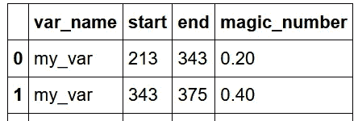
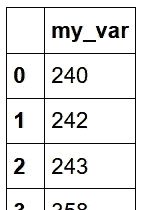
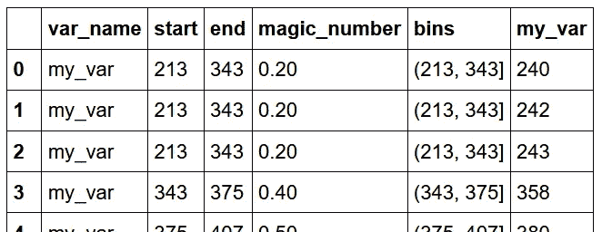

# 数据科学需要重构、教程、案例研究、技巧和诀窍

> 原文：<https://towardsdatascience.com/data-science-needs-refactoring-a-tutorial-case-study-tips-tricks-8fff8f38acbb?source=collection_archive---------60----------------------->

## [实践教程](https://towardsdatascience.com/tagged/hands-on-tutorials)

## 放慢速度会让你更快，方法如下

你也可以很快！确保你重构了…照片由[莎莉·法约米](https://unsplash.com/@sarifayomie?utm_source=medium&utm_medium=referral)在 [Unsplash](https://unsplash.com?utm_source=medium&utm_medium=referral) 上拍摄

## TLDR

> 如果你引入了写得很差的代码，并且没有重构你的工作，不管你是否意识到，你都在无形中减慢你自己的速度，让你的生活更加艰难。重构是有趣的，它让你的代码更快，让你写代码更快，你写的代码更容易维护，一旦你不得不清理干净，它帮助你在第一时间写出更好的代码。
> 
> 技术债务是一种无形的粘合剂，随着你每一次未经检查的提交，你的代码库就会增加更多的技术债务，你的进展最终会停滞不前。每次都是这样，不管你有多努力去逃避。
> 
> 学习重构从学习如何在不改变输出的情况下重写现有代码开始，但是要提高代码的易读性、性能、简单性、可维护性或者以上的任何组合。“一次写得很差，以后再也没碰过代码”和仅仅重构过一次的代码之间的区别，使你的软件在质量和易扩展性上从 a 2 级变成了 a 7 级。每个人(包括几天后你遇到自己以前写的代码时的自己)都会因此而喜欢你。
> 
> 如果你计划花几天时间开发一个软件，重构需要成为你故事的一部分。如果你花了几个小时写了一个脚本，然后就扔掉了，这是一个警告，你可以放心大胆地写代码，自由自在地生活。看看你以前写的一个小脚本，并借鉴其中的一些重构技巧，这可能是一个有趣的练习！
> 
> 让我们开始吧…

# 什么是重构

比我聪明的人已经为我们定义了这一点，请看下面马丁·福勒的至理名言。

> 一种规范的技术，用于重组现有的代码体，改变其内部结构而不改变其外部行为

照片由 [Shifaaz shamoon](https://unsplash.com/@sotti?utm_source=medium&utm_medium=referral) 在 [Unsplash](https://unsplash.com?utm_source=medium&utm_medium=referral) 上拍摄

# 介绍

重构是一个不受欢迎的习惯，它永远会带来回报，我希望有更多的数据科学投资者将它纳入他们的编程习惯组合中。这是任何优秀软件工程师的习惯，但在数据从业者的世界中并不经常出现，我想改变这一点，从这篇博客开始。

**前几周，通过做一些简单的重构(我将在下面带您看一下)，性能提高了 113 倍，将数据管道处理时间从大约 84 小时减少到 45 分钟**。

这并不是说你的代码会变得多快，这仅仅是我的经验，我觉得这是一个值得分享的故事。

这也是用一个小时左右的简单工作完成的。仍有改进的空间，不知道能快多少。重构对你的代码的影响可能是更多数量级的代码改进，或者你可能没有性能问题，只是在阅读你上周写的东西时有一个头疼的问题。**重构通常对两者都有帮助。**

# 限制

我想指出的是，这是一个穷人版的 Raymond Hettingers talk(底部链接)的弗兰肯斯坦博客，一个案例研究，一个教程和我漫无边际的想法。Raymond 的演讲让我对重构和解决问题的体验从一件苦差事变成了一种爱好。我在这一页末尾的“比我聪明得多的人”部分记下了他的讲话。请去观看并在 twitter 上关注他，他是核心 python 开发团队的一部分，他在这个星球上投入了大量的智慧和爱，他需要不惜一切代价得到保护。

我声称速度提高了 113 倍，这与我前几周在工作中为一位同事重写函数的经历有关，当然，这与重构对您的情况有多大帮助没有关系。我也用 python 写所有东西，所以我的风格、行为和建议偏向于 python 和熊猫。

# 球赛

照片由 [CHUTTERSNAP](https://unsplash.com/@chuttersnap?utm_source=medium&utm_medium=referral) 在 [Unsplash](https://unsplash.com?utm_source=medium&utm_medium=referral) 上拍摄

从杰瑞米·霍华德和雷切尔·托马斯以及他们的教学风格中汲取灵感，而不是从基础和建设开始，重要的是首先看到最终结果，这样就有一个明显的结果来努力。在教我怎么踢球之前，先给我看一场 AFL 的比赛。

然后，我们可以分解实现目标的思路、步骤和工作，以及为什么这一过程如此重要。

## 我们案例研究的目标

因此，我们的情况涉及两个数据帧的样本:

*   参考数据集:包含主数据集中某个要素的信息、其条柱和我们关心的特殊值。

一些参考值

*   主数据集:我们需要放入参考箱中的值，并将幻值附加到这些箱中的值。

一些主要价值观

因此，对于主数据集中每个要素的每个观测值，参考数据集中都会有一组条目，其中包含要将这些主数据集值放入其中的条柱以及该条柱的相应特殊值。我们的目标是将每个主数据集条目连接到一个 bin，然后这个 bin 再连接到我们的特殊值，然后让所有这些都可以在主数据集中使用。

请注意，我们只显示了单个变量的解决方案，但是通过将我们的解决方案打包成一个循环等方式，解决 1 个特征会解决 n 个特征。

下面是我们期待的最终结果

最后会是这个样子

既然我们已经有了既定的最终目标，现在让我们看看代码…

## 代码

参见下面的 3 个要点，第一个是设置虚拟数据帧，第二个是花了大约 85 个小时在完整数据集上运行的旧代码，第三个要点是产生相同输出的重构重写。第二个要点用于大约 3000 个特征，几百万行花费了大约 85 个小时。这是我们正在研究的样本的替代品。我们将使用模拟样本，但变化仍然是一样的。我还加入了一些关于我不喜欢的错误的评论，以及为什么我认为重构的代码行更好管理的原因。

我们将针对最简单的情况(一个要素)来解决这个问题，然后可以针对主数据集中存在的尽可能多的要素进行循环/扩展。我发现在解决一个问题时，解决最简单和最小的方向跳跃是有效的，然后慢慢扩展和迭代到你的结果。

设置数据帧代码

上述内容不言自明，您可以看到引用数据帧为 ref_df，主数据帧为 main_df，我们在上面有截图示例。

可怕的老方法

这是我们可怕的原始方法，我前几周研究过。花点时间想想你是否能理解它，或者作者是如何试图实现我们的既定目标的。不要担心它是否令人尴尬或难以理解，它是，它是。我们将从头开始重写这个问题，并讨论如果我们坚持使用当前形式的方法，我们可以就地修改代码的方法。你会注意到我在代码的右边写了 sins 作为注释。

漂亮干净的 10 号内胆！

这是实现相同目标的最后 10 艘班轮。我已经在上面几行的右边加入了一些行为，这些行为是我比较这个要点和旧的代码要点时喜欢的。

另外，如果你想了解这 10 条线背后的想法，可以看看这个 colab 笔记本。见下文，我也把它放在了我的参考资料的末尾。

 [## nglillywhite/blog _ resources/Refactoring _ notebook . ipynb

### 上述要点的运行笔记本

colab.research.google.com](https://colab.research.google.com/github/nglillywhite/blog_resources/blob/main/Refactoring%20Resources-checkpoint.ipynb) 

那么我们如何从第二个要点转向第三个要点呢？！乍一看，这似乎是一个巨大的飞跃，中间没有故事，但我保证魔术中有简单。

乔尔·穆尼斯在 [Unsplash](https://unsplash.com?utm_source=medium&utm_medium=referral) 上拍摄的照片

# 分解问题

所有的程序和问题通常都可以分解成输入、对这些输入的处理和一些输出。在问题解决和重构的开始设置阶段是一个很好的方法，可以让你理清思路，提炼手头的问题。让我们在案例研究中快速完成，因为这将揭示我们在几行代码中采取的步骤。

一旦你把一个问题分解成简单的输入、输出和中间的步骤，你就可以逐步完成每一步并到达你的目的地。试图同时做每件事太难了，而且你也没有足够的心智记录来做这件事(提示:看看雷蒙德的精彩演讲，他谈到了心智记录和你脆弱的人类思维极限)

## 输入

*   参考数据框架
*   主数据框

## 处理

1.  创建箱子|第 1–4 行
2.  将容器添加到参考数据框|第 6–8 行
3.  将箱子添加到主数据框|第 10–12 行
4.  合并 bin 类别上的数据集。第 14 行

## 输出

*   单个数据帧，其参考特殊值与入库的参考值相关联

## 思维模式和行为

这比试图吃掉呈现给我们的原始方法要容易管理得多。有了上面的参考，我可以更清楚地解决我头脑中的问题，而不是试图解释原来的方法和实现。如果你觉得游戏，开始单元测试，并再次提炼你的代码，以进一步改善你重新写的东西。

一遍又一遍地这样做来提炼和提炼你的代码，本质上就是重构。只要你提高了易读性、性能、简单性或易用性，那么你就在正确的道路上。代码被阅读的次数比它被编写的次数多，所以要为读者而不是你这个作者进行优化。要有同理心，因为你可能会在一周内读到它，但你已经忘了你是在第一时间写的。

## 迭代和调整

最好的起点是对代码进行小的但是有方向的改进。这可以带来任何好处，例如易读性、简单性、简洁性、使用库而不是手写过程等。让我们看看下面的一个小例子。查看第 1–5 行和第 7–11 行，它们是来自原始大型方法的相同代码片段的原始版本和重构版本。

1–5 是原始代码| 7–11 是我们的修改版本。发现差异！

我将在下面快速列出这些变化:

*   " out_val =" → "return out_val "
*   " if PD . ISNA(x)= = True:"→" if PD . ISNA(my _ df):"
*   x → my_df
*   改进的注释

这些都很好，原因如下:

1.  向读者发出信号，这是期望的输出&一旦找到所需的值就返回函数，而不是继续计算不需要的代码
2.  如果你能用更少的代码做同样的事情(removing = = True ),那就去做吧！Python 有一种“真”和“假”的行为，这种行为造就了像这样干净的语法。如果对您来说是新的，请阅读[该堆栈溢出](https://stackoverflow.com/questions/39983695/what-is-truthy-and-falsy-how-is-it-different-from-true-and-false)以了解更多信息。
3.  使用更好的变量名，my_df 并不完美，但它至少表明了数据类型。“x”是如此的不明确，我必须找到声明或者调试它，才能知道这个变量是什么数据类型。
4.  写一个注释，意思是如果我不想读代码，我可以不读。我的评论并不完美，但它比之前的评论更好。

所以我知道以上是一点点的区别，但也有一些微妙的改进。像这样的小调整可能感觉不到神奇或强大，但是当你迭代、迭代、迭代同一个片段，并将其浓缩成一些东西时，它通常是非常好的代码！我们还没有达到上面的例子，但我想展示一小部分。

## 拆除策略

这是一个完全重写的例子，其中没有考虑旧的代码，通过分解问题并回归基础，构建了一个全新的解决方案。有时候，如果你正在处理一个你有信心解决的问题，那么拆除现有的东西并重新开始会更快。**要小心，因为这通常不是最好的途径**，通常有人已经对他们写的东西进行了长时间的思考，值得花时间了解在你之前的人和他们的想法。然而，在这种情况下，有太多的花园路径要走，对于一个问题来说太复杂了，当你后退一步，实际上是非常简单的，并会受益于重写。

## 尝试一下，跟着做

去看看 colab 笔记本，看看我是如何完成这个解决方案并产生第二个要点的。如果你想知道如果我没有足够的勇气从头开始写它，并试图在代码质量上做出方向性的改进，我会如何修改原来的方法，请继续阅读。

# 重构技巧和诀窍

参考最初的方法，让我们看看这些小错误，当它们加在一起时，会使代码难以理解、缓慢且难以更改或维护。我还将公布如何解决这些问题。我弹出了一张截图，后面是我发现的一些罪恶。

看到什么了吗？你认为应该改变什么？

1.  编写有用的方法和变量名，它们应该简短、易记且信息丰富。“x”不是一个好的变量名…
2.  **为你的方法写 docstring**，我喜欢[谷歌的 docstring 风格](https://google.github.io/styleguide/pyguide.html#381-docstrings)，它包括参数和清晰的缩进等。文档字符串是大多数 autodoc 工具的动力，如 [Sphinx](https://www.sphinx-doc.org/en/master/) 。“他们也停电了？?"jupyter 笔记本中的魔法命令，当你想偷看一个你想使用的方法时非常有用。第 7 行以后没有 docstring，这个方法如此复杂，当然需要一个。这种方法不包括。
3.  **在适当的范围内使用变量**。如果您发现自己到处都在编写全局变量并引用代码库其他部分的变量。尝试重构和封装您的代码，以便相关的数据片段靠近需要它们的功能。否则，您可能会有杂乱的代码和混杂的变量，您不知道它们是如何在其他地方或被其他函数使用的。该方法不必要地使用了全局变量。

少可以多

1.  **让事情尽可能简单**，如果你不必写一些东西来达到同样的效果，就不要写，除非它增加了上下文或者不清楚的信息。

一次做一件事。

1.  一次做一件事。上面这条线太多了。根据“START”列调用 pd.isnull，然后根据该数据帧的输出提取“my_var ”,然后提取第一行的 iloc。这在一行中太多了，为了可读性，可以分成多行。玩 codegolf 如果你想写复杂的一行程序解决方案，通过写他们喜欢读的简单代码行来让你的同事们省心。

out_val 赋值 3 次，只返回一次。**如果你有你的值，返回你的函数。**

1.  如果可以的话，尽早从一个函数中返回，这样可以通知读者并且更快。如果你已经在一个方法中找到了你的答案，并且不需要做更多的工作，直接返回。您可以在一个方法中编写多个 return 语句，遇到的第一个语句将从该方法/堆栈框架中退出代码执行，并且您不必继续处理已有的答案。这也让读者明白，这些语句是最终的，如果他们在查看特定的代码路径，他们可以停止读取并从该方法返回，但如果变量正在被赋值，他们必须不必要地继续读取代码，以便找到它最终返回的时间。

太多决定了！**停下来想一想你是否写了这么多 if 语句**

1.  **每种方法都应该做一件事，并且把这件事做好。**如果你发现自己编写了一个包含 5 个以上 if else 语句/决策点的方法，你很可能在这个方法中做了不止一件事，你应该将你的问题分解成几个不同的步骤。软件工程师通常称[单一责任原则](https://en.wikipedia.org/wiki/Single-responsibility_principle)或 SRP 在这个场景中被违反。如果您想在一个方法中编排多个目标，请编写完成一件事情的多个函数并一起引用它们。深度嵌套的 if else 语句很难调试和理解。比起一个庞大的方法一次完成所有的事情，你最好写许多可以实现不同目标的方法，这些方法可以综合在一起。当你的方法超过 10-15 行时，开始流汗，重新思考你写的东西，以便更容易阅读。这条规则总有例外，但我敢打赌它是对的，而不是错的。

能不这样就不要这样。令人头痛的燃料

1.  不要把一行代码写得太长，要分成 3 行以上才能读懂。你可能一次又一次地做了太多的事情，你可以把问题分解成步骤，并有清晰明确的步骤。它也非常非常难以阅读和理解，你已经给跟随你的每个人带来了头痛，通常是你自己。你不会真的想让自己头疼吧？当然也有例外，但在大多数情况下，多行代码通常不是好兆头。
2.  **几乎所有你想用数据做的事情都已经被构建到像 pandas 和 spark 这样出色的库中。如果没有必要，不要重写宁滨逻辑，熊猫比你想的要快得多，也聪明得多。上面的代码片段就是这样做的一个尝试，它比让熊猫做要慢几个数量级。维护起来也困难得多。**

兰姆达斯是有目的的，不是这个。

1.  兰姆达斯是善变和分裂的生物。非常有用和聪明，但一旦使用 lambda 锤子，许多程序员开始将所有东西与 map、filter 和 reduce 函数结合起来看，就像是 lambda 钉子。它们被定义为匿名函数，只使用一次，不会被再次引用。如果你发现自己传入指定的函数，并在 pd.apply 函数中做一些有趣的事情，比如 pd.apply，那么你会有惊人的创造力，但是你会让下一个看到你写的东西的人感到头疼。将你的问题简化成步骤，如果某件事需要做多次，创建循环/生成器来迭代。迭代器是很棒的东西，Raymond Hettinger 有很多关于这个主题的资源和讲座。

虽然这个评论在这种情况下是不言自明的，但它是一个很好的开始

1.  最后，**在你的代码中为下一个人写一些有用的注释和参考，这样他们的生活就容易了。**以这段代码为例，我敢肯定它是在几个小时内匆忙写成的，但我花了很多时间写博客，自己对它进行了重构，你正在阅读这篇关于这段代码的博客，阅读这段代码的时间比写这段代码的时间要长得多。花在阅读和理解代码上的时间比花在编写代码上的时间要多得多，确保你为读者进行了优化。你可能会花更长的时间来写，但移情是一个很好的特质，代码是表达这种美德的散文。无论如何，你都会经常感谢自己，所以即使你很自私，这也是对你最有利的。

# 更多博客

我喜欢在这个博客中有什么有趣或无用的反馈和评论，以帮助推动进一步的写作。我正在考虑做一个关于单元测试的小教程，这会让重构变得更加有趣。你有一个测试工具来保护你的屁股，你有可证明的证据，给定相同的输入，你得到相同的输出。您可以编辑和重构自己喜欢的内容，因为您没有引入奇怪的行为。我对这篇文章中可能提出的任何想法都持开放态度，欢迎并鼓励任何评论。

要知道这只是解决问题的一种方式，你可以随意写下你自己对这个问题的解决方案，或者重写你对另一个问题的解决方案。我的解决方案甚至还有重构和缩减的空间。重构永远不会结束，总有办法简化、提炼、改进和精炼你的工作！

# 比我聪明的人&额外的资源

特别感谢科尔荣鼓励我开始写作。我总是感谢他的指导、鼓励、问题和同志情谊。我强烈推荐他的作品，这是很棒的东西，在很大程度上是我开始写博客的灵感。

这里有一个完整的跑步笔记本，如果你想看上面的要点和一些额外的评论，你可以参考:

 [## nglillywhite/blog _ resources/Refactoring _ notebook . ipynb

### 上述要点的运行笔记本

colab.research.google.com](https://colab.research.google.com/github/nglillywhite/blog_resources/blob/main/Refactoring%20Resources-checkpoint.ipynb) 

这是科林，我喜欢和他一起工作，我可能会永远缠着他要知识和陪伴

 [## 郑上校培养基

### 当新冠肺炎在 2020 年初席卷全球时，研究人员凭借他们的建模专业知识蜂拥而至，预测疫情…

col-jung.medium.com](https://col-jung.medium.com/) 

这是 Raymond 的演讲，让我爱上了重构&让我用不同的方式思考解决问题。

这是乔尔，他是一个了不起的作家，他的顶级博客，如关于编码的博客，非常精彩。

 [## 乔尔谈软件

### 有时模拟复杂系统是理解它们的最好方法。阅读更多“HASH:一个免费的在线平台…

www.joelonsoftware.com](https://www.joelonsoftware.com/) 

马丁·福勒是另一位我非常喜欢的伟大作家，他写了大量关于重构的文章

 [## martinfowler.com

### 像大多数人一样，我期待着在后视镜里看到 2020 年，但即使是这个丑陋的一年也带来了一些…

martinfowler.com](https://martinfowler.com/) 

这是他关于重构的页面！

 [## 重构主页

### 当一个软件系统成功时，总是需要不断地增强它，修正问题和添加新的…

refactoring.com](https://refactoring.com/) 

[杰瑞米·霍华德](https://twitter.com/jeremyphoward) & [雷切尔·托马斯](https://twitter.com/math_rachel)是我的两个英雄，雷切尔在 fast.ai 深度学习程序员课程中鼓励每个人创建博客并开始写作，所以我也将这个博客的创建部分归功于她。我想把它们分享给每个人，因为它们很棒。他们制作了《T4》fast . ai 以及其他一些东西，非常棒。对于所有与伦理和实用神经网络相关的东西，去那里尽情享受他们制作的精彩内容。

 [## 主页

### 2020 年 10 月 30 日更新:NumFOCUS 已经向我道歉了。我接受他们的道歉。我不接受他们的断言，即“在…

www.fast.ai](https://www.fast.ai)