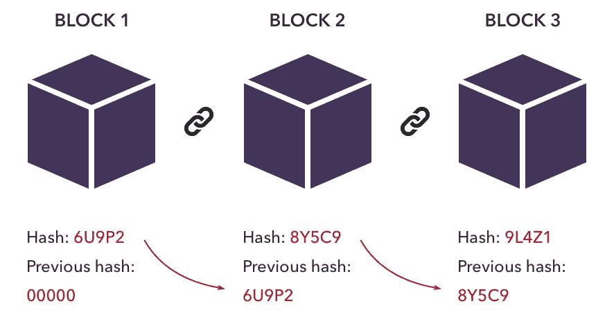
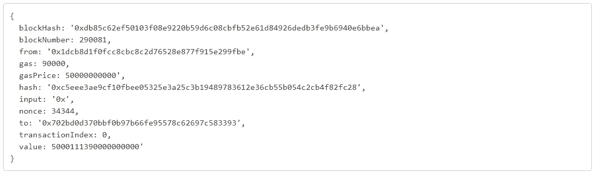
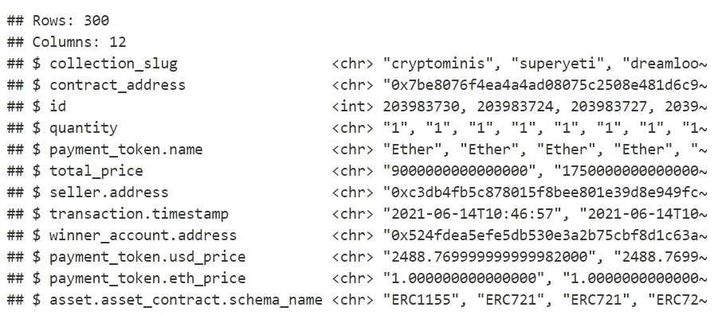
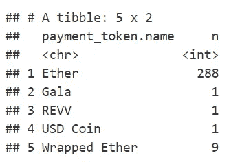
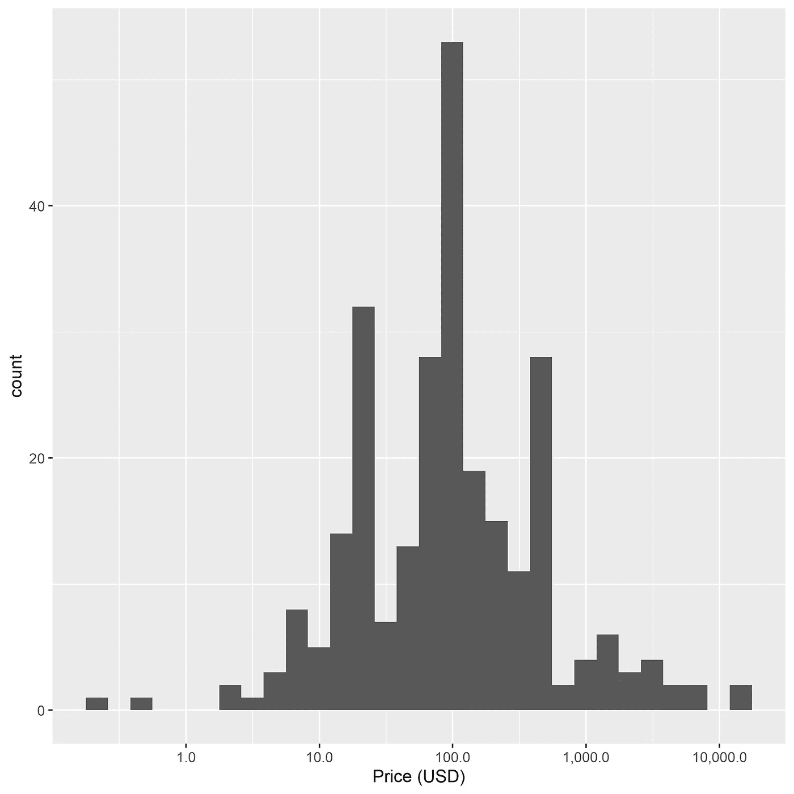
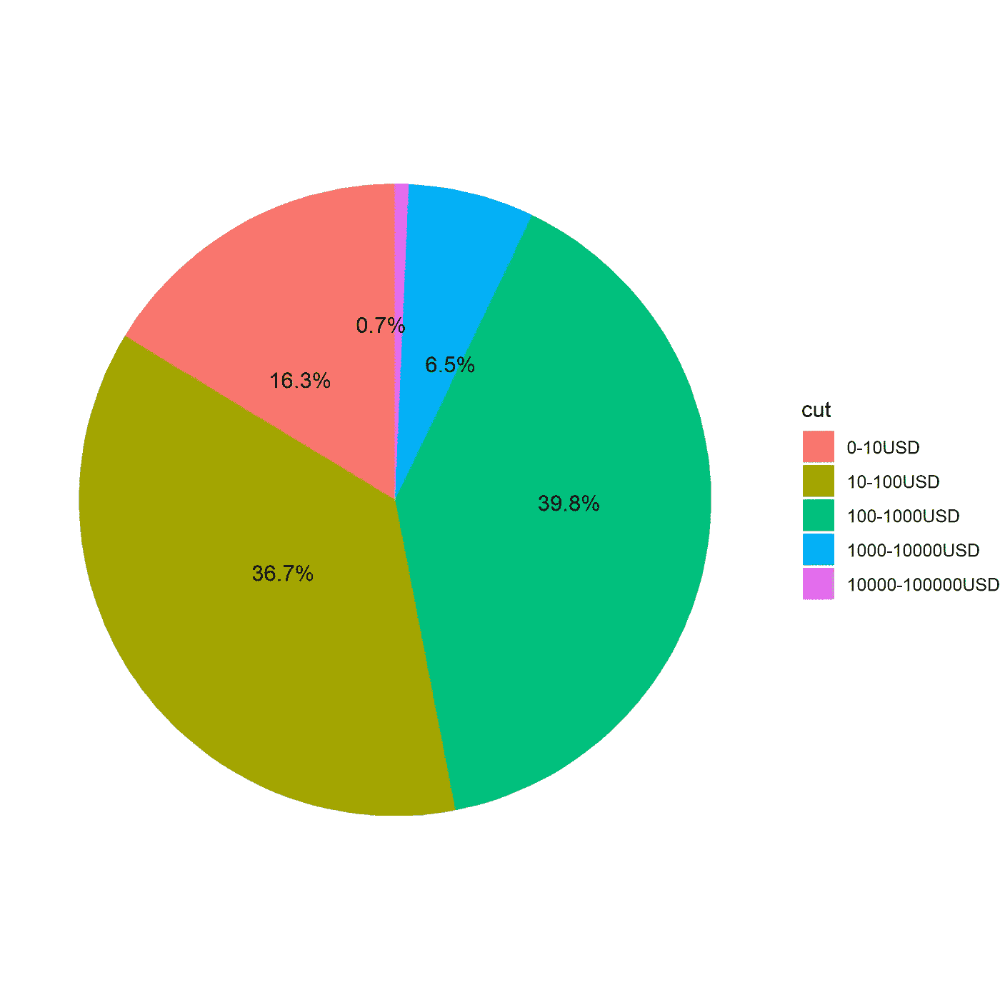
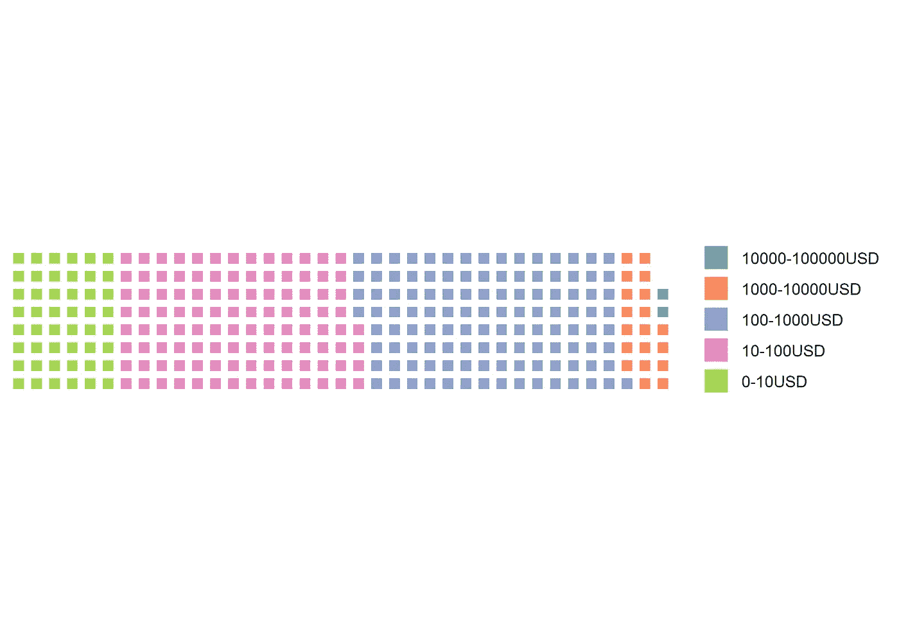
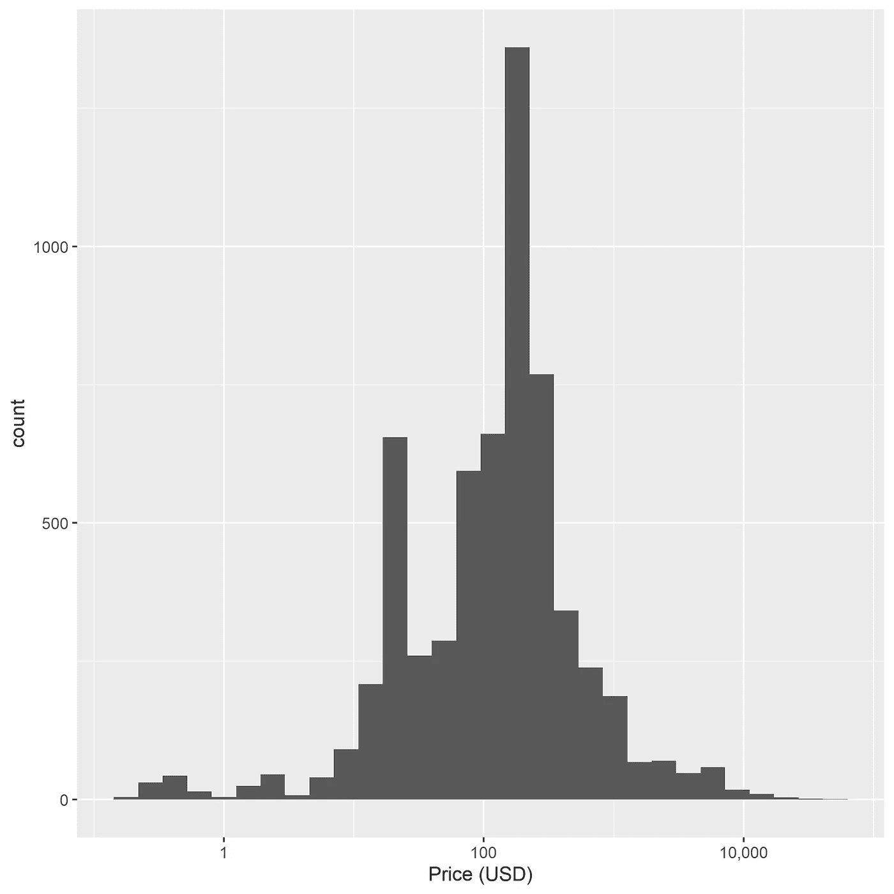
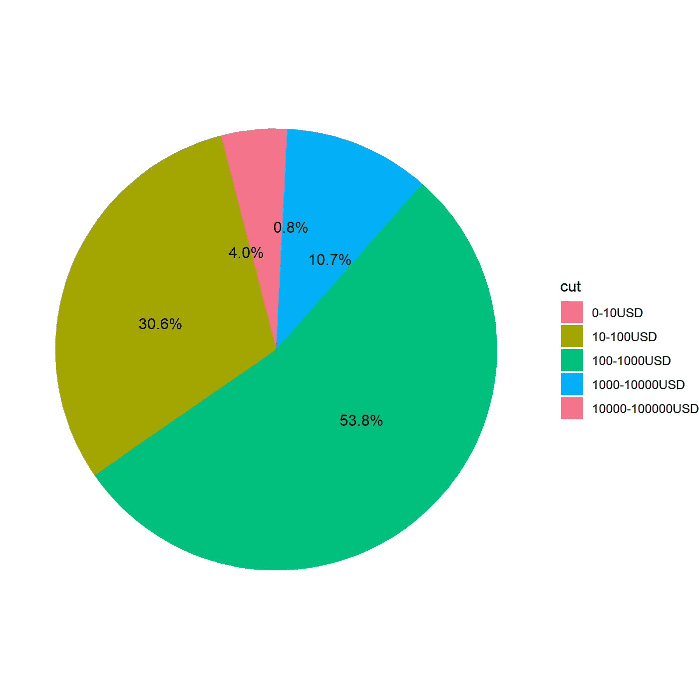
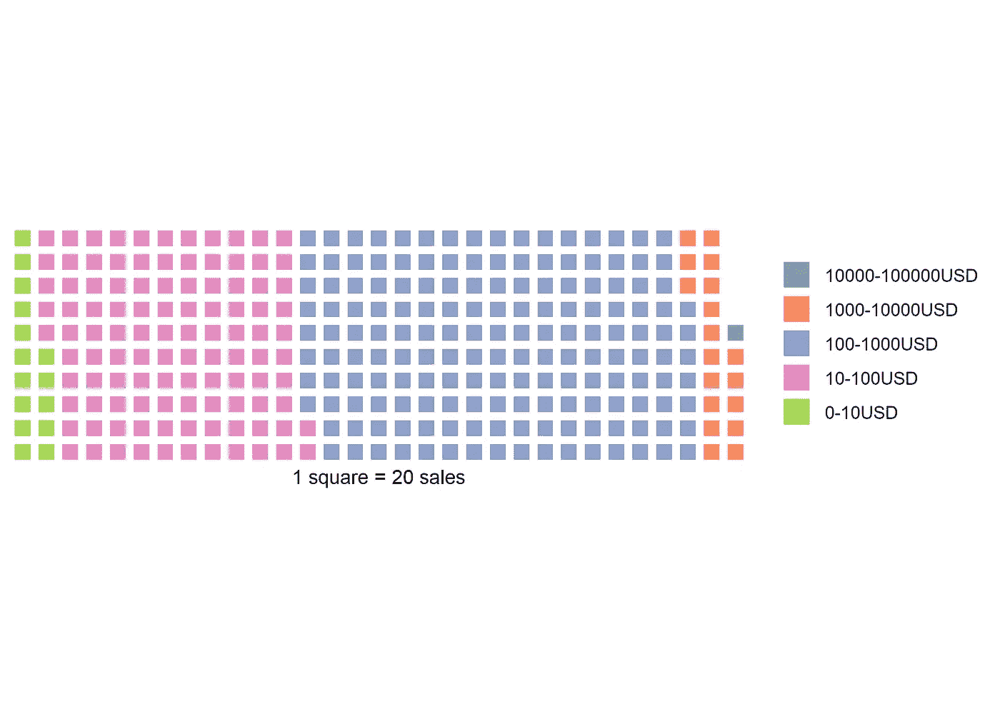

# r .区块链上的数据科学第一部分:阅读区块链

> 原文：<https://towardsdatascience.com/data-science-on-blockchain-with-r-afaf09f7578c?source=collection_archive---------10----------------------->

## 数据科学家进入区块链的窗口。


密码朋克是 NFTs 的最早版本([www.larvalabs.com/cryptopunks](http://www.larvalabs.com/cryptopunks))。图片由 https://commons.wikimedia.org/wiki/File:Cryptopunks.png 的[修改而来。](https://commons.wikimedia.org/wiki/File:Cryptopunks.png)

*Thomas de March in(pharm Alex 统计和数据科学高级经理)和 Milana Filatenkova(pharm Alex 统计和数据科学经理)*

# **简介**

***什么是区块链:*** 区块链是一个不断增长的记录列表，称为块，它们使用加密技术链接在一起。它用于记录交易、跟踪资产以及在参与方之间建立信任。区块链主要以比特币和加密货币应用而闻名，现在几乎用于所有领域，包括供应链、医疗保健、物流、身份管理……数百个区块链存在，它们有自己的规范和应用:比特币、以太坊、Tezos……

***什么是 NFT:***不可替换的令牌用来表示唯一物品的所有权。他们让我们将艺术品、收藏品、甚至房地产等事物符号化。他们一次只能有一个官方所有者，并且他们受到区块链的保护，没有人可以修改所有权记录或复制/粘贴新的 NFT。你可能听说过艺术家皮普尔，他以 6900 万美元的价格卖出了他的一件 NFT 艺术品。

***什么是 R:*** R 语言在统计学家和数据挖掘者中被广泛用于开发数据分析软件。

***为什么在区块链做数据科学:*** 随着区块链技术的蓬勃发展，越来越需要能够阅读、理解和总结这类信息的工具和人员。

***什么是 API:***API 是一种软件中介，允许两个应用程序相互对话。API 旨在帮助开发人员向另一个软件发出请求(即下载信息)，并以预定义的易读格式获得结果，而不必了解该软件的工作原理。

在 R 中已经有几篇关于区块链数据分析的文章，但是大部分集中在价格预测上。获取加密货币价格的数据非常简单，互联网上有许多数据库。但是如何真正读懂区块链呢？在这篇文章中，我们将重点阅读区块链交易。并非所有交易，但特别是与 NFTs 相关的交易。我们将阅读以太坊区块链，可能是用来交易非功能性交易的顶级场所。有几个市场可以作为 NFTs 的交易平台:OpenSea，Rarible……我们将在这里集中讨论 OpenSea，目前 NFT 最大的交易平台。

阅读区块链的原著是可能的，但是很难。首先，您必须设置一个节点并下载区块链的内容(在撰写本文时大约 7TB)。同步可能需要一段时间…其次，数据是按顺序存储的，这需要开发特定的工具来跟踪事务。第三，块的结构特别难读。例如，以太坊网络上的典型交易如下所示。每个块有 200 到 300 个事务，在编写本文时，我们处于块 12586122。



图 1:链中的每个块都包含一些数据和一个“哈希”，即使用加密技术从块中包含的数据生成的数字指纹。每个块还包括来自前一个块的散列。这成为用于创建较新块的散列的数据集的一部分，这就是块被组装成链的方式。图片来自 ig.com。



图 2:事务的结构。

幸运的是，有一些 API 可以方便我们的工作。

```
*# First, let's load a few useful packages*
**library**(tidyverse)
**library**(httr)
**library**(jsonlite)
**library**(scales)
**library**(waffle) #install.packages("waffle", repos = "[https://cinc.rud.is](https://cinc.rud.is)")
**library**(ggrepel)
```

# OpenSea API

OpenSea 提供了一个 API，用于根据一组查询参数获取不可替换的 ERC721 资产。让我们来看看:

```
*# Retrieve sold NFTs* 
resOpenSea <- GET("https://api.opensea.io/api/v1/events",
          query = list(limit=300, *#number of events to retrieve*
                       event_type="successful", *#retrieve only the sales*
                       only_opensea="true")) *#retrieve only sales from the opensea website*

*# Convert the raw unicode (not human friendly) into JSON format* 
*# Don't forget the option flatten=TRUE, otherwise the objects will be a complex list of list of list, impossible to work with*
dataOpenSea <- fromJSON(rawToChar(resOpenSea$content), flatten=TRUE)[[1]] 

*# There are a lot of columns. We have to clean a bit.*
*# Let's start removing the one containing only NA values*
dataOpenSea <- dataOpenSea %>% 
  select_if(~!all(is.na(.)))
```

OpenSea 网站上并没有太多关于这个数据集内容的解释。因此，我选择了几个似乎包含有趣信息的专栏(至少是我能理解的)。

```
*# Let's select a few columns with interesting information*
dataOpenSea <- dataOpenSea %>% select("collection_slug", 
                                      "contract_address", 
                                      "id", "quantity", 
                                      "payment_token.name", 
                                      "total_price", 
                                      "seller.address", 
                                      "transaction.timestamp", 
                                      "winner_account.address", 
                                      "payment_token.usd_price", 
                                      "payment_token.eth_price", 
                                      "asset.asset_contract.schema_name") 
*#"asset.asset_contract.address", "asset.asset_contract.asset_contract_type", "asset.asset_contract.created_date", "asset.asset_contract.name"*

*# Get a glimpse of the data* 
glimpse(dataOpenSea)
```



我的猜测是——这里我们有:

*   **collection_slug:** 项目所属的集合
*   **contract_address:** 所有的销售都由一个合同(一段代码/一个软件)来管理，它将 NFT 发送给中标者。这是公海合同的地址。我们可以看到，所有销售只有一个地址，这意味着所有销售都由同一个合同管理。
*   **id:** 每笔交易的唯一标识符
*   **数量:**每笔交易售出的商品数量(参见下面的可替代/半可替代)。和在超市一样，你可以买 1 个苹果或者 20 个。
*   **payment_token.name:** 用于购买物品的加密货币。
*   **total_price:** 中奖者支付的费用。对乙醚来说，这是用乙醚的最小单位卫来表示的。1 以太= 10 亿魏(10
*   **卖家地址:**卖家的地址
*   **交易.时间戳:**交易的日期
*   **winner_account.address:** 买家地址
*   **payment_token.usd_price:** 用于以美元进行交易的代币价格

让我们来看看货币的分布:

```
dataOpenSea %>% 
  group_by(payment_token.name) %>% 
  summarise(n=n())
```



我们看到大多数销售是在乙醚中进行的(注意，包裹的乙醚可以被认为与乙醚相同)，让我们在文章的其余部分重点关注这些乙醚销售。

```
*# Change the format of some columns to something more adapted than character*
dataOpenSea <- dataOpenSea %>% 
  mutate(quantity=as.numeric(quantity), 
         total_price=as.numeric(total_price), 
         transaction.timestamp=as.Date(transaction.timestamp), 
         payment_token.usd_price=as.numeric(payment_token.usd_price)) 

*# filter on sales in ETH*
dataOpenSea <- dataOpenSea %>% 
  filter(payment_token.name %**in**% c("Ether", "Wrapped Ether"))

*# Convert the price in Ether and then USD. We divide by the quantity as one sale can contain multiple items and then divide by 10^18 to convert the price from Wei to ETH (see above).*
dataOpenSea <- dataOpenSea %>% mutate(priceUSD = total_price / 10^18 * payment_token.usd_price / quantity)

*# Let's visualize this*
*# Histogram of the price distribution (with a log scale as prices are quite spread)*
pHistoOpenSea <- ggplot(dataOpenSea, aes(priceUSD)) + 
  geom_histogram() + 
  labs(x="Price (USD)") + 
  scale_x_log10(labels = comma)
ggsave("figures/histoOpenSea.png", pHistoOpenSea, height=7, width=7)
pHistoOpenSea*# Pie chart* 
dataOpenSea$cut <- cut(dataOpenSea$priceUSD, breaks = c(0, 10, 100, 1000, 10000, 100000, 1000000),
                       labels = c("0-10USD", "10-100USD", "100-1000USD", "1000-10000USD", "10000-100000USD", "100000-1000000USD"), include.lowest = TRUE)

dataPieChartOpenSea <- dataOpenSea %>% 
  group_by(cut) %>% 
  count() %>% 
  ungroup() %>% 
  mutate(percent=`n`/sum(`n`)) %>% 
  arrange(desc(cut)) %>%
  mutate(label=scales::percent(percent))

pPieChartOpenSea <- ggplot(dataPieChartOpenSea, aes(x="", y=percent, fill=cut))+
geom_bar(width = 1, stat = "identity") +
  coord_polar("y", start=0) +
  geom_text_repel(aes(y = cumsum(percent) - percent/2, label=label)) +
  theme_void()
ggsave("figures/pieChartOpenSea.png", pPieChartOpenSea, height=7, width=7)
pPieChartOpenSea*# Waffle chart*
pWaffleOpenSea <- waffle(dataPieChartOpenSea, rows = 8, reverse=TRUE)
ggsave("figures/waffleChartOpenSea.png", pWaffleOpenSea, height=5, width=7)
pWaffleOpenSea
```



图 3:每笔销售价格的直方图。来自 OpenSea API 的数据。



图 4:每笔销售价格的饼图。来自 OpenSea API 的数据。



图 5:每笔销售价格的华夫饼图表。来自 OpenSea API 的数据。

这看起来很好，但有一个很大的缺点… OpenSea API 限制事件的数量为最后 300 个事务。如果我们使用他们的 API，我们对此无能为力。此外，下载的交易是由 OpenSea 预处理的数据，而不是区块链本身。这已经是获得关于事务的信息的良好开端，但是如果我们想要读取块呢？我们之前已经看到，直接从区块链检索数据可能相当复杂。希望有像以太扫描这样的服务，让你以一种简单的方式探索以太坊街区。你猜怎么着？他们还开发了一个 API！

# 以太扫描 API

以太网扫描是一个块浏览器，它允许用户查看提交给以太坊区块链的交易信息，验证合同代码，可视化网络数据…因此我们可以用它来读取任何涉及 NFTs 的交易！EtherScan 在其免费版本中将事务数量限制为 10000，这比 OpenSea API 好得多，如果需要更多，您仍然可以订阅。

我们从哪里开始？我们再来关注一下 OpenSea:从上面提取的数据中，我们看到他们的合同地址是“0 x7be 8076 f 4 ea 4a 4 ad 08075 c 2508 e 481d 6 c 946d 12 b”。如果我们在以太网扫描中输入该地址，并过滤已完成的交易(即通过网络验证的交易，而不是等待批准的交易)，[https://etherscan.io/txs?a = 0 x7be 8076 f 4 ea 4a 4 ad 08075 c 2508 e 481 D6 c 946d 12 b](https://etherscan.io/txs?a=0x7be8076f4ea4a4ad08075c2508e481d6c946d12b)，我们看到了不可思议的数量(撰写本文时为 848，965。)当然也不全是和销售有关的。

让我们看看我们能利用这些数据做些什么。

```
# EtherScan requires a token, have a look at their website
EtherScanAPIToken <- "Your token"*# Retrieve the last 10000 transactions (maximum allowed by Etherscan) from the OpenSea contract*
resEtherScan <- GET("https://api.etherscan.io/api",
          query = list(module="account", 
                       action="txlist", 
                       address="0x7Be8076f4EA4A4AD08075C2508e481d6C946D12b",
                       sort="desc",
                       apikey=EtherScanAPIToken))

*# Convert the raw unicode (not human friendly) into JSON format* 
*# Don't forget the option flatten=TRUE, otherwise the objects will be a complex list of list of list, impossible to work with*
dataEtherScan <- fromJSON(rawToChar(resEtherScan$content), flatten=TRUE)$result

dataEtherScan <- dataEtherScan %>% 
  mutate(value=as.numeric(value), *# Convert price in numeric*
         timeStamp=as.POSIXct(as.numeric(timeStamp), origin="1970-01-01")) *# Convert the timestamp to a date*

*# There are many transactions with a value of 0 ether. Among them, not all are directly linked to sales. We won't go into details here, but there are many other types of actions that can be recorded as transactions (publishing a sale, maintenance of the contract...). Among those that are linked to sales, some involve a token transfer (wrapped ETH for instance) instead of ether directly. To keep things simple, let's keep only transactions involving transfer of some ether.*
dataEtherScan <- dataEtherScan %>% 
  filter(value>0) 

*# Convert ETH price in USD*
*# For this, we first need to obtain the last USD price*
resEtherScanPrice <- GET("https://api.etherscan.io/api",
          query = list(module="stats", 
                       action="ethprice", 
                       apikey=EtherScanAPIToken))
dataEtherScanPrice <- fromJSON(rawToChar(resEtherScanPrice$content), flatten=TRUE)$result$ethusd %>% as.numeric()

dataEtherScan <- dataEtherScan %>%
  mutate(value=value/10^18) %>% *#We divide by 10^18 to convert the price from Wei to ETH (see above).* 
  mutate(priceUSD=value*dataEtherScanPrice) *# convert in USD* 

*# Let's visualize this*
*# Histogram of the price distribution (with a log scale as prices are quite spread)*
pHistoEtherScan <- ggplot(dataEtherScan, aes(priceUSD)) + 
  geom_histogram() + 
  labs(x="Price (USD)") + 
  scale_x_log10(labels = comma)
ggsave("figures/histoEtherScan.png", pHistoEtherScan, height=7, width=7)
pHistoEtherScan*# Pie chart*
dataEtherScan$cut <- cut(dataEtherScan$priceUSD, breaks = c(0, 10, 100, 1000, 10000, 100000, 1000000),
                       labels = c("0-10USD", "10-100USD", "100-1000USD", "1000-10000USD", "10000-100000USD", "100000-1000000USD"), include.lowest = TRUE)

dataPieChartEtherScan <- dataEtherScan %>% 
  group_by(cut) %>% 
  count() %>% 
  ungroup() %>% 
  mutate(percent=`n`/sum(`n`)) %>% 
  arrange(desc(cut)) %>%
  mutate(label=scales::percent(percent))

pPieChartEtherScan <- ggplot(dataPieChartEtherScan, aes(x="", y=percent, fill=cut)) +
geom_bar(width = 1, stat = "identity") + 
  coord_polar("y", start=0) +
  geom_text_repel(aes(y = cumsum(percent) - percent/2, label=label)) +
  theme_void()
ggsave("figures/pieChartEtherScan.png", pPieChartEtherScan, height=7, width=7)
pPieChartEtherScan*# Waffle chart*
dataPieChartEtherScan <- dataPieChartEtherScan %>%
  mutate(n=n/20)
pWaffleEtherScan <- waffle(dataPieChartEtherScan, 
                  rows = 10, 
                  reverse=TRUE,
                  xlab = "1 square = 20 sales") 
ggsave("figures/waffleChartEtherScan.png", pWaffleEtherScan, height=5, width=7)
pWaffleEtherScan
```



图 6:每笔销售价格的直方图。来自以太扫描 API 的数据。



图 7:每笔销售价格的饼状图。来自以太扫描 API 的数据。



图 8:每笔销售价格的华夫饼图表。来自以太扫描 API 的数据。

请注意，从 ETH 到 USD 的价格转换并不完全正确。我们使用当前的 ETH/USD 价格，而一些交易是在一段时间以前完成的。即使在一天之内，价格也会有很大的变化！这可以通过检索历史 ETH/USD 价格轻松解决，但这需要一个 EtherScan Pro 帐户。

# 结论

本文介绍了如何阅读区块链并获得可以分析和可视化的事务数据。这里，我们展示了一个简单分析区块链交易的例子——NFT 销售价格的分布图。这是一个良好的开端，但我们还可以做得更多！在第二部分中，我们将研究如何更进一步。例如，我们可以跟踪特定的非功能性食物，探索它们在释放后被占有的时间以及它们随后被重新获得的比率。请让我知道你可能会对哪些属性感兴趣。

**注意，用于生成本文的代码在我的 Github 上有:**[**https://Github . com/tdemarchin/datascienceonblockschainwithr-PartI**](https://github.com/tdemarchin/DataScienceOnBlockchainWithR-PartI)

**如果你想帮助我订阅一个 EtherScan Pro 帐户，并能够检索更多的交易，请不要犹豫，向我的 ETH 地址捐款:0 xf 5 fc 137 e 7428519969 a52c 710d 64406038319169**

# 参考

[https://docs.opensea.io/reference](https://docs.opensea.io/reference)

[https://www.dataquest.io/blog/r-api-tutorial/](https://www.dataquest.io/blog/r-api-tutorial/)

[https://ethereum.org/en/nft](https://ethereum.org/en/nft)

[https://influencermarketinghub.com/nft-marketplaces](https://influencermarketinghub.com/nft-marketplaces)

[https://www.r-bloggers.com/](https://www.r-bloggers.com/)

[https://etherscan.io/](https://etherscan.io/)

[https://en.wikipedia.org/wiki/Blockchain](https://en.wikipedia.org/wiki/Blockchain)