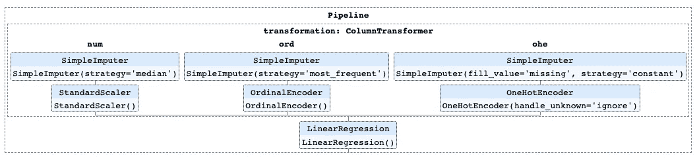

# 数据科学管道:窥视 Scikit-Learn 管道

> 原文：<https://towardsdatascience.com/data-science-plumbing-peeking-into-scikit-learn-pipelines-f9233ad638e?source=collection_archive---------23----------------------->

## [实践教程](https://towardsdatascience.com/tagged/hands-on-tutorials)

## 您是否想过如何从 scikit-learn 管道中提取信息？

照片由[米卡·鲍梅斯特](https://unsplash.com/@mbaumi?utm_source=medium&utm_medium=referral)在 [Unsplash](https://unsplash.com?utm_source=medium&utm_medium=referral) 上拍摄

斯科特·a·亚当斯和[阿莫迪尼·古普塔](https://medium.com/@aamodinigupta)撰写

# 介绍

Scikit-learn 管道是非常有用的工具，可以为数据科学项目提供额外的效率和简单性(如果您不熟悉 scikit-learn 管道，请参见 [Vickery，2019](https://medium.com/vickdata/a-simple-guide-to-scikit-learn-pipelines-4ac0d974bdcf) 获得详细概述)。管道可以在单个对象中组合和构建从数据转换到建模的多个步骤。尽管它们总的来说很有用，但是使用它们需要一个学习过程。特别是，窥视单个流水线步骤并从所述步骤中提取重要的信息片段并不总是最直观的过程。因此，我们写了这篇文章，作为创建一个简单管道并在其中获得几条相关信息的简要指南。

# 获取数据

我们使用[加州住房数据](https://scikit-learn.org/stable/datasets/real_world.html#california-housing-dataset)，这是一个常用的实践数据集，提供了 1990 年加州的街区群体层面的住房市场信息(见 Géron，2017)。对于此工作流程，目标是使用 scikit-learn 管道生成一个线性回归模型，使用 3 个特征预测`median_house_value`的目标:

*   `median_income`——街区组家庭收入中位数(万美元)，
*   `popbin` —区块组的分组人口分为 3 个四分位数(*小，*，*大，*)，
*   `ocean_proximity` —区块群靠近海洋的程度( *< 1H 海洋*、*内陆*、*近洋*、*近湾*、*岛*)。

请注意，以下代码通过随机移除 10%的数据集值引入了人为缺失数据，以展示 scikit-learn 管道的插补实施。如果您运行此代码，请注意，由于缺失数据分配过程中的随机性，分配给缺失数据的实际观测值可能与您的数据不同。我们还将数据分为训练和测试数据，以更好地模拟实际的机器学习工作流程。有关将管道适当应用于训练和测试数据的更多信息，请参见 scikit-learn [入门](https://scikit-learn.org/stable/getting_started.html#)页面。

# 设置管道

准备好数据集后，下一步是应用适当的数据转换，以便数据集可以在机器学习模型中使用。对于本文中使用的示例，我们使用`[ColumnTransformer](https://scikit-learn.org/stable/modules/generated/sklearn.compose.ColumnTransformer.html)`估算器为多种数据类型实现数据转换过程，如插补、编码和缩放。

为了对数据集进行适当的转换，需要为不同的数据类型分别定义`ColumnTransformer`估算器的转换步骤。在下面的示例中，为该数据集中的数值、序号和分类度量建立了不同的数据转换过程(有关数值、序号和分类度量方案的更多信息，请参见[这里的](https://www.dummies.com/education/math/statistics/types-of-statistical-data-numerical-categorical-and-ordinal/))，然后将它们合并到管道中。一旦建立，单独的数字、序数和分类数据转换管道就充当完整管道中`ColumnTransformer`的步骤，其中*完整* *管道*指的是结合数据转换和建模的管道。现在让我们仔细看看数据转换的步骤。

## 数字数据

如果决定估算数值数据中的缺失值(在本例中为`median_income`)，可使用`SimpleImputer`估算缺失数据。在我们的例子中，我们使用中位数作为数值数据的插补值。处理完丢失的值后，是时候调整数值数据了。这里，`[StandardScaler](https://scikit-learn.org/stable/modules/generated/sklearn.preprocessing.StandardScaler.html)`将`median_income`重新调整为平均值为 0，单位方差为。请注意，`StandardScaler`在本例中用作说明，在真实世界的设置中，您可能想要尝试其他的[变换技术](https://scikit-learn.org/stable/modules/preprocessing.html)如`MinMaxScaler`，这取决于您的特征分布。

以下为有序列和分类列建立数据转换步骤的示例遵循与数值转换管道相同的总体结构，即缺失值插补后进行适当的转换。请注意，在所有这些步骤中，我们使用`SimpleImputer`进行说明，但是根据您的数据，您可能会发现[另一种处理缺失数据的技术](https://scikit-learn.org/stable/modules/impute.html)更合适。

## 序数数据

`SimpleImputer`可以用各个列中出现频率最高的值来填充缺失的数据，这对于像`popbin`这样的顺序列很有用。在输入丢失的值之后，我们使用`[OrdinalEncoder](https://scikit-learn.org/stable/modules/generated/sklearn.preprocessing.OrdinalEncoder.html)`对`popbin`列进行顺序编码，这样转换后的列呈现从 0 到 *k-1、*的整数值，其中 *k* 是原始`popbin`列中唯一值的数量。

## 分类数据

[一键编码](https://scikit-learn.org/stable/modules/generated/sklearn.preprocessing.OneHotEncoder.html)为分类列中的每个唯一值创建一个新列。然后，给定的观察值在对应于原始分类列中的观察值的列上被编码为值 1，并且在从原始分类列生成的所有剩余列上被编码为值 0。

我们从下面的`SimpleImputer`开始分类转换过程，用新的字符串值`'missing’`填充`ocean_proximity`上所有缺失的值。输入缺失值后，`OneHotEncoder`会对`ocean_proximity`列进行一次热编码，这也会为新输入的`'missing'`值创建一个单独的列。

## 安装管道

一旦为每种数据类型定义了上述步骤，这三个单独的数据转换管道就被聚合到`transformer_steps`中，然后在`ColumnTransformer`中被声明为`transformers`参数。

我们现在可以创建完整的管道，包括标记为`'transformation’`的`ColumnTransformer`步骤和标记为`'linreg'`的线性回归模型步骤。然后需要在训练集上拟合完整的管道，我们可以将这个拟合的管道分配给一个名为`lm`(用于“线性模型”)的变量。

这条管道里塞满了信息！让我们看看可以提取的一些最重要和最有用的信息。

# 闯入管道

## 查看管道的所有步骤

我们刚刚构建了一个漂亮的管道，但是有没有一种方法可以在不参考建立管道的代码的情况下看到管道的所有步骤呢？还好答案是肯定的！我们所要做的就是将`named_steps`应用到安装好的管道的名称上(将`steps`应用到管道上也将提供必要的输出，只是格式略有不同)。

不幸是，管道输出并不容易阅读。作为替代，我们可以将管道打印成 HTML 文件，并使用以下代码在 web 浏览器中查看。

这是呈现的 HTML 文件的样子。

现在让我们更深入地看看在各种管道步骤中*使用的实际标签和值。*

## 获取数值和序数数据的插补值

挖掘管道的一个原因是提取数值和序数数据的估算值。让我们从数字列开始，其中中值用于替换缺失的数据。`Pipeline`属性`named_steps`输出一个类似于[字典的对象](https://scikit-learn.org/stable/modules/generated/sklearn.utils.Bunch.html#sklearn.utils.Bunch)的键值对，帮助我们解析管道中的步骤，而`ColumnTransformer`属性`named_transformers_`输出一组键值对，帮助我们解析`ColumnTransformer`中的步骤。对于这个例子，用于识别数字列转换的步骤名为`num`。因此，从`num`步骤调用`imputer`会输出用于数字列的插补信息。

要查看用于估算缺失数字数据的实际值，我们可以从`imputer`调用`statistics_`属性。

通过将`named_transformers_['num']`中的`num`替换为`ord`，上述代码也可用于获取用于估算序数列`popbin`中缺失数据的值。

请注意，由于为数据分配缺失值的随机性，插补步骤和一些后续步骤的输出可能会略有不同。

## 获得用于标准化的平均值和方差

如下面的代码所示，为数值列提取标准化步骤中使用的平均值和方差值与前面从数值转换器的数值步骤中提取中值的步骤非常相似。我们只需要将`imputer`替换为`normalize`，将`statistics_`替换为`mean_`或`var_`。

## 提取数字列和序号列的功能名称

`ColumnTransformer`有一个`transformers_`属性，它为每个匹配的转换器返回一个元组，由(1)转换器的标签，(2)转换器本身，以及(3)应用了转换器的列组成。

数字列和序号列的特征名提取的目标是对输出进行切片，以获得数字列和序号列的名称。

*   **数字列**:因为我们将`num`指定为`transformer_steps`的第一个元素，所以`num` transformer 管道是`transformers_` 输出中返回的第一个元组。感兴趣的实际列名是给定转换器的元组中的第三项，因此我们需要输出第一个`transformers_`元组(`[0]`)的第三项(`[2]`，如下所示(记住 Python 是零索引的)。

*   **顺序列**:顺序转换器是`transformers_`输出的第二个元组，这里使用的顺序列名是这个元组中的第三项。

## 提取独热编码列的功能名称

这个有点不同，因为 one-hot 编码用指定变量中每个类别的一组新列替换了原来的分类列。幸运的是，`OneHotEncoder`有一个方法`get_feature_names`，可以用来获得描述性的列名。所以这里的目标是首先在数据转换管道中访问`OneHotEncoder`，然后调用`get_feature_names`。

为了使列名前缀更具描述性，我们可以将原始的一键编码变量的列名作为参数传递给`get_feature_names`。

## 查看回归模型的系数

`LinearRegression`有一个属性`coef_`，存储回归系数(关于线性回归的概述以及如何解释回归系数，请参见[。因此，要查看系数，我们需要从整个管道访问`linreg`步骤，并调用`coef_`属性。](https://levelup.gitconnected.com/an-introduction-to-regression-in-python-with-statsmodels-and-scikit-learn-9f75c748f56e)

同样，请注意，由于为数据分配缺失值的随机性，您的输出可能会略有不同。

# 结论

Scikit-learn 管道是组织和有效执行数据转换和建模任务的好工具。正如我们自己的经验所表明的，有时候从管道的各个步骤中提取特定的信息是有帮助的，这也是我们写这篇文章的动机。例如，我们可能想要创建一个定制的表/特性重要性结果的可视化，需要提取列名(包括单个的独热编码列名)和模型参数。或者，我们可能正在起草一份关于模型的报告，需要包括用于在插补步骤中替换缺失数据的方法或中位数。或者，也许我们只是好奇，想看看流程中特定步骤的结果。在这些场景中，知道如何从管道中的特定步骤中提取相关信息将被证明是有用的。

感谢您花时间阅读这篇文章。你可以在活页夹上的 [Jupyter 笔记本中运行全部代码。如果你觉得这篇文章的内容有用，请留下一些掌声。此外，请随时提出任何建设性的意见。](https://mybinder.org/v2/gh/aamodini/sklearn_pipeline/90fbf1a604a7846433e5d84cb7274814dc91559e)

# 参考

[Géron，A. (2017)。*使用 Scikit-Learn 和 TensorFlow 进行动手机器学习:构建智能系统的概念、工具和技术*。奥莱利媒体。](http://paperpile.com/b/zgcj1Q/hZYC)

Vickery，R. (2019 年 2 月 5 日)。*sci kit-learn 管道的简单指南*。维克数据。[https://medium . com/vick data/a-simple-guide-to-sci kit-learn-pipelines-4 ac0 d 974 bdcf](https://medium.com/vickdata/a-simple-guide-to-scikit-learn-pipelines-4ac0d974bdcf)

*本文提供的内容由作者开发，不一定反映任何其他个人、实体或组织的观点。任何错误和遗漏都是我们自己的。*