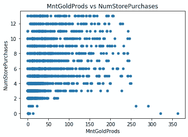

# 数据科学项目—营销分析和数据驱动的解决方案

> 原文：<https://towardsdatascience.com/data-science-project-marketing-analytics-data-driven-solutions-72d050084642?source=collection_archive---------1----------------------->

## 使用 Python 进行 EDA、执行统计分析、可视化洞察，并向公司的首席营销官展示数据驱动的解决方案


作者照片

# 语境

“我是一名数据分析师，首席营销官告诉我，以前的营销活动没有达到预期的效果。我需要分析数据集来理解这个问题，并提出数据驱动的解决方案。”-上下文从[到这里](https://www.kaggle.com/jackdaoud/marketing-data/tasks?taskId=2986)进行了解释和调整。

(澄清:以上内容引自并调整自 [Kaggle 数据集](https://www.kaggle.com/jackdaoud/marketing-data)。我想把这个项目的背景、想法和许多灵感归功于这个 Kaggle 数据集提供商。感谢分享这个令人惊叹的项目创意和与之相关的背景资料！)

# 数据集概述

这个项目的数据集由 Omar Romero-Hernandez 博士提供。它被授权为 CC0: Public Domain，声明“你可以复制、修改、分发和执行该作品，即使是出于商业目的，都无需征得许可”你还可以在这个 [Kaggle 页面](https://www.kaggle.com/jackdaoud/marketing-data)上看到许可状态并下载该数据集。

# **分析过程**

> 1.评估和清理数据
> 
> 2.探索性数据分析
> 
> 3.执行统计分析
> 
> 4.数据可视化和进一步分析
> 
> 5.形成数据驱动的解决方案
> 
> 6.向公司的首席营销官做 8 分钟的陈述

**注意:本文不是要解释每一行代码，而是每个分析步骤中最重要的部分。因此，您可能会发现一些部分只是对结果的描述。如果你对代码本身感兴趣，请在这里勾选**<https://github.com/YuehHanChen/Marketing_Analytics>****。****

# **步骤 1:评估和清理数据**

**我们先来看特征信息:**

*   **ID:客户的唯一标识符**
*   **Year_Birth:客户的出生年份**
*   **教育:客户的教育水平**
*   **婚姻状况:客户的婚姻状况**
*   **收入:客户的家庭年收入**
*   **儿童之家:客户家庭中的儿童数量**
*   **Tennhome:客户家庭中青少年的数量**
*   **Dt_Customer:客户在公司注册的日期**
*   **最近:自客户上次购买后的天数**
*   **MntWines:过去两年在葡萄酒上花费的金额**
*   **水果:过去两年在水果上花费的金额**
*   **MntMeatProducts:过去两年在肉类上花费的金额**
*   **MntFishProducts:过去两年在鱼上花费的金额**
*   **MntSweetProducts:过去两年在糖果上花费的金额**
*   **MntGoldProds:过去两年在黄金上花费的金额**
*   **NumDealsPurchase:打折购买的数量**
*   **NumWebPurchase:通过公司网站购买的次数**
*   **NumCatalogPurchase:使用目录进行购买的次数**
*   **NumStorePurchase:直接在商店购买的数量**
*   **NumWebVisitsMonth:上个月公司网站的访问量**
*   **AcceptedCmp3:如果客户在第三次活动中接受了报价，则为 1，否则为 0**
*   **AcceptedCmp4:如果客户在第四次活动中接受了报价，则为 1，否则为 0**
*   **AcceptedCmp5:如果客户在第五次活动中接受了报价，则为 1，否则为 0**
*   **AcceptedCmp1:如果客户在第一次活动中接受了报价，则为 1，否则为 0**
*   **AcceptedCmp2:如果客户在第一次活动中接受了报价，则为 2，否则为 0**
*   **回答:如果客户在上一次活动中接受了报价，则为 1，否则为 0**
*   **投诉:如果客户在过去 2 年内投诉，则为 1，否则为 0**
*   **国家:客户所在地**

**这个数据集有 28 列，2240 行，0 个重复行。**

****

**作者照片**

****

**作者照片**

**评估数据后，我发现了几个问题:**

> **1.在收入栏名称前面有一个空格**
> 
> **2.有美元符号的是收入栏的数值**
> 
> **3.“收入”列有 23 个缺失值**
> 
> **4.收入的类型是字符串**
> 
> **5.Dt_Customer 的类型是字符串**

**因为数据清理不是这个项目的主要部分，所以让我们进入下一步。(你可以在[这里](https://github.com/YuehHanChen/Marketing_Analytics)找到清理这些问题的代码)**

# **步骤 2:探索性数据分析**

**在这个数据集的 Kaggle 页面中，有一些数据发布者建议遵循的 EDA 方向，我决定选择以下三个问题进行探讨:**

*   **有没有异常值？你将如何处理他们？**
*   **有没有什么有用的变量可以用给定的数据来设计？**
*   **你注意到数据中的任何模式或异常吗？你能画出它们吗？**

**现在我们一个一个来看问题。**

> ****1。有没有异常值？你会如何处理他们？****

**我使用箱线图来可视化所有的数字特征，它将显示数据的 5 个数字:不是异常值的最小数字，Q1(第 25 个百分点)，Q2(第 50 个百分点)，Q3(第 75 个百分点)，以及不是异常值的最大数字。**

****

**作者照片**

**许多列都有异常值，但大多数看起来像是来自总体的自然异常值。相比之下，Year_birth 中的异常值似乎是输入错误，因为 1900 年之前出生的人不可能还活着。因此，我将删除 Year_birth 中的异常值。**

**异常值意味着它们低于或高于平均值的 3 个标准差。**

****

**作者照片**

> ****2。有没有什么有用的变量可以用给定的数据来设计？****

**在评估数据集之后，我列出了我认为对最后的分析有用的新特性。例如，如果我们知道普通人成为客户的平均月份和星期几，那么当我们在那一天或那一个月开展活动时，它可能有助于增加更多的首次客户。**

*   **Join_month:该人成为客户的月份，可以从“Dt_Customer”设计**
*   **Join_weekday:这个人成为客户的那一天，可以从“Dt_Customer”设计**
*   **Minorhome:他们家未成年人总数，可以通过 Kidhome 和 Teenhome 相加获得。**
*   **Total_Mnt:最近两年花费的总金额，可以通过合计所有与“Mnt”相关的列获得**
*   **Total_num_purchase:最近两年采购的总次数，可以通过将所有与“num”相关的列相加得到**
*   **Total_accept:客户在所有营销活动中接受报价的总额，可以通过合计所有与“接受”相关的列和“回应”列来获得**
*   **“AOV”:AOV 代表每个客户的平均订单量，可以通过将总数量除以总购买数量来计算**

****

**作者照片**

> ****3。你注意到数据中的任何模式或异常吗？你能画出它们吗？****

**我们可以使用热图来查看每个变量之间的相关性。当天气变得更蓝时，它们更正相关，当天气变得更红时，它们更负相关。**

****

**作者照片**

****调查结果:****

****图案:** 1。高收入人群倾向于花费更多，购买更多。
—倾向于比其他人更少地访问公司网站。
—倾向于购买少量打折商品**

**2.家里有孩子的人倾向于少花钱，少购物。
—倾向于购买大量打折商品**

**3.平均订单量高的人
——倾向于购买更多的葡萄酒和肉制品
——倾向于使用目录进行大量购买
——倾向于不访问该公司的网站。**

****异常:** 1。凭直觉，我认为顾客的投诉越多，他们在我们商店的消费可能就越少，但过去两年的投诉数量与过去两年的总消费金额几乎没有相关性。= >进一步调查数据后，我发现是因为我们最近两年投诉的客户只有 20 个，但我们总共有 2200 个客户。所以，因为不平衡的比例，它们没有关联。公司的客户服务部在过去的两年里工作出色。**

# ****第三步:进行统计分析****

**在这个数据集的 Kaggle 页面中，有一些数据发布者建议回答的统计分析问题，我决定选择以下三个问题进行探讨:**

*   **哪些因素与店铺购买次数显著相关？**
*   **你的主管坚持认为买黄金的人更保守。因此，在过去 2 年里购买黄金数量高于平均水平的人会有更多的店内购买。使用适当的统计测试证明或反驳这种说法**
*   **鱼含有对大脑有益的欧米伽 3 脂肪酸。因此，“已婚博士候选人”与花在鱼上的钱有显著关系吗？**

**现在我们一个一个来看问题。**

> ****1。哪些因素与店铺购买次数显著相关？****

**我们可以使用随机森林来预测商店购买，然后利用模型的功能重要性分数来对因素进行排序。**

**结果:**

**平均绝对误差:0.78703125
均方误差:1.4546007812500001
均方根误差:1.**

**NumStorePurchases 的范围是 13，均方根误差只有 1.2(不到范围的 10%)，这意味着它是一个可靠的模型。**

**现在，让我们使用 random forest 的功能重要性分数来查看哪些因素对 NumStorePurchase 的影响最大。**

****

**我们现在可以看到前 7 个因素是**

```
1\. Average order volume
2\. Total amount spent in the last two years
3\. Total number of purchases in the last two years
4\. Amount spent on wine in the last 2 years
5\. Number of purchases made using a catalog
6\. Number of visits to company's web site in the last month
7\. Total number of purchases through website in the last two years
```

**但是，我们无法判断每个因素与商店购买次数是正相关还是负相关。我们可以用 SHAP 来解释。**

**有一篇由[塞缪尔·马赞蒂](https://medium.com/@mazzanti.sam?source=post_page-----ab81cc69ef30--------------------------------)写的著名文章解释了什么是 SHAP。请点击查看[。](/shap-explained-the-way-i-wish-someone-explained-it-to-me-ab81cc69ef30)**

****

**作者照片**

**调查结果:**

1.  **商店购买次数随着更高的总消费金额(Total_Mnt)、更高的总购买金额(Total_num_purchase)、更高的 AOV 和更高的葡萄酒购买金额(MntWines)而增加。**
2.  **商店购买次数随着网站访问量(NumWebVisitsMonth)、通过目录购买次数(NumCatalogPurchases)和通过网站购买次数(NumWebPurchases)的增加而减少。**

**总结:**主要在商店购物的人倾向于购买更多的葡萄酒，平均订单量更高，通过互联网或目录购物的人更少。****

> ****2。你的主管坚持认为买黄金的人更保守。因此，在过去两年里，在黄金上花费高于平均水平的人会有更多的商店购买。使用适当的统计测试证明或反驳这种说法。****

**为了从统计上验证这一说法，我们需要使用相关性测试来查看 MntGoldProds 和 NumStorePurchases 是否正相关。首先，让我们看看这两个变量的散点图。**

****

**作者照片**

**正如我们所看到的，有一个非常模糊的趋势，即随着 MntGoldProds 的增加，NumStorePurchases 也会增加。现在，让我们看看相关性测试。**

```
Pearson correlation (r):  0.38326418634704296
Pearson p-value:  3.4668974417790955e-79
```

**我们得到的皮尔逊相关系数为 0.38，p 值几乎为零，这表明**它们在统计上是显著的，并且具有正相关性**。(如果 p 值为> 0.05，我们将无法拒绝零假设，因为它们不相关。)**

> ****3。鱼含有对大脑有益的欧米伽 3 脂肪酸。因此，“已婚博士候选人”与花在鱼上的钱有显著关系吗？****

**为了从统计上验证这些，我首先将数据分为两组。一个是已婚博士群体，其余的。然后，我们可以用一个箱线图来可视化这两组，看看他们是否不同。最后，我们可以使用 t 检验来检验它们的平均值是否相似。**

****

**作者照片**

**该图显示，其余客户在鱼产品上花费更多，因为其第 50 百分位高于已婚博士组。现在，让我们来看看 t 检验。**

```
T-test p-value:  0.005297012242158541
```

**由于 p 值小于 0.05，我得出结论，我们拒绝零假设，这意味着他们的均值是不同的，但已婚博士的均值低于其他人，从图表中可以看出。**

# **步骤 4:数据可视化和进一步分析**

**以下是我将使用数据可视化探索的问题:**

*   **哪个营销活动最成功？**
*   **这家公司的普通客户是什么样的？哪些产品表现最好？**
*   **调查最成功的活动与其他活动在客户特征和购买行为方面的差异。**

**现在我们一个一个来看问题。**

> ****1。哪个营销活动最成功？****

****

**作者照片**

**回应是指最后一次营销活动，也是最成功的一次。除了第二次竞选，它的表现几乎是前两次竞选的两倍。**

> ****2。这家公司的普通客户是什么样的？哪些产品表现最好？****

**使用后。均值()，我发现一个普通客户…**

*   **年收入为 52200 美元**
*   **49 天前购买的**
*   **拥有 26.8 美元的 AOV**
*   **已经花了 605 美元**
*   **已经购买了 20 次**
*   **6 月中旬成为客户**
*   **周四成为顾客**
*   **花在葡萄酒上的钱最多(300 美元)，其次是肉制品(165 美元)**
*   **在水果(26 美元)和甜食(27 美元)上花费最少**

> ****3。调查最成功的活动与其他活动在客户特征和购买行为方面的差异。****

**现在我们已经知道最后一个活动是最成功的，我们可以进一步调查最成功的活动、最后一个活动以及活动 1-5 中其他活动之间的客户特征和购买行为(如下所列)的差异。**

********

**作者照片**

**与前几次活动吸引的客户相比，上一次活动在 AOV、花费总额和购买总量方面吸引了更多有价值的客户。**

**就产品类别而言，上一次活动的顾客在肉制品和葡萄酒上的花费是前一次活动顾客的近两倍。**

**关于购买渠道，上一个活动中的客户通过商店、网站和目录购买的更平均，而前一个活动中的客户主要通过商店和网站购买。**

**上一个活动中的客户比上一个活动中的客户多挣 20%的工资。**

**让我们看看每个国家从以前的运动到最成功的运动的比例变化。**

****

**作者照片**

**西班牙的顾客相对较多(增加了 4%)，而印度吸引到上一次活动中的顾客较少(减少了 3%)。**

# **第 5 步:形成数据驱动的解决方案**

## **让我们回顾一下这个项目的主要目标**

**我是一名数据分析师，首席营销官告诉我，以前的营销活动并不像预期的那样有效。我需要分析数据集来理解这个问题，并提出数据驱动的解决方案。**

**为了形成数据驱动的解决方案，我首先总结了从分析中获得的所有见解，然后利用这些见解形成了可操作的策略。**

****见解总结:****

****1 .上一个战役的表现几乎是前几个战役的两倍****

> **与前几次活动吸引的客户相比，上一次活动在 AOV、花费总额和购买总数方面吸引了更多有价值的客户。**
> 
> **西班牙的顾客相对较多(4%)，印度的顾客较少(3%)**
> 
> **就产品类别而言，上一次活动的顾客在肉制品和葡萄酒上的花费是前一次活动顾客的近两倍。**
> 
> **就购买渠道而言，上一次活动的客户通过商店、网站和目录购买的比例更平均，而前一次活动的客户主要通过商店和网站购买。**
> 
> **上一个活动中的客户比上一个活动中的客户多挣 20%的工资。**

****2 .大多数客户通过实体店购买，在那里人们倾向于每次购买花费更多。原因可能是当顾客在商店里看到其他类似的产品时，他们会更冲动地购买。****

****3。家里有孩子的人是不太有价值的顾客，因为他们……****

> **倾向于减少购买**
> 
> **倾向于购买大量打折商品**

****4。普通顾客……****

> **成为周四的顾客**
> 
> **6 月中旬成为客户**

## **可行的数据驱动解决方案**

****关于收购:****

1.  **继续使用上次活动中相同的营销技巧，但重点是推广肉制品和葡萄酒**
2.  **在西班牙投入更多营销预算，在印度投入更少**
3.  **在周四有一个品牌折扣日，或者在六月有一个品牌折扣月来吸引新顾客**

****关于增加收入:****

1.  **开展营销活动，将主要在网站或目录上购物的客户转化为店内购买者，因为大多数店内购买的平均订单量很高。**
2.  **建立忠诚度计划，让高收入客户尽可能长久地保持忠诚度**

# **第六步:给公司的首席营销官做一个 8 分钟的陈述**

**我在这个视频中也解释了这个数据集的背景和基本信息，所以如果你想看演示，请跳到 2:20。**

**[https://www.youtube.com/watch?v=3Nij8BCQ0ig](https://www.youtube.com/watch?v=3Nij8BCQ0ig)**

**谢谢你看完！如果你对这个项目的完整代码感兴趣，请查看 [my Github](https://github.com/YuehHanChen/Marketing_Analytics) 。另外，我喜欢反馈。如果有任何不清楚的地方或应该做得更好的地方，请联系我。这是我的 [LinkedIn](https://www.linkedin.com/in/yueh-han-chen/) 或者通过我的电子邮件联系我([yuehhanchen@gmail.com](http://yuehhanchen@gmail.com)**