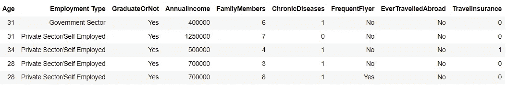

# 数据科学项目，以提高您的业务理解

> 原文：<https://towardsdatascience.com/data-science-project-to-improve-your-business-understanding-776386abbf63?source=collection_archive---------7----------------------->

## 业务是数据科学的核心

[斯科特·格雷厄姆](https://unsplash.com/@homajob?utm_source=medium&utm_medium=referral)在 [Unsplash](https://unsplash.com?utm_source=medium&utm_medium=referral) 上拍照

数据科学项目总是与改进业务流程有关。改善可以是任何方面——增加收入、消除滞后时间、留住客户等。您的数据科学项目总是将改进作为您需要实现的主要 KPI。

问题是，我看到的许多数据科学教育都不足以解决业务理解部分。大多数时候，这是一种事后的想法，学生被引导专注于编程和机器学习部分。这是一个遗憾，因为商业理解技术无疑会帮助学生更容易地获得数据就业。

我不是在谈论理解整个商业领域，因为这需要大量的经验，而且每个组织都是独一无二的。我更关注的是数据科学家的心态，只关注技术部分，不考虑业务。**你可以拥有世界上最好的模型，但如果这个模型没有考虑到商业方面，那它就是无用的。**

业务理解是理解我们的数据科学项目如何影响业务的过程；这意味着我们需要获得尽可能多的信息来构建我们的数据科学项目。在实际业务中，我们总是可以与业务用户讨论，以获得更好的洞察力。我们可以询问的信息示例:

*   什么是业务目标，我们如何衡量这个目标？
*   业务流程是什么样的？
*   数据集位于何处？
*   我们是否需要一个机器学习模型，或者简单的统计学就足够了？
*   使用该模型会引发任何隐私或道德问题吗？

我们还可以问更多的问题。这是转换齿轮对我们的工作至关重要的时候。

因为我希望每个人都有商业思维，所以我想举一个项目实践的例子来提高你的商业理解能力。对业务的理解可能不像编程或统计那样技术性，但你可以为此接受培训。这就是为什么本文中介绍的所有项目都很简单，但是我们会从不同的角度来看待它们。让我们开始吧。

# 旅游保险客户线索

我们要处理的项目是旅游保险客户线索。预测哪些客户有兴趣购买产品是经典的数据科学项目之一，但它仍然受到每个公司的追捧。每个公司都需要他们的客户作为收入来源；这就是为什么预测项目适用于所有公司——反过来，这也是一个学习商业理解的好项目。

对于客户导向项目示例，我将使用来自 [Kaggle](https://www.kaggle.com/tejashvi14/travel-insurance-prediction-data) 的数据集。该数据集旨在**建立一个预测模型，预测哪些客户有兴趣购买旅游保险。**许多人最初会想探索数据并创建分类模型，但在实际业务中，我们会从业务理解部分开始。

旅游保险客户线索

你可能会想，“我不是保险行业的，对这个领域不感兴趣，我怎么可能做业务理解呢？”—没错，要进行深入的商业分析，你可能需要这个行业的经验；然而，这并不意味着我们不能实践和创造性地理解我们不属于的业务。

## 商业假设

通常，我们会与业务用户一起工作，但是我们没有业务用户；我们可以询问我们案例中的业务问题。让我们利用现有的有限信息，尝试根据这些信息做出假设。我们可以从数据集获得的业务上下文是:

1.  该公司是一家提供旅游保险套餐的旅游公司。
2.  新的一揽子保险还包括新冠肺炎保险。
3.  该公司想知道哪些顾客会购买旅游保险套餐。
4.  所用数据来自 2019 年客户历史数据。

商业理念看似简单；用户想要一个机器学习模型来预测客户是否会对旅游保险感兴趣。然而，根据我们掌握的信息，你认为**这个想法有什么问题吗？**我已经发现了一些问题。

例如，我们指的是新客户还是现有客户？旅游保险套餐的什么细节？你会为这份保险卖多少钱？企业会有具体的活动吗？还有很多我能想到的问题。你也可以试着自己去找其他人。

我们可以根据手头的信息进行假设，并做出创造性的猜测来回答前面的问题。假设客户是现有客户，目标客户是收入较高的常旅客。那么，如果企业已经有了这个目标，目标预测会改变吗？绝对的。标记目标定义变得不同，您需要重新定义它。这是现实商业世界中通常会发生的事情。

## 商业理解实践

这里我想强调的是**简单的想法并没有那么简单**。开发机器学习模型很容易，但你总是需要考虑业务方面。这是一个商业理解练习，使用我可以给你的数据集。

1.  **尝试假设业务流程**。如果太难，尝试简单的，如业务市场目标和保险价格。如果你做一些研究，假设整个过程会更好。
2.  **选择具有商业合理性的建模特征**。例如，毕业与否，根据教育水平将某人排除在旅游保险之外可以吗？这只是为了实践，但我们在为机器学习模型选择特征时，会尝试进行逻辑思考。
3.  当选择一个机器学习指标时，**尝试评估它将如何给企业带来好处**。比如准确率 70%，会对销量产生怎样的影响？如果预测下降了 30%,会对销售产生什么影响？多少钱？尝试创建一个模拟来处理这个问题。
4.  你可能想创建一个**仪表板预测或报告分析**来展示你的数据分析能力和机器学习发展。尽量拥有企业可能想知道的所有商业信息。证明你为什么选择这些图或信息。
5.  **解释力 vs 预测力。**你能有一个机器学习模型来解释为什么预测模型创建现有的预测吗？你可能有最好的模型，但是可解释性将帮助你解释业务的结果。
6.  如果你对保险行业感兴趣，从各种来源研究商业问题。它将帮助您创建一个数据科学项目来满足保险业务的需求。如果没有，试着找一个自己感兴趣的行业。

花时间思考业务问题，并在过程中保持创造性。一旦你对业务有了理解，你就可以更容易地继续进行各种项目。展示你在商业理解方面的能力会让你在公司和商业用户的眼中脱颖而出。

就材料而言，这里有一些你可能想要阅读的阅读材料，以及遵循业务流程的项目示例。

<https://github.com/cornelliusyudhawijaya/Cross-Sell-Insurance-Business-Simulation>  </how-to-set-technical-metrics-data-science-project-for-business-7e77084448a4>  </data-scientist-must-know-business-x-statistics-7bb8575a9525>  </learn-the-business-to-become-a-great-data-scientist-635fa6029fb6>  

# **结论**

虽然开发机器学习模型对于数据科学家来说至关重要，但我们必须记住，我们的工作是为业务服务的。因此，发展我们对商业的理解对我们的工作和脱颖而出变得非常重要。

在这篇文章中，我为您概述了一些实践，以提高您的业务理解。

希望有帮助！

在我的 [**LinkedIn**](https://www.linkedin.com/in/cornellius-yudha-wijaya/) 或 [**Twitter**](https://twitter.com/CornelliusYW) 上访问我。

> *如果您喜欢我的内容，并希望获得更多关于数据或数据科学家日常生活的深入知识，请考虑在此订阅我的* ***简讯。***

> *如果您没有订阅为中等会员，请考虑通过* [*我的推荐*](https://cornelliusyudhawijaya.medium.com/membership) *订阅。*