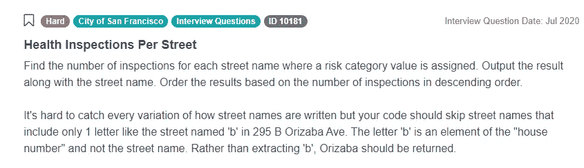
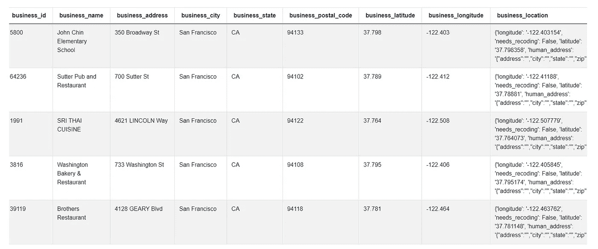
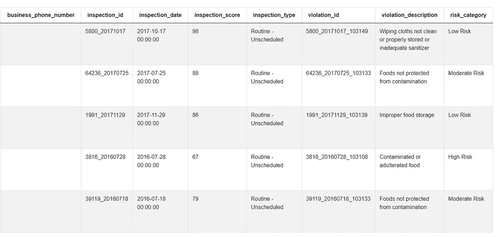

# 数据科学 Python 面试问题演练

> 原文：<https://towardsdatascience.com/data-science-python-interview-question-walkthrough-5a679c6351ef?source=collection_archive---------19----------------------->

## [办公时间](https://towardsdatascience.com/tagged/office-hours)

## *在本文中，我们展示了如何处理和解决旧金山市的一次采访中提出的一个具有挑战性的数据科学问题。如果您想在从地址字符串中提取信息方面做得更好，您会发现这很有用。*


图片来自 [Canva](https://canva.com/)

根据各种消息来源，旧金山市和县雇用了 3.5 万至 4.5 万人。这些职位分布在许多部门，如金融、卫生、交通、执法、博物馆甚至旧金山国际机场。这包括受雇于技术部或在其他部门担任辅助角色的数据科学家。

一般来说，[要成为旧金山市的一名数据科学家](https://www.stratascratch.com/blog/how-to-become-a-data-scientist-from-scratch/?utm_source=blog&utm_medium=click&utm_campaign=medium)，需要具备使用 SQL、Python 库(例如 NumPy 和 pandas)和大数据工具(例如 Hadoop MapReduce 和 Spark)进行数据挖掘、数据处理和探索性数据分析的经验。尤其是在 Python 中编程和开发算法的知识是一个主要要求。数据科学家的工作包括假设检验、回归、分类、聚类、时间序列分析、自然语言处理、特征工程和预测建模。

# 面试问题中测试的技术概念

在本文中，我们讨论并解决了[数据科学面试问题](https://www.stratascratch.com/blog/data-science-interview-guide-questions-from-80-different-companies/?utm_source=blog&utm_medium=click&utm_campaign=medium)中的一个问题，该问题需要对地址进行字符串操作和信息提取。这个例子代表了旧金山市数据科学问题的很大一部分，因为在许多情况下，候选人被要求从与城市治理相关的数据中提取信息或总结数据，如商业注册、人口普查数据、统计数据、工资单等。

在许多这样的问题中，任务包括从文本中提取信息，比如从名称中提取企业类型，从地址中提取邮政编码或街道名称，或者从职位名称中提取部门。像这样的作业需要操作字符串、构造条件语句和将方法应用于大型数据集的知识。此外，他们测试不特定于任何特定编程语言的技能，例如，识别和解决边缘情况。

# 数据科学面试问题:每条街道的健康检查

这个问题曾被问及到旧金山市参加求职面试的人，题目是“每条街的健康检查”。这是一个很难回答的问题，因为处理地址时处理所有的边缘情况总是很棘手。

问题链接:[https://platform . stratascratch . com/coding/10181-health-inspections-per-street？python=1](https://platform.stratascratch.com/coding/10181-health-inspections-per-street?python=1&utm_source=blog&utm_medium=click&utm_campaign=medium)



截图来自 [StrataScratch](https://www.stratascratch.com/?utm_source=blog&utm_medium=click&utm_campaign=medium)

我们被要求查找分配了风险类别值的每个街道名称的检查次数。我们将看到数据，并马上找出风险类别值。它还说我们应该输出结果和街道名称，并根据检查的数量按降序排列结果。

这已经告诉我们，我们需要从一个地址中提取一个街道名称，第二段给了我们如何做的进一步说明。它正确地意识到很难抓住街道名称的每一种写法。这里有一个例子:您的代码应该跳过只包含一个字母的街道名称，如 295 B Orizaba Ave 中名为“B”的街道。字母“B”是“门牌号”的一个元素，而不是街道名称。应该返回 Orizaba，而不是提取 b。

这个问题警告我们的是，不要简单地假设我们可以找到地址字符串中的第一个空格，并假设空格之前的所有内容都是门牌号，之后的所有内容都是街道名称。有一些边缘案例，比如门牌号为 295B 的案例，我们需要在解决方案中加以考虑。

# 解决问题的框架

在我们开始设计解决方案之前，让我与您分享解决任何数据科学问题的三步通用框架。考虑到压力，这对于解决面试任务特别有用，有一个系统的方法来处理任何问题是救命的，但它在一般情况下也很有用，例如在你的[数据科学职业生涯](https://www.stratascratch.com/blog/data-scientist-career-path-from-novice-to-first-job/?utm_source=blog&utm_medium=click&utm_campaign=medium)中。

1.  理解您的数据:
    ***a*** )列出您对数据列的假设，这样您就知道使用哪些列了
    ***b*** )如果您仍然对自己的数据不够了解，请查看数据的前几行(单个或多个表)。或者，如果在面试中，询问一些示例值，以便理解实际数据，而不仅仅是列。它将帮助您识别边缘情况，并将您的解决方案限制在您的假设范围内。
2.  制定你的方法:
    ***a*** )写下你要编程/编码的逻辑步骤。
    ***b*** )确定你将使用/实现来执行逻辑的主要功能。
    ***c*** )面试官会看着你；他们会在需要时介入，确保你要求他们澄清任何模糊之处，他们还会指定你是否可以使用现成的函数，或者你是否应该从头开始写代码。
3.  代码执行:
    ***a*** )构建你的代码，不要过于简单，也不要过于复杂。
    ***b*** )根据与面试官概述的步骤，分步骤构建。这意味着代码可能效率不高，但没关系。你可以在最后和面试官谈优化。
    ***c*** )最重要的一点是，不要在每个代码块中使用多个逻辑语句和规则，使代码过于复杂。代码块可以定义为 CTE 或子查询，因为它是自包含的，并且与代码的其余部分相分离。
    ***d*** )在你写代码的时候大声说出来，因为面试官会评估你解决问题的能力。

# 了解您的数据

让我们先来看看我们现有的解决这个问题的数据。通常，在面试中我们不会得到任何实际记录，相反，我们会看到有哪些表格或数据框，以及这些表格中的列和数据类型。

在这个问题中，我们可以看到我们只有一个数据框，“SF _ restaurant _ health _ violations”，但它有很多列。似乎这个数据集中的每一行都对应一次违规。最后 3 列描述了每个违规。它是在某次检查中识别的，其中检查有一些 ID、日期、分数和类型。最后，通过前 10 列确定的特定业务来识别每个违规。因为我们只是对数据做了一些假设，所以与面试官分享所有这些并与他们确认你的假设是否正确总是一个好主意。



截图来自 [StrataScratch](https://www.stratascratch.com/?utm_source=blog&utm_medium=click&utm_campaign=medium)



截图来自 [StrataScratch](https://www.stratascratch.com/?utm_source=blog&utm_medium=click&utm_campaign=medium)

幸运的是，我们实际上不需要担心所有这些列来解决问题。这是一个很好的实践，回到问题上来，想想哪些列可能是有用的。我们需要找到检验的数量，因此我们需要计算‘inspection _ id’列的数量。“风险类别值的分配位置”表明我们需要使用“风险类别”列过滤数据。最后，“输出结果和街道名称。”告诉我们将注意力集中在应该包含街道名称的“business_address”列上。

# 制定你的方法

熟悉这些数据后，重要的是要想出几个通用步骤，我们在设计这个面试问题的解决方案时会遵循这些步骤。在我们的例子中，我们可以遵循以下步骤:

1.  编写一个从“business_address”列的字符串中提取街道名称的方法。我们需要假设地址以街道名称开头，在这种情况下，我们需要从字符串中提取第一个单词，或者以一个数字开头，后跟一个字母，在这种情况下，我们应该提取字符串的第二个或第三个单词。
2.  有了这个方法，我们可以用它向数据集添加一个新列——街道名称
3.  在第三步中，我们将过滤数据，只留下分配了风险类别的这些行，换句话说，只留下“risk_category”列不为空的记录
4.  接下来，我们可以使街道名称的格式一致，让它们在所有情况下都以小写字母开头。这一步确保每个街道名称在最终输出中只出现一次。
5.  最后一步是按照面试问题中的指示准备最终输出:
    ***a*** )我们将只有两列:街道名称和检查次数。因此，我们需要按照街道名称对结果进行分组，这样我们就可以计算每个街道名称在数据集中出现的次数。
    ***b***

# 代码执行

制定了方法之后，我们现在可以实际编写将产生预期输出的代码了。我们将使用 Python [编程语言](https://www.stratascratch.com/blog/top-5-data-science-programming-languages/?utm_source=blog&utm_medium=click&utm_campaign=medium)，因此我们可以假设数据存储为名为“SF _ restaurant _ health _ violations”的熊猫数据帧。Pandas 是用于查询和操作数据集的流行 Python 库。我们可以从导入开始，以便以后使用。

```
 import pandas as pd
```

现在让我们遵循我们之前制定的方法。第一步是从地址中提取街道名称的方法，所以我们可以从编写这个方法开始。现在，我们不关心数据集或任何特定的地址，我们将只编写一个 Python 函数，给定某个地址 x，它将返回街道名称。我们可以从键入以下内容开始:

```
 def street(x):
```

我们希望从 x 中提取街道名称，其中 x 是包含地址的字符串。我们可以从检查字符串第一部分的第一个字符是数字还是字母开始。如果第一部分以字母开头，我们可以假设它是一个街道名称，并返回第一个单词。我们可以使用 split()函数，当它应用于一个字符串时，会根据我们可以选择的分隔符将字符串分成几部分。

```
 if str(x.split(' ')[0][0]).isdigit() == True:
           # first part is a number
     else:
           return x.split(' ')[0]
```

让我们检查一下这段代码。我们使用 x.split(' ')将我们的地址字符串分成几个部分，用空格键作为分隔符。例如，如果 x 是' 295 B Orizaba Ave '，那么使用 x.split(')会将它转换为一个列表，其中第一个元素是 295，第二个是 B，第三个是 Orizaba，第四个是 Ave。我们现在只对字符串的第一部分感兴趣，所以我们编写了 x . split(')[0]，它对应于列表中的第一个元素，即第一个空格键之前的字符串中的所有内容。请记住，在 Python 中，第一个元素的索引是 0。在我们的例子中，它只是一个数字 295。然而，我们不仅对第一部分感兴趣，而且特别对第一部分的第一个字符感兴趣，这就是为什么我们添加另一个[0]来实现 x . split(')[0][0]。我们现在可以使用一个函数。isdigit()，当应用于一个字符时，如果该字符是数字，则返回布尔值 True，否则返回值 False。然而，我们需要小心，因为。isdigit()只能应用于字符数据类型。但是如果我们的第一个字符确实是一个数字，我们就要冒 Python 会自动将其转换成数字数据类型的风险，例如 integer。在这种情况下。isdigit()会导致错误，因为它不能应用于整数。为了避免这种情况，我们可以通过将字符转换为字符串来确保字符被视为字符串而不是数字。这就是为什么我们有 str()函数。

所以这段代码 str(x . split(')[0][0])。如果字符串的第一个字符是数字，isdigit()返回 True，如果是字母，则返回 False。如果是后者，那么当地址中的第一个字符是一个字母时，我们可以假设第一个单词确实是一个街道名称，并使用 return x . split(')[0]返回它—这样我们就输出了地址字符串中第一个空格键之前的所有内容。

在另一种情况下，当第一个字符是一个数字时，我们知道地址的第一部分是门牌号，而不是街道名称。我们将忽略它并返回第二个或第三个单词。哪一个？这取决于第二个单词是只有一个字母还是更多。如果它比一个字母长，那么我们可以假设它是一个街道名称，并返回第二个单词。否则，如果它只有一个字母，那么它就是数字的一部分，我们需要返回第三个单词。

```
 if len(x.split(' ')[1]) > 1:
             return x.split(' ')[1]
     else:
             return x.split(' ')[2]
```

在这段代码中，我们使用 len()函数返回对象的长度，在本例中是字符串中的字符数。我们也只将它应用于地址字符串的第二部分(在 Python 中索引为 1)，所以我们计算第一个和第二个空格键之间的字符数。如果长度大于 1，那么我们可以返回第二个单词作为街道名。否则，我们返回第三个单词，也就是索引为 2 的那个。现在，从地址字符串 x 中提取街道名称的整个函数如下所示:

```
 def street(x):
           if str(x.split(' ')[0][0]).isdigit() == True:
                if len(x.split(' ')[1]) > 1:
                    return x.split(' ')[1]
                else:
                    return x.split(' ')[2]
           else:
                return x.split(' ')[0]
```

我们可以通过几个例子来验证这个函数是否有效。如果地址是' 295 B Orizaba Ave '，那么第一个 If 语句返回 true，因为第一个字符是一个数字，第二个 if 语句返回 false，因为 B 不超过 1 个字符，所以我们返回第三部分，Orizaba，它确实是街道名称。如果地址是' 700 Sutter St '，那么第一个 If 语句再次返回 true，因为第一个字符是一个数字。但是现在第二个 if 语句也返回 true，因为 Sutter 不止一个字母，所以我们返回 Sutter 作为街道名。最后，如果我们只输入“百老汇街”作为地址，那么第一个 if 语句返回 false，因为第一个字符不是数字，所以我们立即返回第一个单词，在本例中是“百老汇”。

现在，我们可以将刚刚编写的方法应用到数据框中:

```
 sf_restaurant_health_violations['street_name'] = sf_restaurant_health_violations['business_address'].apply(street)
```

此代码将创建一个新列“street_name ”,这样，在对“street”列应用 street()方法后，该列的内容将等于“business_address”列的内容。我们用熊猫来实现它。对“business_address”列应用()函数，并使用我们的函数名，因此将“street”作为参数。

我们已经介绍了方法的前两步。我们有从地址中提取街道名称的方法，并且我们已经将列添加到数据框中，其中包含从地址中提取的街道名称。它是“街道名称”列。下一步是过滤数据，只留下分配了风险类别的行。我们可以用下面一行代码来实现:

```
 assigned_risk = sf_restaurant_health_violations[]
```

这将创建一个新的数据框“assigned_risk ”,该数据框将根据条件仅包含原始数据框中的一些值。我们现在将在方括号内添加条件。条件是风险类别需要赋值，换句话说‘risk _ category’一栏不能说‘null’。幸运的是，有一个 Pandas 函数 notnull()可以做到这一点。因此，条件将如下所示:

SF _ restaurant _ health _ violations[' risk _ category ']。notnull()

数据框“SF _ restaurant _ health _ violations”中的“risk_category”列不能为“null”。然后，我们可以将这个条件添加到前面的代码中:

```
 assigned_risk = sf_restaurant_health_violations[sf_restaurant_health_
violations['risk_category'].notnull()]
```

这种重复“SF _ restaurant _ health _ violations”名称的结构乍一看可能很奇怪，但这是一种完全正常的过滤熊猫的方式。

过滤结果后，下一步是确保格式的一致性。特别是，我们希望确保所有街道名称都以小写字母开头。为此，我们需要更新我们最近创建的列“street_name”。

```
 assigned_risk['street_name] = assigned_risk['street_name'].str.lower()
```

基本上，lower()函数可以应用于一个字符串，并强制第一个字母小写。我们需要使用这个构造. str.lower()来指定我们想要将 lower()专门应用于“street”列中的字符串。

我们快到了。最后一步是[根据面试问题中的说明准备](https://www.stratascratch.com/blog/5-tips-to-prepare-for-a-data-science-interview/?utm_source=blog&utm_medium=click&utm_campaign=medium)输出。我们需要按街道名称对结果进行分组，计算每个街道名称出现的次数，然后按降序对结果进行排序。令人惊讶的是，使用熊猫，我们只用一行代码就可以完成所有的工作。让我们从创建一个新变量“结果”开始，现在，让我们将它设置为等于我们的过滤数据框“assigned_risk”。

```
 result = assigned_risk
```

要按街道名称对结果进行分组，我们可以使用 Pandas groupby()函数。我们需要指定它应该根据哪一列对结果进行分组，在我们的例子中，我们将说“street_name”。然后，我们需要告诉它以什么方式对结果进行分组。我们希望计算每个街道名称出现的行数，这可以使用 Pandas groupby()来实现。size()函数。

```
 result = assigned_risk.groupby(['street_name']).size()
```

上面的代码将成功地对结果进行分组，但是它将只返回每个街道名称出现的次数——只有一列数字，没有街道名称。此外,“result”已经变成了一个系列 Dataframe 中的另一种数据类型，它只允许存储一列数据。我们想把它转换回熊猫数据帧，并显示街道的名称。我们可以首先使用 Pandas 函数 to_frame()将一个系列转换成一个数据帧。顺便说一下，我们可以在这里为包含违规数量的列指定一个名称，比如说“number _ of _ risky _ restaurants”——这看起来比没有名称的列要好。然后，我们还将使用一个函数 reset_index()。在此之前，Pandas 将街道名称视为索引，不会在数据框中将它们显示为单独的列。使用此函数将变回数字索引，并将街道名称显示为一列。

```
 result = assigned_risk.groupby(['street_name']).size().to_frame
('number_of_risky_restaurants').reset_index()
```

最后，我们要对结果进行排序。面试问题说根据检查次数降序排列结果。此外，我们可以添加一个二级排序规则，这样当几条街道具有相同数量的检查时，它们将按字母顺序排序。我们可以通过使用函数 sort_values()来实现这个结果。

```
 result = assigned_risk.groupby(['street_name']).size().to_frame
('number_of_risky_restaurants').reset_index().sort_values
(['number_of_risky_restaurants', 'street_name'])
```

然而，这个输出有一个问题。默认情况下，函数 sort_values()按升序对所有内容进行排序。这意味着它将数字从最小到最大排序，并将文本按字母顺序排序。我们需要它有点不同，这个问题特别要求按降序或从最大到最小排列数字。但是对于基于街道名称的二级排序，我们仍然需要字母顺序。要对此进行编码，我们只需向 sort_values()函数添加一个布尔参数‘ascending ’,并为主要规则将其设置为 False，为次要规则将其设置为 True。

```
 result = assigned_risk.groupby(['street_name']).size().to_frame
('number_of_risky_restaurants').reset_index().sort_values
(['number_of_risky_restaurants', 'street_name'], ascending=[False, True])
```

这非常长的单行代码足以产生所需的输出。下面是解决这个 Python 数据科学面试问题的完整代码:

```
import pandas as pd

def street(x):
    if str(x.split(' ')[0][0]).isdigit() == True:
        if len(x.split(' ')[1]) > 1:
            return x.split(' ')[1]
        else:
            return x.split(' ')[2]
    else:
        return x.split(' ')[0]

sf_restaurant_health_violations['street_name'] = sf_restaurant_health_violations['business_address'].apply(street)

assigned_risk = sf_restaurant_health_violations[sf_restaurant_health_violations['risk_category'].notnull()]
assigned_risk['street_name'] = assigned_risk['street_name'].str.lower()
result = assigned_risk.groupby(['street_name']).size().to_frame
('number_of_risky_restaurants').reset_index().sort_values
(['number_of_risky_restaurants', 'street_name'], ascending=[False, True])
```

*此外，查看我们之前在* [*上发布的关于数据科学家职位*](https://www.stratascratch.com/blog/python-interview-questions-for-data-scientist-position/?utm_source=blog&utm_medium=click&utm_campaign=medium) *的 Python 面试问题，找到针对初学者或寻求更具挑战性任务的人的问题。*

# 结论

就是这样，我们已经成功地写出了来自旧金山市的“每条街道的健康检查”这一面试问题的解决方案。Python 编程语言的使用让我们只用几行代码就能编写出整个解决方案，但最困难的部分可能是提出通用方法。特别是，考虑地址字符串的所有可能变化是至关重要的。当从字符串中提取信息时，尤其是从地址中提取信息时，经常会出现这种情况，我们首先需要仔细检查数据，并尝试捕捉尽可能多的边缘情况，然后还要找出如何在代码中涵盖所有这些情况。

但是，请记住，在采访中，我们通常不会得到准确的数据，只有列名、数据类型和一些例子，就像本例一样。这就是为什么，为了解决这个问题，我们需要依靠一些假设，虽然假设事情是完全可以的，但绝对重要的是要与面试官沟通清楚，让他们知道你何时做出任何假设。在编写代码时，与面试官沟通也是一个关键，这是一个很好的实践，在你编写代码时解释这些步骤，并谈论你正在使用的最重要的功能——这样你不仅向面试官展示你可以解决这个任务，而且更重要的是，你总体上掌握了编程语言。

最后，不要忘记坚持解决任何数据科学问题的框架，这将使你的面试和生活变得更加容易。同样，您从检查和理解数据开始，然后制定您的方法——解决问题所需的几个一般步骤。最后，基于这两点，你可以一步一步地编写你的代码。

*最初发表于*[*https://www.stratascratch.com*](https://www.stratascratch.com/blog/data-science-python-interview-question-walkthrough/?utm_source=blog&utm_medium=click&utm_campaign=medium)*。*