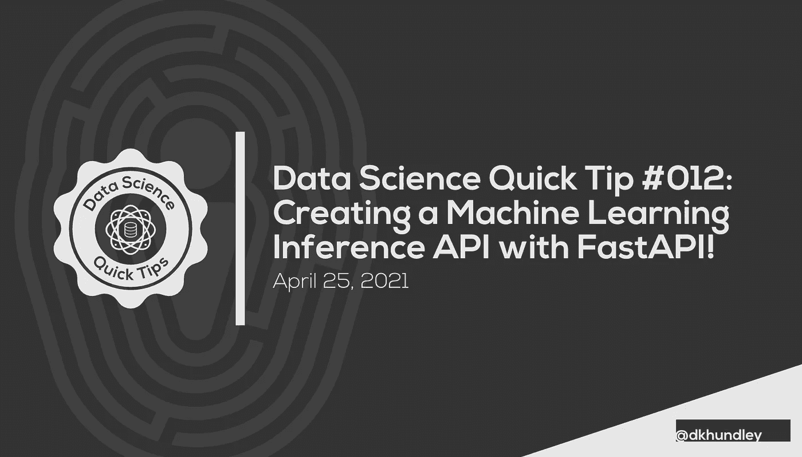
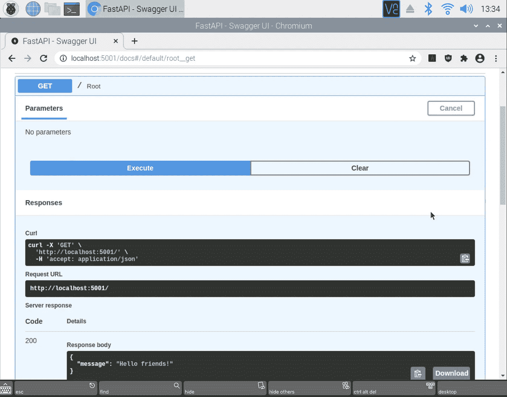
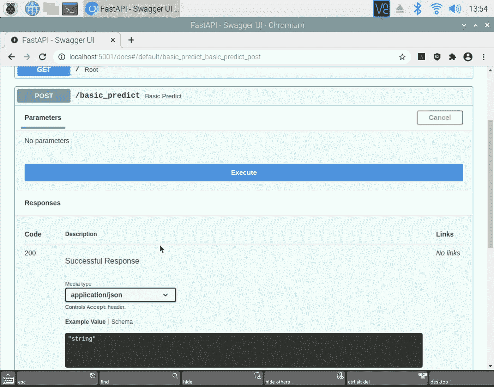
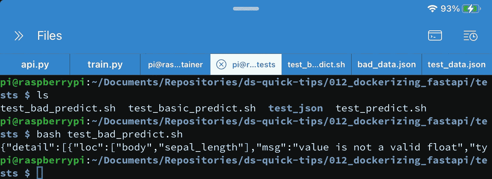
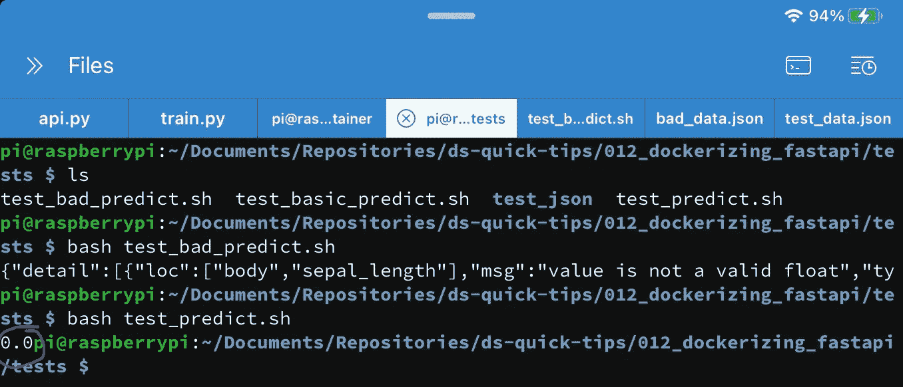
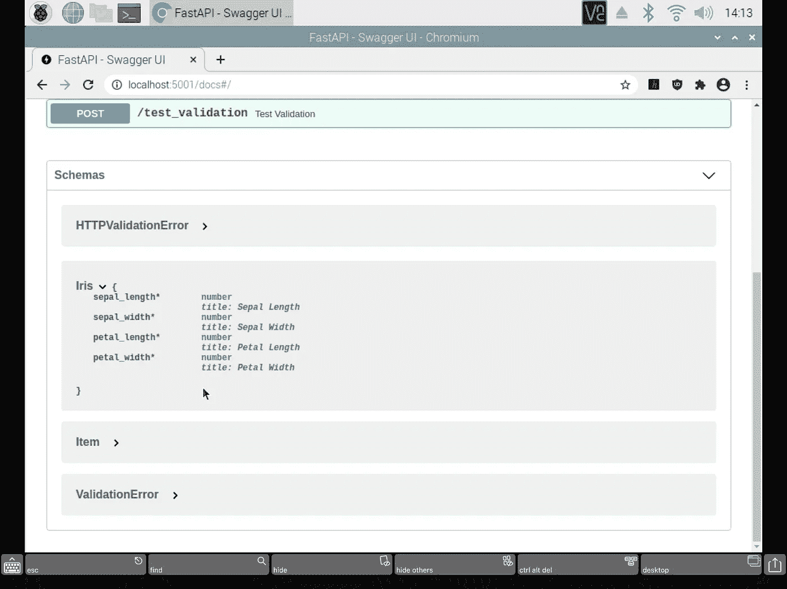
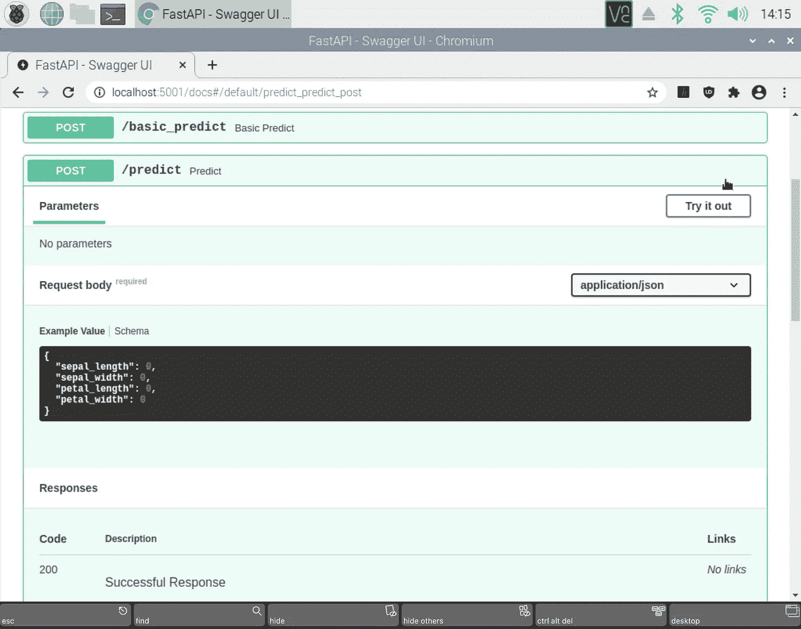

# 数据科学快速提示#012:用 FastAPI 创建机器学习推理 API

> 原文：<https://towardsdatascience.com/data-science-quick-tips-012-creating-a-machine-learning-inference-api-with-fastapi-bb6bcd0e6b01?source=collection_archive---------25----------------------->



## 与你分享如何使用 FastAPI 构建一个机器学习推理 API

你好，朋友们！我们又回来了，带来了另一篇关于用 Docker 和 FastAPI 创建机器学习推理 API 的半快速文章。说实话，我写这篇文章是为了我自己。虽然我已经非常熟悉 Docker，但我个人过去一直使用 Flask 来构建我的 ML 推理 API。这并不是说 Flask 一定有什么问题，但是看起来 FastAPI 正在迅速成为行业标准。FastAPI 的一些优势包括…

*   **比 Flask** 更快:说实话，我试图使用蝗虫工具演示 Flask 和 FastAPI 之间的速度测试，我发现它们的性能相当。当然，我测试的模型是一个非常基本的泰坦尼克号分类模型，所以也许我的测试一开始就不是一个好的测试。无论如何，我只是相信人们的话，FastAPI 比 Flask 快
*   **内置的 Swagger 文档**:如果你不熟悉 Swagger 是什么，它是人们记录如何正确使用他们的 API 的主要行业标准方法之一。这在 Flask 中根本不存在，所以这绝对是一个受欢迎的好处。
*   **内置数据验证** : FastAPI 允许一个非常简单的方法来实现对你的传入 API 调用的数据验证，这非常好。我们肯定会在稍后的帖子中对此进行报道。

如果您以前使用过 Flask，您会发现这种向 FastAPI 的转移非常容易。这两个框架在 Python 代码中的实际实现非常相似。在本帖中，我们将创建一个 API，为经典的 Iris 数据集提供逻辑回归模型。这个模型一点也不花哨，但它将演示如何使用 FastAPI 轻松地服务于您自己的机器学习模型。

和往常一样，如果你想了解这篇文章中显示的代码，你可以在我的个人 GitHub 中找到这个[。](https://github.com/dkhundley/ds-quick-tips/tree/master/012_dockerizing_fastapi)

让我们开始吧！

# 训练虹膜模型

在我的 GitHub repo 中，我实际上已经创建并导出了 Iris 逻辑回归模型，您可以随意使用，但是如果您想训练自己的模型，下面是我为此创建的脚本:

```
# Importing the required Python libraries
import numpy as np
import pandas as pd
import pickle
from sklearn import datasets
from sklearn.linear_model import LogisticRegression# Loading the iris dataset from Scikit-Learn
iris = datasets.load_iris()# Converting the iris dataset into a Pandas DataFrame
df_iris = pd.DataFrame(data = np.c_[iris['data'], iris['target']],
            columns = iris['feature_names'] + ['target'])# Separating the training dataset (X) from the predictor value (y)
X = df_iris.drop(columns = ['target'])
y = df_iris[['target']]# Instantiating a Logistic Regression (LR) model
lr_model = LogisticRegression()# Fitting the dataset to the LR model
lr_model.fit(X, y)# Saving the model to a serialized .pkl file
pkl_filename = "../model/iris_model.pkl"
with open(pkl_filename, 'wb') as file:
 pickle.dump(lr_model, file)
```

再说一次，我们在这里没有做任何花哨的事情。因为 Iris 数据集本身是一个非常干净的数据集，所以我所做的唯一一件事就是加载原始形式的数据集，并立即将其输入到 Scikit-Learn 的逻辑回归模型中。一旦模型被训练，我们就把它作为一个序列化的`.pkl`文件转储出来，这就是我们将用于模型推理的精确文件。

这一节到此为止！让我们开始使用 FastAPI 来构建我们的 API。

# 用基本 GET 端点实例化 FastAPI

好的，在我们开始之前，我们需要从 PyPi 快速安装我们将要使用的 Python 库。幸运的是，这非常简单:

```
pip3 install fastapi uvicorn
```

安装`fastapi`对你来说可能是显而易见的，但是你可能对`uvicorn`很好奇。Flask 和 FastAPI 都需要一种网关接口。Flask 需要一个类似于`gunicorn`的 WSGI 服务器，而`uvicorn`本质上是 WSGI 的“精神”继承者，也就是所谓的 ASGI 服务器。如果这有点令人困惑，请不要担心。你需要知道的主要事情是，当我们在终端中启动 FastAPI 时，我们实际上将使用`uvicorn`来执行它。

正如你在[我的 GitHub 脚本](https://github.com/dkhundley/ds-quick-tips/blob/master/012_dockerizing_fastapi/container/api.py)中注意到的，整个 API 非常容易上手。让我们从一个非常基本的 GET 端点开始。与 Flask 一样，FastAPI 利用位于函数之上的 Python 装饰器来提供不同的端点。这里的语法将用这个单一的 GET 端点创建一个超级简单的 API。

```
from fastapi import FastAPI, Request# Instantiating FastAPI
api = FastAPI()# Defining a test root path and message
@api.get('/')
def root():
  return {'message': 'Hello friends!'}
```

信不信由你，这实际上是一个全功能的 API。它显然什么都不做，但是如果您想看看它目前的运行情况，让我们启动 FastAPI 来看看这个小东西的运行情况。为此，我们将执行以下命令:

```
uvicorn api:api --host 0.0.0.0 --port 5001 --reload
```

这是在寻找一个名为`api.py`的 Python 文件，然后寻找一个名为`api`的 FastAPI 实例。然后我们将它绑定到端口`5001`上的主机`0.0.0.0`，最后一个`--reload`标志只是在您更改`api.py`脚本时重新加载您的 API。这对于测试来说很好，但是我建议您在生产环境中去掉最后一个标志。

现在您的 API 在一个终端窗口中运行，打开另一个终端窗口并执行下面的`curl`命令:

```
curl 0.0.0.0:5001
```

因为我们没有指定任何路径，它将默认为主要的`'/'`路径，因此应该返回我们的小“Hello friends！”给你回信息。整洁！现在，打开浏览器，前往 [http://localhost:5001/docs。](http://localhost:5001/docs.)这是你应该看到的:



作者截图

正如您所看到的，Swagger 已经在这里编目了我们的基本 GET 端点，甚至允许您做一点测试触发器来测试这个端点。现在这里没有太多内容，但是随着我们在这篇文章中的继续，您将看到这是如何成为一个非常强大的工具，用于快速记录您的机器学习推理 API。不错！

好了，现在我们的 API 已经有了一个很好的开始，让我们继续用 Iris 模型创建一个基本的推理端点。

# 基本推理终点

好了，我们现在准备开始围绕我们在前面部分中训练的 Iris 模型构建一个端点！首先，让我们首先导入我们需要的其他 Python 库，并加载模型本身:

```
import pandas as pd
import pickle# Loading in model from serialized .pkl file
pkl_filename = "../model/iris_model.pkl"
with open(pkl_filename, 'rb') as file:
 lr_model = pickle.load(file)
```

好了，这里的`lr_model`对象与我们之前针对 Iris 数据集训练的逻辑回归模型相同。就像我们处理任何其他 Python 脚本一样，我们将通过调用模型的`.predict()`函数将数据传递给该模型进行推理。

对于 Flask 用户来说，这是我觉得有点奇怪的地方。我不想解释 Flask 是如何工作的，但它就是…与众不同。在 Flask 中，我习惯于直接从请求体获取 JSON，这就是我们在这个基本端点中要做的。(剧透:有一个比这更好的选择，我们将在下一节演示，但如果您想尽可能地与 Flask 保持一致，这就是您要寻找的模式。

这里是我们的`/basic_predict`端点的完整代码:

```
from fastapi import Request# Defining the prediction endpoint without data validation
[@api](http://twitter.com/api).post('/basic_predict')
async def basic_predict(request: Request):

 # Getting the JSON from the body of the request
 input_data = await request.json()

 # Converting JSON to Pandas DataFrame
 input_df = pd.DataFrame([input_data])

 # Getting the prediction from the Logistic Regression model
 pred = lr_model.predict(input_df)[0]

 return pred
```

FastAPI 是围绕 Python 新的异步特性构建的，因此我们在这里看到了`async`和`await`关键字。为了实际使用请求体中的 JSON，我们必须首先从 FastAPI 导入`Request`类对象，然后将它作为参数传递给这里的`basic_predict`函数。(再说一次，这可能不是你在 Flask 中所习惯的。)幸运的是，从这里可以很快地从我们的虹膜模型中得到预测的推论。我们从请求体中取出 JSON，将其转换成 Pandas 数据帧，将数据帧传递给逻辑回归模型以产生一个推断，最后将该推断返回给用户。

好吧！现在我们来试试这个。为了方便起见，我创建了一些 shell 脚本来快速测试我们的端点。它们可以在这个 GitHub repo 目录中找到[。您可以简单地通过运行`bash script_name.sh`来执行这些。例如，运行`bash basic_predict.sh`脚本实际上是在做以下事情:](https://github.com/dkhundley/ds-quick-tips/tree/master/012_dockerizing_fastapi/tests)

```
curl --request POST \
--header 'Content-Type: application/json' \
--data [@test_json/test_data](http://twitter.com/test_json/test_data).json \
--url [http://0.0.0.0:5001/basic_predict](http://0.0.0.0:5001/basic_predict)
```

通过我们的模型运行这个脚本应该会返回一个“0.0”值。不错！现在让我们回过头来检查一下我们的 Swagger UI，看看事情发生了怎样的变化。下面是您现在应该看到的:



作者截图

除了我们原来的 GET 端点颜色为蓝色之外，我们现在看到我们的基本 predict POST 端点颜色为绿色。因为这是一个非常基本的端点，所以您会注意到这里没有多少文档。这是可以增强的，我们不仅要用我们的最终端点来增强它，还要添加最后一个非常酷的功能:数据验证。

# 带数据验证的推理端点

好了，虽然我们的基本预测端点如预期的那样工作，但我们现在将通过向传入请求添加数据验证来提高性能。数据验证确保我们的模型被正确地传递期望值。如果调用者传递了不正确的内容，则向用户返回一个响应，告诉他们由于数据验证错误，请求无法处理，并且还向用户具体描述了哪里出错了。

FastAPI 通过与一个名为 Pydantic 的框架合作，在他们的`BaseModel`类的基础上构建 Python 类来实现这一点。对于我们的 Iris 数据集，下面是我们将为验证构建的数据模型:

```
from pydantic import BaseModel # Creating the data model for data validation
class Iris(BaseModel):
 sepal_length: float
 sepal_width: float
 petal_length: float
 petal_width: float
```

(注意:默认的 Iris 数据集以不同的方式命名其特征，并包含空白。我一辈子也想不出如何用包含空格的特性名称创建这个 Pydantic 数据模型，所以我适当地更改了特性的名称。这也反映在我们的测试 JSON 文件中。)

我在这里描述的验证非常简单。使用这个`Iris`数据模型的端点期待一个具有这四个特性的请求，并且所有这些特性都应该是`float`数据类型。这是非常基本的，但是您可以通过数据验证进行深入研究。您甚至可以具体定义每个特性的期望值范围。例如，如果您定义了一个期望值范围在 0 到 366 之间的`days`特性，那么当用户试图传递一个值为 367 的`days`时，FastAPI 将返回一个验证错误。

为了在端点中实际使用这个`Iris`数据模型，下面是它的语法:

```
# Defining the prediction endpoint with data validation
[@api](http://twitter.com/api).post('/predict')
async def predict(iris: Iris):

 # Converting input data into Pandas DataFrame
 input_df = pd.DataFrame([iris.dict()])

 # Getting the prediction from the Logistic Regression model
 pred = lr_model.predict(input_df)[0]

 return pred
```

这与我们的`/basic_predict`端点非常相似，但是现在，FastAPI 将自动传递传入的请求，并在我们的模型处理它之前对它执行数据验证。

让我们付诸实践吧！为了方便起见，我提供了两个测试 JSON 文件:一个包含正确的信息，另一个包含错误的信息。好的那个看起来是这样的:

```
{"sepal_length":5.1,"sepal_width":3.5,"petal_length":1.4,"petal_width":0.2}
```

这是坏的那个的样子:

```
{"sepal_length":"dkhundley","sepal_width":3.5,"petal_length":1.4,"petal_width":0.2}
```

正如你所看到的，我把`sepal_length`改成了我名字的`string`值，这应该无法通过我们设置的数据验证，因为我们期望的是`float`值。通过用这些坏数据发出 curl 命令(可以用我的`test_bad_predict.sh`脚本完成)，FastAPI 告诉我们:



作者截图

我的截图被剪掉了一点，但是你可以看到 FastAPI 指出`sepal_length`应该是一个浮点数。如果您正在调用 API，而您自己不是开发人员，那么这非常清楚地描述了您出错的地方。不错！

传入正确的数据(可以用我的`test_predict.sh`脚本来完成)会产生我们期望的推断值。



作者截图

好吧，让我们最后看一眼我们的招摇文件来结束这篇文章。你现在应该看到一些新的东西了！首先，看一下“模式”部分:



作者截图

在这里，您可以看到我们的`Iris`数据模型，包括所有预期的特性和预期的数据类型。现在，让我们来看看我们的`/predict`端点文档:



作者截图

与我们的`/basic_predict`端点相比，我们现在可以看到一些额外的东西。也就是说，我们现在看到了一个端点所期望的样本，此外，FastAPI 提供了一个虚拟数据集，您可以从 Swagger UI 随时随地对其进行测试。非常好！

朋友们，今天的帖子到此结束！尽管我很喜欢 Flask，但我个人将来会将 FastAPI 用于我所有的机器学习模型。我很清楚为什么数据科学社区很快采用 FastAPI 而不是 Flask。这是一个非常简洁、功能丰富的工具！感谢你查看这篇文章。请继续关注机器学习和数据科学的最新进展。