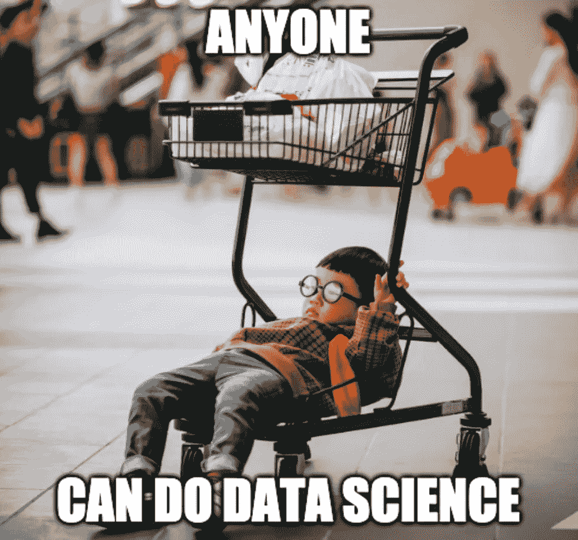

# 一个方便的数据科学相关资源列表，用于学习、面试和职业发展

> 原文：<https://towardsdatascience.com/data-science-resources-for-learning-interviewing-and-professional-development-4530898d789c?source=collection_archive---------14----------------------->

## 学习编码，为面试做准备，以及为初学者提供其他有用的数据科学资源和信息

数据科学家本世纪最性感的工作

大家好，我整理了一份有用的网站和信息列表，以帮助您处于该过程的任何阶段，无论您是开始数据科学之旅、面试公司、谈判报价，还是只是希望继续了解更多信息。

这包括面试准备资源、面试后薪酬研究等。随着我在旅途中找到更多的资源，我也会继续更新这个列表。

以下是您将在下面找到的目录:

**1。对于对数据科学感兴趣的初学者**

a)学习 Python、R 和 SQL 的免费资源

b)为统计释放资源

b)学习数据科学的付费渠道

c)机器学习资源

d)在哪里可以找到数据集

**2。面试准备**

a)个人守则实践

b)现场代码实践

c)备忘单

**3。求职中的**

**4。岗位面试**

a)薪酬信息

b)谈判

**5。职业发展**

a)实现出色的可视化

b)学习技巧和窍门/其他很酷的东西

# 对于对数据科学感兴趣的初学者

任何人都可以做数据科学。安·trần 在 [Unsplash](https://unsplash.com?utm_source=medium&utm_medium=referral) 上拍摄的照片

如果你认为这是你想从事的领域，作为一个开始，看看这个非常酷的[信息图](https://s3.amazonaws.com/assets.datacamp.com/blog_assets/Infographics/How-to-become-a-data-scientist-223x1024.jpg)名为“**通过 8 个简单步骤**成为数据科学家”。

你的旅程将占用大量时间和个人投资，所以如果你准备好了，这里有一些资源供你培养数据科学家的技能。编码、SQL、机器学习算法和统计学是你需要学习的基本技能。

## 学习 Python、R 和 SQL 的免费资源

有很多免费的资源可以教初学者如何用 Python 和 r 编程，谷歌搜索会给你很多结果。我在下面列出的是我认为能一步一步带你走过的网站。

*   Python、R 和 SQL[https://www.datacamp.com/](https://www.datacamp.com/)
*   Python、R 和 SQL[https://www.udacity.com/](https://www.udacity.com/)
*   Python、R 和 SQL【https://www.dataschool.io/ 
*   https://swirlstats.com/[r](https://swirlstats.com/)
*   SQL[https://www.w3schools.com/sql/](https://www.w3schools.com/sql/)

当你开始做项目时，看看我的文章[Git](/an-easy-beginners-guide-to-git-2d5a99682a4c)的简单入门指南可能会对你有所帮助。Git 是一个用于项目的版本控制软件。

## 免费资源统计

*   基础统计如果你想从头开始[https://www.udacity.com/course/intro-to-statistics-ST 101](https://www.udacity.com/course/intro-to-statistics--st101)
*   有很多例子的概率[https://www . int math . com/counting-probability/counting-probability-intro . PHP](https://www.intmath.com/counting-probability/counting-probability-intro.php)
*   强烈推荐这本书(R 中带应用的统计学习入门)，即使你不使用 R。它是免费的。[http://faculty.marshall.usc.edu/gareth-james/](http://faculty.marshall.usc.edu/gareth-james/)
*   “StatQuest 将复杂的统计和机器学习方法分解成易于理解的小块。”[https://www.youtube.com/channel/UCtYLUTtgS3k1Fg4y5tAhLbw](https://www.youtube.com/channel/UCtYLUTtgS3k1Fg4y5tAhLbw)

## 学习数据科学的付费渠道

如果独自练习不太适合你的学习风格，还有其他选择。你可以参加训练营或者获得硕士学位。

我实际上参加了旧金山的一个名为**激励**的数据科学训练营，那是一个课堂环境，我非常喜欢面对面的互动。如果你最终选择了激励，你可以用我作为推荐人，这给了你学费折扣。

也有网上训练营，有些会保证你会得到一份工作。做你的研究，找到适合你的，因为每个训练营都有优点和缺点。有些提供工作保障。有些可能会提供指导。例如，目前我是 **Springboard** 的分析训练营的导师，我每周与一名学生进行半小时的电话会谈，回答问题并复习课程。如果你想查看跳板的节目， [**点击这里**](https://www.springboard.com/invite/QIBPL) **。**

照片由[元素 5 数码](https://unsplash.com/@element5digital?utm_source=medium&utm_medium=referral)在 [Unsplash](https://unsplash.com?utm_source=medium&utm_medium=referral) 上拍摄

如果你有时间和金钱，如果你想更深入地了解这些材料，硕士课程可能是一个选择。训练营往往提供更多的广度而不是深度。我目前正在乔治亚理工学院攻读硕士学位，这是一个比其他大多数项目都更好也更便宜的选择。

如果你对训练营或我的硕士项目有任何疑问，欢迎在下面发表评论。

我想指出的另一件很酷的事情是 Coursera 开始的一些新东西。一旦你在编码方面有了良好的基础，你可以通过尝试一个**指导的项目**来练习，在两个小时内由一个主题专家学习一项与工作相关的技能。注意，这不是免费的。[https://www.coursera.org/courses?query=guided%20projects](https://www.coursera.org/courses?query=guided%20projects)

## 机器学习和其他资源

对于那些对机器学习感兴趣的人来说，这里有一些有用的网站。

*   以清晰的方式教授机器学习[https://machinelearningmastery.com/](https://machinelearningmastery.com/)
*   关于机器学习和深度学习的吴恩达课程[https://www.coursera.org/learn/machine-learning](https://www.coursera.org/courses?query=machine%20learning%20andrew%20ng)https://www.coursera.org/specializations/deep-learning
*   深度学习[https://www.fast.ai/](https://www.fast.ai/)
*   直观地解释—“一个让难以理解的想法变得直观的实验”[https://setosa.io/ev/](https://setosa.io/ev/)
*   自然语言处理[http://www.nltk.org/book/ch01.html](http://www.nltk.org/book/ch01.html)

一旦你学会了机器学习模型，你就可以开始参加比赛了。Kaggle 是一个很好的方法来实践你在实际问题中学到的东西。https://www.kaggle.com/competitions

## 哪里可以找到数据集

如果您正在寻找用于顶点项目的数据，这里有一个列表，可以作为一个很好的起点。

*   **Kaggle** 是一个很好的数据资源，但一定要寻找可用性得分高的数据集，这表明它是一个相对干净和良好的数据集。[https://www.kaggle.com](https://www.kaggle.com/competitions)
*   UCI 有一个机器学习知识库，这是一个寻找数据集的热门地方。它甚至提供了数据集的任务类型(分类、回归或聚类)[https://archive.ics.uci.edu/ml/datasets.php](https://archive.ics.uci.edu/ml/datasets.php)
*   人口普查可以提供关于人口和经济的数据。[https://www.census.gov/data.html](https://www.census.gov/data.html)
*   **新冠肺炎**数据集[https://github . com/owid/新冠肺炎-数据/树/主/公共/数据/](https://github.com/owid/covid-19-data/tree/master/public/data/)

# 面试准备

数据科学职位的面试与其他职位有很大不同，需要做大量的准备工作。

一般来说，会有多轮面试，包括带回家的作业、招聘人员面试、技术面试和现场编码面试。

下面是一些你可以练习 SQL 或 Python 或其他编程语言的网站。我还附上了一些备忘单，可能对你的准备工作或工作有用。

我准备好面试了吗？假的！问题是，这次面试我准备好了吗？斯蒂芬妮·勒布朗在 [Unsplash](https://unsplash.com?utm_source=medium&utm_medium=referral) 上的照片

> 顺便说一句，我听说盖尔·麦克道尔的《破解编码面试》这本书非常有帮助。它包含了大型科技公司提出的近 200 个编程问题和答案。

## 个人代码实践(顺便说一下，这些都是免费的)

*   Leetcode 有超过 800 个问题可供你选择，它们有不同的难度，从简单到中等到困难不等。【https://leetcode.com/problemset/all 号
*   **Codewars** 有点像一个结构化的程序，当你完成挑战时，你会经历不同的等级。[https://www.codewars.com/](https://www.codewars.com/)
*   HackerRank 是一个竞争性的平台，在这个平台上，你的解决方案将根据准确性进行评分，你将与其他用户进行比较。[https://www.hackerrank.com/](https://www.hackerrank.com/)

## 现场代码实践

*   我建议您尝试一下，与您的同事一起练习现场模拟面试和编码问题。这让它感觉更像一个真实的面试环境，这将是一个很好的练习。 **Pramp** 免费使用。[https://www.pramp.com/#/](https://www.pramp.com/#/)
*   或者，你也可以和你申请的公司的人一起练习模拟面试。(免费，但目前新冠肺炎需要付费。)[https://interviewing.io/](https://interviewing.io/)
*   当然，不要忘记练习在白板上编写问题代码。随便找个朋友冒充面试官！

## 备忘单

为了提高你的工作效率，有备忘单作为参考总是好的。这里有一些我喜欢的。

**SQL**

*   关于基础知识，请参见[https://learnsql.com/blog/sql-basics-cheat-sheet/](https://learnsql.com/blog/sql-basics-cheat-sheet/)
*   一旦你学会了基础，我会检查窗口功能。[https://learnsql.com/blog/sql-window-functions-cheat-sheet/](https://learnsql.com/blog/sql-window-functions-cheat-sheet/)

**R**

*   查看 RStudio 的许多伟大的小抄[https://www.rstudio.com/resources/cheatsheets/](https://www.rstudio.com/resources/cheatsheets/)

**Python**

*   我很喜欢 Datacamp 制作的备忘单。请参阅 Numpy、Pandas、Seaborn、Scipy 等的备忘单。[https://www.datacamp.com/community/data-science-cheatsheets](https://www.datacamp.com/community/data-science-cheatsheets)

## 杂项

*   数据科学面试问题、答案和其他有用资源[https://ds-interviews.org/](https://ds-interviews.org/)

# 在找工作

如果你准备好开始申请和面试，你可以先去热门网站，比如 Indeed、ZipRecruiter 和 Google，也可以在这里查看这些资源。

*   获得顶级科技公司的推荐【https://repher.me/ 
*   在这里寻找创业工作【https://angel.co/ 
*   轻松申请数百家使用 LinkedIn 的公司[https://www.linkedin.com/jobs/linkedin-jobs/](https://www.linkedin.com/jobs/linkedin-jobs/)
*   别忘了，你最好的选择是向你的朋友和家人寻求推荐！

最后，我听说了一个名为 **Blind** 的新网站，通过验证的员工可以匿名提问和回答问题。你可以对文化进行研究，也许还可以了解薪水。[https://www.teamblind.com/](https://www.teamblind.com/)

我得到的一个建议是，先从你不感兴趣的公司开始实习，把你真正感兴趣的公司留到你实习之后。

# 面试后

既然你得到了一份工作，你准备好谈薪水了吗？

这是什么，蚂蚁的工资？[水晶钻](https://unsplash.com/@crystalsjo?utm_source=medium&utm_medium=referral)在 [Unsplash](https://unsplash.com?utm_source=medium&utm_medium=referral) 上拍照

## 薪酬信息

公司给这种职位的工资是多少？做你的研究，这样你就知道市场的价格。

我通常从 Glassdoor.com 开始，看是否能找到薪水信息。其他几个提供评估的网站包括[https://www.salarylist.com/](https://www.salarylist.com/)和[https://www.payscale.com/](https://www.payscale.com/)

这里有几个我认为也不错的网站

*   直接从 https://www.bls.gov/ooh/劳动统计局找到数据
*   薪酬数据[https://www.levels.fyi/comp.html?track=Data%20Scientist#](https://www.levels.fyi/comp.html?track=Data%20Scientist#)
*   从 https://h1bdata.info/ 1B 招聘公司[找到实际工资信息](https://h1bdata.info/)

## 谈判

谈判总是值得的！**照做就是了。**问问真的没坏处。

*   查看这篇关于女性谈判的优秀文章[http://women forhire . com/negotiating _ salary _ benefits/negotiating _ salary _ 101 _ tactics _ for _ better _ compensation/](http://womenforhire.com/negotiating_salary_benefits/negotiating_salary_101_tactics_for_better_compensation/)

# 专业发展

学习是一个持续的旅程。为了更好地创建可视化，获得新知识，或者只是学习技巧和诀窍，请查看下面的一些内容。

Woohoo，职业发展。Jimmy Conover 在 [Unsplash](https://unsplash.com?utm_source=medium&utm_medium=referral) 上拍摄的照片

## 制作出色的可视化效果

*   我真的很喜欢《华尔街日报》图形团队的可视化效果。查看它们，为你自己的视觉效果寻找灵感。[https://graphics.wsj.com/](https://graphics.wsj.com/)
*   Tableau Public 有大量的创意仪表盘。看看[https://public.tableau.com/en-us/gallery/?tab =当日即时&type =当日即时](https://public.tableau.com/en-us/gallery/?tab=viz-of-the-day&type=viz-of-the-day)
*   这篇文章给出了一些非常好的提示，告诉你如何用你的数据创建更好的可视化效果。[https://depictdatastudio . com/how-to-create-a-data-visualization-style-guide-to-tell-great-stories/](https://depictdatastudio.com/how-to-create-a-data-visualization-style-guide-to-tell-great-stories/)
*   这是一个关于用汉斯·罗斯林的视觉材料讲故事的标志性演讲。[https://www . ted . com/talks/Hans _ rosling _ the _ best _ stats _ you _ ve _ ever _ seen # t-297730](https://www.ted.com/talks/hans_rosling_the_best_stats_you_ve_ever_seen#t-297730)
*   颜色是视觉化的一个重要部分，但人们并不总是注意它。Colorbrewer 是一个为你的图形选择好的配色方案提供建议的工具。[https://colorbrewer2.org/](https://colorbrewer2.org/)

## 学习技巧和窍门/其他很酷的东西

*   每周一次的 Python 播客，包含采访、编码技巧以及与来自 Python 社区的嘉宾的对话[https://realpython.com/podcasts/rpp/](https://realpython.com/podcasts/rpp/)
*   使用 R 软件的博客作者的博客集【https://www.r-bloggers.com/ 
*   生成虚拟 JSON 数据【https://www.mockaroo.com/ 

## 如果你有任何问题或任何网站/信息想与他人分享，请在下面留言！

# 祝您的数据科学之旅好运！

你能行的！照片由 [Unsplash](https://unsplash.com?utm_source=medium&utm_medium=referral) 上的 [Prateek Katyal](https://unsplash.com/@prateekkatyal?utm_source=medium&utm_medium=referral) 拍摄