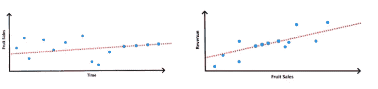
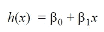
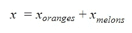
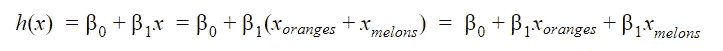
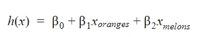
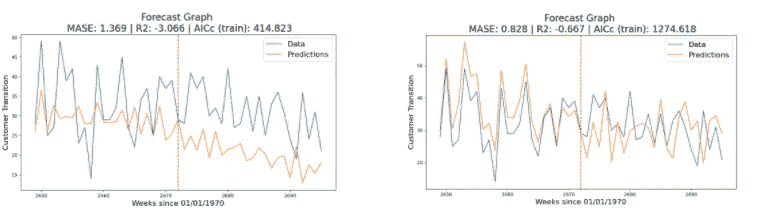

# 数据科学短片:分解

> 原文：<https://towardsdatascience.com/data-science-shorts-decomposition-a40bdd6826aa?source=collection_archive---------29----------------------->

## 有时用最简单的方法也能获得可观的收益

(来源:[https://pixabay.com/](https://pixabay.com/))

在一系列短文的第一篇中，我想概述一下关于输入数据的关键见解:分解我们的训练特征并提取组成它们的更基本的特征，这使我们能够大大提高模型的预测质量。

为了说明我们的观点，假设我们正在尝试生成一个任意时间序列的未来值的预测。为了简单起见，我们将使用线性模型来提供预测。这个概念对于更复杂的模型也是有效的。

从线性模型生成预测可以通过将时间序列训练数据视为特征空间内的向量集合来完成。如果我们将每个向量的标量值视为时间的函数，我们可以拟合回归模型，通过沿回归线外推来预测该特征向量在未来任何时间的值。然后，可以将每个特征的未来值作为因子，使用第二个回归模型预测目标变量(即预测目标)，这次是通过沿回归线插值这些值。

第一个回归模型(左图)让我们可以将每月的水果销量作为时间的函数进行外推。这允许我们使用第二个回归模型(右图)将收入作为水果销售的函数进行插值。(图片由作者提供)

例如，我们可以使用售出的水果数量作为训练数据来预测杂货店的月收入。我们可以扩充训练数据(滞后数据、非线性变换……)，但这些都源于一个单一的特征:我们卖了多少水果。在训练第二个回归模型时，我们收敛到一个等式，该等式将收入表示为销售水果的函数:

线性回归模型的标准公式

这就是我们的见解——水果销售可以进一步细分。例如，如果我们的商店卖橘子和甜瓜，我们的水果总销售额将是卖出的橘子数加上卖出的甜瓜数。

水果销售额是橙子和甜瓜销售额的总和

即使是简单的水果种类分解也会显示出不同的季节模式。橙子的销售高峰在冬天，而甜瓜的销售高峰在夏天。但是将橙子和甜瓜的销售数据视为一个特征**迫使模型赋予它们相同的权重**:

请注意，β1 在等式的右侧出现了两次——如果不进行分解，模型无法学习橙子和甜瓜销售的单独权重。

通过分解水果销售，模型可以为每个特征分配不同的权重，从而提高预测质量:

分解允许我们分配单独的权重。

在我工作中使用的样本数据集(B2B 营销数据-通过与销售团队的互动次数预测新客户)上测试这一点，我们可以将通过互动总数的预测与通过每次互动发生的渠道(例如 LinkedIn、直接呼叫……)细分的预测进行比较

左图:通过与销售团队的互动次数预测 B2B 客户获取量。右图:同样的预测，将互动次数考虑在内，按渠道分解。(图片由作者提供)

结果显示，仅通过分解我们的数据，预测质量就提高了**40%**(使用平均-平均比例误差测量)。整洁！

感谢阅读，敬请关注本系列的后续文章:)