# 数据科学入门套件

> 原文：<https://towardsdatascience.com/data-science-starter-kit-2d8e2291914b?source=collection_archive---------7----------------------->

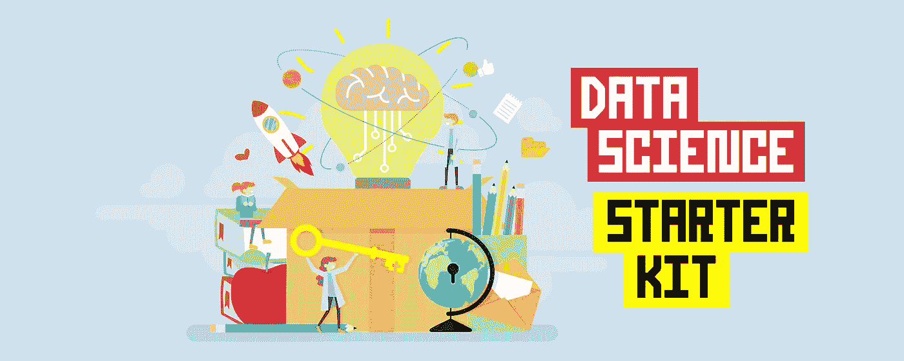

由 [envato elements](https://1.envato.market/c/2346717/628379/4662) 的 [alexacrib](https://elements.envato.com/user/alexacrib) 使用图像创建(经许可)。

## [数据科学](https://medium.com/tag/data-science) | [机器学习](https://medium.com/tag/machine-learning)

## 数据科学入门指南

T 本文向您展示了**数据科学入门工具包**，它将作为自助指南，帮助您开始数据科学之旅。不，我不会卖给你一门课程。它也不会是一个神奇的公式，可以毫不费力地向您灌输数据科学知识和技能。

这个*数据科学入门套件*将会让你零成本(尽管这里提到的学习服务提供商会这么做)。这个初学者工具包可以为您提供一个框架，帮助您找到正确的方向，并帮助您迈出第一步。

这将是一段艰难的旅程。你甚至可能想放弃，但是只要有毅力和正确的心态，你就能做到。这里有很多内容要介绍，废话不多说，让我们开始吧！

# 数据科学的重要性

数据科学可以定义为一个从数据中获取可行见解的多学科领域。它通过应用科学方法以及包括数学、统计、编程、机器学习和数据可视化在内的基本技术和分析技能来做到这一点。

数据科学的流行可以归功于托马斯·达文波特和 DJ·帕蒂尔在[哈佛商业评论](https://hbr.org/2012/10/data-scientist-the-sexiest-job-of-the-21st-century)上发表的一篇文章中引人注目的标语:

> 数据科学家:21 世纪最性感的工作

几乎所有的财富 500 强公司都聘请了数据科学家、数据工程师和数据分析师以及机器学习研究人员和机器学习工程师，以帮助组织充分利用数据。

您知道*“数据是新的石油”*，它还可以帮助您做出数据驱动的决策。但问题是，在学习如何进行数据科学的过程中，你如何准确地开始并迈出第一步。

# 心态

有时我们被各种可能性淹没，这导致了犹豫不决。这种情况被称为*分析瘫痪*。考虑以下我们在开始时都可能面临的常见场景。

*   我们该走哪条路？
    [谷歌数据分析](https://youtu.be/vEuGCuCdPDo)或者 Coursera 的 IBM 数据科学证书。
*   ***学哪种语言？***
    [R vs Python](https://youtu.be/zyh2HU1efo4)
*   ***哪个数据可视化工具？***
    画面或力量匕

这种过度思考可能会阻碍生产力，让我们无法前进。我们之所以不愿意只选择一个，继续前进，是因为我们害怕做出错误的决定或采用次优的解决方案。

丹尼尔·伯格在 [Unsplash](https://unsplash.com/s/photos/grow-plant?utm_source=unsplash&utm_medium=referral&utm_content=creditCopyText) 上拍摄的照片

一句流行的中国谚语曾说:

> “种树的最佳时间是 20 年前。第二好的时机就是现在。”

因此，要在学习数据科学的旅程中前进，您必须行动起来，而且必须现在就行动起来。时间是至关重要的。所以以上问题的答案是选择一个，试一试，如果不成功，你可以随时换另一个试试。没有什么能阻止你尝试所有的选择。

# 数据科学技能集

任何学习旅程中的一个基本问题是弄清楚你想学习哪些课程。为了帮助你开始，我整理了一份基本数据科学技能的列表，并将其浓缩为下图所示的信息图。

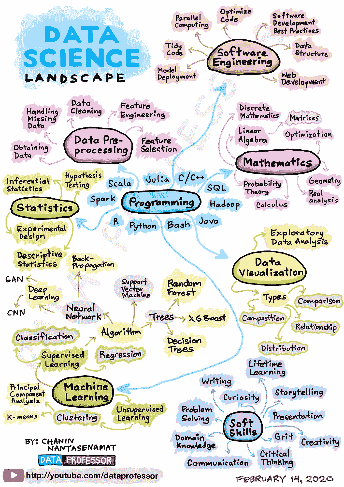

[资料图](https://github.com/dataprofessor/infographic/blob/master/04-Data-Science-Landscape.JPG)作者绘制。

下面的信息图概括了数据科学家的基本技能。对于一个全面发展的数据科学家来说，这基本上包括技术技能和软技能。

数据科学的技能组合包括使用:

*   数据收集，
*   数据预处理，
*   探索性数据分析，
*   数据可视化，
*   统计分析，
*   机器学习，
*   编程和
*   软件工程。

我在 YouTube 上制作的关于如何成为一名数据科学家的视频 [*(所需的学习路径和技能组合)*](https://youtu.be/jhImgx8I8oI) 中提供了关于数据科学技能组合的更详细的讨论。

[https://youtu.be/jhImgx8I8oI](https://youtu.be/jhImgx8I8oI)

任何一个数据科学家在工作中实际需要的确切技能高度依赖于他们工作的公司类型。

例如，在一家科技初创公司，数据科学家可能被期望或被他们的角色要求涵盖信息图中涵盖的广泛技能集。所以说，他们最终可能成长为全栈数据科学家。就我个人而言，我最初是一名生物学家，是机器学习软件的最终用户，比如基于 GUI 的 WEKA 数据挖掘工具。随着时间的推移，我开始获得信息图中包含的其他技能集，如编码(Python 和 R ),并慢慢接受了每个技能集簇。至于那些在更大的科技公司工作的人，他们的职责范围可能会更窄，也更明确。例如，大科技的数据科学家可能专注于开发新的机器学习算法、工具或框架。

同样重要的是各种软技能，帮助数据科学家讲述好的数据故事、解决问题、设计创造性的解决方案等。 [Rebecca Vickery](https://medium.com/u/8b7aca3e5b1c?source=post_page-----2d8e2291914b--------------------------------) 写了一篇很棒的文章，涵盖了数据科学的 [*软技能*](/soft-skills-for-data-science-fee73ae4821a) 这一主题，她涵盖了怀疑主义、独立、创造力、商业敏锐度和沟通。随着数据科学家在职业阶梯上的晋升，这些软技能变得越来越重要，因为它们向组织的关键利益相关者传达数据驱动的见解，并使用这些软技能来管理不断增长的数据专业人员团队。

# 数据科学的学习资源

作为一名非技术出身的人，我知道开始接触数据科学是多么令人生畏。这并不是说学习数据科学的资源很少，相反，资源太多了。如前所述，这可能导致分析瘫痪。

以下是学习数据科学的一些可用资源:

*   ***训练营***——[数据科学道场](https://datasciencedojo.com)，[拉姆达学校](https://lambdaschool.com/courses/data-science)
*   ***会议*** — [数据化会议](https://datacated.com/conference/)，[开放数据科学会议](https://odsc.com/)
*   ***工作坊***——[NVIDIA 数据科学工作坊](https://www.nvidia.com/en-us/training/instructor-led-workshops/fundamentals-of-accelerated-data-science/)，[加州大学柏克莱分校数据科学教育全国工作坊](https://data.berkeley.edu/academics/resources/data-science-education-resources/2021-national-workshop-data-science-education)
*   ***比赛***——[卡格尔](https://www.kaggle.com)
*   ***本科或研究生学位项目***——[UT Dallas](https://datascience.utdallas.edu/)、 [U Penn MCIT](https://gradadm.seas.upenn.edu/masters/computer-and-information-technology-mcit/) 等。
*   ***在线课程及证书*** — [365 数据科学](https://365datascience.pxf.io/c/2365590/791349/11148)、[数据营](https://bit.ly/dataprofessor-datacamp)、 [Coursera](http://bit.ly/dataprofessor-coursera) 、 [DataQuest](https://www.dataquest.io) 、 [Udemy](https://bit.ly/dataprofessor-udemy-datascience) 、 [Udacity](https://www.udacity.com) 或 [Skillshare](https://www.skillshare.com) 以及免费的 [Kaggle Learn](https://www.kaggle.com)
*   ***书籍***——[用 Scikit-Learn、Keras、TensorFlow 进行动手机器学习](https://amzn.to/34aYbIc)、 [R 进行数据科学](https://amzn.to/346non4)、[建立数据科学事业](https://amzn.to/3fbH66Z)等。
*   ***YouTube***——[数据教授](https://www.youtube.com/dataprofessor)，[肯吉](https://www.youtube.com/channel/UCiT9RITQ9PW6BhXK0y2jaeg)，[克里斯纳伊克](https://www.youtube.com/user/krishnaik06)， [codebasics](https://www.youtube.com/channel/UCh9nVJoWXmFb7sLApWGcLPQ) ，[丹尼尔伯克](https://www.youtube.com/channel/UCr8O8l5cCX85Oem1d18EezQ)，[蒂娜黄](https://www.youtube.com/channel/UC2UXDak6o7rBm23k3Vv5dww)， [StatQuest](https://www.youtube.com/user/joshstarmer) ，[数据化](https://www.youtube.com/c/DATAcated/)等。
*   ***中***——[查宁·南塔塞纳马特](https://medium.com/u/f94b47c3cfca?source=post_page-----2d8e2291914b--------------------------------)[肯·吉](https://medium.com/u/6ee1f7466557?source=post_page-----2d8e2291914b--------------------------------)[苦仁·陈](https://medium.com/u/84a02493194a?source=post_page-----2d8e2291914b--------------------------------)[里士满·阿拉克](https://medium.com/u/88797ba3f2f6?source=post_page-----2d8e2291914b--------------------------------)[西雅图·达塔盖伊](https://medium.com/u/41cd8f154e82?source=post_page-----2d8e2291914b--------------------------------)[丽贝卡·维克里](https://medium.com/u/8b7aca3e5b1c?source=post_page-----2d8e2291914b--------------------------------)[特伦斯·申](https://medium.com/u/360a9d4d19ab?source=post_page-----2d8e2291914b--------------------------------)等。
*   ***播客***——*[肯氏近邻](https://www.youtube.com/channel/UCpEJMMRoTIHJ8vG8q_EwqCg)，[柴时代数据科学](https://www.youtube.com/channel/UCRjtBP-o5FbgRzX2BHQEFtQ)，[走向数据科学](https://www.youtube.com/watch?v=9yRl4BDTxSg&list=PLNj7wSZTYzhnclPOhtaAQ54GP8c1ujnJe)，[拉维特秀](https://www.youtube.com/channel/UC4yopSSlBfw2WAykLPTYH-w)*
*   ****社交平台*** —关注 Twitter 上的[# 66 days ofdata](https://twitter.com/search?q=%2366daysofdata)、Twitter 上的[# 100 days ofcode](https://twitter.com/search?q=%23100daysofcode)、LinkedIn 上的[# 66 days ofdata](https://www.linkedin.com/feed/hashtag/66daysofdata/)和 LinkedIn 上的[# 100 days ofcode](http://linkedin.com/feed/hashtag/100daysofcode/)*

*如您所见，这些学习资源提供了广泛的选项，您可以利用这些选项来学习数据科学。上述每一种资源都是可行的方法，不用说，它们可能适合不同的生活情况和环境，这些情况和环境可能因人而异。*

*例如，如果你急于尽快找到一份数据科学的工作，并且你有时间和财力通过训练营来支持自己，那么这可能是你的选择。*

*或者，您的公司支持您学习数据科学，并且您有能力参加研讨会或讨论会，那么这可能是您的一条可行之路。*

*对于那些想从一个完全不同的领域转型的人来说，你可能正在自学，因此允许你在家学习的在线资源可能是你的途径。*

*或者，如果你很早就知道自己热爱数据科学，并且已经注册了一个数据科学的本科学位项目，那也很好！*

*根据我自己的个人经验，我经常发现从事我感兴趣的项目很有帮助。首先，如果这个主题很有趣，那么通过研究这个项目来理解数据将会很有趣，很吸引人。事实上，我期待着一天中我开始学习或从事项目的那段时间。作为一名生物信息学副教授，我朝九晚五地工作，晚上我会从事内容创作，要么为教程编码，要么拍摄教程视频，要么为 Medium 写教程博客。谁知道呢，也许有一天我会完全投入到内容创作中。*

# *五金器具*

*任何数据科学项目的一个重要组成部分是硬件。让我们熟悉一些对任何数据科学项目都有帮助的硬件。*

*由于计算机(笔记本电脑或台式机)对于执行各种资源密集型机器学习(或深度学习)模型构建非常重要，因此可能会有一种误解，即如果我们无法获得昂贵的硬件，可能很难开始学习数据科学。虽然缺乏这些资源可能会阻碍数据科学项目的进展，但免费云资源的可用性是一个游戏改变者。*

*然而，如果有预算，你问我有什么建议，我会建议你买一台 MacBook Pro，我认为这是目前市场上最好的笔记本电脑，可以完成任何与编码相关的任务，以及一般的工作效率和内容创作任务。由于 MacBook 的操作系统是 OSX，它本质上是建立在与 Linux 相似的 BSD UNIX 之上的。这样做的好处是你会熟悉 Linux 命令，因为在电脑上安装一些机器学习软件或工具可能需要侵入苹果的 Xcode 和 T2 的 Homebrew。另一个好处是，如果连接外部显示器、键盘和鼠标，笔记本电脑可以兼作台式机。*

*[**Google Colab**](https://colab.research.google.com) 和 [**Kaggle Notebook**](https://www.kaggle.com/kernels) 都是免费且功能强大的云资源，授予任何用户访问 CPU 和 GPU 计算资源的权限。仅配备一台基本的笔记本电脑，您也可以访问强大的计算资源，足以训练任何模型。*

*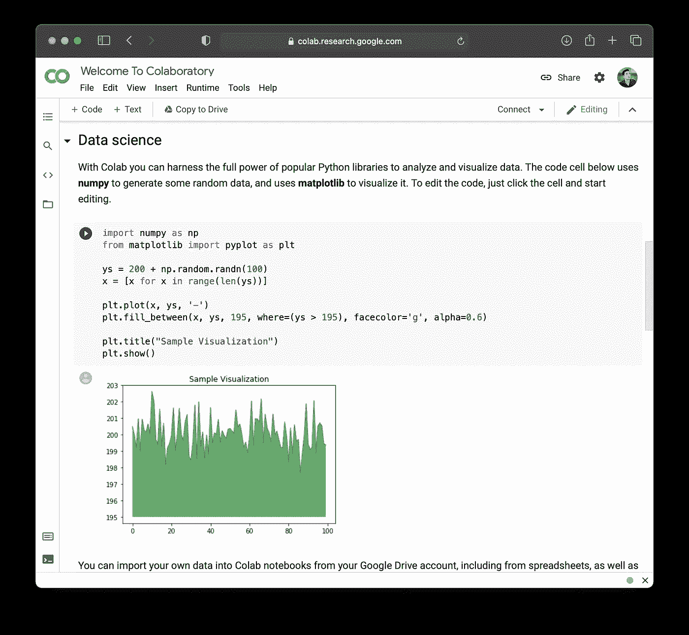*

*谷歌 Colab 笔记本截图。*

*然而，应该注意的是，对于 Google Colab 来说，对高端 GPU 计算资源的访问并不总是有保证的，因为它是在庞大的用户群中共享的，但是具有持久性。特别是，简单地刷新几次浏览器，你就可以访问更高层次的英伟达 T4 GPU 卡，而不是旧的英伟达 K80 GPU 卡。*

*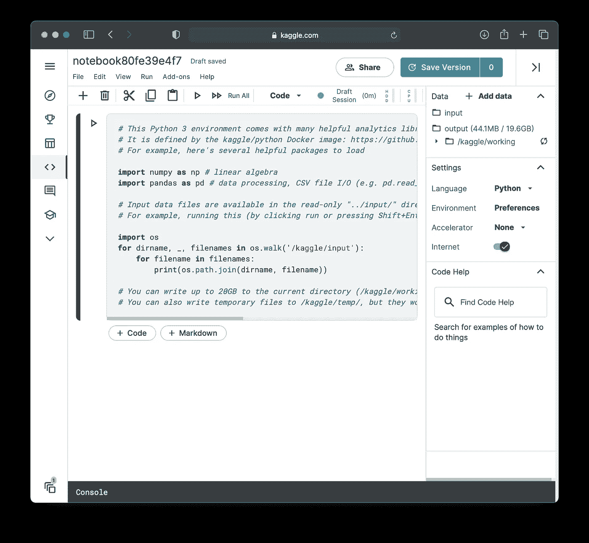*

*Kaggle 笔记本截图。*

*至于 Kaggle 笔记本，每周使用 GPU 有 30 小时的限制。关于 Kaggle Notebook 的一个很好的想法是它对 Python 和 R 的原生支持，而 Google Colab 目前只支持 Python，而暂时支持 R 甚至 Julia 也是可能的。将 Google Colab 和 Kaggle Notebook 区分开来的一个区别是与 Kaggle 相关的内置社区。特别是，如果 Kaggle 上的笔记本对社区有用或有价值，它们也可以被投票支持。*

*除了这种云，虚拟专用服务器还提供了额外的场所，我们可以利用这些场所在几分钟或几秒钟内获得强大的计算能力。这些云服务提供商包括:*

*   *[亚马逊网络服务](https://aws.amazon.com/)*
*   *[谷歌云平台](https://cloud.google.com/)*
*   *[微软 Azure](https://azure.microsoft.com/)*

# *软件*

*没有合适软件的好硬件对你没有好处。有各种各样的软件和工具可以提高你的生产力。让我们看看这些。*

## *规划你的学习计划*

*有条理和有一个结构良好的计划可以帮助你消除时间，否则可以更好地利用。例如，如果在学习数据科学或从事数据科学项目时，您有一个清晰的学习或工作时间表可以参考，那么与匆忙地弄清楚今天、明天或后天您想要学习什么或想要从事什么项目相比，您将处于优势。*

*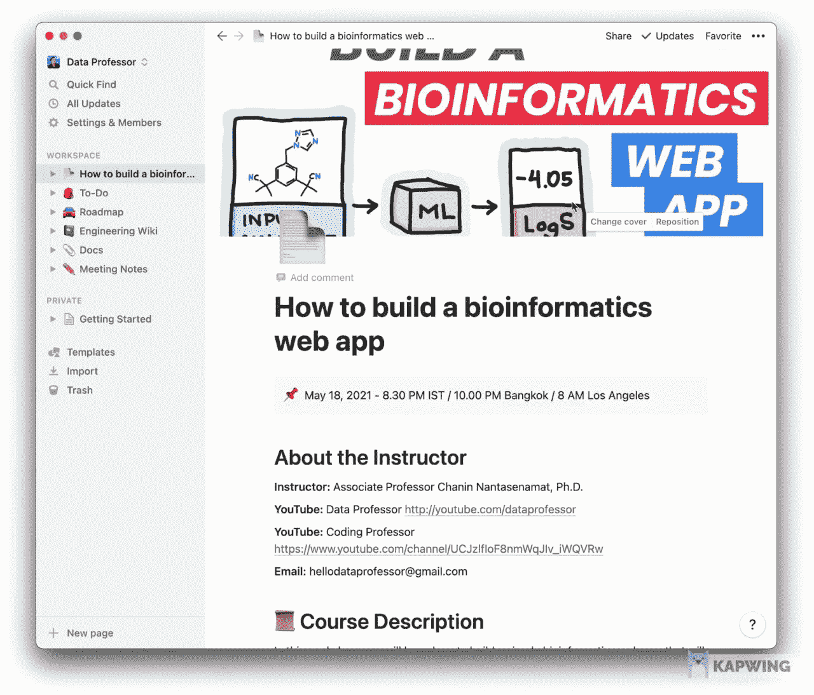*

*我用概念开发的生物信息学研讨会的[大纲截图。](https://www.notion.so/dataprofessor/How-to-build-a-bioinformatics-web-app-00b40d3d2235449993dec58bcece5e38)*

*用一个清晰的时间表和学习计划武装自己，它可以让你在检查和加强你的生产力方面走得很远。想象一下当你没有购物清单就去杂货店购物的情况。虽然你可能会在飞行中发现你需要什么。当你回到家的时候，你可能会发现你可能忘记了购买一些重要的物品。因此，你记下的购物清单可能有助于防止这种情况发生。*

*同样，在您的数据科学学习之旅中，列出您想要了解或深入了解的主题。你可以从做一个简单的清单开始。你可以使用的一个很好的工具是[观念](https://www.notion.so/)，我很快会在我的 YouTube 频道 [*数据教授*](http://youtube.com/dataprofessor) 上制作一个关于它的视频。*

*在我最近在一个生物信息学研讨会上教的在线教程中，我使用了 idea 来创建一个可共享的课程大纲。一件很棒的事情是，创建的教学大纲可以通过点击一个按钮作为网页共享。*

## *集成开发环境(IDE)*

*IDE 可能是任何数据科学项目的支柱，因为它可以被认为是您的数据和代码的家。*

*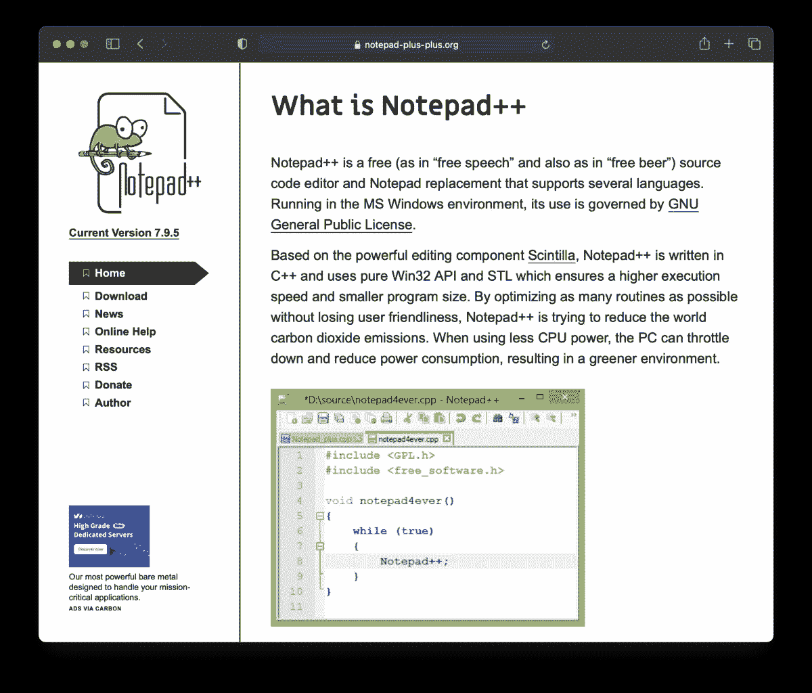*

*显示文本编辑器的 [Notepad++](https://notepad-plus-plus.org) 网站截图。*

*IDE 可以有多种形式，从简单文本编辑器到功能齐全的 IDE。此外，Jupyter 笔记本和它的变体可以被认为是这个系列中的另一个 IDE。*

*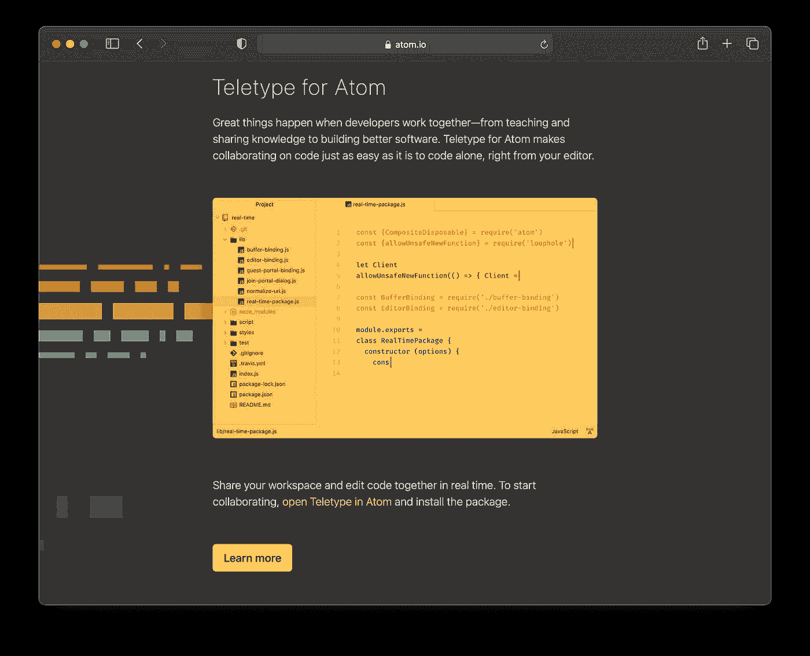*

*显示 IDE 的 [Atom.io](https://atom.io) 网站截图。*

*一个简单的文本编辑器，比如 [Notepad++和](https://notepad-plus-plus.org)Atom 的基础版本是轻量级的，可以帮助你完成简单的项目。应该注意的是，Atom 是可定制的，因此附加的包和主题可以将您的文本编辑器升级到成熟的 IDE。*

*许多开发人员都熟悉的一个强大的 IDE 是 [Visual Studio 代码](https://code.visualstudio.com)或简单的 [VS 代码](https://code.visualstudio.com)。除了语法突出显示，它还支持在集成终端中运行代码、通过 Git 进行版本控制等。应该注意的是，在安装额外的包时，Atom 也支持这些特性。*

*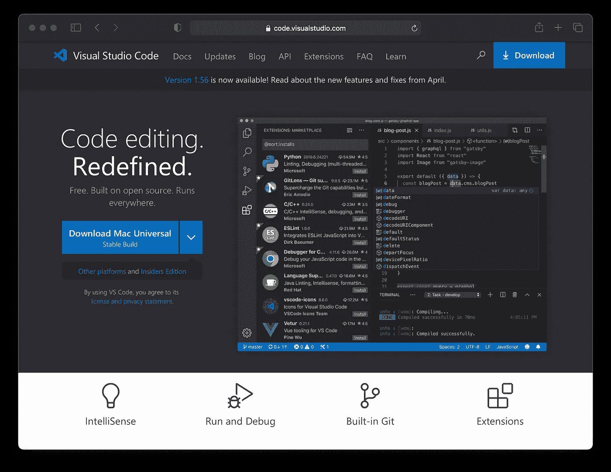*

*显示 IDE 的 [VS Code](https://code.visualstudio.com) 网站截图。*

*VS Code 和 Atom 不仅支持 Python，它们同样可以很好地处理其他编程语言，如 C、C++、Java、Javascript、HTML、Julia 等。此外，两者都有跨平台支持，可以在 Windows、Linux 和 OSX 上运行。*

*其他流行的 Python ide 还包括 [Spyder](https://www.spyder-ide.org) 和 [PyCharm](https://www.jetbrains.com/pycharm/) 。*

*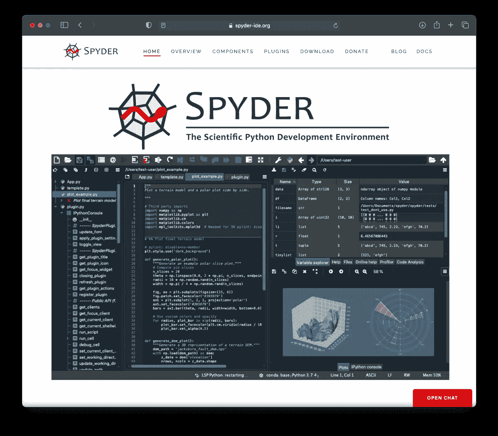*

*展示其 IDE 的 [Spyder](https://www.spyder-ide.org) 网站截图。*

*我非常喜欢 ide 的一个很棒的特性是变量浏览器功能，这是 Spyder 的一个核心特性，让人想起了 MATLAB。这可能是 IDE 最方便的特性之一，因为在变量浏览器中查看变量值的能力消除了在交互式命令行中不断打印变量值的需要。*

*我还喜欢的另一个功能是绘图窗口，在这里我们可以看到绘图的预览，而不必先将它写入文件。现在，其他 ide 也提供插件来支持这些特性。*

*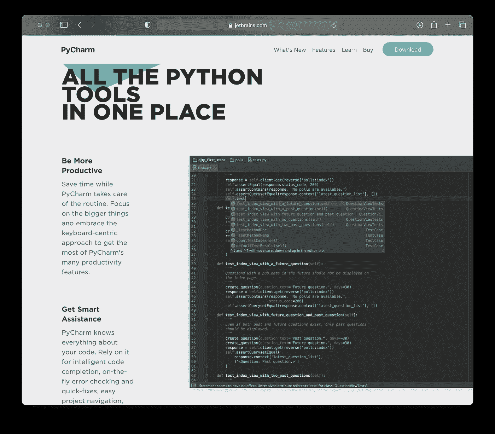*

*显示其 IDE 的 [PyCharm](https://www.jetbrains.com/pycharm/) 网站截图。*

*正如前面提到的 Atom，VS Code，Spyder 和 PyCharm 的用户允许您通过安装额外的插件来进一步定制 IDE。*

*我发现一个特别有用的插件是来自 [Kite](https://www.kite.com/get-kite/?utm_medium=referral&utm_source=youtube&utm_campaign=dataprofessor&utm_content=description-only) 的免费 AI 驱动的代码完成，它目前支持所有主要的 ide。*

*Kite 分析代码的上下文，并通过人工智能建议下一步的行动，即建议你接下来可能输入的代码行。这里节省几秒钟，那里节省几秒钟，久而久之就会像滚雪球一样越滚越大。*

*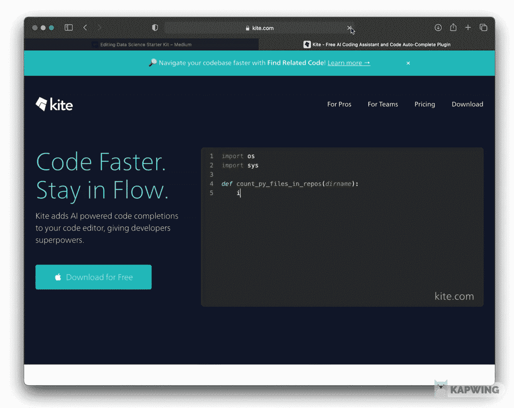*

*[Kite](https://www.kite.com/get-kite/?utm_medium=referral&utm_source=youtube&utm_campaign=dataprofessor&utm_content=description-only) 网站的截屏显示了它在代码完成中的作用。请注意，在键入代码时，建议的代码块是一个下拉列表。*

# *一致性*

*2020 年末，我的好朋友、杰出的数据科学家 YouTuber [Ken Jee](https://medium.com/u/6ee1f7466557?source=post_page-----2d8e2291914b--------------------------------) ，启动了 ***66 天数据*** 计划，旨在为有抱负的数据科学家灌输良好的学习习惯。*

*#66daysofdata 挑战赛旨在帮助培养良好的数据科学学习习惯。除了这些习惯，你还将加入一个欣欣向荣的社区，在那里你可以和其他志同道合的人一起学习和工作。*

*参加挑战很简单。只有两部分。*

1.  *连续 66 天每天学习数据科学。你应该每天至少学习 5 分钟。*
2.  *使用#66daysofdata 标签在您选择的社交媒体平台上分享您的进步。*

*正如 Ken 解释的那样，这有 3 个主要好处([阅读更多相关信息](/why-im-starting-data-science-over-21bec8036ce9)):*

1.  *你养成了每天学习的习惯，这对你在数据科学和机器学习职业道路上的成功是不可或缺的。*
2.  *你习惯于分享你的工作，这可以帮助你为自己创造许多机会。*
3.  *社区认为你有责任。这通常是许多希望学习这些技能的人所缺少的部分。*

# *从事数据项目*

*阅读、观看和聆听是被动的学习，有助于获取新概念，但要真正内化和具体化新获得的知识，将它们转化为行动是必不可少的。为什么通过从事数据项目。*

## *做什么项目？*

1.  ****Kaggle*** — Kaggle 是一个探索可以应对哪些数据挑战的好方法。此外，您还将有机会一瞥由 Kagglers 同事创建的公共笔记本，从而激发您自己的实现。*
2.  ****个人数据项目***——环顾四周，看看什么能激发你的兴趣。例如，如果你是 Medium 上的博客作者，你可以下载你可以分析的用户数据。其实卓媒写[祖烈 Rane](https://medium.com/u/14d5c41e0264?source=post_page-----2d8e2291914b--------------------------------) 写过一篇文章 [*如何用 R*](https://bettermarketing.pub/how-to-analyze-your-medium-stats-with-r-49203db87d1d) 分析你的 Medium Stats。同样，你也可以分析你的网飞观看活动。为此，[Saul Buentello](https://medium.com/u/38f118393fa8?source=post_page-----2d8e2291914b--------------------------------)写了 [*探索你在网飞与 R 的活动:如何分析和可视化你的观看历史*](/explore-your-activity-on-netflix-with-r-how-to-analyze-and-visualize-your-viewing-history-e85792410706) 。有这么多你可能感兴趣的数据，因为如果是这样的话，你会更有可能发现它很有趣，很吸引人。*

## *数据源*

*   ***玩具数据集** —几个 Python 库包括某种形式的玩具数据集，您可以在设置数据项目时进行试验。
    —[Scikit—learn](https://scikit-learn.org/stable/datasets/toy_dataset.html)
    —[tensor flow](https://www.tensorflow.org/datasets)
    —[Seaborn](http://seaborn.pydata.org/generated/seaborn.get_dataset_names.html#seaborn.get_dataset_names)*
*   *[**谷歌数据集搜索**](https://datasetsearch.research.google.com) —是一个搜索引擎，搜索互联网上各种存储库中的数据集。*
*   *[**Data Repository @ Data Professor GitHub**](https://github.com/dataprofessor/data)**—我会偶尔向这个 repo 添加新的数据集供您使用。许多数据集来自我的教程视频，比如你可以自己从头构建的生物信息学数据集。如果你对此感兴趣，那么看看《T21》的 6 集《从头开始的生物信息学》系列播放列表。***

# ***分享你的知识***

***如上所述，强烈建议您将所学分享给志同道合者的数据社区，以便养成日常学习和负责任的习惯。除了在 Twitter 或 LinkedIn 上发布简短的帖子，你还可以在 Medium 上以博客的形式分享你所学到的东西。***

***还有什么比写下你的知识更好的方式来分享你的知识呢(或者甚至制作一个关于它的视频并在 YouTube 上分享)。写一个辅导博客是巩固你所学知识的好方法，也可以帮助其他人学习。***

***让你开始写第一篇博客的一些关键资源是考虑以下视频/文章:***

*   ***[由](/questions-96667b06af5) [TDS 编辑](https://medium.com/u/7e12c71dfa81?source=post_page-----2d8e2291914b--------------------------------)为走向数据科学撰稿***
*   ***昆西·拉森(freeCodecamp 创始人)的技术博客文章*** 
*   ***[让我们从零开始写一篇数据科学博文](https://youtu.be/NK6UYg3-Bxs)
    作者阿卡什(Jovian 的联合创始人兼首席执行官)***
*   ***[媒体博客入门:由](https://youtu.be/3OyCQL_QZjg)[祖列·雷恩](https://medium.com/u/14d5c41e0264?source=post_page-----2d8e2291914b--------------------------------) ( [媒体作家](https://zulie.medium.com)和 [YouTuber](https://www.youtube.com/channel/UCuaNaHUq_QchHPhbnBF0q6w) )为媒体新手
    准备的 4 部分演练***

# ***建立你的作品集和作品集网站***

***投资组合有助于您展示您的数据科学项目，这些项目可能会吸引潜在的雇主，并允许您存档您在数据科学方面学到的专业知识。共享您的数据科学项目的代码和数据也可能对数据社区，尤其是其他有抱负的数据科学家大有裨益。那么，您在哪里共享项目的数据和代码呢？推荐的平台是 [GitHub](https://github.com) ，尽管也有类似的替代平台，如 [BitBucket](https://bitbucket.org) 或 [GitLab](https://about.gitlab.com) 。***

***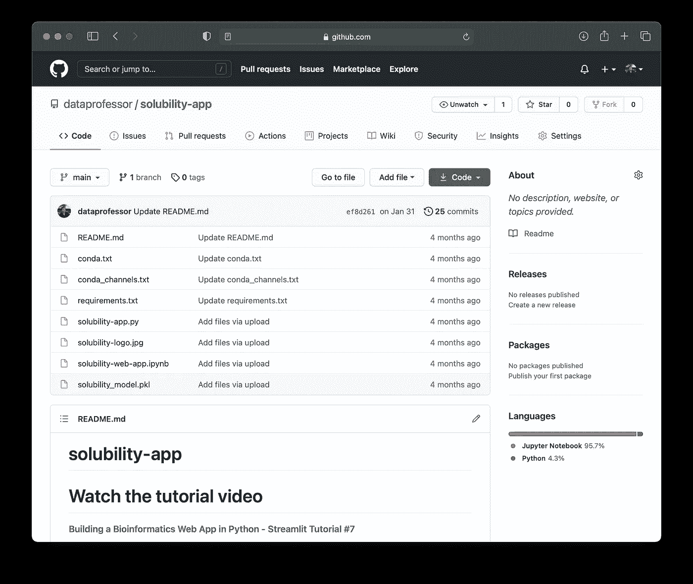***

***[GitHub 知识库](https://github.com/dataprofessor/solubility-app)用于用 Python 构建生物信息学 Web 应用。***

***左边的截屏显示了一个 [GitHub 库](https://github.com/dataprofessor/solubility-app)的例子，这是我在 YouTube 频道上制作的关于 [*用 Python*](https://youtu.be/iZUH1qlgnys) 构建生物信息学 Web 应用的教程。***

***如您所见，所有代码和数据都在 GitHub 知识库上公开共享(以促进研究的可重复性),这将允许其他人构建该项目。***

***我还制作了一个视频，在视频中，我在[上一步一步地演示了如何在 GitHub](https://youtu.be/fCXBaEnPzgo) 上创建自己的数据科学组合。***

***除了拥有 GitHub 个人资料来分享您的数据科学项目之外，portfolio 网站还可以被视为一张数字名片，您可以用它来打造自己的个人品牌。作品集网站当然会包含项目信息，但也可能会提供你希望分享的额外信息(如教育背景、工作经验等)。).***

## ***订阅我的邮件列表，获取我在数据科学方面的最佳更新(偶尔还有免费赠品)!***

# ***关于我***

***我是泰国一所研究型大学的生物信息学副教授和数据挖掘和生物医学信息学负责人。在我下班后的时间里，我是一名 YouTuber(又名[数据教授](http://bit.ly/dataprofessor/))制作关于数据科学的在线视频。在我制作的所有教程视频中，我也在 GitHub 上分享 Jupyter 笔记本([数据教授 GitHub page](https://github.com/dataprofessor/) )。***

*** [## 数据教授

### 数据科学、机器学习、生物信息学、研究和教学是我的激情所在。数据教授 YouTube…

www.youtube.com](https://www.youtube.com/dataprofessor) 

# 在社交网络上与我联系

✅YouTube:[http://youtube.com/dataprofessor/](http://youtube.com/dataprofessor/)
♇网站:[http://dataprofessor.org/](https://www.youtube.com/redirect?redir_token=w4MajL6v6Oi_kOAZNbMprRRJrvJ8MTU5MjI5NjQzN0AxNTkyMjEwMDM3&q=http%3A%2F%2Fdataprofessor.org%2F&event=video_description&v=ZZ4B0QUHuNc)(在建)
♇LinkedIn:[https://www.linkedin.com/company/dataprofessor/](https://www.linkedin.com/company/dataprofessor/)
♇Twitter:[https://twitter.com/thedataprof](https://twitter.com/thedataprof)
♇Facebook:[http://facebook.com/dataprofessor/](https://www.youtube.com/redirect?redir_token=w4MajL6v6Oi_kOAZNbMprRRJrvJ8MTU5MjI5NjQzN0AxNTkyMjEwMDM3&q=http%3A%2F%2Ffacebook.com%2Fdataprofessor%2F&event=video_description&v=ZZ4B0QUHuNc)
♇github:[https://github.com/dataprofessor/](https://github.com/dataprofessor/)
♇insta gram:【t2t***