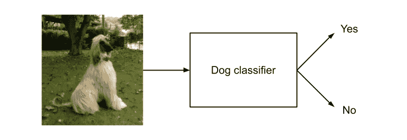
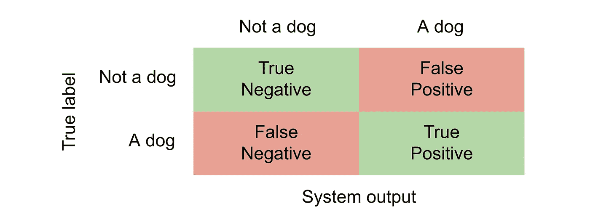

# 非数据科学家如何为人工智能项目带来价值的 5 个技巧

> 原文：<https://towardsdatascience.com/data-science-survival-guide-for-non-technical-colleagues-4ec0792ad434?source=collection_archive---------52----------------------->

## 面向非技术同事的数据科学生存指南

安德里亚斯·瓦格纳在 [Unsplash](https://unsplash.com?utm_source=medium&utm_medium=referral) 上拍摄的照片

我之前的文章技术性很强，主要面向数据科学家同事，相比之下，我这次决定写一篇针对*其他团队角色*的文章，这些角色经常出现在数据科学项目中，我们作为数据科学家与之合作。

无论你是一名**产品经理**、一名**领域专家、**一名 **scrum master** ，甚至是一名没有多少数据科学经验的**开发人员**，如果你参与了一个数据科学项目并真正关心其结果，我将尝试给你一些提示，告诉你该期待什么、如何进行，以及一般来说如何理解实际发生的事情。

## “人工智能”

让我先澄清一些进入项目时可能出现的误解。“人工智能”这个流行语经常以多种方式和语境使用，这可能会导致不适当的期望。它最初可能被认为是一个神奇的盒子，可以解决你所有的问题，你只需要问一下。不幸的是，这与现实相去甚远。

事实是，开发一个可靠工作的人工智能系统花费的时间和精力与开发任何其他软件一样多，甚至更多。此外，这条路并不总是像经典软件开发中那样直截了当，而且可能会一路走来。这个过程通常需要做**多次实验**，根据实验结果决定下一步行动。这也意味着很难提前计划并给出合理的时间估计。

此外，你应该意识到，在某些情况下，使用人工智能的方法实际上可能不是你的问题的正确解决方案，也不是值得追求的东西。确保在真正投入之前也考虑其他选择，如果你决定继续，请准备好人工智能可能不一定按照你想象的方式工作。

> 秘诀 1:正确设定你的期望，考虑所有的选择。

## 输入和输出

接下来，团队就需要解决的任务达成一致是至关重要的，并在项目的整个过程中牢记这一点。乍一看，这似乎是显而易见的，但现实往往不同。

真正需要的是具体说明人工智能系统的**输入**是什么，更重要的是，它的**输出**是什么。给你一个例子，想象你正在建立一个狗分类系统，它能够告诉你，图片中是否有狗。这个系统的输入是一个图像，输出是 y *es* 有狗或者 *no* 没有。

一个狗分类器的例子，展示了它的输入和输出。图片作者。

输入和输出决定了整个系统如何工作，需要什么样的数据来构建它，以及最终如何评估解决方案。因此，在项目中间**改变它们**(例如在图片中也检测到一只猫)几乎总是会有**负面结果**，并且实际上将项目重置回开始。

> 技巧 2:仔细指定任务的输入和输出，不要改变它们。

## 数据

一般我们说一个 **AI 系统=数据+代码**。这意味着数据本身是系统的一部分，并定义了系统如何工作。虽然数据科学家可以独自处理所有的编码，但是没有数据，无论他多么熟练和有经验，他也做不了什么。

数据需要**与您试图解决的任务**相对应，这意味着它们必须*以您定义的相同方式包含输入和输出信息*。在最好的情况下，包含这两种信息的数据在项目开始之前就已经收集好了，这意味着数据科学家已经可以开始构建系统了。

也可能发生这样的情况，您只有输入信息可用的数据，而您**遗漏了输出**。回到我们的狗分类器，一个例子是我们有很多动物的图片，但是我们不知道哪些是狗，哪些不是。在这种情况下，我们人类需要自己查看图片，并手动分配正确的输出标签——这一过程称为**数据标签**。系统需要输出标签，以便学习将它们分配给给定输入的任务，因此，在标记数据时非常精确非常重要，因为您实际上是在教导系统。

最后一个场景是**你没有任何数据**对应于我们任务的输入和输出。如果发生这种情况，明智的做法可能是重新考虑是否一开始就开始这个项目。一个可行的方法是尝试在网上找到一些合适的数据集，并使用它们。然而，你的任务越独特，就越难完成。

> 技巧 3:定义人工智能系统应该如何使用数据工作。

## 估价

在您设法收集到合适的数据集之后，数据科学家可以开始训练和评估系统。

其工作方式是将数据集分成**个训练集和测试集。**不出所料，训练集用来训练系统，测试集用来评估系统。您将听到的所有指标都将在测试集上进行*计数，系统在训练期间实际上从未看到这些数据，就像它从未看到未来将用于生产的数据一样。这使得评价公平并反映了现实。*

你将听到的*得出的数字和指标有时可能具有欺骗性*。从经验来看，如果一些报告的数字说 99.8%或类似的准确性，很可能有问题。因此，不要只是听和看这些数字，希望它们尽可能的高，而是试着**理解**它们到底是如何计算的，以及它们代表了什么。不要犹豫，请数据科学家解释任何给定的指标，他或她会很乐意这样做。

此外，您可以并且应该**影响实际报告和优化的指标**。数据科学家对领域的了解没有你多，这可能是你最初参与项目的原因。这是你大放异彩的机会。通常情况下，系统所犯的某些类型的错误会比其他错误对你的伤害更大。回到我们的狗分类器的例子，当你说某样东西是狗，而它实际上不是(假阳性错误)，这可能比你不说某样东西是狗，而它实际上是(假阴性错误)更伤害你。这些都可以反映在使用的指标中，因此，在开始时*就使用的指标达成一致是一个好的做法*，就像您就输入和输出达成一致一样。

显示 dog 分类器错误类型的矩阵。图片作者。

> 技巧 4:优化反映现实的、每个人都理解的指标。

## 误差分析

一旦系统经过培训和评估，而您对其性能仍不满意，就需要**找到改进**它的方法。数据科学家对此可能并不总是有直接的答案，因此，您需要进行错误分析。

这意味着手动**查看系统正在犯的错误**，并试图确定为什么会这样。您通常会对实际的错误感到惊讶，但也会对系统在生产中可能出现的故障有一个总体的感觉。再次使用我们的狗分类器，错误可能是例如图像太模糊，狗的一部分被另一个对象遮挡，或者图像包含一只与狗相似的狼。另一种错误可以是，人类赋予的*标签根本就是错误的*，系统其实是正确的。当数据标注任务完成得非常快，或者没有具体的指导方针时，通常会发生这种情况。

不要被一个错误冲昏了头脑，而是试着找出模式并量化它。分析的输出不应该是“我看到有一只狼被分类为狗”，而是“30%的错误是狼被分类为狗，20%是模糊的图像，5%是错误的标签等。”。并非所有类型的错误都可以轻易修复，量化它们可以帮助确定哪些是真正值得追求的，以及如果你成功了，潜在的性能增益**是多少**。

> 技巧 5:系统地进行错误分析，关注模式而不是单个例子。

## 结论

这是我认为你的角色可以带来最大价值的项目的 5 个技巧和阶段。我希望它能让你的项目运行得更顺利，让数据科学家和其他团队成员更开心。

感谢您的阅读！

</how-much-time-can-you-save-with-active-learning-b4886f5da462>  </1-to-5-star-ratings-classification-or-regression-b0462708a4df> 