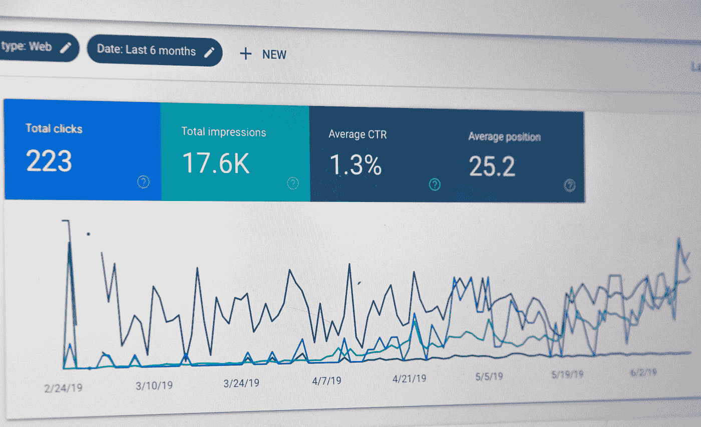

# 数据科学:推动可持续销售和增长的秘密

> 原文：<https://towardsdatascience.com/data-science-the-secret-to-driving-sustainable-sales-and-growth-7ac7bda56fff?source=collection_archive---------42----------------------->

## 数据科学和机器学习是用来从花哨的风投那里筹集资金的时髦词汇吗？不完全是。了解如何以及为什么您需要通过数据科学增强销售引擎的能力。

斯蒂芬·菲利普斯-Hostreviews.co.uk 在 [Unsplash](https://unsplash.com?utm_source=medium&utm_medium=referral) 上的照片

> ***加 a 变，加 C'est La Même 选了***
> 
> *让·巴普蒂斯特·阿方斯·吉田*

万一你不会说法语(或者你几乎忘了高中学的所有东西——看看你们加拿大人！).永恒的谚语；“事物越是变化，就越是保持不变”，这意味着无论我们经历怎样的动荡变化，现状都会得到巩固。

我们首先想到的是销售运营。在过去的几十年里，销售运作已经取得了长足的进步。以前，当我们很多人想到销售的时候，首先映入我们脑海的是一个肮脏的二手车推销员，试图在每个角落向你搜刮钱财。或者那个戴软呢帽的家伙，挨家挨户地推销下一个最好的吸尘器或特百惠餐具。甚至在过去的一年里，我们已经看到销售业务发生了重大转变，从面对面销售转变为几乎完全通过 Zoom 来满足我们的潜在客户。

我们的观点是，随着时间的推移，销售流程发生了很大变化。不管市场的趋势和变化如何，销售运营总是围绕**卖得更好**、**卖得更快**和**卖得更多**。这毕竟是资本主义市场经济。

# 2021 年的销售运营

公平地说，在过去的几十年里，销售变得更加困难了。

信息可以更广泛地获得。竞争更加激烈。由于这个原因，现代顾客有更高的期望，在购买之前必须有信任感。[在当今社会，建立牢固、诚实的关系对于推动销售至关重要。](https://www.forbes.com/sites/ryanrobinson/2019/03/13/how-sales-has-changed/?sh=39e8c6d43985)

我们也正在经历第四次技术革命。技术已经席卷了销售业务，并简化了我们的许多日常流程。似乎有一种服务或工具可以满足你的任何想象。然后你眨眼，不知何故，有人创造了另一种工具，使你的业务更有效率。

尽管有各种令人惊叹的软件服务和解决方案，许多销售团队仍然生活在石器时代。或者被称为…超级明星文化。

# 巨星文化销售

是高度个人主义的。依靠几个人带领团队达到销售配额。精力和资源都倾注在少数几个似乎能把世界扛在肩上的销售奇才身上。与此同时，销售团队的其他成员没有得到改进流程所需的支持。

这种文化不好有两个原因。首先，销售超级明星并不常见。他们知道自己的价值，如果他们离开公司是为了一份更好的工作，你最好祈祷另一份工作。

其次，当焦点集中在销售奇才上时，销售团队的其他人就被遗忘了。他们没有得到成长为下一个销售奇才所需的辅导或指导。他们也知道自己的价值，如果缺乏工作文化，他们也会消失。没有人想要一个流失和燃烧的文化。

# 数据科学技术阻止巨星文化。

近年来最大的技术变革之一(我们

将数据科学技术集成到销售流程中。这完全改变了决策。而不是根据观察和意见做决定。我们可以更加自信地根据数据和数字做出决策。我们不会被迫依靠几个销售超级明星来维系。

数据科学结合了领域专业知识、编程技能以及数学和统计知识，以从数据中提取有意义的见解。

通过采用数据科学方法，我们选择了一种[科学驱动的文化](https://hbr.org/2020/02/10-steps-to-creating-a-data-driven-culture)。

# 科学驱动的文化优先考虑:

1.  **技术**被用来提高我们日常工作的效率。它也是收集必要数据以做出明智决策的重要工具。
2.  **流程**就是你的团队正在做的事情，让销售漏斗中的机会下移。通过对流程进行优先排序，责任被放在销售漏斗步骤的功能上，而不是个人。当发现问题时，我们关注的是如何修复流程，而不是人。
3.  团队合作对科学驱动的文化至关重要。所有的过程都需要记录并在组织内共享。当犯了错误或发现了最佳实践的见解时，他们不应该作为个人的秘密。相反，它们应该被共享，以使每个人和整个组织受益。
4.  当我们从错误和成功中学习时，我们就获得了技能。这是一个持续的过程。当我们不断收集数据并获得反馈时，我们能够在最困难的地方学习和改进。

科学驱动的文化是基于数字和数据的持续反馈、学习和决策。它是关于修复薄弱的过程，而不是修复人。

# 数据科学的工作原理

数据科学依赖于数字。不是意见。不是直觉。而是冰冷、坚硬、可计算的数字。

指标必须是可测量的和客观的。如果你的衡量标准是主观的，基于观察和个人经验——把它们当作一种意见。恕我直言，观点并不重要，也不能保证结果。没有数字和数据，你的衡量标准是没有意义的,还会有争议。

让我们使用**主观方法**将科学方法应用于销售漏斗:

1.  **观察**:我们没有完成销售配额:(
2.  问题:为什么我们没有完成销售配额？
3.  假设:嗯，看起来销售代表打得不够多。
4.  **预测**:如果销售代表打更多的电话，我们就会卖出更多。
5.  **测试**:*销售代表打更多电话*
6.  **结果**:仍未达到销售配额。
7.  **提炼**:嗯，那没用。可能是 ______。(并重复)。

使用主观方法(也就是我们的直觉)，我们倾向于进行观察，做出假设，并测试它。当你的第一个假设不是问题时，冲洗并重复步骤 3-7。重复这些步骤是对时间和资源的巨大浪费。

然而，当我们使用数据科学并认识到漏斗中的某个地方存在性能差距时。只要看看这些数字，就能很容易地找出问题所在。没必要玩猜谜游戏。从那里可以提供反馈，并可以针对销售漏斗中的确切问题制定具体的解决方案。这意味着解决问题的周转时间大大加快。而不是重复第 3-7 步，直到你准备放弃并试图解决下一个问题。

这对个人和组织都是有益的。从个人主义的角度来看，我们可以分析一个表演者在哪里成功，在哪里挣扎。这种反馈是个性化的，可以帮助个人改进他们需要的地方。

在更大的范围内，组织可以使用这些数据来制定更高效的销售流程，并为未来客户的下一步最佳行动提供有价值的见解。

# 拿到数据了吗？

大多数组织一旦达到一定的规模，就会有一个正式的[销售流程，并且正在收集数据](https://www.forbes.com/sites/danielnewman/2019/04/26/analytics-ai-how-sales-can-get-the-most-from-data/?sh=22a0ad6bc872)。这确保了它们可以继续扩展。典型的销售报告分解了基本的关键绩效指标(KPI)。电话/邮件数量、转化率、失去的机会、利润率、客户获取成本等等。并不是说这些都是不好的指标。它们对每个企业都是必要的。问题是他们并没有讲述整个故事。

KPI 往往很高。他们忽略了更好的指标，这些指标可以让我们更准确地了解到底发生了什么。了解你所在的行业，知道哪些 KPI 与你试图解决的问题相关，这一点很重要。此外，如果您希望在销售运营中采用基于科学的方法，关键是要有人知道如何提出正确的问题，能够提取必要的数据并提出有意义的解决方案。

# 作者:

[**莎拉·韦斯特伯里**](https://www.linkedin.com/in/swestbury/) 是 [integrityCo](https://integrityco.io/) 的一名人类学地下转需求生成专家。凭借以人为本的学术和工作背景，Sarah 热衷于与她的网络建立有意义和信任的关系。虽然数据科学、人工智能是一个高度技术性的领域，但 Sarah 努力使这些服务简化和可访问，以帮助公司实现他们的目标。

[**Hamid Omid**](https://www.linkedin.com/in/hamid-omid-55055b54/) 是 [integrityCo](https://integrityco.io/) 的创始人，在数据科学、机器学习、产品管理领域拥有多年的经验，极具幽默感，Hamid 喜欢帮助公司识别有价值的变革机会，专注于数字产品和大数据。随着行业开始了解人工智能等新技术的未开发资源，高管们正在寻找创新战略，并从他们的数据中创造价值。哈米德分享了他的专业知识，以帮助公司规划成功的人工智能产品，并实现其成功的最大潜力。