# 基于 4 年 Kaggle 调查的数据科学趋势

> 原文：<https://towardsdatascience.com/data-science-trends-based-on-4-years-of-kaggle-surveys-60878d68551f?source=collection_archive---------23----------------------->

## 从 2017 年到 2020 年，数据科学领域的多样性、工资以及使用的工具和算法发生了怎样的变化？

自 2017 年以来，网站[Kaggle.com](http://kaggle.com)对数据科学家和其他对数据科学和机器学习领域感兴趣的人进行了年度调查。调查问题从性别和高等教育水平等人口统计问题，到有关编程语言、工具和使用的机器学习算法的问题。每年调查的完整描述以及结果可以在 Kaggle 的网站上找到 [2017](https://www.kaggle.com/kaggle/kaggle-survey-2017) 、 [2018](https://www.kaggle.com/kaggle/kaggle-survey-2018) 、 [2019](https://www.kaggle.com/kaggle-survey-2019) 和 [2020](https://www.kaggle.com/kaggle-survey-2020) 。

因为现在是年底，而且现在有四年的调查结果，我认为看看过去几年该领域的趋势会很有趣。新的算法和技术还在继续发展，所以看看新技术是否会取代旧技术，或者只是与现有技术一起使用，这将会很有趣。

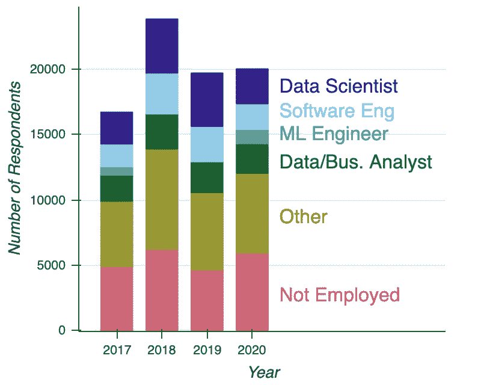

每年接受调查的人数，每种颜色代表一个不同的职位。“未就业”类别包括那些被认定为“学生”的人。

受访者人数一直居高不下，每年约有 17，000 至 24，000 人参与。其中，每年约有 2，400 至 4，100 名调查受访者将自己的职位称为“数据科学家”。左边是回答者人数的图表，按他们报告的职位分类。

许多受访者拥有数据科学家之外的头衔。出于本文的目的，我将“业务分析师”和“数据分析师”合并为一类。由于某种原因，“机器学习(ML)工程师”只在 2017 年和 2020 年的调查中作为选项出现，因此在 2018 年和 2019 年的结果中缺少这一类别。

在深入研究结果之前，有许多问题只在一两次调查中被问到，所以我在此不包括这些信息。在四年的调查中，至少有三年一致的问题是人口统计学问题(如年龄、职称等。)以及关于工作中积极使用的编程语言和机器学习算法的问题。

此外，这里的重点是查看数据科学在行业中的实践趋势，事实上，Kaggle 调查中的许多问题都是针对工作专业人员的。因此，我将重点放在受雇于该领域的受访者身上。

## 多元化、薪酬和教育

就受雇为数据科学家或从事与数据科学相关工作的人而言，绝大多数是男性。在过去的几年里，非男性的比例略有提高，但除了数据和商业分析师，该领域的男性比例一直稳定在 80%以上。

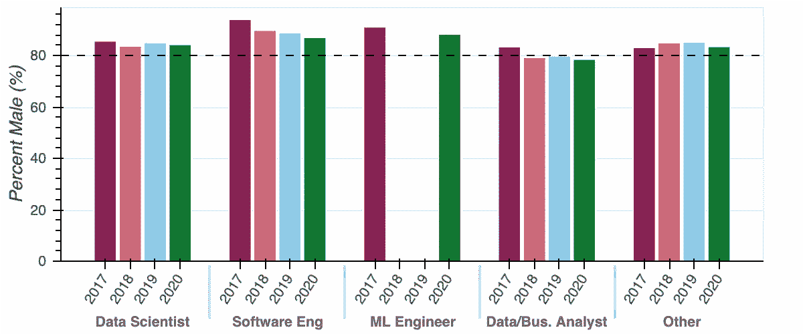

每个领域中被调查者认为是男性的百分比。

大多数职位的年薪总额中值(即工资加奖金)都略有增加，只有“软件工程师”职位除外，其工资保持不变。

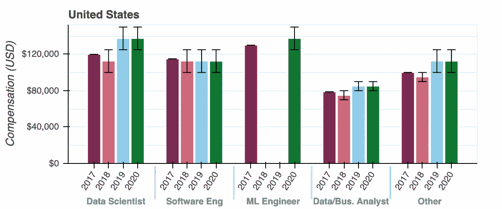

五类在职专业人士(数据科学家、软件工程师、机器学习工程师、数据和业务分析师，以及职称不同于上述任何一类的人)的总薪酬中值(工资+奖金)。这里显示误差线是因为 2017 年后，受访者被要求选择一个工资范围，而不是给出一个具体的数字。

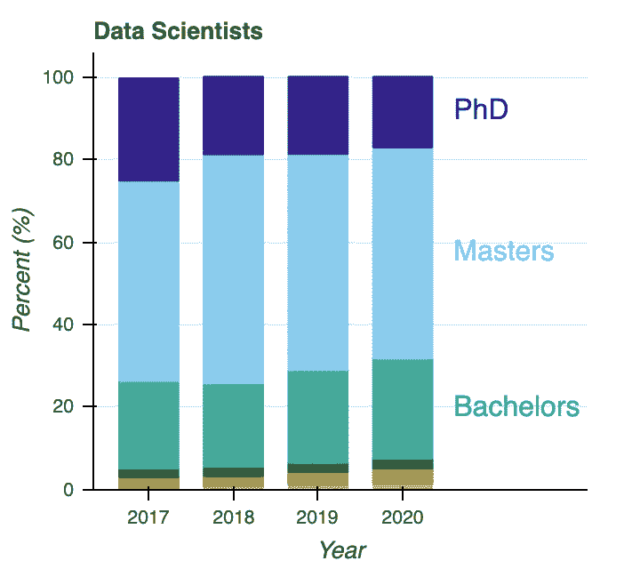

职称为“数据科学家”的调查受访者获得的最高学位分布。

我在这里看到的最后一个人口趋势是数据科学家接受的正规教育。有趣的是，既没有博士学位也没有硕士学位的数据科学家的比例略有增加，从 27%增加到 32%。数据科学和机器学习方面的在线课程以及训练营已经激增。也许，这些调查显示的趋势反映了越来越多的人通过这种非正规教育进入这个领域。此外，拥有研究生学位的员工比例稳步下降，这在拥有除“数据科学家”之外的其他职称的受访者中普遍存在。

## 使用的编程语言

对于那些进入数据科学领域的人来说，一个常见的问题是他们应该学习哪种编程语言。查看数据科学家、软件工程师和机器学习工程师使用的编程语言，超过 78%的人在调查的四年中报告在工作中使用 Python。对于数据和业务分析师来说，使用 Python 的比例显著增加，从 61%增加到 87%。

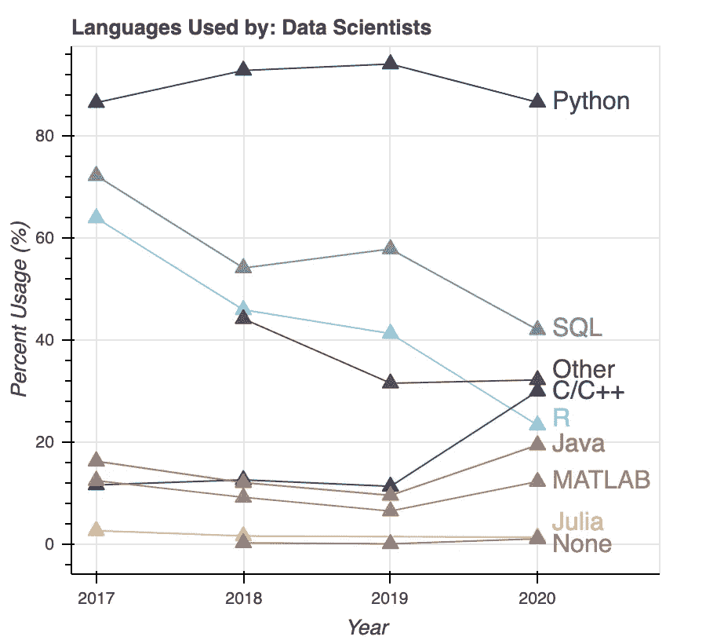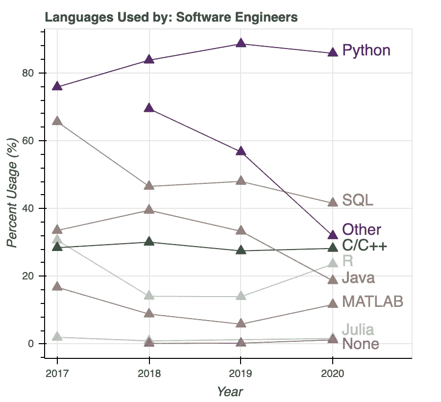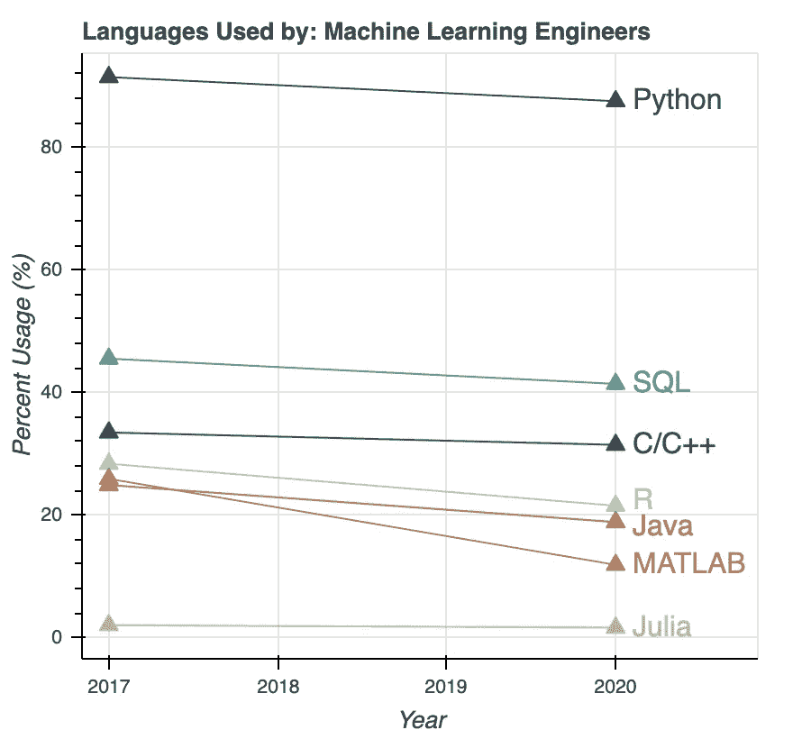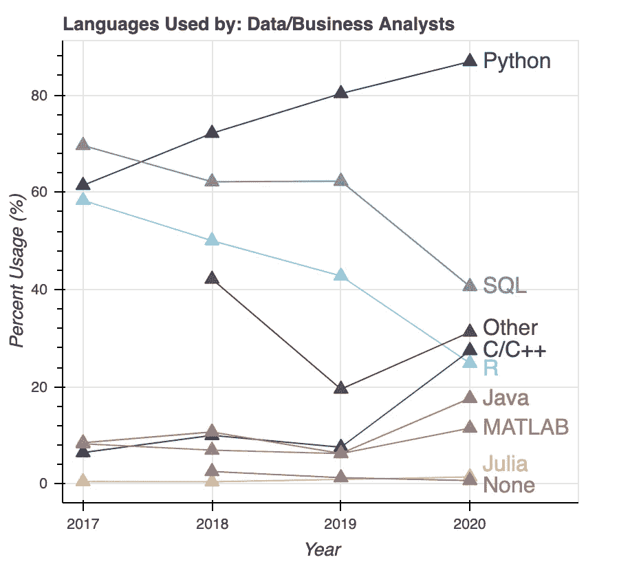

使用所列编程语言的不同职位类别的调查受访者的百分比。调查对象可以选择他们所使用的编程语言。

使用 R 的数据科学家仍然有一个坚实的阵营，但是，在现场使用 R 的数据科学家的比例正在迅速下降。对于数据科学家和数据分析师来说，使用 R 的员工比例下降了 33 个百分点以上(数据科学家从 64%下降到 23%)。

在问数据科学从业者正在积极使用什么编程语言的同时，Kaggle 还问受访者，他们最建议有抱负的数据科学家学习哪种语言。总体而言，推荐 Python 的百分比有所增加，其中 R 语言的相应减少幅度最大。

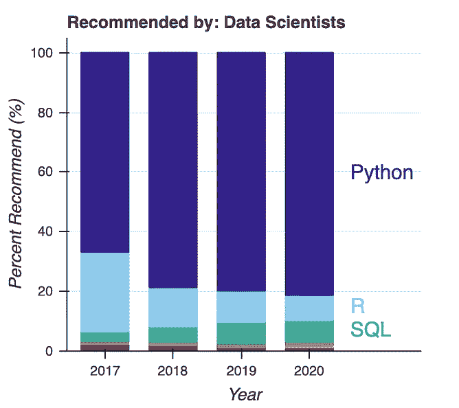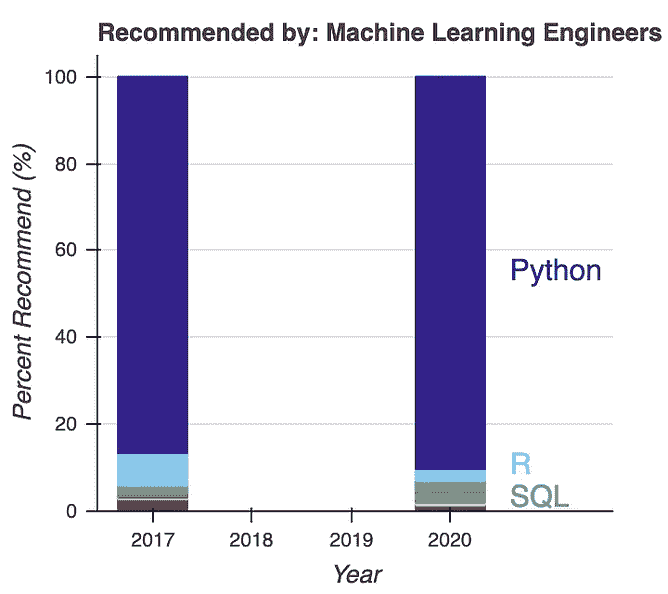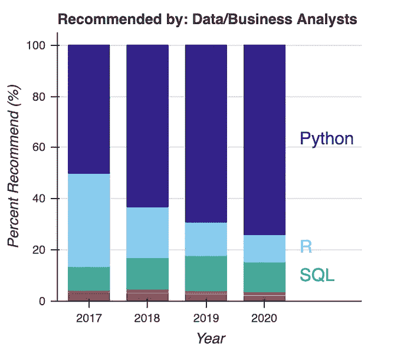

不同职位类别的调查受访者中推荐有抱负的数据科学家学习所列编程语言的百分比。每位受访者只能选择一种语言。

另一个有趣的趋势是使用 SQL 的数据科学家和数据分析师的比例下降了大约 30 个百分点。然而，尽管如此，推荐有抱负的数据科学家首先学习 SQL 的数据科学家的比例实际上略有增加(从 3%增加到 7%)。

对于机器学习工程师来说，不同编程语言的使用量一直保持持平，甚至略有下降。这可能是因为机器学习工程师越来越专注于单一语言，而较少使用各种语言，或者他们使用的其他语言比调查中包括的一些语言更多。虽然，就语言机器学习工程师推荐学习而言，推荐 Python 的百分比略有增加。

对于职称不同于图中所示的人，也有类似的趋势，Python 的使用增加了，而 R 的使用减少了。

## 使用的机器学习算法

最后，数据科学的核心是用于分析数据和做出预测的技术。在某些年份的调查中，存在关于一般技术以及在数据科学工作流程的不同部分花费多少时间的问题。然而，在四次调查中有三次出现的一个问题是专门关于所使用的机器学习算法的(由于某种原因，这个问题没有出现在 2018 年的调查中)。

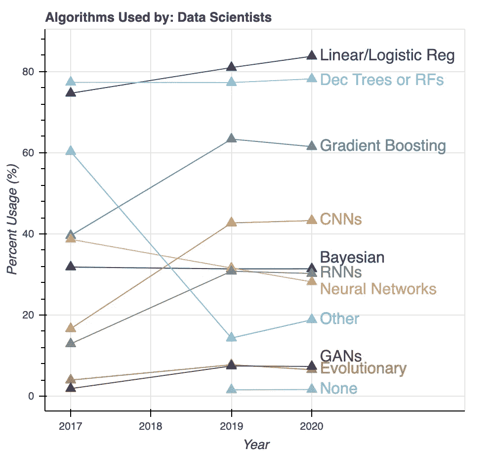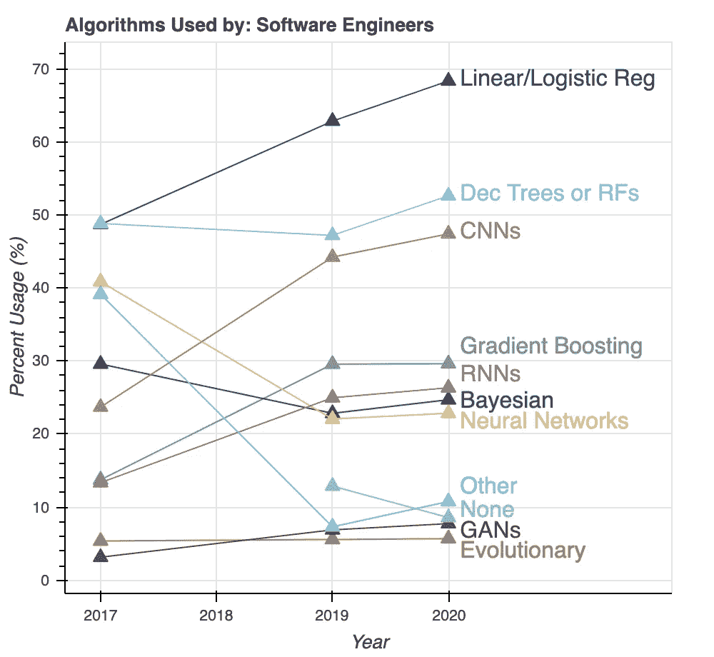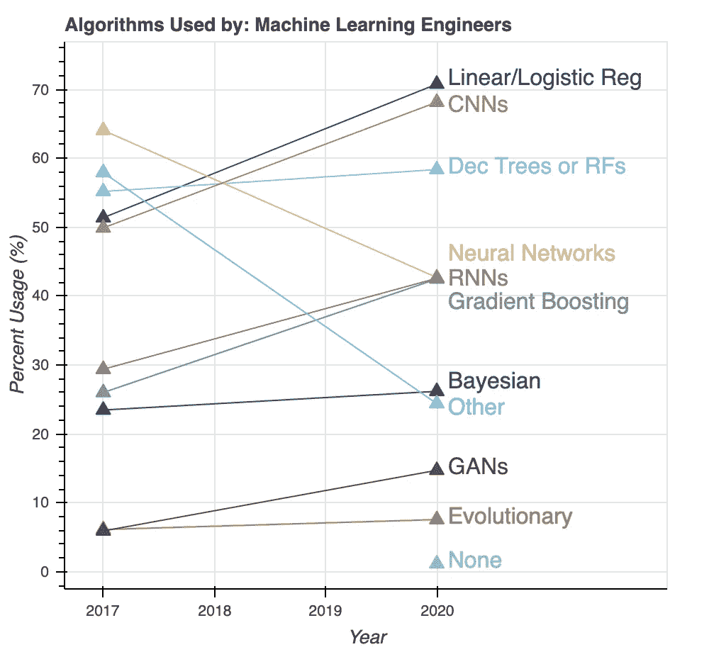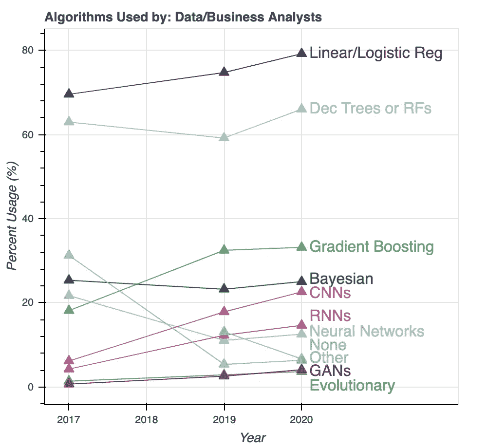

使用所列机器学习算法的不同职称类别的调查受访者的百分比。调查对象可以选择他们所使用的算法。

也许让有抱负的数据科学家放心的是，更“基本”的线性和逻辑回归方法在从业者中仍然非常流行，超过 80%的数据科学家说他们在工作中使用这些方法。

一般来说，机器学习算法的第二个最受欢迎的类别是决策树和随机森林。尽管梯度推进机器(如 XGBoost)越来越受欢迎，但这些方法的受欢迎程度一直保持稳定。

另一种广泛使用的算法是卷积神经网络(CNN)，它通常用于图像数据。对于每一类职位，CNN 的使用率增加了 20 个百分点。对于机器学习工程师来说，这种方法仍然像线性和逻辑回归一样受欢迎。

虽然不像 CNN 的使用那样引人注目，但用于时间序列和序列数据(如单词序列)的递归神经网络(rnn)的使用也有所增加。

有趣的是，标准密集神经网络的使用在过去四年中实际上已经减少了。也许，这是由于越来越多的使用更专门的神经网络，如 CNN 和 RNNs。

本次调查中遗漏的一类机器学习算法是无监督的学习方法，如聚类和维度缩减技术。看到这些技术的使用趋势也是很有趣的。

## 摘要

经过四年的 Kaggle 调查数据，以下是数据科学中一些值得进一步研究的重要趋势:

1.  在过去几年里，拥有研究生学位的数据科学家的比例在缓慢下降。
2.  Python 仍然占主导地位，大约 80%或更多的人在他们的工作中使用它。甚至在业务和数据分析师中，越来越多的员工使用 Python 进行报告。
3.  数据科学从业者和数据分析师使用 SQL 的减少表明，人们越来越多地使用其他方法来访问、存储和操作他们的数据。
4.  数据科学从业者继续积极地使用更基本的线性和逻辑回归方法，至少在他们的一些工作中。
5.  在过去几年中，卷积神经网络(CNN)和递归神经网络(RNNs)等专用神经网络的使用迅速增加，而传统密集神经网络的使用在同一时期有所下降。

希望 Kaggle 在未来几年继续进行这项调查，以便我们可以继续研究这些趋势，并随着数据科学领域的不断发展，发现一些新趋势。

这里需要注意的是，我没有对通货膨胀进行调整，所以由于通货膨胀的影响，工资的增长可能没有看起来那么显著。

*[2]我只包括美国受访者的工资，因为 2017 年的调查要求受访者以本国货币提供工资，而后来的调查要求受访者以美元范围回答。因此，在本文涵盖的四年中，货币兑换的趋势可能会影响数据中出现的任何趋势。*