# 三种算法预测 2014 年预期寿命的准确性比较

> 原文：<https://towardsdatascience.com/data-science-tutorial-project-37c8fecd8432?source=collection_archive---------26----------------------->

## 多元线性回归、随机森林或 XGBoost 在 R、MSE 和 RMSE 方面会显示出最好的结果吗？


阿诺德·多格里斯在 [Unsplash](https://unsplash.com?utm_source=medium&utm_medium=referral) 上的照片

*GitHub 资源库链接:*[https://GitHub . com/nazaryaremko/Data-Science-Tutorial-Project](https://github.com/nazaryaremko/Data-Science-Tutorial-Project)

随着统计模型的不断发展及其快速计算机化，数据科学家可以使用越来越多的工具来从公开可用的数据集中提取有价值的信息。过去需要数百行代码和数小时来理解如何实现一个模型，现在只需要几行代码就可以实现强大的统计库的功能。许多大学数据科学家在分析公共数据集时面临的一个问题是使用什么工具-当有这么多工具可用时，我们如何确保选择合适的算法来解决具体的任务？

在本文中，我将实现三个不同的模型来解决一个回归问题:多元回归、随机森林和 XGBoost。具体来说，我将使用世卫组织的公共 Kaggle[预期寿命数据集，其中包含来自 193 个国家的数据。我们试图预测的因变量将是每个国家的平均预期寿命。有 X 个预测因子，包括每 1000 人口中的成人死亡率(两性)和每 1000 人口中的婴儿死亡率。](https://www.kaggle.com/kumarajarshi/life-expectancy-who)

# 探索性数据分析

在实现模型之前，我执行了一个简单的探索性数据分析，以显示我正在处理哪种数据集。我从上传数据集开始，过滤掉所有不是 2014 年的行。我选择专门处理 2014 年的数据，因为我想从数据集中选择最近的数据，而 2015 年的行中有很多缺失的数据。

```
life_expectancy = pd.read_csv(io.BytesIO(uploaded['Life Expectancy Data.csv']))life_expectancy = life_expectancy[(life_expectancy.Year == 2014)].iloc[:,0:]
```

此外，我运行了以下命令来显示结果数据框的形状和头部:

```
life_expectancy.shape
```


图片作者。

```
life_expectancy.head(10)
```

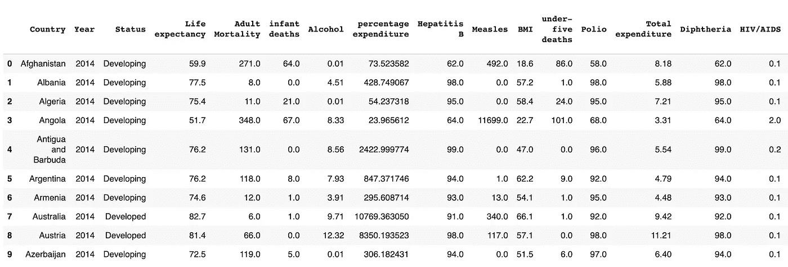

图片作者。

```
print(" \nCount total NaN at each column in a DataFrame : \n\n",life_expectancy.isnull().sum())
```

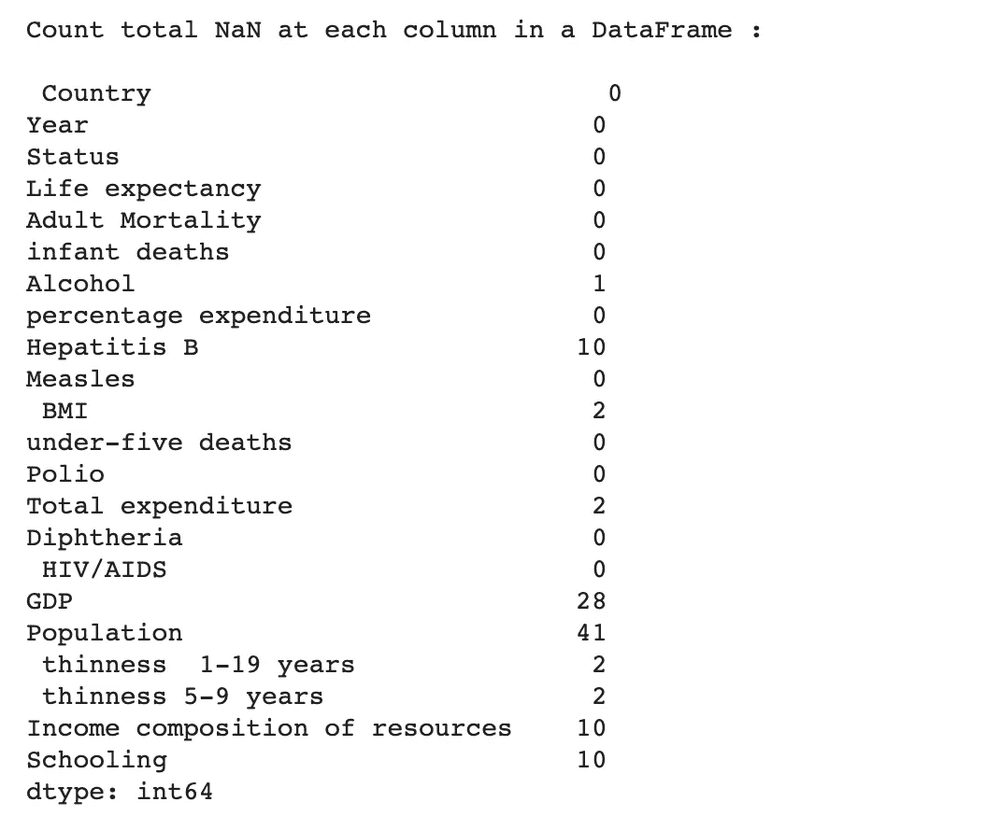

图片作者。

# 数据预处理

根据 EDA 结果，我们可以看到大约一半的列中有缺失值。处理缺失值的一种常见而简单的方法是用相应列的中位数或均值来替换所有缺失值。这种方法的一个问题是，它大大降低了属性的方差，这可能导致预测不佳(Kubara，2019)。因此，我采用了另一种方法——迭代插补。迭代插补是一种使用数据集中的其他特征来估计给定特征中缺失值的方法。这一过程是连续进行的，因此新的估算值可以作为模型的一部分用于预测其他特征，并反复提高估计值的准确性(Brownlee，2020)。

为了实现这个方法，我使用了 sklearn 库中的 IterativeImputer 方法。然后，生成的数据集用于模型拟合和预测。

# 多变量回归

回归是数据科学中最常用的方法之一。回归用于从数学上量化独立变量(或多元回归中的多个变量)对因变量(多元回归，未注明)的影响。在我们的例子中，我们有 18 个可能的预测变量，我们的目标是找到它们的组合，以产生最高精度的模型。在选择预测变量之前，我将数据集分为训练集和测试集，并使用训练集拟合线性模型。此外，我根据测试集中自变量的值预测了因变量的值。最后，我计算了 MSE、RMSE 和 R 值来评估我们模型的性能:

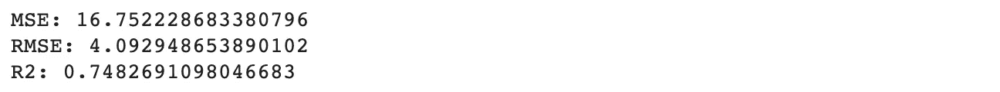

图片作者。

为了挑选预测变量的最佳组合，我决定使用 R 中的 leaps 库，它对独立变量的最佳组合进行彻底搜索，以预测线性回归中的因变量。我将数据集导入到 R 中，并运行以下命令

```
regsubsets.out <-
  regsubsets(Life.expectancy ~ Adult.Mortality + infant.deaths + Alcohol + percentage.expenditure + Hepatitis.B + 
               Measles + BMI + under.five.deaths + Polio + Total.expenditure + Diphtheria + HIV.AIDS + GDP + Population +
               thinness..1.19.years + thinness.5.9.years + Income.composition.of.resources + Schooling,
             data = data,
             nbest = 1,       
             nvmax = NULL,    
             force.in = NULL, force.out = NULL,
             method = "exhaustive")plot(regsubsets.out, scale = "adjr2", main = "Adjusted R^2")
```

此代码的输出是一个预测值组合表，以及带有相应预测值组合的模型的调整 R 值。

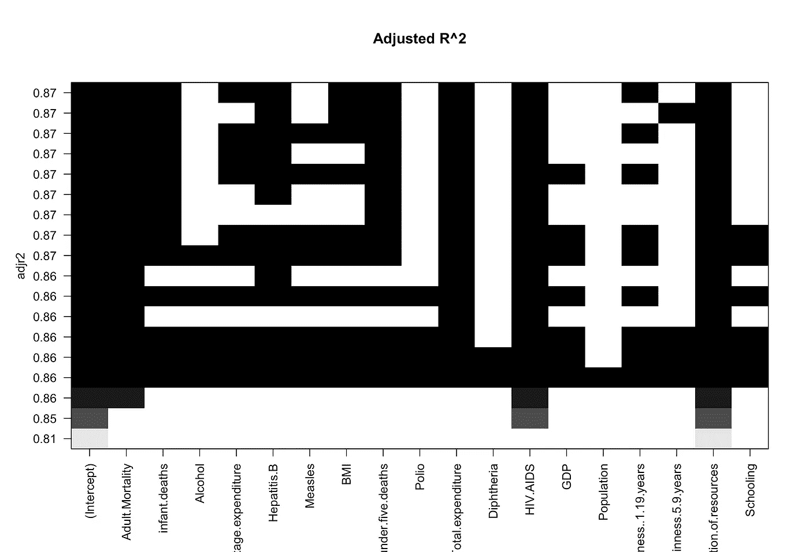

图一。多元回归模型中不同预测变量组合的调整 R 值。图中的每一行都有黑盒(模型中使用了该变量)和白盒(未使用该变量),它代表一个单独的多变量模型，具有自己的 R 值。图片作者。

我们需要考虑该表的两个方面，即预测值的数量和 R 值。我们的目标是选择一个既省钱又有高精度的模型。我们可以测试一些变量组合，它们都具有较高的 R 和少量的变量:

*   模式 1:成人死亡率、艾滋病毒/艾滋病、资源的收入构成(ICR)；
*   模型 2:成人死亡率，艾滋病毒/艾滋病，ICR，总支出；
*   模型#3:成人死亡率、艾滋病毒/艾滋病、ICR、总支出、乙型肝炎；

为了测试这些模型的性能，我重复了前面描述的相同步骤，并计算了 MSE、RMSE 和 R:

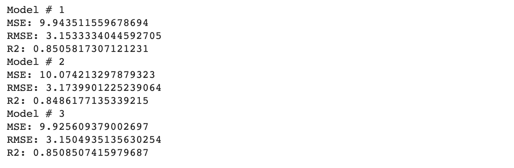

图片作者。

正如我们所见，根据所选指标的值，模型#3 具有最佳性能。

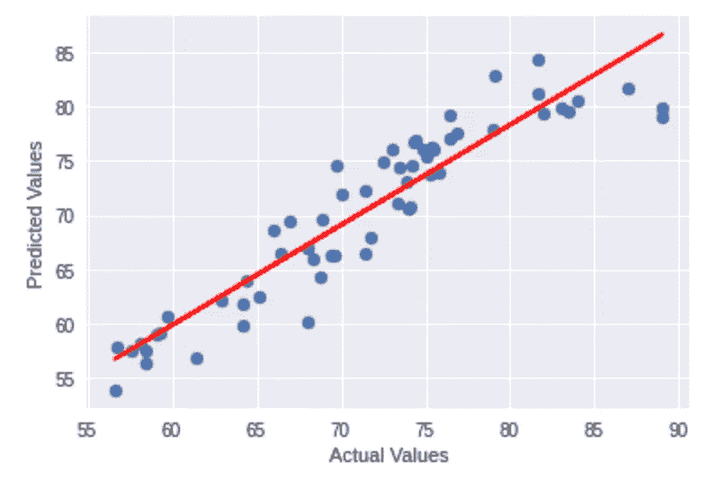

图二。不同国家预期寿命的实际值与预测值。通过在数据集的测试部分拟合多元回归模型来计算预测值。图片作者。

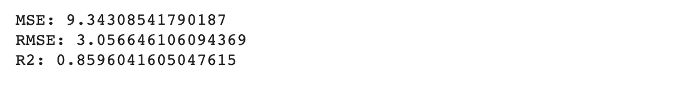

图片作者。

# 随机森林

随机森林是一种监督学习算法，使用多个决策树进行分类和回归任务(Yiu，2021)。随机森林是最准确的学习算法之一。该算法的一个重要方面是，其中涉及的所有决策树彼此并行运行，并且返回所有树之间的平均预测(在回归任务中)或类别模式(在分类中)。这导致减少过度拟合、方差和结果的更高精度(随机森林完全指南，2021)。

为了实现随机森林模型，我使用了 sklearn 库中的 RandomForestRegression 函数。首先，我使用所有可用的预测变量来拟合模型。这导致了以下度量值:

此外，我还使用了 SelectFromModel 函数，它标识了模型中最重要的变量。我只使用了在训练集上训练的模型，以避免过度拟合。这项职能的产出包括成人死亡率、艾滋病毒/艾滋病、ICR、学校教育。然后，我再次拟合相同的随机森林模型，但仅包括这四个变量，从而得出以下结果:

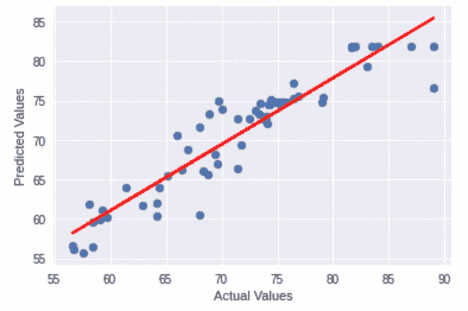

图 3。不同国家预期寿命的实际值与预测值。预测值是通过在数据集的测试部分拟合随机森林模型来计算的。图片作者。

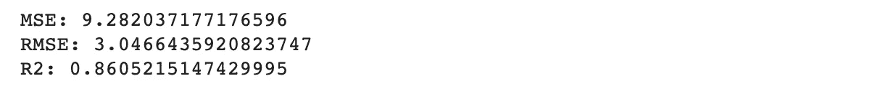

图片作者。

正如我们所看到的，结果稍微好一些，我们将模型减少到只有四个变量。

# XGBoost

XGBoost 或极端梯度提升是一种机器学习算法，最近因其在执行回归和分类等常见任务方面的高效率而受到欢迎(Brownlee，2021)。像 Random Forest 一样，XGBoost 也使用决策树来估计模型参数，但是，有一个关键的区别，即 XGBoost 是以连续的方式使用它们，这意味着它适合一个模型，然后使用其残差来适合下一个模型，依此类推。总体而言，XGBoost 是一种梯度提升算法(它使用梯度下降算法来最小化损失函数)，使用决策树作为其预测器(Morde，2019)。它非常适用于结构化的表格数据，这也是它有望在世卫组织数据集上产生良好结果的原因。

为了将 xgboost 算法应用于我们的回归问题，我将使用 XGBoost 库中的 XGBRegressor 函数。这个库的一个很大的特点是，在拟合模型之后，它给我们提供了关于特征重要性的信息。

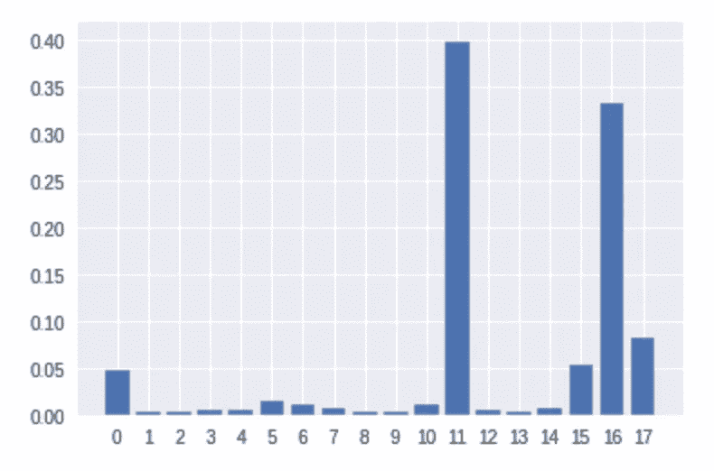

图 4。XGBoost 模型中不同自变量的重要性。所有的重要性总和为 1，重要性最高的变量对因变量的影响最大。图片作者。

正如我们所见，特性 11 和 16 的重要性最高，其次是特性 17、0 和 15。该库还有一个非常有用的 SelectFromModel 函数，它可以根据提供的特征重要性阈值选择最佳预测值组合。为了检查模型在不同阈值下的表现，我对 xgb . feature _ importances _ function 的输出进行了排序，并拟合了 18 个模型，从所有变量开始，在下一步中丢弃一个重要性最低的变量。根据模型指标，表现最佳的模型有以下 15 个预测变量:

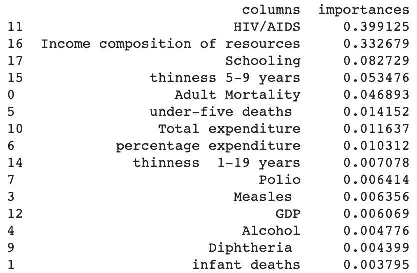

图片作者。

并产生以下模型度量结果

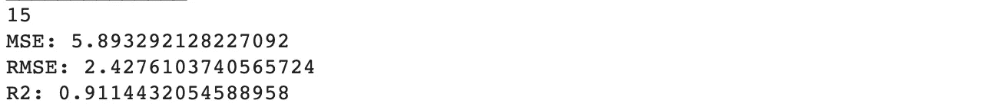

图片作者。

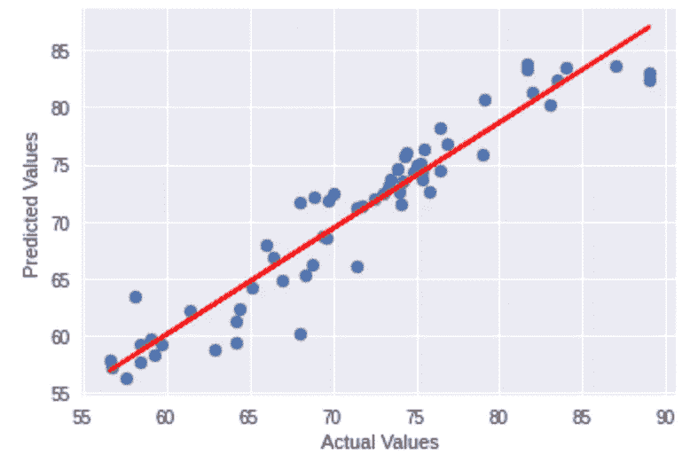

图 5。不同国家预期寿命的实际值与预测值。预测值是通过在数据集的测试部分拟合 XGBoost 模型来计算的。图片作者。

正如我们所看到的，XGBoost 算法产生了最好的结果，将艾滋病毒/艾滋病和 ICR 作为其最重要的预测因素。

# **使用时间序列数据的结果验证**

基于三个不同模型的 MSE、RMSE 和 R 值，XGBoost 在预测预期寿命方面达到了最高的准确度。此外，如图 4 所示，与其他变量相比，有两个变量的重要性值明显更高——艾滋病毒/艾滋病和 ICR。这两个变量也是多元回归和随机森林模型中最重要的变量。

在该数据集中，艾滋病毒/艾滋病被定义为“每 1 000 名活产儿中艾滋病毒/艾滋病死亡人数(0-4 岁)”，ICR 被定义为“根据资源收入构成的人类发展指数(指数范围为 0-1)”。虽然第一个变量在预测预期寿命方面的重要性似乎相当明显，但有趣的是，在其他死亡率变量中，如“五岁以下儿童死亡率”或“成人死亡率”，特别是艾滋病毒/艾滋病相关死亡率对因变量的影响最大。

为了了解这些变量的重要性是否反映在这些变量的时间趋势中，我使用了 2000 年至 2015 年“艾滋病毒/艾滋病”、“资源的收入构成”和“预期寿命”的数据，并绘制了一些简单的可视化图形。

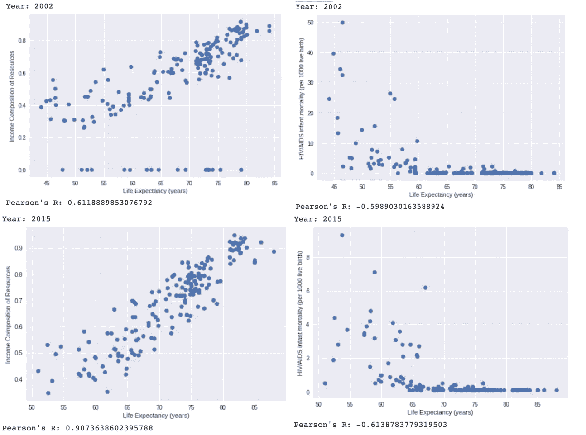

图 6。2002 年和 2015 年预期寿命与艾滋病毒/艾滋病的散点图。预期寿命与艾滋病毒/艾滋病呈中度负相关，与冰呈中度/强正相关。图片作者。

我们可以看到，在 2002 年和 2015 年，预期寿命与艾滋病毒/艾滋病呈中度负相关，与 ICR 呈中度正/强正相关。

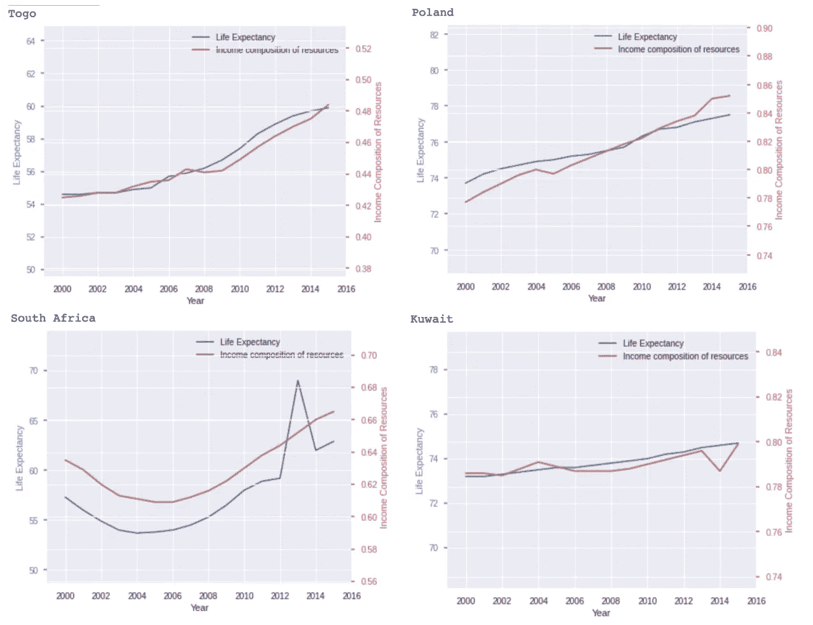

图 7。2000 年至 2015 年的时间序列预期寿命和 ICE 数据。两个变量都以各自的比例显示。图片作者。

在一个时间序列中，预期寿命和 ICR 的增长率似乎非常相似。这种趋势在许多国家都很普遍。

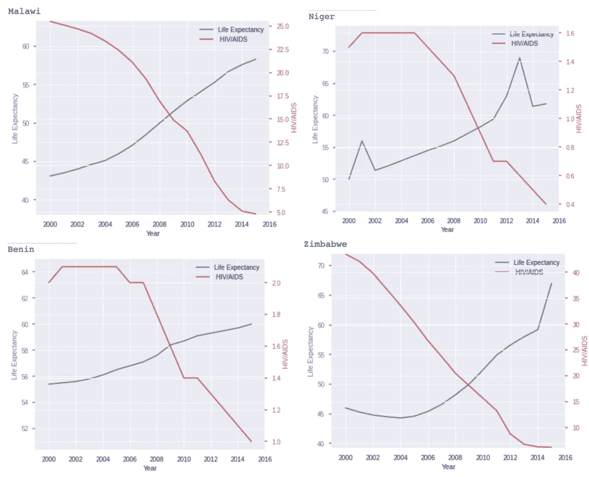

图 8。2000 年至 2015 年的时间序列预期寿命和艾滋病毒/艾滋病数据。两个变量都以各自的比例显示。图片作者。

就预期寿命和艾滋病毒/艾滋病而言，正如所料，在许多国家，我们观察到相反的趋势。

# **结论**

在这个项目中，我实现了三个算法来执行一个回归任务。具体来说，我使用了多元回归、随机森林和 XGBoost 来预测不同国家的 2014 年预期寿命。根据 MSE、RMSE 和 R 的值，在三种算法中，XGBoost 的表现最好。ICR 和艾滋病毒/艾滋病这两个独立变量在预测预期寿命方面表现出最高的重要性。对 2000 年至 2015 年数据的进一步研究证实了自变量和因变量之间的密切关系。每年，预期寿命与艾滋病毒/艾滋病呈中度负相关，与 ICR 呈中度/高度正相关。此外，在时间序列图中，正如预期的那样，预期寿命的增加对应着 ICR 的增加和艾滋病毒/艾滋病的减少。这些结果表明，ICR 和艾滋病毒/艾滋病可能会影响一个国家的平均预期寿命。虽然并非所有国家都有相同的趋势，并且发现了多个异常值，但需要对每个个案进行探索和更仔细的分析，才能得出可靠的结论。

# 参考

j .布朗利(2020 年 8 月 18 日)。*机器学习中缺失值的迭代插补*。机器学习精通。检索于 2021 年 11 月 3 日，来自[https://machine learning mastery . com/Iterative-attraction-for-missing-values-in-machine-learning/#:~:text = Iterative % 20 attraction % 20 reference % 20 to % 20a，其中% 20 missing % 20 values % 20 is % 20 predicted。](https://machinelearningmastery.com/iterative-imputation-for-missing-values-in-machine-learning/#:~:text=Iterative%20imputation%20refers%20to%20a,where%20missing%20values%20are%20predicted.)

j .布朗利(2021 年 2 月 16 日)。*应用机器学习 XGBoost 的温和介绍*。机器学习精通。2021 年 11 月 5 日检索，来自[https://machine learning mastery . com/gentle-introduction-xgboost-applied-machine-learning/。](https://machinelearningmastery.com/gentle-introduction-xgboost-applied-machine-learning/.)

*随机森林算法完整指南*。内置的。(2021 年 7 月 22 日)。检索于 2021 年 11 月 5 日，来自[https://builtin.com/data-science/random-forest-algorithm.](https://builtin.com/data-science/random-forest-algorithm.)

k . ku bara(2019 年 6 月 24 日)。*为什么对缺失数据使用平均值不是一个好主意。替代插补算法。*中等。2021 年 11 月 3 日检索，来自[https://towards data science . com/why-using-a-mean-for-missing-data-is-a-bad-idea-alternative-attu lation-algorithms-837 c 731 c 1008。](/why-using-a-mean-for-missing-data-is-a-bad-idea-alternative-imputation-algorithms-837c731c1008.)

莫尔德五世(2019 年 4 月 8 日)。 *XGBoost 算法:愿她统治长久！*中等。检索于 2021 年 11 月 5 日，来自[https://towardsdatascience . com/https-medium-com-vishalmorde-xgboost-algorithm-long-she-may-rein-edd 9 f 99 be 63d。](/https-medium-com-vishalmorde-xgboost-algorithm-long-she-may-rein-edd9f99be63d.)

*多元回归*。精彩的数学科学维基。(未注明)。检索于 2021 年 11 月 5 日，来自[https://brilliant . org/wiki/Multivariate-regression/#:~:text = Multivariate % 20 regression % 20 is % 20a % 20 method，responses)% 2C % 20 are % 20 linear % 20 相关。&text = A % 20 数学% 20 模型% 2C %基础% 20 和% 20 其他% 20 更多% 20 复杂% 20 问题。](https://brilliant.org/wiki/multivariate-regression/#:~:text=Multivariate%20Regression%20is%20a%20method,responses)%2C%20are%20linearly%20related.&text=A%20mathematical%20model%2C%20based%20on,and%20other%20more%20complicated%20questions.)

k . rajar Shi(2018 年 2 月 10 日)。*预期寿命(世卫组织)*。卡格尔。检索于 2021 年 11 月 3 日，来自[https://www.kaggle.com/kumarajarshi/life-expectancy-who.](https://www.kaggle.com/kumarajarshi/life-expectancy-who.)

(2021 年 9 月 29 日)。*了解随机森林*。中等。2021 年 11 月 5 日检索，来自[https://towards data science . com/understanding-random-forest-58381 e 0602d 2。](/understanding-random-forest-58381e0602d2.)