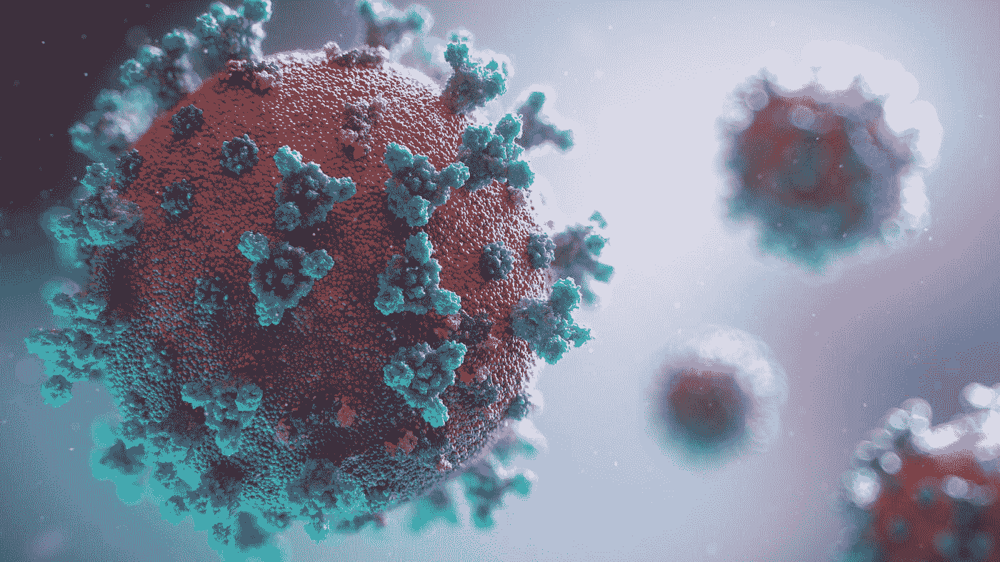
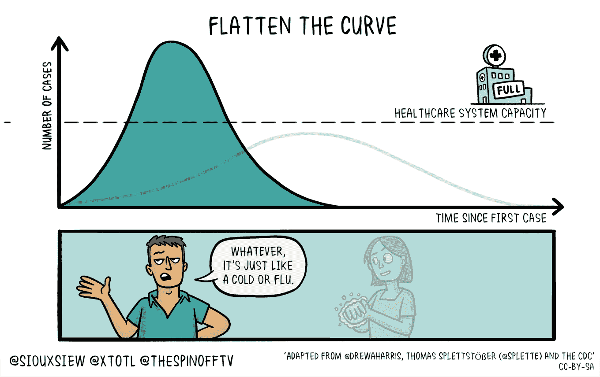

# 数据科学 vs 冠状病毒

> 原文：<https://towardsdatascience.com/data-science-vs-coronavirus-e2d18f155c47?source=collection_archive---------50----------------------->

## 卓越方法和特殊实践概述

由 [Unsplash](https://unsplash.com?utm_source=medium&utm_medium=referral) 上的[融合医学动画](https://unsplash.com/@fusion_medical_animation?utm_source=medium&utm_medium=referral)拍摄的照片

根据[维基百科](https://en.wikipedia.org/wiki/Data_science)，数据科学是*“一个使用科学方法、流程、算法和系统从许多结构化和非结构化数据中提取知识和见解的跨学科领域。”我已经在这个领域工作了三年，在希腊比雷埃夫斯大学攻读博士学位。我总是着迷于将从数据中提取的知识应用到卫生领域的前景，以及硬件和算法设计的重大进步使应用成为可能的。*

几个月来，我们面临着冠状病毒爆发的前所未有的局面。因此，数据科学界试图在这一场景中承担自己的角色，并为抗击其引发的疾病新冠肺炎做出贡献。此外，来自不同学科和公共组织的科学家通过开源病毒的[基因组](https://www.nature.com/articles/d41587-020-00002-2)和其他[数据集](https://github.com/CSSEGISandData/COVID-19/tree/master/csse_covid_19_data/csse_covid_19_daily_reports)来承认数据分析的重要性，希望找到人工智能指导的解决方案。

在接下来的部分，我将讨论这些贡献可能是什么，并表达我的个人观点。

> [学习率](https://www.dimpo.me/newsletter?utm_source=medium&utm_medium=article&utm_campaign=data_vs_covid)是为那些对 AI 和 MLOps 的世界感到好奇的人准备的时事通讯。你会在每周五收到我关于最新人工智能新闻和文章的更新和想法。在这里订阅！

# 形象化

可视化一个数据集允许科学家获得洞察力和更深入的研究；特征如何相互关联，要做的建模假设等。此外，一幅图像胜过千言万语，设想一个问题是解释和体现复杂概念并使意图合理化的好方法。

“*拉平曲线*”是最近的一个流行短语。此外，指数增长是一个我们难以理解的概念。向公众分析和展示这两者的最佳方式是利用可视化的力量。

如何“拉平曲线”

为此， [Harry Stevens](https://www.washingtonpost.com/people/harry-stevens/) 整理了一篇关于*的奇幻文章《为什么冠状病毒这样的疫情呈指数级传播，如何使曲线*变平》《华盛顿邮报》的这篇文章展示了为什么指数增长让专家担忧，以及这种疾病是如何按照不同的模拟模式传播的。最后，他举例说明了强制隔离和社会距离等措施如何有助于缓解这一问题。

这篇文章是一篇必读的文章，也是一个很好的例子，展示了可视化在教育中的力量以及采用正确的行为模式。

# 研究

当谈到研究和流行病时，我们主要想到的是疫苗和药物。数据科学和机器学习可能有助于发现新药，但我们仍然离实现这一潜力很远。

然而，需要指出的一些前景是 DeepMind 预测蛋白质结构的努力和创新想法，这些想法有助于准确而不引人注目地对受感染的人进行大规模筛查。谷歌的 DeepMind 将最新版本的“*alpha fold*”——一种预测蛋白质结构的神经网络——投入到这项任务中，并发布了与[冠状病毒](https://deepmind.com/research/open-source/computational-predictions-of-protein-structures-associated-with-COVID-19)有关的几种正在研究的蛋白质的结构预测。虽然这些结果还没有得到实验的验证，但是人们希望它们可以作为未来开发治疗方法的实验工作的基础。

在另一条道路上，在来自 [Yunlu Wang 等人](https://arxiv.org/abs/2002.05534)的一篇新论文中，作者试图通过观察患者的呼吸模式来识别可能表明感染的呼吸急促病例。

实时异常呼吸模式分类系统的演示视频

使用深度相机和深度学习，研究人员能够对六种具有临床意义的呼吸模式(呼吸暂停、呼吸急促、呼吸缓慢、Biots、Cheyne-Stokes 和中枢性呼吸暂停)进行分类，准确率、精确度、召回率和 F1 分别为 94.5%、94.4%、95.1%和 94.8%。

# 应用程序

中国平安保险公司推出了一款新冠肺炎[智能图像读取](https://www.prnewswire.com/news-releases/ping-an-launches-covid-19-smart-image-reading-system-to-help-control-the-epidemic-301013282.html)系统，帮助控制应用前端的疫情。该方法利用计算机视觉进步和深度神经网络从计算机断层扫描(CT)图像中诊断死亡。许多医生已经使用 CT 图像来诊断新冠肺炎，像这样的系统有助于有效和准确的预测。由于从世界各地的医院收集类似的[数据](https://github.com/ieee8023/covid-chestxray-dataset/blob/master/README.md?fbclid=IwAR30yTGBr55WXdCngCoICDENHycmdL2bGwlvl1ckdZM-ucjGH10Uakz7khk)的运动正在进行，更多类似的想法被期待。

另一方面，网络科学研究所使用更传统的建模方法来绘制冠状病毒的[社交网络](https://www.nytimes.com/2020/03/13/science/coronavirus-social-networks-data.html)。从历史上看，试图了解病毒及其流行的科学家专注于病毒本身，模拟其内部运作。但是病毒需要宿主才能生存，需要个人接触才能传播。因此，在过去十年中，科学家开始将社交网络纳入他们的模型，以确定可能增加或抑制即将到来的大流行影响的个人行为模式。这种建模为政策建议提供了信息，例如，我们是否应该关闭学校，其影响会是什么？

# 结论

在大数据时代，数据科学和机器学习在像这次爆发这样的情况下可以发挥重要作用。它的一些应用对传递正确的信息至关重要，而其他应用对所应用的政策有重大影响。

另一方面，辅助应用程序是有用的，但仍然需要大量的工作来实现其潜力。例如，虽然 CT 智能图像读取系统可以帮助医生远程诊断疾病，但它存在特异性问题。此外，它要求患者进行胸部扫描，这使得它在昂贵的医疗设备不可用的地方不太相关。对于追踪患者呼吸模式的系统，也会出现同样的特异性问题，因为呼吸急促与许多情况有关。此外，研究人员仍在努力填补所需的大量训练数据和稀缺的真实世界数据之间的差距。

# 关于作者

我叫[迪米特里斯·波罗普洛斯](https://www.dimpo.me/?utm_source=medium&utm_medium=article&utm_campaign=data_vs_covid)，我是一名为[阿里克托](https://www.arrikto.com/)工作的机器学习工程师。我曾为欧洲委员会、欧盟统计局、国际货币基金组织、欧洲央行、经合组织和宜家等主要客户设计和实施过人工智能和软件解决方案。

如果你有兴趣阅读更多关于机器学习、深度学习、数据科学和数据运算的帖子，请关注我的 [Medium](https://towardsdatascience.com/medium.com/@dpoulopoulos/follow) 、 [LinkedIn](https://www.linkedin.com/in/dpoulopoulos/) 或 Twitter 上的 [@james2pl](https://twitter.com/james2pl) 。请访问我的网站上的[资源](https://www.dimpo.me/resources/?utm_source=medium&utm_medium=article&utm_campaign=data_vs_covid)页面，这里有很多好书和顶级课程，开始构建您自己的数据科学课程吧！