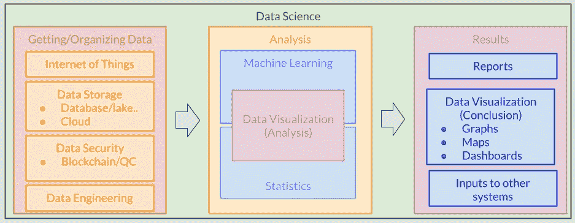

# 数据科学——它到底意味着什么？

> 原文：<https://towardsdatascience.com/data-science-what-does-it-really-mean-d6e976d6b630?source=collection_archive---------23----------------------->

图片由[皮克斯拜](https://pixabay.com/?utm_source=link-attribution&amp;utm_medium=referral&amp;utm_campaign=image&amp;utm_content=3706562)的 Gerd Altmann 提供

“数据科学”一词出现在大约 10 年前，并最终演变成当今世界上最热门的词汇之一。从学术界到政府组织，再到几乎每个行业的公司，都在不断投入越来越多的努力来充分利用信息技术，并因此创造了许多新的职位，如数据科学家和数据工程师。

那么这个术语代表什么呢？是什么让它如此特别？

虽然这些角色所涵盖的职责有一些通用的定义(如 [10 种不同的数据科学职位及其含义](/10-different-data-science-job-titles-and-what-they-mean-d385fc3c58ae)中概述的定义)，但我们不难发现，不同市场的需求导致了这些定义的一些差异，甚至可能导致对这两个问题的不同回答。我将尝试在这里提供我对它的理解，这可能有希望帮助其他人在更大的画面上获得更多的见解。

# 什么是数据科学？

顾名思义，数据科学是数据的科学。正如过去十年或二十年所证明的那样，随着技术的进步，这一定义下的内容显然会发生变化。在当前的技术框架下，这包括从数据收集端到所有存储和分析方法，一直到利用结果的各种渠道。这种类型的数据处理链现在通常被称为**数据流水线**。

# 数据管道

**数据管道**通常代表数据操作组件的有序集合，从收集数据到呈现从中提取的有用信息，以及这之间的一切。就像生产链一样，每个组件负责以特定的方式处理提供的输入数据，产生的输出数据用作下一个组件的输入。虽然该术语通常指的是组件的长期实现，以便尽可能自动化该过程，但临时分析通常遵循非常相似的方法。这个处理链可以有效地分为四个主要类别:

## 数据收集

该过程的第一(实际)阶段为进一步分析准备数据。在此之前通常会有一个头脑风暴阶段，用问题/难题来引导需要收集什么样的数据。它有时可能首先涉及一些(通常是自动的)数据收集过程，无论是网络搜集还是通过移动网络来自远程传感器的数据。根据不同的方法，这可能涉及编码一些网络爬虫，或者从一些 API 数据源收集脚本。

## 数据存储

然后，它们被导入某种数据存储平台，可以是云或本地数据库。这种通道通常涉及一些数据格式转换(有时包含在数据工程定义中)，以便结果与通常为高效数据提取而优化的存储兼容。这种数据存储平台的结构通常是为相关联的应用而专门设计的，并且通常由数据工程师负责，其通常的职责还包括编写(通常是 SQL)提取数据优化以用于期望的进一步分析的函数。

事实上，大多数原始数据集包含大量需要清除的噪声。数据工程师通常负责准备数据以备分析，这通常包括实施一些程序，尽可能高效地实现上述大部分清理、收集和存储程序的自动化。

## 数据分析

这一阶段的主要目标是提取数据中固有的趋势和模式。根据数据类型以及项目的最终目标，有许多不同的方法可以做到这一点。它通常涉及使用现有数据建立模型，使用的技术从回归、时间序列分析到各种类型的机器学习算法，如聚类和神经网络。这种模型的应用范围可以从商业和金融部门的时间序列数据预测到肿瘤分类和自动驾驶技术的图像识别。

## 介绍会；展示会

这是最终结果被利用的阶段。它们要么出现在某种报告/演示中，要么是集成到系统中的完整数据管道。

通常对于特别分析，获得的结论以报告或幻灯片的形式呈现给风险承担者。很有可能利益相关者对管道的技术细节知之甚少。数据专家的角色非常类似于这里的销售人员，主要目标是说服利益相关者所做的工作是值得的，并且对利益相关者非常有益。

良好的**数据** **可视化**是交付分析结果的关键(在这种情况下,“一张图胜过千言万语”这句名言通常是一种保守的说法)。[数据是美丽的](https://www.reddit.com/r/dataisbeautiful/)和[数据是丑陋的](https://www.reddit.com/r/dataisugly/)是两个子 reddits，其中包含了许多有趣的例子，人们可能会发现这些例子对创建它们非常有帮助。

最终结果可能是某种报告/演示，或者是集成到系统中的完整数据管道，该系统将以高度自动化的方式继续工作

作者图片

## 摘要

为了优化这些组件可以创造的价值，数据科学专业人员通常需要以顾问的身份与利益相关者一起开始工作，通常称为“业务问题方法”。在这一阶段，数据科学专家从利益相关方那里收集信息，以确定:

*   项目的最终目标——涉众希望通过投入时间和金钱实现什么。
*   收集什么数据—这通常由最终目标决定。
*   精度要求——对于一些项目来说，牺牲一点精度来换取响应性能并不罕见，例如实时系统。
*   需要额外的硬件—如果有足够的基础设施来利用项目的最终产品。我在另一篇文章中概述了这一点— [对数据科学有用的计算机知识](/useful-knowledge-of-computers-for-data-science-c4882e45b6cb)

确保每个方面都达到令人满意的水平，与数据管道中每个组件的最终性能一样重要。所有这些因素带来的良好表现和效率是最终成功的关键，就像我从 NBA 传奇人物那里借用的一句话:

"一个人可能是团队中至关重要的组成部分，但一个人无法组成团队。"—卡里姆·阿卜杜尔·贾巴尔

美国宇航局在 [Unsplash](https://unsplash.com/s/photos/world?utm_source=unsplash&utm_medium=referral&utm_content=creditCopyText) 拍摄的照片

# 为什么数据科学突然流行起来了？

我们已经有了很长时间的数据，以及用来分析这些数据的方法。例如，线性回归早在 19 世纪就出现在勒让德(1805)和高斯(1809)的工作中[1]，为什么数据的“科学”直到最近十年才出现？以下是我发现的几个因素:

## 互联网

自从互联网服务在 20 世纪 90 年代后期开始流行以来，世界各地每天都在产生大量的数据，特别是当社交媒体和智能手机从 2000 年代中期开始流行时。许多组织和公司已经利用了这种数据资源，并从不同类别的人群中提取行为趋势和模式。这些结果对于提高许多部门的效率变得极为宝贵，从电子商务到基础设施分析等领域。

## 计算能力

由于计算能力的提高，许多机器学习方法，如 20 世纪 90 年代早期开发的**支持向量机**[2]已经变得流行起来。商业级机器最终强大到足以让更多的人使用这些方法，通常允许一些更复杂格式的数据(如声音、图像和视频)以多种方式进行分析，这在以前是不可能的。

## 云计算

互联网和计算能力进步的结合不可避免地带来了云计算。在云计算于 2010 年左右开始流行之前，已经有网格计算(如 [LHC 计算网格](https://home.cern/science/computing/grid))等技术广泛应用于科学研究等专业领域。这样做的最大好处显然是，我们可以自由地拥有为我们工作的硬件，而且无法远程控制的东西允许我们启动工作，关闭我们自己的计算机和灯，去我们去的酒吧，同时知道我们仍然是“高效的”。

# 结论

显然以上这些因素也是纠结在一起，一路走来相互恭维。早在数据科学成为一个时髦词之前，它的许多概念就已经存在了，比如回归和数据管道。随着新技术的出现，这些核心概念中的一些仍将存在，而我们可能只是通过更聪明的工具以更聪明的方式使用它们。这也是为什么数据科学的课程仍然在强调这些概念，而不是在一些具有机器学习功能的商业软件的界面上找到点击按钮的原因。

最后，所有数据相关流程的黄金法则始终是“垃圾进，垃圾出”。

[1]斯蒂格勒，斯蒂芬·M，[**《统计学的历史:1900 年以前不确定性的测量**](https://archive.org/details/historyofstatist00stig) (1986)，剑桥:哈佛。[ISBN](https://en.wikipedia.org/wiki/ISBN_(identifier))[0–674–40340–1](https://en.wikipedia.org/wiki/Special:BookSources/0-674-40340-1)。

[2] Cortes，Corinna 和 Vapnik，Vladimir N， [**支持向量网络**](http://image.diku.dk/imagecanon/material/cortes_vapnik95.pdf) (1995)，机器学习。**20**(3):273–297。citeserx 10 . 1 . 1 . 15 . 9362。doi:10.1007/BF00994018。S2CID 206787478。