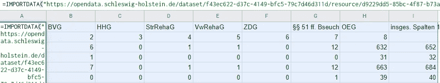
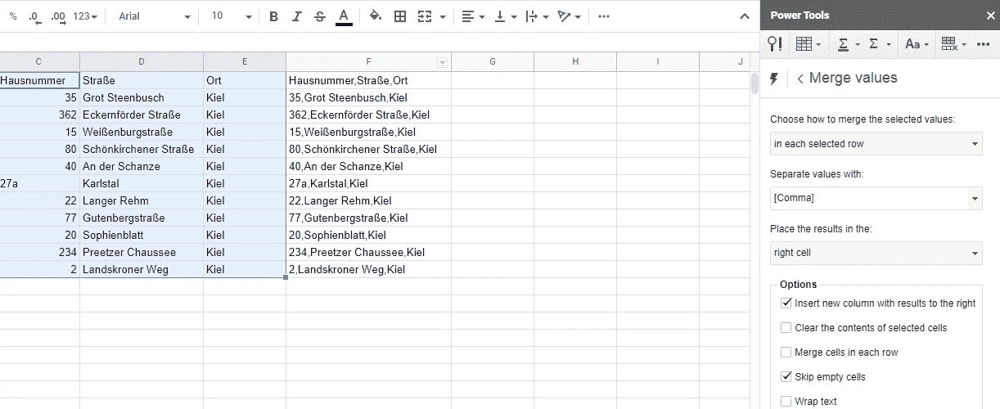
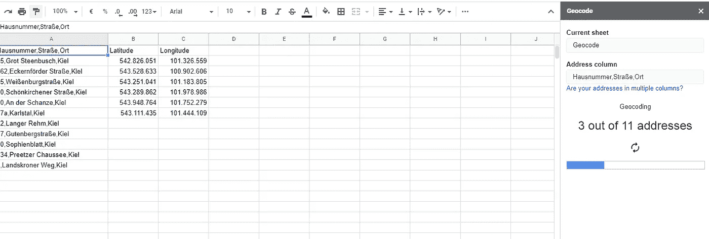
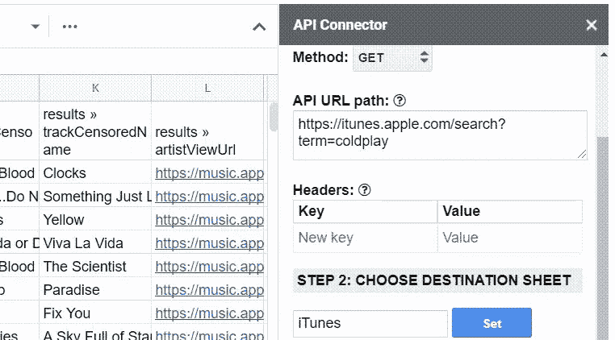

# 数据科学与谷歌工作表

> 原文：<https://towardsdatascience.com/data-science-with-google-sheets-2723eb96a873?source=collection_archive---------37----------------------->

## 我如何使用 Google Sheets 进行小型数据集成和分析任务

所罗门·OFM 在 [Unsplash](https://unsplash.com/s/photos/pine?utm_source=unsplash&utm_medium=referral&utm_content=creditCopyText) 上的照片

您的大部分数据将通过流或批处理传输到您的数据仓库或数据湖中。您将选择稳定的 ETL 或 ELT 流程，从您的遗留系统、CRM、ERP、IOT 等中获取大多数和最相关的数据。

然而，在数据科学和自助式 BI 的世界中，您的数据分析师/科学家和 BI 用户还需要来自外部系统、开放式 API 的数据，以及来自表单、网站等的数据。因此，像 Google Sheets 这样的工具可能是轻松实现数据流的一个很好的解决方案。这篇文章应该让你初步了解如何将 Google 强大的 BigQuery 与易于使用的 Googles Sheets 及其“无尽的附加组件”结合起来。

## 谷歌云

通常情况下，你可以将 Google Sheets 连接到 BigQuery，并将表格数据加载到工作表中，以条形图、饼状图等形式显示出来。但是您也可以使用工作表作为 BigQuery 的源，反之亦然。你不必担心连接器等。已经有内置的和现成的。

Google Sheets 和 BigQuery 的集成——作者图片

## 一些例子和启示

在我的工作经历中，我遇到了 Google Sheets 和它的“伟大插件”,它们为我提供了 BigQuery 的自动化数据处理的可能性:

**从网站或文件中获取数据**

有了内置函数，你可以从任何网站获取数据(如 HTML 表格)或链接文件，如 CSV 或 TSV [1]。

通过 IMPORTDATA-function 导入 CSV 数据的示例—作者图片

**转换您的数据**

为了对我的地址数据进行地理编码，我曾经不得不将三列合并成一列，用逗号隔开。因此，我使用了床单的附件**电动工具**:

Google Sheets 和 Power Tools 转换数据——图片由作者提供

有了这个伟大的插件，您可以轻松地合并和组合数据，找到重复，随机化数据和更多没有任何编码。对于没有深入了解 SQL 的用户来说，这可能是一个很大的优势。因此，您不必在 BigQuery 中转换数据(每次查询都要花费成本),您可以事先完成这一步，将数据加载到 BigQuery 中，并通过 Data Studio 等工具将其可视化。

**地理编码数据**

在转换我的数据后，我想对它进行地理编码。另一个很棒的插件出现了:**由 Awesome 表进行地理编码【2】**

通过 Awesome 表进行地理编码以从地址数据中获取纬度和经度-按作者分类的图像

所以这个插件为我提供了获取地址的经度和纬度的服务。这是一个很好的特性，因为对于地图可视化来说，你经常需要坐标。

**从 API 获取数据**

有很多开放的 API 可以用来获取数据湖中还没有的数据。我搜索了一个 API 来获取某些单词的同义词——将它们与 BigQuery 中的 ERP 数据结合起来，并找到可疑的预订。我还使用 Google Sheets 通过 HTTP 请求调用 **API。例如，你可以自己使用应用程序脚本，也可以使用插件，这里我喜欢 **API 连接器[4]。****

通过 HTTP 请求获取数据的 API 连接器插件—图片由作者提供

**统计和机器学习**

另一个用例可能是统计和机器学习。Google Sheets 可能是这些领域的合适解决方案吗？是的，可以。以下两个工具非常有用:

*   ***求解器:*** 用于高级统计运算
*   ***BigML:*** 通过拖放进行机器学习[3]

结果也可以加载到 BigQuery 中，并使用来自其他来源的数据进行丰富。

## 限制和注意事项

请记住，Google Sheets 是一个电子表格程序，应该主要用于这个原因——它不适合大量数据加载过程。还可以考虑实现一个基于应用程序脚本(如果插件没有提供)的数据自动刷新，这样从 sheets 到 BigQuery 的数据流总是提供最新的数据。

对于他们自己的使用，也可以让业务用户通过上述方式获得他们想要的数据。然而，当考虑通过数据湖将数据传播给其他消费者时，通过 Google Sheets 的数据集成应该由 IT 部门或者至少是技术高级人员来监控甚至实现。提到的一些附加服务也是付费使用的服务，有一定的奖励范围。

## 摘要

Google Sheet 作为 Excel 的一个更便宜、完全 SaaS 的替代品，具有一些很酷的功能来实现较小的数据工程和科学任务和项目。您可以将它与 BigQuery 和许多有用的插件结合使用。当然，对于较大的项目，其他架构也有意义，但是要快速实现某些东西，尤其是对于 PoC，Google Sheets 是一个非常实用的工具。

## 资料来源和进一步阅读

[1]谷歌，[导入数据](https://support.google.com/docs/answer/3093335?hl=de) (2021)

[2] Google Workspace Marketplace，[由 Awesome 表进行地理编码](https://gsuite.google.com/marketplace) (2021)

[3] bigml，[谷歌表单 bigml 附加软件](https://bigml.com/tools/bigml-gas) (2021)

[4]谷歌工作空间市场， [API 连接器](https://gsuite.google.com/marketplace/app/api_connector/95804724197) (2021)