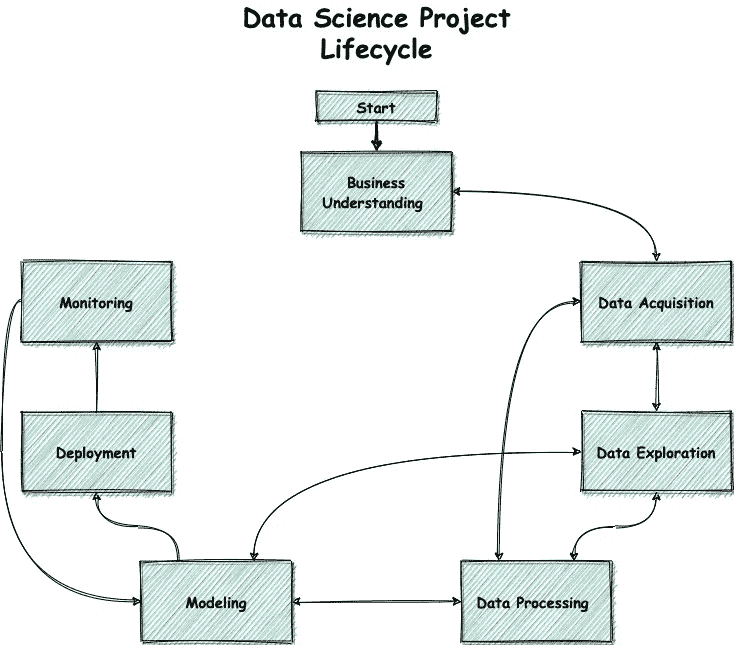
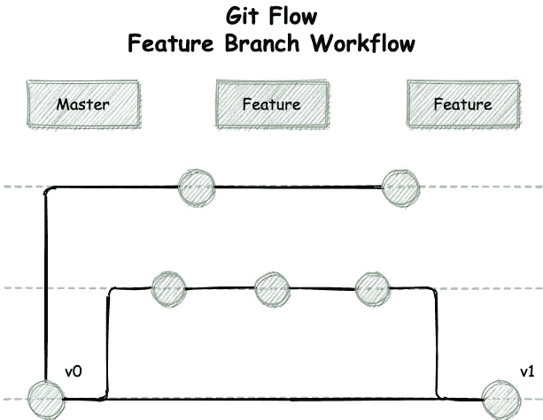
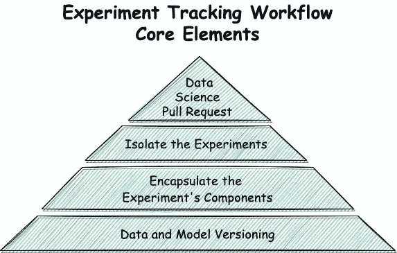
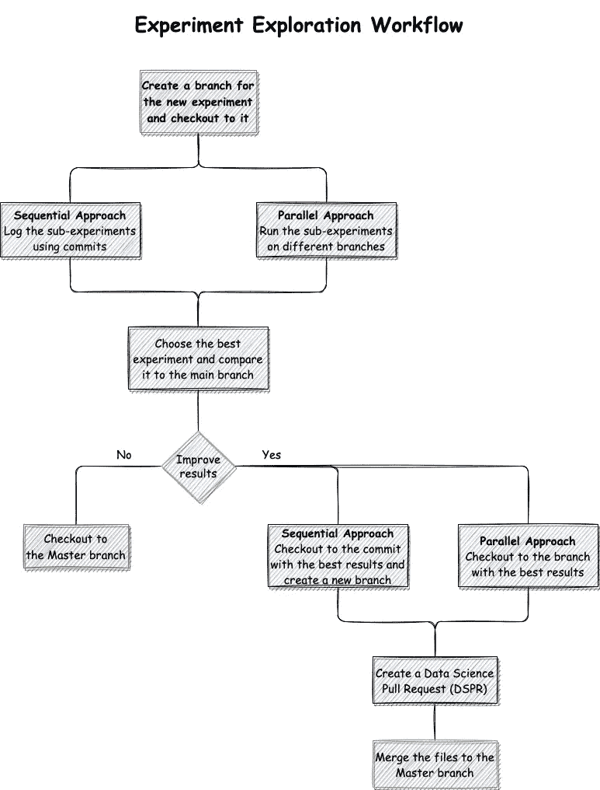
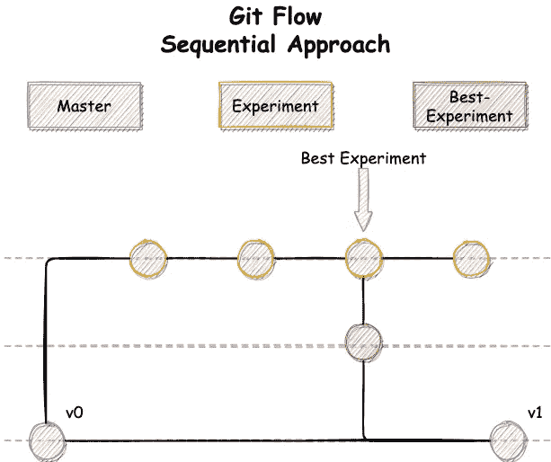
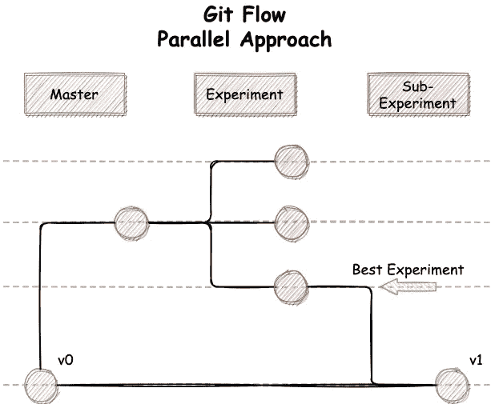

# 数据科学工作流程—实验跟踪

> 原文：<https://towardsdatascience.com/data-science-workflow-experiment-tracking-609e649973a3?source=collection_archive---------22----------------------->

## 使用 Git 流探索数据科学**假设**

数据科学是一个研究驱动的领域，探索一个问题的多种解决方案是一个核心原则。当一个项目变得越来越复杂时，我们需要比较结果，看看什么方法比其他方法更有前途。在这个过程中，我们需要确保我们不会忘记项目的组成部分或错过关键信息。此外，我们需要有能力重现结果和管理过去的实验，以便不浪费时间探索相同的假设两次。为此，有必要使用结构化的工作流程来探索新的实验。

在这篇博文中，我们将讨论以下主题:

*   数据科学项目中的主要挑战以及克服这些挑战所需的能力。
*   来自软件开发工作流程的见解。
*   运行新实验的推荐工作流程。

# 数据科学工作流程中的主要挑战

为了更好地理解实验跟踪工作流程中的挑战，让我们首先定义一个典型项目中涉及的步骤:

1.  了解手头的业务问题。
2.  收集原始数据。
3.  探索、转换、清理和准备数据。
4.  基于数据创建和选择模型。
5.  训练、测试、调整和部署模型。
6.  监控模型的性能。

数据科学项目生命周期，*作者图片*

上面概述的工作流提供了将机器学习模型部署到生产并监控它的路线图。正如我们所见，数据科学项目中的大部分过程都是基于试错法的。数据科学家运行测试，比较结果，重新运行测试，比较结果，等等。因此，我们必须应对三大挑战。

**挑战:** *管理不同的实验/方法来解决问题。*

在从事数据科学项目时，我们经常需要探索不同的方法来解决问题——超参数调优、模型架构、数据处理方法等。每种方法都可能不同，甚至相互正交。此外，每种方法都有子实验，挑战研究者选择最佳结果。

**所需功能:** *比较工具，呈现不同的结果，并通过各种参数进行比较。*

**挑战:** *用项目的所有组件重现之前的实验结果。*

在探索子实验的时候，我们说不清什么时候达到了想要的结果。可能在第一次实验，第 x 次，或者最后一次。因此，我们需要有能力重现代码、数据和实验模型，并得到最好的结果。

**期望的能力** : *用实验的结果封装项目的所有组件。*

挑战: *并行工作，同步项目的各个组成部分。*

在生产环境中工作时，最大的挑战之一是与其他数据科学家协作。在同时进行各种实验的同时，管理代码、数据和模型变成了一项痛苦的任务，而不是一种工作状态。

**期望的功能:** *版本项目的所有组件。*

# 从软件开发中学习

由于软件开发和数据科学之间的相似性，并且由于团队中的软件开发有更多的时间来成熟，让我们看看如何适应和应用来自该领域的方法，并使用它们来定义数据科学领域中的高效工作流。

软件开发工作流是一个广泛的学科。我想把我们的注意力放在“Git 特性分支工作流”上，它定义了一个严格的分支模型。它为管理拥有大量开发人员的大型项目提供了一个健壮的框架。为了简单起见，我不会在这篇博文中讨论开发和发布分支的用法。

Git 流—功能分支工作流，*作者图片*

在特性分支工作流程中，我们将在**主**分支上存储项目的生产版本，并在不同的分支上存储开发的特性。Git 将为每个分支隔离工作环境，因此开发人员可以编辑、暂存和提交对功能分支的更改，而不会影响产品版本。

如果使用 Git 托管平台(例如 GitHub、BitBucket、GitLab)，当特性准备好时，开发人员不会简单地将其合并到主分支，而是会创建一个 pull 请求(PR)。这时，他将把它分配给他的同事，以审查整个工作和变化。

最后，当特性准备好进行部署时，开发人员会将特性的分支合并到主分支中。然后，CI/CD 工具将获取新版本，构建它，并将其部署到生产环境中。

该工作流使许多团队能够并行工作，并有效地管理他们的项目。通过一些修改，我们可以将其应用于数据科学，以克服前面描述的挑战。让我们探索一下如何做到这一点。

# 实验跟踪工作流程

基于这篇博文中提到的挑战、期望的功能和传统的软件开发工作流程，我们建议一种新的方法。

**核心要素**

实验跟踪工作流程—核心要素，*作者图片*

上面的每一个元素都建立在前一个元素的基础上，通过组合它们，它们创建了一个整体的解决方案。

这个工作流的基础是**数据和模型版本**。跟踪项目的所有组成部分使得复制以前的工作更加容易。此外，当在团队中工作时，它使我们能够更有效地管理项目，并在不同的组件上并行工作。几个 MLOps 工具支持[数据版本](https://dagshub.com/blog/data-version-control-tools/)，它们包括 [DVC](https://dagshub.com/shcheklein/example-get-started) ，MLflow 和 Pachyderm。

第二个元素是**封装了 E** [**实验**](https://dagshub.com/blog/how-to-compare-ml-experiment-tracking-tools-to-fit-your-data-science-workflow/) **的组件**和结果。为了重现实验结果，我们需要能够检索代码、数据的版本，并对产生它们的模型进行建模。我们将使用上述工具之一来版本化数据和模型文件，并使用 Git 来版本化代码文件。我们建议将实验的参数和度量记录到一个[开源可读文件](https://dagshub.com/docs/reference/open_data_science_formats/)中，并使用 Git 跟踪它们。

第三个要素是指**实验的隔离**。这个元素的灵感来自于软件开发工作流，其中产品代码保存在主分支上，而演进的特性存储在不同的分支上。在我们的例子中，项目最好的部分将在主分支上进行，每个实验将在另一个分支上进行。这样，管理和跟踪各种实验，回顾每个实验的结果，而不是两次收获同一个实验，就变得容易了。

第四个也是最后一个元素是**数据科学投票请求(DSPR)** 。当创建一个软件开发项目的 PR 时，唯一需要评审和合并的元素是代码。然而，数据科学项目有更多的组成部分。因此，为了能够对实验的全貌进行有效的审查，DSPR 将包括代码、数据、模型和实验结果。

实验跟踪工作流程，*图片作者*

**实验跟踪工作流程**

1.  为实验创建一个分支，并将其签出。

2.在分支上运行子实验，并跟踪项目组件的定性结果。

*   **并行方法** —对于每个子实验，创建一个新的分支，并在其上运行实验。当有多个实验时，这种方法会变得难以管理。
*   **顺序方法** —对于每个子实验，创建项目版本的新提交。这种方法允许您选择想要跟踪和过滤噪音的实验。

3.比较不同实验的结果，选择最好的一个。

4.如果最佳实验结果优于主分支上的模型结果。

*   **并行方法** —检查存储实验最佳结果的分支。
*   **顺序方法** —检查具有最佳结果的提交，并将其分支到新的分支。

5.创建包含所有项目组件(代码、数据、模型和实验)的数据科学调查请求。

6.审查 DSPR 及其批准后，将文件合并到主分支。

**Git 流**

Git 流程—顺序方法，*作者图片*

Git 流—并行方法，*作者图片*

# **总结**

使用上面的工作流程和元素，探索一个新的假设成为一个更容易管理的任务。我们可以很容易地比较实验结果，并确定哪种方法更有效。如果你尝试过这个工作流程，并且对你有所帮助——我很乐意通过 [Twitter](https://twitter.com/barazida) 或 [LinkedIn](https://www.linkedin.com/in/nir-barazida/) 了解它。如果你有优化的建议，我们可以在我们的[不和谐频道](https://discord.com/channels/698874030052212737/705302775784800278)谈论。