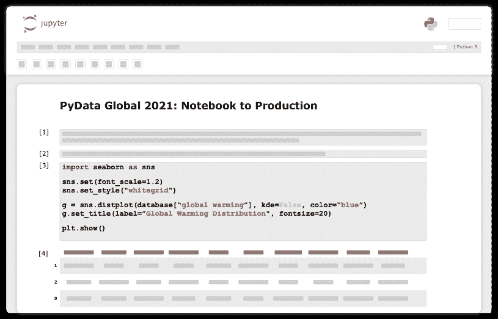
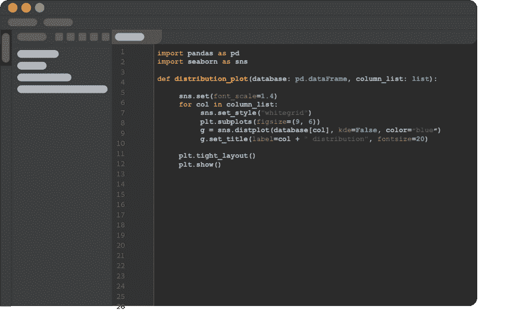
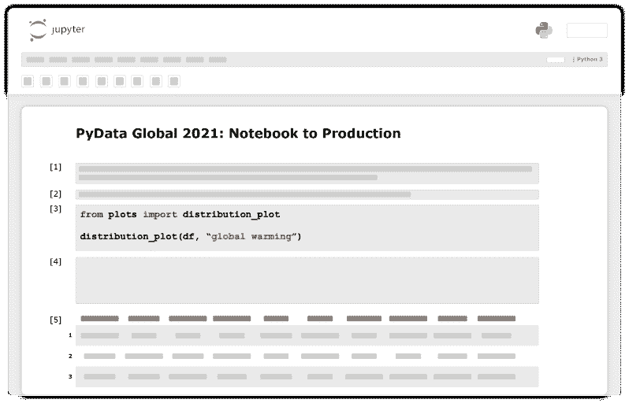
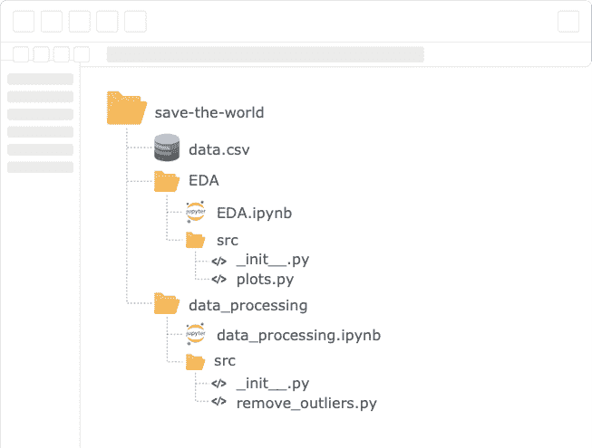
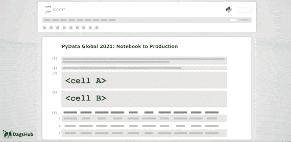

# 数据科学工作流—从笔记本到生产

> 原文：<https://towardsdatascience.com/data-science-workflows-notebook-to-production-26afc13442bb?source=collection_archive---------13----------------------->

图片来自 PixaBay

## 使用各种 MLOps 工具和技术缩短从研究到生产的时间。

将在笔记本中开发的项目重构到生产就绪状态是一项挑战，会消耗我们的时间和资源。在 DagsHub，我们采访了来自数百家公司的数据科学从业者和 ML 工程师，试图了解他们的工作流问题和解决方案。在这篇博客中，我将把我们两年的研究构建成一个结构化的工作流，它将帮助您使用 MLOps 工具和技术减少研究和生产之间的迭代时间。

# 将模型部署到生产环境时的注意事项

实现 DagsHub 的产品剧本，我想通过思考我们在将模型部署到生产时的考虑来开始我们的旅程。

当我想到生产时，首先想到的是将产品交付给不同的团队——在公司内部或外部。因此，我们希望我们的结果是可靠的，而且在许多情况下，是可以解释的。我们还想降低生产中出现错误的风险；因此，我们的项目应该是可测试的，不仅是代码，还有模型、数据、管道等。当产品中出现错误时，我们需要一种方法来重现产品的状态。这意味着不仅可以访问所有不同的组件，还可以访问相关的版本。最后，我们希望部署过程尽可能自动化，减少研究团队和 MLOps 团队之间的摩擦。

基于这些考虑，让我们回到起点。我们通常会通过测试和原型化我们的假设来开始一个项目，我们的工具将是笔记本。

# Jupyter 项目

诞生于 2014 年的[IPython](https://ipython.org/),[项目 Jupyter](https://jupyter.org/) 已经在数据科学界得到了热烈的采用，成为原型开发事实上的标准工具。它的影响在 2017 年得到了正式认可，当时[被选为 ACM 软件系统奖](https://blog.jupyter.org/jupyter-receives-the-acm-software-system-award-d433b0dfe3a2)，这是一项与 [Unix](https://en.wikipedia.org/wiki/Unix) 、 [Web](https://en.wikipedia.org/wiki/World_Wide_Web) 、 [Java](https://en.wikipedia.org/wiki/Java_(programming_language)) 等分享的荣誉。

“Jupyter 项目”的谷歌趋势，作者图片

然而，如果你探索一些数据科学社区，你会得到这样的印象，笔记本是万恶之源。我不同意。我认为笔记本很棒！它们为我们提供了一种处理代码的交互方式。包括 DagsHub 在内的许多公司都选择笔记本界面来存放他们的教程和交互式手册。它们有内置的可视化功能，有利于与技术同事或不太懂技术的利益相关者交流您的工作。所有这些都意味着它们非常适合快速原型制作。

# 在生产中使用笔记本电脑的缺点

然而，当您的项目发展并变得越来越复杂时，更不用说进入生产阶段了，您很可能会碰壁。根据我们的研究，我们绘制了数据科学家面临的五个核心困难:

*   **再现性** —使用笔记本电脑，我们可以运行乱序代码，并在运行一次后编辑单元格。这对于可再现性来说是一个巨大的缺点，这使得我们在执行实验时要花很多精力来跟踪内核状态。
*   **版本控制** — Jupyter 笔记本基本上都是很大的 [JSON](https://en.wikipedia.org/wiki/JSON) 文件，Git 不容易区分，很难审核(更不用说合并)变更。
*   **调试** —笔记本有一个[调试器工具](https://blog.jupyter.org/a-visual-debugger-for-jupyter-914e61716559)，但是随着笔记本越来越长，使用起来就变得很痛苦。
*   **测试&重用** —笔记本单元中托管的代码不能从外部位置调用，也不容易测试。
*   [**CI/CD**](https://www.redhat.com/en/topics/devops/what-is-ci-cd) —缺乏适当的 CI/CD 工具来自动化部署流程。

如果您在使用笔记本电脑时遇到了其他挑战— [我很乐意听到这些挑战](https://www.linkedin.com/in/nir-barazida/)！

有些人甚至将笔记本电脑投入生产，在我看来，这是不推荐的。它无视行业标准、工作流程和最佳实践。此外，我们仍然缺少适当的 CI/CD 工具来支持部署生命周期，笔记本电脑需要大量清理和打包数据科学家技能集之外的库，并且在生产中使用其他工具时很难运行。

“但是你好，[网飞](https://netflixtechblog.com/notebook-innovation-591ee3221233)将他们的笔记本投入生产”，这是一个在 [MLOps.community](https://mlops.community/) 中经常使用的论点。是的，一些大公司在生产中使用笔记本电脑，但他们投入了大量资源来支持这样的工作流，在大多数情况下，你不会有或不想转移这项任务。

承蒙[哈默尔侯赛因](https://twitter.com/HamelHusain)许可

# 解决方案的组成部分

考虑到上述挑战和生产方面的考虑，我将行业中目前使用的最佳实践收集到一个基于六个组件的结构化工作流中。

*   **转换成脚本** —将代码转换成脚本中托管的函数。
*   **Monorepo 战略** —使用“monorepo for data science”结构来降低复杂性并扩展我们的工作。
*   **版本化一切** —版本化所有项目组件——代码、数据、模型等。
*   **实验跟踪** —自动记录实验过程，以帮助我们理解项目历史，并使人们能够查看高级结果。
*   **导出逻辑** —将逻辑步骤移至外部脚本，以避免在生产中使用笔记本，并维护一个代码库。
*   **单元测试**——编写项目组件的测试，投入更多精力测试低层次的组件，为其他组件奠定基础。

如果你找到了克服我们面临的挑战的其他方法，我很乐意再一次听到这些方法。

# 示例场景

在我们的示例场景中，团队领导刚刚与董事会通过电话，漏斗中有一个新项目——“拯救世界”。他们刚刚发送了数据集，很明显，他们希望模型尽快投入生产！所以我们打开一个新的笔记本，尝试一下。

项目结构，按作者分类的图像

# 转换成脚本

我们的第一步可能是探索手头的数据。例如，检查特征分布。

Jupyter 笔记本伪代码，图片由作者提供

现在，我们需要进行的最重要的观念转变来了。在让最初的一段代码做了它被设计要做的事情之后，我们将它重构为一个 python 函数，这个函数不依赖于任何全局变量，而是把一切都作为参数。我们将在笔记本之外的 python 脚本中存储该函数，这将使它可以从项目中的任何地方调用。

IDE 伪代码，图片由作者提供

接下来，我们将把该功能导入笔记本并使用它。

Jupyter 笔记本伪代码，图片由作者提供

# 解锁功能

*   **代码版本控制** —使用标准工具对我们的代码进行版本控制。
*   **无隐藏状态** —功能的输入和输出定义清晰，没有副作用。代码更清晰，可测试，可重复。
*   **保持干爽(不要重复自己)** —在这个项目或者其他任何地方重用代码。
*   **Lint** —使用静态代码分析工具，一种行业标准，来标记编程错误、bug、风格错误和可疑结构。

# 单一回购策略

既然我们已经使我们的项目更加模块化，我们希望利用它，并通过实施良好的旧 monorepo 策略变得更具可扩展性。[mono repo](https://en.wikipedia.org/wiki/Monorepo)(“mono”意为“single”，“repo”是“repository”的缩写)是一个基于主干的开发实现，其中许多项目的代码都存储在同一个存储库中。知名公司都采用这种策略，比如[谷歌](https://research.google/pubs/pub45424/)、[脸书](https://buck.build/)、[微软](https://rushjs.io/)等等。

# monorepo 与数据科学有什么关系？

数据科学项目可以分为完全独立的阶段，例如 EDA、数据处理、建模等。如果我们将每一步作为一个独立的部分来处理，我们将能够将项目划分为实际上是子项目的子任务。使用这种心态，我们将能够通过在不同的团队成员之间划分任务来扩展我们的工作，这些成员将彼此独立，同时征服项目。

我们会注意到，每一级都只依赖于前一级的输出。例如，建模步骤只需要处理阶段的输出。这就是为什么我们想通过产生一个最小的有价值的管道，MVP 来打开瓶颈，并让每个子团队开始工作。一旦一个团队开发出一个有用的产品，他们就会发布他们产品的更新。

现在，我们将为每个独立的子任务提供一个 python 模块，并作为项目管道中不可或缺的组件。此外，我们将为每个任务准备一个笔记本，而不是为整个项目准备一个长长的笔记本。

项目结构，按作者分类的图像

# 解锁功能

*   **扩展** —我们可以扩展项目合作者的数量，增加我们的[产品/时间]，并以 X 倍的速度投入生产。
*   **维护、检查&调试**——拥有更短的面向任务的笔记本，将更容易维护、检查&调试它们。
*   **入职** —项目的清晰结构使得入职流程更加容易。

# 版本控制

一旦到了我们与其他人合作的地步，它只敲响了一个钟——[版本控制](https://www.atlassian.com/git/tutorials/what-is-version-control#:~:text=Version%20control%2C%20also%20known%20as,to%20source%20code%20over%20time.)。对于这个任务，我们将使用 [Git](https://git-scm.com/) ，这是一个业界广泛采用的开源工具，对于并行工作建模和代码文件版本控制非常有用。Git 使我们能够使用标准的 CI/CD 工具，通过点击一个按钮来恢复以前的工作，隔离工作环境，等等。如果你想深入研究数据科学的 Git，Martin 在他的文章中完美地解释了这一点。

# 但是非代码工件呢？

假设数据处理团队创建了一个新的数据集；他们应该改写旧版本吗？或者通过创建一个新文件夹并给它一个有意义的名称(例如 new_data_v3_fixed_(1)_best.csv)来对它进行石器时代版本化？这两种选择都不合适。这就是为什么我们也想对我们的大文件进行版本控制。

Git 是为管理软件开发项目和版本化文本/代码文件而设计的。因此，Git 不处理大文件。Git 发布了 [Git LFS](https://git-lfs.github.com/) (大型文件系统)来克服大型文件版本控制，比 Git 更好，但在伸缩时失败。此外，Git 和 Git LFS 都没有针对数据科学工作流进行优化。为了克服这一挑战，近年来出现了许多强有力的工具，如 [DVC](https://dvc.org/) 、[三角洲湖](https://delta.io/)、[湖沼](https://lakefs.io/)等等。

达格舒布 x DVC——经许可，由达格舒布提供

在 DagsHub，我们[与 DVC](https://dagshub.com/docs/integration-guide/integration-guide/#dvc) 整合，我喜欢使用它。首先，它是[开源的](https://github.com/iterative/dvc)。它提供管道功能，并支持许多云提供商进行远程存储。此外，DVC 作为 Git 的扩展，允许您在工作中继续使用标准的 Git 流程。如果你不想两个工具都用，我推荐使用 [FDS](https://dagshub.com/pages/fds/) ，一个[开源](https://github.com/DAGsHub/fds)工具，让机器学习快速&的版本控制变得容易。它将 Git 和 DVC 结合在一起，负责代码、数据和模型版本控制。(偏见警告:DagsHub 开发了 FDS)

# 解锁功能

*   **再现性** —拥有一个版本下所有项目组件的状态使我们能够通过点击一个按钮来再现结果。
*   **避免由文件名完成的临时版本控制**。代码输出到同一个文件并对其进行版本化。
*   **避免因为小错误而覆盖工作**并具有轻松恢复文件的能力。
*   **共享&同步**版本使与其他人的协作更加容易。

# 实验跟踪

将我们的代码转移到函数中可以更容易地控制它们得到的输入。这有助于我们管理每次运行的配置，并轻松跟踪每次实验的超参数。我们将把配置移动到一个外部文件中，每个模块将导入它的相关变量。

但是可以想象，用 Git 跟踪每个实验会变得很麻烦。我们希望自动完成每次运行的日志记录过程。与大文件版本控制一样，近年来出现了许多实验日志工具，如 [W & B](https://wandb.ai/site) 、 [MLflow](https://mlflow.org/) 、 [TensorBoard](https://www.tensorflow.org/tensorboard) ，不胜枚举。在这种情况下，我相信，你选择用哪把锤子去敲钉子并不重要，只要你把它打穿就行。

请注意，当使用外部工具时，您只能记录实验信息，而不能再现它。因此，我建议在工具和用例之间混合 n' Match。建立一个新假设的原型可能不会提供有意义的结果；因此，我们将使用外部工具来记录实验。然而，在得到一个有意义的结果后，我们将对所有的项目组件进行版本化，并将它们封装在一个 Git commit 下，这样只需点击一个按钮就可以重现。

# 解锁功能

*   **研究历史** —自动化实验跟踪过程将确保记录所有的研究历史，使我们能够理解高水平的结果，并避免重复我们的工作两次。
*   **分享** —与团队分享实验结果，同时能够进行比较。
*   **再现性** —再现实验(在某种程度上。)
*   **避免实验的临时记录**，这将因团队成员而异。

# 将逻辑导出到脚本

在部署到生产环境之前，我们希望将笔记本中存储的所有逻辑步骤转移到 python 脚本中。然而，我们不想失去笔记本电脑的功能；因此，我们将它们重新导入笔记本。

# 解锁功能

*   **在生产中只使用脚本**，这是行业标准，更容易处理。
*   **维护一个代码库**，而不是同时在笔记本和脚本中。
*   **继续使用笔记本**并利用它们的优势。

# 单元测试

与软件开发一样，我们希望确保我们的代码/模型做它被设计要做的任何事情。它伴随着数据处理、建模和所有流水线阶段。在编码过程中编写测试实际上会让你整体工作得更快。因为你得到了一个紧密快速的反馈循环，可以及早发现错误，所以调试问题会容易得多，因为你可以单独调试每个单元，而不是调试整个运行的系统。

# 解锁功能

*   生产中的错误更少，睡眠时间更长。

# 摘要

Jupyter notebook 是一个用于原型和探索性分析的优秀工具，毕竟它赋予了我们超人的能力。然而，当在以生产为导向的环境中工作时，它的局限性就显露出来了。当一个新项目进入漏斗时，我强烈建议考虑生产方面的考虑，在项目中应该使用什么工具，以及如何使您的工作更加高效。您可能通过模型的性能来衡量您的工作，但是您是通过产品的迭代时间和质量来衡量的。

如果你正面临着我在这篇文章中没有提到的挑战，或者正在思考克服它们的更好的方法——我很乐意听到这些！你可以随时联系 LinkedIn 和 T2 Twitter。