# R 中目标包的数据科学工作流:包含代码的端到端示例

> 原文：<https://towardsdatascience.com/data-science-workflows-with-the-targets-package-in-r-end-to-end-example-with-code-1e31318074c4?source=collection_archive---------5----------------------->

## 结构化且可重现的分析方法


马库斯·斯皮斯克在 [Unsplash](https://unsplash.com?utm_source=medium&utm_medium=referral) 上的照片

## 介绍

我们在工作中或日常杂务中所做的任何任务都很有可能是重复性的。这并不是说任务会完全保持不变，在这个过程中可能需要改变，但是组织子任务来更有效地完成总体目标，并且以最少问题的精简方式总是理想的。

随着时间的推移，我们已经开始在数据任务中采用这种类似于[装配线](https://en.wikipedia.org/wiki/Assembly_line)的概念(例如，数据加载、数据准备、模型构建、结果展示等。是在工作流和管道中构建的),由此带来的改进为这种方法提供了有力的支持。事实上，由于我们工作中的迭代性质和思维能力需求，数据科学家在处理此类任务时必须具备一定程度的组织和精简能力。

## 为什么推荐工作流程/管道和再现性？

为什么我们需要将代码组织成结构化的工作流/管道格式？有什么帮助？

1.  ***数据科学工作计算量大，需要时间运行—*** 过程中的任何更改都可能意味着整个代码或部分代码的重新运行。由于时间和计算的成本影响，有必要有一种简化的方法来重新运行，其中只运行更新的代码和工作流中与更新的代码相互依赖的那些部分。智能高速缓存和存储功能应该使结果的再生更容易、有效和无错误。
2.  ***容易迷路—*** 你看到的数据科学工作流上的大多数图形都会有一个循环元素。这种迭代的性质来自于所涉及的各方，例如，领域专家、数据科学家、工程师、业务涉众等。几乎所有的数据科学项目都经历了一轮变革，不仅在目标方面，而且在数据、模型、定义、参数等方面。这可能对迄今完成的工作产生下游影响。在所有这些变化和没有结构的粗糙代码中，很容易在多次更新中迷失。虽然像 [Github](https://github.com/) 这样的工具可以帮助您管理代码版本，但是为您的所有分析建立一个管道结构并将其模块化以便更好地管理整个工作流仍然是非常重要的。举一个例子，在下图中，即使只是准备和执行探索性数据分析(“EDA”)，从数据中提出商业案例和关于人工智能解决方案的建议，这项工作也可能是非常迭代的，直到我们获得最终结果。这从下面几乎每个阶段的循环中可以看出。

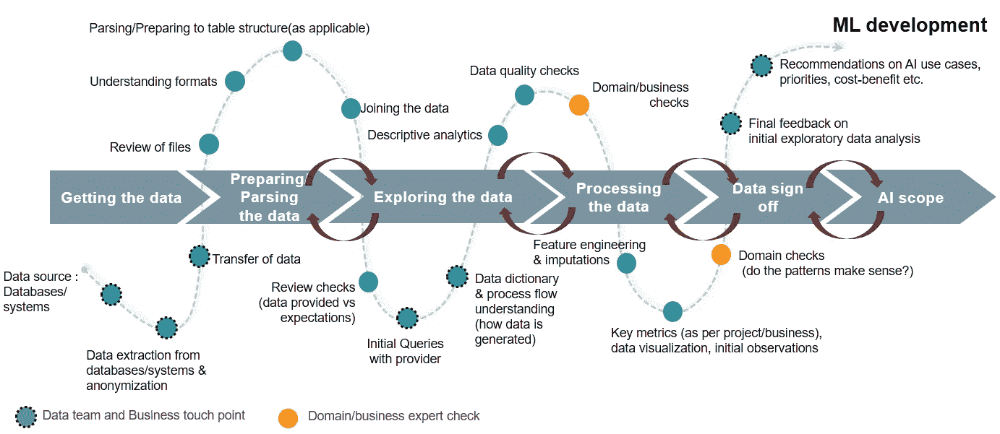

图片来源:作者

3. ***干净的代码和*** ***协作—*** 通过将您的代码变成更小的模块化功能块，您可以将代码分解成小任务，按照逻辑顺序组织它们，并减少代码中的混乱和噪音。这通常是一种好的做法。此外，当在团队中工作并复制完全相同的结果时，这样的实践对于调试、检查和纠正变得至关重要。

## 德雷克和塔吉特百货公司的套餐

虽然 Python 一直被认为在这一领域更先进，但 R 一直在快速追赶。这里第一个受欢迎的包是德雷克。它[分析您的工作流程](https://books.ropensci.org/drake/plans.html)，用最新的结果跳过步骤，并用[可选的分布式计算](https://books.ropensci.org/drake/hpc.html)协调其余步骤。最后，`drake`提供了你的结果与底层代码和数据相匹配的证据，这增加了你信任你的研究的能力。

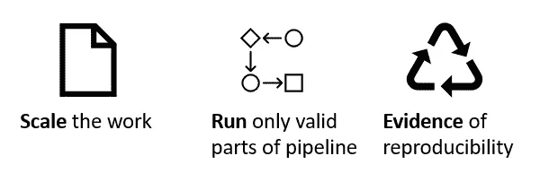

图片来源:作者

2021 年 1 月，德雷克被更强大、更容易使用的[目标](https://docs.ropensci.org/targets/)取代。它处理了围绕数据管理、协作、动态分支和并行效率的大量空白。这里有更多关于 Drake 上的目标的增强和好处的细节[。](https://books.ropensci.org/targets/drake.html)

Targets 的主要增强之一是元数据管理系统，它只在管道实际运行时更新全局对象的信息。这使得了解对代码的哪些特定更改可能会使您的结果无效成为可能。在运行时间很长的大型项目中，这个特性极大地有助于再现性和安心。下面给出的流程示例显示了最新或过期的工作流部分(基于用户更改)。这是实时检测的，并在工作流程中更新。我们将在下面的图片中看到这一点，这些图片显示了工作流的简化视图，在实际的现实世界数据科学项目中，工作流可能会变得非常复杂和冗长。因此，数据科学家将会欣赏快速可视化和理解变化和依赖性的能力。

## 走查示例

在我们的例子中，我们将使用流行的 [Titanic](https://www.kaggle.com/c/titanic) 数据集。虽然工作流可以根据用户的工作需要而细化和复杂，但是为了说明目标的效用，我们将保持它的简单性和标准性。我们的工作流程包括:

**A.** 加载数据
**B.** 数据预处理
**C.** EDA markdown 笔记本生成
**d .**[Xgboost](https://xgboost.readthedocs.io/en/latest/)在 markdown 中对模型诊断的一些结果进行测试集的建模和预测

这些步骤涵盖了科学家遵循的标准过程数据，但是在每个阶段都有迭代，我们将通过下面的例子说明目标的不同方面。

1.  ***文件夹结构*** 让我们用下面的结构创建一个名为“目标”的根文件夹(这是一个例子，不同的数据科学家可能遵循不同的做法)。在目标范围内，我们有:

来源:作者

这里需要注意的重要一点是`_Targets.R`应该在根文件夹中。

***2。创建在目标*** 中使用的函数在这里，我们创建一些[函数](https://swcarpentry.github.io/r-novice-inflammation/02-func-R/)作为开始，它们将成为我们工作流的一部分。作为示例的一部分，请参考下面加载和预处理数据的函数(步骤 A 和 B)。

***3。定义、可视化和执行工作流*** 首先，我们创建一个仅包含任务 A 和 B 的管道，即加载和预处理数据。

目标确定后，让我们来看看流程:

```
tar_glimpse() 
```

这给出了目标的有向非循环图，并且不考虑元数据或进度信息

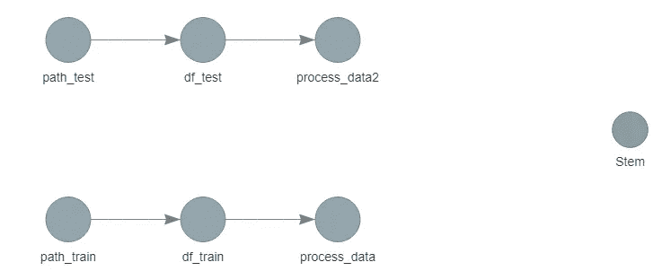

图片来源:作者

```
tar_visnetwork()
```

这给出了目标、元数据或进度信息、全局函数和对象的有向非循环图。正如我们在下面看到的，Targets 已经自动检测到了依赖项，以及到目前为止还没有使用的函数，例如，`bar_plot`。我们还看到，以下所有内容都已过时，因为我们还没有运行目标，这将是我们的下一步。

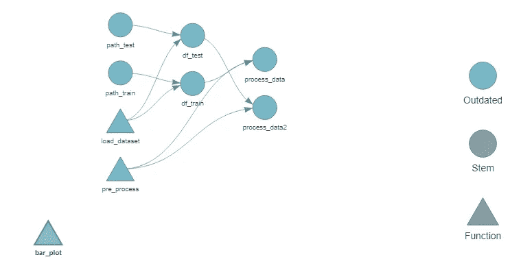

图片来源:作者

除了上面的命令，您还可以使用`tar_manifest()`来确保您已经正确地构建了您的管道。

现在我们运行管道:

```
tar_make()
```

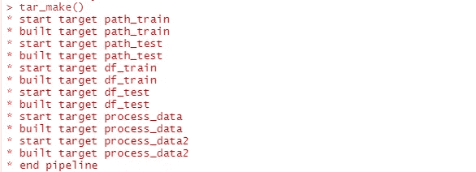

图片来源:作者

这将按照正确的顺序运行正确的目标，并通过创建新的 folder _targets 将返回值存储在根文件夹中。这个文件夹会有`_targets/objects`和`_targets/meta`。现在，当我们使用`tar_visnetwork()`可视化管道时，所有的目标都被更改为“最新的”。

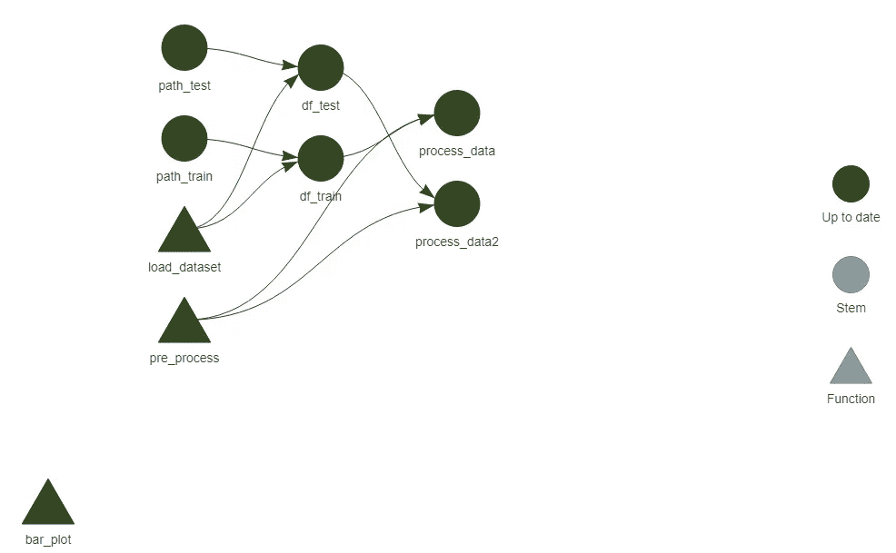

图片来源:作者

***4。访问文件*** 要访问文件，您可以使用目标包中的`tar_read()`或`tar_load()`。

这为我们提供了以下数据集:

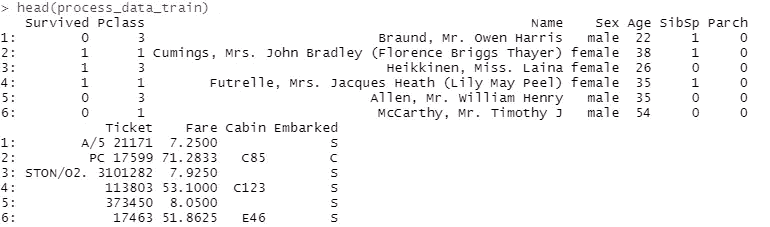

图片来源:作者

如前所述，文件也存储在对象部分:

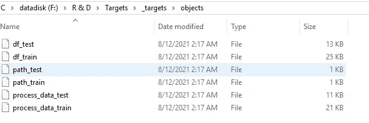

图片来源:作者

您还可以指定您想要存储文件的格式，例如`rds`。目标可以返回多个文件，这些文件可以存储为一个列表，在目标中返回，然后作为`target_loaded_file@..`进行检索

***5。工作流程的变更* I.** 同一工作流程内的变更
首先让我们从对整个工作流程进行变更开始。例如，在加载数据集函数中进行更改:

一旦我们完成了更新并通过`tar_visnetwork()`检查了工作流，我们可以在下面看到 Targets 自动检测依赖关系并相应地更新所有后续目标。在`tar_make()`中，它将相应地重新运行所有过时的目标。

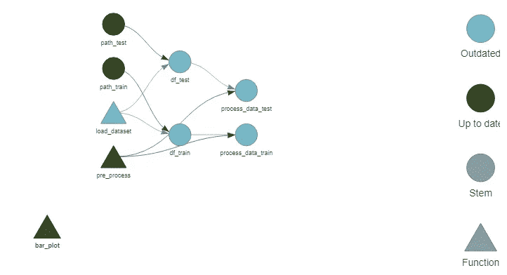

图片来源:作者

类似地，举例来说，如果我们在步骤 B 中对流程数据代码进行更改，并删除`na.omit()`

然后查看工作流程:

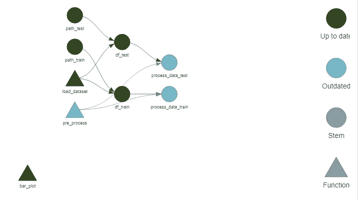

图片来源:作者

我们只能看到“流程数据培训”和“流程数据测试”已经过时，需要重新运行。因此，目标将跳过`tar_make()`中之前的组件。

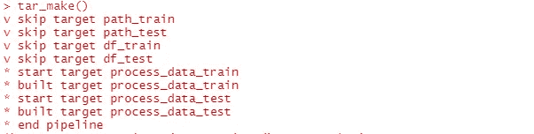

图片来源:作者

**二。添加到工作流:EDA** 现在让我们将一个简短的 EDA markdown 笔记本(步骤 C)添加到工作流中。下面是一个示例代码:

这可以在`_Targets.R`中添加如下:

这反映在新的工艺流程中:

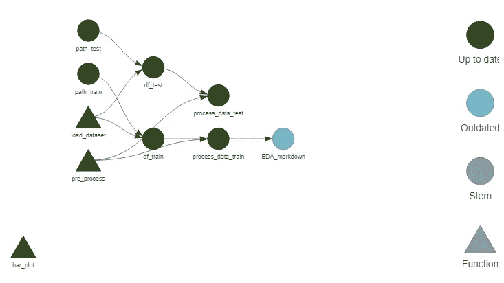

图片来源:作者

这给了我们训练数据集的 EDA 降价。通过简单地改变代码中加载的源目标数据并在`_Targets.R`中创建一个新的目标，这也可以很容易地被测试数据集重用。

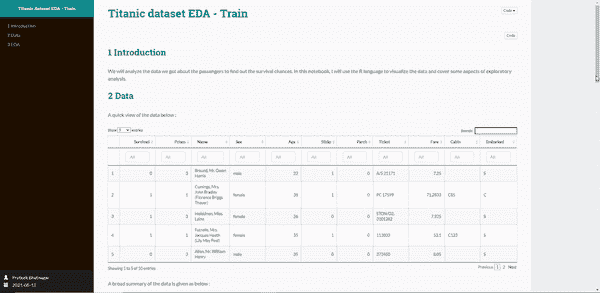

图片来源:作者

**三。工作流的补充:建模降价和预测** 与 EDA 降价类似，我们现在可以创建一个降价来创建一个模型(也可以放入一个单独的函数中)并显示我们的模型结果。下面给出了一个示例`Rmd`(构建模型，生成模型诊断图像，对测试进行预测并保存结果),接着是新的流程:

我们将它添加到目标流中。

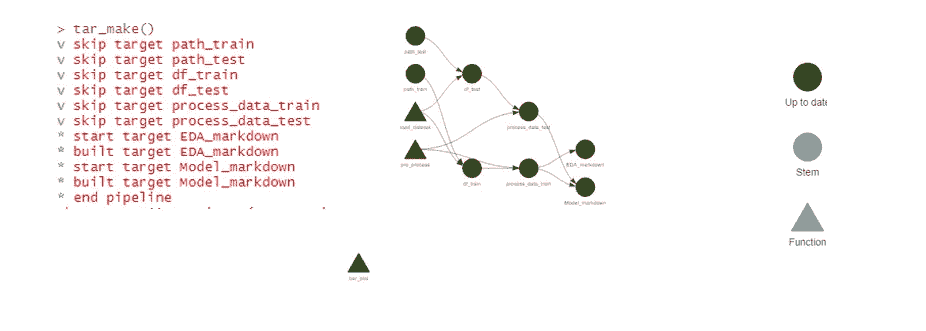

图片来源:作者

最终的降价如下所示:

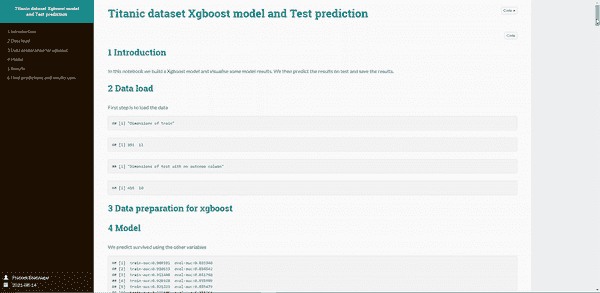

图片来源:作者

在[目标](https://docs.ropensci.org/targets/)页面上有许多其他功能可以帮助排序、优先排序、摧毁目标，还有更多功能可以找到。

**关于**[**renv**](https://rstudio.github.io/renv/articles/renv.html)**&**[**Docker**](https://www.docker.com/)**的说明—实现完全的再现性和生产化** 为了确保您的工作最终可以投入生产，还会涉及到一些组件，最好掌握这些组件的工作知识，以便在开发或部署阶段掌握再现性。

1.  Renv 带来了项目本地的 R 依赖管理，使您的同事和评审人员能够重新创建与您的开发相同的环境，从而轻松地产生您的结果。考虑到各种软件包的众多版本和更新，r 用户可以理解这一点。我的同事[刘](https://github.com/6chaoran)写的一篇精彩的博客教程[提供了如何使用 renv 的细节。](https://6chaoran.github.io/data-story/data-engineering/introduction-of-renv/)
2.  Docker 是最后一步，与 renv 配合得非常好。以前，当我们想用 docker 封装 R 代码用于生产/部署时，我们需要创建一个单独的 R 代码，列出所有的`install.packages`命令。现在我们可以使用 renv 方便地呼叫 code⁴的一条线路。上面我同事写的文章也涵盖了 Docker。

将类似管道的工具包(如 Targets)与依赖和容器化工具包(如 renv 和 Docker-R)作为一种语言，在生产就绪部署领域进展迅速。

## 一些其他选项和参考:

Targets 上有一些其他的(虽然不是很多)资源，但是 Drake 上有更多，这是一个更老的包。在 Targets 上，作者的一些好的视频可以在这里访问[，另外一个好看的是布鲁诺的这个](https://www.youtube.com/watch?v=Gqn7Xn4d5NI&t=5913s)[视频](https://www.youtube.com/watch?v=FvJ4xRGiEgw&t=909s)。

除了目标之外，还有其他一些可以探索的包，比如[改造](https://github.com/richfitz/remake)包。虽然看起来与 Targets 非常相似，但我还没有使用这个包来进行评论。

另一个选项是 [Ruigi](http://Ruigi) ，它类似于 Python [Luigi](https://github.com/spotify/luigi) 中的对应项。Python 用户，跳到 R 可能更喜欢这个包。

最后，有关不同语言和工作方面的管道工具包的详细列表，请参考:

[](https://github.com/pditommaso/awesome-pipeline) [## GitHub-pditommaso/awesome-pipeline:一个精心策划的 awesome 管道工具包列表，灵感来自…

### 一个精心策划的令人敬畏的管道工具包列表，灵感来自令人敬畏的系统管理员 DVC-ML 数据版本控制系统…

github.com](https://github.com/pditommaso/awesome-pipeline) 

# 结束语

虽然上面的例子相当简单，可能没有反映数据科学工作可能具有的复杂性、迭代和输出范围，但它反映了目标的效用，并且只显示了随着工作变得越来越复杂和代码变得越来越混乱，它会有多么有用。

## 参考

1.  [https://books.ropensci.org/targets/](https://books.ropensci.org/targets/)
2.  [https://towards data science . com/this-is-what-the-ultimate-r-data-analysis-workflow-looks-like-8e 7139 ee 708d](/this-is-what-the-ultimate-r-data-analysis-workflow-looks-like-8e7139ee708d)
3.  【https://rstudio.github.io/renv/articles/renv.html 
4.  [https://6 Chao ran . github . io/data-story/data-engineering/introduction-of-renv/](https://6chaoran.github.io/data-story/data-engineering/introduction-of-renv/)
5.  [https://SW 木工. github . io/R-新手-炎症/02-func-R/](https://swcarpentry.github.io/r-novice-inflammation/02-func-R/)