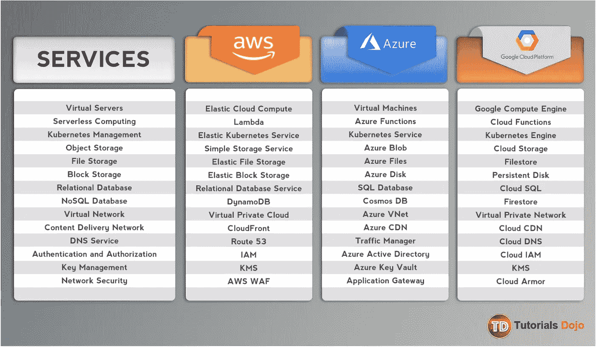

# 数据科学零年:你的第一份工作

> 原文：<https://towardsdatascience.com/data-science-year-zero-514653f5b212?source=collection_archive---------38----------------------->

## 在你的第一份数据科学工作中超越期望的可行指南。

由[斯科特·格雷厄姆](https://unsplash.com/@homajob?utm_source=unsplash&utm_medium=referral&utm_content=creditCopyText)在 [Unsplash](https://unsplash.com/@homajob?utm_source=unsplash&utm_medium=referral&utm_content=creditCopyText) 上做东西

**一句话:一些即将毕业的大学生向我咨询如何获得数据科学&分析职位。在这篇文章中，我将总结过去一年我学到的经验教训，希望你能从中找到一些价值。**

**目录:
1。我开始
2 的时候缺什么。学习的技巧和工具
3。先学哪个技能
4。职场建议**

# 我开始时所缺少的(你也是)

弄清楚“Prod”是什么意思，花了我很尴尬的时间，比我想承认的要长。当我终于弄明白的时候，那确实是一个灵光一现的时刻，因为几分钟之内，几年的问题就有了答案。

我从来都不太关心软件开发，我相信 CSV 和 Kaggle 竞赛都让我很不爽。当我开始的时候，我觉得我还没有准备好在一个“真实环境”中工作，在这个环境中，你不需要每次都下载一个 Parquet 并把它加载到 PySpark 中来完成一些事情。

软件工程师在进入公司的第一天就了解了 Prod 环境。然而，数据科学仍然在大多数年轻的组织中找到立足点，除非他们出售数据驱动的产品。工程师认为你在那里是为了商业智能(BI)，而业务团队认为你已经在“技术方面”打下了基础。

我没有，也许你也没有！

在这里，我整理了我作为唯一的数据科学人员在 [SmartServ](https://medium.com/u/29b3e8fe7861?source=post_page-----514653f5b212--------------------------------) 工作的第一年所学到的东西(因此也是错误), SmartServ 是一家 SaaS 的初创公司，面向美国和加拿大的非办公桌工作人员。其中一些可能不是你——刚从大学毕业——所期望的，但是因为这篇文章恰好是关于“脱颖而出”，所以我把我所知道的一切都包括进来了。在我开始之前，我什么都不知道，也许你应该知道。

# 排名不分先后:

由 [Kumpan Electric](https://unsplash.com/@kumpan_electric?utm_source=unsplash&utm_medium=referral&utm_content=creditCopyText) 在 [Unsplash](https://unsplash.com/s/photos/production-line?utm_source=unsplash&utm_medium=referral&utm_content=creditCopyText) 上拍摄

**生产**:掌握“生产环境”是一种范式转变。你总是想知道在[网飞](https://netflixtechblog.com/preparing-the-netflix-api-for-deployment-786d8f58090d)的事情必须如何运行，因为他们不能合理地依赖于每次电影推荐时加载和下载 CSV。但是 [Kaggle](https://www.kaggle.com) 和 [AnalyticsVidhya](https://www.analyticsvidhya.com) 只为最后的 10-20%做准备，也就是说，读取预处理数据&用它来拟合 ML 模型。这些也是一次性的过程——既不可重用也不可扩展。[数据&管道工程](https://www.datacamp.com/courses/building-data-engineering-pipelines-in-python)是在现实世界中是如何完成的。

*   更大的公司雇佣专门的角色。然而，在一家初创公司，你需要端到端的项目。这(大致)包括:
    - [感知数据](https://ieeexplore.ieee.org/document/7184867)
    -获取数据(从[数据湖](https://aws.amazon.com/big-data/datalakes-and-analytics/what-is-a-data-lake/)或 [OLTPs](https://database.guide/what-is-oltp/) )
    - [提取](https://www.talend.com/resources/what-is-etl/)(反规范化、清理并准备使用)
    -将其移动到 [OLAP](https://www.tutorialspoint.com/dwh/dwh_olap.htm)
    -建立[仓库](https://www.tutorialspoint.com/dwh/dwh_olap.htm)
    -创建 ML 模型
    环境的简单介绍:

<https://medium.com/swlh/environments-in-software-development-cf84adbbf197>  

[伊恩·泰勒](https://unsplash.com/@carrier_lost?utm_source=medium&utm_medium=referral)在 [Unsplash](https://unsplash.com?utm_source=medium&utm_medium=referral) 上的照片

*   一旦你完成了《T2 》,我如何把它投入生产？’，你会遇到“**为什么这个没有在生产中运行？它在我的机器上工作！！**”。管理跨环境的依赖关系是一件令人头疼的事情，了解基本的[Docker](https://www.docker.com)/[Kubernetes](https://kubernetes.io)实现会让你受益匪浅。Docker 容器类似于虚拟环境(就像 Python3 中的- [virtualenv](https://pypi.org/project/virtualenv/) )，它们冻结了应用程序将要运行的环境的当前状态(包括所有依赖项)。然后将它部署到生产环境中，在升级和废弃所包含的环境变量时，它保持不变。
*   在更大的组织中，您可能会找到专门的 DevOps 人员来做这件事，但是全栈总是更好。码头工人可以做的比我提到的多得多，但我会把这些留给专家。
    **提示** : Dockers 还可以帮你为自己搭建一个便携的个人开发环境，你可以在旅途中使用。Docker 分步指南:

</docker-for-data-science-a-step-by-step-guide-1e5f7f3baf8e>  

斯蒂芬·菲利普斯-Hostreviews.co.uk 在 [Unsplash](https://unsplash.com?utm_source=medium&utm_medium=referral) 上拍摄的照片

*   **数据库**:吸收功能性数据库概念。你应该至少知道一种**关系语言** (MySQL/PostgreSQL)和一种**非关系查询语言** (MongoDB/CassandraDB)。一旦你找到了一个，剩下的就很容易了。查询日志和优化绝对是加分项，然而，它们不太可能被认可或欣赏。有许多文章可以帮助您开始使用 DBMS。

照片由[EJ·斯特拉特](https://unsplash.com/@xoforoct?utm_source=medium&utm_medium=referral)在 [Unsplash](https://unsplash.com?utm_source=medium&utm_medium=referral) 上拍摄

*   ETL :我一直没有注意到 [ETL](https://www.talend.com/resources/what-is-etl/) ，直到它需要我的时候。除非你的产品利用有意的数据传输(IDT)，否则你无法逃避这一点。ETL 是**提取-转换-加载**的首字母缩写，这是一个你必须重复执行的过程，可能一周要为一百个不同的任务执行几百次。ETL 应用程序允许您模板化整个过程(称为“管道”，使用代码或 GUI)，甚至安排它在指定的时间间隔运行，无需干预。
*   我的工程主管向我推荐了 Pentaho DI Community Edition(早期的 Kettle)，这是一个非常好的应用程序。备选方案包括 Matillion(对云数据源的广泛支持)、Talend 和 Informatica。精明的数据科学家更喜欢使用 **Bash** 进行底层控制，所以你可以选择。Pentaho DI 指南:

<https://medium.com/ai-in-plain-english/getting-started-with-pentaho-data-integration-kettle-and-its-components-ef1e71101323>  <https://medium.com/whispering-data/the-end-of-etl-as-we-know-it-92166c19084c>  

提示**:你最终会想要升级到一个成熟的工作流管理系统(比如 Luigi，Apache Airflow)。此刻我正试图承受气流，这是一个痛苦的世界。但是看起来确实值得，一站式解决。**

克里斯·里德在 [Unsplash](https://unsplash.com/s/photos/python-language?utm_source=unsplash&utm_medium=referral&utm_content=creditCopyText) 上拍摄的照片

*   **脚本**:报道不是你永远不会放弃的东西。虽然 SQL 本身就很强大，但了解一门脚本语言经常会派上用场。脚本语言允许您在运行时执行指定的任务，并按顺序解释它。
*   **Python 是事实上的**，这就是我用于报告(和工作流管理)的东西。我从 R(我个人最喜欢的)[转移到 Python](https://www.tutorialspoint.com/complete_python_scripting_for_automation/index.asp) ，因为:
    -人们不熟悉 R。因此，他们抵制它。
    - R 有并行化限制(扩展性差)，并且部署不友好。这是高度抽象的。因此，调试很快变得具有挑战性。每个人都能读懂 Python3 代码。可重用性提高了，把它传递给新人变得更容易了。

利亚姆·查默尔在 [Unsplash](https://unsplash.com?utm_source=medium&utm_medium=referral) 上的照片

*   **ML/DL/Visualization:** 这是你的堡垒。你会不断积累其他技能，但在内心深处，你永远是一个 ML/DL 奇才或可视化爱好者。然而，在最初几年，项目可能并不总是如你所愿。你可能无法建立统计模型或花哨的推荐引擎。你需要通过从事个人项目或参与开源项目来满足自己的需求。当你找到一个你的技能对产品/公司有用的窗口时，赶紧进去。请参考下面的'**工作场所知识**'。你的准备将确保你在需要的时候脱颖而出。
*   你必须已经熟悉 ML/DL 的 [TensorFlow](https://www.tensorflow.org) 、 [MXNet](https://mxnet.apache.org/versions/1.7.0/) 或 [Torch](https://pytorch.org) 以及可视化的 [ggPlot2](https://ggplot2.tidyverse.org) 、 [Bokeh](https://docs.bokeh.org/en/latest/index.html) 、[plottly](https://plotly.com)。NVIDIA 有一个很棒的开源项目，你可以参与其中:

<https://github.com/NVlabs/few-shot-vid2vid>  

礼貌:[教程道场](https://tutorialsdojo.com/aws-cheat-sheets/)

*   **云计算**:*对于任何数据分析师/科学家来说，这是你的武器库中的顶级技能。大多数开发人员和 DevOps 人员不习惯数据驱动的应用程序(记住，你可能是第一个或第五个数据科学雇员；团队需要时间来适应你的需求)这就是为什么你想尽快开始学习 CC 的诀窍。
*   幸运的是，有太多的**托管平台** (AWS、GCP、Azure、DataBricks)让你构建、测试和部署你的 ML 应用程序变得无比容易。此外,**托管 ML 服务** s(例如 SageMaker)可以帮你减少你可能不想投入的辅助工作。

**以下是我关于 AWS 数据科学云计算解决方案的个人笔记:**

  

由[卢克·切瑟](https://unsplash.com/@lukechesser?utm_source=medium&utm_medium=referral)在 [Unsplash](https://unsplash.com?utm_source=medium&utm_medium=referral) 上拍摄的照片

*   **版本控制(**[**Git**](https://github.com)**):**当你在大型团队中工作时，不可避免地会有多人同时参与项目。这将需要**协作和某种历史以及代码库的变更跟踪**。Git 帮助多人在同一个项目上协作，甚至跟踪对代码库所做的所有更改。它可以做得更多，但这是一个过程，随着经验的积累，你会变得更好。我还在纠结 Git。

</introduction-to-git-for-data-science-ca5ffd1cebbe>  

# TL；大卫:你应该先学什么

在我看来:
**必备技能:** DBMS &脚本> > Git
**技能脱颖而出:**【云计算、ETL】>>Docker>>your forté

# 工作场所学习:

1.  明智地使用统计数据:有权威的人只相信他们理解的事情(这就是为什么他们是做决定的人)。过分使用数字或复合指标，你可能会失去它们，如果没有数字，你将无法支持自己。用基本原理推理平衡数字是一门手艺，我还没有掌握，也许你可以早点开始。
2.  你无法逃避繁重的工作:你有无数的理由不能，接受它并努力完成它。除非你是专门担任 ML 工程师的角色(这对毕业生来说毫无意义)，否则你需要做所有的事情。你将负责所有面向数据的任务。有时，忘记“数据科学”中的科学部分有助于减轻痛苦。
3.  要坚定不移:要把事情做好，你需要有人站在你这边，最好是支持你和你的想法的资深人士。如果你的团队里没有冠军，**去外面找一个冠军**。由于上述原因，在最初的几个月里，我很难完成任何事情。其他人会推行他们的想法，而我站在那里等待事情向我走来(他们从来没有)。有点斗志昂扬，而不仅仅是有点固执。把你的事做完！

# 结论

数据科学角色不是纯粹的技术角色。在一天结束时，你在那里迎合产品及其需求。敢于走出数据科学社区创造的泡沫，我们可能会在某个时候成为优秀的领导者，这完全是因为数据科学在产品-业务组合中的**独特地位**。

本文到此为止。我会试着在其他帖子中分别讨论这些问题。如果你有任何反馈或者任何你想让我在接下来的帖子中提到的东西，请告诉我。我在 [**SmartServ**](https://medium.com/u/29b3e8fe7861?source=post_page-----514653f5b212--------------------------------) 工作，我们总是在那里寻找新的人才。[**寻找任何空缺职位**](https://smartserv-talent.freshteam.com/jobs) 或者顺便打个招呼！