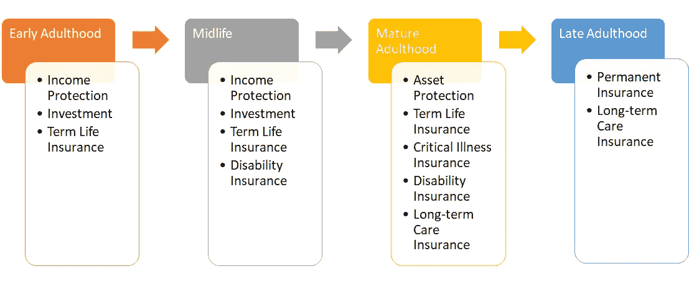

# 保险行业的数据科学家前景

> 原文：<https://towardsdatascience.com/data-scientist-prospect-in-the-insurance-industry-1af297d2abc8?source=collection_archive---------46----------------------->

## 数据科学家如何提升他们在保险行业的职业生涯

朱丽安·利贝曼在 [Unsplash](https://unsplash.com?utm_source=medium&utm_medium=referral) 上的照片

当我问“你想在哪里工作？”我几乎找不到想从事保险行业的人，更别说学数据科学了。我甚至可以问我的任何一个读者一个问题。**请阅读下面的问题**。

> “当你学习数据科学时，你希望在哪个行业担任数据科学家？”

我敢肯定，保险不会成为第一选择，甚至不会成为第二选择，这并不奇怪。

我是一名数据科学家，在保险行业工作，在我年轻的时候，我从未想过会在保险行业工作。我总是梦想成为一名生物学家，或者在学术界度过我的时间，但是事情并不像我想象的那样。

但是，在保险行业工作让我比以前的经历更有成就感。事实证明，新的经历对我来说是一条更好的途径。

本文希望分享 Data Scientist 的保险行业前景，以及它在 2021 年可能会出现的情况。

# **一般保险业**

我想每个人都已经知道保险是什么了。保险不同于另一种产品，在那种情况下，你一付钱就能得到产品；相反，如果发生了什么事，你只能得到一些承诺(通常是金钱上的)。这是保险业产品的主要前提，如果某个事件发生，给你保障。

有许多保险产品:人寿保险、健康保险、财产保险、宠物保险、车辆保险等。只要说出它的名字，你就可能找到它。

虽然有很多种保险，但并不是每个人都需要所有的保险。这取决于他们居住的国家、经济状况、婚姻状况等。毕竟每个人的胃口都不一样。虽然，有一点可以肯定；每个人在人生的某个阶段都需要保险。

终身保险的必要性(图片由作者创建)

上图举例说明了我们在人生的每个阶段都需要什么样的保险。从收入保障到长期护理保险，总有一天我们会需要保险。

# **保险行业对于数据专业**

## 保险数据科学家

我不是来卖保险的，而是作为一名数据专家来解释保险前景。乍一看，保险行业可能没有医疗保健或技术领域那样的炒作，但我想向你展示另一面。

从关于保险的一般解释中，我已经解释了保险涵盖了人生的每一个阶段。在每个阶段，必要性也是不同的。

在过去，保险公司会根据上级的决定或公司的感觉来调整每个阶段的产品。但是，大数据时代的到来改变了一切。保险不仅仅是一个基于本能的古老行业；数据有助于决策。

让我们来看看这个过程是如何随着时间的推移而变化的。最简单的例子是**保险核保流程**(保险公司评估潜在客户承担金融风险并收取费用)。传统上，核保流程需要基于某些数据的**客户评估**；例如性别、年龄、职业等。随着时间的推移，我们意识到评估客户仅限于人口统计，但它可以是任何东西。我们可以从以下方面评估它们:

*   健康可穿戴设备数据
*   社交媒体数据
*   选民名册数据
*   信用报告数据
*   网站分析数据
*   政府统计数据
*   卫星数据

还有很多。关键是我们看待保险问题的方式不会局限于一件事，而是依赖于很多方面。**保险数据科学家需要了解很多方面**；金融、技术、政府、医疗保健等。我并不是说我们需要成为所有这些领域的专家，但伟大的数据科学家肯定会精通所有这些领域。

## **为什么选择保险行业？**

这看起来有点吓人，但回报也很高。数据驱动的决策和人工智能实施在保险行业仍被认为是一个新事物，但它正在慢慢走向数据文化。

对于许多数据爱好者来说，保险业可能是你进入数据科学世界的一个切入点。我认为这个行业的人才稀缺程度已经够高了(如果没有招聘冻结，我甚至会尝试寻找新的数据科学家)。

此外，随着最近进入保险业，只要对公司有利，你可以在数据项目上激发你的创造力。当然，如果管理层不了解数据的好处，工作可能会更加困难；不过话说回来，我觉得每个公司都会这样。

如果您不确定保险行业内有哪些数据项目，我可以给你举几个例子:

*   风险评估
*   欺诈检测
*   索赔自动化
*   客户 360

用例不限于我上面提到的。你可以试着想想你能做的更疯狂的项目。极限毕竟是天空。

现在人们趋向于购买保险，尤其是新冠肺炎疫情的健康和人寿保险。相信我，当我说在疫情的情况下，保险销售数字呈指数增长。出于保密原因，我可能不会展示这些数据，但我相信人们已经意识到健康是多么珍贵。

我试图用数据来评估形势，在更长的时间里，保险业会更加繁荣。随着需求的增加，需要更多的人才来评估形势。如果你在这个行业已经有经验，你可以很容易地在数据领域前进。

# **结论**

当你成为一名数据科学家时，保险行业可能不是你最初认为的行业。尽管如此，对于一些人来说，这可能是一个选择，因为这是一个相对较新的行业，引入了数据文化。为什么保险行业:

*   可能成为有抱负的数据科学家的**切入点**
*   **展示你的创造力**因为这是一个新的数据领域
*   **疫情的保险业**正**呈指数级增长**
*   如果你想跳槽，保险行业数据领域的经验在另一个行业也是可行的。

# 如果您喜欢我的内容，并希望获得更多关于数据或数据科学家日常生活的深入知识，请考虑在此订阅我的[简讯。](https://cornellius.substack.com/welcome)

> 如果您没有订阅为中等会员，请考虑通过[我的推荐](https://cornelliusyudhawijaya.medium.com/membership)订阅。