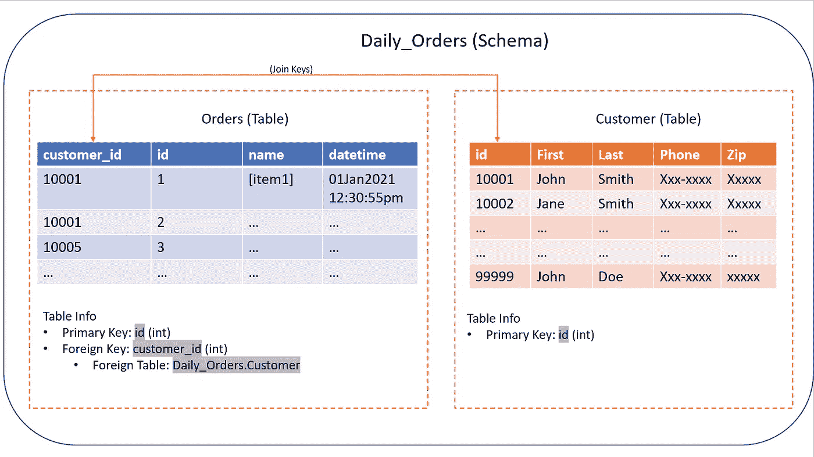
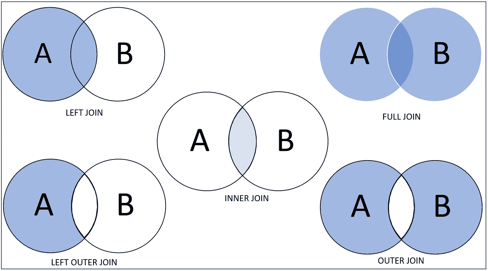
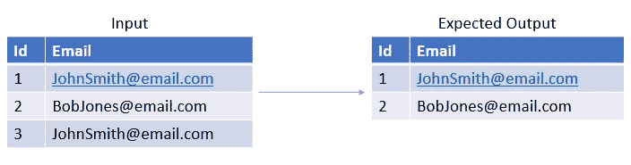
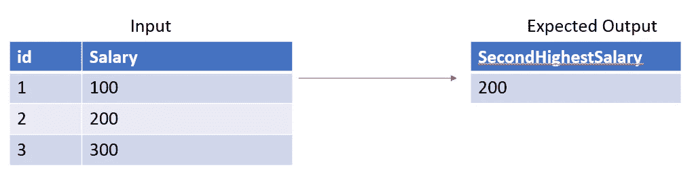
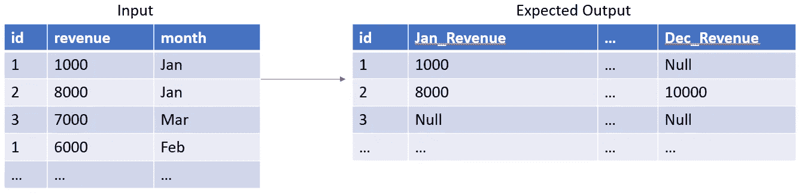

# 数据科学家工具包 SQL 简介

> 原文：<https://towardsdatascience.com/data-scientist-toolkit-introduction-to-sql-f45521990493?source=collection_archive---------12----------------------->

## 在数据科学领域，SQL 是一个强大的工具。在创建奇特的模型之前，必须对数据进行辩论。本文给出了几个 SQL 示例的分解。


照片由 [XPS](https://unsplash.com/@xps?utm_source=medium&utm_medium=referral) 在 [Unsplash](https://unsplash.com?utm_source=medium&utm_medium=referral) 上拍摄

数据科学并不全是花哨的统计模型和魔法(我们预测未来的尝试失败了😂).我任务的一个重要部分是数据和预处理。

B 在任何 python 编码和花哨的模型之前，数据科学家必须从数据开始。在现实世界的应用程序中，数据不是经过整理的 CSV 文件。相反，它以某种原始格式存在于数据库中。结构化查询语言(SQL)就派上了用场。SQL 是数据科学工具包的重要组成部分。本文将向读者提供 SQL 的高级概述。

# 什么是 SQL？

SQL 是一种查询语言，用于管理存储在关系数据库中的数据。这对于结构化数据很有用——行/列和独立表之间的关系。SQL 有许多不同的风格(MySQL、SQL Server、Oracle、Spark SQL 等。)具有不同的语法。在很大程度上，基础是相同的。

**总平面图**

下面我们将介绍构成 SQL 数据库的一些基本组件:

```
1\. *Schema*: It is a container that stores collections of tables, procedures and metadata.2\. *Table:* Structure data in a tabular form (such as an excel table). a. Primary Key: A column that uniquely identifies each row.
    b. Foreign Key: A column that maps a table to another through the relationship between primary key – foreign key.
```



来源:[史蒂文·洛艾萨](https://github.com/StevenLoaiza/Machine_Learning/blob/master/README.md)

**加入**

下面是一些广泛使用的连接的可视化表示(蓝色阴影区域是连接后返回的集合)。有关连接的更多信息，请参见 [GitHub](https://github.com/StevenLoaiza/Machine_Learning/edit/master/README.md#join) 。

***注意*** : *根据软件的不同，连接类型的命名规则可能会有所不同。*



来源:[史蒂文·洛艾萨](https://github.com/StevenLoaiza/Machine_Learning/blob/master/README.md)

# 主题

以下示例将利用源自 [leetcode](https://leetcode.com/) 的 SQL 相关问题。

我遇到的任何问题我总是想:

> 我怎样才能把这个问题分解成更小的步骤？也不要忘记沿途测试。

***例一。删除重复邮件***`***self-join***`*`***delete***`*

*任务:删除重复的邮件，保留最小`Id`的邮件。预期的结果是返回第 1 行和第 2 行。*

**

*资料来源:史蒂文·洛艾萨*

****细分:****

*这些任务可以分为两部分。*

1.  *找到重复的*
2.  *从表中删除它*

*我们可以在电子邮件匹配的地方将表格连接到自身。*

```
*SELECT tbl1.*
    FROM 
        Person as tbl1 
    JOIN Person as tbl2
    ON
        tbl1.Email = tbl2.Email*
```

*我们知道重复的电子邮件会有不同的`Id`。根据说明，我们希望保留最小`Id`的电子邮件。因此，我们要选择最大的`Id`。下面的查询将显示具有相同的`Email`和更高的`Id.`的行*

```
*SELECT tbl1.*
    FROM 
        Person as tbl1 
    JOIN Person as tbl2
    ON
        tbl1.Email = tbl2.Email
        AND tbl1.Id > tbl2.Id*
```

*因为我们的任务是删除行，而不是选择行。我们可以用一个`DELETE`语句代替`SELECT`语句。*

```
***# FINAL SOLUTION**
DELETE tbl1.*
    FROM 
        Person as tbl1 
    JOIN Person as tbl2
    ON
        tbl1.Email = tbl2.Email
        AND tbl1.Id > tbl2.ID*
```

*___________________________________________________________________*

***例二。第 n 大工资** `distinct` `limit` `offset` `ifnull()`*

*任务:从提供的表中查询第二大工资*

**

*资料来源:史蒂文·洛艾萨*

****细目:****

1.  *返回第二大值*
2.  *错误处理:如果没有第二高的薪水，假设有一行，第一个代码窗口中的查询将失败。*

*处理错误是数据处理的一部分。该误差是可预测和可管理的。因此，当它发生时，我们应该明确地处理这些情况。*

*我们利用`DISTINCT`返回唯一的薪水值。如果我们有[100，100，200]的薪水，有[100，200]就足以得出结论，200 是第二大的。`DISTINCT`会给我们足够的信息，`OFFSET`会跳过指定的行数，`LIMIT`会返回指定的行数。*

```
*SELECT 
    DISTINCT Salary
FROM 
    Employee
ORDER BY Salary DESC
LIMIT 1 OFFSET 1;*
```

*用函数 IFNULL()包装上面的查询。如果第一个元素(查询)没有返回结果，函数将返回第二个元素，在本例中为 NULL。*

```
***# FINAL SOLUTION** SELECT IFNULL(
    (SELECT DISTINCT Salary
    FROM Employee
    ORDER BY Salary DESC
    LIMIT 1 OFFSET 1),
NULL)
as SecondHighestSalary;*
```

*___________________________________________________________________*

***例 3。重新格式化部门表** `max` `case()` `groupby`*

*任务:格式化表格，使每个月都有一个部门`id`列和一个总和`revenue`列。*

**

*资料来源:史蒂文·洛艾萨*

****细分:****

1.  *根据`month`列的条件提取`revenue`*
2.  *求和`revenue`*
3.  *按`id`对结果分组*

*`CASE`类似于 IF-ELSE 方法。当满足第一个条件时，它将返回值。如果某个月份出现在`month`列中，我们希望返回收入。*

```
*# Pseudo Example
CASE
    WHEN "***column meets some condition***" THEN "**return this**"
    ELSE "***when condition is not met, return something else***"
END # Actual Syntax Example
CASE 
    WHEN month = ‘Jan’ THEN revenue 
    ELSE null 
END*
```

*`CASE`语句应该嵌套在 sum 函数中，以便合计收入。*

```
*SUM(
    CASE 
        WHEN month = ‘Jan’ THEN revenue 
        ELSE null 
    END
) AS Jan_Revenue*
```

*现在将其形式化为 select 语句。此外，将`SUM`按`id`列分组，确保对每个`id`进行求和。否则，它将错误地合计一月份的所有收入。*

```
*SELECT
    id,
    SUM(
        CASE 
            WHEN month = ‘Jan’ THEN revenue 
            ELSE null 
        END
    ) AS Jan_Revenue
FROM 
    Department
GROUP BY id;*
```

*最后，写下所有 12 个月的案例陈述。*

```
***# FINAL SOLUTION**
SELECT 
    id, 
    SUM(CASE WHEN month = ‘Jan’ THEN revenue ELSE null END) AS Jan_Revenue,
    SUM(CASE WHEN month = ‘Feb’ THEN revenue ELSE null END) AS Feb_Revenue,
    SUM(CASE WHEN month = ‘Mar’ THEN revenue ELSE null END) AS Mar_Revenue,
    SUM(CASE WHEN month = ‘Apr’ THEN revenue ELSE null END) AS Apr_Revenue,
    SUM(CASE WHEN month = ‘May’ THEN revenue ELSE null END) AS May_Revenue,
    SUM(CASE WHEN month = ‘Jun’ THEN revenue ELSE null END) AS Jun_Revenue,
    SUM(CASE WHEN month = ‘Jul’ THEN revenue ELSE null END) AS Jul_Revenue,
    SUM(CASE WHEN month = ‘Aug’ THEN revenue ELSE null END) AS Aug_Revenue,
    SUM(CASE WHEN month = ‘Sep’ THEN revenue ELSE null END) AS Sep_Revenue,
    SUM(CASE WHEN month = ‘Oct’ THEN revenue ELSE null END) AS Oct_Revenue,
    SUM(CASE WHEN month = ‘Nov’ THEN revenue ELSE null END) AS Nov_Revenue,
    SUM(CASE WHEN month = ‘Dec’ THEN revenue ELSE null END) AS Dec_Revenue
FROM 
    Department
GROUP BY id;*
```

# *结论*

*这篇文章是一个起点，但对于任何新事物，实践是必不可少的。许多交互式环境允许你自己尝试问题。我鼓励你看看他们(Leetcode，Datacamp)。*

*我将继续撰写与 SQL 相关的文章，并根据我的经验添加一些真实世界的内容。我希望涵盖的一些主题是事务数据库和通过 spark 的并行计算。*

**一如既往感谢您的阅读。你可以通过*[*LinkedIn*](https://www.linkedin.com/in/stevenloaiza)*联系到我！**