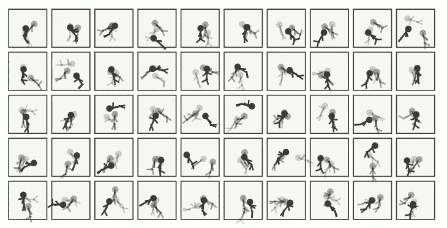

# 数据科学家不会很快离开

> 原文：<https://towardsdatascience.com/data-scientists-arent-going-away-anytime-soon-ae97c1c5eb14?source=collection_archive---------38----------------------->

## 鉴于 OpenAI 的 GPT 的出现，程序员变得过时了

我花了一周的时间阅读 GPT x 模型，以及他们将如何革命性。我在屏幕前花了几个小时看人们在诗歌、编程、机器人对话、小说等领域取得的非凡成果。尽管很兴奋，但我还是半信半疑地阅读了一些文章和新闻，它们声称 GPT 模型将终结程序员和程序员的时代，一篇文章甚至编造了一个术语——狂热的程序员——并预言属于这一群体的人将悲惨地死去。



一个定格的故事！图像是使用上下文无关的语法生成的，通过这种方法，我们宇宙中的许多现象得到了控制，例如树木的生长。事实上，大自然可以制造简单的东西，也可以制造复杂的东西，比如人类和动物，这表明就教导机器而言，我们现在离那个过程还很远(图片由作者提供)

*权力越大，责任越大；*如果你是一名数据科学家，那么你必须采用经验科学方法来获取知识并得出结论。*否则，又有什么意义呢！！！这些文章已经激起了我的兴趣，我决定在我简陋的机器上训练一个模型。我仍然在 GPT-3 的等候名单中，所以我最终使用了 GPT-2。 [***你可以阅读我在本文***](/i-taught-philosophy-to-gpt-2-and-it-felt-i-am-talking-to-a-deranged-but-intelligent-person-875820735af5) 中训练出来的哲学家的幽默成果。*

训练人工智能哲学家非常有趣(有些人需要理解有趣的定义并获得生活)，我不认为我在训练中做得很好，但整个练习提供了一个窗口，让人们了解这些强大的模型以及它们的能力。

是的，我钦佩他们背后纯粹的蛮力和他们产生的结果，但是称他们为程序员的死亡使者还为时过早。

以下是我根据自己的经验得出的看法:

# 可扩展性问题？

GPT-3 是巨大的(1750 亿个参数)，GPT-2(15 亿个参数)也不小，所以关于模型的实时使用有两个因素要考虑:

> 1.程序员有多容易接触到它们？
> 
> 2.他们训练起来有多容易，在生产模式下部署时表现如何？

第二个因素是我非常固执于在本地机器上训练模型而不使用 Colab 或 Paperspace 的想法。我的机器是不起眼的 Macpro-16”没有 GPU 支持(感谢 Nvidia 的 CUDA！不是！！)尽管调整超参数非常简单，但是所花费的时间随着时期的增加而呈指数增长。粗略估计，200 步训练需要 25 分钟。

OpenAI 有[***承认***](https://openai.com/blog/openai-api/) ***这个问题的可扩展性和更大的公司的统治地位和从这样的技术中获益的关联问题。***

# 数据科学家到底是做什么的？

如果你说这是简化论的宣传

```
Data Scientist = Programmer + some bit of Statistician + some bit of Data Modeler
```

是的，所有这些都是你在工作描述中找到的典型角色和职责，但是解决问题和业务方面呢？

理解问题陈述，使其具体化，制定解决问题的策略是更难的问题，不能藏在地毯下面。

你可以让一个复杂的模型来设计一个蓝盒子，但是为什么要设计蓝盒子(或者任何颜色的盒子)以及在解决周期的哪个阶段是重要的步骤。

# 我们信任机器了吗？

问问你自己，你准备好让电脑来处理你的日常生活了吗？我参加了一个符号学研讨会，客户最常见的抱怨是“ ***我想和一个真人*** 说话”。North Face 最终将其客户代表从聊天机器人改为人类，他们看到了客户满意度的积极增长。

这告诉我们人类的倾向，以及同样的情况如何间接地适用于程序员。

即使人类不是一贯正确的，但机器也有一个不切实际的期望，这就是为什么在人类和机器和谐相处之前需要做大量的工作。

# 自动化不是已经存在了吗？

我遇到的大多数 GPT 生产代码的例子就像一个自动化的过程。你告诉机器你需要完成什么，机器就会帮你完成。到目前为止一切顺利！

自动化已经指日可待，并一直试图为自己创造一个空间，但至今没有成功。是的，有一些组织吹嘘建模过程的自动化，但是 ***更多的时候，甚至线性回归也是由人类在初始阶段*** 进行的；一旦达到稳定状态，自动化就开始了。

# **结论**

> 1.尽管 GPT 模型令人难以置信，人类能够为机器提供如此程度的复杂性也很棒，但这些模型将使数据科学家和程序员过时，现在说这些还为时过早。是的，也许从长远来看这是可能的，但在未来 5 年内——不太可能。
> 
> 2.见鬼。我们仍在努力解决猫和狗的识别问题，能够达到 97%准确率的模型相当笨重。GPT 模型也是如此，使用它们是资源密集型的。
> 
> 3.我同意这些模型有它们的位置，并且肯定可以在解决问题的许多领域取代大量的人力，但是我们需要记住，在解决方案产生之前，复杂的问题涉及更多的组成部分，例如思考、澄清和结构化。在这种情况下，人类的智慧目前仍占上风:)