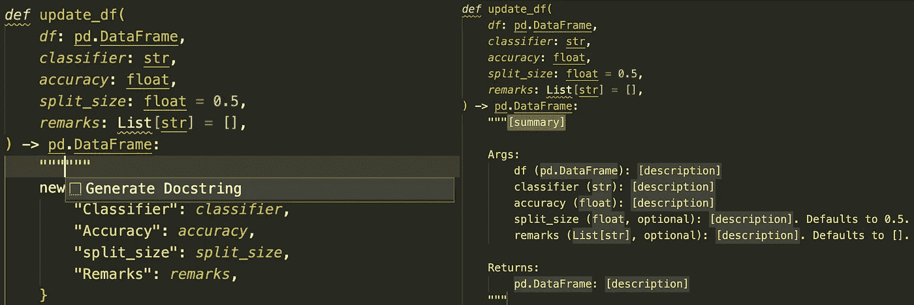
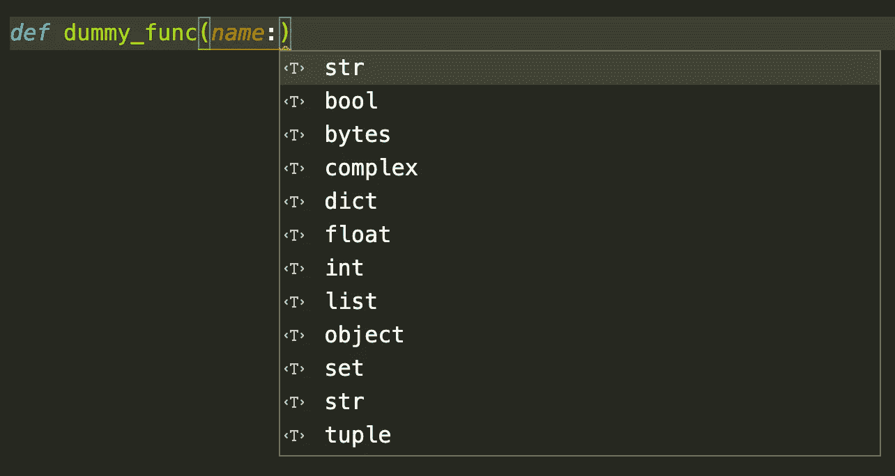

# 数据科学家的 Python 高效编码指南

> 原文：<https://towardsdatascience.com/data-scientists-guide-to-efficient-coding-in-python-670c78a7bf79?source=collection_archive---------1----------------------->

## 更好的程序员

## 我每天用来编写干净代码的技巧和窍门

在这篇文章中，我想分享一些我在过去一年里学到的编写更简洁代码的技巧——主要来自结对编程。总的来说，将它们作为我日常编码程序的一部分，帮助我生成了高质量的 Python 脚本，随着时间的推移，这些脚本易于维护和扩展。

> 想过为什么高级开发人员的代码比初级开发人员的代码看起来好得多吗？继续读下去，弥合差距…

我将给出真实的编码场景，而不是给出如何使用这些技术的一般例子，在这些场景中，我已经*实际上*使用了它们！这是 Jupyter Colab 笔记本如果你想跟着去的话！

## 1.使用`for` 回路时使用`tqdm`。

想象一下在一个*大的* iterable(列表、字典、元组、集合)上循环，并且不知道代码是否已经运行完毕！*倒霉蛋*，*右*！在这种情况下，确保使用`tqdm`结构在旁边显示一个进度条。

例如，当我通读 44 个不同目录中的所有文件时，为了显示进度(这些文件的路径已经存储在一个名为`fpaths`的列表中):

```
from tqdm import tqdmfiles = list()
fpaths = ["dir1/subdir1", "dir2/subdir3", ......]for fpath in tqdm(fpaths, desc="Looping over fpaths")):
         files.extend(os.listdir(fpath))
```


将 tqdm 与“for”循环一起使用

*注意:使用* `*desc*` *参数为循环指定一个小的描述。*

## 2.使用`type hinting when writing functions.`

简单地说，这意味着在 Python 函数定义中明确声明所有参数的类型。

当我在工作中使用类型提示时，我希望我能提供一些具体的用例来强调这一点，但事实是，我经常使用它们。

这里有一个函数`update_df()`的假设例子。它通过追加包含来自模拟运行的有用信息的行来更新给定的数据框，例如所使用的分类器、准确度得分、训练测试分割大小以及该特定运行的附加备注。

```
def update_df(**df: pd.DataFrame**, 
              **clf: str**, 
              **acc: float**,
              **split:float** = 0.5,
              **remarks: List[str] = []**
              ) -> **pd.DataFrame**: new_row = {'Classifier':clf, 
               'Accuracy':acc, 
               'split_size':split,
               'Remarks':remarks} df = df.append(new_row, ignore_index=True)
    return df
```


需要注意的几件事:

*   函数定义(`def update_df(.......) **->** pd.DataFrame`)中`->`符号后面的数据类型表示函数返回值的类型，即本例中的熊猫数据帧。
*   默认值(如果有的话)可以像往常一样以`param:type = value`的形式指定。(例如:`split: float = 0.5`)
*   如果一个函数不返回任何东西，请随意使用`None`。例如:`def func(a: str, b: int) -> None: print(a,b)`
*   例如，要返回混合类型的值，假设一个函数可以在设置了标志`option`的情况下打印一条语句，或者在没有设置标志的情况下返回一条`int`:

```
**from typing import Union**
*def* dummy_args(**args*: list[int], *option* = True) -> **Union[None, int]**: if *option*: print(*args*) else: return 10
```

*注意:从 Python 3.10 开始，* `*Union*` *就不需要了，可以简单的做:*

```
*def* dummy_args(**args*: list[int], *option* = True) -> **None | int**: if *option*: print(*args*) else: return 10
```

*   在定义参数类型时，您可以想怎么具体就怎么具体，就像我们对`remarks: List[str]`所做的那样。我们不仅指定它应该是一个`List`，而且它应该只是一个`str`的列表。
    为了好玩，试着在调用函数时向`remarks`传递一个整数列表。您将不会看到任何错误返回！为什么会这样？因为 Python 解释器不会基于你的类型提示强制执行任何类型检查。

> 除了添加文档之外，类型提示对你的代码没有任何影响。

但是，包含它仍然是一个很好的实践！我觉得写函数的时候更清晰。此外，当有人调用这样一个函数时，他们会看到一个漂亮的提示，要求输入参数。


调用带有类型提示的函数时提示

## 3.对于参数数量未知的函数使用 args 和 kwargs`.`

想象一下:您想要编写一个函数，将一些目录路径作为输入，并打印每个目录路径中的文件数量。问题是，我们不知道用户会输入多少路径！可能是 2 也可能是 20！所以我们不确定在函数定义中应该定义多少个参数。显然，编写像`def count_files(file1, file2, file3, …..file20)`这样的函数是愚蠢的。在这种情况下，`args`和(有时是`kwargs`)就派上用场了！

> **Args** 用于指定未知数量的**位置**参数。
> **Kwargs** 用于指定未知数量的**关键字**参数。

## 一个参数名

下面是一个函数`count_files_in_dir()`的例子，它接受`project_root_dir`和任意数量的文件夹路径(在函数定义中使用`*fpaths`)。作为输出，它打印每个文件夹中的文件数量。

```
def count_files_in_dir(project_root_dir, *fpaths: str): for path in fpaths: rel_path = os.path.join(project_root_dir, path)
            print(path, ":", len(os.listdir(rel_path)))
```


统计 Google Colab 目录中的文件数量

在函数调用中，我们传入 5 个参数。由于函数定义期望一个*必需的*位置参数，即`project_root_dir`，它自动知道`"../usr"`必须是它。所有剩余的参数(本例中为 4 个)被`*fpaths`吸收，并用于计算文件数。

*注意:这种吸收技术的正确术语是“参数打包”，即剩余的参数被打包到* `**fpaths*` *。*

## 夸尔斯

让我们看看必须接受未知数量的*关键字*参数的函数。在这种情况下，我们必须使用`kwargs`而不是`args`。这里有一个简短(无用)的例子:

```
def print_results(**results): for key, val in results.items():
        print(key, val)
```


用法与`*args`非常相似，但是现在我们能够向函数传递任意数量的*关键字*参数。这些参数作为键值对存储在`**results`字典中。从现在开始，使用`.items()`很容易访问该字典中的条目。

我在工作中发现了`kwargs`的两个主要应用:

*   合并字典(*有用但没那么有趣*)

```
dict1 = {'a':2 , 'b': 20}
dict2 = {'c':15 , 'd': 40}merged_dict = {**dict1, **dict2}*************************
{'a': 2, 'b': 20, 'c': 15, 'd': 40}
```

*   扩展一个现有的方法(*更有趣*)

```
def myfunc(a, b, flag, **kwargs): if flag:
           a, b = do_some_computation(a,b)

       actual_function(a,b, **kwargs)
```

*注:check out*[*matplotlib 的 plot 函数使用*](https://matplotlib.org/stable/api/_as_gen/matplotlib.pyplot.plot.html#matplotlib-pyplot-plot) `[*kwargs*](https://matplotlib.org/stable/api/_as_gen/matplotlib.pyplot.plot.html#matplotlib-pyplot-plot)` *为一个图指定可选的修饰，如线宽和标签。*

下面是我最近的一个项目中使用`**kwargs`扩展方法的一个实际用例:
我们经常使用 Sklearn 的`train_test_split()`来拆分`X`和`y`。在 GANs 项目中的一个项目中，我必须将生成的合成图像分割成*相同的*训练测试分割，用于分割真实图像及其各自的标签。此外，我还希望能够传递通常会传递给`train_test_split()`的任何其他参数。最后，`stratify`必须总是被通过，因为我正在处理一个人脸识别问题(并且希望所有的标签都出现在训练集和测试集中)。

为了实现这一点，我们创建了一个名为`custom_train_test_split()`的函数。我已经包括了一堆打印语句来显示到底发生了什么(为了简洁省略了一些片段)。

```
def custom_train_test_split(clf, y, *X, stratify, **split_args): *print("Classifier used: ", classifier)
    print("Keys:", split_args.keys())
    print("Values: ", split_args.values())
    print(X)
    print(y)
    print("Length of passed keyword arguments: ", len(split_args))* trainx,testx,*synthetic,trainy,testy = train_test_split(
                                               *X,
                                               y,
                                               stratify=stratify,
                                               **split_args
                                               ) *######### OMITTED CODE SNIPPET #############
    # Train classifier on train and synthetic ims
    # Calculate accuracy on testx, testy
    ############################################* *print("trainx: ", trainx, "trainy: ",trainy, '\n',  "testx: ", 
    testx, "testy:", testy)* *print("synthetic: ", *synthetic)*
```

*注意:在调用这个函数时，为了便于理解，我没有使用实际的图像向量和标签(见下图)，而是用虚拟数据来代替。然而，该代码也应该适用于真实图像！*


图 A 在函数定义中使用 kwargs 调用函数

一些需要注意的事情:

*   函数调用语句中使用的所有*关键字*参数(除 `stratify`外的**)(如`train_size`和`random_state`)将作为键值对存储在`**split_args`字典中。(要进行验证，请检查蓝色的输出。)
    你可能会问，为什么不是`stratify`？这是因为根据函数定义，它是一个*必需的*关键字专用的参数，而不是一个*可选的*参数。**
*   函数调用中传递的所有*非关键字*(即位置)参数(如`"SVM"`、`labels`等)。)将存储在函数定义中的前三个参数中，即`clf`、`y`和`*X`(是的，它们的传递顺序很重要)。然而，我们在函数调用中有四个参数，即`"SVM"`、`labels`、`ims`和`synthetic_ims`。我们将第四个存储在哪里？
    记住我们在函数定义中使用`*X`作为第三个参数，因此传递给函数的前两个参数之后的所有参数都被*打包*(浸泡)到`*X`。(要进行验证，请检查绿色输出)。
*   当在我们的函数中调用`train_test_split()`方法时，我们实际上是*使用`*`操作符(`*X`和`**split_args`)将`X`和`split_args`参数解包*，这样它的所有元素都可以作为不同的参数传递。

也就是说，

```
train_test_split(*X, y, stratify = stratify, **split_args)
```

相当于写作

```
train_test_split(ims, synthetic_ims, y, stratify = stratify, train_size = 0.6, random_state = 50)
```

*   当存储来自`train_test_split()`方法的结果时，我们再次*将`synthetic_train`和`synthetic_test`集合打包到单个`*synthetic`变量中。*


为了检查里面有什么，我们可以使用`*`操作符再次打开它(查看粉红色的输出)。

*注意:如果你想深入研究使用* `***` *操作符进行打包&的话，一定要看看这篇* [*文章*](https://realpython.com/python-kwargs-and-args/) *。*

## 4.使用预提交挂钩`.`

我们写的代码通常是混乱的，并且缺乏适当的格式，例如尾随空格、尾随逗号、未排序的导入语句、缩进中的空格等。

虽然手动修复所有这些是可能的，但是使用[预提交钩子](https://pre-commit.com/)，您将会节省自己大量的时间。更简单地说，这些钩子可以通过一行命令— `pre-commit run`为您执行自动格式化。

下面是一些来自官方文档的[简单步骤](https://pre-commit.com/#install)来开始使用，[创建一个](https://pre-commit.com/index.html#2-add-a-pre-commit-configuration) `[.pre-commit-config.yaml](https://pre-commit.com/index.html#2-add-a-pre-commit-configuration)` [文件](https://pre-commit.com/index.html#2-add-a-pre-commit-configuration)。它将包含[钩子](https://pre-commit.com/hooks.html)来处理你所关心的所有格式问题！

作为一个纯粹的个人偏好，我倾向于保持我的`.pre-commit-config.yaml`配置文件简单，坚持使用 [Black 的](https://black.readthedocs.io/en/stable/integrations/source_version_control.html)预提交配置。

*注意:需要记住的一点是，在您执行* `*pre-commit run*` *之前，文件必须被暂存，即* `*git add .*` *，否则，您会看到所有文件都将被跳过:*


## 5.使用。存储常数的 yml 配置文件`.`

如果您的项目包含许多配置变量，如数据库主机名、密码、AWS 凭证等。使用一个`.yml`文件来跟踪所有这些。您以后可以在任何 Jupyter 笔记本或脚本中使用该文件。

鉴于我的大部分工作旨在为客户提供一个模型框架，以便他们可以在自己的数据集上再次训练它，我通常使用配置文件来存储文件夹和文件的路径。这也是一个很好的方法，可以确保客户端在运行您的脚本时只对一个文件进行更改。

让我们继续在项目目录中创建一个`fpaths.yml`文件。我们将存储图像必须存储的根目录。此外，文件名、标签、属性等的路径。最后，我们还存储合成图像的路径。

```
image_data_dir: path/to/img/dir*# the following paths are relative to images_data_dir*fnames: fnames_fname: fnames.txt fnames_label: labels.txt fnames_attr: attr.txtsynthetic: edit_method: interface_edits expression: smile.pkl pose: pose.pkl
```

您可以像这样阅读该文件:

```
# open the yml filewith open(CONFIG_FPATH) as f:
     dictionary = yaml.safe_load(f)# print elements in dictionaryfor key, value in dictionary.items():
     print(key + " : " + str(value))
     print()
```

*注:如果你想深入了解，这里有一个精彩的* [*教程*](https://www.cloudbees.com/blog/yaml-tutorial-everything-you-need-get-started) *让你开始使用 yaml。*

## 6.额外收获:有用的 VS 代码扩展`.`

虽然对于 Python 编辑器来说确实有很多不错的选择，但我必须说 VSCode 无疑是我迄今为止看到的最好的(*抱歉，Pycharm* )。为了更好地利用它，可以考虑从市场上安装这些扩展:

*   [括号对上色器](https://marketplace.visualstudio.com/items?itemName=CoenraadS.bracket-pair-colorizer) —允许用颜色识别匹配的括号。


*   [路径智能感知](https://marketplace.visualstudio.com/items?itemName=christian-kohler.path-intellisense) —允许自动完成文件名。


*   [Python Dockstring generator](https://marketplace.visualstudio.com/items?itemName=njpwerner.autodocstring)—允许为 Python 函数生成文档字符串。



使用 VScode 扩展生成文档字符串

*Pro-tip:生成 docstring(使用* `*"""*` *)* ***在*** *之后你已经使用类型提示编写了函数。这样，生成的 docstring 将包含更丰富的信息，如默认值、参数类型等。(见右上图)。*

*   [Python 缩进](https://marketplace.visualstudio.com/items?itemName=KevinRose.vsc-python-indent)——(*我的最爱；由*发布由[凯文·罗斯](https://marketplace.visualstudio.com/publishers/KevinRose)发布)允许对多行运行的代码/括号进行适当的缩进。


来源: [VSCode 扩展市场](https://marketplace.visualstudio.com/items?itemName=KevinRose.vsc-python-indent)

*   [Python 类型提示](https://marketplace.visualstudio.com/items?itemName=njqdev.vscode-python-typehint) —允许在编写函数时自动完成类型提示。



*   [待办事项树](https://marketplace.visualstudio.com/items?itemName=Gruntfuggly.todo-tree) : ( *第二喜欢的*)在一个地方记录所有在编写脚本时插入的`TODO`。


跟踪插入到项目中的所有 TODO 注释

*   [Pylance](https://marketplace.visualstudio.com/items?itemName=ms-python.vscode-pylance) —允许代码完成、参数建议(以及更快地编写代码)。

恭喜你离专业 Python 开发人员又近了一步。当我学到更多酷的技巧时，我打算继续更新这篇文章。一如既往，如果有更简单的方法来做我在本文中提到的一些事情，请让我知道。

直到下次:)

*我喜欢写循序渐进的初学者指南、操作指南、面试问题、解码 ML/AI 中使用的术语等。如果你想完全访问我的所有文章(以及其他媒体上的文章)，那么你可以使用* [***我的链接***](https://varshitasher.medium.com/membership)**这里* ***注册。****

*[](/understanding-python-imports-init-py-and-pythonpath-once-and-for-all-4c5249ab6355) [## 了解 Python 导入，__init__。py 和 pythonpath —一劳永逸

### 了解如何导入包和模块(以及两者之间的区别)

towardsdatascience.com](/understanding-python-imports-init-py-and-pythonpath-once-and-for-all-4c5249ab6355) [](/end-to-end-deep-learning-project-part-1-930af1e1e191) [## 端到端深度学习项目:第 1 部分

### 用 Keras 实现迁移学习的高效网络图像分类模型

towardsdatascience.com](/end-to-end-deep-learning-project-part-1-930af1e1e191) [](/interviewers-favorite-question-how-would-you-scale-your-ml-model-56e4fa40071b) [## 面试官最喜欢的问题-你会如何“扩展你的 ML 模型？”

### 您正在构建一个生产就绪的 ML 模型吗？

towardsdatascience.com](/interviewers-favorite-question-how-would-you-scale-your-ml-model-56e4fa40071b) [](/time-series-analysis-using-pandas-in-python-f726d87a97d8) [## 使用 Python 中的 Pandas 进行时间序列分析

### 对季节性、趋势、自相关等关键词的额外介绍。

towardsdatascience.com](/time-series-analysis-using-pandas-in-python-f726d87a97d8) [](https://podurama.com/) [## Podurama:播客播放器

### iOS、Android、Web、Windows 和 MacOS 的无限设备之间的免费同步。阿米莉亚·汤普森这是……

podurama.com](https://podurama.com/) [](https://varshitasher.medium.com/membership) [## 阅读瓦希塔·谢尔博士的每一个故事(以及媒体上成千上万的其他作家)

### 作为一个媒体会员，你的会员费的一部分会给你阅读的作家，你可以完全接触到每一个故事…

varshitasher.medium.com](https://varshitasher.medium.com/membership)*