# 数据科学可视化中的数据平滑

> 原文：<https://towardsdatascience.com/data-smoothing-for-data-science-visualization-the-goldilocks-trio-part-1-867765050615?source=collection_archive---------1----------------------->

## 进入 LOWESS 和 B-spline 的温和之旅，并说明原因

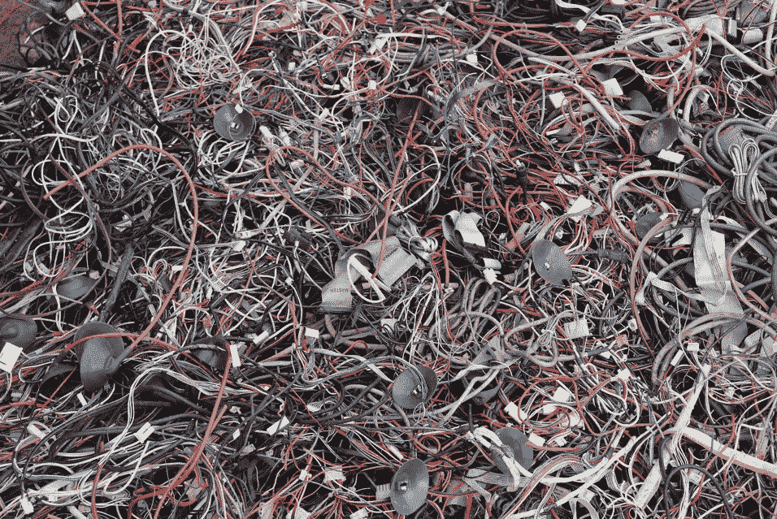

股票图片来自[https://pix abay . com/photos/wires-computer-wire-power-wire-3702104/](https://pixabay.com/photos/wires-computer-wire-power-wire-3702104/)

## **第一部——分段讲和**

我们都听说过[信息很美](https://informationisbeautiful.net)。但是生活发生了，我们发现自己试图美化现实中的混乱。这在数据争论中是正常的，但在可视化中也是如此，这取决于可视化所扮演的角色。这只是预测模型的探索性工作吗？还是一种事后呈现结果的方式？或者有时更多，例如，取决于我们对数据的期望。

如果我们考虑像维生素 D 血清水平在几个月和几年内波动这样的事情(见下文)，我们有充分的理由在这个世界上——字面上是*世界*——期待它以一种可预测的方式波动，因为地球可以预测地围绕太阳旋转，而且地球大气也有更长期的趋势。我们可以预期，这是通过带有正弦函数项的最小二乘线性回归，或者通过其他一些单一的整体方程来实现的。那么我们的可视化本质上是包含在我们的线性回归模型的保护伞下。在这种情况下，我们的预测模型*是*，或者*变成了*，我们的平滑器。虽然更吵闹，但同样可以说是经济波动，它聚集了无数个人的活动，从而洗去了他们个人的意图。

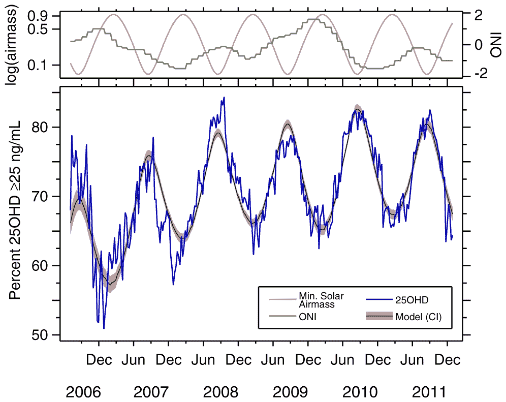

维生素 D 血清水平，来自 [Kasahara、Singh 和 Noymer (2013)](https://doi.org/10.1371/journal.pone.0065785) ，经许可使用

然而，有时这些都不是事实，相反，我们试图想象一个单独的代理人按照自己的自由意志行动，或者一个类似的团体与这样的代理人一起行动。因此，正如他们所说，数据是*非参数的*，我们不一定期望通过一组系数来预测它是合理的。尽管如此，我们仍然希望或需要在我们的视觉化中平滑它，以便更好地解释它。这是我多次遇到的情况。令我惊讶的是，我的谷歌搜索从来没有出现过对一般问题的讨论，相反，我不得不分别搜索诸如*洛斯*平滑，或*贝塞尔*曲线等主题，直到我意识到它们是相关的，但不知道它们如何相互关联。经过一番努力，我现在知道了答案，所以我在这里分享它，这样它可能会帮助其他人:在我看来，数据平滑中需要解决的更普遍的问题。

公共领域[https://snappygoat.com/](https://snappygoat.com/)

考虑一只鸟的飞行，也许是受本能的制约，但仍然按照自己的自由意志移动，或者甚至一群鸟跟随任何时候在前面的鸟。没有理由期望用一组系数来模拟轨迹是合适的，因为鸟(或鸟群)可能会在飞行中途改变其意图。

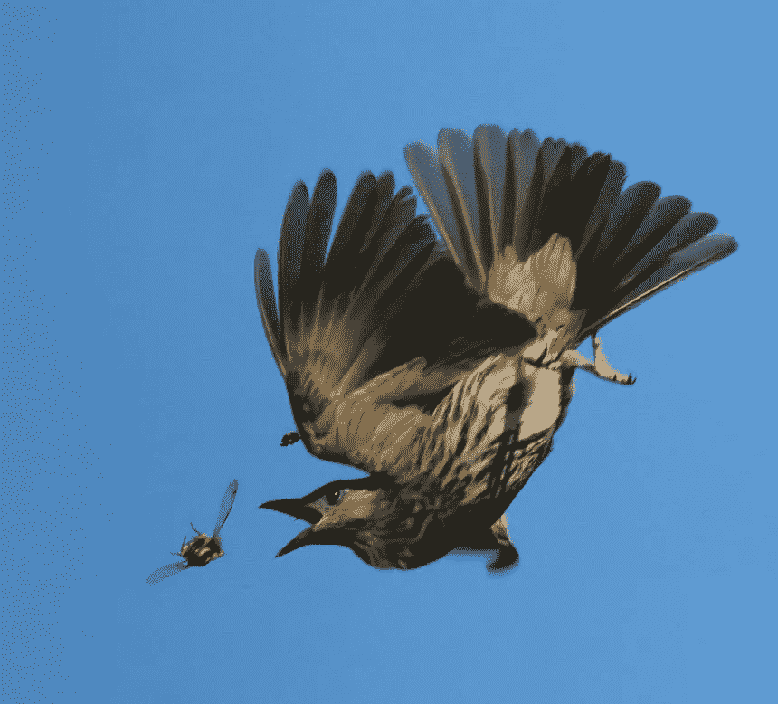

知识共享许可，来源[https://en . Wikipedia . org/wiki/Hawking _(birds)](https://en.wikipedia.org/wiki/Hawking_(birds))

下面是一些对应于这种情况的 python 代码。重要的是，它使用了一个叫做*分段*的漂亮的 NumPy 函数。这很方便，因为 piecewis *e* 的广义概念似乎是数据平滑偏离线性回归等参数数据分析方法的决定性标准。而且，就时间序列数据而言，*分段*的想法在某种程度上代表了——或者至少与——整个变化原理在某个点被打乱的情况，因为代理人已经改变了主意，或者出于某些其他原因，所以之前的*与*之后的*必须被不同地建模，而不是使用相同的一组系数。*

第一部分包含两个函数:鸟儿改变飞行计划前的轨迹的*曲线 1* ，以及之后的*曲线 2* 。

如果分别绘制，两条曲线将如下所示:

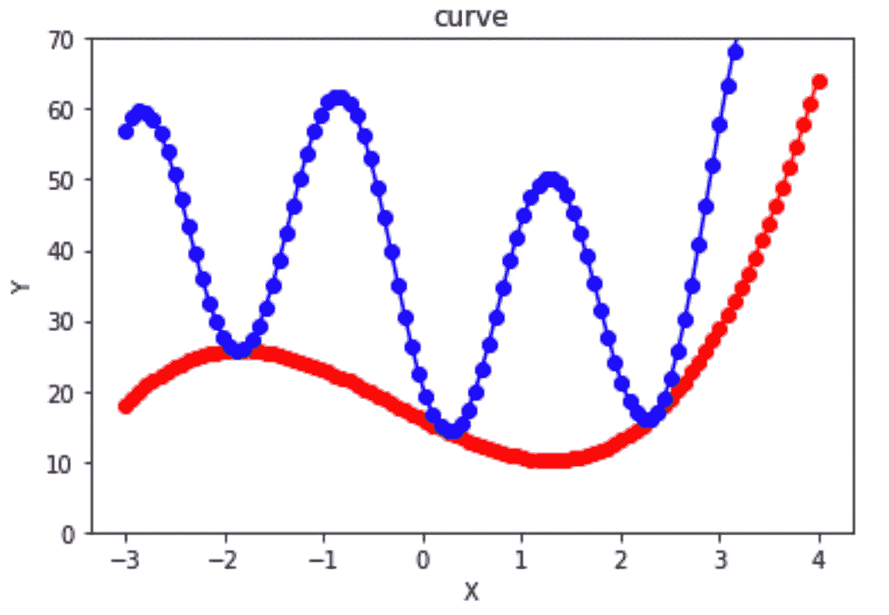

作者创建的图像

我构建的特定分段函数有两个部分:第一部分基于三次多项式(红色)，后一部分基于同一个三次多项式和正弦函数(蓝色)，生成我们假设的鸟的飞行。也许这只鸟正在盘旋，以捕捉花朵或树枝上的一些猎物(在零时间捕捉)，之后它上下猛扑，然后飞走。我们将把这个时间序列作为我们假定的基本事实。

请特别注意这一行:

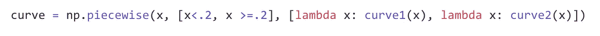

它允许一系列 lambda 运算符作用于数据范围的不同部分，对低于 0.2 的范围实现函数 *curve1* ，对高于 0.2 的范围实现函数 *curve2* 。

作者创建的图像

如果这些数据点是从高帧速率的视频中提取的，那么信息就已经很漂亮了，你不需要做任何数据平滑。您可以将其绘制成简单的散点图，或者这些散点图点的线性插值(线性样条)，如下面的代码和附图所示。

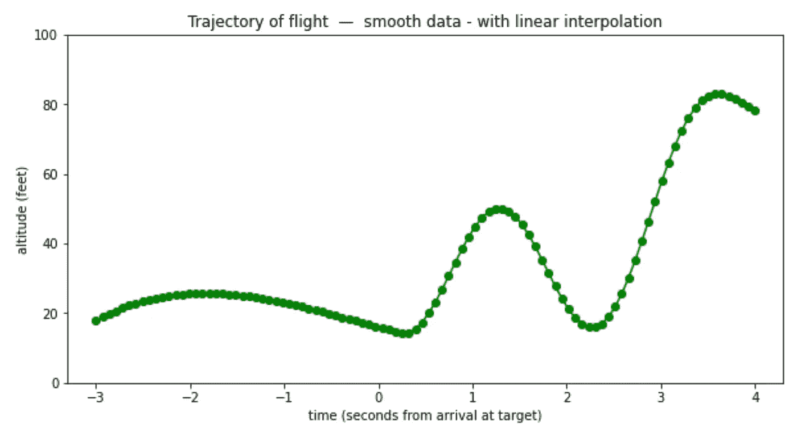

作者创建的图像

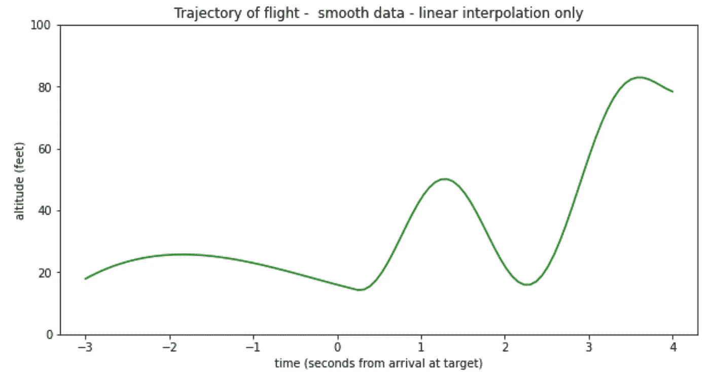

作者创建的图像

哎呀——这根本不是我承诺要讨论的混乱局面。相反，这些数据开始时就像雪佛兰科尔维特的轮廓一样漂亮，没有必要大惊小怪。然而，我们已经为鸟类飞行路径的这个特定实例建立了地面事实，当我在下一节中讨论混乱时，我会回头参考它。它考虑了一群嘈杂的数据和稀疏的样本数据，即*金发三重奏*(接下来是深入 *lowess* 和 *B 样条*平滑的部分)。

## 第 2 部分-平稳和不平稳的味道:金发三重奏

照片由 [Pixabay](https://www.pexels.com/@pixabay?utm_content=attributionCopyText&utm_medium=referral&utm_source=pexels) 从[像素](https://www.pexels.com/photo/nature-animal-park-birds-33101/?utm_content=attributionCopyText&utm_medium=referral&utm_source=pexels)拍摄

在上一节中，我阐述了一般的数据平滑问题，它有时不同于预测建模、预测建模的准备或预测建模的演示。有时这两者都不是，我们仍然希望平滑。一只鸟的飞行路线就是这种情况的例子，它可以在飞行中改变它的意图。意向改变前的*与意向改变*后的*由一个 NumPy *分段*函数建模，该函数使用一个 lambda 算子列出两个要应用的曲线函数:一个用于较低范围(意向改变前)，另一个用于较高范围(意向改变后)。分段的思想是通过普通(整体)回归平滑和其他平滑(或建模)方法(非参数)之间的区别的核心，这些方法没有在整体意义上预测的意图。*

为了提醒您，这里有一个通过*分段*函数生成的基本事实的图表(上面显示了它的 python 代码)。

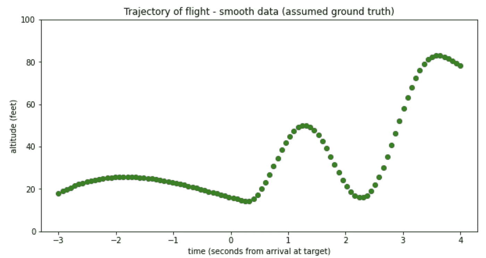

作者创建的图像

正如我在上面提到的，如果这些数据点是从高帧率视频中的帧中提取的，那么信息就已经很漂亮了，你不需要做任何数据平滑。

但是，如果不是一只鸟，而是一群鸟呢？假设，作为我们的地面真相，与上面相同的轨迹(而不是照片中有趣的漩涡)，下面是一些 python 代码来综合这一点，并将其绘制为散点图。

[Airwolfhound](https://www.flickr.com/people/24874528@N04)[(CC BY-SA 2.0)](https://creativecommons.org/licenses/by-sa/2.0/deed.en)

为了模拟这种群集的情况，我们使用与前面相同的基本原理，用上面相同的 python 代码来设置这种情况。

下一个代码块使用 NumPy 的随机数生成器生成噪声，它修饰了我们已经有的分段曲线。

这是它的图表，正如上一节所示:

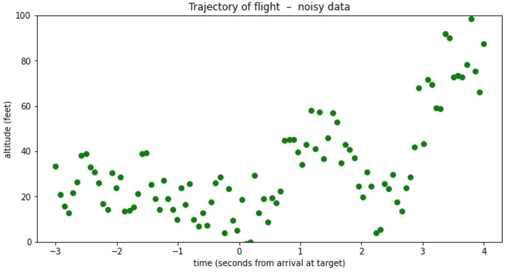

作者创建的图像

现在数据是有噪音的。为了美化它，我们必须把它弄光滑。更多信息请见下文。

另一种情况是，相对于地面真实数据的曲率，我们对数据的采样过于稀疏，例如较低帧速率的视频或定格摄影。这就是你在下面的照片中看到的，这是一只鸟在飞行中不同时间的帧的合成。

单只鹈鹕飞行的单个帧(动作序列)的合成([唐·麦卡洛](https://commons.wikimedia.org/wiki/File:Sequence.jpg)CC[执照](https://creativecommons.org/licenses/by/2.0/deed.en)

在 python 代码中，这很容易模拟。我们可以通过 NumPy 数组索引的步进增量来实现，如下面的代码所示:

…后面是生成图形的常用代码:

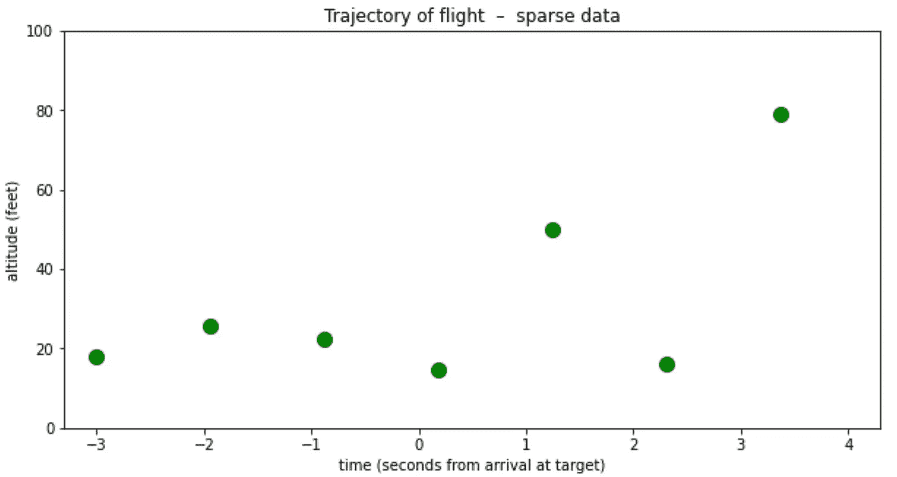

作者创建的图像

请注意，这个散点图的印象并不平滑。我们不能真正在视觉上“连接这些点”,因为这仅仅提供了对地面真相的粗略追踪。同样，我们需要平滑它。

***金发女孩*三人组:太*吵*，太*稀疏*采样，或者‘刚刚好’**

现在让我们把所有这些放在一起看。当谈到视觉化时，有三种关于平滑度的情况。要么是平滑，要么是噪音太大，要么是采样太稀疏。如果是后两者中的任何一个，我们必须应用适当的平滑器来使它“恰到好处”。换句话说，在某种程度上，我们的地面真理是平滑的，基本上有两种方式它无法在我们呈现的数据中体现出来。

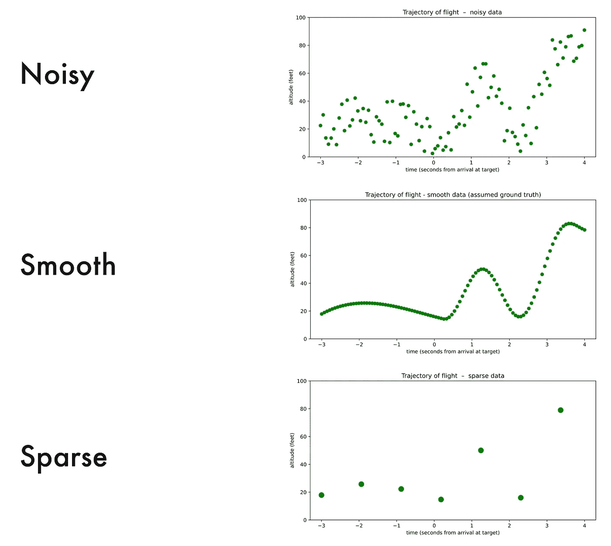

金发三重奏，关于平滑:太吵，太稀疏采样，刚刚好(图片由作者提供)

为了平滑这些数据，我们必须首先猜测和评估这种不平滑是通过哪两种方式发生的，然后部署适当的方法，通过消除我们现有数据的不平滑来进行平滑，也就是说，通过恢复、重建或重新增强丢失的平滑。我们将在下一节(第 3 部分)开始讨论这个问题，这一节将考虑平滑噪声数据的方法。

照片由[Eli Solidum](https://commons.wikimedia.org/wiki/User:Elisolidum)[(CC BY-SA 4.0)](https://creativecommons.org/licenses/by-sa/4.0/deed.en)

**重构代码:**在开始平滑噪声数据的方法(如下)之前，我在这里展示一个 python 代码的重构，这样我们就不必在每次绘图时都重新编写所有的 *matplotlib* 设置。相反，我给出了一个名为 *graph* 的函数，其描述在文档字符串中提供。正如你将看到的，这种重构也有助于聚焦我们将尝试的所有平滑方法之间的精确区别，包括那些成功的方法。

使用此功能，前三个图形(如上所示):

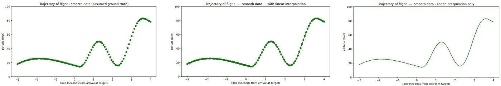

作者创建的图像

简单编码如下:

接下来的三个图表(上面显示的是最近的情况)

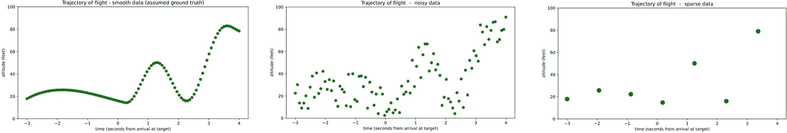

作者创建的图像

编码如下:

## 第 3 部分-噪音将是噪音

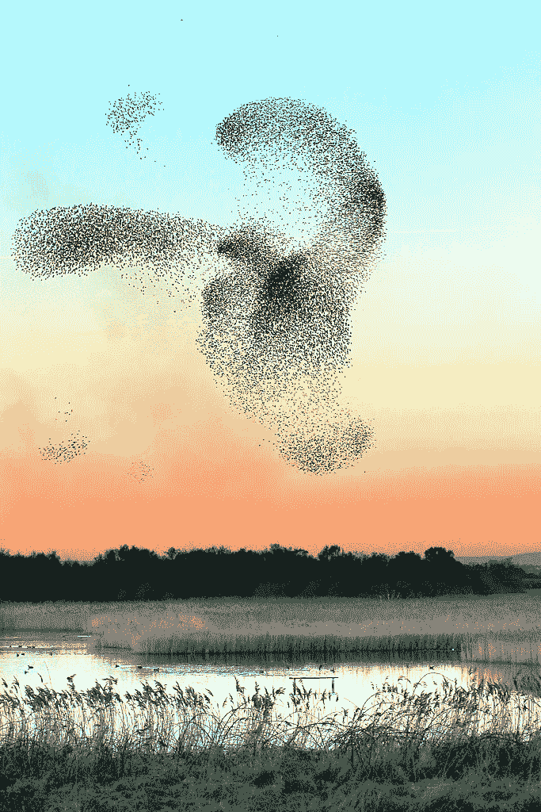

托尼·阿姆斯特朗-斯莱[https://www.flickr.com/photos/tonyarmstrong/46262738422](https://www.flickr.com/photos/tonyarmstrong/46262738422)，[知识共享许可](https://creativecommons.org/licenses/by-nd/2.0/)

在上面的第一部分中，我们考虑了通过平滑来美化杂乱数据的整体问题。这可以用一个时间序列来解释，这个时间序列代表一只假设的鸟的飞行轨迹，这只鸟的意图可能会改变，因此期望一组系数来模拟它的整个飞行是不合适的，然而我们仍然可能希望平滑数据来代表它，以便进行视觉检查。在第二部分中，显示了由于两个不同的原因，数据可能是不平滑的:(1)不是一只鸟，而是实际上一群鸟，因此一些随机波动区分了鸟群中许多鸟的飞行路径；或者(2)对一只鸟的飞行取样太少。连同平滑的地面真相，我称之为*金发三重奏*，因为我们的视觉渴望平滑的‘恰到好处’状态(而不是*嘈杂*或过于*稀疏*采样)。平滑需要识别这些情况中的哪一个在起作用。

## **绘制噪音图**

假设是鸟群的情况。所以数据噪音太大。让我们考虑一些处理这个问题的方法，一些尝试平滑数据的方法。

**线性插值**

如果您只是将噪声数据放入 *matplotlib* 线图函数(或按 Excel 中的线图按钮)，就会发生这种情况。我没有重复整个 matplotlib 设置，而是使用了我在前一节(第 2 部分)末尾介绍的有点通用的 *graph* 函数。这样，我们只需要两个相关的函数调用:

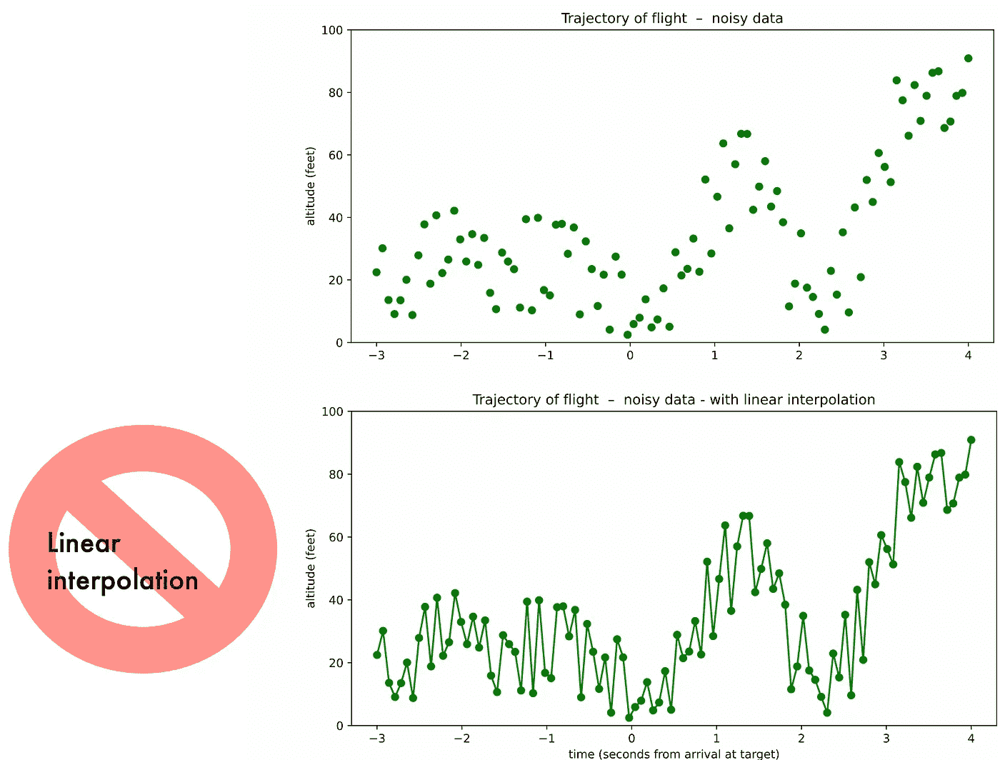

作者创建的图像

除非我们试图绘制一只精神分裂蚊子的轨迹，否则这个简单的线性插值图似乎完全不合适——远非平滑移动。然而，我们至少可以借此机会观察一下这里到底发生了什么，因为这在下面的后面部分会派上用场(我保证)。正如我们所见，每对连续点中有一条直线直接连接两点，这条直线带有斜率(*y*₂-*y*₁)/(*x*₂-*x*₁).当然，它连接了点，从一个数据点到下一个数据点的直线显然是平滑的。然而，这不是我们想要的那种光滑。

**线性回归**

如果你读到这里，你可能已经沉浸在数据科学中，足以知道你几乎不能打开它的大门而不被最小二乘线性回归击中，这是最方便和最通用的数据建模方法之一。在这种情况下，没有必要进行交叉验证和正则化的整个兔子洞，让我们看看当我们试图使用它平滑我们的数据时会发生什么，使用 NumPy 提供的简单线性回归(`polyfit`)，它提供了我们可以绘制的斜率(`m`)和 y 截距(`b`)。

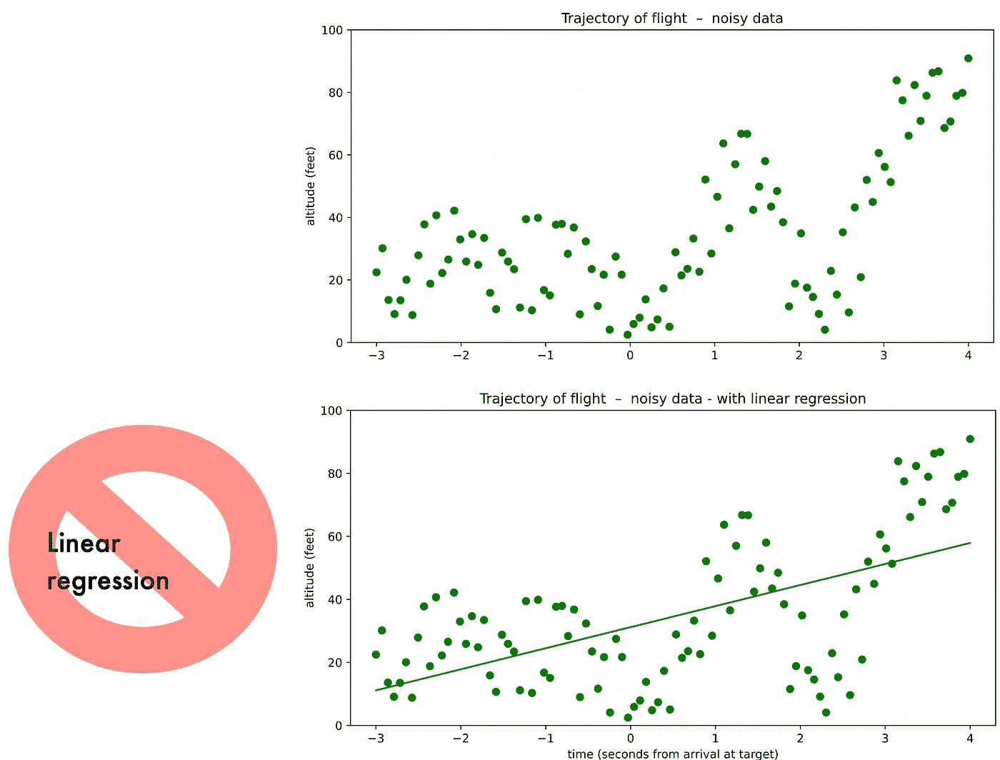

作者创建的图像

如果这种情况敲响了警钟，你可能在安斯科姆的四重奏中听到过(或看到过)类似的东西。尽管对于这些数据点来说确实存在一条最佳拟合的直线，但是这条线缺少平滑这些数据所需的特定曲率——这条线严重地*低于其*。在这种情况下，线性回归就像一头公牛径直穿过瓷器店。因此，如果你想为这一鸟群建模，简单的线性回归不是你要找的 *boids* 。

**三次(及更高次)多项式回归(多项式回归)**

但是等等，线性回归可以做曲线！加入一个二次或三次项。现在我们实际上有了一个关于鸥群轨迹的像样的描述。(如果您还记得生成地面真实数据的 NumPy 代码包含一个三次多项式，这就不足为奇了。)图表(下图)在开始时有一个浅的隆起，在后半部分逐渐平滑地向上弯曲。到目前为止一切顺利。然而，考虑一下这张图遗漏了多少我们的基本事实轨迹。在 *t* =1 之后的明显凸起，更不用说就在 *t* =4 之前的轻微向下倾斜。我们真的只能做到这样吗？还是我们没有给这群人应得的？

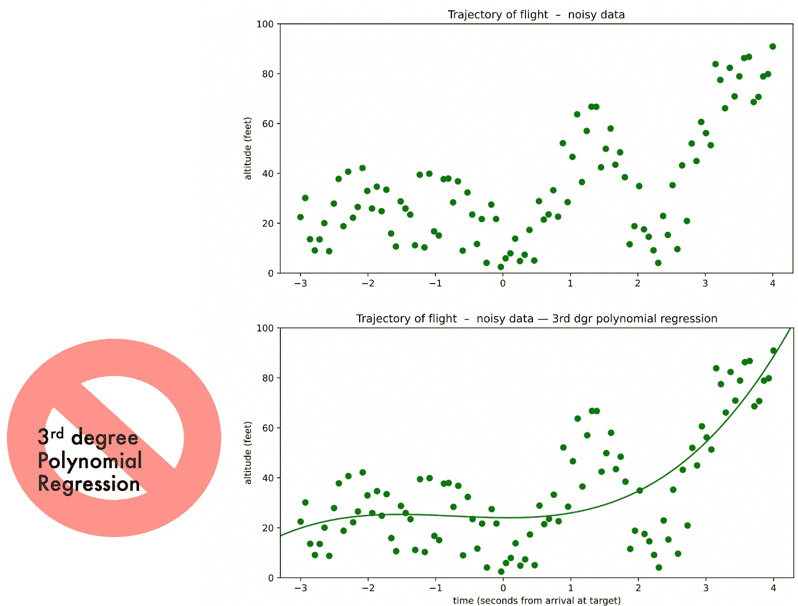

作者创建的图像

现在让我们试着用一个奢侈的 20 次多项式来深入到轨迹的所有角落。将其与地面真实散点图进行比较。并将其与三次多项式图进行比较。

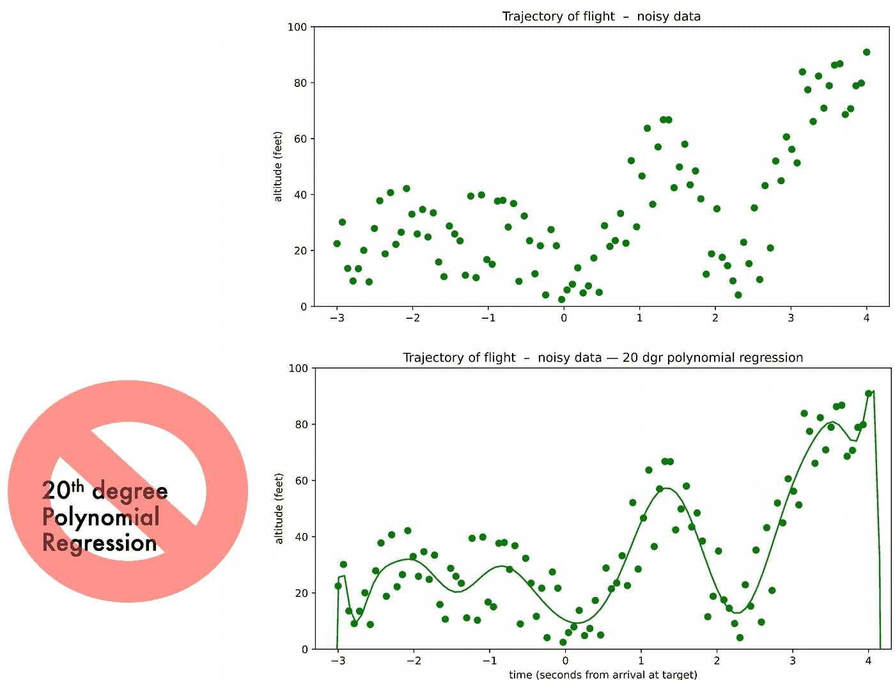

作者创建的图像

前半段的浅驼峰:检查，在那里。在 *t* =1 之后的明显凸起(我们的三次线性回归没有捕捉到)——是的，现在就在那里:检查。就在 *t* =4 之前的轻微向下倾斜？是的，它在那里。嗯，算是吧。请注意它是如何滑稽地俯冲直下地面，就好像整群鸟突然选择了神风敢死队集体自杀。不仅如此，开头(这里 *t* =-3)有一群鸟突然像一群直升机一样直直地向上飞。这是过度拟合的多项式回归的一个已知问题:拟合在数据的极端边缘必然会有很大的变化。边缘并非不真实，因为只是样本框架的任意性导致这些特定数据点位于边缘。尽管它捕捉了其轨迹曲率的一些独特的细微差别，但 20 次多项式回归并没有平滑数据，相反，如果考虑边缘，则描绘出它比它更不稳定(相对于假设的地面事实来考虑)。

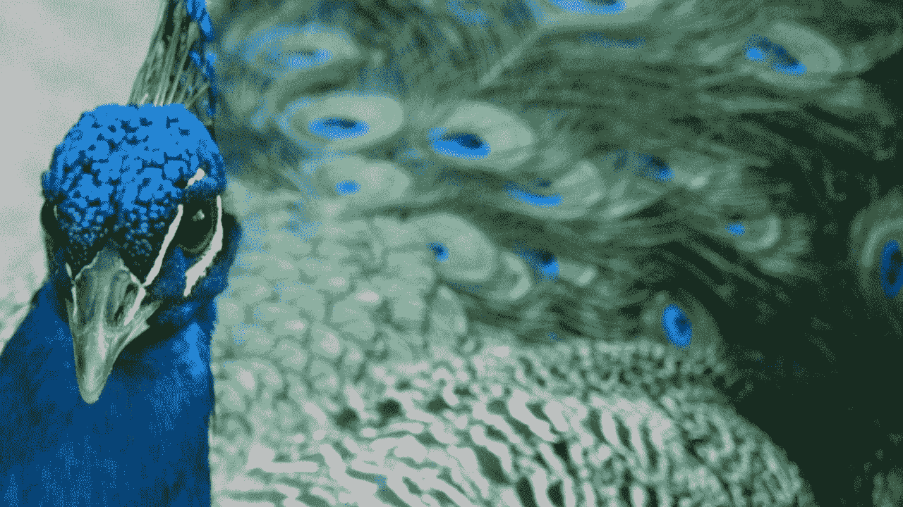

[Pixabay 许可——免费用于商业用途——无需署名](https://pixabay.com/photos/bird-tropical-beak-colorful-exotic-3433106/)

**关于数据平滑背景下回归的注释**

关于数据平滑与建模和预测的关系，还有一个更大的问题。每个回归(线性、立方和 20 次)都试图提供一个单一的方程(一组系数)来预测整个轨迹。这个数据是一个自由行动的代理人的行为的数字表示，或者在任何时候都有一个领头鸟在前面的团体。我们真的认为这种自由行动的主体(像鸟或鸟群)不能改变他们选择飞行路线的想法吗？(回归模型似乎暗示他们的命运是注定的。)更重要也更实际的是，对他们的数据进行平滑处理是否必然需要这种假设？

好像不是。相反，这个假设对于手头的任务来说是多余的。正如我将要展示的，数据可视化技术在这里为您提供了支持。有一些方法可以平滑鸟的数据，而不需要假设鸟是没有自由意志的机器人，也就是说，不需要一套系数来控制整个飞行。事实上，追踪一只鸟(或多只鸟)的行为超越了标准回归提供一套系数的效用。因此，尽管我们可以用多项式项对线性回归进行特征设计，以产生一些紧密拟合的平滑曲线，但这必然会使所有数据的超集过拟合，包括在飞行中做出不同决定的鸟(或鸟群)。因此，试图通过回归建模来进行平滑实际上是不明智的，或者主要是不真诚的，或者两者兼而有之。

**移动平均线**

因此，现在让我们把它调低一点，尝试一种技术上更温和的平滑方法，这可能是许多曾经关注过数字数据的人所熟悉的。*移动平均线*是另一个常用的方法。这里，我们有一个移动窗口，每次滑动一定数量的数据点(比如一次 5 个)，在每个连续位置计算算术平均值，并绘制成一个点。或者换句话说，你可以把它想象成水流过一个管道，这个管道在任何给定的时间都有一定量的水。如果你在任何给定时间重复测量管道中所有水的温度，那也将是从头到尾流经管道的所有水的温度的移动平均值。

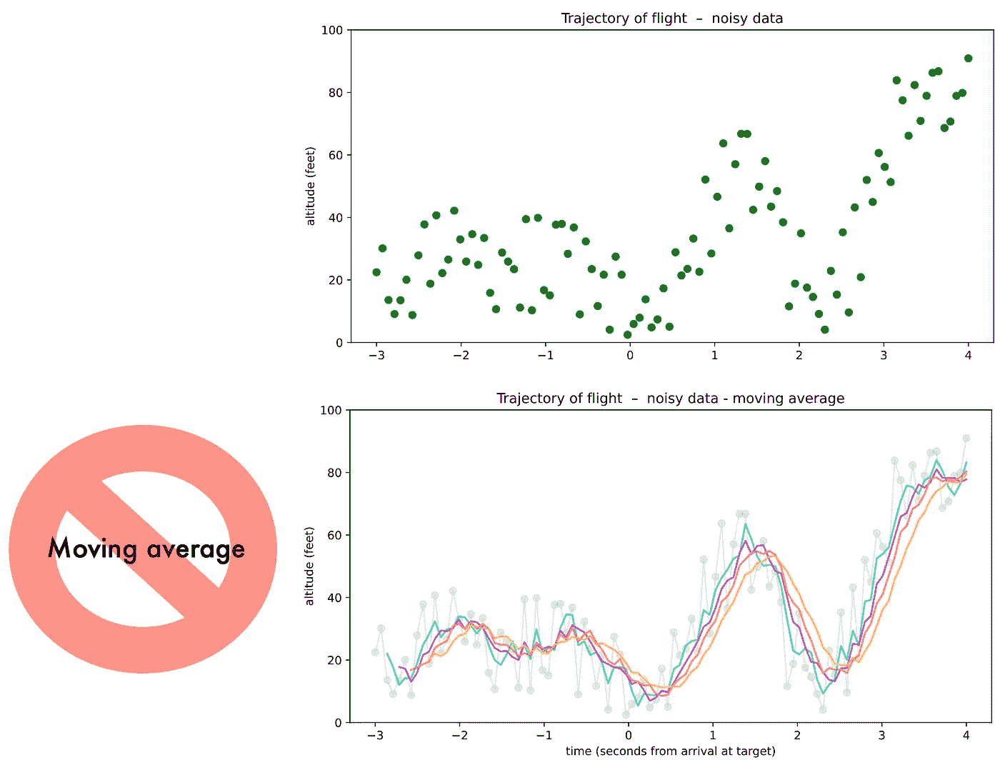

作者创建的图像

注意好处。曲线上没有变化很大的部分。也没有试图用一组系数来确定鸟的代理自由的迹象。相反，移动平均线是完全分段的。是啊！我们到了！(有吗？)或者我们已经兜了一圈——从良好的意义上来说——因为我们知道我们的基本事实(一只领先的鸟在飞行中改变它对飞行路径的想法以及模拟它的相应 NumPy 函数)确实是分段的，无论是在原则上还是在数据点如何计算的相应技术意义上。

请注意主要的缺点。它不是很光滑。它仍然是锯齿状的，尽管它的锯齿状没有简单的线性插值那么明显。但它并不光滑。它充满了锋利的边缘，就像一群愤怒的痉挛机器鸟。

在下一节中，我将讨论稀疏采样的数据，并在随后的章节中按照承诺使用 *lowess* 和 *B 样条平滑*。

## 第 4 部分-平滑的不同方向

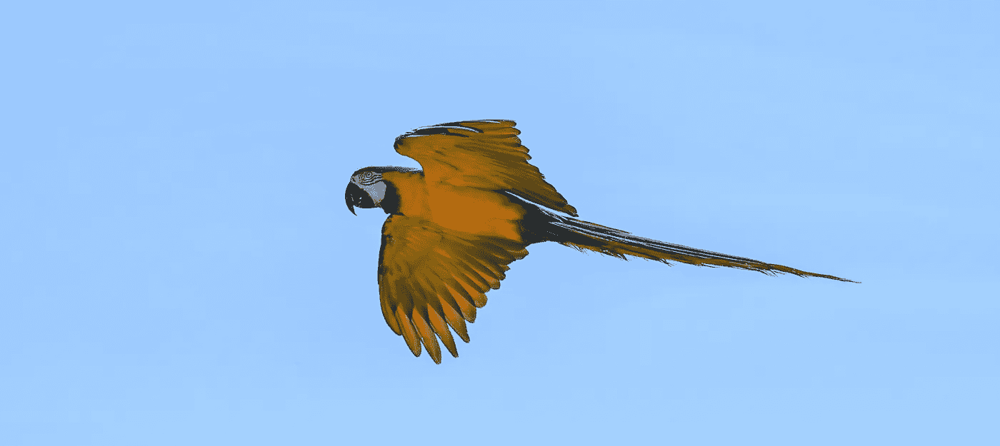

[https://pix abay . com/photos/parrot-blue-macaw-fly-bird-wing-2796743/](https://pixabay.com/photos/parrot-blue-macaw-fly-bird-wing-2796743/)pix abay 牌照

提醒一下，作为一个考虑可视化数据平滑方法的例子，我们选择了一只鸟的飞行，它的飞行意图可能会在飞行过程中发生变化，因此我们不能假设整个飞行路径可以用一组系数来预测(如果我们用线性回归建模，甚至用多项式“特征”来建模，我们就会这样假设)。下面是假设的鸟类飞行地面真相的散点图:

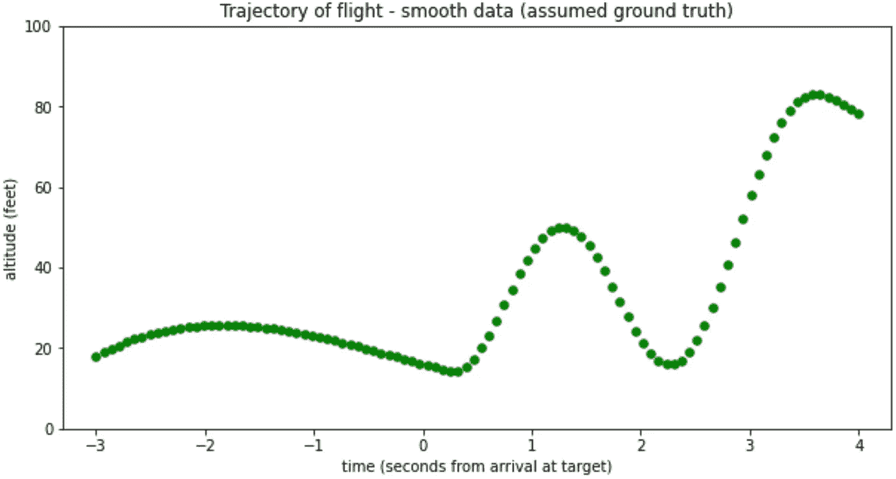

作者创建的图像

如上所述，这不需要平滑。然而，我们拥有的数据可能会有足够的噪声来保证平滑(例如，如果它是一群鸟)，或者采样过于稀疏，因此它也保证平滑(例如，如果它是从低帧率视频镜头中获得的数据)。

最后一节考虑了噪声数据情况下有缺陷的平滑方法。这个考虑了*数据过于稀疏采样*的情况。本节总结了平滑的总体策略，同时考虑到噪声*和*稀疏情况。

照片由穆罕默德·马利克拍摄——https///[www.flickr.com/photos/malikdhadha/502497373](http://www.flickr.com/photos/malikdhadha/502497373)

**采样过于稀疏的数据**

让我们看看当我们使用简单的*线性插值*来平滑稀疏采样数据时会发生什么。回想一下，我们可以通过在数组步长操作符中使用大的`sampling_increment`来生成(或模拟)稀疏采样，如下所示:

正如上面第二部分末尾所介绍的，我将使用一个自制的 *graph* 函数来避免每次都重复相同的 *matplotlib* 设置代码。

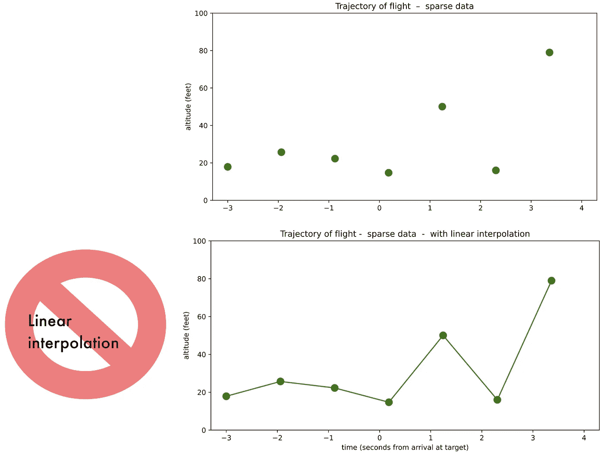

作者创建的图像

当然，在有些情况下，这种敷衍的表情是完全令人满意的，例如，如果我们对我们所拥有的数据点之间可能发生的事情不做任何假设。因为鸟是一种在实际物理空间中移动的生物，所以这不是其中的一种情况。相反，我们期望这只鸟在我们拥有的不充分的数据点之间以一种稍微平滑的方式移动。我们绘制的简单线性插值代替了推断——强加！—对鸟不适当的急动。它不是令人满意地平滑。

与上一节讨论的噪声数据一样，我们也可以使用这种稀疏样本数据尝试最小二乘线性回归:

作者创建的图像

结果还是不令人满意。直线严重不足。显然，它根本没有捕捉到真实的鸟飞行轨迹的轮廓。

**多项式回归(具有多项式特征的线性回归)**

让我们看看三次多项式回归捕捉飞行轨迹曲线的能力有多强:

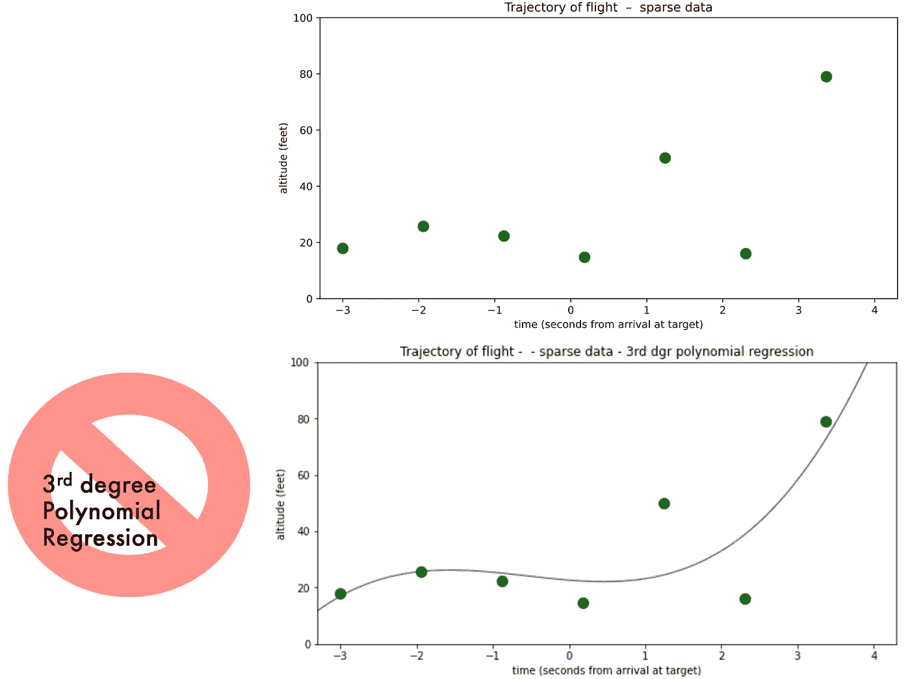

作者创建的图像

至少这呈现了一条平滑的曲线。然而，它缺少地面真相在 *t* =1 之后的凸起和在 *t* =2 之后的下降。

如果我们尝试一个 6 次多项式呢？

作者创建的图像

当然，这在某些方面稍好一些，但远不能令人满意。虽然它捕捉到了紧接在 *t* =1 之后的凸起，随后是在 *t* =2 处的俯冲，但它让鸟在 *t=* -3 处直线下降到地面，在 *t* =3 处钻入地下，然后立即突然进入平流层。

在这一点上，我们可能会考虑我们是否仅仅被稀疏度本身所困扰，从而将平滑度推得遥不可及。因此，让我们将采样增量从`15`缩小到`9`。

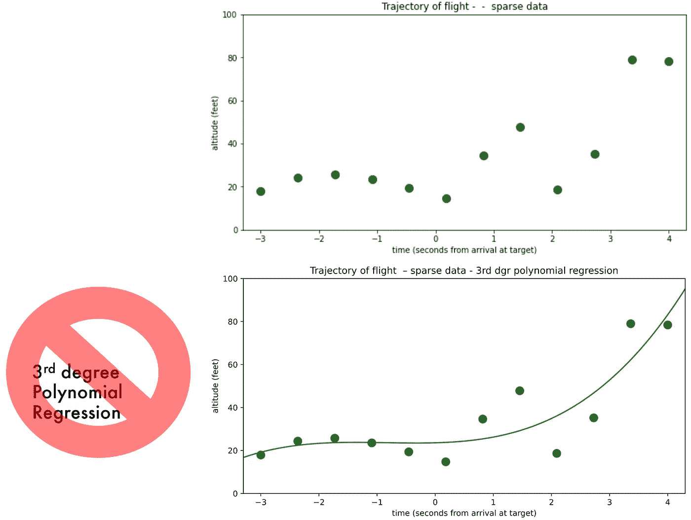

作者创建的图像

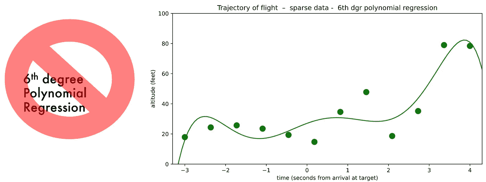

作者创建的图像

随着采样增量越来越小，三次多项式没有提供任何改进。6 次多项式实际上仍然不足。它增加了一些细微差别，但仍然错过了 *t* =2 之前的凸起和凹陷，并且——像通常的过度拟合多项式回归一样——开始偏离标记(鸟突然从地面出现，而不是像地面上那样水平飞行)。

**移动平均线**

为了完整起见，让我们考虑将移动平均线作为稀疏采样数据的潜在平滑器。

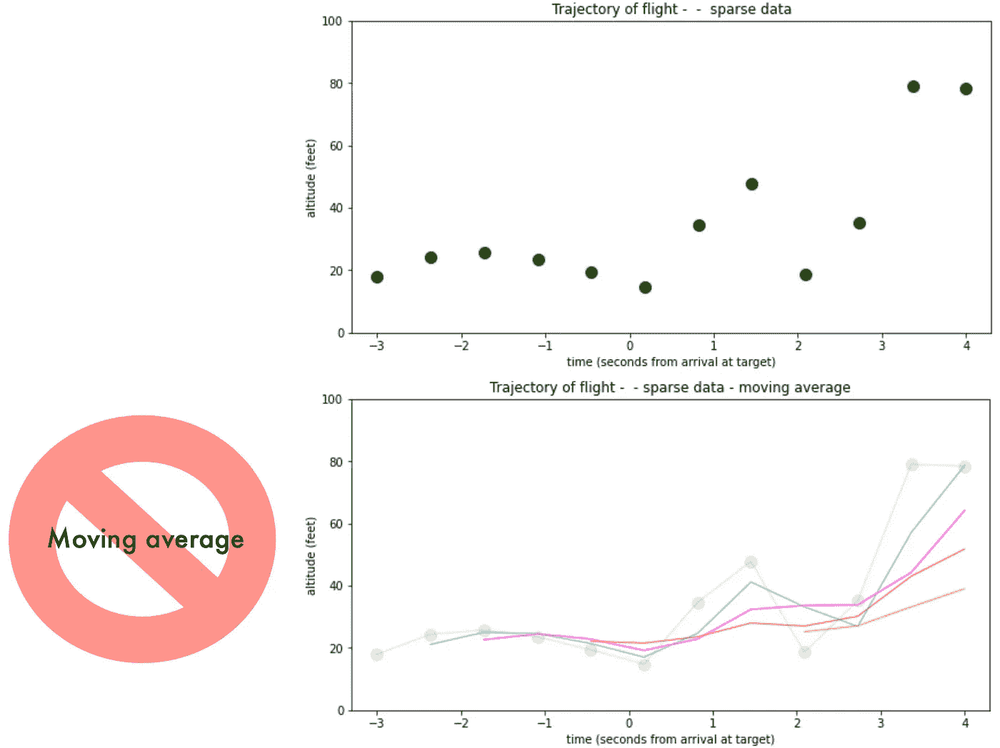

作者创建的图像

尽管*移动平均图*捕捉到了这只鸟轨迹的一些重要特征，但与其说它平滑，不如说它不平稳。回到我们最初的，更加稀疏的采样率`sampling_increment=15`给了我们一个稍微平滑的轮廓，但是没有我们的鸟的飞行路径的所有明显的凸起和俯冲。

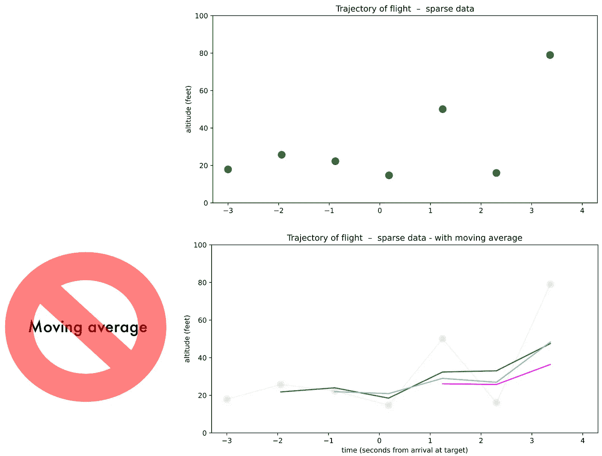

作者创建的图像

**回顾**

通过前四节(包括这一节)，我们已经考虑了一只鸟(或一群鸟)的飞行轨迹，记住我们不能假设一组系数模拟了它的全部，因为原则上鸟的意图会改变，因此根本不一定是可预测的。我们遇到了两种情况，其中我们拥有的数据是不平滑的，因此我们倾向于平滑它。一种情况是数据有噪声(如在一群鸟中)，另一种情况是数据采样过于稀疏。对于这两种情况，我们尝试了许多可靠的平滑方法:

*   线性内插法
*   线性回归
*   多项式回归(具有多项式特征的线性回归)
*   移动平均数

我们发现所有这些方法都不足以完成平滑的任务，无论是对于有噪声的数据(鸟群)还是对于数据采样过于稀疏的情况。

由布罗肯·伊纳荣耀——自己的作品，CC BY-SA 3.0，[https://commons.wikimedia.org/w/index.php?curid=2154634](https://commons.wikimedia.org/w/index.php?curid=2154634)

**现在怎么办？**

将要解释的适当的方法将利用这些方法的最一般的方面，特别是*聚集*或*插值、*，但是以更定制的方式。具体来说，我们的方法将由这种情况与我们的金发女孩比喻的关系来指导:

金发三重奏:太吵，太稀疏，和“刚刚好”(平滑)。(图片由作者提供)

具体来说，在数据过于嘈杂的情况下，我们会通过某种细致入微的*聚合*来平滑数据。当数据采样过于稀疏时，我们将通过某种细微的*插值*来平滑数据。通过*聚合*我指的是回归和移动平均的方面，它将多个数据点提取为更少的数据点(这些数据点是合成的而不是实际的)。通过*插值*，我指的是线性插值的一个方面，即在每对连续的实际数据点之间创建多个数据点(线性连接)。通过这些不同的方法，适当地选择，我们将使不平滑的数据“恰到好处”

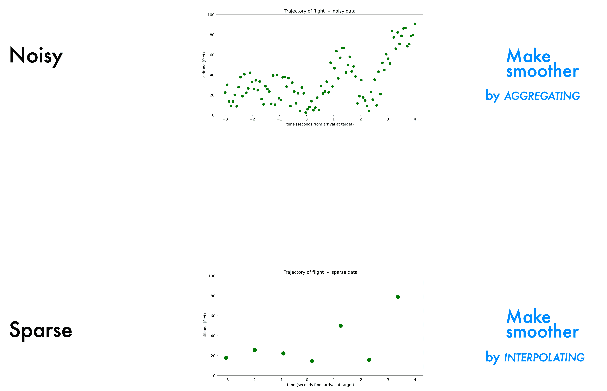

作者创建的图像

具体来说，下一节解释我们如何使用 *lowess* 来平滑噪声数据。

## 第 5 部分-无应力下限

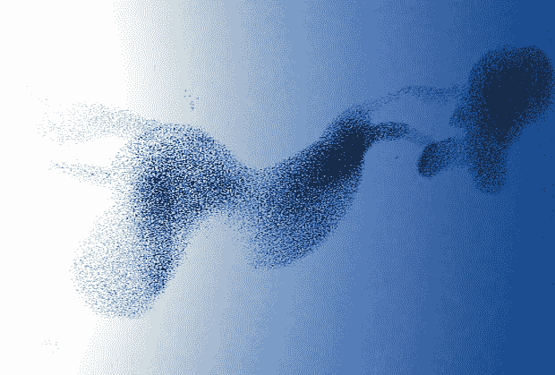

布莱恩·罗伯特·马歇尔 [(CC BY-SA 2.0)](https://creativecommons.org/licenses/by-sa/2.0/deed.en)

在前面的四个部分中，我们把一只鸟(或一群鸟)在飞行过程中改变其飞行意图的轨迹视为基本事实数据。尽管在单一系数集的意义上，飞行路径抵制纯粹的预测建模，但是如果它(1)有噪声(一群鸟)或(2)采样太稀疏，我们可能想要平滑它。我们考虑了线性插值、线性和多项式回归以及移动平均等方法，发现所有这些方法都不足以应对这种情况。

现在我们可以考虑一种适当的方法来平滑噪声数据。回想一下，我们的原始地面实况的散点图和线性插值如下所示:

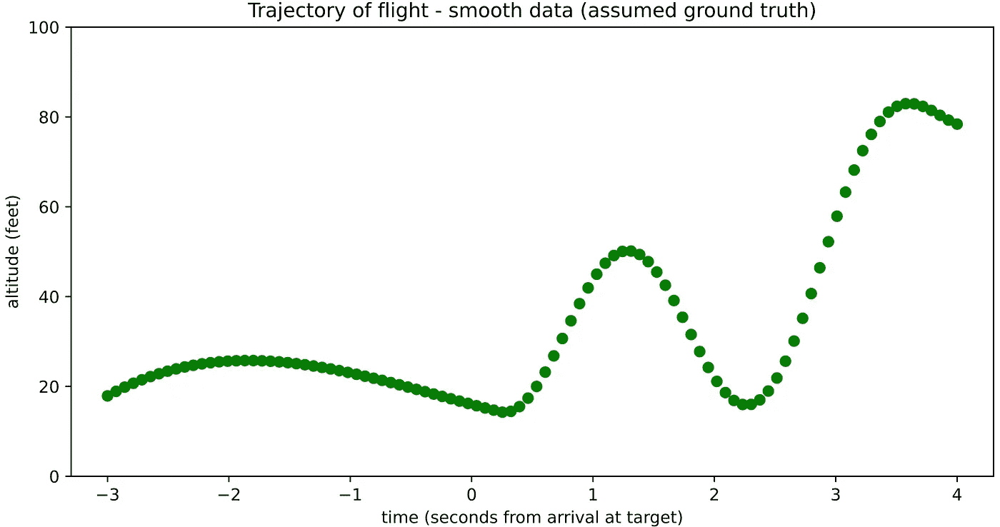

作者创造的形象

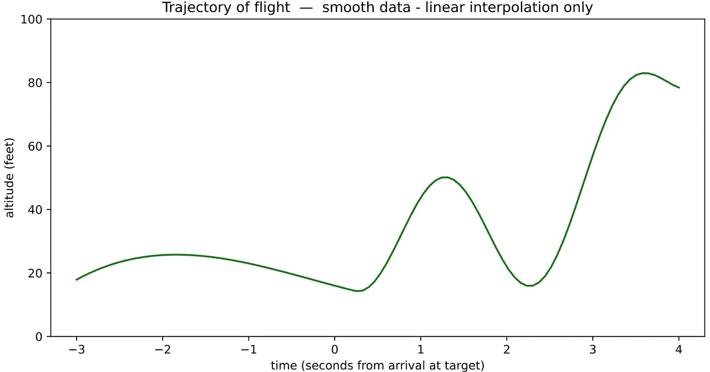

作者创造的形象

## 局部加权散点图平滑

在深入研究其背景和细节之前，让我们先来看看 *lowess* 对我们的噪声数据的应用:

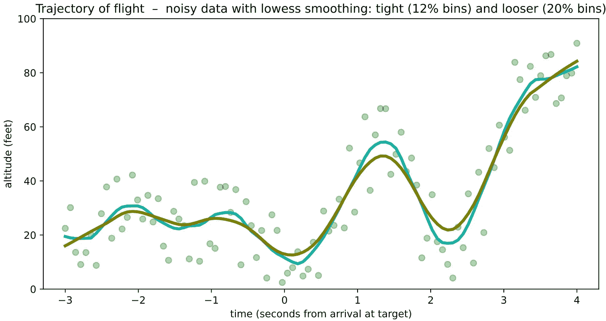

作者创造的形象

请注意它与地面真实轨迹有多相似。它在 *t* < 0 处有一个浅凸起。在 *t* =1 后有凸起，在 *t* = 2 后有低谷，接近并超过 *t* = 3 的陡坡，接近 *t=* 4 的斜坡有轻微的缓和。此外，它没有我们在前面的移动平均线图中看到的抖动。这张图是平滑的，正如我们从一只鸟或一群鸟的飞行中所期待的那样。这是因为，像原始地面真值生成的方式一样， *lowess* 是分段计算*的。*它与线性回归*和*移动平均线(两种聚合类型)有共同的方面，尽管它与两者都不同。在一些背景和技术解释之后，我将展示和讨论 lowess 的 python 实现。

## 关于局部加权散点图平滑的基本事实

*   由传奇人物约翰·图基和多产的爱德华·塔夫特在贝尔实验室的同事威廉·克里夫兰于 1979 年开发。
*   与**黄土** ( *局部估计散点图平滑*)相关，克利夫兰对多元数据的推广，由 Savitzky-Golay 滤波器于 1964 年预测。
*   Lowess(以及黄土)是非参数的，这意味着它没有对预测变量和因变量之间的模式做出任何假设。
*   Lowess 是作为一系列最小二乘线性回归*来计算*分段*的，每个最小二乘线性回归都基于数据的最近邻子集。(移动子集由超参数控制，该超参数将窗口大小指定为整个数据集的一部分。)*
*   在每次回归中，最近邻窗口内的点按其邻近程度进行加权。它可以是二次加权，尽管黄土通常使用三次权函数，其中 *d* 代表距离，每个点的权重定义为: *w(x)* = (1-| *d* |)
*   可能会遍历*个数据点中的*个。

## 洛斯是如何工作的？

*lowess* 的概念是简洁优雅。它结合了移动平均的分段宁滨(移动窗口)方面和线性回归的线性斜率估计方面。特别是， *lowess* 是单个最小二乘线性回归的从左到右分段串联，有一个重要的警告:不是一个条柱中的所有数据点都被同等加权(就像它们在移动平均和普通最小二乘线性回归中一样),而是通过它们与条柱中中心点的接近程度来加权。

为了形象化这是如何工作的，有几个动画可用，这使得这个过程非常生动。大卫·罗宾逊的“方差解释”提供了一个动画黄土图的演示(用 R 编程)。Robinson 页面的底部显示了黄土曲线的四个面板。

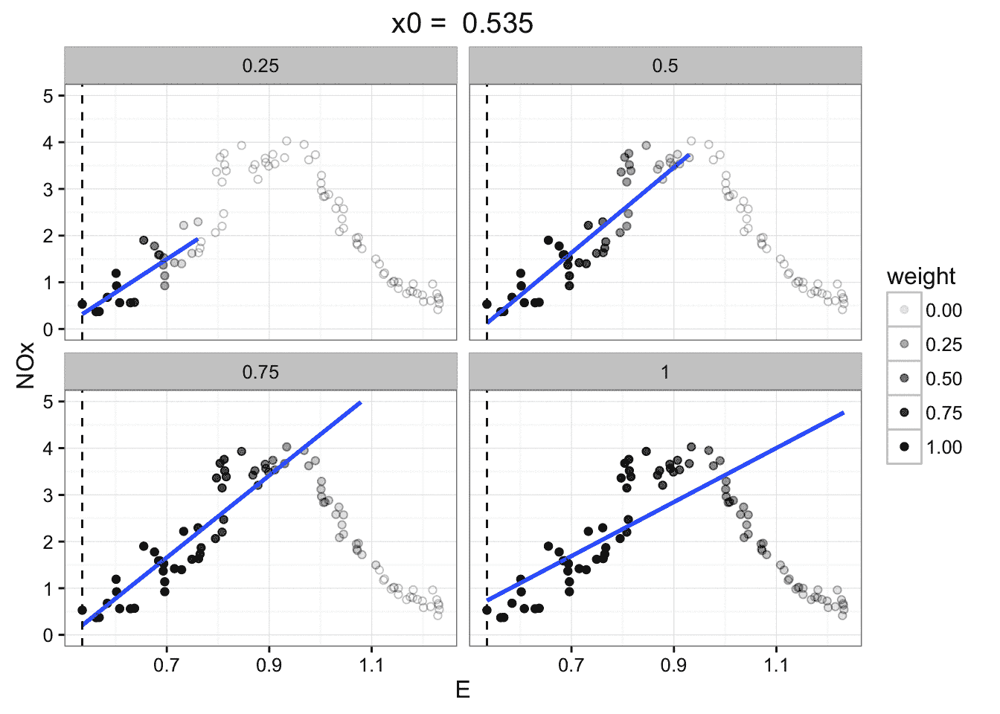

四条*黄土曲线*，出自[大卫·罗宾逊的《方差解释》](http://varianceexplained.org/files/loess.html) [(CC 许可](https://creativecommons.org/licenses/by-sa/2.0/))

查看黄土*曲线的四个面板，观察以下内容:*

*   如上所述，不是根据点的数量来指定面元(移动窗口)的大小，而是使用 *lowess* (和*黄土*)来指定面元大小占整体的比例。所以在 Robinson 的左上图中，面元大小超参数是整体的 1/4；右上方是一半。左下角是 3/4，右下角是每次计算时考虑的整个数据集。(在我上面展示的图表中，我将 bin 大小设置为 12%和 20%。)
*   Robinson 的 R 脚本激活数据点，使它们变暗，根据它们与移动中心点的接近程度指示它们的移动权重，移动中心点的曲线斜率和高度在序列的每次计算中被估计。其中的每一个，也就是每一个局部加权的线性回归，都用 Robinson 的蓝线来表示。由于其中每一个都是由一个充满全套系数的线性方程定义的，因此它不仅可以聚合，还可以在计算出的聚合之间进行插值，从而使红色曲线成为平滑的轨迹(这是移动平均值*所做的，而不是*所做的)。
*   超参数(将 bin 大小定义为一个比例)是使用 *lowess* 进行有效平滑的关键(也是区别 python 实现质量的东西，我将在下面解释)。如果这个超参数设置得太小，你就有*过度拟合*的风险(过度增加*方差*)。由于*黄土*和*黄土*没有假装整体预测全部数据(在给定范围之外)(用一组系数)，在这种情况下*过拟合*表现为在可视化中缺乏适当的平滑度；我们会看到表面上平滑的过度拟合变得参差不齐，就像移动平均线一样(例如在 Robinson 的左上图中)。另一方面，如果比例超参数设置得太高，就会有拟合不足的风险(将*偏差*增加得太多)，这表现为未能捕捉到基本事实的关键特征(例如在 Robinson 的右下面板中)。
*   泰勒·泰尔在他的 YouTube 视频中展示了一个关于黄土和黄土的*方差-偏差*权衡的极好例子。⁴·泰尔演示了如何使用*验证误差*来确定最佳拟合的超参数设置。另一个由
    Mizanur Khondoke r 制作的[动画生动地展示了仅用 30 秒钟移动比例超参数的效果！⁵](https://www.youtube.com/watch?v=Zn3jw0-CfBc)

正如我一直暗示的那样， *lowess，*是分段计算的，难道*不是*用一组系数来模拟全部数据。相反，就像一群可以在飞行中随时改变意图的鸟一样，在 *lowess* 中沿着路线(从左到右)的每个点都有自己的一组系数，这些系数决定了在轨迹中该点处与光滑曲线接触的直线的切线斜率。

[https://pix abay . com/photos/bird-热带-鸟嘴-多彩-异域-3433106/](https://pixabay.com/photos/bird-tropical-beak-colorful-exotic-3433106/)[https://pixabay.com/service/license/](https://pixabay.com/service/license/)

## LOWESS 的 Python 实现

如前所述，我现在将讨论 lowess 的 python 实现。我最初在 python 中部署 lowess 的尝试只是断断续续地成功。我很快意识到我第一次尝试使用的软件包的局限性。

考虑到 Seaborn 的输出在许多可视化情况下是多么完美，很容易尝试将它用于黄土地块，尤其是如果您已经在 pandas 数据框架中有了数据。下面是代码和使用 Seaborn 生成的 lowess 图。Seaborn 的*implot*试探性地提供了一个`lowess=True`参数。

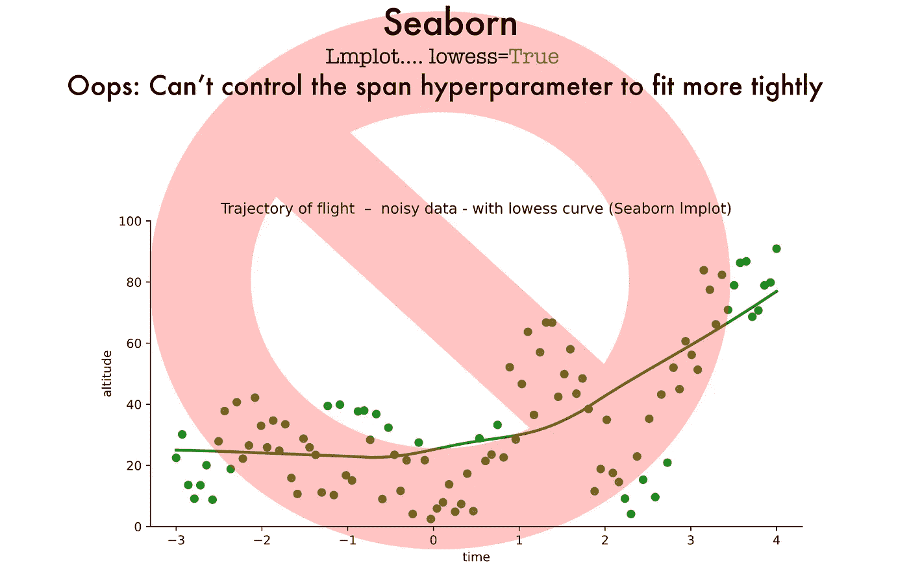

作者创建的图像

我用一把大锤的微妙之处对图表进行了注释，因为 Seaborn 对 lowess 的实现相对于 python 数据科学包的总体质量，特别是 Seaborn 的质量，以及更好的替代方案的可用性是多么糟糕。然而，首先请注意，这条曲线缺少我们想要的一切:(1)它严重欠拟合，未能捕捉到鸟群轨迹的明显凸起和俯冲；(2)它甚至不是很平滑。显然，这些限制的出现是因为在 Seaborn 的实现中，没有规定指定比例(跨度)超参数。

**Lowess**的 python *Statsmodels* 实现

相反，我推荐 Statsmodels 实现。它只需要一点点小心，但很容易使用。第一个参数是 y 数组，在本例中是我们的`noisy_data`，后面是 x 数组，在本例中是`in_array`。指定每次回归中要汇集的数据比例的超参数称为`frac`。需要记住的关键点是 Statsmodels lowess 返回一个 n 乘 2 的数组，其中第一列是 x 值序列，第二列是 y 值序列。所以我们必须适当地将这个数组切片，放入 matplotlib 的`plot`函数中，其中`lowess_tight[:,0]`和`lowess_tight[:,1]`分别是 x 和 y 数组。在这种情况下，由于我们实际上绘制了两条 lowess 曲线(一条紧曲线和一条松曲线),这意味着将所有这些切片适当地放入列表中，然后我们将把该列表作为前面定义的自定义 graph 函数的最终参数。下面是代码和图表:

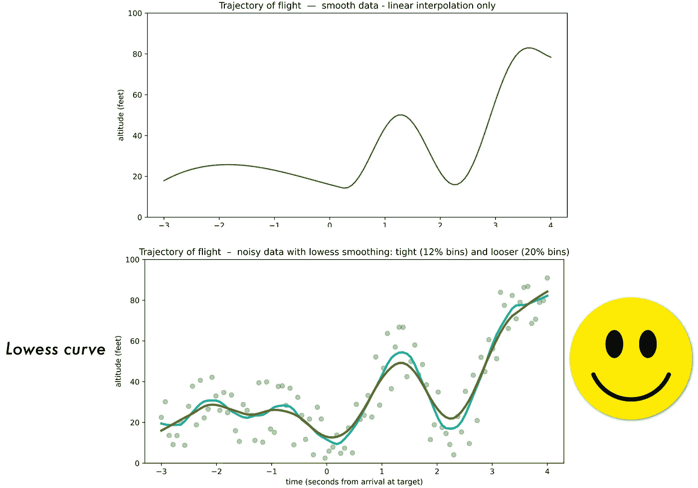

作者创建的图像

无论您选择更紧(`frac=0.12`)还是更松(`frac=0.20`)的曲线，这里的 lowess 曲线都胜过我们之前平滑噪声数据的所有尝试。请注意，它与上面显示的地面真实线性插值非常相似。

**Lowess 应用于稀疏采样数据**

以免你想象 lowess 回答了所有的数据平滑祈祷，让我们看看当我们将它应用于稀疏采样数据时会发生什么。

作者创建的图像

也许令人失望的是，lowess 没有成功地平滑稀疏采样的数据。因为我们只有七个数据点，20%的面元大小复制了稀疏数据的原始线性插值的角度形状(显示为蓝绿色)。事实上，将`frac`设置为小于 0.6 会产生相同的形状。设置`frac=0.6`导致一个不足够浅的曲线，就像我们看到的是由 Seaborn 制作的。

结果是我们需要一种不同的方法来平滑稀疏采样的数据。下一节将讨论 B 样条平滑的主题。

## 第 6 部分-让它用 B 样条发光

RebeccaVC1 — [(CC BY-SA 2.0)](https://creativecommons.org/licenses/by-sa/2.0/deed.en)

当我们的数据过于稀疏采样，我们做简单的线图，我们最终得到类似下面的东西，称为*线性样条，*不平滑。

作者创建的图像

然而，重要的一点是，这样的图形提供了连续数据点之间的*插值*。*插值、*或*样条、*实际上是我们想要的——在不同的数据点之间绘制连接。此外，这种线性样条是连接连续数据点的*分段*直线。因此，恰当地说，他们没有为整个数据集假定一个潜在的模式或规则；它们不需要预先确定鸟的预定飞行路线。这里唯一的问题是直线没有考虑到曲率，这导致地面真实鸟飞行方向的每次变化。然而，有一个补救办法，即 *B 样条*。

**B 样条**

b 样条是一种曲线样条，它是连续点之间的分段多项式插值，称为*节点。⁶* 下面是一些 python 代码产生的地面真实曲线(再次)后面跟着一条 b 样条曲线。为此，我们使用了 *scipy* 包。我们为它的`make_interp_spline`方法提供稀疏的 x 和 y 数组(`sparse_input`和`sparse_data`)以及一个多项式次数参数，在本例中，我们将二次多项式的次数参数设置为 k=2。(如果我们将其设置为 k=1，我们会看到上面已经看到的线性插值。)方法`make_interp_spline`产生一个`BSpline`对象，然后给它输入`x_interp`，允许它呈现适当数量的要绘制的数据点。如你所见，它相当接近我们的地面真实曲线。

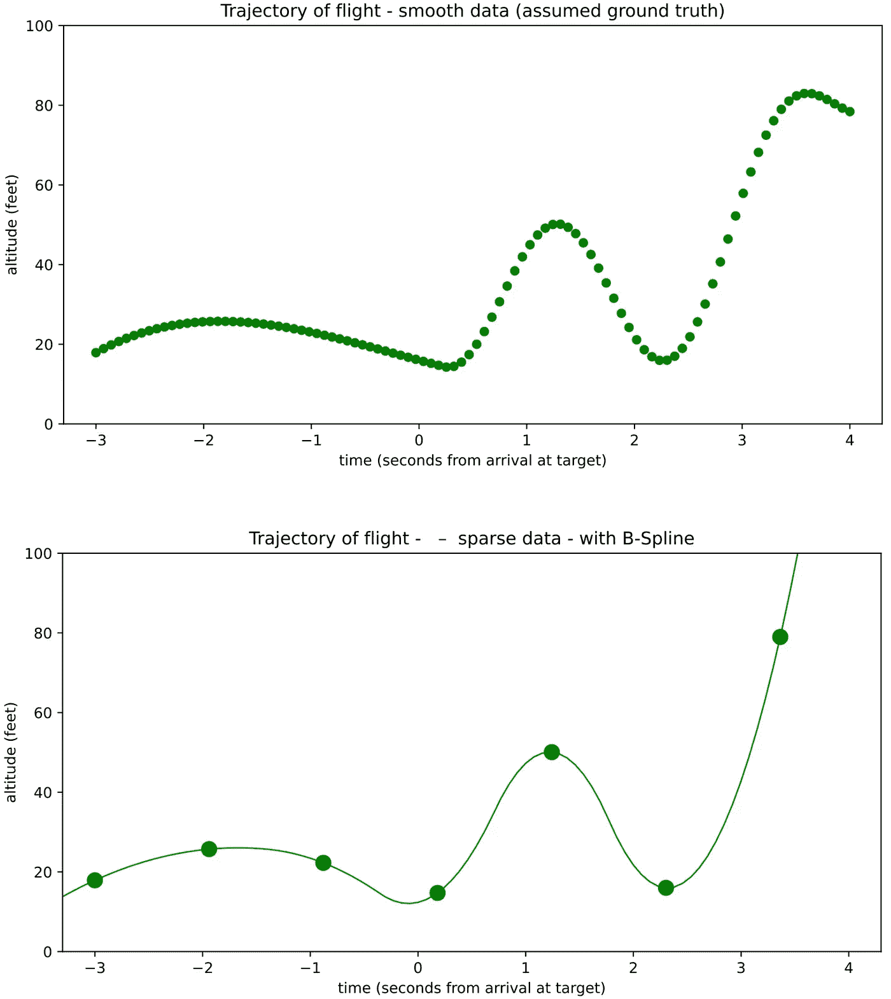

作者创建的图像

它确实缺少末端向下的钩子。然而，这仅仅是由于使用了特定的采样增量 15。如果我们将采样增量减少到 9，我们会得到我们想要的特定平滑曲线:

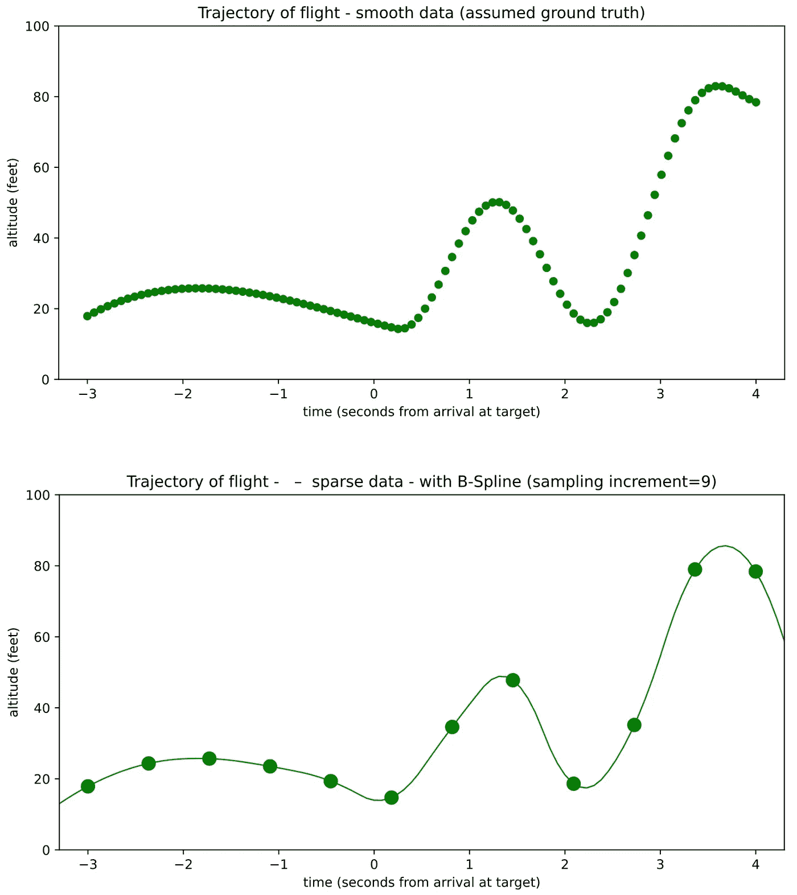

作者创建的图像

什么是 B 样条曲线，它是如何工作的？

B 样条，如上面所示的二次样条，使用与线性样条相同的分段原理，只是增加了一个确保连续性的功能。

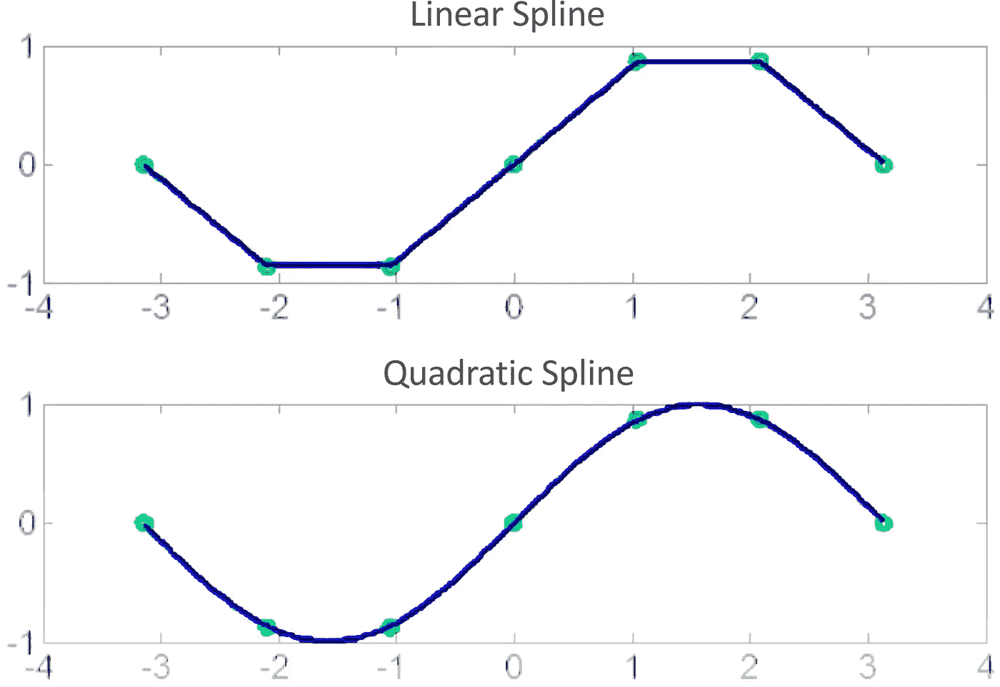

作者创建的图像

在二次样条中，分段插值不是直线，而是二次*多项式*。每个段都是不同的(有自己的系数):

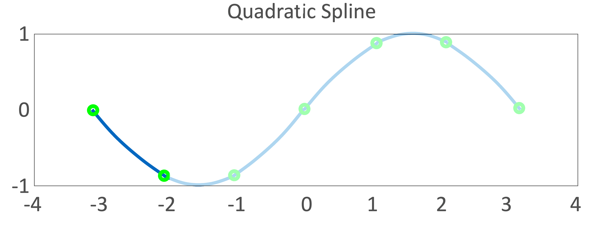

每个节点到节点插值的不同分段多项式(图片由作者提供)

二次样条(或一般的 B 样条)通过以下增加的特征实现平滑度:尽管每个样条有其自己的一组系数，但是这些系数被选择为使得对于每对连续的样条，它们的曲线在它们共享的节点处的切线具有相同的斜率，换句话说，相同的一阶导数。这被形象化为:

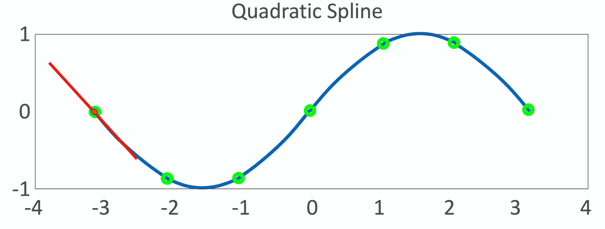

共享结上具有相同斜率的切线(图片由作者提供)

**B 样条的优点和局限性**

*LOWESS* 和 *B 样条*之间的一个重要区别是，LOWESS 曲线可能不会穿过*任何一个*数据点，相反，B 样条曲线保证会穿过所有的*数据点。*

为什么不将 B 样条用于噪声和稀疏样本数据？下面是尝试这样做的代码。其图表显示在地面实况图和稀疏采样数据的 B 样条图下。

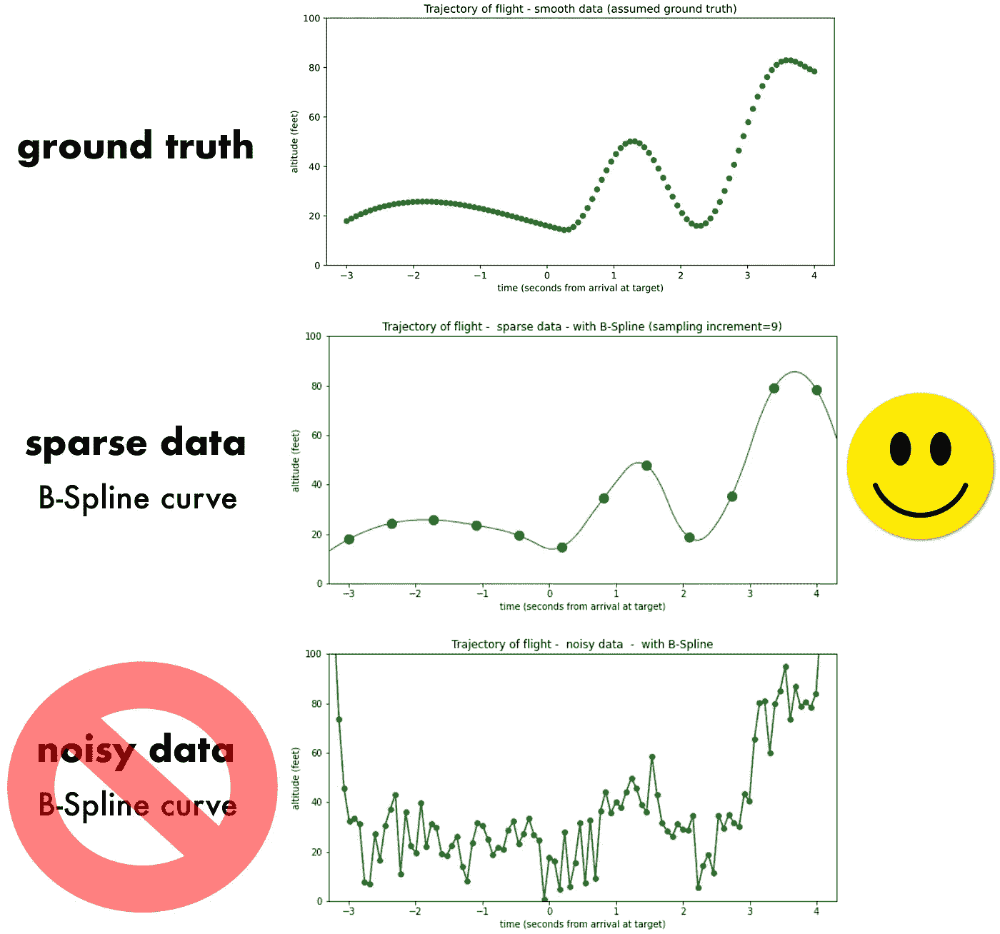

作者创建的图像

正如你所看到的，尽管 B 样条在应用于稀疏数据时效果很好，但在应用于噪声数据时却是一场灾难；它不能使一切变得平稳；这只会加重它的噪音。

## **结论**

那是一次长途飞行，但是我希望你喜欢旅途。我们认为鸟的飞行仅仅是一个例子，在这种情况下，我们不能假定一组系数作为预测因子的有效性。我们只能在有限的数据范围内对因变量(本例中为海拔高度)的波动进行建模。而且只做*分段*才有意义。为了最好地解释我们所拥有的数据，我们可能希望它是平滑的，因为鸟类的飞行包括在空间中的连续运动。正如我们已经看到的，如果我们的数据缺乏平滑性，无论是*回归*(线性、多项式等)还是*移动平均*都无法补救这一点，以实现我们期望的平滑可视化。

然而，如果我们的轨迹数据有可能被直观地解释，它可能缺乏平滑性，主要有两个原因:要么是噪音(如在一群鸟中)，要么是采样太稀疏。要在可视化中达到想要的平滑度，答案很简单:如果数据有噪音，不要有压力；应用 LOWESS。如果数据采样太稀疏，不要发牢骚；使用 *B 样条*。如果数据既有噪声*又有*采样过于稀疏，那么平滑不会使其更具可解释性——这一点很好理解。最有可能的是，如果你已经有平滑数据的倾向，这是由你已经在图表中看到一些模式的感觉所激发的。你只是想让这种模式的视觉化符合你的直觉，那是一条连续的曲线。在这种情况下，LOWESS 和 B 样条是你的工具箱的必需品。

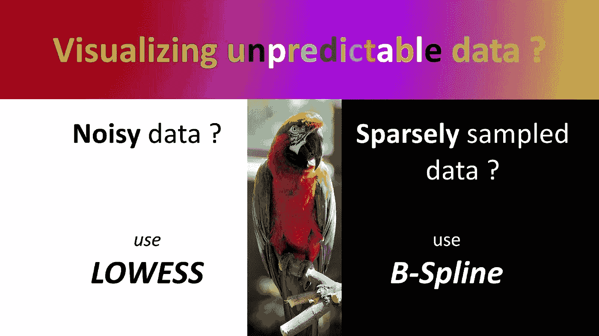

图片由作者提供，使用“吉姆”的照片，由 [Nconwaymicelli](https://commons.wikimedia.org/w/index.php?title=User:Nconwaymicelli&action=edit&redlink=1) 上传。[CC 许可](https://creativecommons.org/licenses/by/2.0/deed.en)

该分析在 [*Metis 数据科学训练营*](https://www.thisismetis.com/bootcamps/online-data-science-bootcamp) 完成，代码发布在[此处](https://github.com/jmailman) *。*

在 [LinkedIn](https://www.linkedin.com/in/joshua-banks-mailman/) 上访问我

[1]卡萨哈拉·阿克，辛格·RJ，诺姆·阿(2013)美国维生素 D (25OHD)血清季节性。PLOS 一 8(6): e65785。[https://doi.org/10.1371/journal.pone.0065785](https://doi.org/10.1371/journal.pone.0065785)https://journals.plos.org/plosone/article?[id = 10.1371/journal . pone . 0065785](https://journals.plos.org/plosone/article?id=10.1371/journal.pone.0065785)

[2] [威廉·克利夫兰。1979.“稳健的局部加权回归和平滑散点图”，*《美国统计协会杂志》*，第 74 卷(368): 829- 836 页。](http://home.eng.iastate.edu/~shermanp/STAT447/Lectures/Cleveland%20paper.pdf)

[3]大卫·鲁宾逊。2016，‘用 gganimate 创作一部黄土动画’*方差解释。*

[4] [蒂尔·泰勒。2020.什么是黄土，我应该什么时候使用它？*精算数据科学家*。YouTube。](https://www.youtube.com/watch?v=b7oryuMP3r8)

[Mizanur Khondoker。2013.非参数回归(Lowess)' YouTube。](https://www.youtube.com/watch?v=Zn3jw0-CfBc)

[6]分段多项式是*基* *函数的一个例子。*参见 Sing，Gurchetan，2018。 *'* 回归样条函数介绍(带 Python 代码)' A[*analytics vid hya*](https://www.analyticsvidhya.com/blog/2018/03/introduction-regression-splines-python-codes/)*[https://www . analytics vid hya . com/blog/2018/03/Introduction-Regression-Splines-Python-codes/](https://www.analyticsvidhya.com/blog/2018/03/introduction-regression-splines-python-codes/)*

*b 样条与贝塞尔曲线有关，如果你曾经在计算机图形设计软件包中操作过曲线，或者在文字处理器中试验过绘图工具，那么除了名字之外，它可能大家都很熟悉。这里有一个表格解释了如何区分它们:[https://www . geeks forgeeks . org/difference-between-spline-b-spline-and-bezier-curves/](https://www.geeksforgeeks.org/difference-between-spline-b-spline-and-bezier-curves/)。*

*网上有许多演示，允许通过鼠标移动操纵贝塞尔曲线。以下是其中的一些:*

*[http://math.hws.edu/eck/cs424/notes2013/canvas/bezier.html](http://math.hws.edu/eck/cs424/notes2013/canvas/bezier.html)*

 *[## 动画贝塞尔曲线

### 玩控制点来修改曲线！这些动画说明了参数贝塞尔曲线是如何…

www.jasondavies.com](https://www.jasondavies.com/animated-bezier/)* 

*[https://tholman.com/bezier-curve-simulation/](https://tholman.com/bezier-curve-simulation/)*