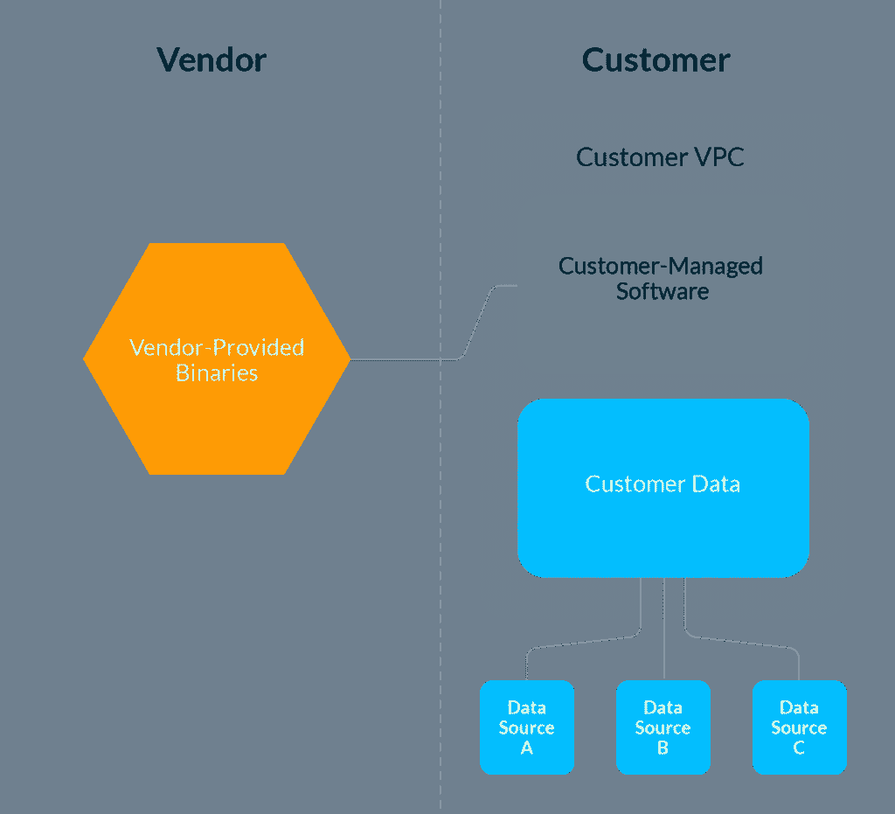
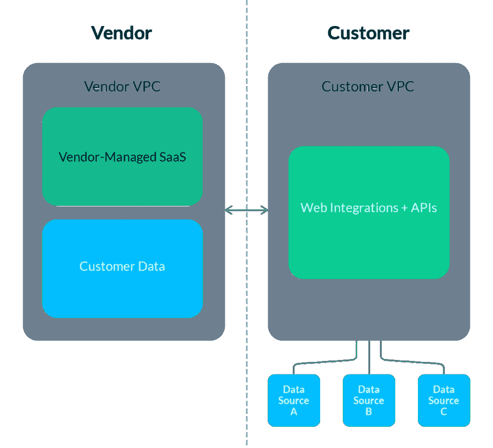
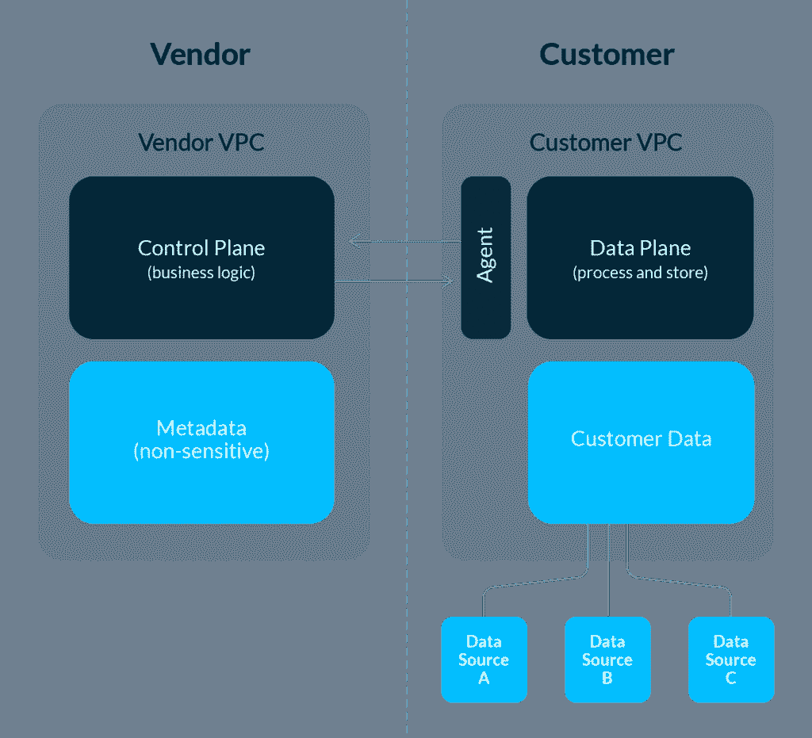

# 数据软件即服务:混合部署架构的案例

> 原文：<https://towardsdatascience.com/data-software-as-a-service-the-case-for-a-hybrid-deployment-architecture-c696ceaf9ef1?source=collection_archive---------26----------------------->

## 介绍构建安全且可扩展的数据产品的新方法

图片由作者提供。

*由*[*Lior GAVI sh*](https://www.linkedin.com/in/lgavish/)*、联合创始人兼 CTO、* [*蒙特卡洛*](http://www.montecarlodata.com) *、* [*凯文·斯汤普夫*](https://www.linkedin.com/in/kevinstumpf/) *、联合创始人兼 CTO、* [*泰克顿*](http://www.tecton.ai) *，以及* [*巴尔·摩西*](https://www.linkedin.com/in/barrmoses/)

*作为构建旨在帮助团队实现数据承诺的解决方案的公司的创始人，我们知道我们想要为客户构建易于部署和管理的优秀产品。*

*我们还知道，由于我们将与客户的数据堆栈集成，我们需要提供最高级别的安全性和合规性。问题是:我们如何建造它们？SaaS？内部部署？还有别的吗？*

*为了实现这些目标，我们选择了* ***混合部署架构*** *，这是一种将本地安全性与 SaaS 便利性相结合的新方法。原因如下。*

随着[贵公司接收和存储的数据](https://www.forbes.com/sites/gilpress/2020/01/06/6-predictions-about-data-in-2020-and-the-coming-decade/?sh=4b07485b4fc3)比以往任何时候都多，以及对这些数据的访问和使用方式的审查越来越严格，在您现有的数据基础架构中加入任何类型的新的第三方解决方案都会带来相应的安全问题。

事实上，在 GDPR、CCPA、HIPAA 和许多其他重要缩写词的时代，管理复杂的数据系统和保持敏感数据的安全是两个截然不同的问题，没有放之四海而皆准的解决方案。

> 对于数据领导者来说，选择要解决的问题就像是在选择毒药。

# 传统的内部部署模式

*第三方软件在客户环境中运行的本地部署架构以速度和运营效率为代价提供了更高的安全性。图片由作者提供。*

内部部署(on-prem)是指传统的部署模式，在这种模式下，软件在客户的环境中运行，通常在专用的 VPC 中运行。特别是，服务存储或处理的所有数据都保留在客户的云中。

## 利益

当供应商编写代码时，客户保持对数据的完全控制和所有权。

内部解决方案为客户提供二进制文件和许可证密钥(对于许可软件)，客户管理部署。这是无数软件产品选择的传统部署模型。例如，MemSQL 和 Splunk 的早期本地产品依赖于客户的工程和 IT 团队来处理部署。与 SaaS 解决方案相比，本地平台通常会根据客户需求提供更多定制和配置。

对于客户来说，选择利用本地体系结构的供应商的一个明显优势在于感知的安全性和合规性。通过将数据保存在客户的环境中，内部架构不会向外部方暴露任何连接。此外，供应商无法访问任何敏感信息，因为所有数据和软件都存放在客户的云中。

## 挑战

内部部署模式要求客户承担大部分**运营开销**。客户必须对灾难恢复情况进行故障排除，例如应用程序中断和数据停机，这可能非常耗时，并会导致糟糕的体验。

> 内部模型的第二个限制是**缺乏部署速度**，包括基线软件和任何未来的产品更新。由于软件存在于客户的环境中，升级可能是一个繁琐的过程，需要大量的权限和额外的资源。

# SaaS 模式

软件即服务(SaaS)解决方案提供了托管在供应商云中的现成软件，客户可以即时供应和使用这些软件。在这种模式下，软件由供应商运行和管理，客户数据存储在供应商的云中。由 Salesforce 开创的、来自数据世界的值得注意的最近的例子包括[雪花](https://www.snowflake.com/)、[段](https://segment.com/)和[图表](https://chartio.com/)。

*SaaS 模式托管在供应商的云环境中，允许快速部署和轻松更新，但也带来了对数据安全性和访问的额外担忧。图片由作者提供。*

## 利益

SaaS 模式使供应商可以轻松地进行更新，推出新功能，并大规模解决常见的棘手问题，而不是推动单个客户环境的变化。对许多人来说，这创造了一个更愉快的用户体验，通常成本更低。这也延伸到软件的维护，这是外包给最了解软件的供应商。

## 挑战

当您将数据加入其中时，SaaS 模型会变得更加复杂，尤其是当它涉及到法规遵从性要求和数据锁定时。

> 尽管任何有自尊的 SaaS 提供商都会对您的静态数据进行加密，但它仍然被锁定在供应商的环境中。因此，许多客户不愿意(或出于法规原因，无法)完全放弃数据的管理和存储。

即使客户愿意放弃在其环境之外安全存储数据的责任，他们仍然必须接受这样一个事实，即**数据现在已经完全锁定，并处于供应商的控制之下**。

那么，如何才能获得本地解决方案的合规性和灵活性优势以及 SaaS 供应商的易于部署性和便利性呢？

我们相信现代数据产品有更好的发展方向:**混合架构**。

# 混合部署模型

在过去的十年中，我们看到了软件工程的兴起，各行业的 DevOps 团队利用[混合云架构](https://tomtunguz.com/cloud-prem-architecture/)来管理基础设施即服务应用，包括 [New Relic](https://blog.newrelic.com/technology/hybrid-cloud-deployment-models-examples/) 和 [Atlassian](https://devops.com/3-ways-atlassian-usage-is-evolving-in-the-new-normal/) 。最近，许多数据软件供应商做出了类似的设计决定。

*混合架构模式利用软件工程和 DevOps 架构的最佳实践，将本地安全性与 SaaS 部署的便捷性相结合。图片由作者提供。*

为了结合现代数据堆栈的 SaaS 世界和本地世界的精华，数据软件的购买者应该考虑采用混合架构的解决方案。这种方法由两部分组成:(1)由供应商管理的控制平面，以及(2)客户环境中的数据平面。

## 控制平面

控制平面通常承载软件的大部分业务逻辑，并处理不敏感的元数据。它与数据层通信，并将敏感操作(如处理、存储或删除数据)委托给数据层。控制平面还提供 web 和 API 接口，并监控数据平面的运行状况。控制平面完全在供应商的环境中运行，通常遵循多租户架构，尽管一些供应商提供在客户专用的完全隔离的 VPC 中运行的单租户控制平面(通常价格较高)。

## 数据平面

数据平面通常处理和存储所有客户的敏感数据。它必须能够从控制平面接收指令，并传回有关其操作和健康状况的元数据。从技术上讲，控制平面和数据平面之间的接口通常由在客户环境中运行的瘦代理来实现。一些供应商甚至能够完全跳过代理，充分利用跨云客户 IAM 角色。

> 从本质上讲，将客户的数据与受管软件分离，可以为客户提供 SaaS 产品的灵活性、本地解决方案的合规性和数据所有权，并始终将客户数据保存在客户的云环境中。

## 更快的入职和价值实现时间

混合架构使客户能够快速部署软件，而且通常只需很少的人工开销。

同时，这种快速的入门允许客户从产品中获得近乎即时的影响，并在短期内从他们的数据或 ML 模型中获得近乎即时的价值。

作为这种部署模式的一部分，拥有混合解决方案的供应商通常会提供随叫随到的支持，这是他们产品的一个关键特性，几乎就像是他们客户的嵌入式 SRE 团队。

## 独立管理复杂的基础架构和敏感的客户数据

混合模式的最大优势之一是，它使客户无需配置或维护供应商的复杂基础架构，同时让客户能够完全控制自己的数据。

一种方法是让供应商通过代理或交叉帐户角色访问“数据平面”，提取元数据、查询日志和汇总统计数据等信息。与许多 SaaS 产品不同，没有任何个人记录或 PII 从客户的数据仓库、湖泊或 BI 工具中取出并存储在供应商的云上。

混合方法还有助于添加控制供应商帐户权限范围的“旋钮”(即，越宽松，客户方的管理越少，反之亦然)。这让客户在数据访问和安全方面拥有更大的代理权，这对金融科技和医疗保健等行业至关重要，这些行业存在大量敏感数据，可接受的误差幅度很低，甚至不存在。

通过让供应商管理服务的计算资源，还可以确保供应商可以快速解决产品的任何问题，而不会给客户带来负担。数据代理解决了这个问题，并确保供应商的基础设施可以很容易地维护、调试和更新，而无需客户的努力或资源。

> **给正在阅读本文的供应商的提示:**我们建议您尽早获得 SOC2 认证，稍后您会感谢我们的。许多企业，尤其是 GDPR、HIPAA 和 SOX 合规行业的企业，在考虑与您合作之前都会有此要求。

## 快速持续的软件升级

混合部署模式在客户云中保留稳定的云原语，如 S3、EMR、DynamoDB，在托管云中保留所有不断改进、快速发展的基础架构(即产品本身)。因此，客户可以更轻松地将新解决方案集成到他们的数据堆栈中，因为尝试和开始使用混合模式供应商的成本要比复杂的本地软件低得多。与托管在客户的私有云相比，在供应商的环境中托管服务还可以更轻松、更无缝地为所有客户推出更新。

在供应商的环境中托管服务意味着客户可以获得新功能，确保创新和产品开发不会各自为政。客户甚至不再需要知道不同的软件版本和缓慢的升级周期，他们可以放心，他们将始终使用最新和最好的版本，完全自动。

混合模式为客户提供了选择产品使用方式的灵活性，例如，如果他们希望在整个堆栈中部署该产品或仅在少数选定的数据环境中部署该产品，并且可以根据需要轻松添加或减少服务实例。

# 为灵活、安全的数据堆栈指明前进的道路

虽然我们在创建蒙特卡洛和泰克顿时并不认识对方，但我们最终为我们的产品选择了类似的架构。这种混合模式最终对我们支持数据和 ML 组织的能力至关重要，同时也得到了安全团队的认可。

通过利用混合 easy 本地架构，解决方案提供商可以构建易于部署、代表客户几乎不需要运营开销的数据产品，促进完全的数据所有权，而且最重要的是，确保最大的数据安全性和合规性。

> 说到底，为什么不能两者兼得呢？

***有兴趣了解更多？联系到***[***Lior GAVI sh***](https://www.linkedin.com/in/lgavish)*[***蒙特卡洛***](http://www.montecarlodata.com) ***或***[***Kevin Stumpf****联合创始人兼 CTO*](https://www.linkedin.com/in/kevinstumpf)*

**参加我们在 4 月 21 日和 4 月 22 日举办的 apply()—ML 数据工程会议。这是一个免费的虚拟活动，为 ML 从业者讨论数据工程的挑战和应用 ML。注册 [***这里的***](http://applyconf.com) ***。*****