# 人口可视化的数据故事

> 原文：<https://towardsdatascience.com/data-storytelling-with-population-visualizations-5734b72329d6?source=collection_archive---------15----------------------->

## 思考诺伍德·维维亚诺的艺术

在接种新冠肺炎疫苗后，我想做的第一件事就是去参观博物馆(当然，带着面具和社交距离)，我的第一次参观是在得克萨斯州休斯顿的美术博物馆。

逛画廊的时候，我立刻被一个名为[城市:背离和偏离](https://www.norwoodviviano.com/cities-departure-and-deviation)的诺伍德·维维亚诺的展览所吸引。该展览的核心是对代表 24 个城市人口长期变化的时间序列数据的可视化。在过去两年的工作中，我一直专注于时间序列数据，这位艺术家成功地将这种数据类型可视化得如此之好，以至于它实际上属于博物馆，这让我很感兴趣。

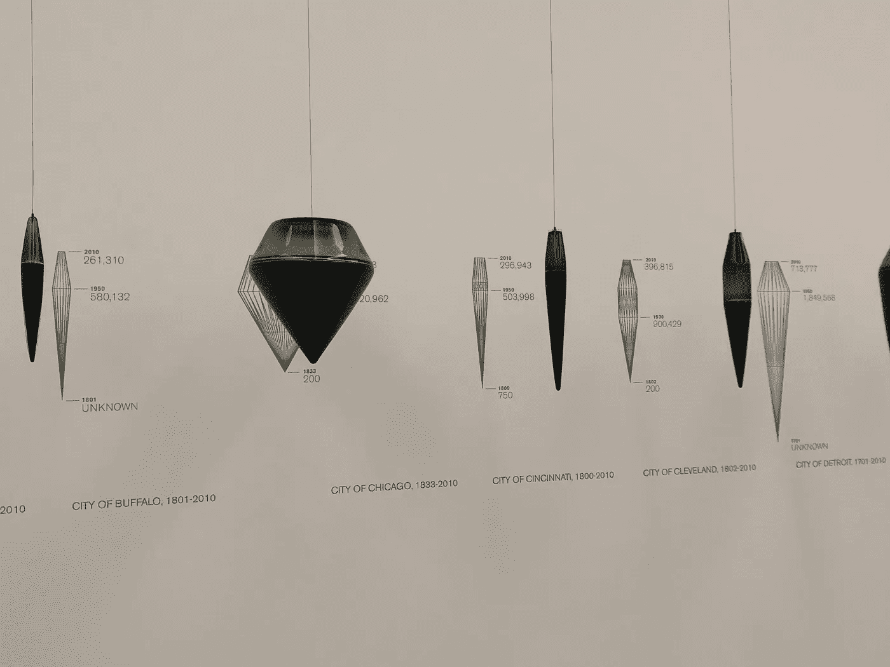

图片作者。摄于德克萨斯州休斯顿的美术博物馆。代表诺伍德·维维亚诺的《城市:背离与偏离》

每个城市都由自己的玻璃吹制钟摆来代表，钟摆的长度代表时间，宽度代表人口，颜色的变化代表重大事件。因此，每个城市的人口趋势都以独特的 3D 可视化方式捕捉，让人想起小提琴的情节。大多数钟摆包含 3 个数据点，形成相当长的平滑形状。

该展览以其清晰的线条和现代的灰度有效地吸引了观众，甚至在你看到真实数据的表现之前就变得很明显。这是这种可视化的一个方面，我认为它非常强大——美术博物馆的观众比通常寻求数据可视化的观众更广泛，博物馆观众可以有效地被这个展览吸引和接触到。在你意识到之前，你会试着去思考这些人口趋势的巨大变化，并考虑当地的工业是如何改变来创造你所看到的模式的。视觉化是极简主义的，但是它的影响让你想要寻找更多的信息。

作为一名数据人员，这个展览也让我思考它遗漏了什么——维维亚诺做了什么决定以及这些决定的含义是什么。普通人不会花时间去思考数据的细微差别，事实证明，他们会过于迅速地相信数据和数据驱动模型的 T2 输出。我倾向于相信，对于城市这样的可视化来说尤其如此——干净的灰度外观会让你认为它的表现是绝对真实的。

但是正如我们数据人所知(或者至少*应该*知道)，数据并不代表单一的内在真理。它们可能会被精心挑选和突出，以讲述特定的故事，即使在透明度方面做出了最大的努力，也可能会遗漏重要的细节或替代角度。在“城市:偏离和背离”展览中，我不禁想知道这些干净的玻璃线条可能隐藏了什么趋势和事件。

我决定观察其中 10 个城市的人口趋势，但取而代之的是包括我能找到的所有人口数据。我很好奇这种模式与维维亚诺的可视化有什么不同，他选择讲述的故事中可能遗漏了什么。要明确说明的是，我绝不是为了批评维维亚诺的作品而进行这个项目的。据我所知，他所陈述的所有数据都是准确和真实的。此外，当他用玻璃吹制这些作品时，期望他表现 20 个不同时间点的变化是不合理的。即使他可以，我个人认为，一个更微妙的形状会从他的钟摆的惊人的性质。毕竟，他是一个艺术家，可以自由地对待他的作品。

然而，我确实认为，在这些数据的引擎盖下看一点是一个有用的练习，提醒我们自己，数据并不是真理的全能力量。从完全相同的数据中可以得出不同的结论和讲述不同的故事，这取决于谁在分析它们以及他们想说什么。

# 方法

我做了合理的努力来寻找维维亚诺使用的相同数据以及任何其他可靠的人口估计。我使用的数据绝大多数来自美国人口普查，该普查每 10 年进行一次，尽管完整的数据引用可以在本文末尾找到。我分析的这十个城市是基于我自己对它们历史的一般兴趣而选择的，而不是由于数据中的任何预期发现。

虽然乍一看 Viviano 的钟摆看起来确实像小提琴图，但实际的小提琴图在这里并不可用，因为它们代表分布(像箱线图或直方图)，并且不是以传统的 2D 形式设计来代表尺度随时间的变化。因此，我用简单的线形图捕捉了这些趋势，尽管为了更容易与维维亚诺的钟摆进行视觉比较，在线条下方画了阴影。如果你将一个钟摆纵向一分为二，并把它放在切割面上，你会看到类似于这些线图的趋势。所以，要比较这些线图和钟摆，最简单的方法可能是画出阴影区域的镜像以及曲线图本身。

# 城市

## 1.纽约

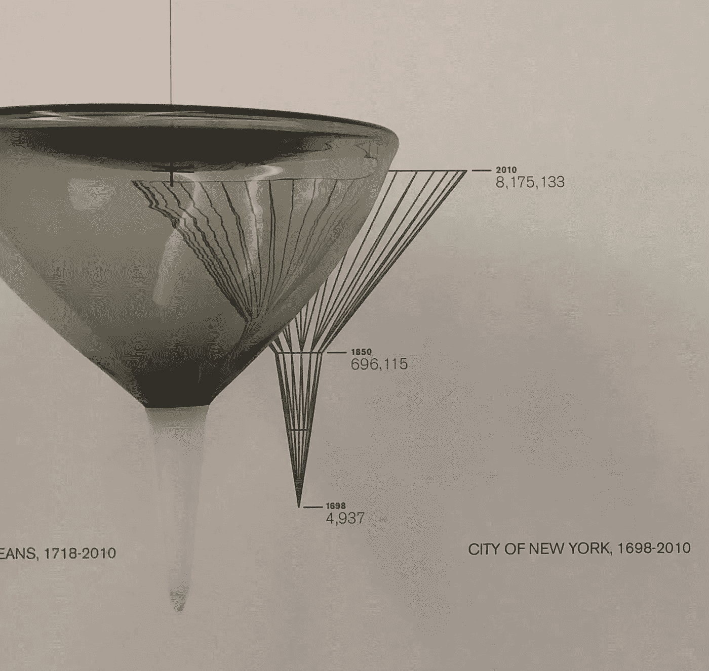

图片作者。摄于德克萨斯州休斯顿的美术博物馆。代表诺伍德·维维亚诺的《城市:背离与偏离》

我对纽约市的人口历史特别感兴趣，因为这是我称之为家的城市。总的来说，我认为我的线图所讲述的故事与维维亚诺的钟摆所讲述的故事非常同步。然而，由于没有包括 1850 年至 2010 年之间的数据点，从钟摆来看，似乎人口增长在 1850 年开始发生剧烈变化。然而，看一下线图，似乎这种变化实际上是从 1890 年左右开始的(进一步的研究表明，纽约市实际上在 1898 年[扩大了它的边界](https://www1.nyc.gov/assets/planning/download/pdf/planning-level/nyc-population/historical-population/1790-2000_nyc_foreign_birth_graph.pdf)，这可能解释了这种增加)。此外，1980 年人口有一个有趣的下降，但钟摆没有注意到。也就是说，我认为维维亚诺钟摆的 3D 特性比线形图更有效地捕捉了纽约经历的人口增长的绝对规模。

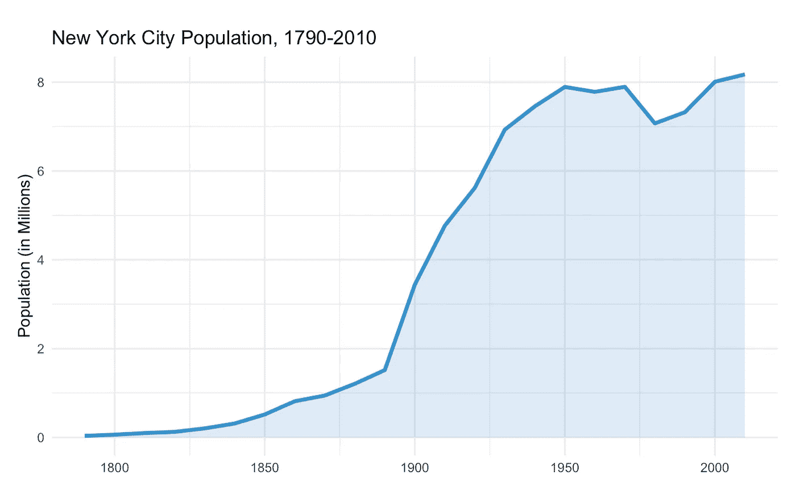

图片作者。数据来源见下文。

## 2.纽瓦克

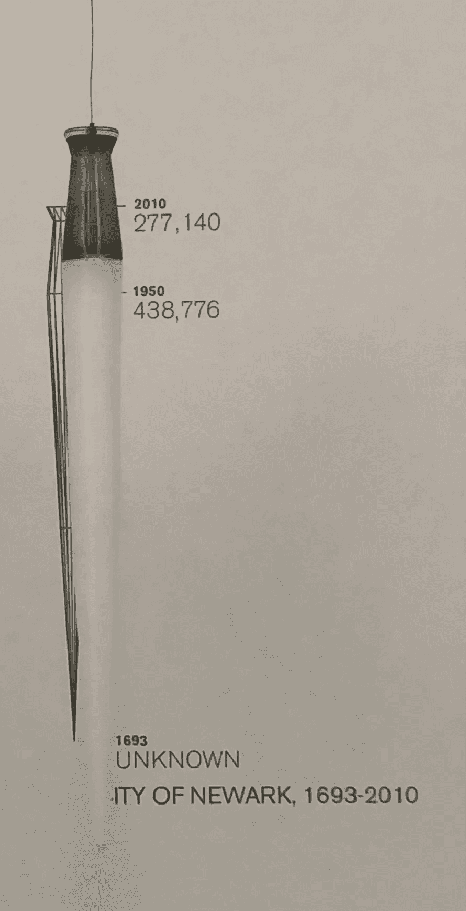

图片作者。摄于德克萨斯州休斯顿的美术博物馆。代表诺伍德·维维亚诺的《城市:背离与偏离》

代表纽瓦克的钟摆很好地突出了该市直到 1950 年的持续增长和随后直到 1990 年左右的人口下降。然而，也许这个钟摆最擅长的是透视纽约市的人口总量。虽然这些钟摆的长度相当相似，但这些(几乎)相邻城市之间的相似之处也就到此为止了。代表纽约最近人口规模的巨大的碗绝对让在同一时期捕捉纽瓦克人口的细管相形见绌。纽瓦克的人口下降尤其引人注目，因为它与纽约市的钟摆并列，这有效地凸显了距离纽约仅半小时车程的另一座城市几十年来一直蓬勃发展。

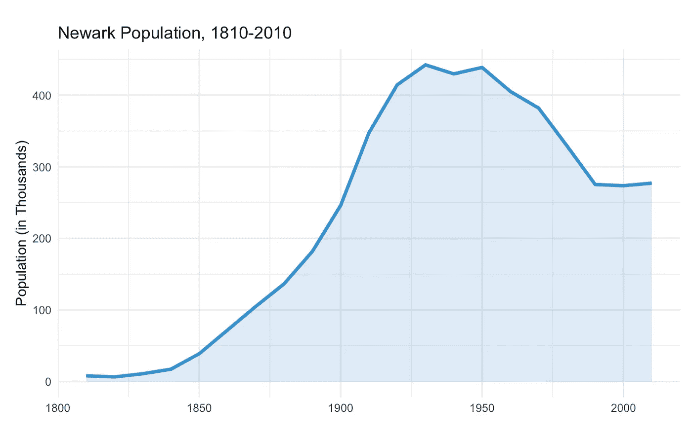

图片作者。数据来源见下文。

## 3.波士顿

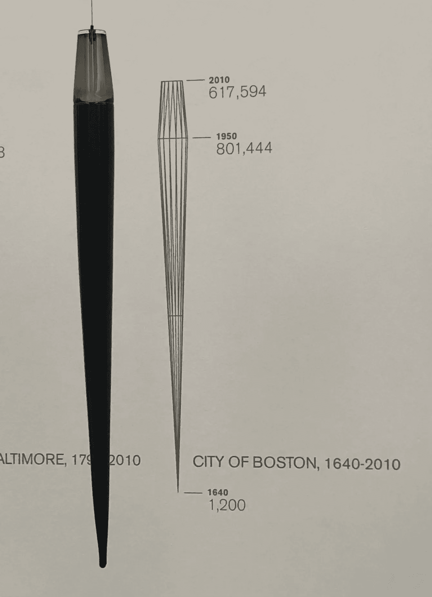

图片作者。摄于德克萨斯州休斯顿的美术博物馆。代表诺伍德·维维亚诺的《城市:背离与偏离》

然而，我认为波士顿人口变化的确切时间表因为只包括这三个数据点而有点丢失。虽然钟摆描绘了从 1640 年到 1950 年稳定、持续的增长，但看一下线图，实际上似乎人口增长率在 19 世纪初显著增加了。钟摆无疑突出了 1950 年开始的人口急剧下降，但完全忽略了自 1900 年代后期以来人口规模的小而稳定的增长。显然，维维亚诺更感兴趣的是让观众思考自 1950 年以来可能导致波士顿人口减少的因素，但我个人认为，思考这座城市如何以及为什么能够在近几十年来扭转这一人口趋势更有趣。

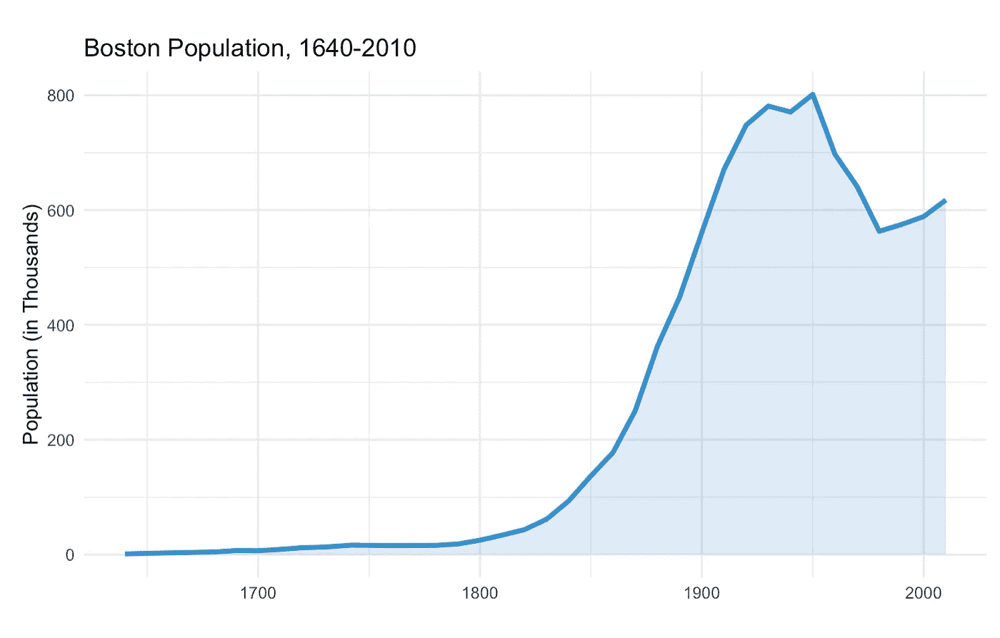

图片作者。数据来源见下文。

## 4.芝加哥

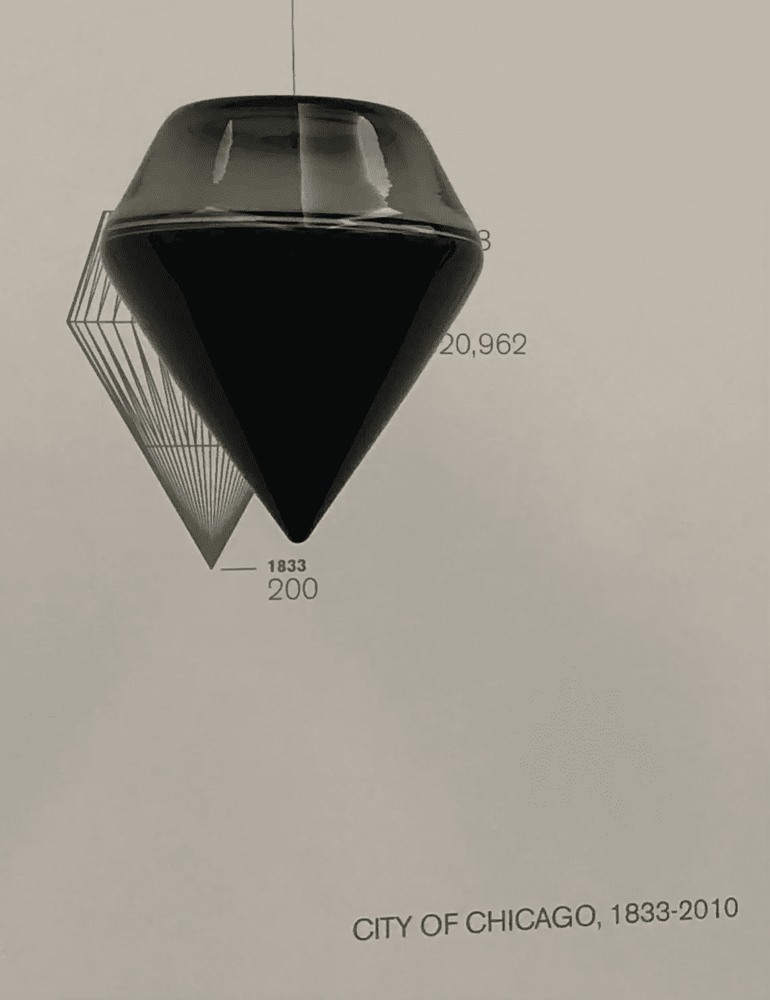

图片作者。摄于德克萨斯州休斯顿的美术博物馆。代表诺伍德·维维亚诺的《城市:背离与偏离》

代表芝加哥人口的钟摆特别有效。它与线图吻合得很好，在这种情况下，我不认为简化的设计丢失了任何重要的趋势(也许除了 1880 年左右人口增长率的适度增长)。事实上，我认为钟摆简单、干净的形状实际上比线形图更清楚地讲述了人口随时间变化的故事。

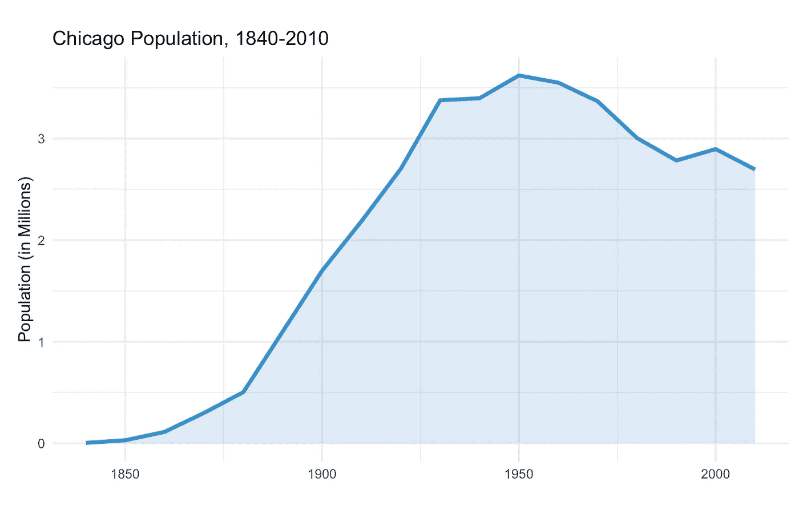

图片作者。数据来源见下文。

## 5.休斯敦

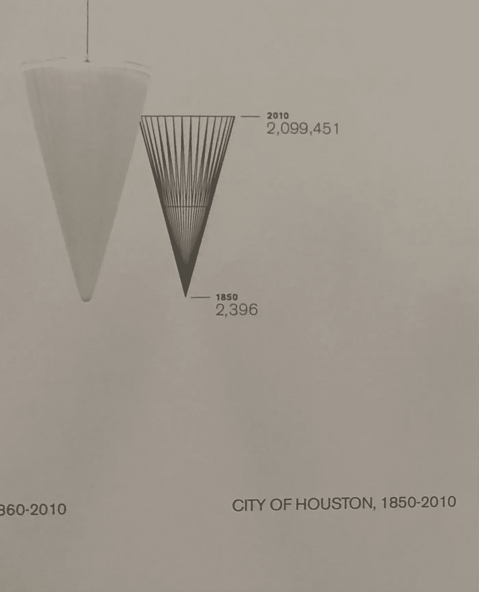

图片作者。摄于德克萨斯州休斯顿的美术博物馆。代表诺伍德·维维亚诺的《城市:背离与偏离》

代表休斯顿人口的钟摆是基于两个数据点构建的，但它仍然非常有效。正如你从钟摆图或折线图中看到的，休斯顿的人口自 1850 年以来一直在稳步增长，没有任何明显的停滞或人口数量的减少。事实上，钟摆可能比折线图更好地代表这些数据，尽管它的粒度增加了。钟摆的圆锥形状清楚地显示了 19 世纪休斯顿人口的快速增长，但这些增长在折线图中并不明显。这是因为，考虑到 y 轴延伸到 200 万，即使人口规模增加 100%，导致新人口数低于几千，也完全是小巫见大巫。

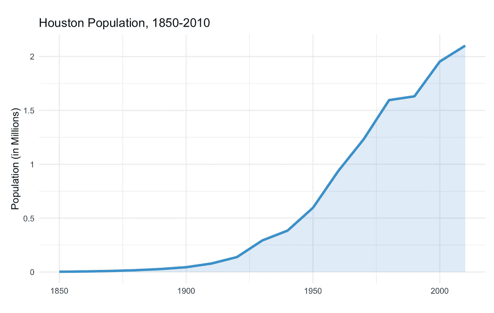

图片作者。数据来源见下文。

## 6.费城

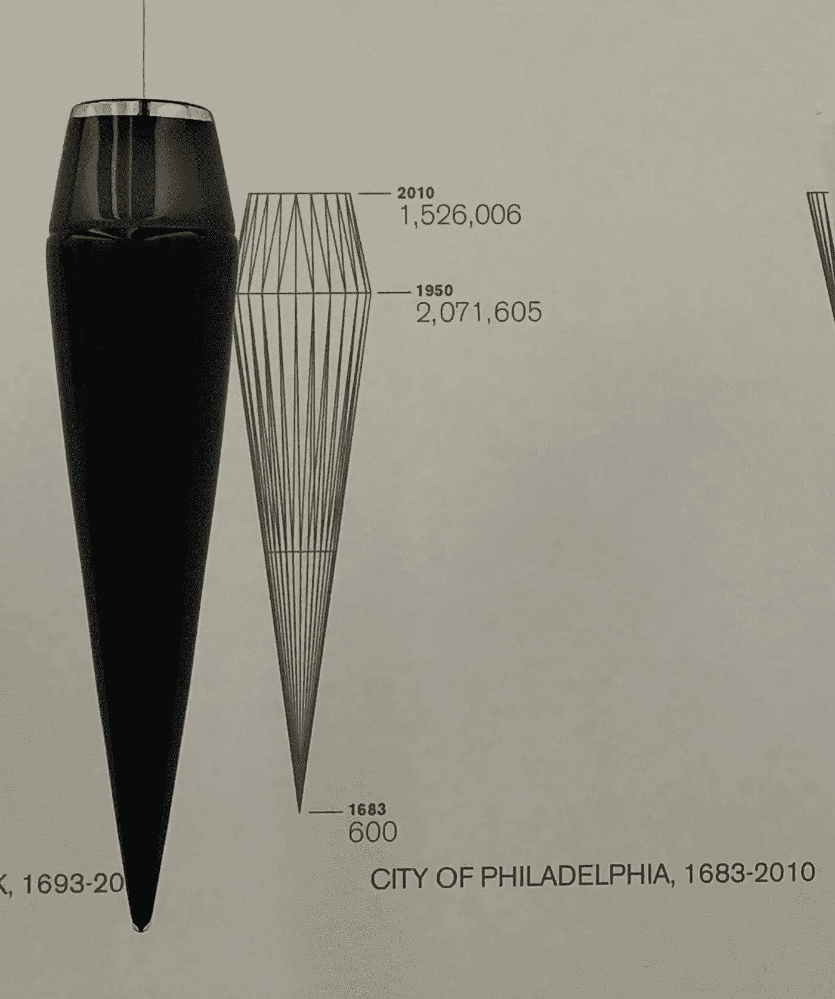

图片作者。摄于德克萨斯州休斯顿的美术博物馆。代表诺伍德·维维亚诺的《城市:背离与偏离》

代表费城的钟摆完全掩盖了 1850 年左右发生的一些重大变化(可能是 1854 年的[合并法案](https://en.wikipedia.org/wiki/Philadelphia)，根据该法案，费城吸收了几个周边地区)。看一下这个曲线图，在 1950 年之前似乎有两个人口增长时期:一个是从 1683 年到 1850 年左右的适度增长时期，另一个是从 1850 年以后的快速增长时期。虽然钟摆很好地捕捉到了 1683 年至 1950 年间的人口增长规模，但这种变化似乎并不像光滑的玻璃锥形所暗示的那样呈线性发生。然而，1950 年至 2010 年间的人口下降似乎得到了很好的体现，钟摆的形状非常有效地突出了这一点。

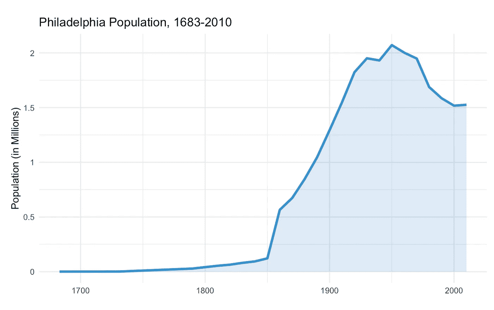

图片作者。数据来源见下文。

## 7.洛杉矶

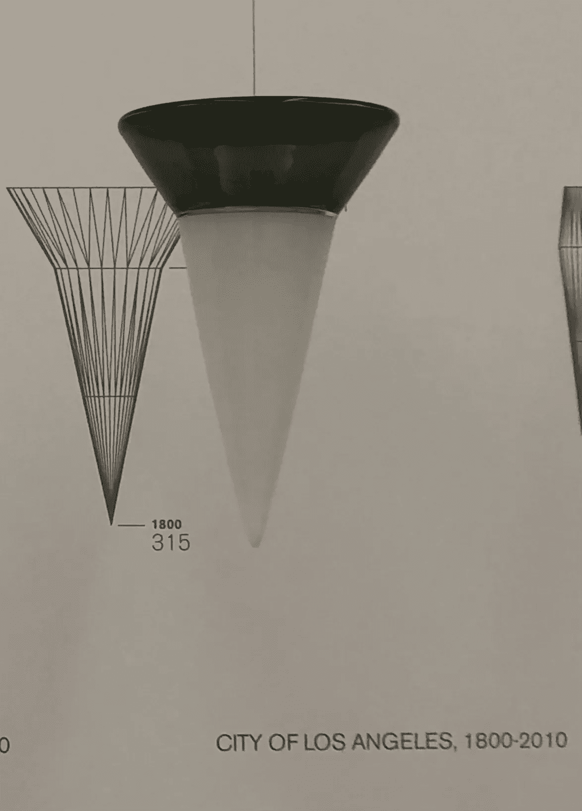

图片作者。摄于德克萨斯州休斯顿的美术博物馆。代表诺伍德·维维亚诺的《城市:背离与偏离》

代表洛杉矶人口的钟摆是另一个通常相当有效的钟摆，在这种情况下，显示了这座城市自 19 世纪以来稳定而快速的增长。然而，我不太确定维维亚诺试图捕捉的变化是什么，因为白色圆锥与黑色圆锥相遇的点(1950 年)并没有通过线形图中增长率的变化反映出来。相反，线形图显示了至少自 1900 年以来相当一致的增长率。

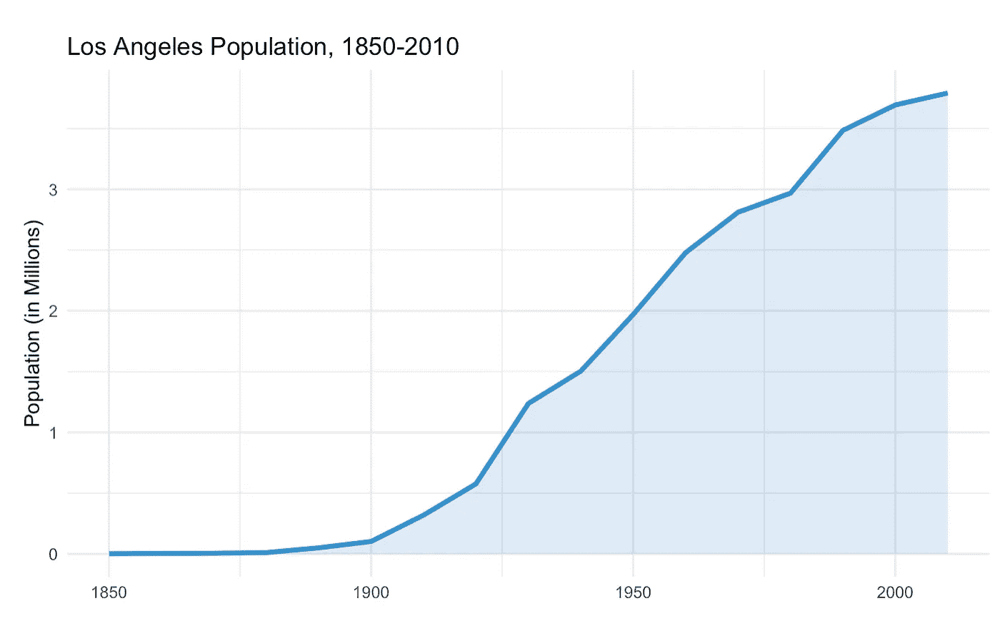

图片作者。数据来源见下文。

## 8.凤凰

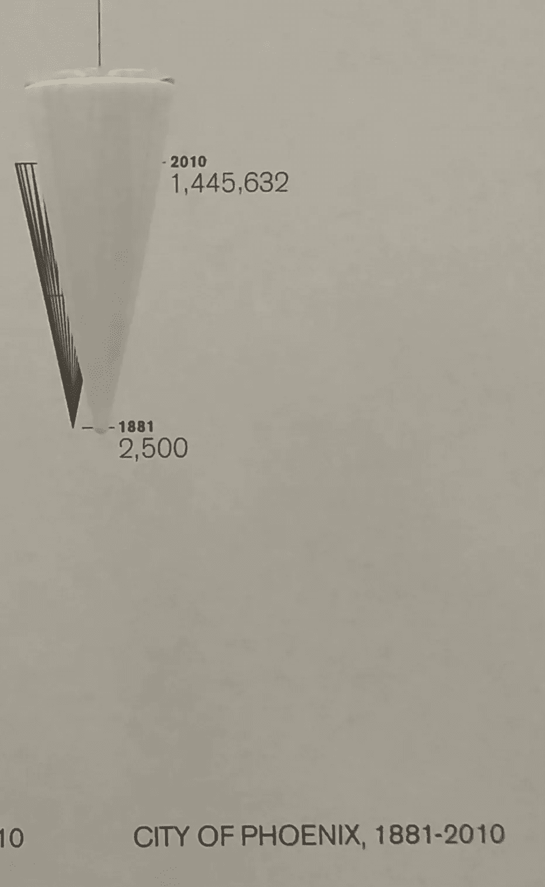

图片作者。摄于德克萨斯州休斯顿的美术博物馆。代表诺伍德·维维亚诺的《城市:背离与偏离》

这个钟摆又是一个类似的故事:城市的整体持续增长被很好地捕捉到了，但根据线图，似乎 1950 年的突破可能提供了凤凰城人口随时间变化的更全面的图片。

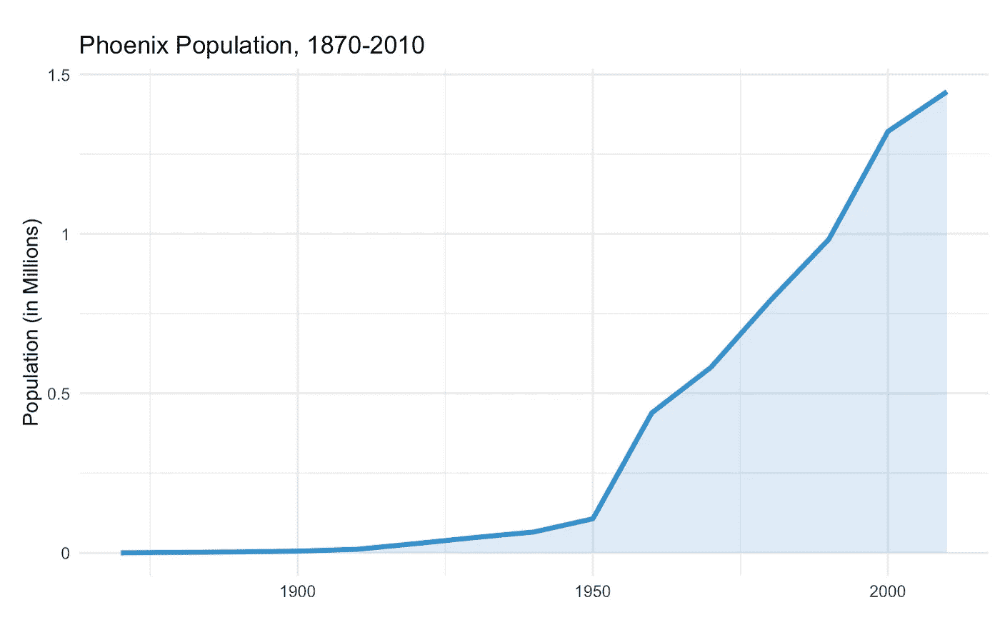

图片作者。数据来源见下文。

## 9.旧金山

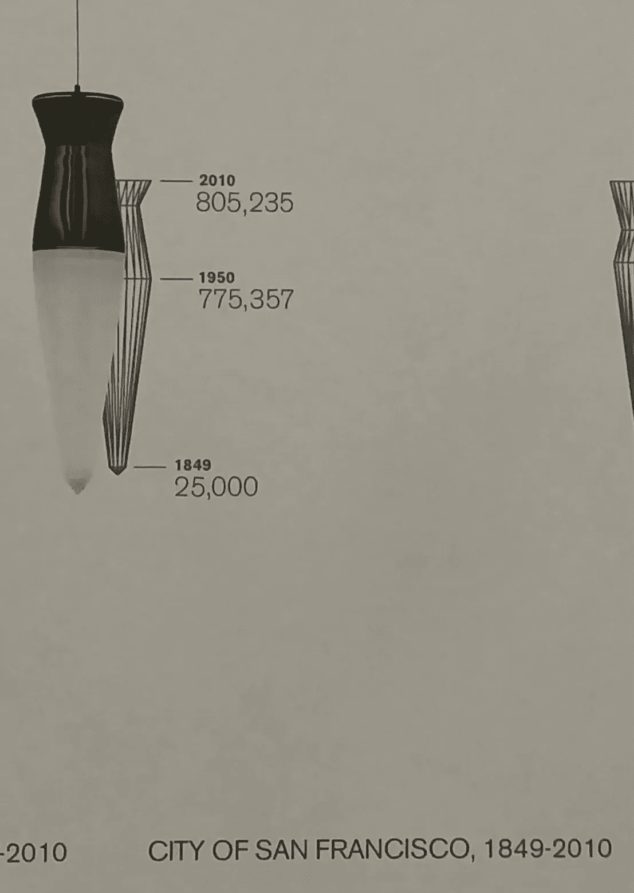

图片作者。摄于德克萨斯州休斯顿的美术博物馆。代表诺伍德·维维亚诺的《城市:背离与偏离》

旧金山特别有意思。钟摆图和折线图都讲述了一个相似的故事，即在 20 世纪后半叶，总人口出现了短暂的下降。尽管这两种可视化类型可能是一致的，但它们都掩盖了这座城市历史上可能最有趣的人口变化:1848 年至 1849 年间，人口增长了 2500%，这与加州淘金热有关。如果你知道你在寻找什么，你肯定能识别这种变化。钟摆的底部有一个代表这种增加的小圆锥，线形图的第一个小而尖的部分也多少捕捉到了这种变化。然而，在这两种设想中，居住在旧金山的人口从 1，000 人突然增加到 25，000 人的规模与代表更近的人口水平所需的规模相比，绝对相形见绌。这个城市人口历史上的重要时刻只在我收集人口数据时看到的一个表格中引起了我的注意，这个表格计算了旧金山每一年人口数据之间的百分比变化。2500%的增长远远高于我在这个项目中见过的任何其他增长，因此它立即引起了我的注意。就像表格在视觉上不能有效表现随时间的变化一样，在这种情况下，一个简单的表格能够引起大多数钟摆图或折线图的观众的注意。

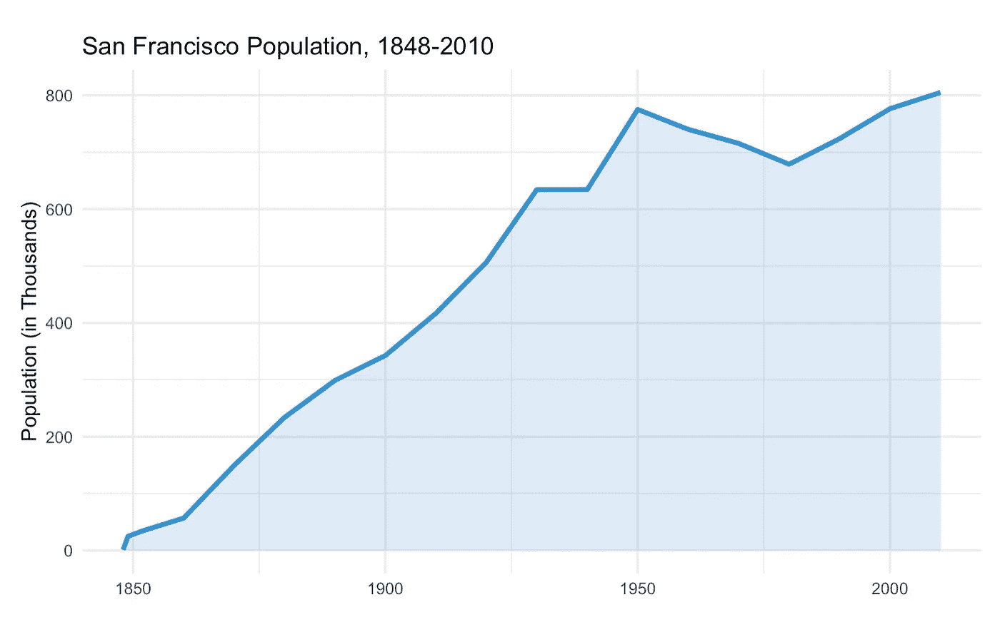

图片作者。数据来源见下文。

## 10.西雅图

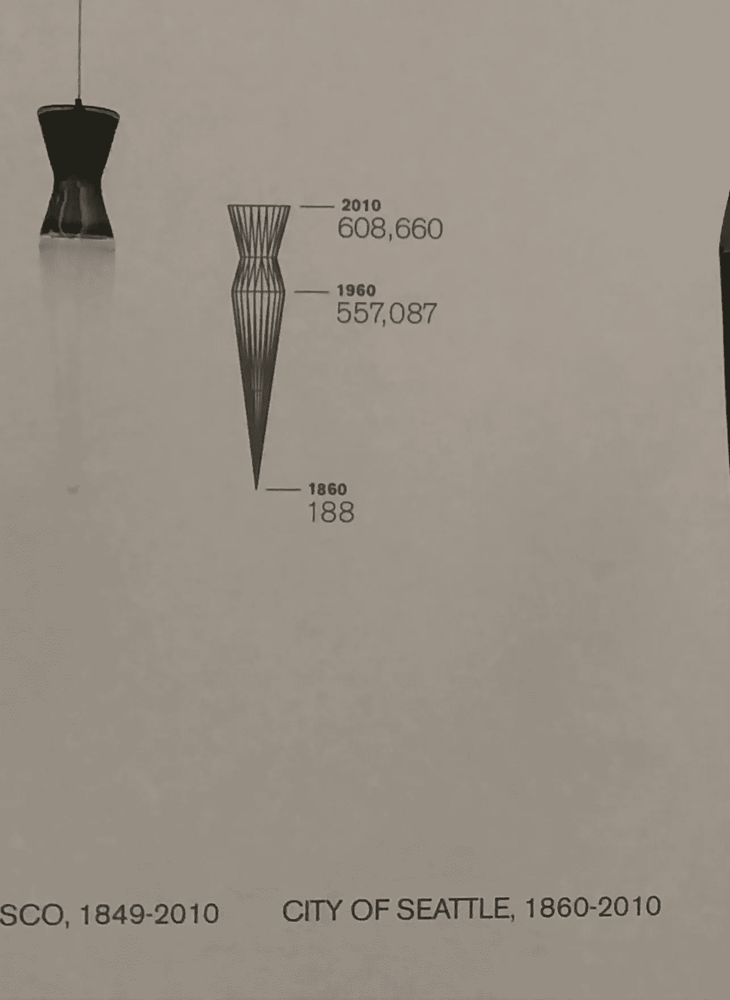

图片作者。摄于德克萨斯州休斯顿的美术博物馆。代表诺伍德·维维亚诺的《城市:背离与偏离》

这最后一个钟摆，代表了西雅图的人口，是我发现非常有效的另一个例子。虽然线形图中一些明显的细微差别消失了，但清晰的线条和对比色传达了西雅图人口随时间变化的非常有效的叙事。

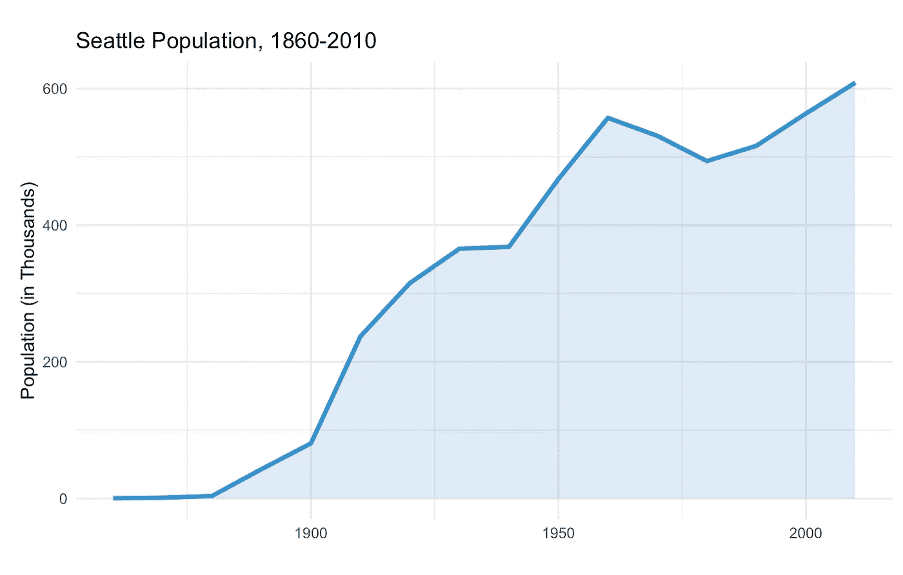

图片作者。数据来源见下文。

# 最后

在许多方面，维维亚诺的工作都非常有效。主要趋势传达得很清楚，在某些情况下比传统的折线图更清楚。

这个展览的 3D 特性可能是它最大的优势。用体积捕捉人口给观察者一种清晰、切实的比例感，这是其他可视化类型所缺乏的。然而，3D 方法的最大好处是它有助于城市之间的比较。折线图有一种趋势，使一切看起来好像是在同一尺度上。上面的每一个线形图在 x 轴上包含的年数方面有所不同，而 y 轴变化如此之大，以至于有些以千为单位，有些以百万为单位。虽然对所有这些地块使用标准化的坐标轴肯定是可能的，但这将使它们更加难以阅读，同时仍然被 Viviano 的方法所掩盖。并排观察这些钟摆，并根据钟摆的相对长度立即了解哪些城市存在的时间最长(或拥有的可用数据量最少)，同时清楚地了解这些城市之间的规模差异(再以纽约和纽瓦克为例)，是非常容易的。虽然线图倾向于让一切看起来好像是在相同的尺度上，但钟摆实际上是在相同的尺度上。

也就是说，任何数据可视化都不可能是完美的。钟摆遗漏了一些趋势和重要的数据点，但是如前所述，观众可能仍然会接受这些可视化，作为一个更完整的故事的代表。更令人担忧的是，如果一个观察者没有用批判的眼光去看这些钟摆或我的线图，他可能会忽略这两种可视化最重要的问题:数据本身的质量。我使用的大部分数据来自美国人口普查，据我所知，维维亚诺自己也使用了大部分数据。人口普查是一个非常有价值的公开数据来源，并提供了一些我们所拥有的最好的人口估计，但它也是出了名的有问题。在人口普查中，许多人口[很可能会被少算](https://journalistsresource.org/environment/2020-census-research-undercount/)，因此在上面的可视化中，包括儿童、租房而非自住的个人、无证件的人以及居住在保留地上的美洲原住民。

我赞扬 Viviano 以一种新颖、有创意的方式将数据可视化，这种方式可能会影响到广泛的受众。但他的工作也提醒了我继续谈论数据复杂性的重要性，以及质疑一组给定数据中可能隐藏的其他故事以及数据本身有效性的绝对必要性。

## 人口数据来源

注意:虽然下面有更多关于原始数据来源的信息，但我使用的绝大多数数据最初来自美国人口普查。

**纽约市:**

1.  [https://www1 . NYC . gov/assets/planning/download/pdf/data-maps/NYC-population/historical-population/1790-2000 _ NYC _ total _ foreign _ birth . pdf](https://www1.nyc.gov/assets/planning/download/pdf/data-maps/nyc-population/historical-population/1790-2000_nyc_total_foreign_birth.pdf)
2.  [https://www1 . NYC . gov/assets/planning/download/pdf/planning-level/NYC-population/historical-population/NYC _ total _ pop _ 1900-2010 . pdf](https://www1.nyc.gov/assets/planning/download/pdf/planning-level/nyc-population/historical-population/nyc_total_pop_1900-2010.pdf)

**纽华克:**

1.  [https://en.wikipedia.org/wiki/Newark,_New_Jersey](https://en.wikipedia.org/wiki/Newark,_New_Jersey)

**波士顿:**

1.  [http://www.iboston.org/mcp.php?pid=popFig](http://www.iboston.org/mcp.php?pid=popFig)
2.  [http://censusviewer.com/city/MA/Boston](http://censusviewer.com/city/MA/Boston)

芝加哥:

1.  [http://physics . bu . edu/~ redner/projects/population/cities/Chicago . html](http://physics.bu.edu/~redner/projects/population/cities/chicago.html)
2.  [http://censusviewer.com/city/IL/Chicago](http://censusviewer.com/city/IL/Chicago)

休斯顿:

1.  [https://www . Houston tx . gov/planning/Demographics/docs _ pdf/Cy/hist _ pop _ 1900 _ 2017 . pdf](https://www.houstontx.gov/planning/Demographics/docs_pdfs/Cy/hist_pop_1900_2017.pdf)
2.  [https://en.wikipedia.org/wiki/Houston](https://en.wikipedia.org/wiki/Houston)

费城:

1.  [https://en.wikipedia.org/wiki/Philadelphia](https://en.wikipedia.org/wiki/Philadelphia)

洛杉矶:

1.  [https://en.wikipedia.org/wiki/Los_Angeles](https://en.wikipedia.org/wiki/Los_Angeles)

**凤凰:**

1.  [https://en.wikipedia.org/wiki/Phoenix,_Arizona](https://en.wikipedia.org/wiki/Phoenix,_Arizona)

旧金山:

1.  [https://en.wikipedia.org/wiki/San_Francisco](https://en.wikipedia.org/wiki/San_Francisco)

**西雅图:**

1.  [https://en.wikipedia.org/wiki/Seattle](https://en.wikipedia.org/wiki/Seattle)

**上图编译的数据和代码见** [**本**](https://github.com/emilyhalford/population_visualizations) **GitHub 回购。**