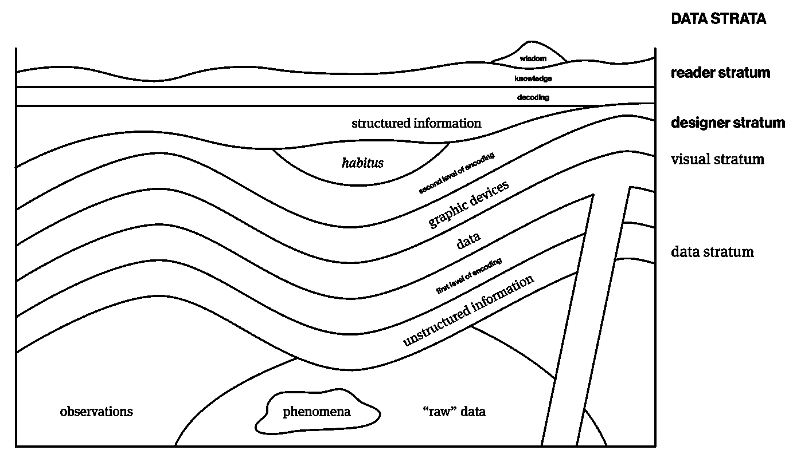
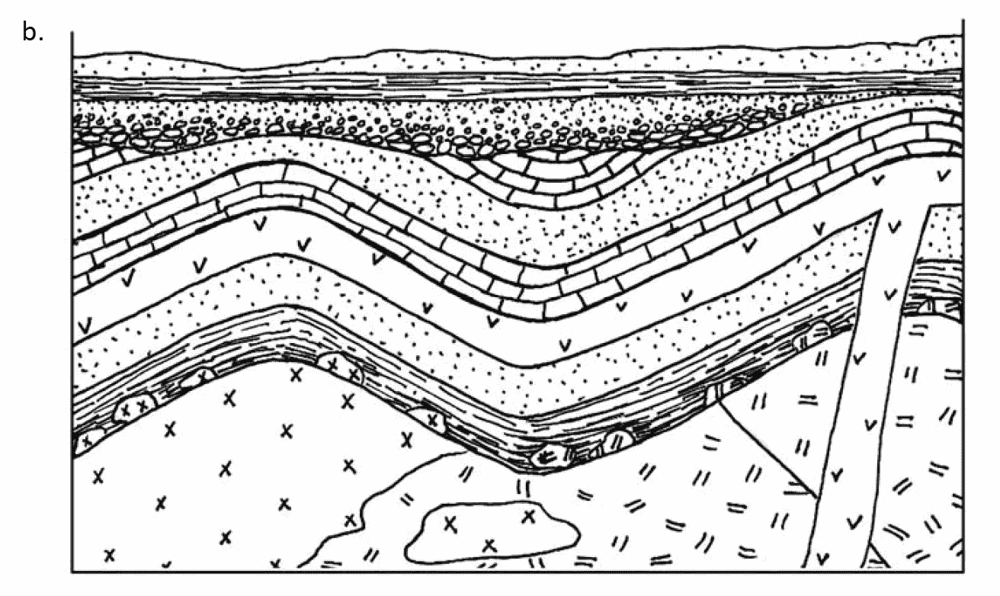
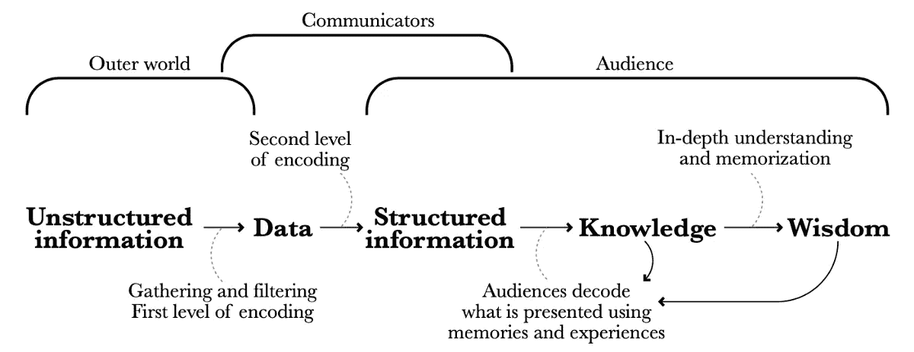

# 数据层

> 原文：<https://towardsdatascience.com/data-strata-6bc0d8484381?source=collection_archive---------34----------------------->

## 揭示数据可视化的中立性和透明性

这篇文章探讨了数据可视化设计中的中立性和透明性问题。更具体地说，它分解了数据可视化的生产和消费中涉及的几个“数据层”，其中，在数字和视觉中，设计者也是其中之一；并随后提出每个阶层应该如何将数据及其可视化视为主观而非客观的实践。最后，它触及了设计者的责任和读者在参与数据可视化设计时的责任。

图片由作者提供，灵感来自[地质剖面图](https://www.chegg.com/homework-help/questions-and-answers/cross-sections-igneous-rocks-indicated-v-x-textures-rocks-sedimentary-unless-otherwise-ind-q49325696#question-transcript)和[数据可视化图](http://www.thefunctionalart.com/p/about-book.html)(原文图片在文末)

## **数据可视化:一个中间环节**

数据可视化通常被描述为结合了许多学科的元素:来自地图学的地图设计原则，来自统计学的在图表中显示数字数据的惯例，来自图形设计的使用类型、布局和颜色的最佳实践，以及来自新闻学的写作和讲故事的原则，等等(Cairo 2013: 23)。虽然这是有利的，因为它允许大量的扩展和变形，但这也意味着数据可视化嵌入了某些预定的期望。主要地，这些与数据可视化的中性(在数据中)和透明(在视觉上)的普遍认知有关。在最近出版的《社会中的数据可视化》(2020)一书中，Kennedy、Weber 和 Engebretsen 将这两个维度定义为*数字阶层*和*视觉阶层* (172)。

关于数字阶层，如何和为什么收集数据的问题可以追溯到最早的笔记实践(git Elman 2013)；然而，数据科学和数据可视化的相关性越来越强，这促使人们质疑我们对数据本身的理解，以及我们如何表述真理的主张(Braun 2017: 9)。在统计学和数据科学领域，数据通常被描述为“原始”状态，因为它代表了从人类代理收集的具有脱离实体性质的现象。而且这种数据往往是数值型的，反过来质疑我们对数字是否中性的认知。18 世纪科学革命在数学真理中的中心地位意味着事实是普遍的，因此永远是预先存在的(Rock 2013: 48)，使得数字“在历史上是可信的，因为它们看起来是普遍的、非个人的和中立的”(Kennedy，Weber，Engebretsen 2020: 172)。随着摄影中机械客观性的兴起，这种看法得到了加强，正如吉特曼指出的那样，“只是在十九世纪中叶才成为科学中的主导理念”——随着第一次摄影过程的出现，“观察者对人类在产生栩栩如生的图像中的作用的明显位移感到震惊”(2013: 5)。这种简单的摄影——一种视觉表现——一种中立感:机械摄影是一种不偏不倚的代理人，而人工绘画则不是。这一点后来受到质疑，但仍然存在于对客观数字的理解和数据可视化的视觉本质中。借用 git Elman(2013)的表述，没有所谓的*原始数据*:这是一种矛盾修饰法。

至于视觉层，首先是平面设计中的形式/内容话语，质疑视觉在平面表现中的“可见”或透明程度。这一点的缩影是 Beatrice Warde 在 1930 年提出的排版要透明，不要妨碍其内容和文本(比喻为一个水晶高脚杯，不会模糊好酒的质量)。外推至数据可视化领域，这相当于爱德华·塔夫特在他有影响力的著作《定量信息的可视化显示》(2001 年)中提出的内容:对他来说，透明性是一种信念，即可视化应该是数据的客观表示，而不是阻碍或扭曲它。但正如迈克尔·洛克指出的，焦点一直错误地集中在高脚杯上，而实际上，*一切都是为了酒* (2013: 92)。第二，就视觉领域而言，图形与视觉有很大关系，从这个意义上说，它与写作的关系大于与口语的关系。正是“文字的视觉本质导致了在口头文化中不可能出现的客观想法”，因为文字“将知者与被知者分开”(Rettberg 2020: 37)。卡尔弗特也认为，语言的口头质量长期以来“被认为是文学审美的核心(……)，而视觉在很大程度上被认为是审美和语义无关的”(2012: 314)。作为图形表示，一方面，数据可视化嵌入了对书写和图形的不信任，另一方面，嵌入了形式透明而不混淆内容的理想。

无论是允许分析和客观立场的视觉，还是数据可视化的定量性质，“赋予他们这种权威感”(Rettberg 2020: 39)，正如 Goatley 在前面段落的大部分讨论中所证明的那样，“这不是美学的问题，而是本体论的问题:图形不会透明地揭示数据——它们创造了对数据的新的主观解释”(2019: 25)。事实上，就像数据不同于它所测量的一样，任何信息的图形表示在现象上都不同于信息本身。

## 设计师阶层

在试图分解数据可视化中的中立性和透明性的含义时，上述论点集中于分析数字和视觉层次。然而，正如 Alberto Cairo 所指出的，在将数据转化为结构化信息的过程中，有一个沟通者赋予了“数据形状”(2013: 16)。通过设计可视化，设计者是整个过程中的一个代理，并且不可避免地是另一个数据片段。就像数字和数据不仅仅存在一样，数据可视化也不存在:它们是为了特定的原因，有目的，由某人创建的。把这个数字带到表面是有意义的，因为是代理人将*的数字阶层*精确地解释为*的视觉阶层*，并且，同样地，在这些话语的中心——设计师阶层本身。他们的角色包括围绕数据和图表的全部或部分思考、收集、记录、绘制、分析、思考、翻译、综合和总结。

## 设计师作为作者

把设计者想象成一个代理人会引起权威性的问题。正如 Michael Rock 指出的那样，在平面设计的论述中，作者身份允许“在一个传统上与交流而不是信息来源更相关的职业中理解设计过程”(2013: 46)。此外，可以认为信息的交流本身就是一种发起行为，因为它意味着由交流者决定的一系列决定。有趣的是，科学和艺术在数据可视化中的相似之处可以在作者的概念中找到。洛克认为，直到最近，文学作品中的无作者文本比有作者的文本更有真实性。他接着说，另一方面，科学文本，“至少在文艺复兴时期，需要作者的名字作为验证”(Rock 2013: 47)。这是因为科学是基于主观发明和科学家的权威，而不是基于客观事实。然而，随着科学革命在数学真理中的中心地位，情况发生了逆转:文学是由作者创作的，而科学是匿名客观性的产物。这种对文本的所有权和授予文学作者的权威“助长了 20 世纪对作者身份的痴迷”(Rock 2013: 48)。图形艺术与文字和图形的本质相关联，采用了许多这样的话语——图形设计也是如此。

数据可视化设计者因此继承了科学家和图形艺术家的无作者性。这种权威的缺乏可以说促成了数据可视化作为客观真理的想法。尽管作者的概念是一个需要考虑的重要因素，因为它将作品背后的*某人*的形象带到了最前面，但更重要的是对*这个人如何*塑造作品的理解才是最需要分析的。无论他们是内容的创造者还是推动者，在我看来，正是设计师的世界观塑造了他们的设计，这可以被称为一种创作模式。设计师是一个交流者，在他们转化为视觉形式的信息中有影响力。

## 作为数据的设计器

设计师阶层给数据阶层带来了什么？作为创造性的实践者，我们把自己带到我们做的每一件事上:正如弗里德曼所说，设计师不是“设计过程本身的中心”，而是“他或她个人感知过程的心理中心”(2001: 39)。我们还“与我们创作的作品有着密切的物理联系，不可避免的是，我们的作品带有我们的印记”(Rock 2013: 95)。同样，这个*个人感知过程*也会影响数据可视化的中立性和透明性。正如 Gitelman 指出的，“不同的可视化效果是不同的，设计得好或不好，所有数据集都可以被多重可视化”(2013: 12)。个人设计，以及关于设计的想法，与更广泛的价值观有关。

正如 Kennedy 和 Engebretsen 所说，“符号资源所承载的潜在意义取决于文化习俗和特定的使用情况，包括人类参与者的背景和动机”(2020:25)；同样，吉尔·辛普森认为数据可视化具有“情境性”(2020: 162)。正如研究人员需要反射性地意识到他们的实践社区如何作用于他们以及他们如何作用于他们(Crouch，Pearce 2012: 42)，设计师也应该对他们的图形制作采取反射性的立场。所有这些影响主体以观众可能看不到的方式塑造了设计，但却带着设计师的印记。

认识到我们都是我们个人生活经验的产物(不忽视我们在更广泛的人类群体中的地位)，是否值得考虑一种更柔和的方法来看待数据可视化设计师？将他们理解为“材料-符号故事讲述者”(沃德 2008: 5)，而不是真理揭示者，设计师是“被赋予创造形式、解决问题、做出判断和赋予意义的能力的专家”(Lupton，Abbot-Miller 1996: 70)？这种反思的立场也应该包括责任，为了产生信任，数据可视化者可能需要相应地开放他们的选择。Lauren Klein 和 Catherine D'Ignazio 发起的“数据女权主义”运动的原则之一是*拥抱多元主义*，提出自我表露和拥抱多元主义如何能够揭露有助于创建数据可视化的决策，以这种方式从当前对客观性的强调转向有利于促进通向多重真理的设计(2020: 125)。也许问题不在于真实性，而在于可靠性，因此设计师可以拒绝透明的话语，而是积极地采取一种反思的立场，在这种立场上，他们能够理解自己和他人在交流和意义构建行为中的意识形态假设之间的关系。

## 朗读者

最后，包围数据层的是一层:读者，这一层的意义制造设备的生产是原因。强调读者作为消费者的责任是很重要的:与其要求数据可视化者一方透明，他们应该承认是否参与数据可视化设计的选择最终取决于他们自己，而且他们必须知道他们不仅在消费其他人的思想产品，还在消费更广泛的讨论的产品。正如 Rock 指出的那样，任何翻译都“反映了原作的特征和当代的精神以及译者的个性”(2013:54)——在最好的情况下，平面设计“只是反映了整个文化已经感受到的情感”(Stinson 2018: np)。正是之前讨论过的与数据、数字、图形和作者的麻烦关系，似乎将设计师与其他知识生产者区分开来，认为作为知识生成的一部分，可视化应该是中立的。但它们就像任何其他人为事件一样，是不完美、主观和复杂的数据的另一个实例(Lupi 2017)。作为读者，挑战在于理解构成设计语言的多种方法，以及决定“如何在我们的设计选择中表达我们个人身份的细微差别”(Rawsthorn 2018: 75)。作为读者，我们也会对自己的选择产生反思。

## 数据层

不要把数据可视化理解为数字和视觉层次的集合，这些层次据称是中立和透明的，合并后更是如此，而应该把重点放在考虑它是一个重新措辞、重新解释和重新呈现内容的独特实体。无论是数据、数据的可视化，还是数据的可视化者，都“不代表先验的真理，而是提供构建的、易错的、主观的世界观”(Goatley 2019: 25)。尽管数据可视化因其继承的历史而在真实性方面受到怀疑，但它越来越成为我们传递信息的一种方式。作为人类，我们所做的一切都是试图理解事物，因此现在“解除怀疑的禁令，充分发挥视觉的潜力，以产生和编码知识作为解释”(德鲁克 2014: 11)。应该更加强调倡导更多的“数据素养”吗？正如 Johanna Drucker 在她的书 *Graphesis* 中漂亮地提出的那样，我们认识到我们的生活在多大程度上是由数据可视化调节和塑造的，这是至关重要的，这需要对我们不断参与的图形领域有更好的理解。我们不应该期待中立和透明的数据可视化的生产和消费，而应该培养更重要的思维，以指导我们所有人处理批判性地参与我们周围的图形设备的能力。

*本文开头的图片是一个建议的图表，它映射了文章中概述的数据可视化所涉及的所有元素。它使用地质“地层”的比喻来证明所有的层，并引用数据可视化与地图制作和图解结构的联系。它基于 Alberto Cairo 的图表*从现实到人们的大脑 *(2013: 16，图 1.8)，以及地球上早期的地质层图表。*

地质地层图。[来源](https://www.chegg.com/homework-help/questions-and-answers/cross-sections-igneous-rocks-indicated-v-x-textures-rocks-sedimentary-unless-otherwise-ind-q49325696#question-transcript)

阿尔贝托·开罗，“从现实到人们的大脑”，来自《功能艺术》。[来源](http://www.thefunctionalart.com/p/about-book.html)

**注释**

1.  因为它们代表数据或信息——也就是说，所使用的数据本身是中立的、无偏见的和客观的。
2.  假设它们是图形性质的(在视觉上映射、渲染、显示、理解和推理信息)，也就是说，所使用的图形设备不应该混淆它们显示的内容。
3.  认识到数据可视化作为探索数据和解释数据的手段的双重角色，这个人物也可以被认为是设计者，甚至是数据本身。

**参考文献**

布劳恩，s。) (2017).*成功的数据可视化*。维多利亚图像出版集团。

开罗(2013 年)。*功能艺术*。旧金山:新骑手。

卡尔弗特，S. (2012)，‘素材，文本-图像’，*创作实践写作杂志* 4: 3，第 309–328 页，doi: 10.1386/jwcp.4.3.309_1

克劳奇，皮尔斯，J. (2012 年)。*做设计研究*。ProQuest 电子书中心。于 2021 年 1 月 10 日在 UAL 创作。布卢姆斯伯里出版公司。

j .德鲁克(2014 年)。*字形*。哈佛:哈佛大学出版社。

D'Ignazio，c .，Klein，L. (2020 年)。*数据女权*。麻省理工学院出版社。

弗里德曼(2001 年)。*创造设计知识:从研究到实践*。IDATER 2000:设计与技术教育研究和课程开发国际会议。

吉特尔曼，l。) (2013).*“原始数据”是一个矛盾修饰法*。坎布里奇:麻省理工学院出版社。Goatley，W. (2019)。*批判性数据美学:走向数据美学的批判性反思实践*。苏塞克斯大学博士论文。

h .肯尼迪、w .韦伯和 m .恩格布雷森(2020 年)。新闻中的数据可视化和透明度。在肯尼迪 h .和 Engebretsen M .(编辑。)，*社会中的数据可视化*(第 169–186 页)。阿姆斯特丹:阿姆斯特丹大学出版社。doi:10.2307/j.ctvzgb8c7.17

Lupi，G. (2017 年 1 月 30 日)。*数据人本主义:数据可视化的革命性未来*。印刷杂志。检索自 http://www . print mag . com/information-design/data-humanism-future-of-data-visualization。

艾博特-米勒(1996 年)。*设计写作研究*。伦敦费登。

Rawsthorn，A. (2018 年)。*设计作为一种态度*。苏黎世:JRP·林格。

Rettberg，J. (2020 年)。数据可视化的认知方式。在 Engebretsen M .和 Kennedy H .(编辑)、*社会中的数据可视化*(第 35–48 页)。阿姆斯特丹:阿姆斯特丹大学出版社。doi:10.2307/j.ctvzgb8c7.8

洛克，硕士(编辑) (2013).*多重签名:针对设计者、作者、读者和用户*。纽约:里佐利。

Stinson，L. (2018) *千禧一代的极简主义正在退场吗？*，AIGA 设计之眼，2021 年 1 月 25 日访问。

沃德，m .，威尔基，A. (2008)。*关键制造:设计注意事项*。设计网络:设计历史学会会议。