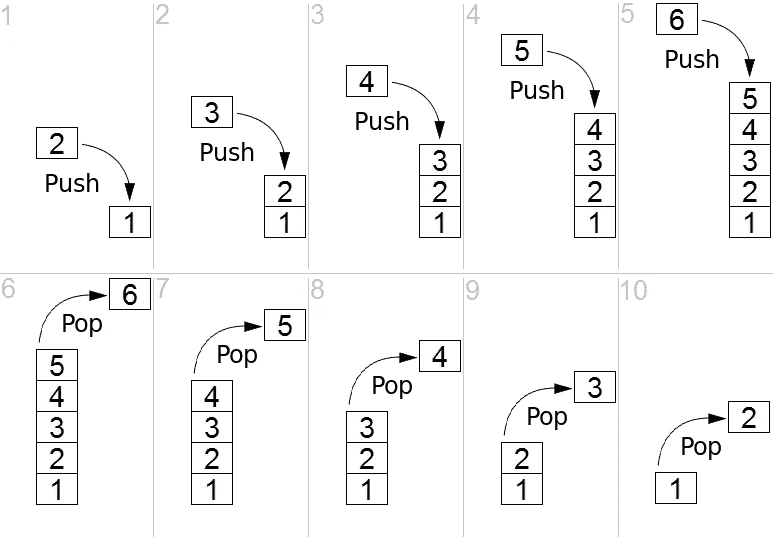
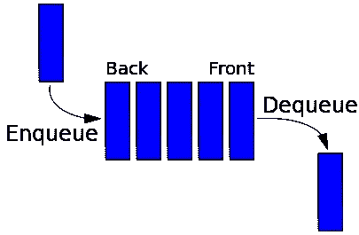
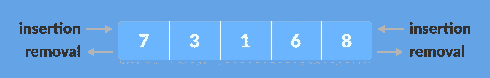

# 使用 Python 的数据结构和算法—在 10 分钟内学会堆栈、队列和队列

> 原文：<https://towardsdatascience.com/data-structures-and-algorithms-with-python-learn-stacks-queues-and-deques-in-10-minutes-e7c6a2a1c5d5?source=collection_archive---------20----------------------->

## 掌握 Python 中的数据结构和算法。包括源代码。

照片由[罗汉 G](https://unsplash.com/@rohan_g?utm_source=unsplash&utm_medium=referral&utm_content=creditCopyText) 在 [Unsplash](https://unsplash.com/s/photos/abstract?utm_source=unsplash&utm_medium=referral&utm_content=creditCopyText) 上拍摄

今天的文章是关于 Python 的数据结构和算法的介绍。我们将从简单的开始，在这个过程中，您将了解三种基本的数据结构——堆栈、队列和队列。

此外，您将学习如何从头开始实现它们。开始吧！

这篇文章的结构如下:

*   大量
*   行列
*   德克
*   最后的话

# 大量

先说最简单的。您可以将堆栈视为有序的数组，其中条目的添加和移除都发生在同一端。堆栈基于后进先出原则(*后进先出*)。这意味着最先删除的是最近的项目。

让我们来看一个示例图:

图 1 —堆栈图(来源:[computersciencewiki.org](https://computersciencewiki.org/index.php/Stack))

正如你所看到的，LIFO 原则是栈数据结构的本质。堆栈开始处的项目(称为*基*)在堆栈中最长。

***堆栈示例****:web 浏览器中的后退按钮。*当你浏览页面并想返回时，最近的网站被关闭，或者弹出一个堆栈。

就实现而言，`Stack`类将需要三个方法(加上构造函数):

*   `push(value) -> None` —将值添加到堆栈中
*   `pop() -> Any` —从堆栈中删除最近的值
*   `is_empty() -> bool` —检查堆栈中是否有项目

下面是用 Python 从头开始实现堆栈的代码:

让我们做几个测试:

正如您所看到的，堆栈数据结构像宣传的那样工作。让我们探索下一个。

# 行列

与堆栈不同，向队列添加项发生在数组的开头(索引位置 0)，而移除发生在相反的一端。这个原则更广为人知的是 FIFO ( *先进先出*)原则。因此，最近添加的项目必须等待其他项目被处理。

让我们来看一个示例图:

图 2 —排队图(来源:[computersciencewiki.org](https://computersciencewiki.org/index.php/Queue)

看一下上面的图表应该会有一些印象，因为它看起来和日常情况很相似。

***排队举例*** *:基本上你站在*的任何一条线上——从杂货店、自助餐厅，到医生办公室——第一个排队的人最先出队。

就实现而言，`Queue`类将需要四个方法(加上构造函数):

*   `enqueue(value) -> None` —将新项目添加到队列的末尾
*   `dequeue() -> Any` —删除队列中的第一个项目
*   `is_empty() -> bool` —检查队列中是否有项目
*   `peek() -> Any` —返回队列中的第一个项目，但不删除它

下面是用 Python 从头开始实现队列的代码:

让我们做几个测试:

这就是全部了。您可以自由地实现额外的方法或执行进一步的检查，但是脚本中的方法应该足够了。

# 德克

deque 数据结构与前两种非常相似，但不需要 LIFO 或 FIFO 排序。与堆栈和队列不同，deques 有两端，您可以在任一端添加和移除项目。

让我们来看一个示例图:

图 3 —德克图(来源:[programiz.org](https://www.programiz.com/dsa/deque))

总而言之，deque 是一种混合数据结构，它实现了堆栈和队列的所有功能。

就实现而言，`Deque`类将需要五个方法(加上构造函数):

*   `add_front(value: Any) -> None` —将新项目添加到队列的前面
*   `add_rear(value: Any) -> None` —在队列末尾添加一个新项目
*   `remove_front() -> Any` —从队列中返回第一个项目并删除它
*   `remove_rear() -> Any` —返回队列中的最后一个项目并删除它
*   `is_empty() -> bool` —检查队列中是否有项目

下面是用 Python 从头开始实现队列的代码:

让我们做几个测试:

这都是关于德克人的！接下来让我们总结一下。

# 最后的话

今天，您已经学习了三种基本的数据结构——栈、队列和 deck——并在 Python 中从头开始实现了它们。根据您试图实现的逻辑，这些对于解决不同的编程任务会很方便。

还有，从零开始实现这些或者基于它们执行一些操作，有时候会成为一个编码面试问题，所以适当学习一下也无妨。

请继续关注 Python 系列的其余*数据结构和算法，其中我们将探索不同的主题，如链表、递归、树、搜索、排序等。*

感谢阅读。

*喜欢这篇文章吗？成为* [*中等会员*](https://medium.com/@radecicdario/membership) *继续无限制学习。如果你使用下面的链接，我会收到你的一部分会员费，不需要你额外付费。*

<https://medium.com/@radecicdario/membership>  

# 了解更多信息

*   [我作为数据科学家卖掉我的 M1 Macbook Pro 的三大理由](/top-3-reasons-why-i-sold-my-m1-macbook-pro-as-a-data-scientist-abad1226f52a)
*   [如何使用 Cron 调度 Python 脚本——您需要的唯一指南](/how-to-schedule-python-scripts-with-cron-the-only-guide-youll-ever-need-deea2df63b4e)
*   [Dask 延迟—如何轻松并行化您的 Python 代码](/dask-delayed-how-to-parallelize-your-python-code-with-ease-19382e159849)
*   [如何使用 Python 创建 PDF 报告—基本指南](/how-to-create-pdf-reports-with-python-the-essential-guide-c08dd3ebf2ee)
*   [即使没有大学文凭也要在 2021 年成为数据科学家](/become-a-data-scientist-in-2021-even-without-a-college-degree-e43fa934e55)

# 保持联系

*   关注我在[媒体](https://medium.com/@radecicdario)上的更多类似的故事
*   注册我的[简讯](https://mailchi.mp/46a3d2989d9b/bdssubscribe)
*   在 [LinkedIn](https://www.linkedin.com/in/darioradecic/) 上连接